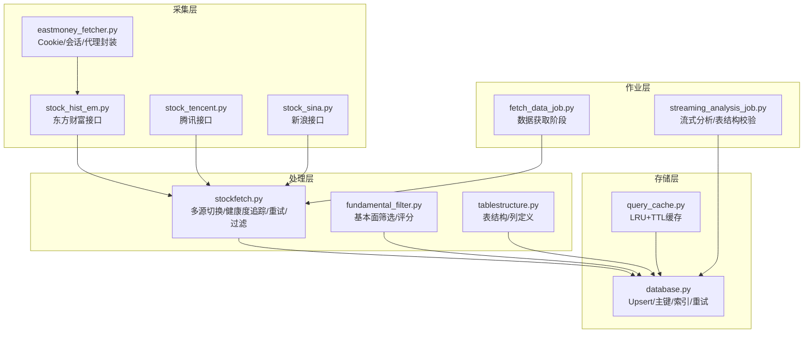
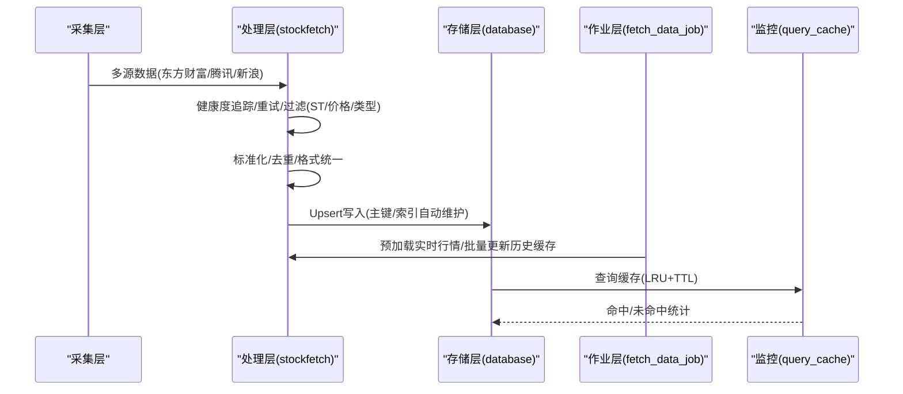
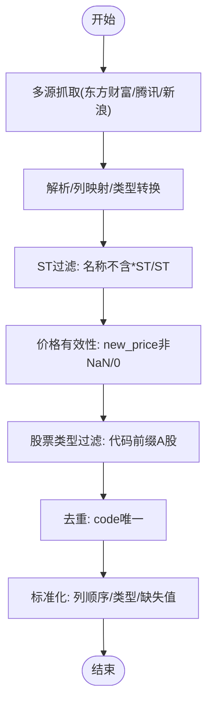
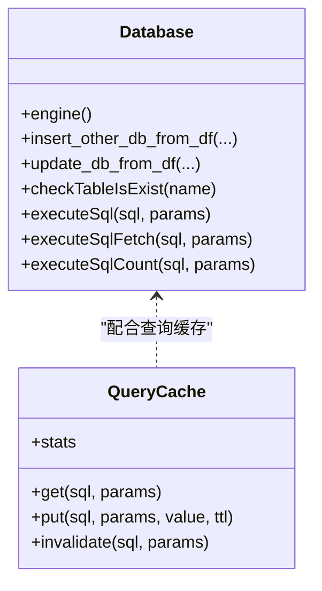
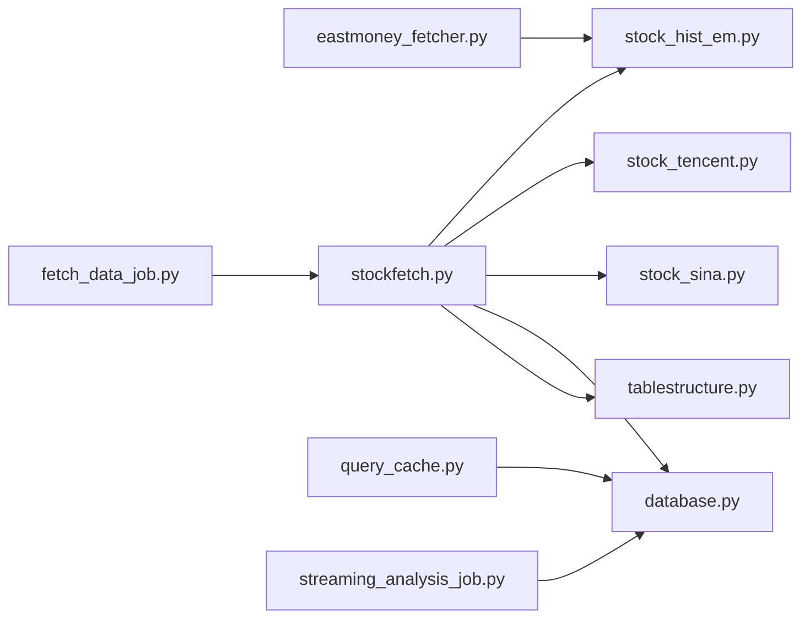

# 数据质量控制

<cite>
**本文引用的文件**
- [quantia/core/crawling/stock_hist_em.py](file://quantia/core/crawling/stock_hist_em.py)
- [quantia/core/crawling/stock_sina.py](file://quantia/core/crawling/stock_sina.py)
- [quantia/core/crawling/stock_tencent.py](file://quantia/core/crawling/stock_tencent.py)
- [quantia/lib/database.py](file://quantia/lib/database.py)
- [quantia/job/fetch_data_job.py](file://quantia/job/fetch_data_job.py)
- [quantia/core/stockfetch.py](file://quantia/core/stockfetch.py)
- [quantia/core/eastmoney_fetcher.py](file://quantia/core/eastmoney_fetcher.py)
- [quantia/lib/query_cache.py](file://quantia/lib/query_cache.py)
- [quantia/core/tablestructure.py](file://quantia/core/tablestructure.py)
- [quantia/core/strategy/fundamental/fundamental_filter.py](file://quantia/core/strategy/fundamental/fundamental_filter.py)
- [quantia/job/streaming_analysis_job.py](file://quantia/job/streaming_analysis_job.py)
</cite>

## 目录
1. [简介](#简介)
2. [项目结构](#项目结构)
3. [核心组件](#核心组件)
4. [架构总览](#架构总览)
5. [详细组件分析](#详细组件分析)
6. [依赖分析](#依赖分析)
7. [性能考虑](#性能考虑)
8. [故障排查指南](#故障排查指南)
9. [结论](#结论)
10. [附录](#附录)

## 简介
本文件系统化梳理本项目的数据质量控制体系，覆盖数据验证机制、清洗流程、异常数据处理、完整性检查、过滤规则（ST过滤、价格有效性检查、股票类型过滤）、标准化与去重、格式统一、监控与异常检测、修复策略与质量报告生成，以及最佳实践与性能优化建议。目标是帮助开发者建立可靠的数据质量保障体系。

## 项目结构
围绕数据质量控制的关键模块包括：
- 数据采集层：多源数据抓取与解析（东方财富、腾讯、新浪）
- 数据接入层：数据库写入、Upsert、主键/索引管理
- 数据处理层：数据清洗、标准化、过滤、去重
- 数据存储层：表结构定义、缓存与查询优化
- 作业调度层：数据获取与分析的阶段化执行
- 质量监控层：表结构一致性校验、异常检测与修复

**图表来源**
- [quantia/core/crawling/stock_hist_em.py](file://quantia/core/crawling/stock_hist_em.py#L1-L551)
- [quantia/core/crawling/stock_tencent.py](file://quantia/core/crawling/stock_tencent.py#L1-L230)
- [quantia/core/crawling/stock_sina.py](file://quantia/core/crawling/stock_sina.py#L1-L243)
- [quantia/core/eastmoney_fetcher.py](file://quantia/core/eastmoney_fetcher.py#L1-L149)
- [quantia/core/stockfetch.py](file://quantia/core/stockfetch.py#L1-L800)
- [quantia/core/strategy/fundamental/fundamental_filter.py](file://quantia/core/strategy/fundamental/fundamental_filter.py#L1-L698)
- [quantia/core/tablestructure.py](file://quantia/core/tablestructure.py#L1-L800)
- [quantia/lib/database.py](file://quantia/lib/database.py#L1-L304)
- [quantia/lib/query_cache.py](file://quantia/lib/query_cache.py#L1-L156)
- [quantia/job/fetch_data_job.py](file://quantia/job/fetch_data_job.py#L1-L119)
- [quantia/job/streaming_analysis_job.py](file://quantia/job/streaming_analysis_job.py#L319-L348)

**章节来源**
- [quantia/core/crawling/stock_hist_em.py](file://quantia/core/crawling/stock_hist_em.py#L1-L551)
- [quantia/core/crawling/stock_tencent.py](file://quantia/core/crawling/stock_tencent.py#L1-L230)
- [quantia/core/crawling/stock_sina.py](file://quantia/core/crawling/stock_sina.py#L1-L243)
- [quantia/core/eastmoney_fetcher.py](file://quantia/core/eastmoney_fetcher.py#L1-L149)
- [quantia/core/stockfetch.py](file://quantia/core/stockfetch.py#L1-L800)
- [quantia/core/strategy/fundamental/fundamental_filter.py](file://quantia/core/strategy/fundamental/fundamental_filter.py#L1-L698)
- [quantia/core/tablestructure.py](file://quantia/core/tablestructure.py#L1-L800)
- [quantia/lib/database.py](file://quantia/lib/database.py#L1-L304)
- [quantia/lib/query_cache.py](file://quantia/lib/query_cache.py#L1-L156)
- [quantia/job/fetch_data_job.py](file://quantia/job/fetch_data_job.py#L1-L119)
- [quantia/job/streaming_analysis_job.py](file://quantia/job/streaming_analysis_job.py#L319-L348)

## 核心组件
- 数据采集与解析
  - 多源接口：东方财富、腾讯、新浪，统一返回结构并进行类型转换与缺失值处理
  - Cookie/会话/代理封装，避免请求失败与风控
- 数据接入与持久化
  - Upsert写入、主键/索引自动维护、瞬态错误重试与连接池清理
- 数据处理与清洗
  - 多层过滤：ST过滤、价格有效性、股票类型过滤、重复去重
  - 标准化与格式统一：列顺序、数据类型、缺失值填充
- 质量监控与修复
  - 表结构一致性校验、Schema不兼容自动重建
  - 缓存命中率统计与TTL控制
- 作业编排
  - 分阶段执行：数据获取、缓存更新、分析与入库

**章节来源**
- [quantia/core/stockfetch.py](file://quantia/core/stockfetch.py#L302-L345)
- [quantia/lib/database.py](file://quantia/lib/database.py#L94-L203)
- [quantia/job/fetch_data_job.py](file://quantia/job/fetch_data_job.py#L38-L108)
- [quantia/job/streaming_analysis_job.py](file://quantia/job/streaming_analysis_job.py#L319-L348)
- [quantia/lib/query_cache.py](file://quantia/lib/query_cache.py#L27-L156)

## 架构总览
数据从采集层进入，经处理层清洗与标准化，最终写入数据库并由作业层驱动阶段性执行，同时通过缓存与监控保障质量与性能。

**图表来源**
- [quantia/core/stockfetch.py](file://quantia/core/stockfetch.py#L302-L345)
- [quantia/lib/database.py](file://quantia/lib/database.py#L94-L203)
- [quantia/job/fetch_data_job.py](file://quantia/job/fetch_data_job.py#L38-L108)
- [quantia/lib/query_cache.py](file://quantia/lib/query_cache.py#L27-L156)

## 详细组件分析

### 数据采集与解析（ST过滤、价格有效性、股票类型过滤）
- ST过滤：通过名称前缀判断剔除ST/.*ST股票
- 价格有效性：剔除NaN或无效价格标记的记录
- 股票类型过滤：仅保留A股代码（600/601/603/605/000/001/002/003/300/301开头）
- 多源解析：统一列顺序、数值类型转换、缺失值填充
- 备选源：当首选源失败时自动切换至备选源（腾讯/新浪）

**图表来源**
- [quantia/core/stockfetch.py](file://quantia/core/stockfetch.py#L209-L221)
- [quantia/core/stockfetch.py](file://quantia/core/stockfetch.py#L302-L345)
- [quantia/core/crawling/stock_hist_em.py](file://quantia/core/crawling/stock_hist_em.py#L150-L188)
- [quantia/core/crawling/stock_tencent.py](file://quantia/core/crawling/stock_tencent.py#L214-L229)
- [quantia/core/crawling/stock_sina.py](file://quantia/core/crawling/stock_sina.py#L227-L242)

**章节来源**
- [quantia/core/stockfetch.py](file://quantia/core/stockfetch.py#L209-L221)
- [quantia/core/stockfetch.py](file://quantia/core/stockfetch.py#L302-L345)
- [quantia/core/crawling/stock_hist_em.py](file://quantia/core/crawling/stock_hist_em.py#L150-L188)
- [quantia/core/crawling/stock_tencent.py](file://quantia/core/crawling/stock_tencent.py#L214-L229)
- [quantia/core/crawling/stock_sina.py](file://quantia/core/crawling/stock_sina.py#L227-L242)

### 数据标准化与格式统一
- 列顺序统一：按表结构定义的列顺序排列
- 数据类型转换：数值列统一为浮点/整型，日期列统一为datetime
- 缺失值处理：数值列缺失填充为0或合适默认值
- 字段映射：不同数据源字段名映射到统一字段名

**章节来源**
- [quantia/core/crawling/stock_hist_em.py](file://quantia/core/crawling/stock_hist_em.py#L106-L149)
- [quantia/core/crawling/stock_tencent.py](file://quantia/core/crawling/stock_tencent.py#L194-L212)
- [quantia/core/crawling/stock_sina.py](file://quantia/core/crawling/stock_sina.py#L207-L225)
- [quantia/core/tablestructure.py](file://quantia/core/tablestructure.py#L63-L104)

### 数据清洗与去重
- 去重策略：按code列去重，保留最后一条
- 重复数据处理：在写入前进行去重，避免重复主键冲突
- 缺失列补齐：若数据源缺失列，按表结构定义补齐默认值

**章节来源**
- [quantia/core/stockfetch.py](file://quantia/core/stockfetch.py#L414-L422)
- [quantia/lib/database.py](file://quantia/lib/database.py#L149-L150)

### 数据库写入与主键/索引管理
- Upsert写入：INSERT ... ON DUPLICATE KEY UPDATE，避免主键冲突
- 主键/索引自动维护：首次写入时检测并创建主键与索引
- 瞬态错误重试：对死锁、锁超时、连接异常等进行重试与连接池清理
- 连接池配置：小规模服务器优化配置，避免资源占用过高

**图表来源**
- [quantia/lib/database.py](file://quantia/lib/database.py#L60-L203)
- [quantia/lib/query_cache.py](file://quantia/lib/query_cache.py#L27-L156)

**章节来源**
- [quantia/lib/database.py](file://quantia/lib/database.py#L94-L203)
- [quantia/lib/query_cache.py](file://quantia/lib/query_cache.py#L27-L156)

### 数据质量监控与异常检测
- 数据源健康度追踪：连续失败触发降级，冷却时间指数退避
- 聚合日志：同源连续失败聚合输出，避免刷屏
- 表结构一致性校验：Schema不兼容自动重建旧表
- 缓存命中统计：命中/未命中计数与命中率展示

**章节来源**
- [quantia/core/stockfetch.py](file://quantia/core/stockfetch.py#L47-L123)
- [quantia/core/stockfetch.py](file://quantia/core/stockfetch.py#L140-L168)
- [quantia/job/streaming_analysis_job.py](file://quantia/job/streaming_analysis_job.py#L319-L348)
- [quantia/lib/query_cache.py](file://quantia/lib/query_cache.py#L124-L136)

### 数据修复策略与质量报告
- 自动修复：表结构不兼容时删除旧表，后续写入自动重建
- 质量报告：缓存命中率、数据源健康度、写入重试次数与错误类型统计
- 重试策略：指数退避+抖动，避免惊群效应；代理失败自动切换

**章节来源**
- [quantia/job/streaming_analysis_job.py](file://quantia/job/streaming_analysis_job.py#L319-L348)
- [quantia/lib/database.py](file://quantia/lib/database.py#L152-L184)
- [quantia/core/stockfetch.py](file://quantia/core/stockfetch.py#L170-L184)

### 作业编排与阶段性执行
- 数据获取阶段：清理缓存、预加载实时行情、批量更新历史K线缓存
- 分离获取与分析：数据获取失败不影响后续分析（缓存可用）

**章节来源**
- [quantia/job/fetch_data_job.py](file://quantia/job/fetch_data_job.py#L38-L108)

## 依赖分析
- 数据采集依赖：eastmoney_fetcher封装Cookie/会话/代理，统一请求行为
- 处理依赖：stockfetch负责多源切换、健康度追踪、过滤与标准化
- 存储依赖：database提供Upsert、主键/索引管理、重试与连接池
- 监控依赖：query_cache提供LRU+TTL缓存，支持统计与失效

**图表来源**
- [quantia/core/eastmoney_fetcher.py](file://quantia/core/eastmoney_fetcher.py#L1-L149)
- [quantia/core/crawling/stock_hist_em.py](file://quantia/core/crawling/stock_hist_em.py#L1-L551)
- [quantia/core/crawling/stock_tencent.py](file://quantia/core/crawling/stock_tencent.py#L1-L230)
- [quantia/core/crawling/stock_sina.py](file://quantia/core/crawling/stock_sina.py#L1-L243)
- [quantia/core/stockfetch.py](file://quantia/core/stockfetch.py#L1-L800)
- [quantia/lib/database.py](file://quantia/lib/database.py#L1-L304)
- [quantia/lib/query_cache.py](file://quantia/lib/query_cache.py#L1-L156)
- [quantia/job/fetch_data_job.py](file://quantia/job/fetch_data_job.py#L1-L119)
- [quantia/job/streaming_analysis_job.py](file://quantia/job/streaming_analysis_job.py#L319-L348)

**章节来源**
- [quantia/core/eastmoney_fetcher.py](file://quantia/core/eastmoney_fetcher.py#L1-L149)
- [quantia/core/stockfetch.py](file://quantia/core/stockfetch.py#L1-L800)
- [quantia/lib/database.py](file://quantia/lib/database.py#L1-L304)
- [quantia/lib/query_cache.py](file://quantia/lib/query_cache.py#L1-L156)
- [quantia/job/fetch_data_job.py](file://quantia/job/fetch_data_job.py#L1-L119)
- [quantia/job/streaming_analysis_job.py](file://quantia/job/streaming_analysis_job.py#L319-L348)

## 性能考虑
- 连接池与并发：数据库连接池小而精，避免高并发下的资源争用
- 重试与退避：指数退避+抖动，降低瞬时重试风暴
- 缓存策略：LRU+TTL，热点数据快速命中，避免重复查询
- I/O优化：批量写入、Upsert减少主键冲突与重复插入
- 代理与请求：按需缩短代理超时，避免长时间等待失效代理

[本节为通用指导，无需特定文件引用]

## 故障排查指南
- 数据源失败频繁
  - 检查健康度追踪日志，确认是否触发降级与冷却
  - 查看聚合日志，定位连续失败的源与错误类型
- 写入失败
  - 关注瞬态错误（死锁、锁超时、连接异常），系统会自动重试与连接池清理
  - 检查主键/索引是否已创建，必要时允许自动创建
- 表结构不兼容
  - 若代码定义列与数据库缺失列不一致，系统会删除旧表并自动重建
- 缓存命中率低
  - 调整缓存大小与TTL，观察命中率统计

**章节来源**
- [quantia/core/stockfetch.py](file://quantia/core/stockfetch.py#L47-L123)
- [quantia/core/stockfetch.py](file://quantia/core/stockfetch.py#L140-L168)
- [quantia/lib/database.py](file://quantia/lib/database.py#L152-L184)
- [quantia/job/streaming_analysis_job.py](file://quantia/job/streaming_analysis_job.py#L319-L348)
- [quantia/lib/query_cache.py](file://quantia/lib/query_cache.py#L124-L136)

## 结论
本项目通过多源采集、健康度追踪、标准化与去重、Upsert写入、表结构一致性校验与缓存监控，构建了完整的数据质量控制闭环。结合重试与退避策略，能够在外部数据源不稳定的情况下保持系统的鲁棒性与可靠性。建议在生产环境中持续关注缓存命中率、数据源健康度与写入重试统计，以进一步优化性能与稳定性。

## 附录
- 最佳实践
  - 明确数据源优先级与备选策略，启用健康度追踪与降级
  - 在写入前进行严格的过滤与去重，确保主键唯一
  - 使用Upsert与自动主键/索引维护，简化重复入库逻辑
  - 启用缓存并定期检查命中率，优化热点查询
  - 对表结构变更进行兼容性检查，必要时自动重建
- 性能优化建议
  - 控制数据库连接池规模，避免高并发下的资源瓶颈
  - 合理设置重试次数与退避参数，避免惊群效应
  - 对高频查询启用缓存，减少数据库压力
  - 分批写入与批量更新，提升吞吐量

[本节为通用指导，无需特定文件引用]
