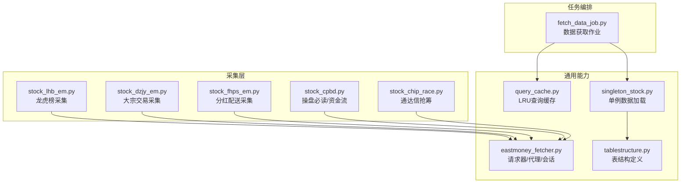
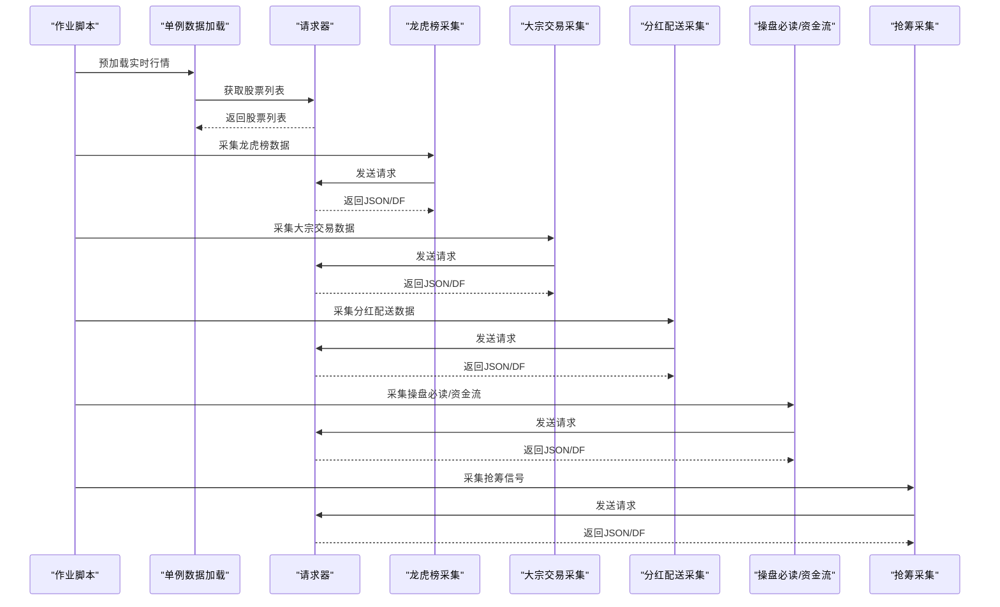
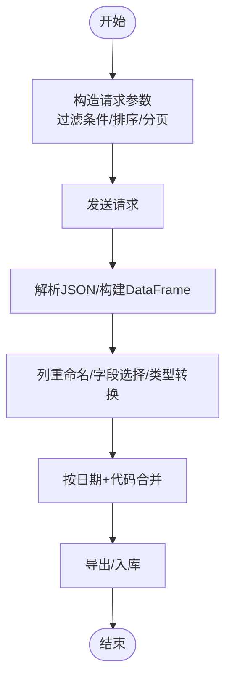
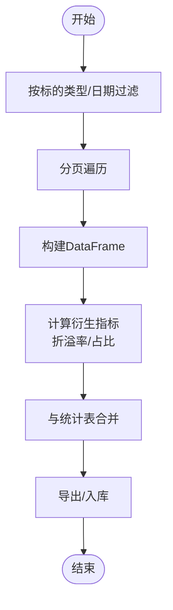
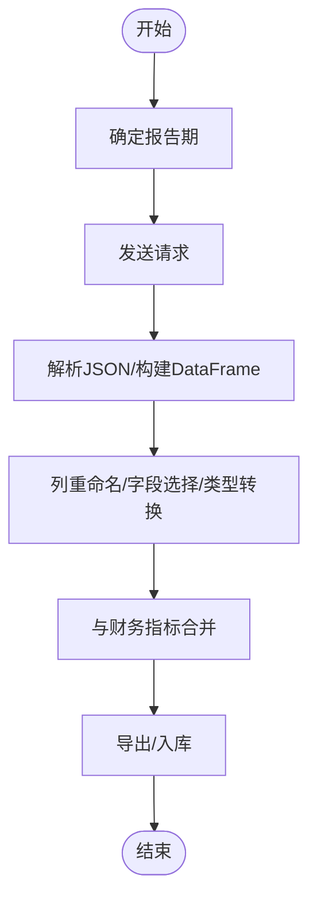
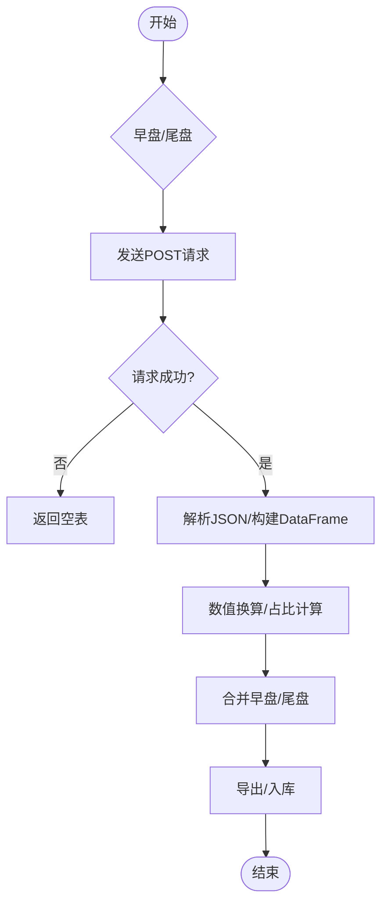
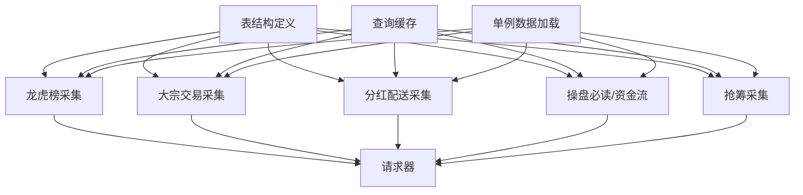

# 特殊股票数据

<cite>
**本文引用的文件**
- [quantia/core/crawling/stock_lhb_em.py](file://quantia/core/crawling/stock_lhb_em.py)
- [quantia/core/crawling/stock_dzjy_em.py](file://quantia/core/crawling/stock_dzjy_em.py)
- [quantia/core/crawling/stock_fhps_em.py](file://quantia/core/crawling/stock_fhps_em.py)
- [quantia/core/crawling/stock_cpbd.py](file://quantia/core/crawling/stock_cpbd.py)
- [quantia/core/crawling/stock_chip_race.py](file://quantia/core/crawling/stock_chip_race.py)
- [quantia/core/eastmoney_fetcher.py](file://quantia/core/eastmoney_fetcher.py)
- [quantia/core/tablestructure.py](file://quantia/core/tablestructure.py)
- [quantia/lib/query_cache.py](file://quantia/lib/query_cache.py)
- [quantia/core/singleton_stock.py](file://quantia/core/singleton_stock.py)
- [quantia/job/fetch_data_job.py](file://quantia/job/fetch_data_job.py)
</cite>

## 目录
1. [简介](#简介)
2. [项目结构](#项目结构)
3. [核心组件](#核心组件)
4. [架构总览](#架构总览)
5. [详细组件分析](#详细组件分析)
6. [依赖分析](#依赖分析)
7. [性能考虑](#性能考虑)
8. [故障排查指南](#故障排查指南)
9. [结论](#结论)
10. [附录](#附录)

## 简介
本文件聚焦于“特殊股票数据”的采集与处理，涵盖以下四类数据：
- 龙虎榜数据：包括个股龙虎榜详情、机构统计、活跃营业部等
- 大宗交易数据：包括市场统计、每日明细、每日统计、活跃统计等
- 分红配送数据：按报告期解析送转与现金分红信息
- 筹码分布相关：包含“通达信抢筹”（早盘/尾盘）等高频行为信号

文档将系统阐述数据源特点、数据格式差异、字段映射规则、数据合并策略，并提供质量控制、异常处理与数据完整性验证建议，以及性能优化与存储策略，帮助开发者正确处理与分析这些特殊数据。

## 项目结构
围绕特殊数据的采集与处理，项目采用“数据源封装 + 采集模块 + 表结构定义 + 缓存与单例 + 任务编排”的分层组织方式：
- 数据源封装：统一的请求器负责 Cookie 管理、会话与代理池
- 采集模块：针对不同数据源实现具体接口，统一输出结构化 DataFrame
- 表结构定义：集中定义各表的列名、类型与中文注释，便于入库与跨模块复用
- 缓存与单例：LRU 查询缓存与单例模式，降低重复查询与内存占用
- 任务编排：作业脚本集中调度数据获取流程

图表来源
- [quantia/core/crawling/stock_lhb_em.py](file://quantia/core/crawling/stock_lhb_em.py#L1-L911)
- [quantia/core/crawling/stock_dzjy_em.py](file://quantia/core/crawling/stock_dzjy_em.py#L1-L555)
- [quantia/core/crawling/stock_fhps_em.py](file://quantia/core/crawling/stock_fhps_em.py#L1-L152)
- [quantia/core/crawling/stock_cpbd.py](file://quantia/core/crawling/stock_cpbd.py#L1-L141)
- [quantia/core/crawling/stock_chip_race.py](file://quantia/core/crawling/stock_chip_race.py#L1-L177)
- [quantia/core/eastmoney_fetcher.py](file://quantia/core/eastmoney_fetcher.py#L1-L149)
- [quantia/lib/query_cache.py](file://quantia/lib/query_cache.py#L1-L156)
- [quantia/core/singleton_stock.py](file://quantia/core/singleton_stock.py#L1-L116)
- [quantia/core/tablestructure.py](file://quantia/core/tablestructure.py#L1-L1137)
- [quantia/job/fetch_data_job.py](file://quantia/job/fetch_data_job.py#L1-L119)

章节来源
- [quantia/core/crawling/stock_lhb_em.py](file://quantia/core/crawling/stock_lhb_em.py#L1-L911)
- [quantia/core/crawling/stock_dzjy_em.py](file://quantia/core/crawling/stock_dzjy_em.py#L1-L555)
- [quantia/core/crawling/stock_fhps_em.py](file://quantia/core/crawling/stock_fhps_em.py#L1-L152)
- [quantia/core/crawling/stock_cpbd.py](file://quantia/core/crawling/stock_cpbd.py#L1-L141)
- [quantia/core/crawling/stock_chip_race.py](file://quantia/core/crawling/stock_chip_race.py#L1-L177)
- [quantia/core/eastmoney_fetcher.py](file://quantia/core/eastmoney_fetcher.py#L1-L149)
- [quantia/core/tablestructure.py](file://quantia/core/tablestructure.py#L1-L1137)
- [quantia/lib/query_cache.py](file://quantia/lib/query_cache.py#L1-L156)
- [quantia/core/singleton_stock.py](file://quantia/core/singleton_stock.py#L1-L116)
- [quantia/job/fetch_data_job.py](file://quantia/job/fetch_data_job.py#L1-L119)

## 核心组件
- 请求器与代理池：统一管理 Cookie、会话、请求头与代理切换，具备连接错误识别与代理反馈机制
- 龙虎榜采集：提供多维度接口，覆盖个股详情、机构统计、活跃营业部、统计周期等
- 大宗交易采集：提供市场统计、每日明细、每日统计、活跃统计等多口径数据
- 分红配送采集：按报告期聚合送转与现金分红信息，包含财务指标与进度状态
- 筹码分布相关：提供“通达信抢筹”早盘/尾盘信号，包含抢筹幅度、委托金额、成交金额等
- 表结构定义：集中定义各表字段类型与中文注释，便于入库与跨模块复用
- 查询缓存：LRU + TTL 的线程安全缓存，支持命中统计与失效清理
- 单例数据加载：提供实时行情与历史数据的单例封装，支持并发与内存释放
- 任务编排：集中执行数据获取作业，串联缓存清理、实时行情预加载与历史K线缓存更新

章节来源
- [quantia/core/eastmoney_fetcher.py](file://quantia/core/eastmoney_fetcher.py#L1-L149)
- [quantia/core/crawling/stock_lhb_em.py](file://quantia/core/crawling/stock_lhb_em.py#L1-L911)
- [quantia/core/crawling/stock_dzjy_em.py](file://quantia/core/crawling/stock_dzjy_em.py#L1-L555)
- [quantia/core/crawling/stock_fhps_em.py](file://quantia/core/crawling/stock_fhps_em.py#L1-L152)
- [quantia/core/crawling/stock_cpbd.py](file://quantia/core/crawling/stock_cpbd.py#L1-L141)
- [quantia/core/crawling/stock_chip_race.py](file://quantia/core/crawling/stock_chip_race.py#L1-L177)
- [quantia/core/tablestructure.py](file://quantia/core/tablestructure.py#L1-L1137)
- [quantia/lib/query_cache.py](file://quantia/lib/query_cache.py#L1-L156)
- [quantia/core/singleton_stock.py](file://quantia/core/singleton_stock.py#L1-L116)
- [quantia/job/fetch_data_job.py](file://quantia/job/fetch_data_job.py#L1-L119)

## 架构总览
特殊数据的采集与处理遵循“请求器统一封装 + 采集模块独立实现 + 表结构统一定义 + 缓存与单例支撑 + 作业脚本编排”的架构模式。采集模块通过请求器访问外部数据源，统一返回结构化数据；表结构定义为入库与跨模块复用提供契约；查询缓存与单例模式在保证性能的同时降低资源消耗；作业脚本负责集中调度数据获取流程。

图表来源
- [quantia/job/fetch_data_job.py](file://quantia/job/fetch_data_job.py#L1-L119)
- [quantia/core/singleton_stock.py](file://quantia/core/singleton_stock.py#L1-L116)
- [quantia/core/eastmoney_fetcher.py](file://quantia/core/eastmoney_fetcher.py#L1-L149)
- [quantia/core/crawling/stock_lhb_em.py](file://quantia/core/crawling/stock_lhb_em.py#L1-L911)
- [quantia/core/crawling/stock_dzjy_em.py](file://quantia/core/crawling/stock_dzjy_em.py#L1-L555)
- [quantia/core/crawling/stock_fhps_em.py](file://quantia/core/crawling/stock_fhps_em.py#L1-L152)
- [quantia/core/crawling/stock_cpbd.py](file://quantia/core/crawling/stock_cpbd.py#L1-L141)
- [quantia/core/crawling/stock_chip_race.py](file://quantia/core/crawling/stock_chip_race.py#L1-L177)

## 详细组件分析

### 龙虎榜数据处理
- 数据源特点
  - 来源于东方财富网数据中心，提供多维度报表与统计口径
  - 支持按日期、周期、席位等维度筛选
- 数据格式差异
  - 不同接口返回字段集合不同，需进行列重命名与选择
  - 数值型字段需进行数值转换，日期字段需转换为日期类型
- 字段映射规则
  - 代码/名称/日期/金额/比例/涨跌幅等字段按中文列名映射到统一字段
  - 上榜后N日涨跌幅等滞后指标按接口字段映射
- 数据合并策略
  - 个股详情与机构统计、活跃营业部等可按“日期+代码”进行横向合并
  - 按“统计周期”维度进行纵向拼接，形成多周期对比视图
- 质量控制与异常处理
  - 分页拉取时添加随机延迟，避免请求过快
  - 对数值字段使用容错转换，缺失值统一为 NaN
  - 对日期字段进行格式化与类型转换
- 性能优化
  - 分页遍历时采用进度条与延迟控制，平衡速度与稳定性
  - 合并前先做类型转换，减少后续处理成本

图表来源
- [quantia/core/crawling/stock_lhb_em.py](file://quantia/core/crawling/stock_lhb_em.py#L1-L911)

章节来源
- [quantia/core/crawling/stock_lhb_em.py](file://quantia/core/crawling/stock_lhb_em.py#L1-L911)

### 大宗交易数据处理
- 数据源特点
  - 提供市场统计、每日明细、每日统计、活跃统计等多口径
  - 支持按标的类型（A/B/基金/债券）、周期、活跃度等维度筛选
- 数据格式差异
  - 明细与统计接口字段差异较大，需分别处理
  - 折溢率、成交占比等衍生指标需在明细阶段计算
- 字段映射规则
  - 交易日期、证券代码、简称、涨跌幅、收盘价、成交价、成交量、成交额等统一映射
  - 成交占比流通市值、折溢率等指标按接口字段映射
- 数据合并策略
  - 明细与统计可按“日期+代码”合并，形成“明细+统计”的宽表
  - 活跃统计按周期维度横向扩展，便于趋势分析
- 质量控制与异常处理
  - 明细为空时返回空表，避免后续处理异常
  - 数值字段进行容错转换，日期字段格式化
- 性能优化
  - 分页遍历时添加延迟，避免触发风控
  - 合并前统一类型转换，减少后续处理成本

图表来源
- [quantia/core/crawling/stock_dzjy_em.py](file://quantia/core/crawling/stock_dzjy_em.py#L1-L555)

章节来源
- [quantia/core/crawling/stock_dzjy_em.py](file://quantia/core/crawling/stock_dzjy_em.py#L1-L555)

### 分红配送数据解析
- 数据源特点
  - 按报告期聚合送转与现金分红信息
  - 包含每股收益、净资产、公积金、未分配利润、同比增速等财务指标
- 数据格式差异
  - 字段较多且分散，需进行列重命名与选择
  - 日期字段与数值字段需分别处理
- 字段映射规则
  - 代码/名称/送转比例/现金分红比例/股息率/财务指标/公告日期等统一映射
  - 报告期与公告日期按接口字段映射
- 数据合并策略
  - 可按“报告期+代码”进行合并，形成“分红+财务”的综合视图
  - 与历史行情/估值指标进行关联分析
- 质量控制与异常处理
  - 分页遍历时添加延迟，避免触发风控
  - 数值字段进行容错转换，日期字段格式化
- 性能优化
  - 合并前统一类型转换，减少后续处理成本

图表来源
- [quantia/core/crawling/stock_fhps_em.py](file://quantia/core/crawling/stock_fhps_em.py#L1-L152)

章节来源
- [quantia/core/crawling/stock_fhps_em.py](file://quantia/core/crawling/stock_fhps_em.py#L1-L152)

### 筹码分布相关（通达信抢筹）
- 数据源特点
  - 提供早盘与尾盘抢筹信号，包含抢筹幅度、委托金额、成交金额、占比等
  - 通过第三方接口获取，需代理池支持
- 数据格式差异
  - 早盘与尾盘字段略有差异，需分别处理
  - 需要对数值进行单位换算与百分比计算
- 字段映射规则
  - 代码/名称/最新价/涨跌幅/开盘金额/抢筹幅度/委托金额/成交金额/占比等统一映射
- 数据合并策略
  - 可按“日期+代码”合并早盘与尾盘信号，形成“全天抢筹”视图
- 质量控制与异常处理
  - 接口请求失败时返回空表，避免异常传播
  - 代理池失败时自动上报并切换，保证稳定性
- 性能优化
  - 请求失败时自动上报代理池，避免重复使用失败代理

图表来源
- [quantia/core/crawling/stock_chip_race.py](file://quantia/core/crawling/stock_chip_race.py#L1-L177)

章节来源
- [quantia/core/crawling/stock_chip_race.py](file://quantia/core/crawling/stock_chip_race.py#L1-L177)

### 操盘必读与资金流（CPBD）
- 数据源特点
  - 提供个股主要指标、所属板块、股东分析、龙虎榜、大宗交易、融资融券等聚合信息
  - 资金流接口提供主力/超大/大/中/小单净流入与占比
- 数据格式差异
  - 多个接口返回的字典结构不同，需进行字段合并
  - 部分字段需要重命名与类型转换
- 字段映射规则
  - 将不同接口的字段映射到统一的“操盘必读”视图
  - 资金流字段按主力/超大/大/中/小单维度展开
- 数据合并策略
  - 以“代码”为主键，按接口维度进行横向拼接
- 质量控制与异常处理
  - 某些接口可能为空，需进行空值判断与合并
- 性能优化
  - 合并前统一类型转换，减少后续处理成本

章节来源
- [quantia/core/crawling/stock_cpbd.py](file://quantia/core/crawling/stock_cpbd.py#L1-L141)

## 依赖分析
- 组件耦合
  - 采集模块依赖请求器，统一处理 Cookie、会话与代理
  - 表结构定义被多个模块复用，形成稳定的契约
  - 查询缓存与单例模式为上层提供性能保障
- 外部依赖
  - 东方财富网接口、第三方抢筹接口
  - MySQL/SQLAlchemy 类型定义（用于入库）
- 循环依赖
  - 当前模块间无明显循环依赖，结构清晰

图表来源
- [quantia/core/crawling/stock_lhb_em.py](file://quantia/core/crawling/stock_lhb_em.py#L1-L911)
- [quantia/core/crawling/stock_dzjy_em.py](file://quantia/core/crawling/stock_dzjy_em.py#L1-L555)
- [quantia/core/crawling/stock_fhps_em.py](file://quantia/core/crawling/stock_fhps_em.py#L1-L152)
- [quantia/core/crawling/stock_cpbd.py](file://quantia/core/crawling/stock_cpbd.py#L1-L141)
- [quantia/core/crawling/stock_chip_race.py](file://quantia/core/crawling/stock_chip_race.py#L1-L177)
- [quantia/core/eastmoney_fetcher.py](file://quantia/core/eastmoney_fetcher.py#L1-L149)
- [quantia/core/tablestructure.py](file://quantia/core/tablestructure.py#L1-L1137)
- [quantia/lib/query_cache.py](file://quantia/lib/query_cache.py#L1-L156)
- [quantia/core/singleton_stock.py](file://quantia/core/singleton_stock.py#L1-L116)

章节来源
- [quantia/core/crawling/stock_lhb_em.py](file://quantia/core/crawling/stock_lhb_em.py#L1-L911)
- [quantia/core/crawling/stock_dzjy_em.py](file://quantia/core/crawling/stock_dzjy_em.py#L1-L555)
- [quantia/core/crawling/stock_fhps_em.py](file://quantia/core/crawling/stock_fhps_em.py#L1-L152)
- [quantia/core/crawling/stock_cpbd.py](file://quantia/core/crawling/stock_cpbd.py#L1-L141)
- [quantia/core/crawling/stock_chip_race.py](file://quantia/core/crawling/stock_chip_race.py#L1-L177)
- [quantia/core/eastmoney_fetcher.py](file://quantia/core/eastmoney_fetcher.py#L1-L149)
- [quantia/core/tablestructure.py](file://quantia/core/tablestructure.py#L1-L1137)
- [quantia/lib/query_cache.py](file://quantia/lib/query_cache.py#L1-L156)
- [quantia/core/singleton_stock.py](file://quantia/core/singleton_stock.py#L1-L116)

## 性能考虑
- 请求节流与代理池
  - 在采集模块中添加随机延迟，避免触发风控
  - 请求器具备连接错误识别与代理反馈机制，提升稳定性
- 内存与并发
  - 单例模式支持历史数据的并发加载与内存释放
  - 作业脚本采用低内存模式批量更新历史K线缓存
- 缓存策略
  - 查询缓存采用 LRU + TTL，支持命中统计与失效清理
  - 针对不同页面设置不同的 TTL 与容量，平衡性能与一致性

章节来源
- [quantia/core/eastmoney_fetcher.py](file://quantia/core/eastmoney_fetcher.py#L1-L149)
- [quantia/core/singleton_stock.py](file://quantia/core/singleton_stock.py#L1-L116)
- [quantia/lib/query_cache.py](file://quantia/lib/query_cache.py#L1-L156)
- [quantia/job/fetch_data_job.py](file://quantia/job/fetch_data_job.py#L1-L119)

## 故障排查指南
- 请求失败
  - 检查 Cookie 是否有效，必要时更新 Cookie
  - 观察代理池状态，避免长期使用失败代理
- 数据异常
  - 数值字段转换失败时检查字段类型与缺失值
  - 日期字段格式化失败时检查输入格式
- 缓存问题
  - 查询缓存命中率低时检查 key 生成逻辑与 TTL 设置
  - 数据更新后及时失效相关缓存

章节来源
- [quantia/core/eastmoney_fetcher.py](file://quantia/core/eastmoney_fetcher.py#L1-L149)
- [quantia/lib/query_cache.py](file://quantia/lib/query_cache.py#L1-L156)

## 结论
通过对特殊股票数据的系统化采集与处理，项目实现了对龙虎榜、大宗交易、分红配送与筹码分布相关信号的统一接入与标准化输出。借助请求器统一封装、表结构契约、查询缓存与单例模式，系统在保证稳定性的同时提升了性能与可维护性。建议在生产环境中持续监控代理池健康度、缓存命中率与数据完整性，并根据业务需求扩展更多特殊数据源。

## 附录
- 数据入库建议
  - 使用表结构定义中的字段类型与注释，确保入库一致性
  - 对高频特殊数据建立索引（如日期、代码组合索引）
- 数据质量校验清单
  - 字段类型与缺失值检查
  - 日期格式与范围校验
  - 数值合理性检查（如比例、涨跌幅）
  - 合并后重复与空值检查
