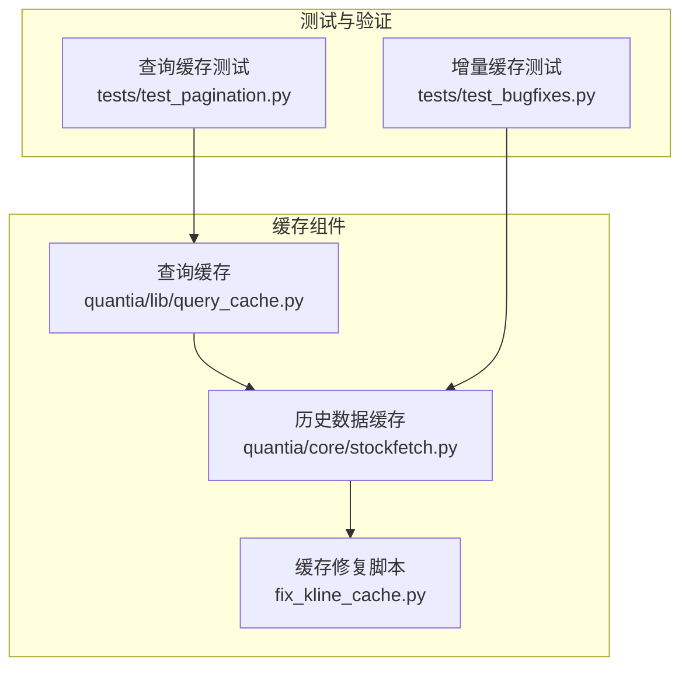
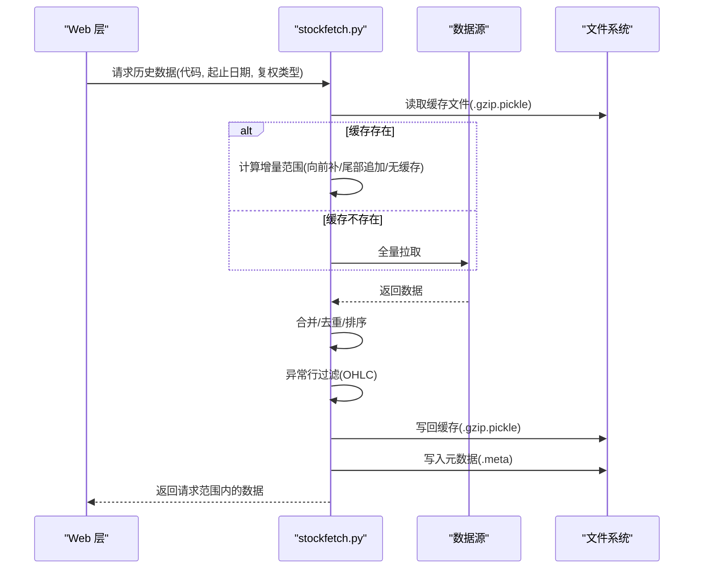
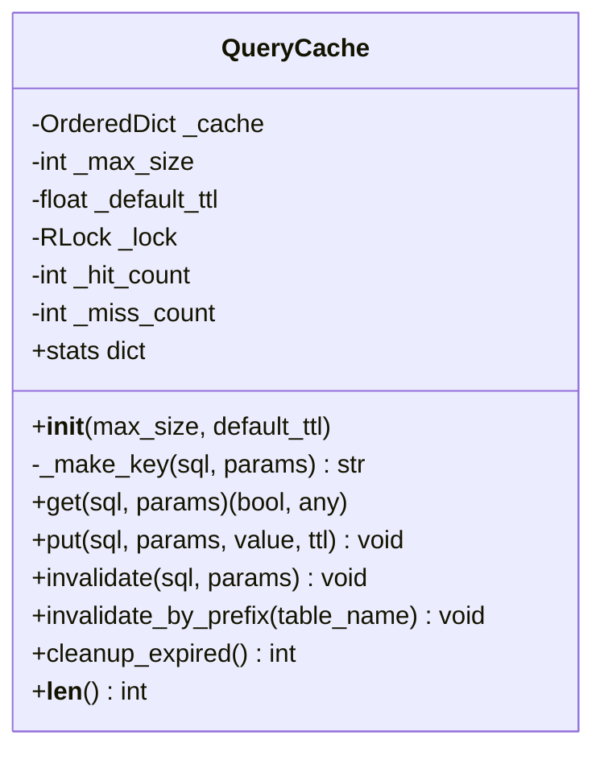
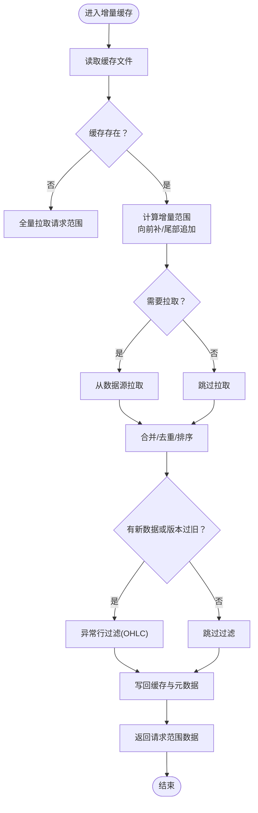
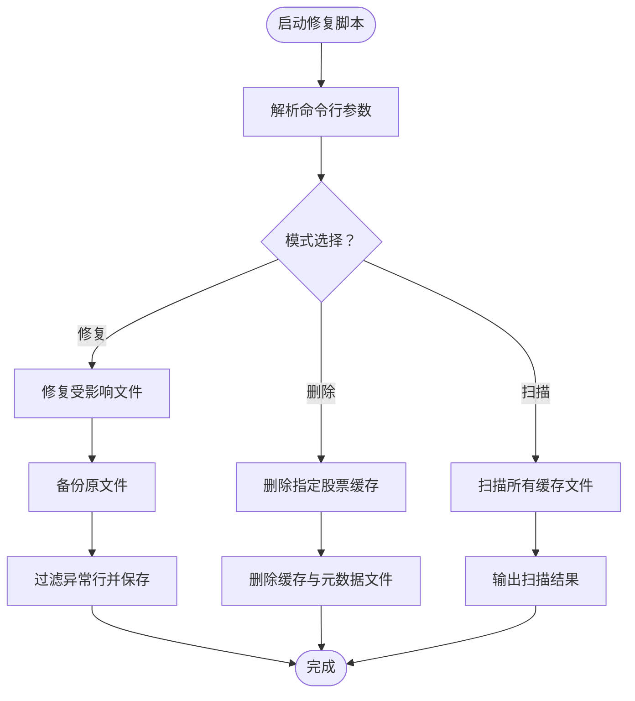
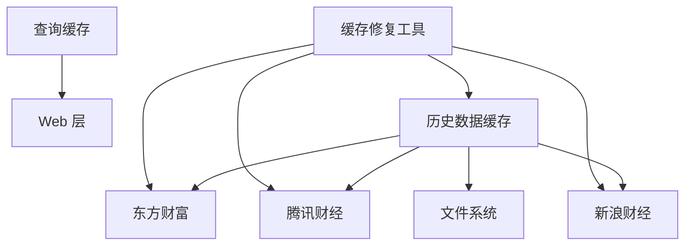

# 缓存策略设计

<cite>
**本文档引用的文件**
- [quantia/lib/query_cache.py](file://quantia/lib/query_cache.py)
- [docker/stock/quantia/lib/query_cache.py](file://docker/stock/quantia/lib/query_cache.py)
- [quantia/core/stockfetch.py](file://quantia/core/stockfetch.py)
- [docker/stock/quantia/core/stockfetch.py](file://docker/stock/quantia/core/stockfetch.py)
- [fix_kline_cache.py](file://fix_kline_cache.py)
- [tests/test_bugfixes.py](file://tests/test_bugfixes.py)
- [tests/test_pagination.py](file://tests/test_pagination.py)
</cite>

## 目录
1. [引言](#引言)
2. [项目结构](#项目结构)
3. [核心组件](#核心组件)
4. [架构概览](#架构概览)
5. [详细组件分析](#详细组件分析)
6. [依赖分析](#依赖分析)
7. [性能考虑](#性能考虑)
8. [故障排查指南](#故障排查指南)
9. [结论](#结论)
10. [附录](#附录)

## 引言
本文件系统性阐述 Quantia 项目中的缓存策略设计，涵盖历史数据缓存机制、增量缓存算法、缓存文件组织、缓存元数据管理、缓存路径设计、缓存文件格式、缓存失效与更新策略、性能优化与内存管理、磁盘空间控制、缓存一致性保障、配置选项、监控方法以及故障恢复机制。目标是帮助开发者理解并优化该数据缓存系统。

## 项目结构
缓存相关能力分布在以下模块：
- 查询缓存（内存缓存）：位于 quantia/lib/query_cache.py 与 docker/stock/quantia/lib/query_cache.py，提供基于 LRU 与 TTL 的线程安全内存缓存。
- 历史数据缓存（磁盘缓存）：位于 quantia/core/stockfetch.py 与 docker/stock/quantia/core/stockfetch.py，提供基于 gzip pickle 的磁盘缓存与增量更新、异常行过滤、元数据管理、批量更新与智能清理。
- 缓存修复工具：fix_kline_cache.py，用于扫描与修复受污染的缓存文件。
- 测试用例：tests/test_bugfixes.py 与 tests/test_pagination.py，验证增量缓存逻辑与查询缓存行为。

**图表来源**
- [quantia/lib/query_cache.py](file://quantia/lib/query_cache.py#L1-L156)
- [quantia/core/stockfetch.py](file://quantia/core/stockfetch.py#L780-L1179)
- [fix_kline_cache.py](file://fix_kline_cache.py#L1-L205)
- [tests/test_bugfixes.py](file://tests/test_bugfixes.py#L466-L553)
- [tests/test_pagination.py](file://tests/test_pagination.py#L835-L993)

**章节来源**
- [quantia/lib/query_cache.py](file://quantia/lib/query_cache.py#L1-L156)
- [quantia/core/stockfetch.py](file://quantia/core/stockfetch.py#L780-L1179)
- [fix_kline_cache.py](file://fix_kline_cache.py#L1-L205)
- [tests/test_bugfixes.py](file://tests/test_bugfixes.py#L466-L553)
- [tests/test_pagination.py](file://tests/test_pagination.py#L835-L993)

## 核心组件
- 查询缓存（QueryCache）：提供线程安全的 LRU + TTL 内存缓存，支持按 SQL+参数生成唯一 key，区分 COUNT 与 DATA 查询场景，具备统计与清理过期条目能力。
- 历史数据缓存（stockfetch）：提供历史 K 线数据的磁盘缓存，采用 gzip pickle 存储；支持增量更新（向前补数据、尾部追加、全量拉取）；内置异常行过滤（OHLC 异常检测）；维护元数据（最后日期、更新时间、过滤版本号）；提供批量更新与智能清理策略；提供仅读缓存接口（零 API 调用）。
- 缓存修复工具（fix_kline_cache.py）：扫描并修复受污染的缓存文件，支持扫描、修复、删除等模式。

**章节来源**
- [quantia/lib/query_cache.py](file://quantia/lib/query_cache.py#L27-L156)
- [quantia/core/stockfetch.py](file://quantia/core/stockfetch.py#L921-L1067)
- [fix_kline_cache.py](file://fix_kline_cache.py#L1-L205)

## 架构概览
历史数据缓存的整体流程包括：缓存读取 → 增量范围确定 → 数据源拉取 → 合并与去重 → 异常行过滤 → 元数据更新 → 写回缓存 → 返回请求范围数据。查询缓存作为 Web 层的内存缓存，与历史数据缓存互补。

**图表来源**
- [quantia/core/stockfetch.py](file://quantia/core/stockfetch.py#L921-L1067)
- [quantia/core/stockfetch.py](file://quantia/core/stockfetch.py#L1415-L1503)

**章节来源**
- [quantia/core/stockfetch.py](file://quantia/core/stockfetch.py#L921-L1067)
- [quantia/core/stockfetch.py](file://quantia/core/stockfetch.py#L1415-L1503)

## 详细组件分析

### 查询缓存（QueryCache）
- 设计要点
  - LRU 淘汰：使用有序字典维护访问顺序，命中后移动至末尾。
  - TTL 过期：每条缓存记录过期时间，读取时判断并清理过期项。
  - 线程安全：使用锁保护缓存结构与统计信息。
  - Key 生成：SQL + 参数拼接后进行哈希，确保唯一性。
  - 统计与监控：命中/未命中计数、命中率、容量与 TTL 配置。
- 全局实例
  - 股票数据页面缓存：TTL 5 分钟，最大 512 条。
  - 策略筛选结果缓存：TTL 10 分钟，最大 128 条。
- 测试验证
  - 不同参数生成不同 key、TTL 过期、LRU 淘汰、统计信息、翻页场景下的缓存隔离与共享等。

**图表来源**
- [quantia/lib/query_cache.py](file://quantia/lib/query_cache.py#L27-L141)

**章节来源**
- [quantia/lib/query_cache.py](file://quantia/lib/query_cache.py#L27-L156)
- [tests/test_pagination.py](file://tests/test_pagination.py#L835-L993)

### 历史数据缓存（增量更新与文件组织）
- 缓存路径设计
  - 按股票代码前 3 位分组目录，便于大规模数据的文件系统管理与 IO 分散。
  - 文件命名：{代码}{复权类型}.gzip.pickle；元数据文件：{代码}{复权类型}.meta。
- 缓存文件格式
  - 数据：gzip 压缩的 pickle DataFrame，列标准化，兼容旧列名映射与重复列合并。
  - 元数据：文本文件，包含“最后日期,更新时间,过滤版本号”。
- 增量缓存算法
  - 读取现有缓存，计算最早/最晚日期。
  - 场景判定：
    - 向前补数据：请求起始 < 缓存最早日期，追加 [请求起始, 缓存最早日前一天]。
    - 尾部追加：缓存最后日期 < 请求结束，追加 [缓存最后日后一天, 请求结束]。
    - 无缓存：全量拉取请求范围。
  - 数据拉取与合并：按需从多个数据源拉取，合并后去重并排序。
  - 异常行过滤：对新拉取数据或未达当前过滤版本的纯缓存数据执行过滤，并更新元数据版本号。
  - 写回缓存：仅在有新增数据或清除异常行时写回。
- 一致性与版本控制
  - 过滤版本号：_FILTER_VERSION，用于判断是否需要再次过滤。
  - 元数据 last_date：用于快速判断是否需要 API 请求（批量更新预检查）。
- 仅读缓存接口
  - read_stock_hist_from_cache：仅从缓存读取，绝不发起 API 请求，按需执行过滤并补充指标列。

**图表来源**
- [quantia/core/stockfetch.py](file://quantia/core/stockfetch.py#L921-L1067)
- [quantia/core/stockfetch.py](file://quantia/core/stockfetch.py#L1415-L1503)

**章节来源**
- [quantia/core/stockfetch.py](file://quantia/core/stockfetch.py#L785-L833)
- [quantia/core/stockfetch.py](file://quantia/core/stockfetch.py#L921-L1067)
- [quantia/core/stockfetch.py](file://quantia/core/stockfetch.py#L1415-L1503)

### 缓存修复工具（fix_kline_cache.py）
- 功能概述
  - 扫描：遍历缓存目录，识别受污染的 .gzip.pickle 文件（通过与 stockfetch 中相同的异常检测算法）。
  - 修复：对异常行进行过滤并重新保存，同时备份原文件。
  - 删除：按指定股票代码删除缓存文件，下次获取时自动重建。
- 适用场景
  - 历史缓存中混入月度聚合数据导致的异常（如月末日期、价格偏离、成交量异常大）。
- 使用方式
  - 扫描模式、修复模式、删除模式，支持自定义缓存目录与股票代码列表。

**图表来源**
- [fix_kline_cache.py](file://fix_kline_cache.py#L166-L205)
- [fix_kline_cache.py](file://fix_kline_cache.py#L75-L144)
- [fix_kline_cache.py](file://fix_kline_cache.py#L147-L163)

**章节来源**
- [fix_kline_cache.py](file://fix_kline_cache.py#L1-L205)

### 增量缓存逻辑验证（测试）
- 测试覆盖
  - 缓存完全覆盖请求范围：不应产生 fetch_ranges。
  - 需要尾部追加：仅产生一个尾部追加范围。
  - 需要向前补数据：仅产生一个向前补范围。
  - 双向补数据：同时产生前后两个范围。
- 价值
  - 保证增量更新算法在边界条件下的正确性，避免冗余 API 请求。

**章节来源**
- [tests/test_bugfixes.py](file://tests/test_bugfixes.py#L466-L553)

## 依赖分析
- 组件耦合
  - 查询缓存与历史数据缓存相互独立，分别服务于 Web 层内存缓存与磁盘缓存。
  - 历史数据缓存依赖 pandas 进行数据处理、gzip pickle 进行序列化、多数据源接口进行拉取。
  - 缓存修复工具依赖 stockfetch 的异常检测算法，确保修复策略与生产一致。
- 外部依赖
  - 数据源：东方财富、腾讯财经、新浪财经。
  - 文件系统：缓存目录、分组子目录、gzip pickle 文件与元数据文件。
- 潜在循环依赖
  - 未见循环依赖迹象；各模块职责清晰。

**图表来源**
- [quantia/lib/query_cache.py](file://quantia/lib/query_cache.py#L147-L156)
- [quantia/core/stockfetch.py](file://quantia/core/stockfetch.py#L835-L906)
- [fix_kline_cache.py](file://fix_kline_cache.py#L39-L48)

**章节来源**
- [quantia/lib/query_cache.py](file://quantia/lib/query_cache.py#L147-L156)
- [quantia/core/stockfetch.py](file://quantia/core/stockfetch.py#L835-L906)
- [fix_kline_cache.py](file://fix_kline_cache.py#L39-L48)

## 性能考虑
- 内存管理
  - 查询缓存：固定容量与 LRU 淘汰，避免无限增长；TTL 清理过期条目。
  - 历史数据缓存：仅在必要时写回，避免频繁 IO；批量更新采用分批提交与 GC 触发，降低峰值内存占用。
- 磁盘空间控制
  - 智能清理：删除退市股票缓存、除权除息前复权缓存、损坏文件，减少无效占用。
  - 文件组织：按代码前 3 位分组，降低单目录文件数量，提升文件系统性能。
- 限流与退避
  - 批量更新：5 层限流策略（并发、请求间隔、批次冷却、限流检测与退避、熔断保护），有效避免 API 封禁风险。
- 一致性与准确性
  - 异常行过滤：向量化实现，安全阈值（异常行不超过 15%）与版本号控制，确保缓存质量。
  - 元数据版本：过滤版本号与最后日期，支持快速判断与跳过过滤。

**章节来源**
- [quantia/lib/query_cache.py](file://quantia/lib/query_cache.py#L114-L121)
- [quantia/core/stockfetch.py](file://quantia/core/stockfetch.py#L1070-L1179)
- [quantia/core/stockfetch.py](file://quantia/core/stockfetch.py#L1203-L1385)
- [quantia/core/stockfetch.py](file://quantia/core/stockfetch.py#L1415-L1503)

## 故障排查指南
- 增量缓存未生效
  - 检查缓存文件是否存在与可读；确认日期范围与缓存最早/最晚日期的关系。
  - 查看日志中“读取缓存失败，将重新获取”等提示。
- 缓存污染
  - 使用修复脚本扫描并修复，关注“异常行 OHLC 已过滤”的警告。
  - 必要时删除缓存文件，下次自动重建。
- 批量更新失败
  - 关注限流日志（连续失败触发暂停、退避与熔断），适当降低并发或等待恢复。
- 查询缓存命中率低
  - 检查 key 生成是否包含完整参数；确认 TTL 是否过短；评估缓存容量是否不足。
- 仅读缓存无数据
  - 确认缓存文件是否存在；检查是否已执行增量更新；查看日志中“缓存无数据”的提示。

**章节来源**
- [quantia/core/stockfetch.py](file://quantia/core/stockfetch.py#L975-L978)
- [fix_kline_cache.py](file://fix_kline_cache.py#L113-L144)
- [quantia/core/stockfetch.py](file://quantia/core/stockfetch.py#L1318-L1356)
- [quantia/lib/query_cache.py](file://quantia/lib/query_cache.py#L124-L136)
- [quantia/core/stockfetch.py](file://quantia/core/stockfetch.py#L1409-L1412)

## 结论
本缓存体系通过“内存查询缓存 + 磁盘历史数据缓存”的双层设计，在保证数据一致性与准确性的前提下，显著降低了数据库与外部 API 的压力。增量更新算法与异常行过滤确保缓存质量，智能清理与限流策略保障长期稳定运行。配合修复工具与测试用例，形成闭环的质量保障机制。开发者可在理解上述机制的基础上，按需调整容量、TTL、并发与限流参数，持续优化性能与稳定性。

## 附录

### 缓存配置选项
- 查询缓存（QueryCache）
  - max_size：最大缓存条目数（默认 512）。
  - default_ttl：默认过期时间（秒，默认 300）。
  - 全局实例
    - stock_data_cache：TTL 300 秒，max 512。
    - filter_result_cache：TTL 600 秒，max 128。
- 历史数据缓存（stockfetch）
  - 缓存目录：quantia/cache/hist。
  - 文件组织：按代码前 3 位分组。
  - 文件命名：{代码}{复权类型}.gzip.pickle；元数据：{代码}{复权类型}.meta。
  - 过滤版本：_FILTER_VERSION 控制是否跳过过滤。
  - 批量更新：workers 默认 2，最大 4；请求间隔 1-3 秒；批次冷却 8-15 秒；限流退避 120/240/480 秒；熔断累计 3 次。

**章节来源**
- [quantia/lib/query_cache.py](file://quantia/lib/query_cache.py#L36-L39)
- [quantia/lib/query_cache.py](file://quantia/lib/query_cache.py#L147-L156)
- [quantia/core/stockfetch.py](file://quantia/core/stockfetch.py#L785-L799)
- [quantia/core/stockfetch.py](file://quantia/core/stockfetch.py#L1203-L1246)
- [quantia/core/stockfetch.py](file://quantia/core/stockfetch.py#L804-L804)

### 监控方法
- 查询缓存
  - stats：返回 size、max_size、hit_count、miss_count、hit_rate、ttl。
  - cleanup_expired：主动清理过期条目并返回清理数量。
- 历史数据缓存
  - 日志：读取/写回缓存、异常行过滤、批量更新进度与限流事件。
  - 元数据：last_date 与 filtered_version 用于快速判断与跳过过滤。

**章节来源**
- [quantia/lib/query_cache.py](file://quantia/lib/query_cache.py#L123-L140)
- [quantia/core/stockfetch.py](file://quantia/core/stockfetch.py#L1047-L1056)
- [quantia/core/stockfetch.py](file://quantia/core/stockfetch.py#L1032-L1044)

### 故障恢复机制
- 缓存修复脚本
  - 扫描：识别异常行数量与比例。
  - 修复：备份原文件并写回清洗后的数据。
  - 删除：删除指定股票缓存文件，下次自动重建。
- 智能清理
  - 删除退市股票缓存、除权除息前复权缓存、损坏文件，避免无效占用。
- 仅读缓存
  - 严格只读，无 API 调用，适合展示与诊断场景。

**章节来源**
- [fix_kline_cache.py](file://fix_kline_cache.py#L75-L163)
- [quantia/core/stockfetch.py](file://quantia/core/stockfetch.py#L1070-L1179)
- [quantia/core/stockfetch.py](file://quantia/core/stockfetch.py#L1505-L1583)
