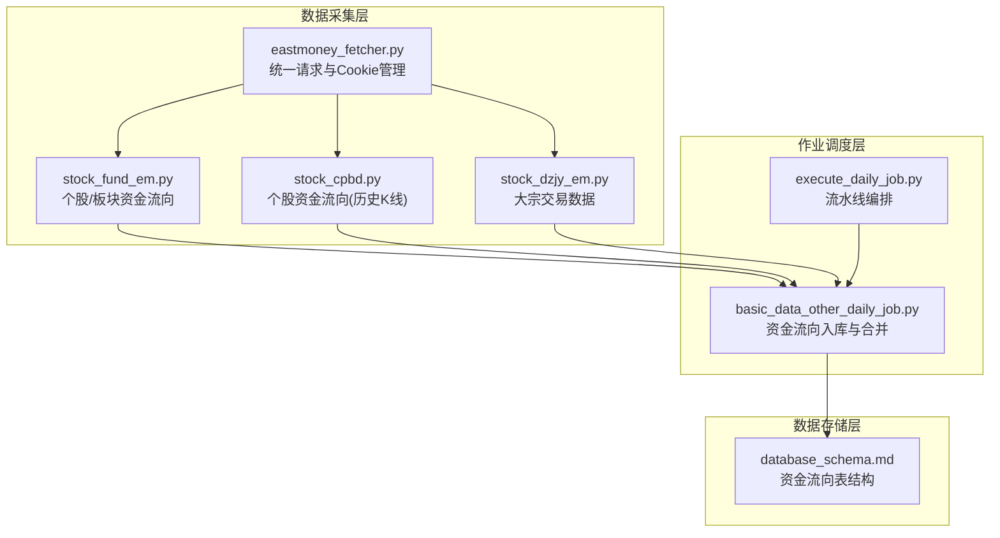
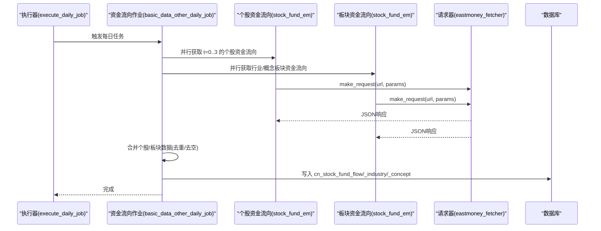
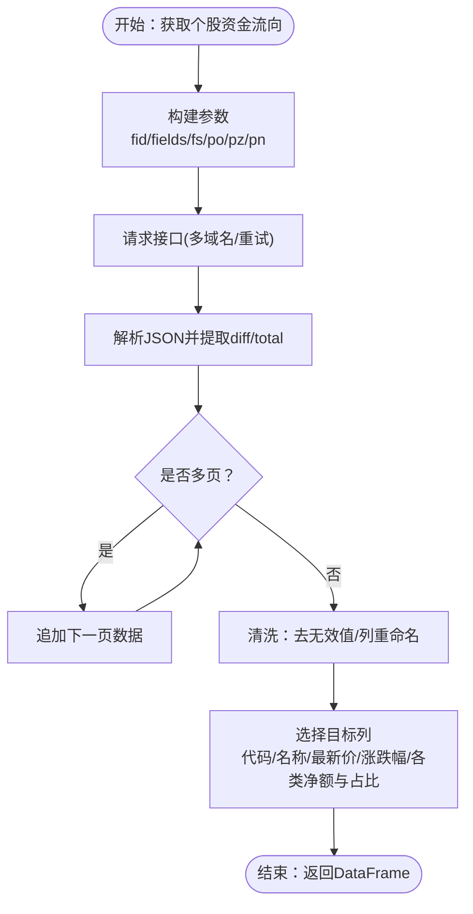
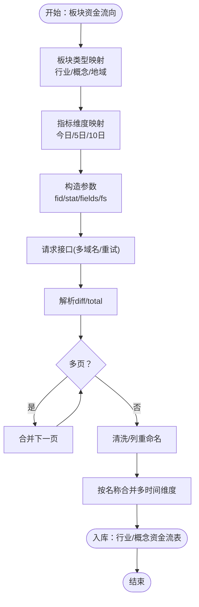
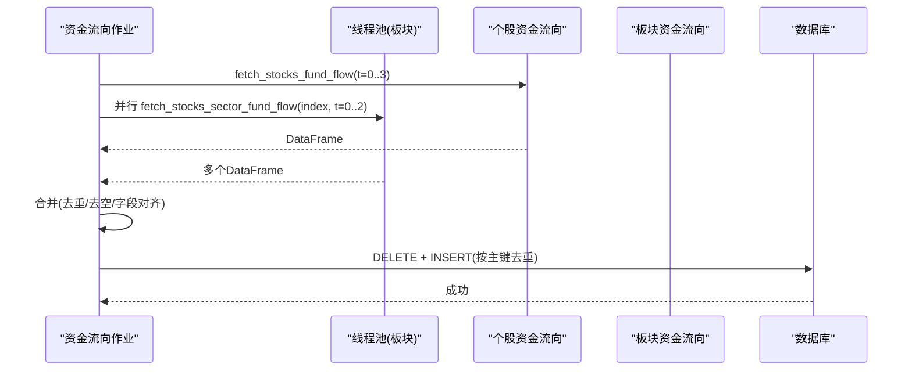
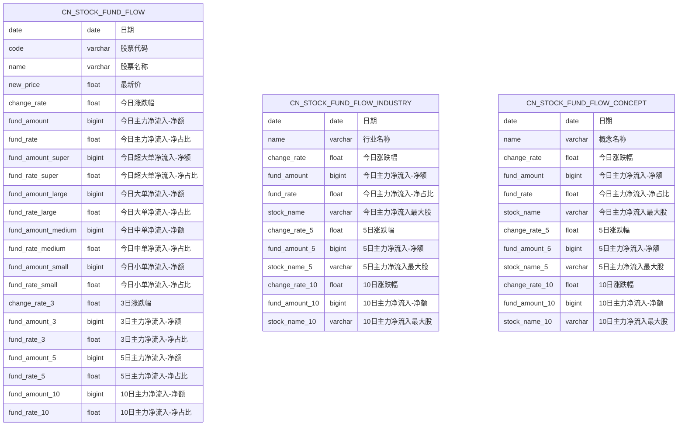
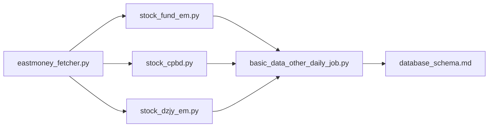

# 资金流向分析

<cite>
**本文引用的文件**
- [stock_fund_em.py](file://docker/stock/quantia/core/crawling/stock_fund_em.py)
- [stock_cpbd.py](file://docker/stock/quantia/core/crawling/stock_cpbd.py)
- [stock_dzjy_em.py](file://docker/stock/quantia/core/crawling/stock_dzjy_em.py)
- [eastmoney_fetcher.py](file://docker/stock/quantia/core/eastmoney_fetcher.py)
- [basic_data_other_daily_job.py](file://docker/stock/quantia/job/basic_data_other_daily_job.py)
- [execute_daily_job.py](file://docker/stock/quantia/job/execute_daily_job.py)
- [database_schema.md](file://document/database_schema.md)
- [README.md](file://README.md)
</cite>

## 目录
1. [简介](#简介)
2. [项目结构](#项目结构)
3. [核心组件](#核心组件)
4. [架构总览](#架构总览)
5. [详细组件分析](#详细组件分析)
6. [依赖关系分析](#依赖关系分析)
7. [性能考量](#性能考量)
8. [故障排查指南](#故障排查指南)
9. [结论](#结论)
10. [附录](#附录)

## 简介
本文件面向开发者，系统化阐述 Quantia 项目中“资金流向分析”的实现与使用，包括：
- 股票资金流向数据获取机制与数据源差异
- 板块资金流向处理流程
- 资金流入流出计算与资金流向指标定义
- 数据格式转换与字段映射
- 资金流向数据质量控制、异常值处理与一致性校验
- 算法实现要点、性能优化策略与数据可视化建议
- 从数据采集到入库的完整流水线与关键控制点

## 项目结构
资金流向相关代码主要分布在以下模块：
- 数据采集层：东方财富网接口封装与具体抓取函数
- 作业调度层：每日任务编排与入库逻辑
- 数据库层：资金流向表结构与索引设计
- 文档与说明：数据表结构与流水线说明

**图表来源**
- [eastmoney_fetcher.py](file://docker/stock/quantia/core/eastmoney_fetcher.py#L16-L149)
- [stock_fund_em.py](file://docker/stock/quantia/core/crawling/stock_fund_em.py#L1-L514)
- [stock_cpbd.py](file://docker/stock/quantia/core/crawling/stock_cpbd.py#L1-L141)
- [stock_dzjy_em.py](file://docker/stock/quantia/core/crawling/stock_dzjy_em.py#L1-L555)
- [basic_data_other_daily_job.py](file://docker/stock/quantia/job/basic_data_other_daily_job.py#L1-L342)
- [execute_daily_job.py](file://docker/stock/quantia/job/execute_daily_job.py#L1-L231)
- [database_schema.md](file://document/database_schema.md#L149-L254)

**章节来源**
- [README.md](file://README.md#L634-L666)
- [database_schema.md](file://document/database_schema.md#L149-L254)

## 核心组件
- 东方财富网数据获取器：统一处理 Cookie、请求头、会话与代理，保证稳定性与并发安全。
- 个股资金流向：支持“今日/3日/5日/10日”多周期主力资金与分档资金（超大单/大单/中单/小单）流入流出。
- 板块资金流向：支持“行业/概念/地域”三类板块，输出涨跌幅与主力净流入指标及最大股信息。
- 大宗交易数据：提供市场统计、每日明细、活跃营业部等维度，辅助资金流向分析。
- 资金流向入库与合并：按日期聚合个股与板块数据，清洗缺失与异常值，写入对应表。

**章节来源**
- [eastmoney_fetcher.py](file://docker/stock/quantia/core/eastmoney_fetcher.py#L16-L149)
- [stock_fund_em.py](file://docker/stock/quantia/core/crawling/stock_fund_em.py#L46-L266)
- [stock_fund_em.py](file://docker/stock/quantia/core/crawling/stock_fund_em.py#L299-L487)
- [stock_dzjy_em.py](file://docker/stock/quantia/core/crawling/stock_dzjy_em.py#L20-L72)
- [basic_data_other_daily_job.py](file://docker/stock/quantia/job/basic_data_other_daily_job.py#L67-L129)
- [basic_data_other_daily_job.py](file://docker/stock/quantia/job/basic_data_other_daily_job.py#L166-L214)

## 架构总览
资金流向数据从 API 获取到入库的流水线如下：

**图表来源**
- [execute_daily_job.py](file://docker/stock/quantia/job/execute_daily_job.py#L80-L177)
- [basic_data_other_daily_job.py](file://docker/stock/quantia/job/basic_data_other_daily_job.py#L67-L129)
- [basic_data_other_daily_job.py](file://docker/stock/quantia/job/basic_data_other_daily_job.py#L166-L214)
- [stock_fund_em.py](file://docker/stock/quantia/core/crawling/stock_fund_em.py#L46-L266)
- [stock_fund_em.py](file://docker/stock/quantia/core/crawling/stock_fund_em.py#L299-L487)
- [eastmoney_fetcher.py](file://docker/stock/quantia/core/eastmoney_fetcher.py#L75-L143)

## 详细组件分析

### 个股资金流向：数据源与字段映射
- 数据源：东方财富网“数据中心-资金流向”接口，支持分页与多域名备用。
- 时间维度：今日、3日、5日、10日。
- 资金分类：
  - 主力净流入（净额与占比）
  - 超大单/大单/中单/小单净流入（净额与占比）
- 字段映射与清洗：
  - 去除无效值（如“-”）。
  - 按指标维度重命名列名，保留“代码、名称、最新价、涨跌幅、各类净额与占比”。

**图表来源**
- [stock_fund_em.py](file://docker/stock/quantia/core/crawling/stock_fund_em.py#L21-L44)
- [stock_fund_em.py](file://docker/stock/quantia/core/crawling/stock_fund_em.py#L46-L266)

**章节来源**
- [stock_fund_em.py](file://docker/stock/quantia/core/crawling/stock_fund_em.py#L46-L266)

### 板块资金流向：行业/概念/地域
- 数据源：东方财富网“板块资金流”接口，支持按板块类型与时间维度查询。
- 输出字段：名称、涨跌幅、主力净流入（净额与占比）、最大股等。
- 合并策略：按名称合并多时间维度数据，避免字段冲突。

**图表来源**
- [stock_fund_em.py](file://docker/stock/quantia/core/crawling/stock_fund_em.py#L299-L487)

**章节来源**
- [stock_fund_em.py](file://docker/stock/quantia/core/crawling/stock_fund_em.py#L299-L487)

### 资金流向入库与合并：一致性与质量控制
- 合并策略：
  - 任一时间维度成功即作为基础数据，避免 t=0 失败导致整批数据为空。
  - 合并时剔除重复列（如 name/new_price），并对 change_rate_N 冲突进行规避。
- 入库前清洗：
  - 去除空数据集与空 DataFrame。
  - 插入日期字段，删除当日旧数据后写入。
- 并发与稳定性：
  - 个股资金流向采用串行获取（降低接口压力），板块资金流向使用线程池并发。
  - 统一使用 eastmoney_fetcher 的 make_request，内置重试与代理切换。

**图表来源**
- [basic_data_other_daily_job.py](file://docker/stock/quantia/job/basic_data_other_daily_job.py#L67-L129)
- [basic_data_other_daily_job.py](file://docker/stock/quantia/job/basic_data_other_daily_job.py#L166-L214)

**章节来源**
- [basic_data_other_daily_job.py](file://docker/stock/quantia/job/basic_data_other_daily_job.py#L67-L129)
- [basic_data_other_daily_job.py](file://docker/stock/quantia/job/basic_data_other_daily_job.py#L166-L214)

### 数据表结构与字段定义
- 个股资金流向表（cn_stock_fund_flow）：按日期+代码主键，包含今日/3日/5日/10日的主力与分档资金净额与占比，以及涨跌幅。
- 板块资金流向表（cn_stock_fund_flow_industry/concept）：按日期+名称主键，包含涨跌幅、主力净流入、最大股等字段。

**图表来源**
- [database_schema.md](file://document/database_schema.md#L149-L254)

**章节来源**
- [database_schema.md](file://document/database_schema.md#L149-L254)

### 大宗交易数据：补充资金流向视角
- 提供市场统计、每日明细、活跃营业部与排行等维度，便于从机构行为角度补充资金流向分析。
- 字段清洗与数值化处理，统一日期格式与数值类型。

**章节来源**
- [stock_dzjy_em.py](file://docker/stock/quantia/core/crawling/stock_dzjy_em.py#L20-L72)
- [stock_dzjy_em.py](file://docker/stock/quantia/core/crawling/stock_dzjy_em.py#L75-L197)
- [stock_dzjy_em.py](file://docker/stock/quantia/core/crawling/stock_dzjy_em.py#L200-L270)
- [stock_dzjy_em.py](file://docker/stock/quantia/core/crawling/stock_dzjy_em.py#L273-L366)
- [stock_dzjy_em.py](file://docker/stock/quantia/core/crawling/stock_dzjy_em.py#L369-L534)

### 资金流向数据质量控制与异常处理
- 接口稳定性：eastmoney_fetcher 内置多域名轮询、重试与代理切换，区分连接级错误与业务错误，逐步退避重试。
- 数据完整性：资金流向作业采用“任一时间维度成功即作为基础”的策略，避免 t=0 失败导致整批数据为空。
- 数据一致性：合并时剔除重复列与字段冲突，确保不同时间维度字段不互相覆盖。
- 健康检查：流水线结束后对核心表进行数据量与最新日期检查，便于快速定位问题。

**章节来源**
- [eastmoney_fetcher.py](file://docker/stock/quantia/core/eastmoney_fetcher.py#L75-L143)
- [basic_data_other_daily_job.py](file://docker/stock/quantia/job/basic_data_other_daily_job.py#L67-L129)
- [execute_daily_job.py](file://docker/stock/quantia/job/execute_daily_job.py#L182-L226)

## 依赖关系分析
- 组件耦合：
  - eastmoney_fetcher 为所有抓取模块提供统一请求能力，降低重复实现与耦合。
  - 资金流向作业依赖抓取模块与表结构定义，入库前进行数据清洗与合并。
- 外部依赖：
  - 东方财富网接口变更可能导致字段或参数调整，需在抓取模块中同步适配。
- 潜在循环依赖：
  - 抓取模块之间无直接相互依赖，通过作业层协调，避免循环导入。

**图表来源**
- [eastmoney_fetcher.py](file://docker/stock/quantia/core/eastmoney_fetcher.py#L16-L149)
- [stock_fund_em.py](file://docker/stock/quantia/core/crawling/stock_fund_em.py#L1-L514)
- [stock_cpbd.py](file://docker/stock/quantia/core/crawling/stock_cpbd.py#L1-L141)
- [stock_dzjy_em.py](file://docker/stock/quantia/core/crawling/stock_dzjy_em.py#L1-L555)
- [basic_data_other_daily_job.py](file://docker/stock/quantia/job/basic_data_other_daily_job.py#L1-L342)
- [database_schema.md](file://document/database_schema.md#L149-L254)

## 性能考量
- 请求并发与退避：
  - 个股资金流向串行获取，减少接口压力；板块资金流向使用线程池并发，提升吞吐。
  - eastmoney_fetcher 内置随机退避与代理切换，降低被限速或封禁风险。
- 数据合并与内存：
  - 合并时剔除冗余列与重复字段，避免字段冲突导致的额外计算。
  - 采用“任一时间维度成功即作为基础”的策略，提高成功率与稳定性。
- 存储与索引：
  - 个股资金流向表以“日期+代码”为主键，板块表以“日期+名称”为主键，配合常用查询字段建立索引，提升查询效率。

**章节来源**
- [basic_data_other_daily_job.py](file://docker/stock/quantia/job/basic_data_other_daily_job.py#L166-L214)
- [eastmoney_fetcher.py](file://docker/stock/quantia/core/eastmoney_fetcher.py#L75-L143)
- [database_schema.md](file://document/database_schema.md#L149-L254)

## 故障排查指南
- 页面无数据：
  - 使用健康检查脚本确认核心表是否存在当日数据，定位是采集失败还是入库失败。
- 接口异常：
  - 检查 eastmoney_fetcher 的重试与代理日志，确认是否因网络或代理问题导致请求失败。
- 数据为空：
  - 查看资金流向作业的日志，确认是否存在“所有时间段返回空数据”的情况，必要时调整基础时间维度策略。
- 字段不一致：
  - 检查合并逻辑是否正确剔除重复列与字段冲突，确保不同时间维度字段不互相覆盖。

**章节来源**
- [execute_daily_job.py](file://docker/stock/quantia/job/execute_daily_job.py#L182-L226)
- [eastmoney_fetcher.py](file://docker/stock/quantia/core/eastmoney_fetcher.py#L116-L142)
- [basic_data_other_daily_job.py](file://docker/stock/quantia/job/basic_data_other_daily_job.py#L67-L129)

## 结论
本项目通过统一的请求封装与稳健的作业编排，实现了多维度、多口径的资金流向数据采集与入库。通过对接口重试、代理切换与数据合并策略的优化，显著提升了数据获取的稳定性与一致性。结合数据库层面的主键与索引设计，为后续的资金流向分析与可视化提供了可靠的数据基础。

## 附录
- 运行与调试建议：
  - 使用 execute_daily_job 的流水线模式，确保 Phase 1-3 的数据采集完成后，再进行 Phase 4/5 的分析与回测。
  - 如需单独调试资金流向，可直接运行 basic_data_other_daily_job 的相关函数，观察日志与中间结果。
- 数据可视化建议：
  - 个股：按“今日/3日/5日/10日”主力净流入排序，叠加涨跌幅与成交量，观察资金与价格的背离。
  - 板块：按行业/概念资金流排序，关注最大股与涨跌幅，识别热点板块与资金流向方向。
  - 大宗交易：结合大宗交易明细与活跃营业部，分析机构行为对资金流向的影响。

**章节来源**
- [README.md](file://README.md#L634-L666)
- [execute_daily_job.py](file://docker/stock/quantia/job/execute_daily_job.py#L80-L177)
