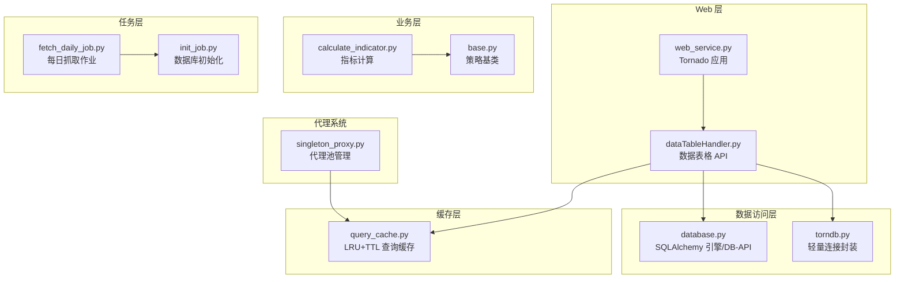
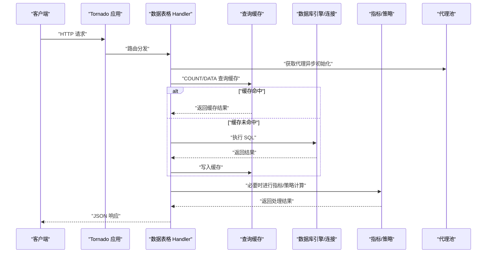
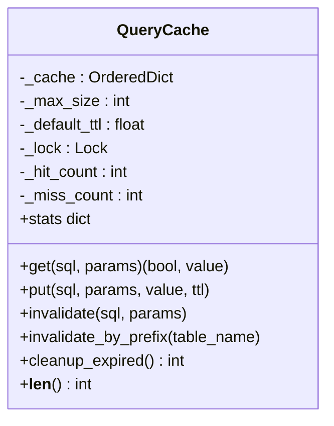
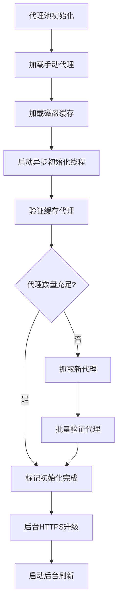
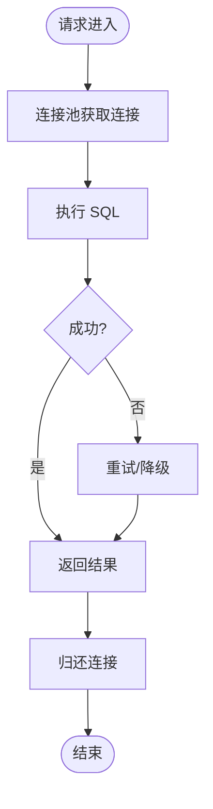
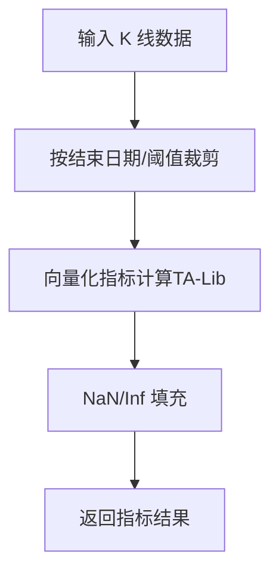
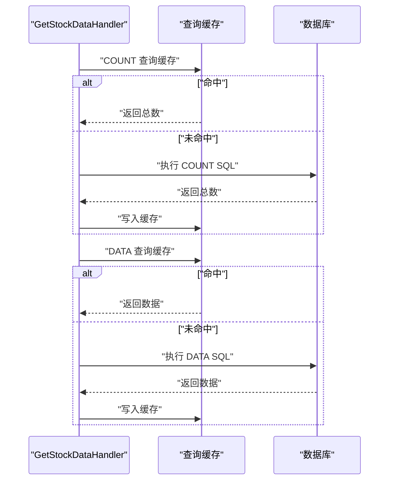
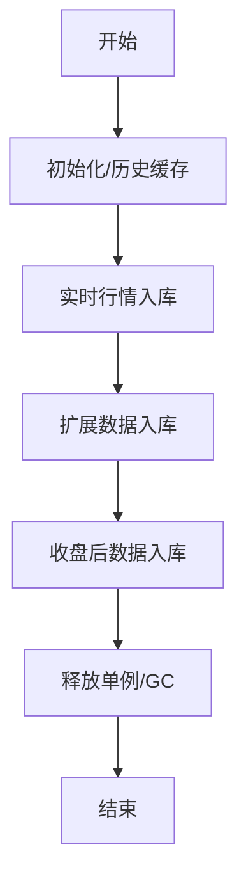
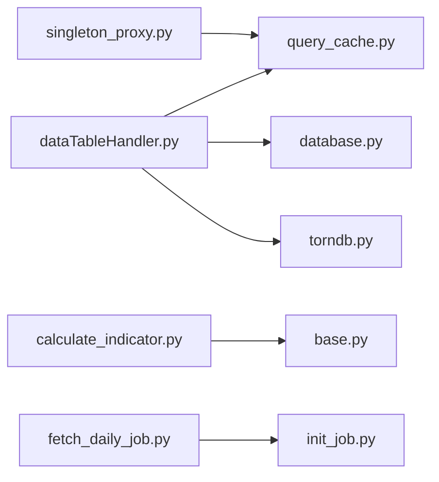
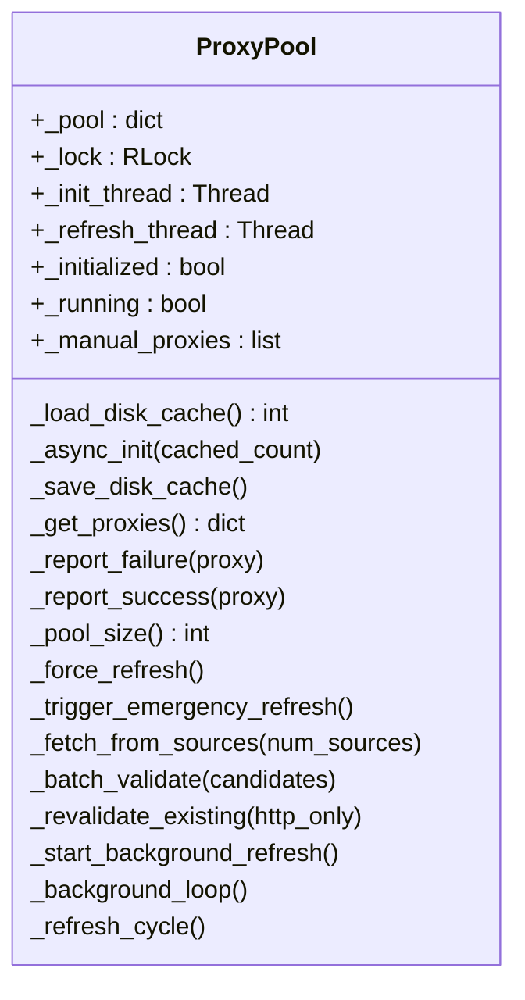

# 性能优化设计

<cite>
**本文档引用的文件**
- [singleton_proxy.py](file://docker/stock/quantia/core/singleton_proxy.py)
- [query_cache.py](file://docker/stock/quantia/lib/query_cache.py)
- [database.py](file://docker/stock/quantia/lib/database.py)
- [torndb.py](file://docker/stock/quantia/lib/torndb.py)
- [web_service.py](file://docker/stock/quantia/web/web_service.py)
- [dataTableHandler.py](file://docker/stock/quantia/web/dataTableHandler.py)
- [calculate_indicator.py](file://docker/stock/quantia/core/indicator/calculate_indicator.py)
- [base.py](file://docker/stock/quantia/core/strategy/base.py)
- [init_job.py](file://docker/stock/quantia/job/init_job.py)
- [fetch_daily_job.py](file://docker/stock/quantia/job/fetch_daily_job.py)
- [log_config.py](file://docker/stock/quantia/lib/log_config.py)
</cite>

## 更新摘要
**所做更改**
- 新增代理系统的磁盘缓存系统章节，详细说明代理池的磁盘持久化机制
- 更新异步初始化和连接池优化章节，反映代理系统的非阻塞初始化策略
- 增强并发处理与异步任务设计，包含代理池的多线程优化
- 完善性能监控与瓶颈识别，增加代理池性能指标监控

## 目录
1. [简介](#简介)
2. [项目结构](#项目结构)
3. [核心组件](#核心组件)
4. [架构总览](#架构总览)
5. [组件详细分析](#组件详细分析)
6. [依赖关系分析](#依赖关系分析)
7. [性能考量与优化策略](#性能考量与优化策略)
8. [故障排查指南](#故障排查指南)
9. [结论](#结论)
10. [附录](#附录)

## 简介
本设计文档聚焦 Quantia 系统在性能方面的设计与优化策略，覆盖缓存机制（查询缓存、数据缓存、策略缓存）、数据库性能优化（索引设计、查询优化、连接池管理）、算法性能优化（指标计算优化、数据处理优化）、并发与异步任务设计、资源限制机制、性能监控与瓶颈识别、优化效果评估以及最佳实践与实施方案。

**更新重点**：本次更新重点关注代理系统的性能优化改进，包括磁盘缓存系统、异步初始化和连接池优化等关键性能改进措施。

## 项目结构
系统采用前后端分离与批处理/实时处理结合的架构：
- Web 层：基于 Tornado 的 HTTP 服务，提供 API 与 SPA 路由。
- 数据访问层：SQLAlchemy 引擎与自封装的 torndb 连接器，统一连接池与超时控制。
- 业务层：策略基类、指标计算、数据抓取与分析作业。
- 任务调度：独立的每日数据抓取与分析作业，支持阶段化与容错。
- **新增**：代理系统：基于单例模式的代理池管理，支持磁盘缓存和异步初始化。

**图表来源**
- [web_service.py](file://docker/stock/quantia/web/web_service.py#L53-L98)
- [dataTableHandler.py](file://docker/stock/quantia/web/dataTableHandler.py#L54-L215)
- [database.py](file://docker/stock/quantia/lib/database.py#L58-L69)
- [torndb.py](file://docker/stock/quantia/lib/torndb.py#L47-L122)
- [calculate_indicator.py](file://docker/stock/quantia/core/indicator/calculate_indicator.py#L23-L407)
- [base.py](file://docker/stock/quantia/core/strategy/base.py#L20-L96)
- [fetch_daily_job.py](file://docker/stock/quantia/job/fetch_daily_job.py#L60-L101)
- [init_job.py](file://docker/stock/quantia/job/init_job.py#L20-L60)
- [query_cache.py](file://docker/stock/quantia/lib/query_cache.py#L27-L156)
- [singleton_proxy.py](file://docker/stock/quantia/core/singleton_proxy.py#L54-L114)

**章节来源**
- [web_service.py](file://docker/stock/quantia/web/web_service.py#L53-L98)
- [database.py](file://docker/stock/quantia/lib/database.py#L58-L69)
- [torndb.py](file://docker/stock/quantia/lib/torndb.py#L47-L122)
- [dataTableHandler.py](file://docker/stock/quantia/web/dataTableHandler.py#L54-L215)
- [calculate_indicator.py](file://docker/stock/quantia/core/indicator/calculate_indicator.py#L23-L407)
- [base.py](file://docker/stock/quantia/core/strategy/base.py#L20-L96)
- [fetch_daily_job.py](file://docker/stock/quantia/job/fetch_daily_job.py#L60-L101)
- [init_job.py](file://docker/stock/quantia/job/init_job.py#L20-L60)
- [query_cache.py](file://docker/stock/quantia/lib/query_cache.py#L27-L156)
- [singleton_proxy.py](file://docker/stock/quantia/core/singleton_proxy.py#L54-L114)

## 核心组件
- 查询缓存：基于 LRU 的内存缓存，支持 TTL 过期与命中统计，分别服务于"股票数据"和"筛选结果"的高频查询。
- 数据库连接与连接池：SQLAlchemy 引擎与 torndb 连接器，统一超时、回收与预检，避免长连接空闲断开。
- 指标计算：基于 TA-Lib 的向量化指标计算，配合 NaN/Inf 处理与阈值裁剪，减少无效数据传输与计算。
- 策略基类：统一策略接口与数据准备流程，便于扩展与复用。
- Web API：Tornado 应用与 Handler，集成查询缓存与降级逻辑（表不存在、列缺失、日期回退）。
- 作业调度：每日抓取作业按阶段执行，失败不影响后续阶段，支持资源释放与垃圾回收。
- **新增**：代理系统：基于单例模式的代理池管理，支持磁盘缓存、异步初始化和多线程验证。

**章节来源**
- [query_cache.py](file://docker/stock/quantia/lib/query_cache.py#L27-L156)
- [database.py](file://docker/stock/quantia/lib/database.py#L58-L69)
- [torndb.py](file://docker/stock/quantia/lib/torndb.py#L47-L122)
- [calculate_indicator.py](file://docker/stock/quantia/core/indicator/calculate_indicator.py#L23-L407)
- [base.py](file://docker/stock/quantia/core/strategy/base.py#L20-L96)
- [web_service.py](file://docker/stock/quantia/web/web_service.py#L53-L98)
- [dataTableHandler.py](file://docker/stock/quantia/web/dataTableHandler.py#L54-L215)
- [fetch_daily_job.py](file://docker/stock/quantia/job/fetch_daily_job.py#L60-L101)
- [singleton_proxy.py](file://docker/stock/quantia/core/singleton_proxy.py#L54-L114)

## 架构总览
系统以"Web 请求 → 查询缓存 → 数据库/连接池 → 指标计算/策略 → 响应"的主链路为核心，辅以"每日抓取作业 → 数据入库 → 策略分析作业"的离线链路，形成"在线查询 + 离线处理"的双轨性能保障。**新增**代理系统作为独立的性能优化组件，提供非阻塞的代理池管理服务。

**图表来源**
- [web_service.py](file://docker/stock/quantia/web/web_service.py#L53-L98)
- [dataTableHandler.py](file://docker/stock/quantia/web/dataTableHandler.py#L123-L215)
- [query_cache.py](file://docker/stock/quantia/lib/query_cache.py#L51-L156)
- [database.py](file://docker/stock/quantia/lib/database.py#L58-L69)
- [singleton_proxy.py](file://docker/stock/quantia/core/singleton_proxy.py#L84-L114)

## 组件详细分析

### 查询缓存设计（LRU+TTL）
- 设计要点
  - LRU 淘汰：使用有序字典维护最近使用顺序，超出容量时淘汰最久未使用项。
  - TTL 过期：每条缓存带过期时间，定期清理或按需清理。
  - 线程安全：使用锁保护缓存读写，避免并发冲突。
  - 统计指标：命中/未命中计数与命中率，便于性能评估。
  - 分类缓存：分别为"股票数据页面"和"策略筛选结果"设定不同容量与 TTL。
- 使用场景
  - 股票列表分页查询：短时重复翻页避免重复查询数据库。
  - 策略筛选结果：筛选参数稳定时显著降低复杂查询压力。
- 优化建议
  - 针对热点 SQL 增大容量或缩短 TTL，平衡命中率与内存占用。
  - 对写密集表更新后，使用表名前缀失效（当前实现为全清，可考虑更细粒度）。

**图表来源**
- [query_cache.py](file://docker/stock/quantia/lib/query_cache.py#L27-L156)

**章节来源**
- [query_cache.py](file://docker/stock/quantia/lib/query_cache.py#L27-L156)

### 代理系统磁盘缓存系统
- 磁盘缓存设计
  - **新增**：代理池启动时从磁盘缓存快速加载已验证的代理，实现秒级启动。
  - 缓存文件：`proxy_cache.json`，包含代理URL、最后验证时间和HTTPS支持状态。
  - 缓存有效期：86400秒（24小时），过期缓存自动跳过。
  - 线程安全：使用锁保护磁盘读写，避免并发冲突。
- 异步初始化策略
  - **新增**：`__init__`立即返回，后台线程完成代理验证和抓取。
  - 初始化阶段：缓存验证 → 新代理抓取 → HTTPS升级 → 后台刷新。
  - 非阻塞设计：调用方无需等待代理池初始化完成。
- 多线程优化
  - **新增**：并发验证线程数50，I/O密集型任务可高并发执行。
  - 代理源分层：Tier1（快速可靠）+ Tier2（大型列表），智能选择代理源。
  - 早停机制：达到目标候选数后立即停止等待慢源。

**图表来源**
- [singleton_proxy.py](file://docker/stock/quantia/core/singleton_proxy.py#L66-L114)
- [singleton_proxy.py](file://docker/stock/quantia/core/singleton_proxy.py#L128-L164)
- [singleton_proxy.py](file://docker/stock/quantia/core/singleton_proxy.py#L234-L246)

**章节来源**
- [singleton_proxy.py](file://docker/stock/quantia/core/singleton_proxy.py#L54-L114)
- [singleton_proxy.py](file://docker/stock/quantia/core/singleton_proxy.py#L128-L164)
- [singleton_proxy.py](file://docker/stock/quantia/core/singleton_proxy.py#L234-L246)

### 数据库性能优化（连接池与访问层）
- 连接池配置
  - SQLAlchemy 引擎：固定池大小与溢出上限，设置回收与预检，避免空闲连接断开。
  - torndb 连接器：封装连接生命周期与游标迭代，支持最大空闲时间与连接超时。
- 访问层封装
  - 统一 URL 编码与字符集，避免乱码与转换开销。
  - 提供批量写入、更新、计数与存在性检查等常用方法，减少样板代码。
- 索引与表设计
  - 初始化作业创建基础表与索引，确保高频查询列具备索引支撑。
- 优化建议
  - 针对高频查询列建立复合索引，避免全表扫描。
  - 对写入密集表启用合适的行格式与字符集，减少存储碎片。
  - 使用只读事务与连接池复用，降低连接建立成本。

**图表来源**
- [database.py](file://docker/stock/quantia/lib/database.py#L58-L69)
- [torndb.py](file://docker/stock/quantia/lib/torndb.py#L123-L144)

**章节来源**
- [database.py](file://docker/stock/quantia/lib/database.py#L58-L69)
- [torndb.py](file://docker/stock/quantia/lib/torndb.py#L47-L122)
- [init_job.py](file://docker/stock/quantia/job/init_job.py#L34-L43)

### 算法性能优化（指标计算与数据处理）
- 向量化计算
  - 使用 TA-Lib 进行向量化指标计算，避免 Python 循环，显著提升吞吐。
- NaN/Inf 处理
  - 统一填充为 0，兼容 pandas 2.x CoW 模式，避免写时复制错误。
- 数据裁剪与阈值
  - 按结束日期与阈值裁剪数据，减少计算窗口，提高响应速度。
- 策略基类
  - 统一 check 接口与 prepare_data 流程，便于扩展与测试。

**图表来源**
- [calculate_indicator.py](file://docker/stock/quantia/core/indicator/calculate_indicator.py#L23-L407)
- [base.py](file://docker/stock/quantia/core/strategy/base.py#L64-L96)

**章节来源**
- [calculate_indicator.py](file://docker/stock/quantia/core/indicator/calculate_indicator.py#L23-L407)
- [base.py](file://docker/stock/quantia/core/strategy/base.py#L20-L96)

### Web API 并发与降级策略
- Handler 设计
  - 统一分页、关键词检索、排序与列选择，减少冗余字段传输。
  - 先查总数再查数据，结合查询缓存降低数据库压力。
- 降级与容错
  - 表不存在返回空数据而非 500。
  - ORDER BY 引用不存在列时自动去除排序重试。
  - 指定日期无数据时自动回退到最近有数据日期。
- 并发模型
  - Tornado 单进程多线程事件循环，适合 I/O 密集型请求。
  - 建议限制并发请求数与长轮询，避免峰值拥塞。

**图表来源**
- [dataTableHandler.py](file://docker/stock/quantia/web/dataTableHandler.py#L123-L215)
- [query_cache.py](file://docker/stock/quantia/lib/query_cache.py#L51-L156)

**章节来源**
- [web_service.py](file://docker/stock/quantia/web/web_service.py#L53-L98)
- [dataTableHandler.py](file://docker/stock/quantia/web/dataTableHandler.py#L54-L215)

### 作业调度与资源限制
- 每日抓取作业
  - 分阶段执行：初始化、历史缓存、实时行情、扩展数据、收盘后数据。
  - 失败不影响后续阶段，支持资源释放与垃圾回收。
- 资源限制
  - 连接池大小与超时限制，避免资源泄露。
  - 日志轮转与错误聚合，便于定位性能瓶颈。

**图表来源**
- [fetch_daily_job.py](file://docker/stock/quantia/job/fetch_daily_job.py#L60-L101)
- [init_job.py](file://docker/stock/quantia/job/init_job.py#L20-L60)

**章节来源**
- [fetch_daily_job.py](file://docker/stock/quantia/job/fetch_daily_job.py#L60-L101)
- [init_job.py](file://docker/stock/quantia/job/init_job.py#L20-L60)
- [log_config.py](file://docker/stock/quantia/lib/log_config.py#L47-L104)

## 依赖关系分析
- Web 层依赖数据访问层与缓存层，实现"先缓存后数据库"的查询路径。
- 业务层（指标/策略）与数据访问层解耦，便于独立优化与测试。
- 作业层与 Web 层解耦，通过数据库共享状态，实现离线处理与在线查询分离。
- **新增**：代理系统独立于其他组件，通过磁盘缓存和异步初始化提升系统整体性能。

**图表来源**
- [dataTableHandler.py](file://docker/stock/quantia/web/dataTableHandler.py#L54-L215)
- [query_cache.py](file://docker/stock/quantia/lib/query_cache.py#L27-L156)
- [database.py](file://docker/stock/quantia/lib/database.py#L58-L69)
- [torndb.py](file://docker/stock/quantia/lib/torndb.py#L47-L122)
- [calculate_indicator.py](file://docker/stock/quantia/core/indicator/calculate_indicator.py#L23-L407)
- [base.py](file://docker/stock/quantia/core/strategy/base.py#L20-L96)
- [fetch_daily_job.py](file://docker/stock/quantia/job/fetch_daily_job.py#L60-L101)
- [init_job.py](file://docker/stock/quantia/job/init_job.py#L20-L60)
- [singleton_proxy.py](file://docker/stock/quantia/core/singleton_proxy.py#L54-L114)

**章节来源**
- [dataTableHandler.py](file://docker/stock/quantia/web/dataTableHandler.py#L54-L215)
- [query_cache.py](file://docker/stock/quantia/lib/query_cache.py#L27-L156)
- [database.py](file://docker/stock/quantia/lib/database.py#L58-L69)
- [torndb.py](file://docker/stock/quantia/lib/torndb.py#L47-L122)
- [calculate_indicator.py](file://docker/stock/quantia/core/indicator/calculate_indicator.py#L23-L407)
- [base.py](file://docker/stock/quantia/core/strategy/base.py#L20-L96)
- [fetch_daily_job.py](file://docker/stock/quantia/job/fetch_daily_job.py#L60-L101)
- [init_job.py](file://docker/stock/quantia/job/init_job.py#L20-L60)
- [singleton_proxy.py](file://docker/stock/quantia/core/singleton_proxy.py#L54-L114)

## 性能考量与优化策略

### 缓存机制设计
- 查询缓存
  - 类型：LRU + TTL，线程安全。
  - 分类：股票数据页面（高命中、短 TTL）、策略筛选结果（低频变更、较长 TTL）。
  - 命中统计：记录命中/未命中次数与命中率，指导容量与 TTL 调整。
  - 失效策略：支持按 SQL+参数精确失效与按表名前缀全清（当前实现为全清，建议细化）。
- 数据缓存与策略缓存
  - 当前仓库未发现专用"数据缓存/策略缓存"模块，建议在业务层引入针对热点数据与策略中间结果的本地缓存（如 Redis 或进程内缓存），并配套失效策略。
- 建议
  - 为写密集表更新后提供细粒度失效（如按表名前缀），减少全清带来的抖动。
  - 引入缓存预热与热点探测，提前加载高频查询结果。

**章节来源**
- [query_cache.py](file://docker/stock/quantia/lib/query_cache.py#L27-L156)

### 代理系统性能优化
- **新增**：磁盘缓存系统
  - 启动性能：代理池启动时间从数分钟降至数秒，显著提升系统可用性。
  - 缓存策略：24小时有效期，过期缓存自动跳过，保证代理质量。
  - 磁盘IO优化：异步写入，不影响主线程性能。
- **新增**：异步初始化
  - 非阻塞设计：`__init__`立即返回，后台线程完成验证和抓取。
  - 分阶段初始化：缓存验证 → 新代理抓取 → HTTPS升级 → 后台刷新。
  - 错误恢复：初始化异常不影响系统正常运行，标记初始化完成。
- **新增**：多线程优化
  - 并发验证：50个并发线程，充分利用I/O等待时间。
  - 代理源分层：Tier1（快速可靠）+ Tier2（大型列表），智能选择。
  - 早停机制：达到目标候选数后立即停止等待慢源，提升响应速度。

**图表来源**
- [singleton_proxy.py](file://docker/stock/quantia/core/singleton_proxy.py#L54-L114)
- [singleton_proxy.py](file://docker/stock/quantia/core/singleton_proxy.py#L128-L164)
- [singleton_proxy.py](file://docker/stock/quantia/core/singleton_proxy.py#L823-L860)

**章节来源**
- [singleton_proxy.py](file://docker/stock/quantia/core/singleton_proxy.py#L54-L114)
- [singleton_proxy.py](file://docker/stock/quantia/core/singleton_proxy.py#L128-L164)
- [singleton_proxy.py](file://docker/stock/quantia/core/singleton_proxy.py#L823-L860)

### 数据库性能优化
- 连接池管理
  - 固定池大小与溢出上限，设置回收与预检，避免空闲断连。
  - 超时与连接上限控制，防止突发流量压垮数据库。
- 索引设计
  - 初始化作业创建基础表与索引，确保高频查询列具备索引。
  - 建议对分页、过滤、排序列建立复合索引，减少回表与排序成本。
- 查询优化
  - 先查总数再查数据，结合查询缓存降低数据库压力。
  - 降级逻辑：表不存在、列缺失、日期回退，提升可用性与稳定性。
- 建议
  - 引入慢查询日志与分析，定位热点 SQL 并针对性优化。
  - 对写入密集表采用批量写入与分区策略，减少锁竞争。

**章节来源**
- [database.py](file://docker/stock/quantia/lib/database.py#L58-L69)
- [torndb.py](file://docker/stock/quantia/lib/torndb.py#L123-L144)
- [init_job.py](file://docker/stock/quantia/job/init_job.py#L34-L43)
- [dataTableHandler.py](file://docker/stock/quantia/web/dataTableHandler.py#L123-L215)

### 算法性能优化
- 指标计算优化
  - 向量化：使用 TA-Lib 进行向量化计算，避免 Python 循环。
  - NaN/Inf 处理：统一填充为 0，兼容 pandas 2.x CoW 模式。
  - 数据裁剪：按结束日期与阈值裁剪，缩小计算窗口。
- 数据处理优化
  - 深拷贝：避免修改调用方数据，兼容 CoW 模式。
  - 阈值与窗口：合理设置计算阈值与窗口大小，平衡精度与性能。
- 建议
  - 引入 JIT 编译（如 Numba）加速关键计算路径。
  - 对高频指标引入增量计算与缓存，减少重复计算。

**章节来源**
- [calculate_indicator.py](file://docker/stock/quantia/core/indicator/calculate_indicator.py#L23-L407)
- [base.py](file://docker/stock/quantia/core/strategy/base.py#L64-L96)

### 并发处理与异步任务
- Web 并发
  - Tornado 事件循环适合 I/O 密集型，建议限制并发与长轮询，避免峰值拥塞。
- **新增**：代理系统并发优化
  - 多线程代理验证：50个并发线程，充分利用I/O等待时间。
  - 异步初始化：代理池启动不阻塞主线程。
  - 后台刷新：定时任务在后台执行，不影响前台请求。
- 异步任务
  - 每日抓取作业分阶段执行，失败不影响后续阶段，支持资源释放与 GC。
- 建议
  - 对 CPU 密集型指标计算引入多进程池，避免阻塞事件循环。
  - 对外部 API 调用引入异步与超时控制，提升整体吞吐。

**章节来源**
- [web_service.py](file://docker/stock/quantia/web/web_service.py#L53-L98)
- [fetch_daily_job.py](file://docker/stock/quantia/job/fetch_daily_job.py#L60-L101)
- [singleton_proxy.py](file://docker/stock/quantia/core/singleton_proxy.py#L84-L114)

### 资源限制机制
- 连接池与超时
  - 数据库连接池大小与超时限制，防止资源泄露。
- 日志轮转
  - 统一日志配置与轮转，避免磁盘占满。
- **新增**：代理系统资源限制
  - 并发线程数限制：50个并发验证线程，避免过度消耗系统资源。
  - 冷却时间：30秒紧急补充冷却，防止频繁触发。
  - 目标池大小：15个代理，避免代理池过大占用内存。
- 建议
  - 引入内存与 CPU 使用监控，动态调整连接池与并发上限。
  - 对长时间运行的作业引入心跳与超时终止，防止僵尸进程。

**章节来源**
- [database.py](file://docker/stock/quantia/lib/database.py#L58-L69)
- [log_config.py](file://docker/stock/quantia/lib/log_config.py#L47-L104)
- [singleton_proxy.py](file://docker/stock/quantia/core/singleton_proxy.py#L40-L52)

### 性能监控与瓶颈识别
- 监控指标
  - Web 层：请求延迟、并发数、错误率、缓存命中率。
  - 数据库层：连接池利用率、慢查询数、锁等待时间。
  - 业务层：指标计算耗时、策略执行耗时、数据处理吞吐。
  - **新增**：代理系统：代理池大小、验证成功率、缓存命中率、初始化时间。
- 瓶颈识别
  - 通过日志与指标定位热点 SQL、慢查询与高延迟 Handler。
  - 结合缓存统计与数据库慢查询，识别缓存失效与索引不足问题。
  - **新增**：代理池性能监控，识别代理验证失败率与池大小不足问题。
- 建议
  - 引入 APM 工具（如采样探针）采集端到端链路性能。
  - 建立性能基线与告警阈值，及时发现回归。

**章节来源**
- [log_config.py](file://docker/stock/quantia/lib/log_config.py#L47-L104)
- [query_cache.py](file://docker/stock/quantia/lib/query_cache.py#L123-L136)
- [singleton_proxy.py](file://docker/stock/quantia/core/singleton_proxy.py#L865-L882)

### 优化效果评估
- 评估维度
  - 吞吐量（QPS）、延迟分布（P50/P95/P99）、缓存命中率、数据库负载。
  - **新增**：代理池启动时间、代理验证成功率、池大小稳定性。
- 评估方法
  - A/B 对比实验：启用/禁用缓存、不同 TTL/容量、不同连接池配置。
  - 压力测试：模拟峰值流量，观察系统稳定性与恢复能力。
  - **新增**：代理系统性能测试：启动时间对比、并发验证测试、缓存命中率测试。
- 建议
  - 建立自动化性能回归测试，持续跟踪关键指标。
  - 对热点路径进行专项优化（如缓存预热、索引优化、算法向量化）。

**章节来源**
- [query_cache.py](file://docker/stock/quantia/lib/query_cache.py#L123-L136)
- [database.py](file://docker/stock/quantia/lib/database.py#L58-L69)
- [singleton_proxy.py](file://docker/stock/quantia/core/singleton_proxy.py#L865-L882)

## 故障排查指南
- 常见问题
  - 表不存在：Handler 自动返回空数据并记录警告，检查初始化作业与表创建。
  - ORDER BY 列缺失：自动去除排序重试，确认列同步状态。
  - 指定日期无数据：自动回退到最近有数据日期，检查数据抓取作业。
  - 缓存未命中：检查缓存键生成与参数序列化，确认 SQL 与参数一致性。
  - **新增**：代理池问题：检查磁盘缓存文件是否存在、代理验证日志、并发线程状态。
- 日志与诊断
  - 统一日志配置与轮转，错误日志聚合，便于快速定位。
  - 连接池与数据库异常：检查超时、回收与预检配置。
  - **新增**：代理系统日志：验证成功率、缓存加载状态、异步初始化进度。
- 建议
  - 对高频错误建立告警与自动恢复机制。
  - 对外部 API 调用引入熔断与降级策略，避免级联故障。

**章节来源**
- [dataTableHandler.py](file://docker/stock/quantia/web/dataTableHandler.py#L151-L215)
- [log_config.py](file://docker/stock/quantia/lib/log_config.py#L47-L104)
- [singleton_proxy.py](file://docker/stock/quantia/core/singleton_proxy.py#L865-L882)

## 结论
Quantia 系统在性能方面已具备较为完善的缓存、数据库与算法优化基础：查询缓存降低重复查询、连接池与连接封装提升数据库稳定性、TA-Lib 向量化计算提升指标处理效率、Web 层降级与容错增强可用性。**本次更新**重点加强了代理系统的性能优化，通过磁盘缓存系统、异步初始化和多线程优化等改进，显著提升了代理池的启动速度和运行效率。建议进一步完善缓存失效策略、索引与查询优化、异步与并发处理、资源限制与监控体系，以应对更高并发与更大数据规模的挑战。

## 附录
- 最佳实践清单
  - 缓存：热点探测、容量与 TTL 动态调整、细粒度过期策略。
  - 数据库：复合索引、慢查询分析、连接池与超时调优。
  - 算法：向量化优先、NaN/Inf 规范化、计算窗口裁剪。
  - 并发：事件循环与 CPU 密集型任务分离、异步与超时控制。
  - **新增**：代理系统：磁盘缓存、异步初始化、多线程验证、资源限制。
  - 监控：端到端链路采样、性能基线与告警、回归测试自动化。
