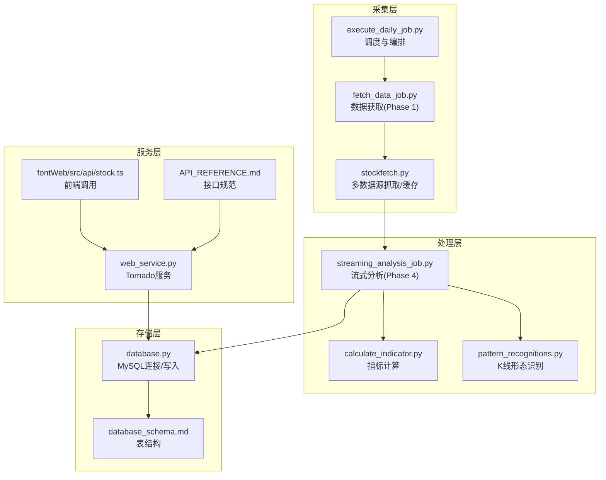
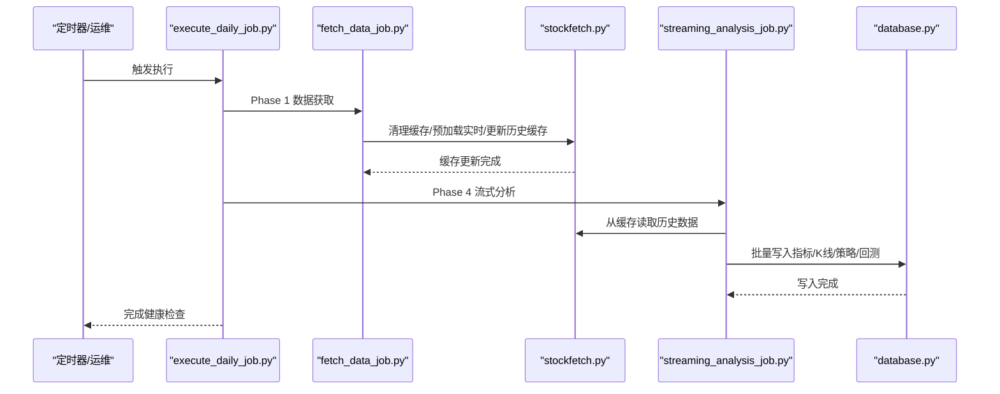
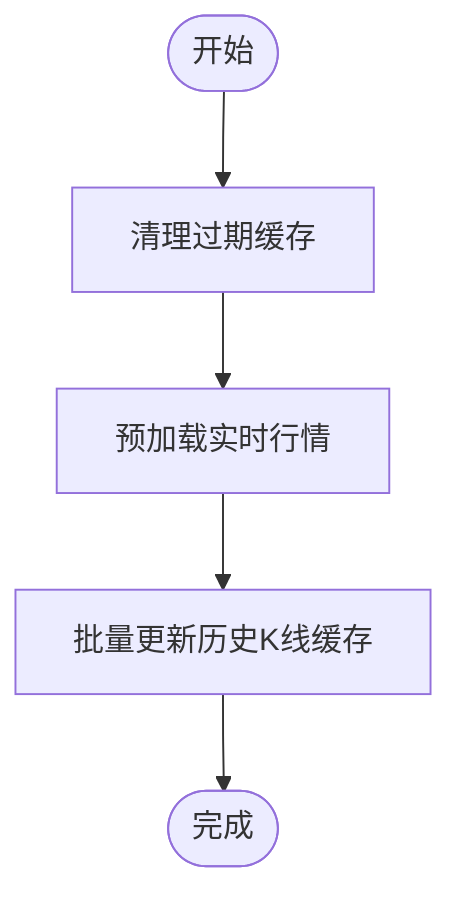
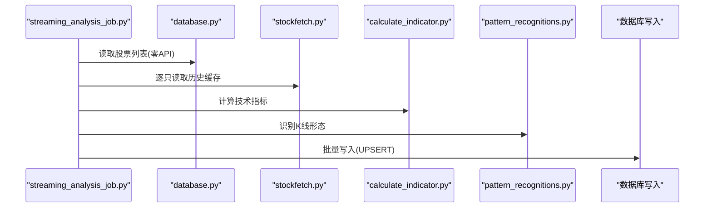
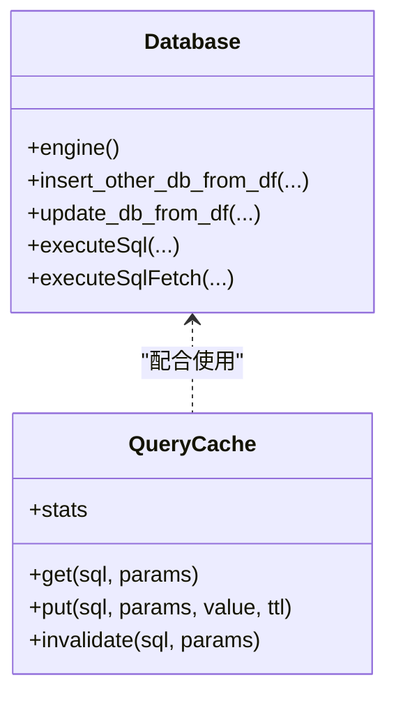
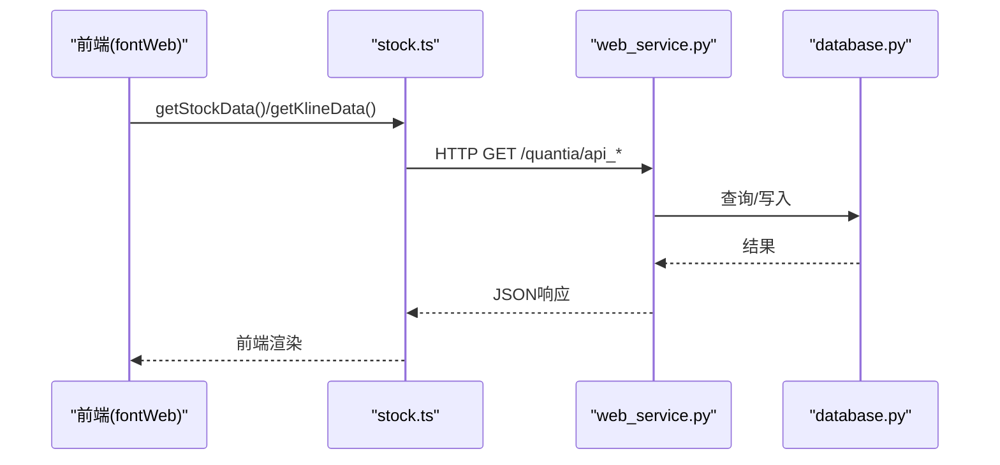
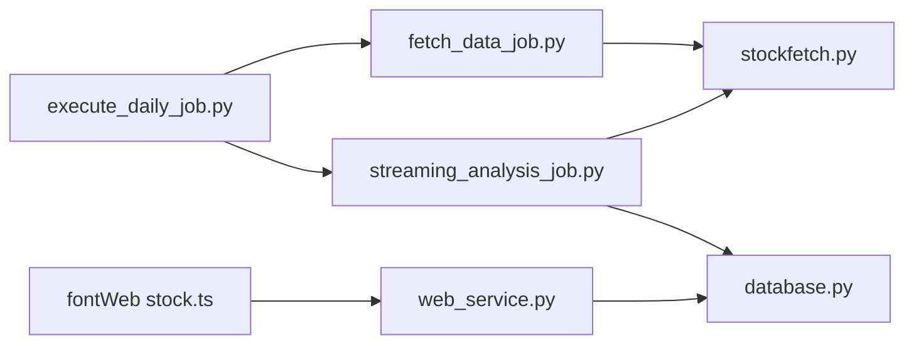

# 数据流设计

<cite>
**本文引用的文件**
- [README.md](file://README.md)
- [QUICKSTART.md](file://QUICKSTART.md)
- [API_REFERENCE.md](file://document/API_REFERENCE.md)
- [database_schema.md](file://document/database_schema.md)
- [execute_daily_job.py](file://quantia/job/execute_daily_job.py)
- [fetch_data_job.py](file://quantia/job/fetch_data_job.py)
- [streaming_analysis_job.py](file://quantia/job/streaming_analysis_job.py)
- [database.py](file://quantia/lib/database.py)
- [query_cache.py](file://quantia/lib/query_cache.py)
- [stockfetch.py](file://quantia/core/stockfetch.py)
- [web_service.py](file://quantia/web/web_service.py)
- [stock.ts](file://quantia/fontWeb/src/api/stock.ts)
- [stock_hist_em.py](file://quantia/core/crawling/stock_hist_em.py)
- [trade_client.json](file://quantia/config/trade_client.json)
</cite>

## 目录
1. [简介](#简介)
2. [项目结构](#项目结构)
3. [核心组件](#核心组件)
4. [架构总览](#架构总览)
5. [详细组件分析](#详细组件分析)
6. [依赖分析](#依赖分析)
7. [性能考量](#性能考量)
8. [故障排查指南](#故障排查指南)
9. [结论](#结论)
10. [附录](#附录)

## 简介
本文件面向Quantia系统，聚焦“数据流设计”。围绕数据从采集、处理、存储到最终使用的完整生命周期，系统性阐述：
- 数据在各模块间的传递方式（同步/异步）
- 缓存策略与一致性保障
- 数据版本与增量更新机制
- 数据质量控制与错误处理
- 典型数据处理场景的流程与时序图
- 性能优化与可扩展性建议

## 项目结构
Quantia采用“采集-分析-入库-服务”的分层架构：
- 采集层：定时作业与API抓取，负责从多家数据源拉取实时/历史数据
- 处理层：流式分析，基于本地缓存进行指标、形态、策略计算
- 存储层：MySQL数据库，承载多类核心表
- 服务层：Tornado Web服务，提供API与前端SPA

**图表来源**
- [execute_daily_job.py](file://quantia/job/execute_daily_job.py#L80-L180)
- [fetch_data_job.py](file://quantia/job/fetch_data_job.py#L38-L119)
- [stockfetch.py](file://quantia/core/stockfetch.py#L744-L782)
- [streaming_analysis_job.py](file://quantia/job/streaming_analysis_job.py#L118-L200)
- [database.py](file://quantia/lib/database.py#L120-L203)
- [database_schema.md](file://document/database_schema.md#L44-L146)
- [web_service.py](file://quantia/web/web_service.py#L53-L98)
- [API_REFERENCE.md](file://document/API_REFERENCE.md#L15-L107)
- [stock.ts](file://quantia/fontWeb/src/api/stock.ts#L26-L71)

**章节来源**
- [README.md](file://README.md#L1-L700)
- [QUICKSTART.md](file://QUICKSTART.md#L157-L167)

## 核心组件
- 采集与编排
  - execute_daily_job.py：统一调度初始化、数据获取、基础数据入库、扩展数据入库、流式分析、回测与收尾，并进行数据健康检查
  - fetch_data_job.py：集中执行Phase 1，清理过期缓存、预加载实时行情、批量更新历史K线缓存
  - stockfetch.py：多数据源抓取（东方财富/腾讯/新浪）、缓存管理、历史数据增量更新、交易日历获取
- 流式分析
  - streaming_analysis_job.py：单次遍历+按需读取+及时释放，零API调用，批量写入数据库
- 存储与缓存
  - database.py：连接池、UPSERT、重试、主键约束自动维护、查询封装
  - query_cache.py：LRU+TTL内存查询缓存（StockData/筛选结果）
- 服务与前端
  - web_service.py：Tornado路由与SPA回退
  - API_REFERENCE.md：API清单与参数说明
  - fontWeb/src/api/stock.ts：前端调用封装

**章节来源**
- [execute_daily_job.py](file://quantia/job/execute_daily_job.py#L80-L180)
- [fetch_data_job.py](file://quantia/job/fetch_data_job.py#L38-L119)
- [stockfetch.py](file://quantia/core/stockfetch.py#L304-L345)
- [streaming_analysis_job.py](file://quantia/job/streaming_analysis_job.py#L118-L200)
- [database.py](file://quantia/lib/database.py#L120-L203)
- [query_cache.py](file://quantia/lib/query_cache.py#L27-L156)
- [web_service.py](file://quantia/web/web_service.py#L53-L98)
- [API_REFERENCE.md](file://document/API_REFERENCE.md#L15-L107)
- [stock.ts](file://quantia/fontWeb/src/api/stock.ts#L26-L71)

## 架构总览
系统遵循“采集-分析-入库-服务”的流水线设计，强调：
- 数据采集与分析解耦：采集阶段集中发起API请求，分析阶段仅读取本地缓存
- 低内存流式处理：单次遍历，按需读取，峰值内存显著降低
- 数据库写入幂等：UPSERT与主键约束保障重复运行不破坏数据
- 前后端分离：Web服务提供REST接口，前端通过AJAX调用

**图表来源**
- [execute_daily_job.py](file://quantia/job/execute_daily_job.py#L80-L180)
- [fetch_data_job.py](file://quantia/job/fetch_data_job.py#L38-L119)
- [stockfetch.py](file://quantia/core/stockfetch.py#L744-L782)
- [streaming_analysis_job.py](file://quantia/job/streaming_analysis_job.py#L118-L200)
- [database.py](file://quantia/lib/database.py#L120-L203)

## 详细组件分析

### 数据采集与缓存（fetch_data_job + stockfetch）
- 缓存策略
  - 历史K线缓存：按股票代码分目录存储，支持增量更新与单位转换（手→股）
  - 多数据源健康度：失败计数、降级冷却、渐进退避，避免热点数据源抖动
  - 代理/频率控制：指数退避重试、日志聚合，降低刷屏与封禁风险
- 数据一致性
  - 通过“日期区间+增量更新”确保历史数据完整性
  - 交易日历优先从DB读取，减少对外部API依赖
- 错误处理
  - 数据源失败自动切换，聚合日志避免刷屏
  - 缓存清理异常不影响后续分析（分析阶段可从缓存读取）

**图表来源**
- [fetch_data_job.py](file://quantia/job/fetch_data_job.py#L38-L119)
- [stockfetch.py](file://quantia/core/stockfetch.py#L744-L782)

**章节来源**
- [fetch_data_job.py](file://quantia/job/fetch_data_job.py#L38-L119)
- [stockfetch.py](file://quantia/core/stockfetch.py#L64-L123)
- [stockfetch.py](file://quantia/core/stockfetch.py#L744-L782)

### 流式分析（streaming_analysis_job）
- 流式处理
  - 从数据库获取股票列表（零API），逐只读取缓存历史数据
  - 同时计算指标、识别K线形态、执行策略，结果分批写入
  - 并发度与批量大小可调，峰值内存显著降低
- 数据版本与一致性
  - 以“日期”为主键维度，按表列定义校验与补齐
  - 延迟删除策略：首次写入前清理当日数据，避免中途崩溃
- 错误处理
  - 单只股票异常不影响整体流程
  - 无API调用，稳定性更高

**图表来源**
- [streaming_analysis_job.py](file://quantia/job/streaming_analysis_job.py#L118-L200)
- [database.py](file://quantia/lib/database.py#L120-L203)
- [stockfetch.py](file://quantia/core/stockfetch.py#L744-L782)

**章节来源**
- [streaming_analysis_job.py](file://quantia/job/streaming_analysis_job.py#L118-L200)
- [database.py](file://quantia/lib/database.py#L120-L203)

### 数据存储与查询缓存（database + query_cache）
- 数据库写入
  - UPSERT策略：INSERT … ON DUPLICATE KEY UPDATE，避免主键冲突与死锁
  - 连接池与重试：瞬态错误自动重试，必要时dispose重建
  - 首次建表自动添加主键与索引，保障唯一性与查询性能
- 查询缓存
  - LRU+TTL：StockData页面与筛选结果分别缓存，提升响应速度
  - 线程安全，支持失效与统计

**图表来源**
- [database.py](file://quantia/lib/database.py#L60-L203)
- [query_cache.py](file://quantia/lib/query_cache.py#L27-L156)

**章节来源**
- [database.py](file://quantia/lib/database.py#L60-L203)
- [query_cache.py](file://quantia/lib/query_cache.py#L27-L156)

### Web服务与前端（web_service + API + 前端）
- Web服务
  - Tornado路由：JSON API + SPA回退，支持前端路由
  - 日志与版本：统一日志配置与版本标识
- API规范
  - 数据表API、指标图表API、策略参数API、回测API、交易日期API
  - 参数校验与错误响应格式
- 前端调用
  - TypeScript封装AJAX请求，统一调用后端接口

**图表来源**
- [web_service.py](file://quantia/web/web_service.py#L53-L98)
- [API_REFERENCE.md](file://document/API_REFERENCE.md#L15-L107)
- [stock.ts](file://quantia/fontWeb/src/api/stock.ts#L26-L71)
- [database.py](file://quantia/lib/database.py#L279-L287)

**章节来源**
- [web_service.py](file://quantia/web/web_service.py#L53-L98)
- [API_REFERENCE.md](file://document/API_REFERENCE.md#L15-L107)
- [stock.ts](file://quantia/fontWeb/src/api/stock.ts#L26-L71)

### 数据质量控制与一致性保障
- 数据源优先级与自动切换：实时行情/历史K线均按“东方财富→腾讯→新浪”顺序，失败自动降级
- 历史数据增量更新：首次全量，后续仅补缺，保证时效与性能
- 数据清洗与过滤：剔除ST、无效价格、非A股等
- 写入幂等与主键约束：UPSERT与首次建表自动索引，避免重复与不一致
- 健康检查：流水线结束后检查核心表当日数据，便于快速定位问题

**章节来源**
- [stockfetch.py](file://quantia/core/stockfetch.py#L304-L345)
- [stockfetch.py](file://quantia/core/stockfetch.py#L744-L782)
- [database.py](file://quantia/lib/database.py#L120-L203)
- [execute_daily_job.py](file://quantia/job/execute_daily_job.py#L182-L226)

### 数据版本与版本管理
- 版本标识：版本号常量用于发布追踪
- 数据表版本：schema文档明确各表字段与索引，变更时遵循迁移策略
- 前端版本：API版本与前端组件版本协同管理

**章节来源**
- [version.py](file://quantia/lib/version.py#L7-L9)
- [database_schema.md](file://document/database_schema.md#L44-L146)

## 依赖分析
- 组件耦合
  - execute_daily_job对各阶段作业有强依赖，但阶段间通过缓存与数据库解耦
  - streaming_analysis_job依赖stockfetch缓存与database写入，零API依赖
  - web_service依赖database与query_cache，API与前端解耦
- 外部依赖
  - MySQL：核心存储
  - 多数据源：东方财富/腾讯/新浪，具备健康度与降级机制
- 循环依赖
  - 未发现直接循环导入；模块间通过函数调用与配置文件解耦

**图表来源**
- [execute_daily_job.py](file://quantia/job/execute_daily_job.py#L80-L180)
- [fetch_data_job.py](file://quantia/job/fetch_data_job.py#L38-L119)
- [streaming_analysis_job.py](file://quantia/job/streaming_analysis_job.py#L118-L200)
- [stockfetch.py](file://quantia/core/stockfetch.py#L744-L782)
- [database.py](file://quantia/lib/database.py#L120-L203)
- [web_service.py](file://quantia/web/web_service.py#L53-L98)
- [stock.ts](file://quantia/fontWeb/src/api/stock.ts#L26-L71)

**章节来源**
- [execute_daily_job.py](file://quantia/job/execute_daily_job.py#L80-L180)
- [web_service.py](file://quantia/web/web_service.py#L53-L98)

## 性能考量
- I/O优化
  - 流式分析单次遍历，I/O次数从“多次遍历×股票数”降至“1次遍历×股票数”
  - 批量写入减少数据库连接开销
- 内存优化
  - 按需读取+及时释放，峰值内存远低于全量加载
  - 并发线程数与批量大小可调，适配不同硬件
- 缓存优化
  - 本地缓存（历史K线）+内存查询缓存（StockData/筛选结果）
  - LRU+TTL避免热点数据长期驻留
- 网络与稳定性
  - 指数退避+日志聚合，降低刷屏与封禁风险
  - 数据源健康度与降级，提升整体可用性

[本节为通用性能指导，无需特定文件引用]

## 故障排查指南
- 数据采集失败
  - 检查代理与Cookie配置，确认数据源健康度与降级状态
  - 查看日志中聚合失败信息与重试间隔
- 数据库连接异常
  - 检查连接池与瞬态错误重试逻辑
  - 确认主键与索引自动维护是否成功
- 分析阶段无数据
  - 确认缓存是否更新成功
  - 检查健康检查日志，核对核心表当日数据
- Web服务异常
  - 查看Tornado日志与路由映射
  - 核对前端请求参数与API响应格式

**章节来源**
- [stockfetch.py](file://quantia/core/stockfetch.py#L64-L123)
- [database.py](file://quantia/lib/database.py#L120-L203)
- [execute_daily_job.py](file://quantia/job/execute_daily_job.py#L182-L226)
- [web_service.py](file://quantia/web/web_service.py#L53-L98)

## 结论
Quantia通过“采集-分析-入库-服务”的清晰分层与严格的缓存/一致性/错误处理机制，实现了高可靠、高性能的数据处理流水线。流式分析与本地缓存显著降低了I/O与内存压力，UPSERT与主键约束保障了数据幂等与一致性，Web服务与前端接口提供了良好的可扩展性。

## 附录
- 数据表概览与关系参见数据库设计文档
- API接口清单与参数说明参见API参考文档
- 前端调用封装参见前端API模块

**章节来源**
- [database_schema.md](file://document/database_schema.md#L733-L774)
- [API_REFERENCE.md](file://document/API_REFERENCE.md#L15-L107)
- [stock.ts](file://quantia/fontWeb/src/api/stock.ts#L26-L71)
