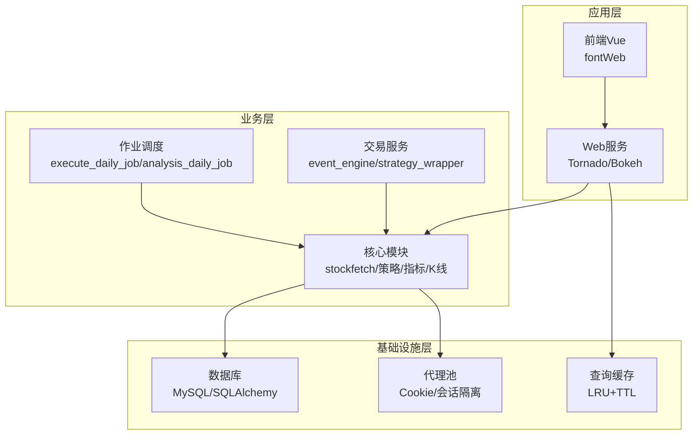
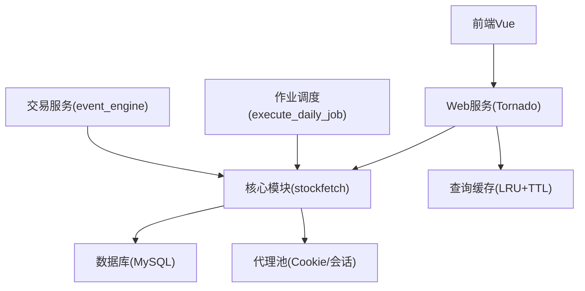
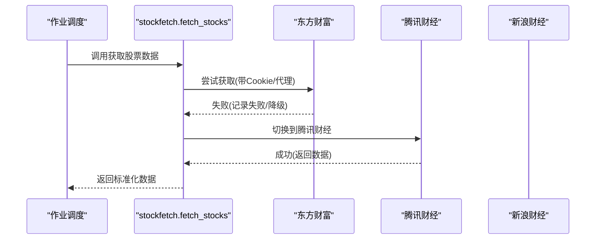
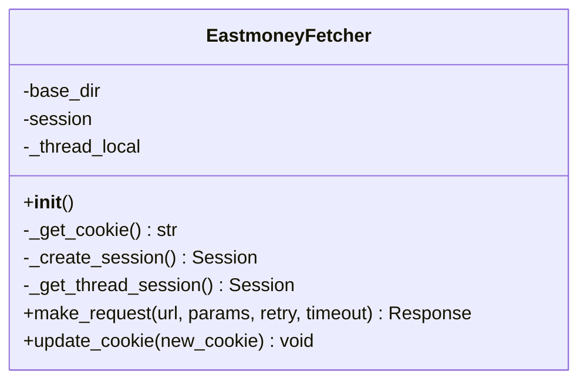
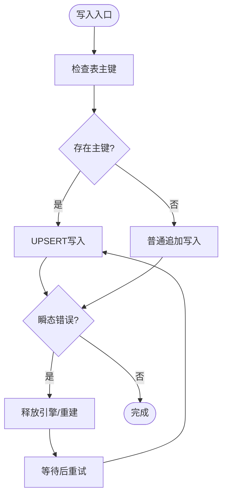
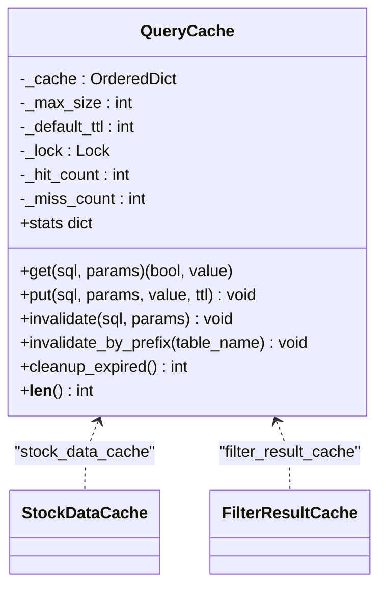
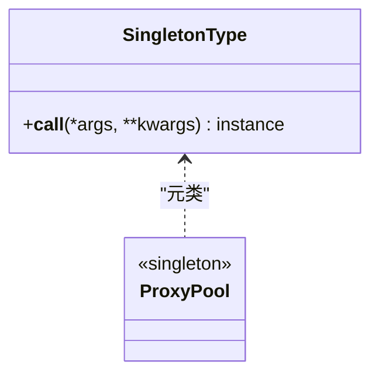
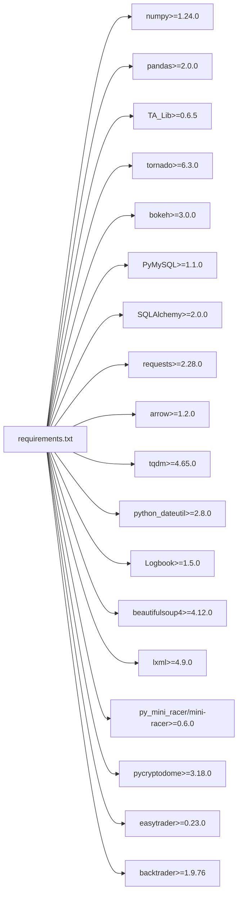

# 架构设计

<cite>
**本文引用的文件**
- [README.md](file://README.md)
- [QUICKSTART.md](file://QUICKSTART.md)
- [requirements.txt](file://requirements.txt)
- [quantia/__init__.py](file://quantia/__init__.py)
- [quantia/core/__init__.py](file://quantia/core/__init__.py)
- [quantia/web/__init__.py](file://quantia/web/__init__.py)
- [quantia/job/__init__.py](file://quantia/job/__init__.py)
- [quantia/lib/__init__.py](file://quantia/lib/__init__.py)
- [quantia/core/stockfetch.py](file://quantia/core/stockfetch.py)
- [quantia/core/eastmoney_fetcher.py](file://quantia/core/eastmoney_fetcher.py)
- [quantia/lib/database.py](file://quantia/lib/database.py)
- [quantia/lib/query_cache.py](file://quantia/lib/query_cache.py)
- [quantia/lib/singleton_type.py](file://quantia/lib/singleton_type.py)
</cite>

## 目录
1. [简介](#简介)
2. [项目结构](#项目结构)
3. [核心组件](#核心组件)
4. [架构总览](#架构总览)
5. [详细组件分析](#详细组件分析)
6. [依赖分析](#依赖分析)
7. [性能考量](#性能考量)
8. [故障排查指南](#故障排查指南)
9. [结论](#结论)
10. [附录](#附录)

## 简介
Quantia（Quantia）是一个面向A股市场的量化数据采集、处理与可视化的系统，具备以下能力：
- 多数据源采集与自动容错切换（东方财富、腾讯财经、新浪财经）
- 历史K线缓存与增量更新
- 技术指标计算、K线形态识别、筹码分布、策略选股
- 回测验证与可视化看板
- Web服务与前端展示
- 交易服务（可选）
- Docker化部署与定时任务调度

系统采用模块化设计，围绕“数据采集-数据处理-指标计算-策略执行-结果展示-持久化存储”的闭环构建，支持策略扩展与插件化接入。

## 项目结构
系统采用按领域/职责划分的模块化组织方式：
- quantia/core：核心业务逻辑（数据采集、指标计算、策略模板）
- quantia/job：批处理作业入口与调度（每日任务、回测、初始化）
- quantia/web：Web服务与路由（Tornado + Bokeh）
- quantia/lib：基础设施（数据库、缓存、单例、代理、运行模板）
- quantia/trade：交易机器人与策略包装（事件引擎、策略模板）
- quantia/fontWeb：Vue前端（数据看板、策略配置、回测面板）

**图表来源**
- [quantia/core/stockfetch.py](file://quantia/core/stockfetch.py#L1-L120)
- [quantia/lib/database.py](file://quantia/lib/database.py#L55-L72)
- [quantia/lib/query_cache.py](file://quantia/lib/query_cache.py#L27-L92)
- [quantia/core/eastmoney_fetcher.py](file://quantia/core/eastmoney_fetcher.py#L16-L74)

**章节来源**
- [README.md](file://README.md#L321-L326)
- [QUICKSTART.md](file://QUICKSTART.md#L157-L167)

## 核心组件
- 数据采集与多源容错：统一入口封装多数据源（东方财富/腾讯/新浪），内置健康度追踪、降级冷却与聚合日志，支持指数退避重试与线程安全会话。
- 历史数据缓存与增量更新：按股票代码分目录缓存，支持按交易日增量更新，避免重复拉取。
- 数据库与事务一致性：单例连接池、UPSERT写入、主键自动创建、可重试瞬态错误。
- 查询缓存：LRU+TTL，区分COUNT/DATA两类缓存，显著降低重复查询压力。
- Web与前端：Tornado提供REST/WS接口，Bokeh可视化，Vue前端提供回测看板与策略配置。
- 交易服务：事件驱动引擎、策略模板与包装器，支持策略注册与生命周期管理。

**章节来源**
- [quantia/core/stockfetch.py](file://quantia/core/stockfetch.py#L38-L186)
- [quantia/core/stockfetch.py](file://quantia/core/stockfetch.py#L744-L782)
- [quantia/lib/database.py](file://quantia/lib/database.py#L55-L107)
- [quantia/lib/query_cache.py](file://quantia/lib/query_cache.py#L27-L156)
- [quantia/core/eastmoney_fetcher.py](file://quantia/core/eastmoney_fetcher.py#L16-L149)

## 架构总览
系统采用分层+模块化架构：
- 展示层：Web服务与前端，负责数据可视化与用户交互
- 业务层：核心数据处理、指标计算、策略模板、K线与筹码分析
- 基础设施层：数据库、缓存、代理、单例与运行模板
- 作业层：定时任务与批处理作业，按交易日推进数据流水线

**图表来源**
- [quantia/core/stockfetch.py](file://quantia/core/stockfetch.py#L256-L346)
- [quantia/lib/database.py](file://quantia/lib/database.py#L55-L72)
- [quantia/lib/query_cache.py](file://quantia/lib/query_cache.py#L147-L156)
- [quantia/core/eastmoney_fetcher.py](file://quantia/core/eastmoney_fetcher.py#L54-L74)

## 详细组件分析

### 数据采集与多源容错（stockfetch）
- 设计要点
  - 健康度追踪：线程安全地记录失败次数、冷却到期时间与降级状态，支持渐进式冷却与恢复日志
  - 聚合日志：同一数据源在固定时间窗口内聚合失败日志，避免刷屏
  - 指数退避重试：基于环境变量可配置的基础间隔与最大重试次数
  - 多数据源优先级：按稳定性排序，失败自动切换，成功后恢复
- 关键流程（ETF/股票/资金流/历史K线）
  - ETF/股票：优先东方财富，其次腾讯/新浪，失败自动切换
  - 资金流：东方财富优先，新浪备选
  - 历史K线：结合缓存与增量更新，统一单位转换与p_change计算
- 线程安全与会话隔离：每个线程独立Session，避免连接池与Cookie混乱

**图表来源**
- [quantia/core/stockfetch.py](file://quantia/core/stockfetch.py#L304-L346)
- [quantia/core/stockfetch.py](file://quantia/core/stockfetch.py#L256-L300)

**章节来源**
- [quantia/core/stockfetch.py](file://quantia/core/stockfetch.py#L38-L186)
- [quantia/core/stockfetch.py](file://quantia/core/stockfetch.py#L304-L346)
- [quantia/core/stockfetch.py](file://quantia/core/stockfetch.py#L428-L463)
- [quantia/core/stockfetch.py](file://quantia/core/stockfetch.py#L744-L782)

### 东方财富数据获取器（eastmoney_fetcher）
- 设计要点
  - 线程本地Session：每个线程独立会话，避免共享Session导致的连接池与Cookie问题
  - Cookie管理：优先环境变量，其次文件，最后默认值
  - 代理与超时：走代理时缩短超时，连接级错误自动换代理或直连
  - 失败反馈：向代理池上报失败，累积到阈值后剔除代理
- 适用场景：高频、多线程、需要Cookie与代理的API调用

**图表来源**
- [quantia/core/eastmoney_fetcher.py](file://quantia/core/eastmoney_fetcher.py#L16-L149)

**章节来源**
- [quantia/core/eastmoney_fetcher.py](file://quantia/core/eastmoney_fetcher.py#L16-L149)

### 数据库与事务一致性（database）
- 设计要点
  - 单例连接池：避免频繁创建连接池，配置最小/最大连接与回收策略
  - UPSERT写入：INSERT ... ON DUPLICATE KEY UPDATE，解决并发冲突
  - 主键自动创建：首次写入检测并创建主键与索引
  - 可重试瞬态错误：对死锁、锁超时、连接异常等进行重试与连接池清理
- 适用场景：高并发写入、幂等重跑、批量导入

**图表来源**
- [quantia/lib/database.py](file://quantia/lib/database.py#L94-L107)
- [quantia/lib/database.py](file://quantia/lib/database.py#L119-L203)

**章节来源**
- [quantia/lib/database.py](file://quantia/lib/database.py#L55-L107)
- [quantia/lib/database.py](file://quantia/lib/database.py#L119-L203)

### 查询缓存（query_cache）
- 设计要点
  - LRU+TTL：线程安全，命中率统计，支持按SQL+参数生成唯一Key
  - 分类缓存：COUNT/DATA两类，分别设置TTL与容量
  - 失效策略：按Key精确失效、按前缀清空（简化实现）
- 适用场景：分页查询、筛选结果、看板数据

**图表来源**
- [quantia/lib/query_cache.py](file://quantia/lib/query_cache.py#L27-L156)

**章节来源**
- [quantia/lib/query_cache.py](file://quantia/lib/query_cache.py#L27-L156)

### 单例基类（singleton_type）
- 设计要点
  - 基于RLock的线程安全单例元类，避免竞态与重复实例
- 适用场景：需要全局唯一实例的组件（如代理池、配置中心）

**图表来源**
- [quantia/lib/singleton_type.py](file://quantia/lib/singleton_type.py#L12-L20)

**章节来源**
- [quantia/lib/singleton_type.py](file://quantia/lib/singleton_type.py#L12-L20)

## 依赖分析
- 技术栈选择
  - 数据处理：NumPy、Pandas、TA-Lib（高性能数值计算与技术指标）
  - Web：Tornado（异步IO）、Bokeh（可视化）
  - 数据库：PyMySQL + SQLAlchemy（连接池、ORM/原生SQL）
  - 网络：requests（会话/代理/超时控制）
  - 工具：arrow、tqdm、dateutil、Logbook（时间/进度/日志）
  - JS引擎：py_mini_racer、mini-racer（筹码计算）
  - 加密：pycryptodome（安全）
  - 交易：easytrader（可选）
  - 回测：backtrader（可选）
- 依赖来源与版本约束：requirements.txt

**图表来源**
- [requirements.txt](file://requirements.txt#L4-L41)

**章节来源**
- [requirements.txt](file://requirements.txt#L1-L41)

## 性能考量
- 并发与资源复用
  - 多数据源自动切换与降级，避免单点失败拖慢整体
  - 线程本地Session与Cookie管理，降低连接池与Cookie冲突
  - 单例连接池与UPSERT写入，减少连接建立与死锁概率
- 缓存策略
  - 历史K线缓存与增量更新，显著降低重复拉取成本
  - 查询缓存（LRU+TTL）减少重复数据库查询
- 指数退避与抖动
  - 避免多线程同时重试引发“惊群效应”，提升整体稳定性
- 可扩展性
  - 策略模板与工厂式注册，便于新增策略
  - Web与前端解耦，便于替换或扩展UI

[本节为通用性能建议，不直接分析具体文件]

## 故障排查指南
- 数据获取失败
  - 检查代理与Cookie配置，确认环境变量或文件已正确设置
  - 观察聚合日志，定位失败数据源与错误类型
- 数据库连接失败
  - 使用requirements中依赖的MySQL客户端工具验证连接
  - 关注瞬态错误（死锁、连接中断）并启用自动重试
- 缓存命中率低
  - 检查SQL参数拼接与Key生成，确保相同查询命中同一缓存
  - 调整TTL与容量，平衡内存占用与命中率
- 交易服务异常
  - 核对交易客户端配置与Broker适配
  - 关注交易日志，排查下单/撤单/验证码识别问题

**章节来源**
- [quantia/core/stockfetch.py](file://quantia/core/stockfetch.py#L146-L168)
- [quantia/lib/database.py](file://quantia/lib/database.py#L109-L117)
- [quantia/lib/query_cache.py](file://quantia/lib/query_cache.py#L123-L136)
- [README.md](file://README.md#L435-L462)

## 结论
Quantia系统通过模块化与分层设计，实现了从数据采集、处理、指标计算到策略执行与可视化的完整闭环。其核心优势在于：
- 多数据源容错与自动切换，保障数据稳定性
- 缓存与连接池优化，兼顾性能与可靠性
- 查询缓存与策略模板，便于扩展与维护
- Web与前端分离，提供良好的用户体验与可扩展性

建议在生产环境中结合监控与告警，持续优化缓存策略与代理池健康度，以应对高并发与多源波动。

[本节为总结性内容，不直接分析具体文件]

## 附录
- 快速开始与常用操作：参见QuickStart文档
- Docker部署与定时任务：参见README与cron说明
- API与数据库设计：参见document目录

**章节来源**
- [QUICKSTART.md](file://QUICKSTART.md#L1-L207)
- [README.md](file://README.md#L535-L690)
