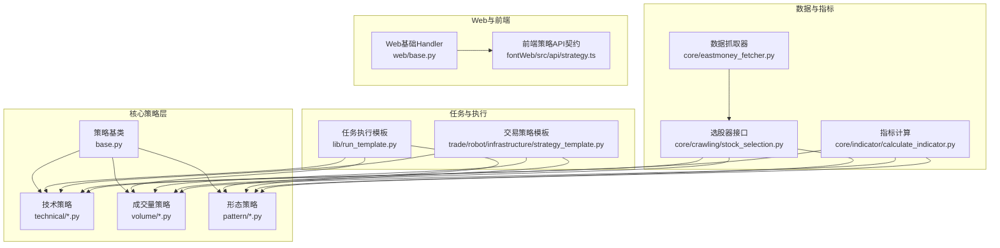
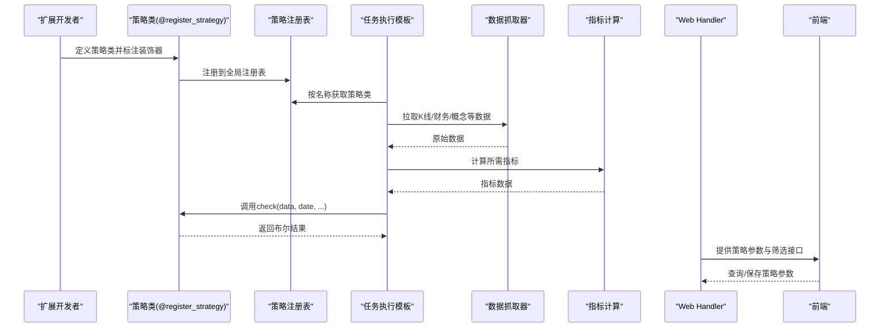
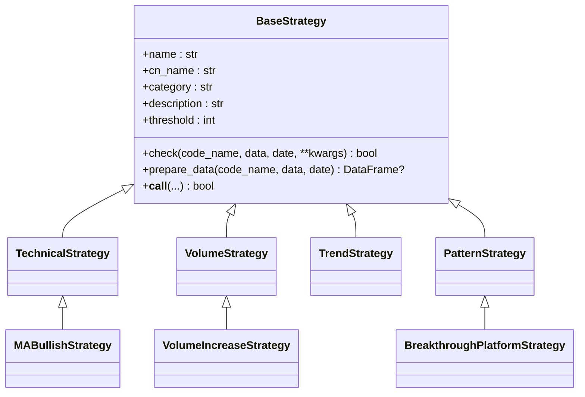
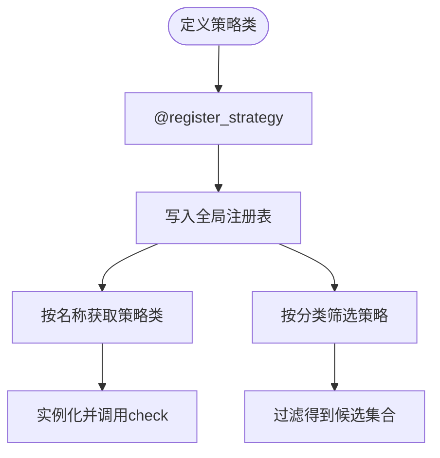
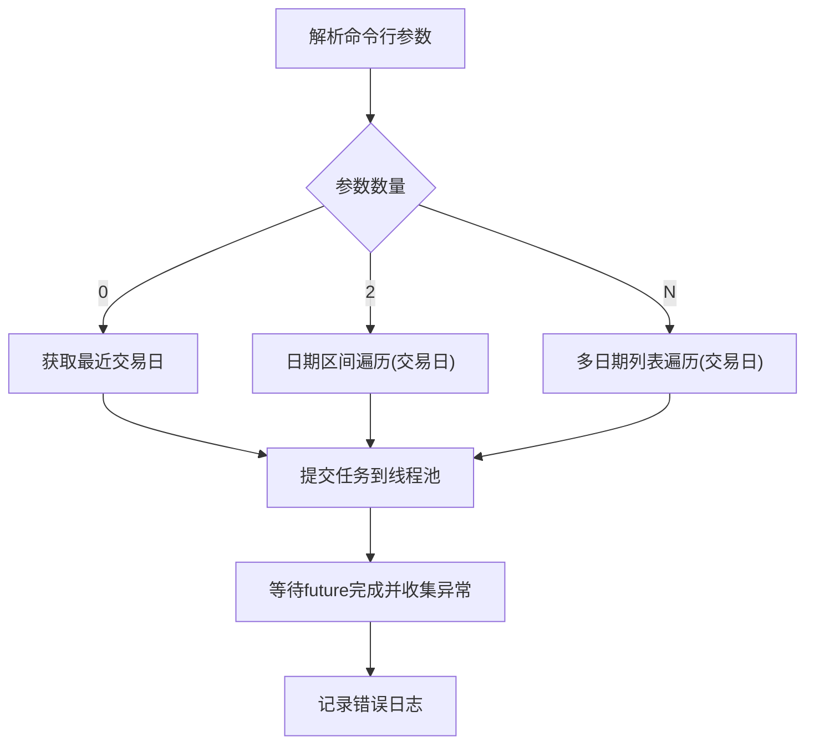
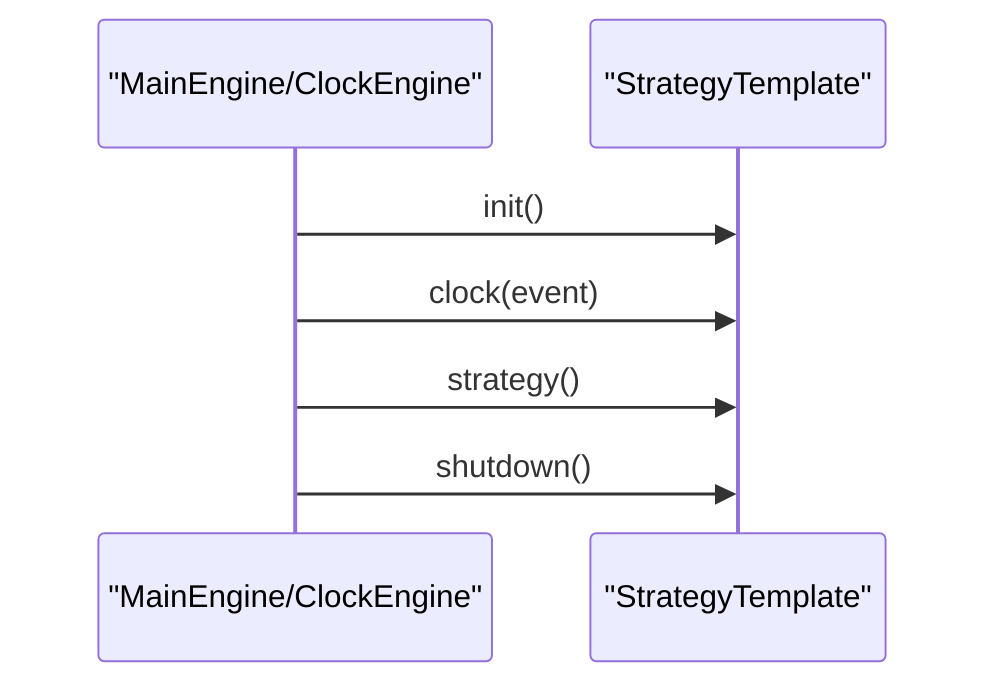
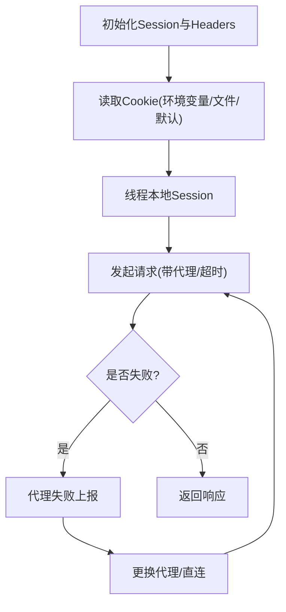
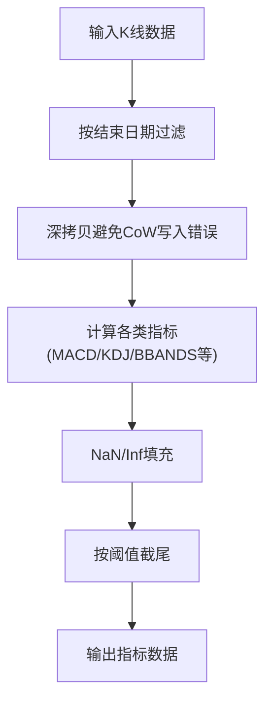
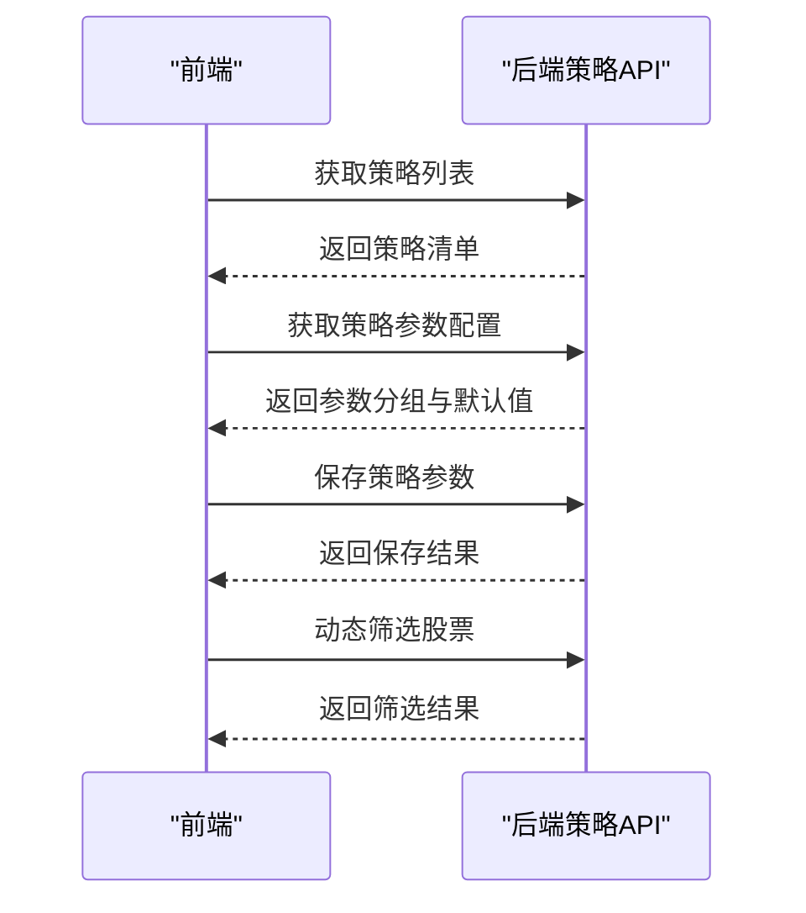
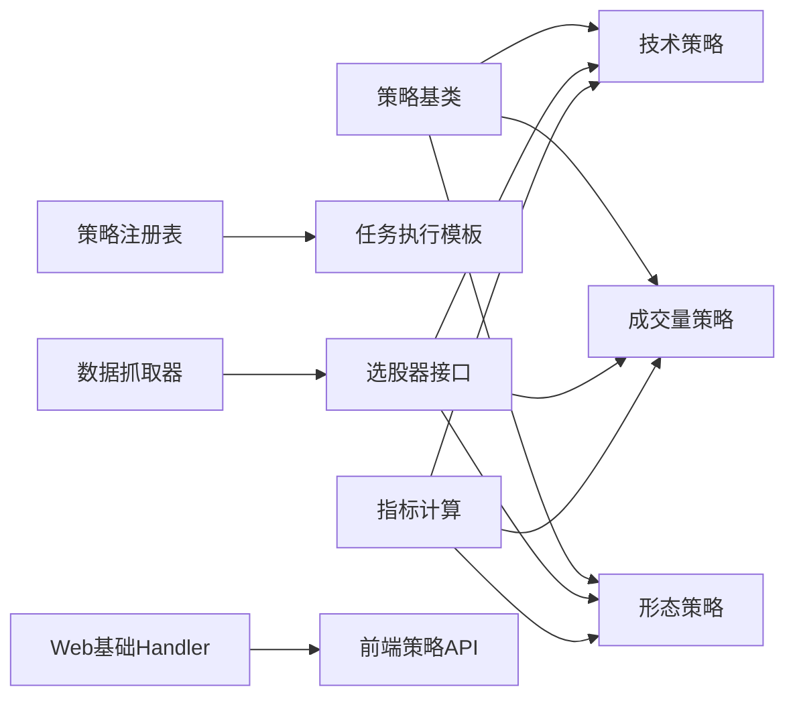

# 扩展点设计

<cite>
**本文引用的文件**
- [quantia/core/strategy/base.py](file://quantia/core/strategy/base.py)
- [quantia/core/strategy/__init__.py](file://quantia/core/strategy/__init__.py)
- [quantia/core/strategy/technical/ma_strategies.py](file://quantia/core/strategy/technical/ma_strategies.py)
- [quantia/core/strategy/volume/volume_strategies.py](file://quantia/core/strategy/volume/volume_strategies.py)
- [quantia/core/strategy/pattern/pattern_strategies.py](file://quantia/core/strategy/pattern/pattern_strategies.py)
- [quantia/lib/run_template.py](file://quantia/lib/run_template.py)
- [quantia/trade/robot/infrastructure/strategy_template.py](file://quantia/trade/robot/infrastructure/strategy_template.py)
- [quantia/trade/robot/infrastructure/default_handler.py](file://quantia/trade/robot/infrastructure/default_handler.py)
- [quantia/core/crawling/stock_selection.py](file://quantia/core/crawling/stock_selection.py)
- [quantia/core/eastmoney_fetcher.py](file://quantia/core/eastmoney_fetcher.py)
- [quantia/core/indicator/calculate_indicator.py](file://quantia/core/indicator/calculate_indicator.py)
- [quantia/web/base.py](file://quantia/web/base.py)
- [quantia/fontWeb/src/api/strategy.ts](file://quantia/fontWeb/src/api/strategy.ts)
</cite>

## 目录
1. [引言](#引言)
2. [项目结构](#项目结构)
3. [核心组件](#核心组件)
4. [架构总览](#架构总览)
5. [详细组件分析](#详细组件分析)
6. [依赖分析](#依赖分析)
7. [性能考虑](#性能考虑)
8. [故障排查指南](#故障排查指南)
9. [结论](#结论)
10. [附录](#附录)

## 引言
本设计文档面向Quantia系统的扩展开发者，系统性阐述策略扩展点、数据源扩展点、指标扩展点与UI组件扩展点的设计与实现方式。重点覆盖：
- 策略扩展点：基类体系、注册机制、策略模板系统、任务执行模板
- 数据源扩展点：适配器模式与Fetcher抽象
- 指标扩展点：指标计算管线与阈值控制
- UI组件扩展点：前端API契约与策略参数配置
- 生命周期管理、配置管理、版本兼容性处理
- 扩展开发指南、最佳实践、常见陷阱与解决方案

## 项目结构
Quantia采用“核心业务层 + 任务调度层 + 交易机器人层 + Web服务层 + 前端应用层”的分层组织。策略、指标、数据采集与Web接口分别位于独立子模块，便于按需扩展与替换。

图表来源
- [quantia/core/strategy/base.py](file://quantia/core/strategy/base.py#L20-L202)
- [quantia/core/strategy/technical/ma_strategies.py](file://quantia/core/strategy/technical/ma_strategies.py#L22-L237)
- [quantia/core/strategy/volume/volume_strategies.py](file://quantia/core/strategy/volume/volume_strategies.py#L19-L126)
- [quantia/core/strategy/pattern/pattern_strategies.py](file://quantia/core/strategy/pattern/pattern_strategies.py#L22-L276)
- [quantia/lib/run_template.py](file://quantia/lib/run_template.py#L18-L95)
- [quantia/trade/robot/infrastructure/strategy_template.py](file://quantia/trade/robot/infrastructure/strategy_template.py#L9-L43)
- [quantia/core/eastmoney_fetcher.py](file://quantia/core/eastmoney_fetcher.py#L16-L149)
- [quantia/core/crawling/stock_selection.py](file://quantia/core/crawling/stock_selection.py#L18-L139)
- [quantia/core/indicator/calculate_indicator.py](file://quantia/core/indicator/calculate_indicator.py#L23-L449)
- [quantia/web/base.py](file://quantia/web/base.py#L14-L48)
- [quantia/fontWeb/src/api/strategy.ts](file://quantia/fontWeb/src/api/strategy.ts#L7-L93)

章节来源
- [quantia/core/strategy/base.py](file://quantia/core/strategy/base.py#L20-L202)
- [quantia/core/strategy/__init__.py](file://quantia/core/strategy/__init__.py#L30-L119)

## 核心组件
- 策略基类与分类：提供统一的check接口、数据准备与阈值控制、分类标签与描述信息，支持技术、成交量、趋势、形态等策略分类。
- 注册机制：通过装饰器将策略类注册到全局注册表，支持按名称获取与按分类筛选。
- 任务执行模板：封装批量日期循环、并发执行、日志初始化、交易日校验等通用逻辑。
- 交易策略模板：提供策略生命周期钩子（初始化、策略执行、时钟事件、关闭），便于交易机器人集成。
- 数据抓取器：封装Cookie管理、会话与线程安全、代理池、重试与失败上报。
- 指标计算：集中化计算多类技术指标，统一NaN/Inf处理，支持阈值裁剪与时间窗口控制。
- Web基础Handler：统一CORS、数据库连接检查与重连。
- 前端策略API契约：定义策略参数模型、分组、查询与保存接口。

章节来源
- [quantia/core/strategy/base.py](file://quantia/core/strategy/base.py#L20-L202)
- [quantia/core/strategy/__init__.py](file://quantia/core/strategy/__init__.py#L30-L119)
- [quantia/lib/run_template.py](file://quantia/lib/run_template.py#L18-L95)
- [quantia/trade/robot/infrastructure/strategy_template.py](file://quantia/trade/robot/infrastructure/strategy_template.py#L9-L43)
- [quantia/core/eastmoney_fetcher.py](file://quantia/core/eastmoney_fetcher.py#L16-L149)
- [quantia/core/indicator/calculate_indicator.py](file://quantia/core/indicator/calculate_indicator.py#L23-L449)
- [quantia/web/base.py](file://quantia/web/base.py#L14-L48)
- [quantia/fontWeb/src/api/strategy.ts](file://quantia/fontWeb/src/api/strategy.ts#L7-L93)

## 架构总览
系统通过“策略注册表”解耦策略实现与调用方；通过“任务执行模板”屏蔽日期遍历、并发与异常处理细节；通过“数据抓取器”与“指标计算”形成稳定的上游数据通道；通过“Web基础Handler”与“前端API契约”支撑可视化与参数配置。

图表来源
- [quantia/core/strategy/base.py](file://quantia/core/strategy/base.py#L159-L191)
- [quantia/lib/run_template.py](file://quantia/lib/run_template.py#L18-L95)
- [quantia/core/eastmoney_fetcher.py](file://quantia/core/eastmoney_fetcher.py#L75-L149)
- [quantia/core/indicator/calculate_indicator.py](file://quantia/core/indicator/calculate_indicator.py#L23-L449)
- [quantia/web/base.py](file://quantia/web/base.py#L14-L48)
- [quantia/fontWeb/src/api/strategy.ts](file://quantia/fontWeb/src/api/strategy.ts#L43-L92)

## 详细组件分析

### 策略扩展点与注册机制
- 基类职责：定义check接口、prepare_data数据准备、阈值控制、类别与描述信息；提供便捷的__call__调用方式。
- 分类基类：技术、成交量、趋势、形态策略基类，统一category字段，便于分类检索。
- 注册机制：装饰器将策略类注册到全局注册表，支持按名称获取与按分类筛选；未注册策略会抛出明确异常。
- 策略模板系统：通过继承策略基类，复用prepare_data与阈值控制，聚焦check逻辑实现。

图表来源
- [quantia/core/strategy/base.py](file://quantia/core/strategy/base.py#L20-L202)
- [quantia/core/strategy/technical/ma_strategies.py](file://quantia/core/strategy/technical/ma_strategies.py#L22-L56)
- [quantia/core/strategy/volume/volume_strategies.py](file://quantia/core/strategy/volume/volume_strategies.py#L19-L69)
- [quantia/core/strategy/pattern/pattern_strategies.py](file://quantia/core/strategy/pattern/pattern_strategies.py#L22-L78)

章节来源
- [quantia/core/strategy/base.py](file://quantia/core/strategy/base.py#L20-L202)
- [quantia/core/strategy/technical/ma_strategies.py](file://quantia/core/strategy/technical/ma_strategies.py#L22-L56)
- [quantia/core/strategy/volume/volume_strategies.py](file://quantia/core/strategy/volume/volume_strategies.py#L19-L69)
- [quantia/core/strategy/pattern/pattern_strategies.py](file://quantia/core/strategy/pattern/pattern_strategies.py#L22-L78)

### 策略注册机制（register_strategy装饰器）
- 使用方式：在策略类定义前添加装饰器，自动注册到全局注册表。
- 获取策略：通过名称获取策略类，或按分类筛选；未注册会抛出异常。
- 兼容性：策略模块导出兼容函数，保持旧接口可用。

图表来源
- [quantia/core/strategy/base.py](file://quantia/core/strategy/base.py#L159-L191)
- [quantia/core/strategy/__init__.py](file://quantia/core/strategy/__init__.py#L21-L25)

章节来源
- [quantia/core/strategy/base.py](file://quantia/core/strategy/base.py#L159-L191)
- [quantia/core/strategy/__init__.py](file://quantia/core/strategy/__init__.py#L21-L25)

### 任务执行模板（run_with_args）
- 功能：支持单日、批量日期、多日列表三种执行模式；自动初始化日志；并发线程池执行；交易日过滤；异常聚合处理。
- 适用场景：策略回测、指标计算、选股数据拉取等周期性任务。

图表来源
- [quantia/lib/run_template.py](file://quantia/lib/run_template.py#L18-L95)

章节来源
- [quantia/lib/run_template.py](file://quantia/lib/run_template.py#L18-L95)

### 交易策略模板（StrategyTemplate）
- 生命周期：init、strategy、clock、shutdown；支持自定义日志句柄优先策略。
- 集成点：与MainEngine、ClockEngine协作，适配事件驱动的交易机器人框架。

图表来源
- [quantia/trade/robot/infrastructure/strategy_template.py](file://quantia/trade/robot/infrastructure/strategy_template.py#L9-L43)

章节来源
- [quantia/trade/robot/infrastructure/strategy_template.py](file://quantia/trade/robot/infrastructure/strategy_template.py#L9-L43)

### 数据源适配器模式（eastmoney_fetcher）
- 设计要点：线程本地Session、Cookie优先级（环境变量 > 文件 > 默认）、代理池重试与失败上报、超时策略。
- 适配能力：统一请求入口，屏蔽代理与Cookie变化带来的兼容性问题。

图表来源
- [quantia/core/eastmoney_fetcher.py](file://quantia/core/eastmoney_fetcher.py#L16-L149)

章节来源
- [quantia/core/eastmoney_fetcher.py](file://quantia/core/eastmoney_fetcher.py#L16-L149)

### 指标扩展点（calculate_indicator）
- 统一入口：按结束日期与阈值裁剪数据，统一NaN/Inf处理，保证下游策略稳定性。
- 扩展方式：新增指标时在统一函数内追加计算逻辑，注意填充与阈值控制。
- 性能建议：尽量使用向量化计算与talib内置函数，避免逐行循环。

图表来源
- [quantia/core/indicator/calculate_indicator.py](file://quantia/core/indicator/calculate_indicator.py#L23-L449)

章节来源
- [quantia/core/indicator/calculate_indicator.py](file://quantia/core/indicator/calculate_indicator.py#L23-L449)

### UI组件扩展点（前端策略API）
- API契约：策略列表、参数分组、参数项、查询与保存接口。
- 扩展方式：在后端提供新的策略参数配置与筛选接口，前端通过API契约对接。

图表来源
- [quantia/fontWeb/src/api/strategy.ts](file://quantia/fontWeb/src/api/strategy.ts#L43-L92)
- [quantia/web/base.py](file://quantia/web/base.py#L14-L48)

章节来源
- [quantia/fontWeb/src/api/strategy.ts](file://quantia/fontWeb/src/api/strategy.ts#L7-L93)
- [quantia/web/base.py](file://quantia/web/base.py#L14-L48)

## 依赖分析
- 策略层依赖：策略基类与分类基类；策略通过装饰器注册到全局表；兼容模块导出旧接口。
- 执行层依赖：任务模板依赖交易日工具；交易模板依赖MainEngine/ClockEngine。
- 数据层依赖：数据抓取器依赖代理池与Cookie；选股器接口依赖抓取器。
- 指标层依赖：指标计算依赖talib与pandas/numpy；统一填充与阈值控制。
- Web层依赖：基础Handler依赖数据库连接与CORS；前端API契约与后端接口一致。

图表来源
- [quantia/core/strategy/base.py](file://quantia/core/strategy/base.py#L159-L202)
- [quantia/lib/run_template.py](file://quantia/lib/run_template.py#L18-L95)
- [quantia/core/eastmoney_fetcher.py](file://quantia/core/eastmoney_fetcher.py#L75-L149)
- [quantia/core/crawling/stock_selection.py](file://quantia/core/crawling/stock_selection.py#L18-L139)
- [quantia/core/indicator/calculate_indicator.py](file://quantia/core/indicator/calculate_indicator.py#L23-L449)
- [quantia/web/base.py](file://quantia/web/base.py#L14-L48)
- [quantia/fontWeb/src/api/strategy.ts](file://quantia/fontWeb/src/api/strategy.ts#L43-L92)

章节来源
- [quantia/core/strategy/__init__.py](file://quantia/core/strategy/__init__.py#L30-L119)
- [quantia/core/strategy/base.py](file://quantia/core/strategy/base.py#L159-L202)

## 性能考虑
- 策略层：优先使用向量化与talib内置函数，避免逐行循环；合理设置阈值，减少无效计算。
- 指标层：统一NaN/Inf处理，避免下游计算异常；按阈值截尾，减少内存占用。
- 数据层：线程本地Session提升并发安全性；代理池失败上报与超时策略降低整体失败率。
- 执行层：线程池并发与交易日过滤，平衡吞吐与合规性。

## 故障排查指南
- 策略未注册：检查装饰器是否正确使用，确认名称唯一；通过注册表获取策略时若抛出异常，检查名称拼写与导入路径。
- 数据抓取失败：检查Cookie来源（环境变量/文件），确认代理池状态；关注连接级错误与HTTP状态码。
- 指标计算异常：确认输入数据非空与列存在；关注NaN/Inf情况下的填充策略。
- Web接口异常：检查CORS头设置与数据库连接重连逻辑；确认后端路由与前端API契约一致。

章节来源
- [quantia/core/strategy/base.py](file://quantia/core/strategy/base.py#L183-L185)
- [quantia/core/eastmoney_fetcher.py](file://quantia/core/eastmoney_fetcher.py#L116-L142)
- [quantia/core/indicator/calculate_indicator.py](file://quantia/core/indicator/calculate_indicator.py#L405-L407)
- [quantia/web/base.py](file://quantia/web/base.py#L30-L36)
- [quantia/fontWeb/src/api/strategy.ts](file://quantia/fontWeb/src/api/strategy.ts#L43-L92)

## 结论
Quantia通过策略注册表、任务执行模板、数据抓取器与指标计算管线，构建了高内聚、低耦合的扩展体系。开发者只需遵循基类约定、使用注册机制与模板接口，即可快速扩展策略、数据源与UI组件。配套的日志、并发与异常处理机制保障了生产环境的稳定性与可维护性。

## 附录
- 扩展开发指南
  - 继承策略基类并实现check逻辑，必要时复用prepare_data与阈值控制。
  - 使用装饰器注册策略，确保名称唯一且语义清晰。
  - 在任务模板中编排策略执行流程，利用并发与交易日过滤。
  - 通过数据抓取器与指标计算扩展数据源与指标集。
  - 在Web层提供策略参数配置与筛选接口，前端通过API契约对接。
- 最佳实践
  - 明确策略分类与阈值设定，避免过度拟合。
  - 统一异常处理与日志记录，便于追踪与定位。
  - 保持接口稳定与兼容性，逐步迁移旧接口。
- 常见陷阱
  - 未注册策略导致运行时异常。
  - 数据为空或列缺失引发计算错误。
  - 多线程共享Session导致连接池损坏。
  - 前后端API契约不一致导致交互失败。
- 版本兼容性
  - 保留兼容模块与旧接口，逐步迁移至新接口。
  - 严格控制策略命名与注册表键值，避免冲突。
  - 指标计算与数据列命名保持稳定，必要时提供映射与转换。
