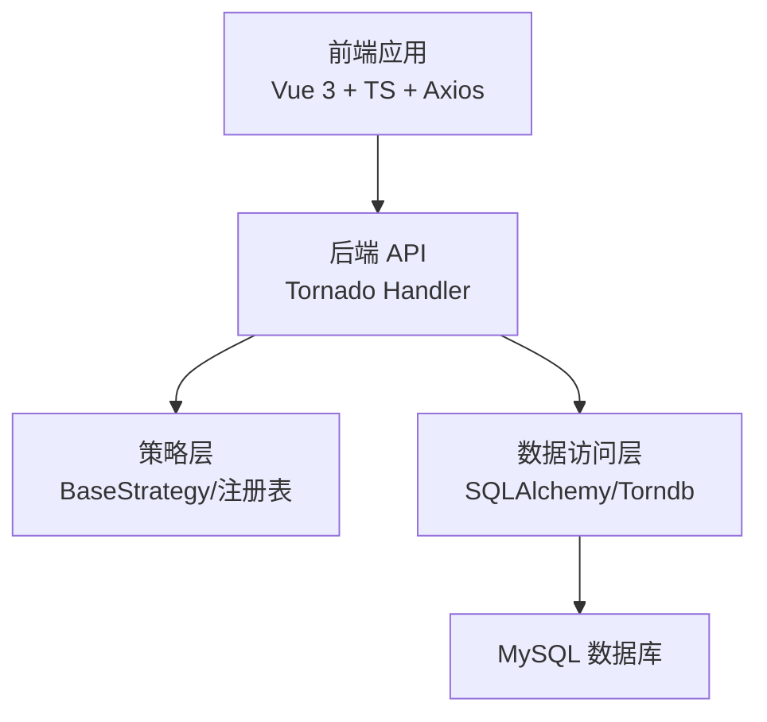
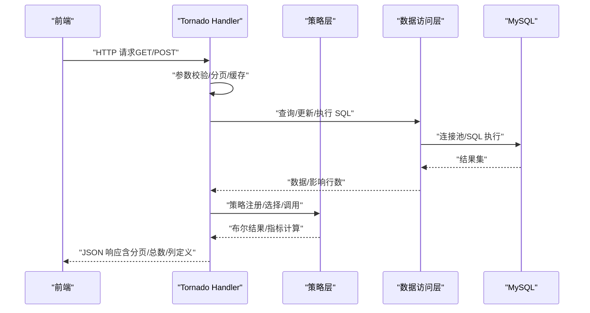
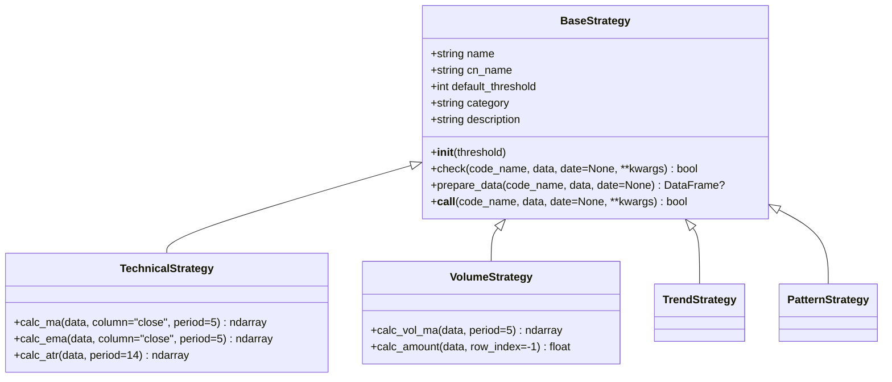
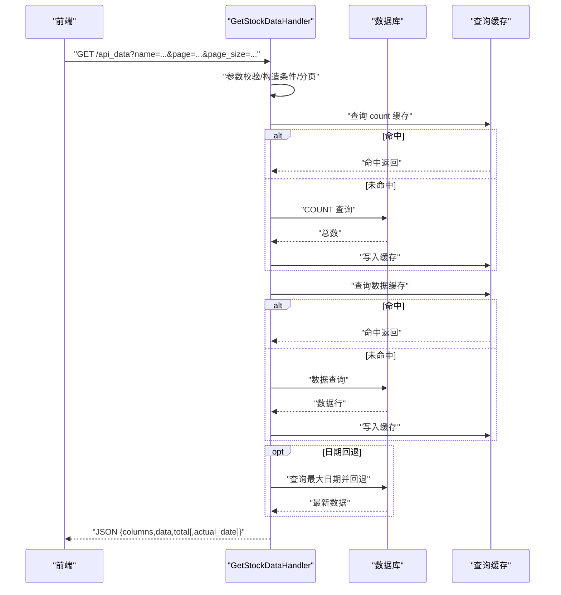
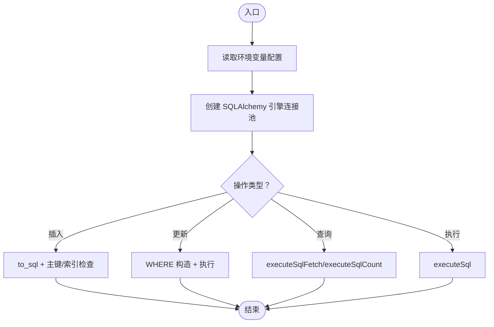
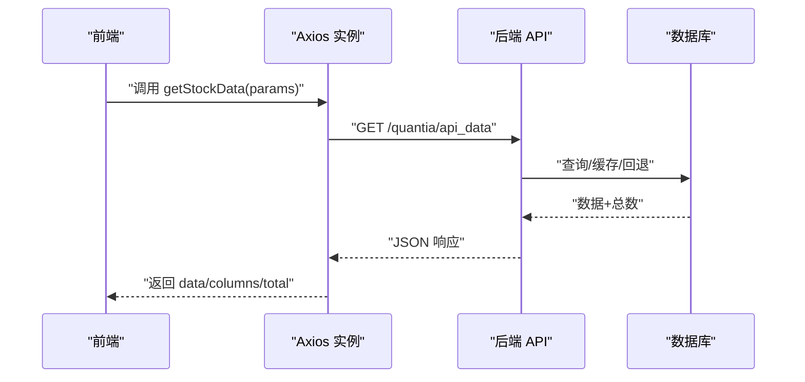
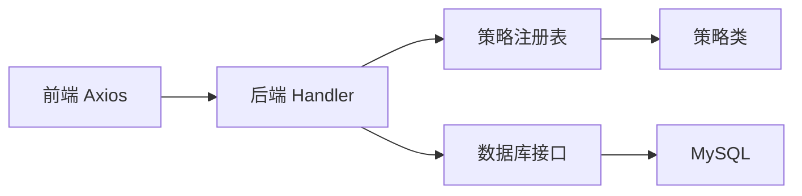
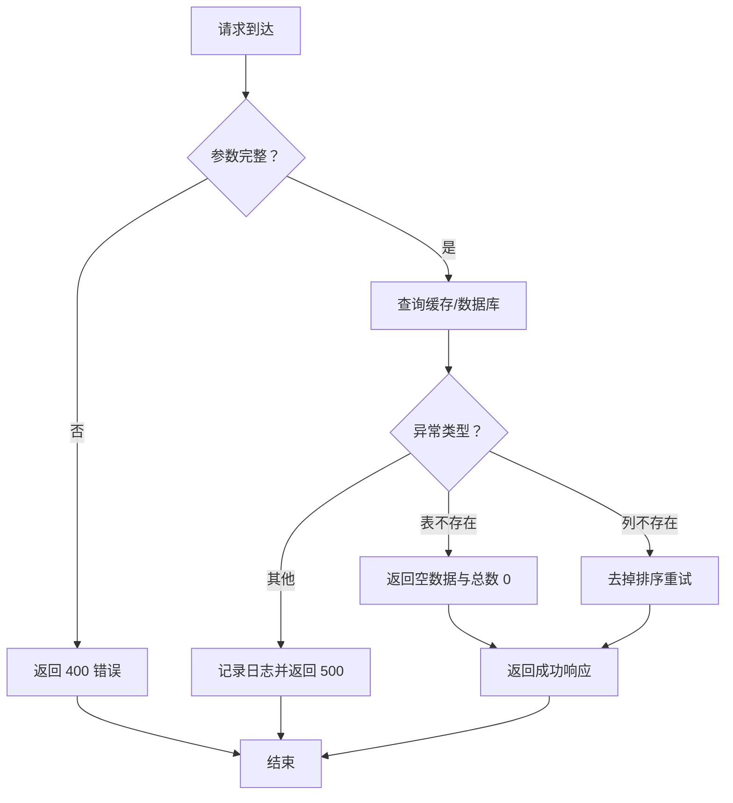

# 接口设计规范

<cite>
**本文引用的文件**
- [docker/stock/quantia/lib/database.py](file://docker/stock/quantia/lib/database.py)
- [docker/stock/quantia/web/base.py](file://docker/stock/quantia/web/base.py)
- [docker/stock/quantia/fontWeb/src/api/request.ts](file://docker/stock/quantia/fontWeb/src/api/request.ts)
- [docker/stock/quantia/fontWeb/src/api/stock.ts](file://docker/stock/quantia/fontWeb/src/api/stock.ts)
- [docker/stock/quantia/fontWeb/src/api/strategy.ts](file://docker/stock/quantia/fontWeb/src/api/strategy.ts)
- [docker/stock/quantia/fontWeb/src/types/stock.ts](file://docker/stock/quantia/fontWeb/src/types/stock.ts)
- [docker/stock/quantia/core/strategy/base.py](file://docker/stock/quantia/core/strategy/base.py)
- [docker/stock/quantia/web/dataTableHandler.py](file://docker/stock/quantia/web/dataTableHandler.py)
</cite>

## 目录
1. [简介](#简介)
2. [项目结构](#项目结构)
3. [核心组件](#核心组件)
4. [架构总览](#架构总览)
5. [详细组件分析](#详细组件分析)
6. [依赖分析](#依赖分析)
7. [性能考虑](#性能考虑)
8. [故障排查指南](#故障排查指南)
9. [结论](#结论)
10. [附录](#附录)

## 简介
本规范面向 Quantia 系统，旨在统一策略接口、Web API、数据库接口与前端 API 的设计与实现标准，明确接口命名、参数约定、返回格式、错误码、版本管理与兼容性策略，提供接口文档模板、参数校验规则与异常处理机制，帮助团队以一致的接口设计提升系统的可维护性与可扩展性。

## 项目结构
系统采用前后端分离架构：
- 后端基于 Tornado Web 框架，提供 RESTful API；
- 前端基于 Vue 3 + TypeScript + Axios，封装统一请求与响应拦截；
- 策略层提供统一的策略基类与注册机制；
- 数据访问层基于 SQLAlchemy/Torndb 与原生 MySQL 连接，提供 ORM 与 SQL 辅助能力；
- Web 层 Handler 负责参数解析、权限与跨域、数据查询与缓存、错误处理与响应格式化。

图表来源
- [docker/stock/quantia/web/dataTableHandler.py](file://docker/stock/quantia/web/dataTableHandler.py#L1-L232)
- [docker/stock/quantia/lib/database.py](file://docker/stock/quantia/lib/database.py#L1-L232)
- [docker/stock/quantia/core/strategy/base.py](file://docker/stock/quantia/core/strategy/base.py#L1-L202)

章节来源
- [docker/stock/quantia/web/dataTableHandler.py](file://docker/stock/quantia/web/dataTableHandler.py#L1-L232)
- [docker/stock/quantia/lib/database.py](file://docker/stock/quantia/lib/database.py#L1-L232)
- [docker/stock/quantia/core/strategy/base.py](file://docker/stock/quantia/core/strategy/base.py#L1-L202)

## 核心组件
- 策略接口：统一 check 方法签名、参数约定与返回值；提供策略注册与分类体系。
- Web API 接口：RESTful 设计，参数校验、分页、缓存、跨域与错误码规范化。
- 数据库接口：ORM 规范、连接池配置、SQL 辅助方法、主键与索引管理。
- 前端 API 接口：TypeScript 类型定义、Axios 统一请求与响应拦截、错误提示。

章节来源
- [docker/stock/quantia/core/strategy/base.py](file://docker/stock/quantia/core/strategy/base.py#L1-L202)
- [docker/stock/quantia/web/dataTableHandler.py](file://docker/stock/quantia/web/dataTableHandler.py#L1-L232)
- [docker/stock/quantia/lib/database.py](file://docker/stock/quantia/lib/database.py#L1-L232)
- [docker/stock/quantia/fontWeb/src/api/request.ts](file://docker/stock/quantia/fontWeb/src/api/request.ts#L1-L39)
- [docker/stock/quantia/fontWeb/src/api/stock.ts](file://docker/stock/quantia/fontWeb/src/api/stock.ts#L1-L187)
- [docker/stock/quantia/fontWeb/src/api/strategy.ts](file://docker/stock/quantia/fontWeb/src/api/strategy.ts#L1-L93)
- [docker/stock/quantia/fontWeb/src/types/stock.ts](file://docker/stock/quantia/fontWeb/src/types/stock.ts#L1-L80)

## 架构总览
下图展示从前端请求到后端处理、策略执行与数据库交互的整体流程。

图表来源
- [docker/stock/quantia/web/dataTableHandler.py](file://docker/stock/quantia/web/dataTableHandler.py#L54-L215)
- [docker/stock/quantia/lib/database.py](file://docker/stock/quantia/lib/database.py#L78-L231)
- [docker/stock/quantia/core/strategy/base.py](file://docker/stock/quantia/core/strategy/base.py#L47-L96)

## 详细组件分析

### 策略接口规范
- 统一规范
  - 方法签名：check(code_name, data, date=None, **kwargs) -> bool
  - 输入参数：
    - code_name: 股票标识元组，形如 (date_str, code)
    - data: 股票历史 K 线数据（DataFrame）
    - date: 检查日期，默认 None 使用 code_name 中的日期
    - kwargs: 策略额外参数
  - 返回值：bool，True 表示满足策略条件
  - 数据准备：prepare_data 会按截止日期过滤并校验最小数据长度阈值
  - 策略分类：技术指标、成交量、趋势、形态等分类，便于筛选与展示
  - 注册机制：register_strategy 装饰器注册，get_strategy/get_all_strategies/get_strategies_by_category 提供检索

图表来源
- [docker/stock/quantia/core/strategy/base.py](file://docker/stock/quantia/core/strategy/base.py#L20-L202)

章节来源
- [docker/stock/quantia/core/strategy/base.py](file://docker/stock/quantia/core/strategy/base.py#L20-L202)

### Web API 接口规范（RESTful）
- 跨域与默认头
  - 支持 CORS：允许任意源、常用头部与方法、预检缓存
  - 预检处理：options 返回 204
- 基础处理器
  - 每次请求检查数据库连接，异常则自动重连
- 数据查询接口（示例）
  - 路径：/api_data
  - 方法：GET
  - 参数：name（必填）、date、page、page_size、keyword
  - 返回：columns（列定义）、data（数据行）、total（总数），若发生日期回退，附加 actual_date
  - 分页：page/page_size，最小 1，最大 500
  - 缓存：对 count 与数据查询进行缓存，提升性能
  - 错误处理：缺失 name 返回 400；表不存在或列不存在时优雅降级；其他异常返回 500
- 交易日接口
  - 路径：/api/trade_date
  - 方法：GET
  - 返回：run_date（最近已收盘交易日）、run_date_nph（当前交易日）

图表来源
- [docker/stock/quantia/web/dataTableHandler.py](file://docker/stock/quantia/web/dataTableHandler.py#L54-L215)

章节来源
- [docker/stock/quantia/web/base.py](file://docker/stock/quantia/web/base.py#L14-L37)
- [docker/stock/quantia/web/dataTableHandler.py](file://docker/stock/quantia/web/dataTableHandler.py#L54-L215)

### 数据库接口规范（ORM 与 SQL）
- 连接配置
  - 支持环境变量注入（QUANTIA_DB_HOST、QUANTIA_DB_USER、QUANTIA_DB_PASSWORD、QUANTIA_DB_DATABASE、QUANTIA_DB_PORT）
  - URL 编码处理密码，字符集 utf8mb4
  - 连接池：pool_size=2、max_overflow=3、recycle=600、pre_ping=True、timeout=30
- 通用方法
  - 插入：insert_db_from_df / insert_other_db_from_df，支持列类型映射与主键/索引自动添加
  - 更新：update_db_from_df，支持 WHERE 条件与空值转换
  - 查询：executeSqlFetch，返回全部结果；executeSqlCount，返回整数计数
  - 执行：executeSql，抛出异常；checkTableIsExist，检查表存在
- 连接对象
  - get_connection：pymysql 连接，超时与自动提交配置

图表来源
- [docker/stock/quantia/lib/database.py](file://docker/stock/quantia/lib/database.py#L58-L231)

章节来源
- [docker/stock/quantia/lib/database.py](file://docker/stock/quantia/lib/database.py#L1-L232)

### 前端 API 接口与类型定义
- 统一请求
  - 基地址：/quantia
  - 超时：60 秒
  - Content-Type：application/json
  - 请求拦截：透传
  - 响应拦截：返回 response.data；错误时弹出服务端 error 或默认消息
- 股票数据 API
  - getStockData(params)：分页与关键词搜索
  - getStockIndicators(params)：指标详情
  - toggleAttention(params)：关注/取消关注
  - getTradeDate()：最近交易日
  - 回测相关：配置、单只回测、批量回测、看板概览/时间线/策略明细/分布/交易对
  - K 线数据：period 支持 daily/weekly/monthly/quarterly/yearly
- 策略参数 API
  - getStrategyList()/getStrategyParams()/saveStrategyParams()/resetStrategyParams()
  - filterStocks(strategy, date?, page?, pageSize?)
- 类型定义
  - StockSpot、StockIndicator、KlineData、KlinePattern、StrategyResult、BacktestResult
  - 参数接口：StockDataParams、StockIndicatorParams、AttentionParams、BacktestParams、BatchBacktestParams、Dashboard*Params、KlineParams、StrategyParam/ParamGroup/StrategyParamsResponse/StrategyListItem

图表来源
- [docker/stock/quantia/fontWeb/src/api/request.ts](file://docker/stock/quantia/fontWeb/src/api/request.ts#L1-L39)
- [docker/stock/quantia/fontWeb/src/api/stock.ts](file://docker/stock/quantia/fontWeb/src/api/stock.ts#L26-L186)

章节来源
- [docker/stock/quantia/fontWeb/src/api/request.ts](file://docker/stock/quantia/fontWeb/src/api/request.ts#L1-L39)
- [docker/stock/quantia/fontWeb/src/api/stock.ts](file://docker/stock/quantia/fontWeb/src/api/stock.ts#L1-L187)
- [docker/stock/quantia/fontWeb/src/api/strategy.ts](file://docker/stock/quantia/fontWeb/src/api/strategy.ts#L1-L93)
- [docker/stock/quantia/fontWeb/src/types/stock.ts](file://docker/stock/quantia/fontWeb/src/types/stock.ts#L1-L80)

## 依赖分析
- 前端到后端：Axios 实例统一转发至 /quantia 前缀，后端 Handler 解析参数并调用数据访问层
- 后端到策略：Handler 可根据策略名称通过注册表获取策略类并调用 check
- 后端到数据库：统一通过 lib.database 提供的 engine/get_connection 与 SQL 辅助方法
- 跨域与连接健康：BaseHandler 设置 CORS 并在每次请求检查 DB 连接

图表来源
- [docker/stock/quantia/fontWeb/src/api/request.ts](file://docker/stock/quantia/fontWeb/src/api/request.ts#L5-L11)
- [docker/stock/quantia/web/dataTableHandler.py](file://docker/stock/quantia/web/dataTableHandler.py#L54-L215)
- [docker/stock/quantia/core/strategy/base.py](file://docker/stock/quantia/core/strategy/base.py#L159-L202)
- [docker/stock/quantia/lib/database.py](file://docker/stock/quantia/lib/database.py#L58-L74)

章节来源
- [docker/stock/quantia/fontWeb/src/api/request.ts](file://docker/stock/quantia/fontWeb/src/api/request.ts#L1-L39)
- [docker/stock/quantia/web/dataTableHandler.py](file://docker/stock/quantia/web/dataTableHandler.py#L1-L232)
- [docker/stock/quantia/core/strategy/base.py](file://docker/stock/quantia/core/strategy/base.py#L1-L202)
- [docker/stock/quantia/lib/database.py](file://docker/stock/quantia/lib/database.py#L1-L232)

## 性能考虑
- 连接池与超时：合理设置 pool_size/max_overflow/recycle/pre_ping，避免高并发下的连接拥塞
- 查询缓存：对 COUNT 与数据查询进行缓存，减少重复查询；注意缓存键与失效策略
- 分页限制：page/page_size 最小 1、最大 500，防止过大分页导致内存压力
- 日期回退：当按指定日期查询无数据时自动回退到最近有数据日期，避免前端多次轮询
- 响应序列化：自定义 JSONEncoder 处理日期与字节类型，避免序列化异常

章节来源
- [docker/stock/quantia/lib/database.py](file://docker/stock/quantia/lib/database.py#L58-L74)
- [docker/stock/quantia/web/dataTableHandler.py](file://docker/stock/quantia/web/dataTableHandler.py#L112-L206)

## 故障排查指南
- 常见错误码
  - 400：缺少必要参数（如 name）
  - 404：未找到数据模块
  - 500：查询异常、未知列、SQL 执行失败
- 错误处理流程
  - 参数缺失：立即返回 400 并携带错误信息
  - 表不存在：返回空数据与总数 0，不抛 500
  - ORDER BY 引用不存在列：记录警告并去掉排序重试
  - 其他异常：记录日志并返回 500
- 前端错误提示
  - 响应拦截器优先显示服务端 error 字段，否则显示默认错误消息

图表来源
- [docker/stock/quantia/web/dataTableHandler.py](file://docker/stock/quantia/web/dataTableHandler.py#L63-L179)

章节来源
- [docker/stock/quantia/web/dataTableHandler.py](file://docker/stock/quantia/web/dataTableHandler.py#L63-L179)
- [docker/stock/quantia/fontWeb/src/api/request.ts](file://docker/stock/quantia/fontWeb/src/api/request.ts#L25-L36)

## 结论
通过统一的策略接口、RESTful Web API、ORM 规范与前端类型定义，Quantia 系统实现了清晰的职责边界与一致的交互体验。建议在后续迭代中持续完善版本管理与向后兼容策略，强化参数校验与错误码标准化，并在前端引入更细粒度的错误状态码映射，进一步提升系统的稳定性与可维护性。

## 附录

### 接口文档模板
- 接口名称：示例
- 请求路径：/api/example
- 请求方法：GET/POST
- 功能描述：简要说明用途
- 请求参数：
  - name: string, 必填/可选, 示例值
  - date: string, YYYY-MM-DD, 可选
  - page/page_size: number, 可选, 分页范围
- 响应示例：
  - 成功：{ columns, data, total, actual_date? }
  - 失败：{ error, code }
- 错误码：
  - 400：缺少必要参数
  - 404：资源不存在
  - 500：服务器内部错误

### 参数验证规则
- 必填参数：name 必须存在
- 分页参数：page ≥ 1，page_size ∈ [1, 500]
- 日期格式：YYYY-MM-DD
- 关键词搜索：支持模糊匹配 code/name

### 异常处理机制
- 后端：捕获异常并返回结构化错误；对表不存在与列不存在进行降级处理
- 前端：统一拦截响应错误，优先展示服务端 error 字段

### 版本管理与向后兼容
- 建议采用语义化版本（MAJOR.MINOR.PATCH），在路径中加入版本前缀（如 /v1/api/...）
- PATCH 仅修复问题；MINOR 增加非破坏性功能；MAJOR 变更破坏性接口需提供迁移指南
- 旧版本接口保留过渡期，同时在响应头中声明 deprecation 与替代方案
