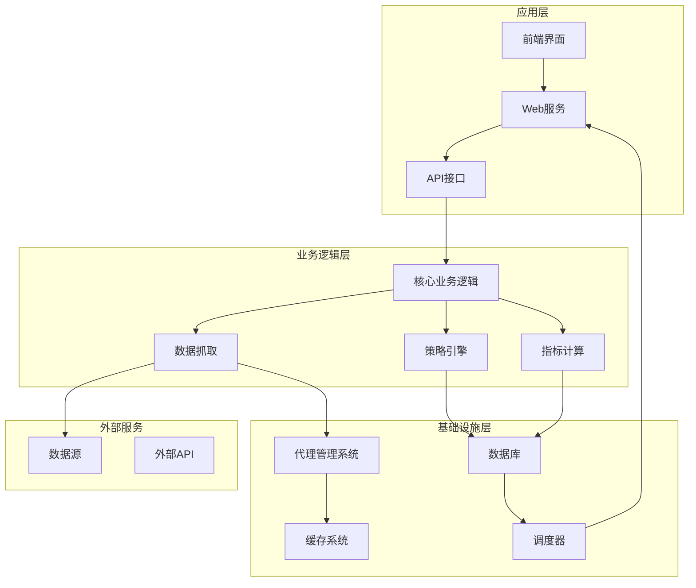
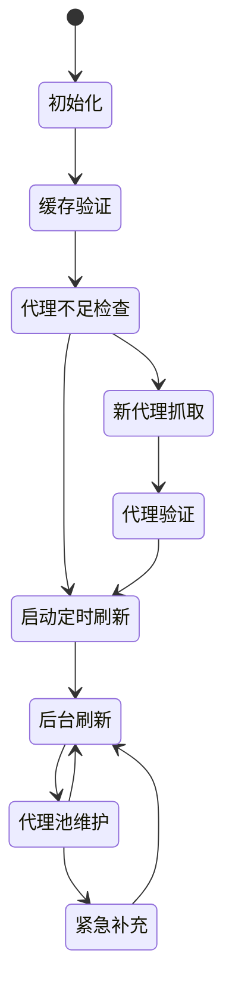
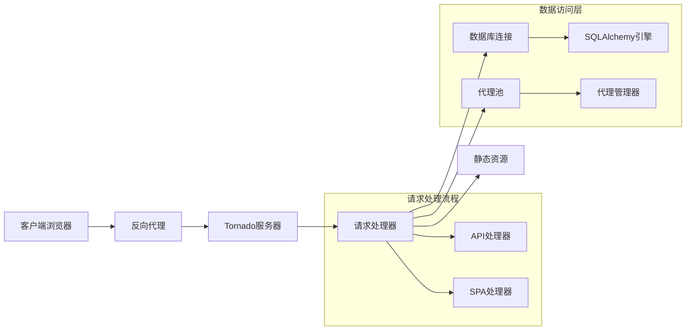
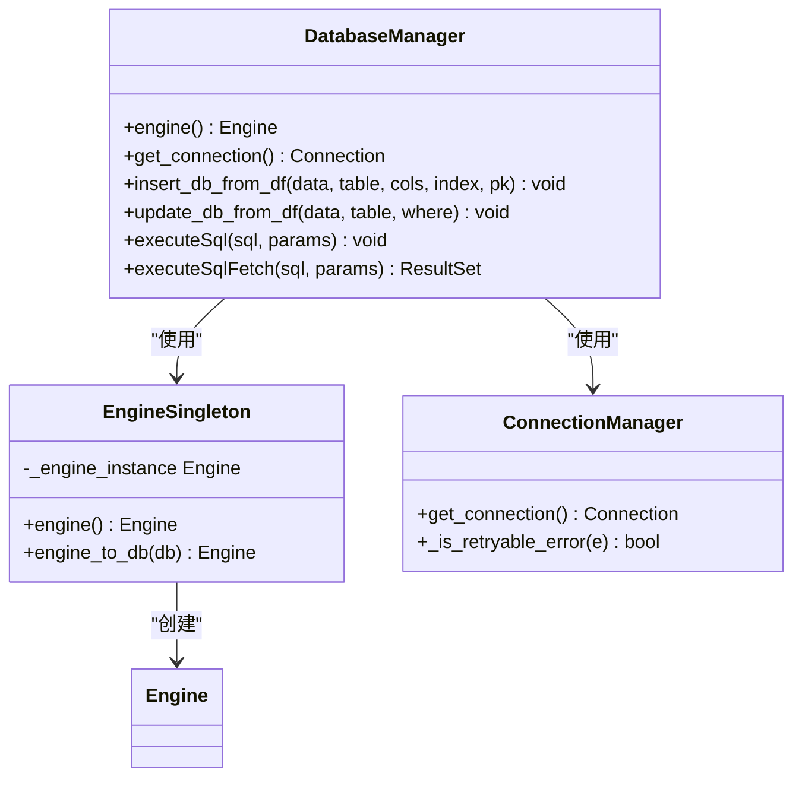
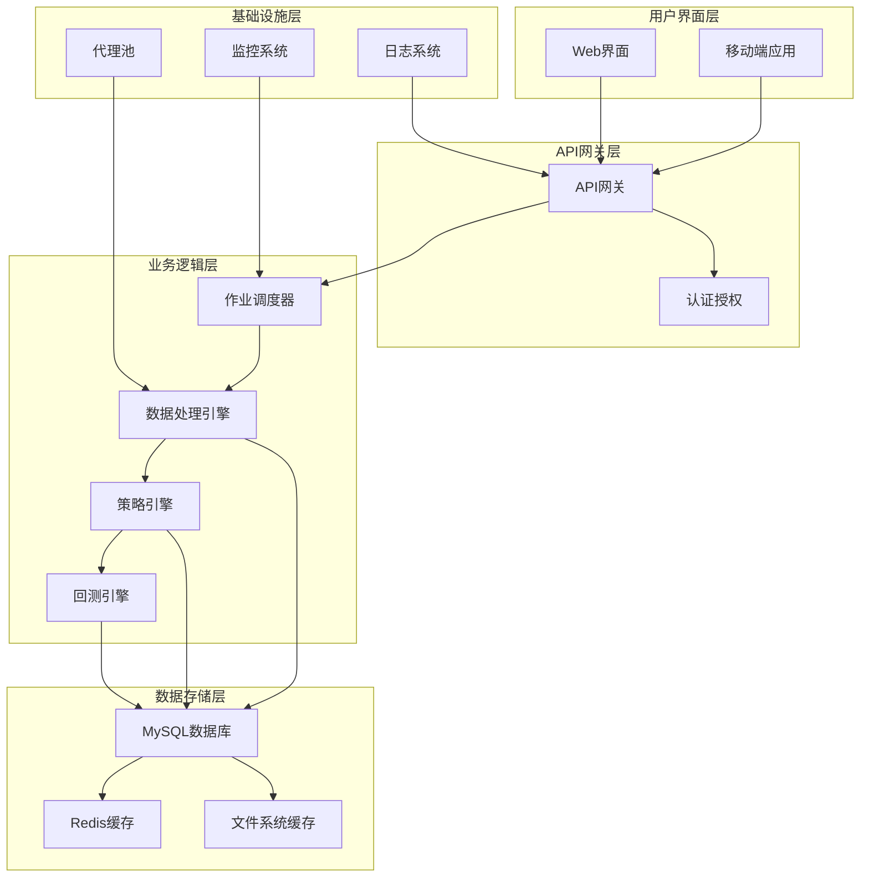
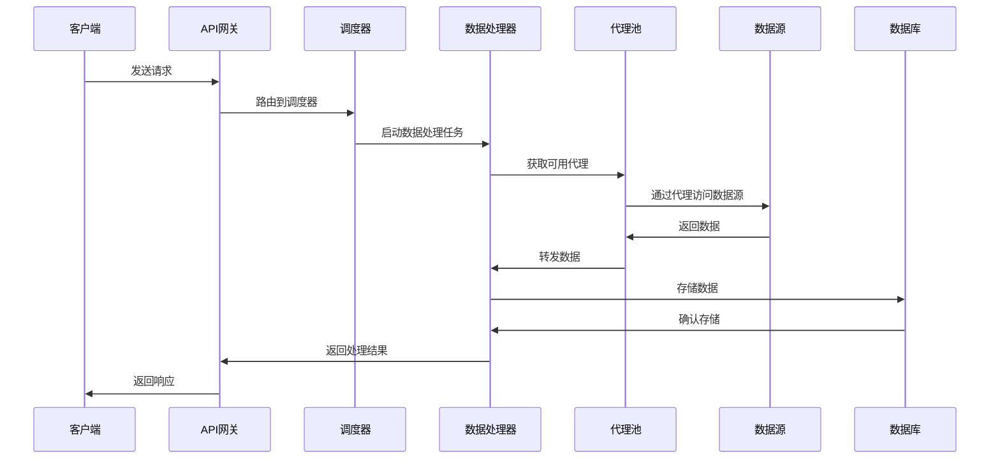
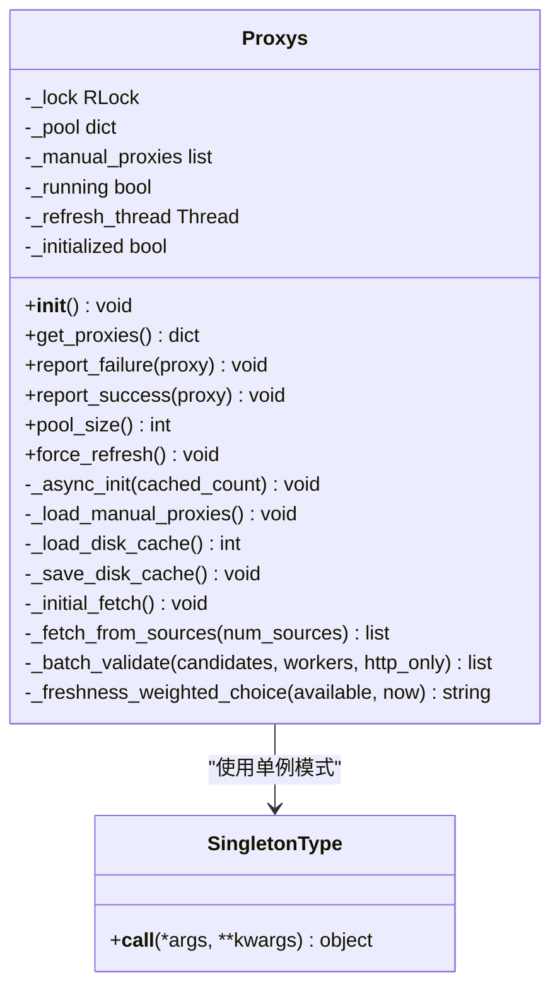
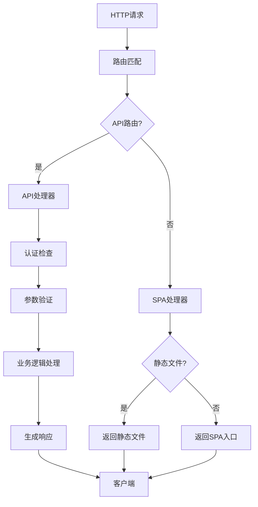
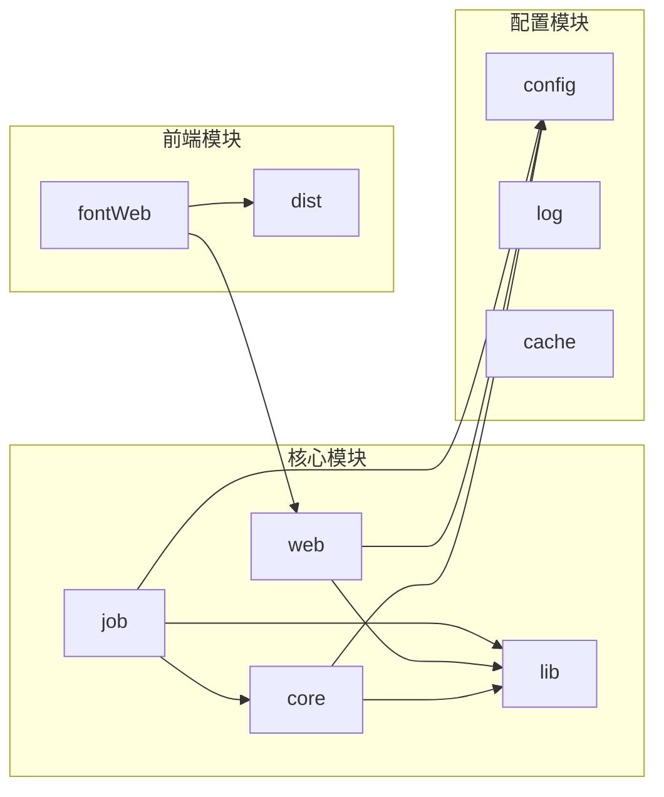

# 代理系统架构重构

<cite>
**本文档引用的文件**
- [README.md](file://README.md)
- [QUICKSTART.md](file://QUICKSTART.md)
- [singleton_proxy.py](file://quantia/core/singleton_proxy.py)
- [web_service.py](file://quantia/web/web_service.py)
- [database.py](file://quantia/lib/database.py)
- [proxy.txt](file://quantia/config/proxy.txt)
- [Dockerfile](file://docker/Dockerfile)
- [docker-compose.yml](file://docker/docker-compose.yml)
- [docker-compose.remote-db.yml](file://docker/docker-compose.remote-db.yml)
- [execute_daily_job.py](file://quantia/job/execute_daily_job.py)
</cite>

## 目录
1. [项目概述](#项目概述)
2. [项目结构](#项目结构)
3. [核心组件](#核心组件)
4. [架构概览](#架构概览)
5. [详细组件分析](#详细组件分析)
6. [依赖关系分析](#依赖关系分析)
7. [性能考虑](#性能考虑)
8. [故障排除指南](#故障排除指南)
9. [结论](#结论)

## 项目概述

Quantia股票系统是一个综合性的量化投资分析平台，专注于股票数据抓取、技术指标计算、K线形态识别和智能选股策略。该项目采用现代化的架构设计，支持多数据源、多代理管理和分布式部署。

### 主要特性

- **多数据源支持**：支持东方财富、腾讯财经、新浪财经等多个数据源的自动容错切换
- **智能代理管理**：内置代理池管理系统，支持自动抓取、验证和轮换
- **实时数据处理**：支持实时行情数据获取和历史数据增量更新
- **可视化界面**：基于Vue.js的现代化Web界面，提供丰富的图表和分析功能
- **Docker容器化**：完整的Docker部署方案，支持本地和远程数据库配置

## 项目结构

**图表来源**
- [web_service.py](file://quantia/web/web_service.py#L53-L97)
- [singleton_proxy.py](file://quantia/core/singleton_proxy.py#L54-L64)

**章节来源**
- [README.md](file://README.md#L1-L700)
- [QUICKSTART.md](file://QUICKSTART.md#L157-L167)

## 核心组件

### 代理管理系统

代理管理系统是整个系统的核心基础设施之一，负责管理大量的代理IP资源，确保数据抓取的稳定性和可靠性。

#### 核心功能特性

- **自动代理抓取**：从6个不同源自动抓取代理IP，包括geonode、proxy-list.download、GitHub仓库等
- **智能验证机制**：支持HTTP和HTTPS双重验证，确保代理的有效性
- **负载均衡策略**：根据代理质量动态分配请求，避免单一代理过载
- **故障转移机制**：当代理失效时自动切换到备用代理
- **持久化缓存**：将验证过的代理信息持久化到磁盘，支持快速重启

#### 代理池生命周期管理

**图表来源**
- [singleton_proxy.py](file://quantia/core/singleton_proxy.py#L84-L113)

**章节来源**
- [singleton_proxy.py](file://quantia/core/singleton_proxy.py#L1-L939)

### Web服务架构

Web服务采用Tornado框架构建，提供高性能的HTTP服务和WebSocket支持。

#### 服务架构设计

**图表来源**
- [web_service.py](file://quantia/web/web_service.py#L53-L97)

**章节来源**
- [web_service.py](file://quantia/web/web_service.py#L1-L150)

### 数据库管理系统

数据库管理系统提供了完整的数据持久化解决方案，支持MySQL数据库的连接管理和事务处理。

#### 数据库连接池设计

**图表来源**
- [database.py](file://quantia/lib/database.py#L55-L66)
- [database.py](file://quantia/lib/database.py#L75-L87)

**章节来源**
- [database.py](file://quantia/lib/database.py#L1-L299)

## 架构概览

### 整体架构设计

**图表来源**
- [execute_daily_job.py](file://quantia/job/execute_daily_job.py#L108-L200)
- [web_service.py](file://quantia/web/web_service.py#L53-L97)

### 数据流架构

**图表来源**
- [execute_daily_job.py](file://quantia/job/execute_daily_job.py#L48-L74)
- [singleton_proxy.py](file://quantia/core/singleton_proxy.py#L261-L313)

## 详细组件分析

### 代理池管理器

#### 类设计架构

**图表来源**
- [singleton_proxy.py](file://quantia/core/singleton_proxy.py#L54-L362)

#### 代理获取策略

代理池采用了多层次的获取策略，确保代理的多样性和有效性：

1. **手动配置代理**：优先使用用户配置的代理，具有最高优先级
2. **磁盘缓存代理**：使用之前验证过的代理，快速恢复
3. **自动抓取代理**：从多个免费代理源获取新的代理
4. **HTTPS验证**：对代理进行HTTPS隧道支持验证

**章节来源**
- [singleton_proxy.py](file://quantia/core/singleton_proxy.py#L261-L313)

### Web服务处理器

#### 请求处理流程

**图表来源**
- [web_service.py](file://quantia/web/web_service.py#L56-L87)

**章节来源**
- [web_service.py](file://quantia/web/web_service.py#L53-L132)

### 数据库连接管理

#### 连接池配置策略

数据库连接采用了优化的连接池配置，平衡了性能和资源使用：

- **最小连接数**：2个连接，确保基本的并发需求
- **最大溢出连接**：3个连接，处理突发的高并发请求
- **连接回收时间**：600秒，防止连接泄漏
- **连接预检查**：启用pool_pre_ping，自动检测和恢复失效连接

**章节来源**
- [database.py](file://quantia/lib/database.py#L55-L66)

## 依赖关系分析

### 外部依赖关系

```mermaid
graph TB
subgraph "核心依赖"
TORNADO[Tornado Web框架]
PANDAS[Pandas数据分析]
NUMPY[Numpy数值计算]
SQLALCHEMY[SQLAlchemy ORM]
PYMYSQL[PyMySQL驱动]
end
subgraph "数据处理依赖"
TA_LIB[TA-Lib技术分析]
BEAUTIFUL_SOUP[BeautifulSoup解析]
REQUESTS[Requests HTTP库]
end
subgraph "前端依赖"
VUE[Vuex状态管理]
AXIOS[Axios HTTP客户端]
BOKEH[Bokeh可视化]
end
subgraph "基础设施依赖"
DOCKER[Docker容器化]
SUPERVISORD[Supervisord进程管理]
CRON[Cron定时任务]
end
APPLICATION --> TORNADO
APPLICATION --> PANDAS
APPLICATION --> NUMPY
APPLICATION --> SQLALCHEMY
APPLICATION --> PYMYSQL
DATA_PROCESSING --> TA_LIB
DATA_PROCESSING --> BEAUTIFUL_SOOP
DATA_PROCESSING --> REQUESTS
FRONTEND --> VUE
FRONTEND --> AXIOS
FRONTEND --> BOKEH
DEPLOYMENT --> DOCKER
DEPLOYMENT --> SUPERVISORD
DEPLOYMENT --> CRON
```

**图表来源**
- [Dockerfile](file://docker/Dockerfile#L87-L109)

### 内部模块依赖

**图表来源**
- [execute_daily_job.py](file://quantia/job/execute_daily_job.py#L13-L36)

**章节来源**
- [Dockerfile](file://docker/Dockerfile#L127-L131)

## 性能考虑

### 代理系统性能优化

代理系统采用了多项性能优化策略：

1. **异步初始化**：代理池初始化在后台线程完成，不阻塞主线程
2. **并发验证**：使用ThreadPoolExecutor进行并发代理验证，提高验证效率
3. **智能缓存**：代理验证结果持久化到磁盘，支持快速重启
4. **负载均衡**：根据代理质量和新鲜度进行智能分配

### 数据库性能优化

数据库系统采用了连接池和查询优化策略：

- **连接池复用**：避免频繁创建和销毁数据库连接
- **批量操作**：支持批量数据插入和更新操作
- **索引优化**：自动为主键表添加索引约束
- **重试机制**：对瞬态错误进行自动重试

### Web服务性能优化

Web服务采用了异步处理和缓存策略：

- **异步I/O**：使用Tornado的异步特性处理高并发请求
- **静态资源缓存**：静态文件设置适当的缓存头
- **请求路由优化**：高效的路由匹配算法
- **内存管理**：及时释放不需要的对象，防止内存泄漏

## 故障排除指南

### 代理系统常见问题

#### 代理池耗尽问题

当代理池中的可用代理数量降至最低阈值时，系统会触发紧急补充机制：

1. **检查代理配置**：确认proxy.txt文件配置正确
2. **查看代理日志**：检查代理验证过程中的错误信息
3. **网络连接测试**：验证代理服务器的连通性
4. **重试机制**：系统会自动尝试重新获取代理

#### 代理验证失败

代理验证失败的常见原因：

- **网络超时**：代理服务器响应缓慢或不可达
- **数据源限制**：目标网站对代理访问进行了限制
- **代理质量差**：代理IP质量不佳，无法正常访问目标网站
- **认证失败**：代理需要认证但配置不正确

**章节来源**
- [singleton_proxy.py](file://quantia/core/singleton_proxy.py#L368-L395)

### Web服务故障排除

#### 服务启动失败

常见的Web服务启动问题：

1. **端口占用**：9988端口被其他进程占用
2. **数据库连接失败**：检查数据库配置和连接参数
3. **静态文件缺失**：确认前端构建产物存在
4. **权限问题**：检查文件和目录的访问权限

#### API请求失败

API请求失败的排查步骤：

1. **检查请求参数**：验证API请求的参数格式和类型
2. **查看响应状态**：分析HTTP状态码和错误信息
3. **数据库查询**：检查相关的数据库查询是否正常
4. **代理配置**：确认代理配置是否正确

**章节来源**
- [web_service.py](file://quantia/web/web_service.py#L134-L149)

### 数据库连接问题

#### 连接池问题

数据库连接池可能出现的问题：

- **连接泄漏**：长时间保持未关闭的数据库连接
- **连接超时**：数据库连接超时或断开
- **死锁问题**：并发操作导致的数据库死锁
- **内存溢出**：连接池过大导致的内存问题

**章节来源**
- [database.py](file://quantia/lib/database.py#L105-L111)

## 结论

代理系统架构重构项目展现了现代量化投资系统的最佳实践。通过采用模块化的架构设计、智能的代理管理和高性能的Web服务，系统实现了高可用性、高扩展性和易维护性。

### 主要成就

1. **架构现代化**：采用微服务架构和容器化部署，提高了系统的可扩展性
2. **代理系统智能化**：实现了自动代理抓取、验证和轮换机制
3. **性能优化**：通过连接池、缓存和异步处理提升了系统性能
4. **用户体验优化**：提供了直观的Web界面和丰富的可视化功能

### 未来发展方向

1. **AI集成**：进一步集成机器学习算法，提升选股准确性
2. **实时分析**：增强实时数据处理能力，支持更复杂的实时分析场景
3. **多平台支持**：扩展移动端和桌面端应用支持
4. **云原生优化**：进一步优化云原生部署，支持弹性扩缩容

该系统为量化投资领域提供了一个完整的技术解决方案，具有很高的实用价值和推广前景。
