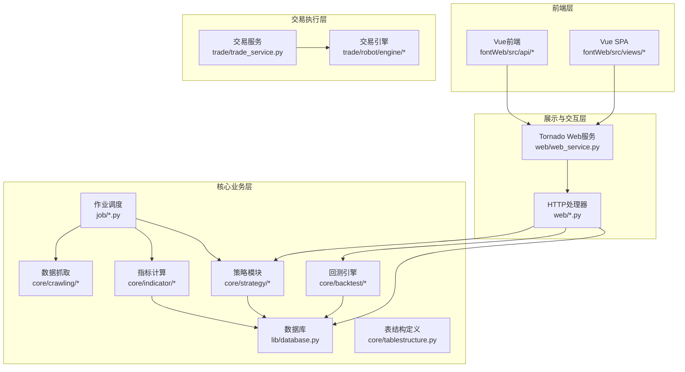
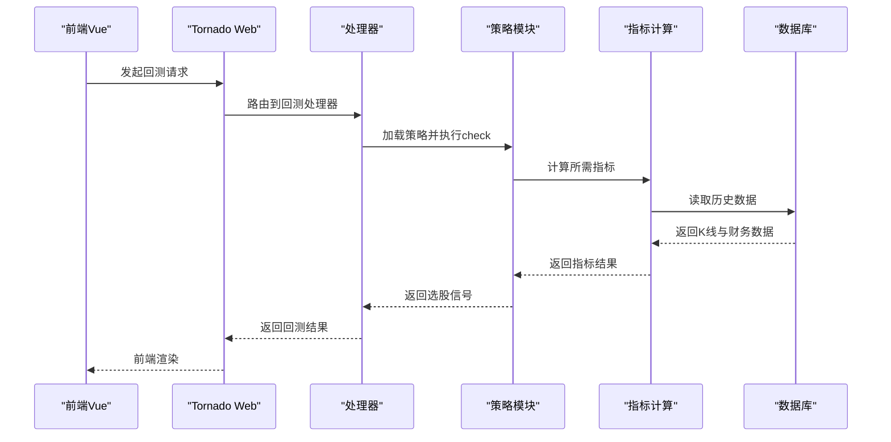
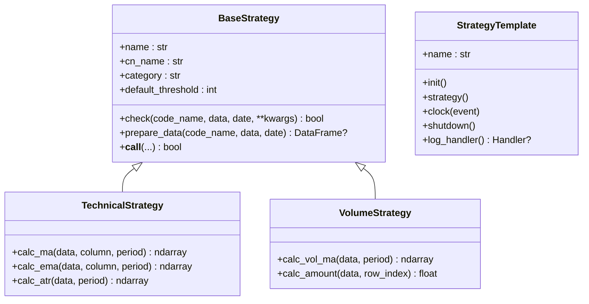
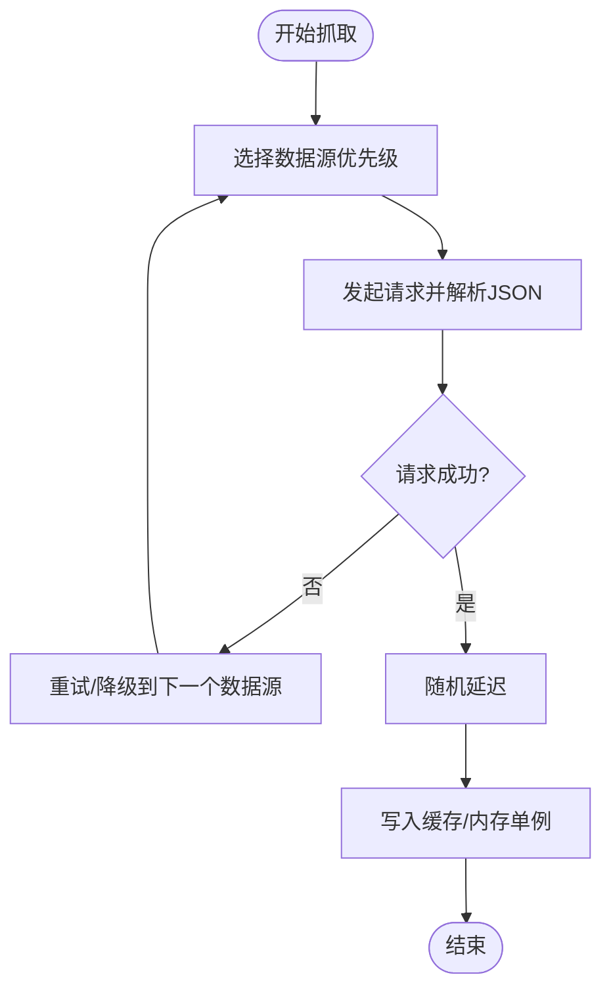
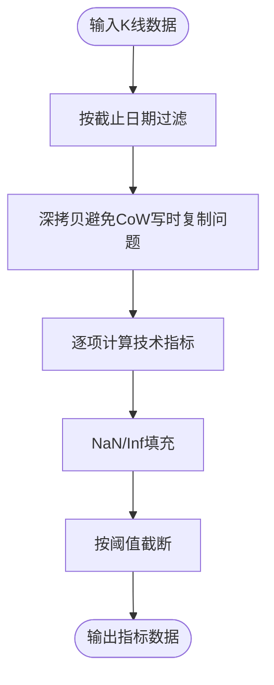
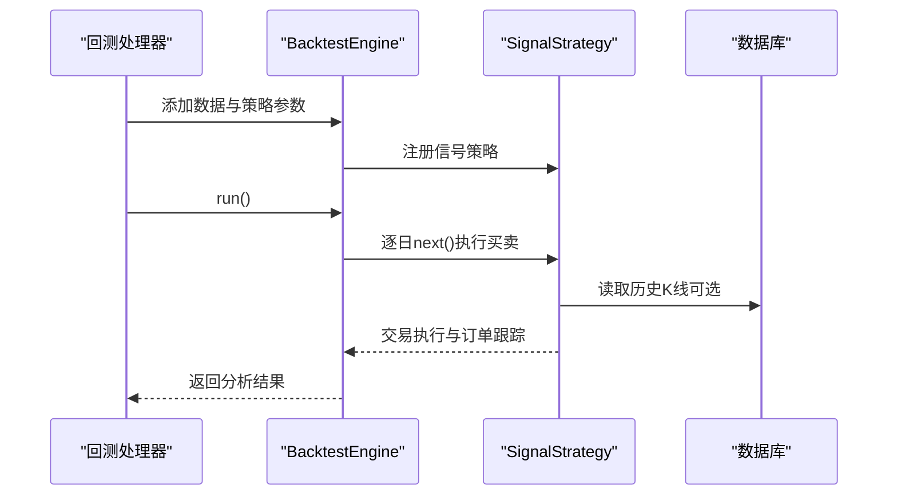
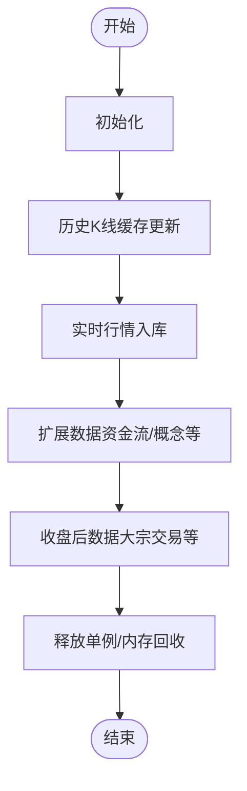
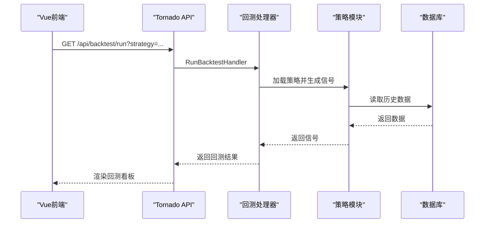
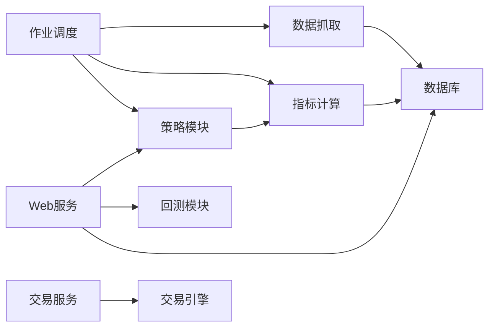

# 模块化架构设计

<cite>
**本文档引用的文件**
- [README.md](file://README.md)
- [QUICKSTART.md](file://QUICKSTART.md)
- [quantia/core/__init__.py](file://quantia/core/__init__.py)
- [quantia/core/strategy/base.py](file://quantia/core/strategy/base.py)
- [quantia/core/strategy/README.md](file://quantia/core/strategy/README.md)
- [quantia/core/crawling/stock_hist_em.py](file://quantia/core/crawling/stock_hist_em.py)
- [quantia/core/indicator/calculate_indicator.py](file://quantia/core/indicator/calculate_indicator.py)
- [quantia/core/backtest/bt_engine.py](file://quantia/core/backtest/bt_engine.py)
- [quantia/core/tablestructure.py](file://quantia/core/tablestructure.py)
- [quantia/lib/database.py](file://quantia/lib/database.py)
- [quantia/web/web_service.py](file://quantia/web/web_service.py)
- [quantia/web/backtestHandler.py](file://quantia/web/backtestHandler.py)
- [quantia/job/fetch_daily_job.py](file://quantia/job/fetch_daily_job.py)
- [quantia/job/fetch_data_job.py](file://quantia/job/fetch_data_job.py)
- [quantia/trade/trade_service.py](file://quantia/trade/trade_service.py)
- [quantia/fontWeb/src/api/strategy.ts](file://quantia/fontWeb/src/api/strategy.ts)
</cite>

## 目录
1. [简介](#简介)
2. [项目结构](#项目结构)
3. [核心组件](#核心组件)
4. [架构总览](#架构总览)
5. [详细组件分析](#详细组件分析)
6. [依赖分析](#依赖分析)
7. [性能考虑](#性能考虑)
8. [故障排查指南](#故障排查指南)
9. [结论](#结论)
10. [附录](#附录)

## 简介
本设计文档面向Quantia（Quantia）股票分析系统，提出一套模块化架构设计方案。系统围绕“数据抓取-指标计算-策略选股-回测验证-前端展示-交易执行”的完整流程，采用分层解耦、接口标准化、可替换与可扩展的设计原则，提升系统的可维护性与演进能力。

## 项目结构
系统采用“核心业务层 + 作业调度层 + 展示与交互层 + 交易执行层”的分层组织方式：

- 核心业务层（quantia/core）
  - 策略模块：策略基类、各类K线/技术/成交量/价值投资策略
  - 数据抓取模块：多数据源适配、代理与Cookie支持、缓存与重试
  - 指标计算模块：基于TA-Lib的指标计算流水线
  - 回测模块：与Backtrader集成的回测引擎
  - 数据结构与表定义：统一的数据库表结构与字段映射
- 作业调度层（quantia/job）
  - 分阶段数据获取与分析作业，支持批量与增量更新
- 展示与交互层（quantia/web + quantia/fontWeb）
  - Tornado Web服务与Vue前端，提供API与可视化界面
- 交易执行层（quantia/trade）
  - 事件驱动的交易机器人引擎，支持策略加载与监控



**图表来源**
- [quantia/web/web_service.py](file://quantia/web/web_service.py#L53-L97)
- [quantia/job/fetch_daily_job.py](file://quantia/job/fetch_daily_job.py#L43-L88)
- [quantia/lib/database.py](file://quantia/lib/database.py#L60-L71)
- [quantia/core/tablestructure.py](file://quantia/core/tablestructure.py#L1-L80)

**章节来源**
- [README.md](file://README.md#L321-L326)
- [QUICKSTART.md](file://QUICKSTART.md#L157-L167)

## 核心组件
- 策略模块（Strategy）
  - 提供策略基类与注册机制，统一check接口，支持技术/成交量/趋势/形态等分类
  - 策略注册表与按分类检索能力
- 数据抓取模块（Crawling）
  - 多数据源优先级与健康度追踪，自动降级与重试
  - 实时行情与历史K线抓取，代理与Cookie配置
- 指标计算模块（Indicator）
  - 基于TA-Lib的指标流水线，兼容pandas 2.x写时复制模式
  - 支持阈值裁剪与NaN填充
- 回测模块（Backtest）
  - Backtrader适配器，信号策略与批量回测
  - 支持简单收益计算与分析器
- 数据库与表结构（Database/TableStructure）
  - SQLAlchemy连接池与Upsert策略，自动建表与索引
  - 统一的表结构定义与字段映射
- 作业调度（Job）
  - 分阶段数据获取与分析，内存友好与OOM保护
- 展示与交互（Web）
  - Tornado路由与处理器，前后端分离API
- 交易执行（Trade）
  - 事件驱动引擎与策略包装器，支持自动重载

**章节来源**
- [quantia/core/strategy/base.py](file://quantia/core/strategy/base.py#L20-L202)
- [quantia/core/crawling/stock_hist_em.py](file://quantia/core/crawling/stock_hist_em.py#L1-L551)
- [quantia/core/indicator/calculate_indicator.py](file://quantia/core/indicator/calculate_indicator.py#L23-L449)
- [quantia/core/backtest/bt_engine.py](file://quantia/core/backtest/bt_engine.py#L101-L388)
- [quantia/lib/database.py](file://quantia/lib/database.py#L60-L304)
- [quantia/core/tablestructure.py](file://quantia/core/tablestructure.py#L409-L467)
- [quantia/job/fetch_daily_job.py](file://quantia/job/fetch_daily_job.py#L43-L120)
- [quantia/web/web_service.py](file://quantia/web/web_service.py#L53-L143)
- [quantia/trade/trade_service.py](file://quantia/trade/trade_service.py#L19-L31)

## 架构总览
系统采用“数据驱动 + 事件驱动”的双通道架构：
- 数据通道：作业调度按阶段执行数据抓取、指标计算、策略筛选与回测，数据持久化到数据库
- 交互通道：Web服务提供API，前端通过AJAX调用，回测看板与策略参数管理
- 交易通道：交易服务加载策略，事件驱动引擎执行交易指令



**图表来源**
- [quantia/web/web_service.py](file://quantia/web/web_service.py#L53-L97)
- [quantia/web/backtestHandler.py](file://quantia/web/backtestHandler.py#L86-L144)
- [quantia/core/strategy/base.py](file://quantia/core/strategy/base.py#L47-L96)
- [quantia/core/indicator/calculate_indicator.py](file://quantia/core/indicator/calculate_indicator.py#L23-L449)
- [quantia/lib/database.py](file://quantia/lib/database.py#L279-L304)

## 详细组件分析

### 策略模块（Strategy）
- 设计要点
  - 策略基类统一check接口，支持阈值与数据准备
  - 分类基类（技术/成交量/趋势/形态）提供通用工具
  - 注册表与按分类检索，便于扩展与前端路由分类
- 接口规范
  - check(code_name, data, date=None, **kwargs) -> bool
  - 支持prepare_data按截止日期裁剪数据
- 可替换性
  - 通过注册装饰器与策略工厂函数，新增策略无需修改核心逻辑



**图表来源**
- [quantia/core/strategy/base.py](file://quantia/core/strategy/base.py#L20-L202)
- [quantia/trade/robot/infrastructure/strategy_template.py](file://quantia/trade/robot/infrastructure/strategy_template.py#L9-L42)

**章节来源**
- [quantia/core/strategy/base.py](file://quantia/core/strategy/base.py#L20-L202)
- [quantia/core/strategy/README.md](file://quantia/core/strategy/README.md#L65-L119)

### 数据抓取模块（Crawling）
- 设计要点
  - 多数据源优先级与健康度追踪，失败自动降级
  - 随机延迟与指数退避，缓解API限流
  - 支持代理与Cookie注入，增强稳定性
- 接口规范
  - 实时行情：stock_zh_a_spot_em()
  - 历史K线：stock_zh_a_hist(symbol, period, start_date, end_date, adjust)
  - 分时/盘前数据：stock_zh_a_hist_min_em()/pre_min_em()



**图表来源**
- [quantia/core/crawling/stock_hist_em.py](file://quantia/core/crawling/stock_hist_em.py#L20-L188)
- [quantia/core/stockfetch.py](file://quantia/core/stockfetch.py#L36-L58)

**章节来源**
- [quantia/core/crawling/stock_hist_em.py](file://quantia/core/crawling/stock_hist_em.py#L1-L551)
- [quantia/job/fetch_data_job.py](file://quantia/job/fetch_data_job.py#L1-L42)

### 指标计算模块（Indicator）
- 设计要点
  - 基于TA-Lib的指标流水线，兼容pandas 2.x写时复制
  - 统一NaN/Inf处理，保证下游稳定
  - 支持按截止日期与阈值裁剪，减少计算量
- 接口规范
  - get_indicators(data, end_date=None, threshold=120, calc_threshold=None)
  - get_indicator(code_name, data, stock_column, date=None, calc_threshold=90)



**图表来源**
- [quantia/core/indicator/calculate_indicator.py](file://quantia/core/indicator/calculate_indicator.py#L23-L407)

**章节来源**
- [quantia/core/indicator/calculate_indicator.py](file://quantia/core/indicator/calculate_indicator.py#L1-L449)

### 回测模块（Backtest）
- 设计要点
  - Backtrader适配器，自定义PandasData与SignalStrategy
  - 支持简单回测与批量策略回测
  - 分析器：夏普比率、最大回撤、收益与交易统计
- 接口规范
  - BacktestEngine.add_data/add_signal_strategy/run()
  - StrategyBacktester.backtest_strategy/backtest_signals()



**图表来源**
- [quantia/core/backtest/bt_engine.py](file://quantia/core/backtest/bt_engine.py#L101-L215)
- [quantia/web/backtestHandler.py](file://quantia/web/backtestHandler.py#L86-L144)

**章节来源**
- [quantia/core/backtest/bt_engine.py](file://quantia/core/backtest/bt_engine.py#L1-L388)
- [quantia/web/backtestHandler.py](file://quantia/web/backtestHandler.py#L86-L144)

### 数据库与表结构（Database/TableStructure）
- 设计要点
  - SQLAlchemy单例连接池，Upsert策略避免主键冲突
  - 首次创建表时自动添加主键与索引
  - 统一的表结构定义与字段映射，支持策略/指标/K线/资金流等
- 接口规范
  - insert_other_db_from_df(data, table_name, cols_type, write_index, primary_keys, indexs)
  - executeSql/executeSqlFetch/executeSqlCount

```mermaid
erDiagram
CN_STOCK_SPOT {
date DATE
code VARCHAR(6)
name VARCHAR(20)
new_price FLOAT
change_rate FLOAT
volume BIGINT
deal_amount BIGINT
}
CN_STOCK_INDICATORS {
date DATE
code VARCHAR(6)
macd FLOAT
kdjk FLOAT
boll FLOAT
rsi FLOAT
atr FLOAT
...
}
CN_STOCK_STRATEGIES {
date DATE
code VARCHAR(6)
strategy_name VARCHAR(50)
signal BIT
}
CN_STOCK_BACKTEST {
date DATE
strategy_name VARCHAR(50)
success_rate FLOAT
avg_rate_1 FLOAT
avg_rate_5 FLOAT
avg_rate_20 FLOAT
...
}
CN_STOCK_SPOT ||--o{ CN_STOCK_INDICATORS : "指标关联"
CN_STOCK_SPOT ||--o{ CN_STOCK_STRATEGIES : "策略信号"
CN_STOCK_STRATEGIES ||--o{ CN_STOCK_BACKTEST : "回测结果"
```

**图表来源**
- [quantia/core/tablestructure.py](file://quantia/core/tablestructure.py#L63-L104)
- [quantia/core/tablestructure.py](file://quantia/core/tablestructure.py#L396-L407)
- [quantia/core/tablestructure.py](file://quantia/core/tablestructure.py#L409-L443)
- [quantia/core/tablestructure.py](file://quantia/core/tablestructure.py#L29-L44)

**章节来源**
- [quantia/lib/database.py](file://quantia/lib/database.py#L60-L304)
- [quantia/core/tablestructure.py](file://quantia/core/tablestructure.py#L1-L800)

### 作业调度（Job）
- 设计要点
  - 分阶段执行：初始化/历史K线缓存更新/实时行情入库/扩展数据/收盘后数据
  - 内存友好：先释放单例，再执行内存密集型任务
  - 支持独立运行与批量日期处理
- 接口规范
  - fetch_daily_job/main()按阶段编排
  - fetch_data_job/fetch_all_data()集中执行API调用



**图表来源**
- [quantia/job/fetch_daily_job.py](file://quantia/job/fetch_daily_job.py#L60-L117)
- [quantia/job/fetch_data_job.py](file://quantia/job/fetch_data_job.py#L38-L100)

**章节来源**
- [quantia/job/fetch_daily_job.py](file://quantia/job/fetch_daily_job.py#L43-L120)
- [quantia/job/fetch_data_job.py](file://quantia/job/fetch_data_job.py#L1-L42)

### 展示与交互（Web）
- 设计要点
  - Tornado路由与SPA回退，统一JSON API
  - 回测看板：概览、策略明细、收益分布、时间序列、交易对
  - 策略参数管理：参数列表、保存、重置、过滤
- 接口规范
  - /quantia/api/backtest/* 与 /quantia/api/backtest/dashboard/*
  - /quantia/api/strategy/params*



**图表来源**
- [quantia/web/web_service.py](file://quantia/web/web_service.py#L53-L97)
- [quantia/web/backtestHandler.py](file://quantia/web/backtestHandler.py#L86-L144)
- [quantia/fontWeb/src/api/strategy.ts](file://quantia/fontWeb/src/api/strategy.ts#L1-L72)

**章节来源**
- [quantia/web/web_service.py](file://quantia/web/web_service.py#L53-L143)
- [quantia/web/backtestHandler.py](file://quantia/web/backtestHandler.py#L86-L144)
- [quantia/fontWeb/src/api/strategy.ts](file://quantia/fontWeb/src/api/strategy.ts#L1-L72)

### 交易执行（Trade）
- 设计要点
  - 事件驱动引擎与策略包装器，支持策略自动重载
  - 日志句柄可定制，便于集成不同Broker
- 接口规范
  - main()启动MainEngine，load_strategy()/start()

**章节来源**
- [quantia/trade/trade_service.py](file://quantia/trade/trade_service.py#L19-L31)

## 依赖分析
- 模块耦合
  - 策略模块与指标模块松耦合：策略通过check接口消费指标，不依赖具体实现
  - 数据抓取与数据库：抓取模块仅负责数据获取，持久化通过统一接口完成
  - Web层与业务层：通过API解耦，前端可独立演进
- 外部依赖
  - TA-Lib、Backtrader、Tornado、SQLAlchemy、pymysql
- 循环依赖
  - 通过导入时初始化与接口抽象避免循环依赖



**图表来源**
- [quantia/core/strategy/base.py](file://quantia/core/strategy/base.py#L169-L191)
- [quantia/core/indicator/calculate_indicator.py](file://quantia/core/indicator/calculate_indicator.py#L23-L449)
- [quantia/lib/database.py](file://quantia/lib/database.py#L120-L203)
- [quantia/web/web_service.py](file://quantia/web/web_service.py#L53-L97)

**章节来源**
- [quantia/core/strategy/base.py](file://quantia/core/strategy/base.py#L155-L202)
- [quantia/core/tablestructure.py](file://quantia/core/tablestructure.py#L409-L467)

## 性能考虑
- 数据抓取
  - 多数据源健康度追踪与降级，避免长时间阻塞
  - 随机延迟与指数退避，降低API限流风险
- 指标计算
  - 深拷贝避免CoW写时复制错误，阈值裁剪减少计算量
- 作业调度
  - 分阶段执行与内存回收，防止OOM
- 数据库
  - 连接池配置与Upsert策略，减少锁冲突
- Web
  - SPA路由与静态资源分离，减少不必要的请求

[本节为通用指导，无需特定文件引用]

## 故障排查指南
- 数据获取失败
  - 检查代理与Cookie配置，确认数据源优先级与健康度
- 数据库连接失败
  - 校验连接参数与MySQL服务状态，必要时重试与重建连接池
- 回测异常
  - 检查策略参数与信号日期，确认数据可用性
- Web服务异常
  - 查看日志文件，确认路由与处理器配置

**章节来源**
- [quantia/job/fetch_daily_job.py](file://quantia/job/fetch_daily_job.py#L77-L117)
- [quantia/lib/database.py](file://quantia/lib/database.py#L80-L117)
- [quantia/web/web_service.py](file://quantia/web/web_service.py#L127-L143)

## 结论
通过模块化设计，Quantia系统实现了“数据抓取-指标计算-策略选股-回测验证-前端展示-交易执行”的清晰分层与职责边界。策略的可替换性、接口的标准化、作业调度的内存友好与数据库的Upsert策略，共同提升了系统的可维护性与可扩展性。建议在后续迭代中继续强化：
- 策略参数的Schema校验与版本化
- 指标计算的缓存与增量更新
- Web API的鉴权与限流
- 交易执行的风控与日志审计

[本节为总结性内容，无需特定文件引用]

## 附录
- 快速开始与常用操作参见QuickStart
- 项目文档与API参考参见README与文档目录

**章节来源**
- [QUICKSTART.md](file://QUICKSTART.md#L1-L207)
- [README.md](file://README.md#L198-L207)
