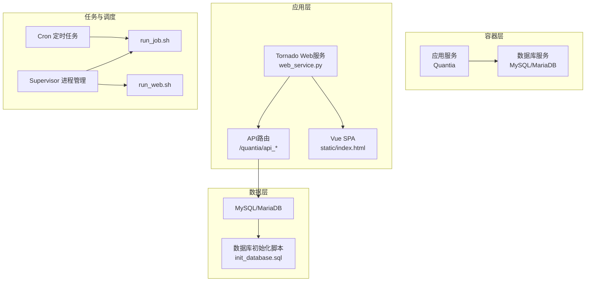
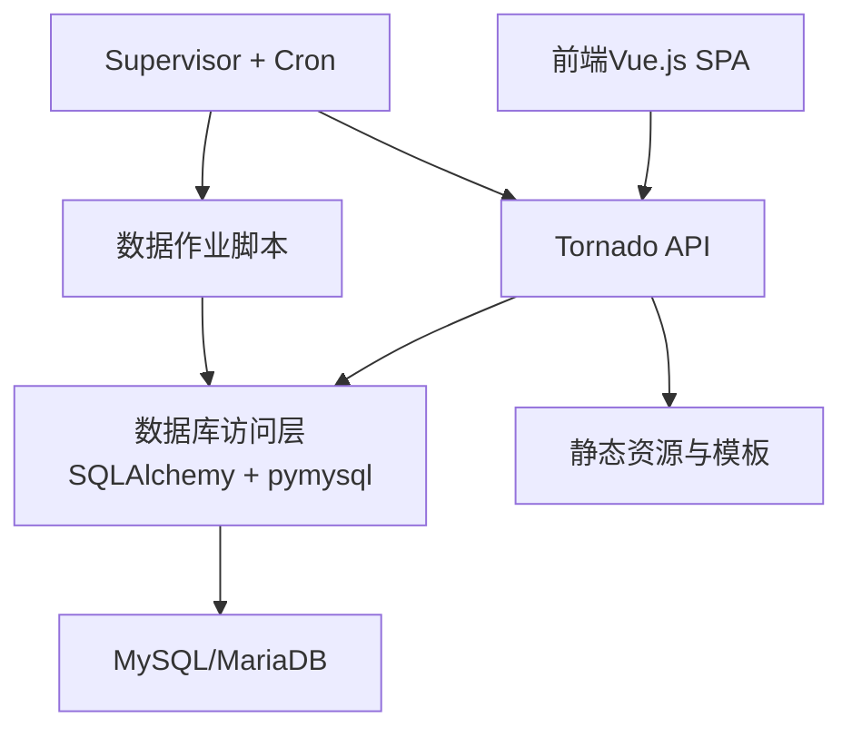
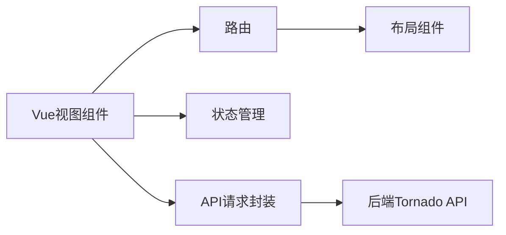
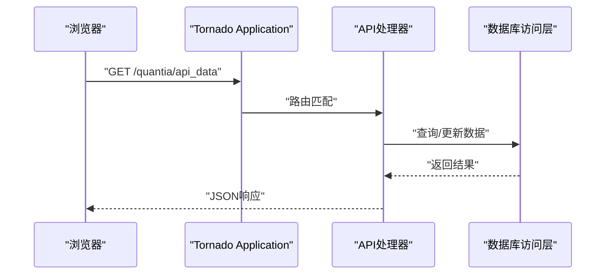
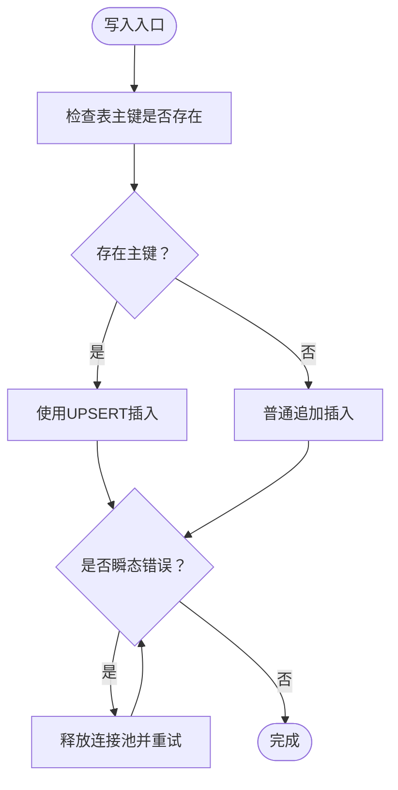
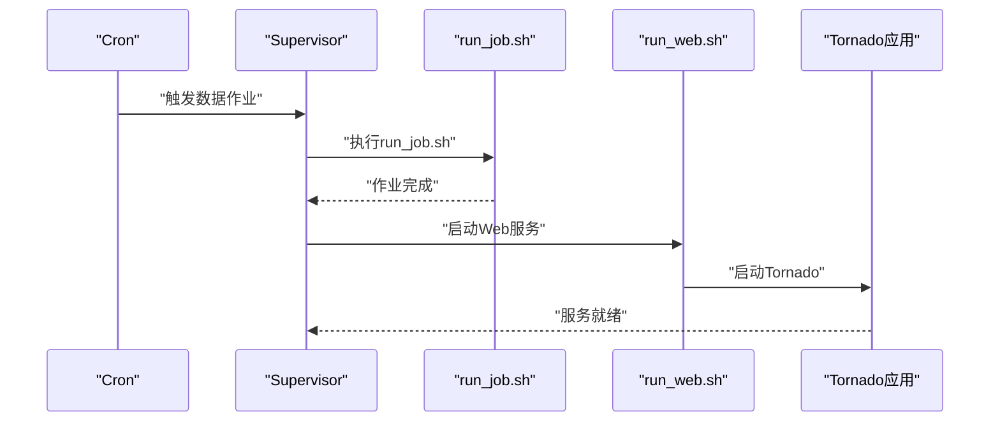
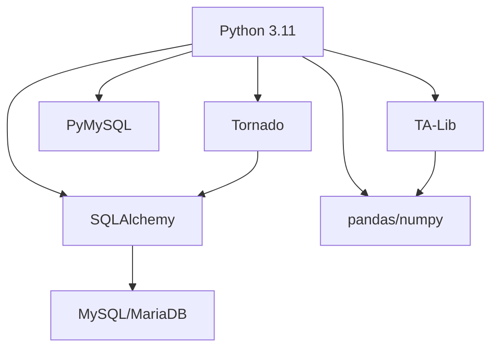

# 系统总体架构

<cite>
**本文引用的文件**
- [README.md](file://README.md)
- [Dockerfile](file://docker/Dockerfile)
- [docker-compose.yml](file://docker/docker-compose.yml)
- [init_database.sql](file://docker/init_database.sql)
- [requirements.txt](file://requirements.txt)
- [supervisord.conf](file://supervisor/supervisord.conf)
- [run_web.sh](file://quantia/bin/run_web.sh)
- [run_job.sh](file://quantia/bin/run_job.sh)
- [database.py](file://quantia/lib/database.py)
- [web_service.py](file://quantia/web/web_service.py)
</cite>

## 目录
1. [简介](#简介)
2. [项目结构](#项目结构)
3. [核心组件](#核心组件)
4. [架构总览](#架构总览)
5. [详细组件分析](#详细组件分析)
6. [依赖关系分析](#依赖关系分析)
7. [性能考量](#性能考量)
8. [故障排查指南](#故障排查指南)
9. [结论](#结论)
10. [附录](#附录)

## 简介
Quantia（Quantia）是一个面向量化投资的股票数据采集、处理、可视化与回测系统。系统采用分层架构与模块化设计，结合Python+Tornado+Vue.js技术栈，实现从前端Web界面到后端数据处理与数据库存储的完整闭环。系统支持多数据源抓取、指标计算、K线形态识别、策略选股、回测验证与自动交易（可选），并通过Docker容器化部署，具备良好的可扩展性与可维护性。

## 项目结构
系统采用前后端分离与服务进程分离的组织方式：
- 前端：Vue.js 应用位于 quantia/fontWeb，打包产物位于 quantia/web/static，由后端Tornado提供静态资源与SPA路由。
- 后端：Tornado Web服务位于 quantia/web/web_service.py，统一暴露REST风格API并渲染SPA。
- 数据层：MySQL/MariaDB作为主存储，初始化脚本位于 docker/init_database.sql，数据库连接与ORM封装位于 quantia/lib/database.py。
- 任务调度：通过 crond 与 Supervisor 管理数据作业与Web服务生命周期，入口脚本位于 quantia/bin/run_job.sh 与 quantia/bin/run_web.sh。
- 容器化：Dockerfile 定义镜像构建，docker-compose.yml 定义服务编排，包含数据库与应用服务。

图表来源
- [docker-compose.yml](file://docker/docker-compose.yml#L1-L87)
- [Dockerfile](file://docker/Dockerfile#L1-L153)
- [web_service.py](file://quantia/web/web_service.py#L53-L98)
- [run_web.sh](file://quantia/bin/run_web.sh#L1-L19)
- [run_job.sh](file://quantia/bin/run_job.sh#L1-L16)
- [supervisord.conf](file://supervisor/supervisord.conf#L25-L42)
- [init_database.sql](file://docker/init_database.sql#L1-L455)

章节来源
- [README.md](file://README.md#L321-L326)
- [docker-compose.yml](file://docker/docker-compose.yml#L1-L87)
- [Dockerfile](file://docker/Dockerfile#L1-L153)

## 核心组件
- 前端Vue.js应用
  - 采用模块化组件与路由，提供选股、指标、K线、策略配置与回测看板等视图。
  - 通过AJAX调用后端API获取数据，支持前端路由与静态资源托管。
- 后端Tornado服务
  - 统一注册API路由与SPA回退，使用torndb连接数据库，提供REST接口与静态文件服务。
- 数据库层
  - 初始化脚本涵盖关注、每日行情、资金流、龙虎榜、ETF、综合/指标/策略/回测等表。
  - 封装连接池、UPSERT、重试与索引管理，保障并发与一致性。
- 任务与调度
  - Supervisor管理Web与数据作业进程，crond按工作日程定时执行数据抓取与处理。
- 容器化与部署
  - Dockerfile定义环境、依赖与健康检查；docker-compose编排数据库与应用服务。

章节来源
- [web_service.py](file://quantia/web/web_service.py#L53-L98)
- [database.py](file://quantia/lib/database.py#L60-L71)
- [init_database.sql](file://docker/init_database.sql#L1-L455)
- [supervisord.conf](file://supervisor/supervisord.conf#L25-L42)
- [run_web.sh](file://quantia/bin/run_web.sh#L1-L19)
- [run_job.sh](file://quantia/bin/run_job.sh#L1-L16)

## 架构总览
系统采用分层架构与模块化设计：
- 展示层：Vue.js SPA + Tornado静态资源与模板渲染。
- 业务层：Tornado路由与处理器，封装数据访问与业务逻辑。
- 数据访问层：SQLAlchemy连接池与pymysql底层连接，统一事务与重试。
- 存储层：MySQL/MariaDB，初始化脚本自动创建表结构与索引。
- 调度层：Supervisor进程管理 + crond定时任务，确保服务与数据作业稳定运行。
- 部署层：Docker容器化，支持本地与远程部署，环境变量驱动配置。

图表来源
- [web_service.py](file://quantia/web/web_service.py#L53-L98)
- [database.py](file://quantia/lib/database.py#L60-L71)
- [supervisord.conf](file://supervisor/supervisord.conf#L25-L42)
- [run_job.sh](file://quantia/bin/run_job.sh#L1-L16)

## 详细组件分析

### 前端Vue.js应用
- 视图与路由
  - views目录包含home、stock、indicator、strategy、backtest等视图组件。
  - 路由与布局组件位于router与layout目录，支持侧边栏与导航。
- API与状态管理
  - api目录封装请求与策略接口，stores目录管理股票状态。
  - mock目录提供浏览器端模拟数据，便于前端联调。
- 静态资源与构建
  - 打包产物dist位于fontWeb/dist，Tornado通过静态文件处理器提供。

图表来源
- [web_service.py](file://quantia/web/web_service.py#L56-L88)

章节来源
- [web_service.py](file://quantia/web/web_service.py#L56-L88)

### 后端Tornado服务
- 应用与路由
  - Application集中注册API与SPA回退路由，设置模板与静态路径。
  - SPAHandler处理非API路径，返回index.html交由前端路由接管。
- 数据访问
  - 使用torndb.Connection建立数据库连接，统一事务与查询。
- 日志与启动
  - 通过log_config配置日志，启动监听端口并进入事件循环。

图表来源
- [web_service.py](file://quantia/web/web_service.py#L53-L98)
- [database.py](file://quantia/lib/database.py#L60-L71)

章节来源
- [web_service.py](file://quantia/web/web_service.py#L53-L98)

### 数据库层
- 连接与连接池
  - engine()提供单例SQLAlchemy引擎，配置pool_size、max_overflow、pool_recycle等参数。
  - get_connection()提供pymysql底层连接，支持瞬态错误重试。
- 写入与更新
  - insert_other_db_from_df支持主键存在时的UPSERT，避免重复键冲突。
  - update_db_from_df动态构造UPDATE语句，支持NULL与WHERE条件。
- 辅助方法
  - executeSql/executeSqlFetch/executeSqlCount封装SQL执行与查询。
  - checkTableIsExist检查表存在性，配合初始化脚本自动建表。

图表来源
- [database.py](file://quantia/lib/database.py#L120-L185)

章节来源
- [database.py](file://quantia/lib/database.py#L60-L71)
- [database.py](file://quantia/lib/database.py#L94-L107)
- [database.py](file://quantia/lib/database.py#L120-L185)
- [database.py](file://quantia/lib/database.py#L205-L242)
- [database.py](file://quantia/lib/database.py#L261-L287)

### 任务与调度
- Supervisor进程
  - run_web、run_job、run_cron分别管理Web服务、数据作业与Cron守护进程。
  - autorestart与priority确保服务稳定性与启动顺序。
- 启动脚本
  - run_web.sh与run_job.sh设置PYTHONPATH与语言环境，启动对应服务。
- 定时任务
  - Dockerfile中配置crontab，按工作日程执行数据抓取与处理。

图表来源
- [supervisord.conf](file://supervisor/supervisord.conf#L25-L42)
- [run_web.sh](file://quantia/bin/run_web.sh#L1-L19)
- [run_job.sh](file://quantia/bin/run_job.sh#L1-L16)
- [Dockerfile](file://docker/Dockerfile#L133-L147)

章节来源
- [supervisord.conf](file://supervisor/supervisord.conf#L25-L42)
- [run_web.sh](file://quantia/bin/run_web.sh#L1-L19)
- [run_job.sh](file://quantia/bin/run_job.sh#L1-L16)
- [Dockerfile](file://docker/Dockerfile#L133-L147)

## 依赖关系分析
- 技术栈与版本
  - Python 3.11，Tornado 6.3+，SQLAlchemy 2.0+，PyMySQL 1.1+，TA-Lib 0.6.5+，pandas 2.0+，numpy 1.24+。
- 容器化依赖
  - Dockerfile安装TA-Lib C库与Python依赖，配置国内镜像与健康检查。
- 数据库初始化
  - init_database.sql定义20+张核心表，涵盖关注、行情、资金流、ETF、策略、回测等。

图表来源
- [requirements.txt](file://requirements.txt#L1-L41)
- [Dockerfile](file://docker/Dockerfile#L87-L109)
- [init_database.sql](file://docker/init_database.sql#L1-L455)

章节来源
- [requirements.txt](file://requirements.txt#L1-L41)
- [Dockerfile](file://docker/Dockerfile#L87-L109)

## 性能考量
- 并发与连接池
  - SQLAlchemy连接池参数（pool_size、max_overflow、pool_recycle）平衡吞吐与资源占用。
  - get_connection()对瞬态错误重试，减少偶发失败对服务的影响。
- 写入优化
  - UPSERT策略避免重复键冲突与死锁，提升批量写入稳定性。
- 计算与缓存
  - Dockerfile设置历史数据默认年份与缓存过期天数，支持增量更新与缓存清理。
- 前端与后端分离
  - SPA与静态资源分离，减少后端压力，提升用户体验。

章节来源
- [database.py](file://quantia/lib/database.py#L60-L71)
- [database.py](file://quantia/lib/database.py#L94-L107)
- [Dockerfile](file://docker/Dockerfile#L28-L31)

## 故障排查指南
- 日志定位
  - Web服务日志：stock_web.log；数据作业日志：stock_execute_job.log；交易服务日志：stock_trade.log。
- 健康检查
  - Dockerfile配置健康检查，使用curl探测Web服务端口。
- 进程管理
  - Supervisor管理Web与数据作业进程，检查autorestart与priority配置。
- 数据库问题
  - 使用checkTableIsExist确认表存在性；executeSqlCount辅助统计；UPSERT避免重复写入。

章节来源
- [README.md](file://README.md#L668-L677)
- [Dockerfile](file://docker/Dockerfile#L149-L151)
- [supervisord.conf](file://supervisor/supervisord.conf#L25-L42)
- [database.py](file://quantia/lib/database.py#L245-L259)
- [database.py](file://quantia/lib/database.py#L291-L303)

## 结论
Quantia系统通过Python+Tornado+Vue.js的组合，实现了从数据采集、处理、存储到可视化的完整链路。分层架构与模块化设计提升了可维护性与扩展性，容器化部署增强了可移植性。数据库层采用连接池与UPSERT策略保障性能与一致性，任务调度通过Supervisor与crond确保自动化与稳定性。该架构适合在量化投资场景下进行持续迭代与扩展。

## 附录
- 系统边界
  - 前端：Vue.js SPA，负责用户交互与数据展示。
  - 后端：Tornado API，负责业务逻辑与数据访问。
  - 数据库：MySQL/MariaDB，负责持久化与查询。
- 可扩展性设计
  - 新增API：在web_service.py注册路由，编写处理器与数据访问方法。
  - 新增表：在init_database.sql定义结构，或通过SQLAlchemy自动建表。
  - 新增策略：在前端策略配置视图与后端策略模块中扩展。
- 安全架构
  - Cookie与代理配置通过环境变量或挂载文件管理，避免硬编码。
  - Web服务日志与健康检查便于监控与告警。
