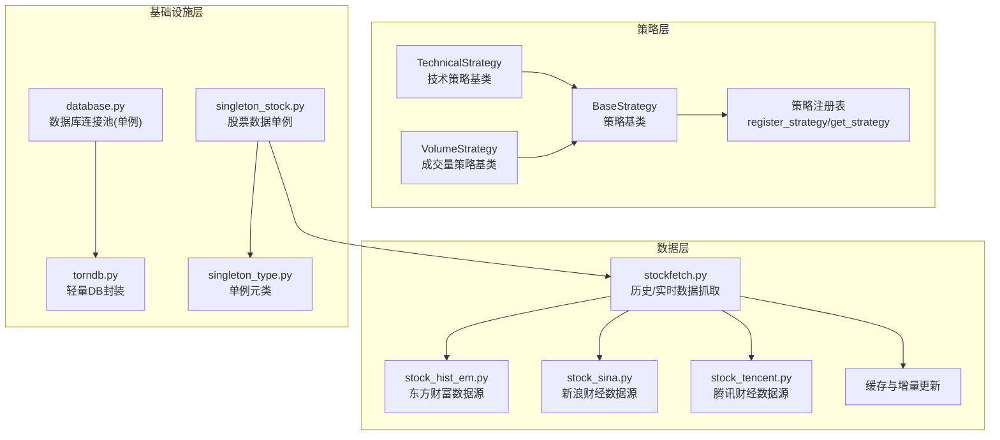
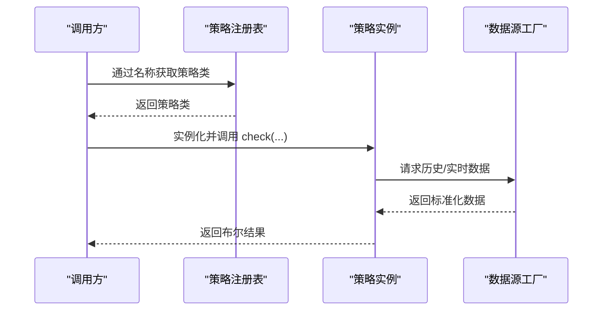
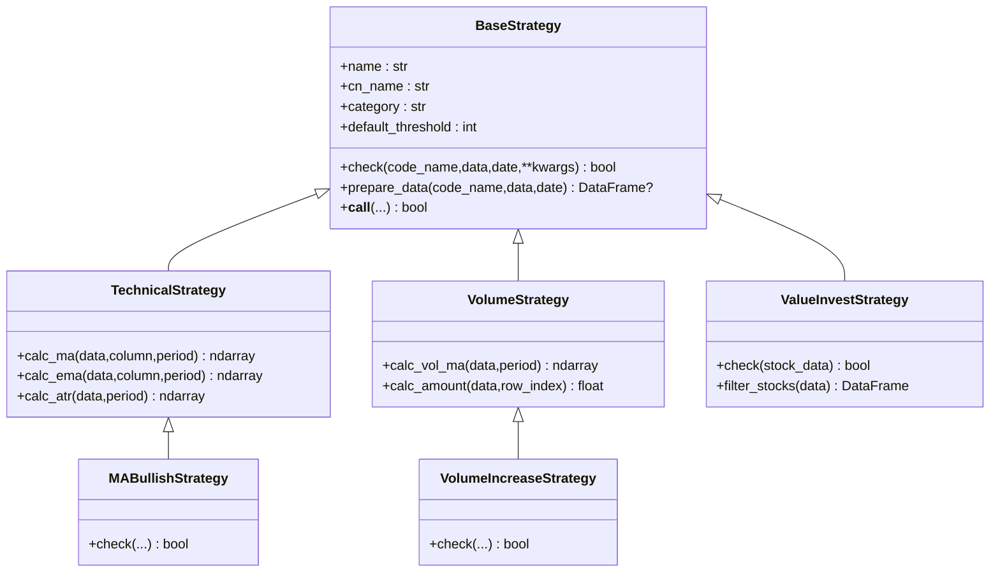
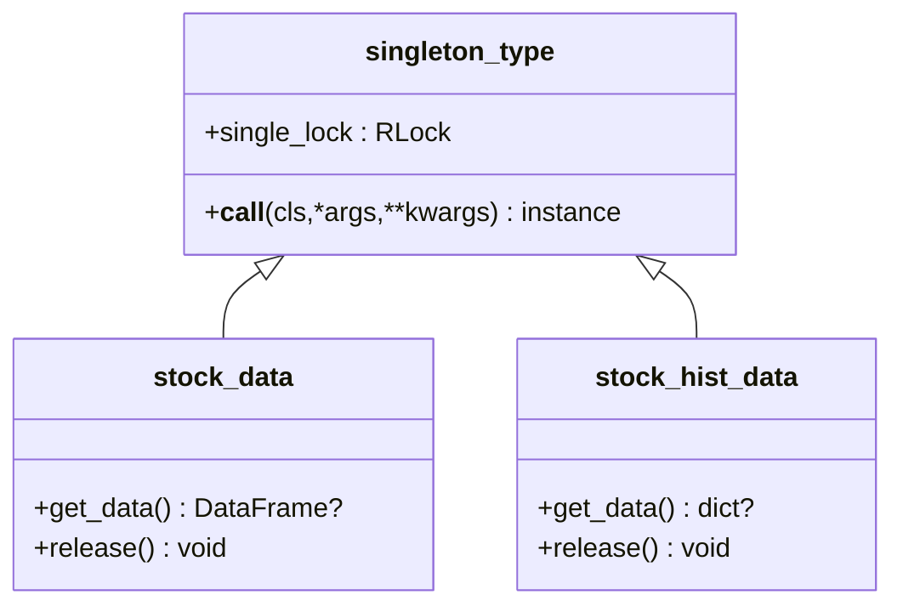
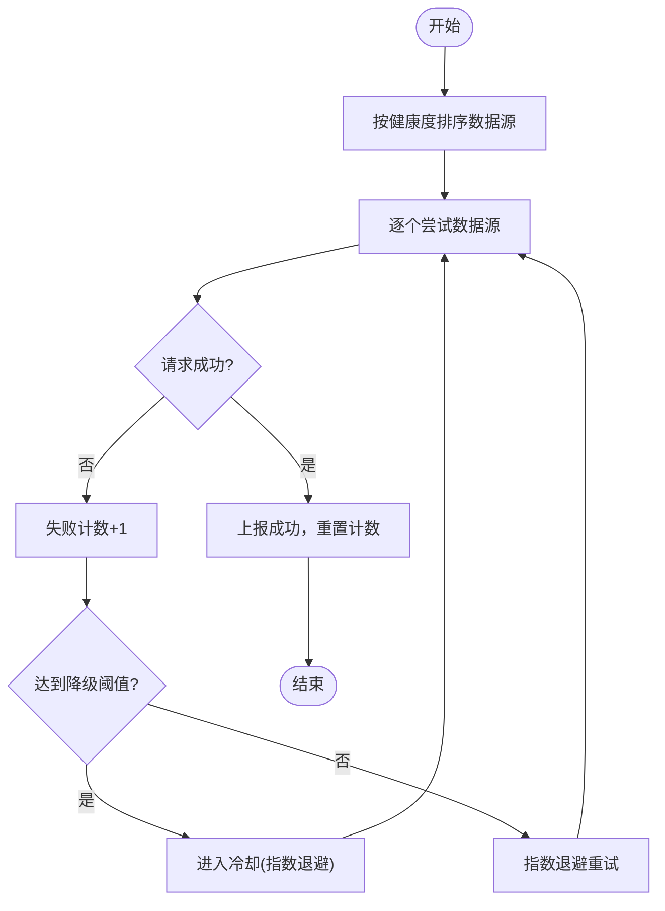
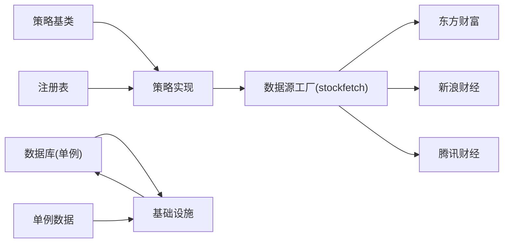

# 设计模式应用

<cite>
**本文档引用的文件**
- [quantia/core/strategy/base.py](file://quantia/core/strategy/base.py)
- [quantia/core/strategy/technical/ma_strategies.py](file://quantia/core/strategy/technical/ma_strategies.py)
- [quantia/core/strategy/volume/volume_strategies.py](file://quantia/core/strategy/volume/volume_strategies.py)
- [quantia/core/strategy/fundamental/fundamental_strategies.py](file://quantia/core/strategy/fundamental/fundamental_strategies.py)
- [quantia/lib/singleton_type.py](file://quantia/lib/singleton_type.py)
- [quantia/core/singleton_stock.py](file://quantia/core/singleton_stock.py)
- [quantia/lib/database.py](file://quantia/lib/database.py)
- [quantia/core/stockfetch.py](file://quantia/core/stockfetch.py)
- [quantia/core/crawling/stock_hist_em.py](file://quantia/core/crawling/stock_hist_em.py)
- [quantia/core/crawling/stock_sina.py](file://quantia/core/crawling/stock_sina.py)
- [quantia/core/crawling/stock_tencent.py](file://quantia/core/crawling/stock_tencent.py)
- [quantia/lib/torndb.py](file://quantia/lib/torndb.py)
- [quantia/core/strategy/__init__.py](file://quantia/core/strategy/__init__.py)
- [quantia/core/strategy/README.md](file://quantia/core/strategy/README.md)
</cite>

## 目录
1. [简介](#简介)
2. [项目结构](#项目结构)
3. [核心组件](#核心组件)
4. [架构总览](#架构总览)
5. [详细组件分析](#详细组件分析)
6. [依赖分析](#依赖分析)
7. [性能考虑](#性能考虑)
8. [故障排查指南](#故障排查指南)
9. [结论](#结论)
10. [附录](#附录)

## 简介
本文件聚焦 Quantia 系统中设计模式的应用与落地，围绕以下目标展开：
- 策略系统中的策略模式：基类抽象、装饰器注册、分类扩展
- 单例模式在数据库连接与股票数据管理中的使用
- 工厂模式在数据源管理中的体现
- 每种设计模式的解决的问题、实现细节与最佳实践

## 项目结构
Quantia 采用“策略+数据源+基础设施”的分层组织：
- 策略层：策略基类与多种策略实现，通过装饰器注册与分类管理
- 数据层：股票数据抓取、历史数据缓存、增量更新与多数据源回退
- 基础设施层：数据库连接池、单例类型、代理与会话管理

图表来源
- [quantia/core/strategy/base.py](file://quantia/core/strategy/base.py#L20-L202)
- [quantia/core/strategy/technical/ma_strategies.py](file://quantia/core/strategy/technical/ma_strategies.py#L1-L237)
- [quantia/core/strategy/volume/volume_strategies.py](file://quantia/core/strategy/volume/volume_strategies.py#L1-L126)
- [quantia/core/stockfetch.py](file://quantia/core/stockfetch.py#L304-L345)
- [quantia/core/crawling/stock_hist_em.py](file://quantia/core/crawling/stock_hist_em.py#L1-L200)
- [quantia/core/crawling/stock_sina.py](file://quantia/core/crawling/stock_sina.py#L1-L200)
- [quantia/core/crawling/stock_tencent.py](file://quantia/core/crawling/stock_tencent.py#L1-L200)
- [quantia/lib/database.py](file://quantia/lib/database.py#L60-L71)
- [quantia/lib/singleton_type.py](file://quantia/lib/singleton_type.py#L12-L20)
- [quantia/core/singleton_stock.py](file://quantia/core/singleton_stock.py#L19-L116)
- [quantia/lib/torndb.py](file://quantia/lib/torndb.py#L47-L122)

章节来源
- [quantia/core/strategy/README.md](file://quantia/core/strategy/README.md#L1-L146)

## 核心组件
- 策略基类与注册体系：通过抽象基类定义统一接口，装饰器实现注册与检索，便于扩展与集中管理
- 单例类型与单例数据：通过元类实现线程安全的单例，避免重复创建与资源浪费
- 数据源工厂与回退：根据健康度动态排序数据源，失败时自动切换，提升鲁棒性
- 数据库连接池：单例化连接池，减少频繁创建销毁带来的性能损耗

章节来源
- [quantia/core/strategy/base.py](file://quantia/core/strategy/base.py#L20-L202)
- [quantia/lib/singleton_type.py](file://quantia/lib/singleton_type.py#L12-L20)
- [quantia/core/singleton_stock.py](file://quantia/core/singleton_stock.py#L19-L116)
- [quantia/lib/database.py](file://quantia/lib/database.py#L60-L71)
- [quantia/core/stockfetch.py](file://quantia/core/stockfetch.py#L125-L134)

## 架构总览
策略系统采用“策略模式 + 注册表 + 工厂式数据源”的组合：
- 策略模式：统一 check 接口，子类实现差异化逻辑
- 注册表：装饰器注册 + 名称检索，支持分类查询
- 工厂式数据源：按健康度排序 + 失败回退 + 指数退避重试
- 单例：数据库连接池、单例数据类，保障资源复用与一致性

图表来源
- [quantia/core/strategy/base.py](file://quantia/core/strategy/base.py#L159-L185)
- [quantia/core/stockfetch.py](file://quantia/core/stockfetch.py#L304-L345)

## 详细组件分析

### 策略模式：策略系统与注册表
- 基类职责：定义统一接口与通用工具（如 prepare_data、指标计算），子类专注业务规则
- 分类扩展：技术、成交量、趋势、形态等基类，便于按类别组织与检索
- 装饰器注册：@register_strategy 将策略类登记到全局注册表，支持按名称/分类检索
- 使用方式：直接实例化、通过注册表构造、兼容旧接口函数

图表来源
- [quantia/core/strategy/base.py](file://quantia/core/strategy/base.py#L20-L202)
- [quantia/core/strategy/technical/ma_strategies.py](file://quantia/core/strategy/technical/ma_strategies.py#L22-L56)
- [quantia/core/strategy/volume/volume_strategies.py](file://quantia/core/strategy/volume/volume_strategies.py#L19-L69)
- [quantia/core/strategy/fundamental/fundamental_strategies.py](file://quantia/core/strategy/fundamental/fundamental_strategies.py#L30-L120)

章节来源
- [quantia/core/strategy/base.py](file://quantia/core/strategy/base.py#L20-L202)
- [quantia/core/strategy/technical/ma_strategies.py](file://quantia/core/strategy/technical/ma_strategies.py#L1-L237)
- [quantia/core/strategy/volume/volume_strategies.py](file://quantia/core/strategy/volume/volume_strategies.py#L1-L126)
- [quantia/core/strategy/fundamental/fundamental_strategies.py](file://quantia/core/strategy/fundamental/fundamental_strategies.py#L1-L351)
- [quantia/core/strategy/__init__.py](file://quantia/core/strategy/__init__.py#L30-L118)

### 单例模式：数据库连接与股票数据
- 数据库连接池：engine() 单例，避免重复创建连接池，降低资源消耗
- 股票数据单例：通过 metaclass=singleton_type 实现线程安全的单例，支持释放
- 使用场景：高频查询、历史数据批量拉取、避免重复初始化

图表来源
- [quantia/lib/singleton_type.py](file://quantia/lib/singleton_type.py#L12-L20)
- [quantia/core/singleton_stock.py](file://quantia/core/singleton_stock.py#L19-L116)
- [quantia/lib/database.py](file://quantia/lib/database.py#L60-L71)

章节来源
- [quantia/lib/singleton_type.py](file://quantia/lib/singleton_type.py#L1-L20)
- [quantia/core/singleton_stock.py](file://quantia/core/singleton_stock.py#L1-L116)
- [quantia/lib/database.py](file://quantia/lib/database.py#L60-L71)

### 工厂模式：数据源管理与健康度回退
- 工厂职责：按优先级组织数据源，按健康度排序，失败时自动切换
- 健康度追踪：失败计数、冷却时间、渐进退避，避免雪崩效应
- 回退策略：指数退避重试、聚合日志、线程安全更新
- 多数据源：东方财富、腾讯、新浪，覆盖实时行情与历史数据

图表来源
- [quantia/core/stockfetch.py](file://quantia/core/stockfetch.py#L64-L134)
- [quantia/core/stockfetch.py](file://quantia/core/stockfetch.py#L170-L184)

章节来源
- [quantia/core/stockfetch.py](file://quantia/core/stockfetch.py#L46-L184)
- [quantia/core/crawling/stock_hist_em.py](file://quantia/core/crawling/stock_hist_em.py#L1-L200)
- [quantia/core/crawling/stock_sina.py](file://quantia/core/crawling/stock_sina.py#L1-L200)
- [quantia/core/crawling/stock_tencent.py](file://quantia/core/crawling/stock_tencent.py#L1-L200)

## 依赖分析
- 策略层依赖：策略基类与注册表，策略实现依赖通用工具（指标计算）
- 数据层依赖：stockfetch 作为工厂，内部依赖多个数据源模块与缓存
- 基础设施依赖：database 提供单例连接池，singleton_stock 依赖 singleton_type 与 stockfetch

图表来源
- [quantia/core/strategy/base.py](file://quantia/core/strategy/base.py#L155-L202)
- [quantia/core/stockfetch.py](file://quantia/core/stockfetch.py#L304-L345)
- [quantia/lib/database.py](file://quantia/lib/database.py#L60-L71)
- [quantia/core/singleton_stock.py](file://quantia/core/singleton_stock.py#L19-L116)

章节来源
- [quantia/core/strategy/base.py](file://quantia/core/strategy/base.py#L155-L202)
- [quantia/core/stockfetch.py](file://quantia/core/stockfetch.py#L304-L345)
- [quantia/lib/database.py](file://quantia/lib/database.py#L60-L71)
- [quantia/core/singleton_stock.py](file://quantia/core/singleton_stock.py#L19-L116)

## 性能考虑
- 连接池复用：数据库连接池单例化，减少创建销毁成本
- 单例数据：股票数据单例避免重复拉取与内存占用
- 并发控制：数据源工厂限制并发线程数，避免触发反爬
- 指数退避：失败重试采用指数退避+抖动，缓解集中重试
- 缓存与增量：历史数据缓存与增量更新，减少重复抓取

## 故障排查指南
- 策略未注册：检查装饰器是否正确使用，确认注册表中存在对应名称
- 数据源失败：查看健康度日志，确认是否被降级；检查代理与网络
- 数据库异常：关注瞬态错误重试与连接池清理；必要时重建单例
- 单例未释放：调用 release() 释放内存，避免历史数据占用过大

章节来源
- [quantia/core/strategy/base.py](file://quantia/core/strategy/base.py#L173-L185)
- [quantia/core/stockfetch.py](file://quantia/core/stockfetch.py#L64-L123)
- [quantia/lib/database.py](file://quantia/lib/database.py#L110-L184)
- [quantia/core/singleton_stock.py](file://quantia/core/singleton_stock.py#L30-L37)

## 结论
Quantia 通过策略模式实现了策略的可扩展与统一管理；通过单例模式提升了数据库与数据对象的资源利用率；通过工厂式数据源与健康度回退机制增强了系统的鲁棒性与稳定性。这些设计模式协同工作，形成了清晰的分层与职责边界，便于维护与演进。

## 附录
- 策略注册与使用：参见模块入口与 README 的使用说明
- 数据源配置：可通过环境变量调整重试次数与历史数据年数
- 单例与连接池：建议在高并发场景下监控连接池状态与内存占用

章节来源
- [quantia/core/strategy/__init__.py](file://quantia/core/strategy/__init__.py#L11-L25)
- [quantia/core/strategy/README.md](file://quantia/core/strategy/README.md#L114-L146)
- [quantia/core/stockfetch.py](file://quantia/core/stockfetch.py#L38-L44)
