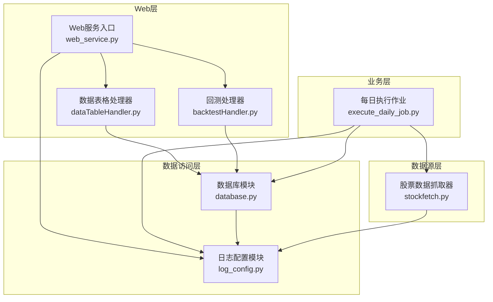
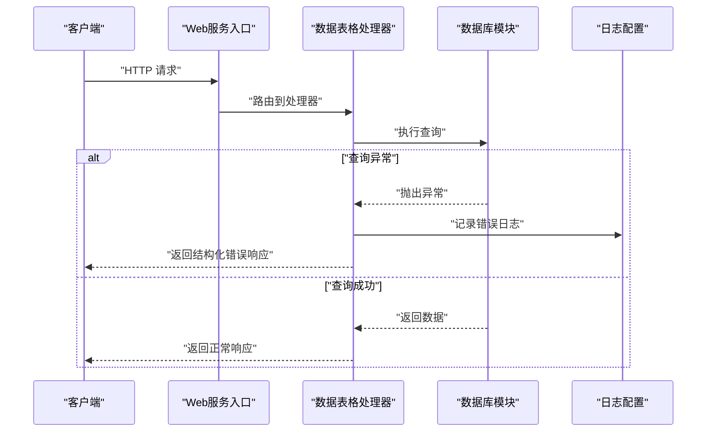
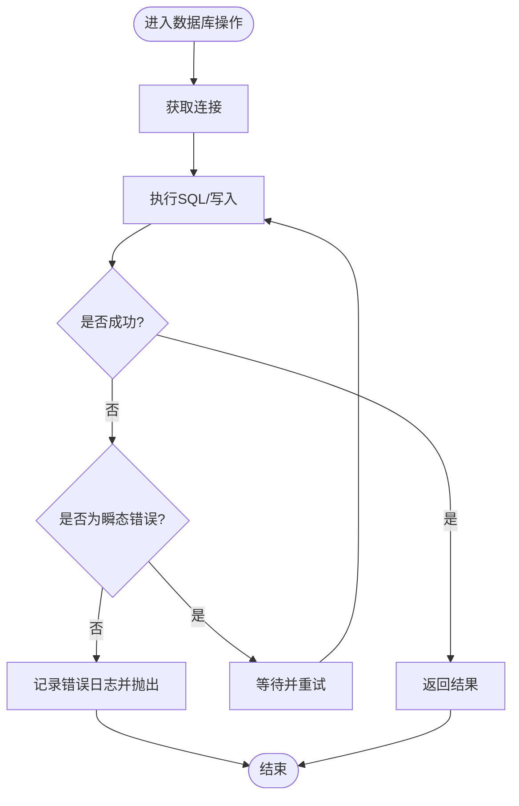
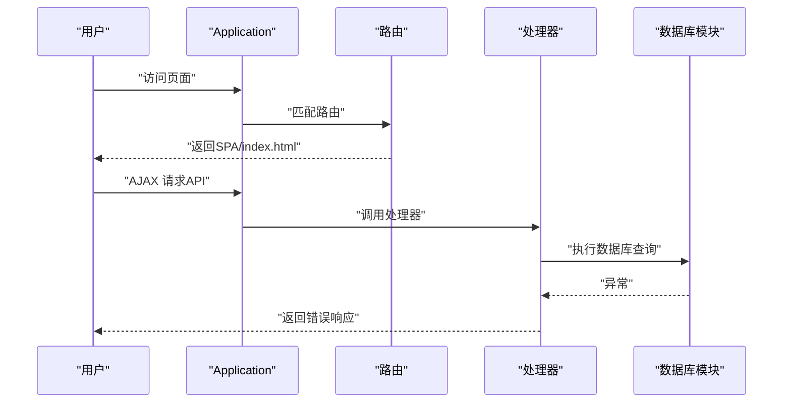
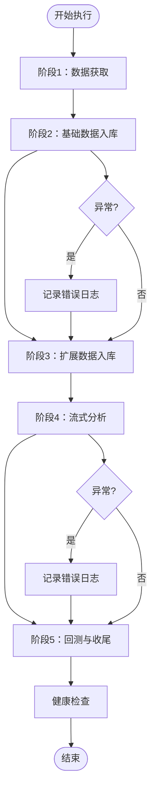
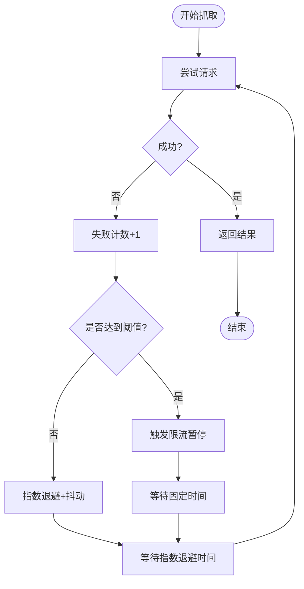
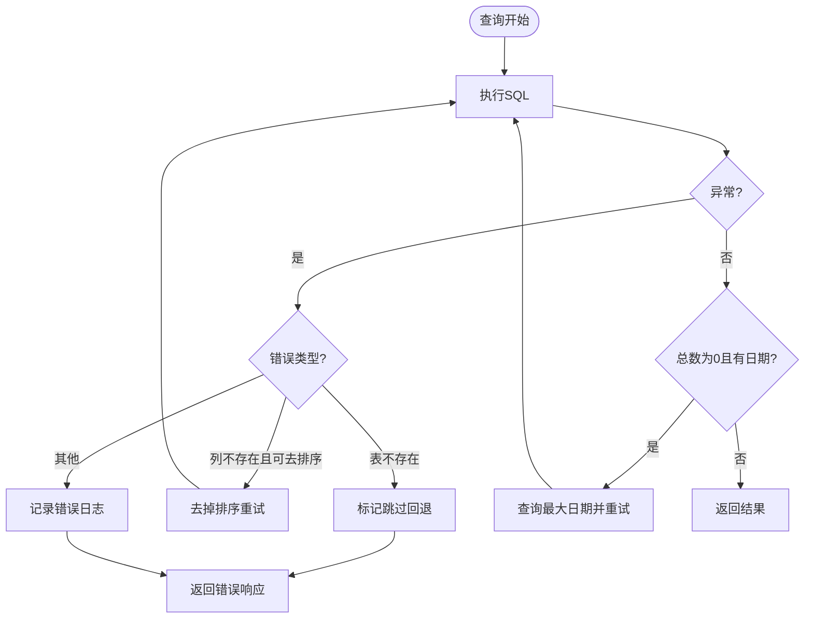
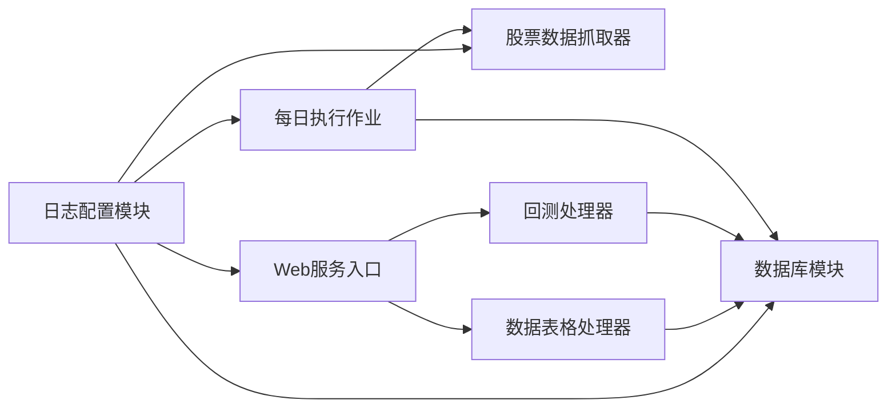

# 错误处理机制

<cite>
**本文引用的文件**
- [日志配置模块](file://quantia/lib/log_config.py)
- [数据库模块](file://quantia/lib/database.py)
- [Web服务入口](file://quantia/web/web_service.py)
- [每日执行作业](file://quantia/job/execute_daily_job.py)
- [数据表格处理器](file://quantia/web/dataTableHandler.py)
- [回测处理器](file://quantia/web/backtestHandler.py)
- [股票数据抓取器](file://quantia/core/stockfetch.py)
- [测试：第三轮修复验证](file://tests/test_round3_fixes.py)
</cite>

## 目录
1. [简介](#简介)
2. [项目结构](#项目结构)
3. [核心组件](#核心组件)
4. [架构总览](#架构总览)
5. [详细组件分析](#详细组件分析)
6. [依赖分析](#依赖分析)
7. [性能考虑](#性能考虑)
8. [故障排查指南](#故障排查指南)
9. [结论](#结论)
10. [附录](#附录)

## 简介
本文件系统性梳理 Quantia 系统的错误处理机制，覆盖数据抓取异常、策略执行异常、数据库操作异常、Web 服务异常等多层级处理策略。重点阐述错误日志记录规范、错误分类与传播机制、错误恢复与降级方案、告警通知建议，以及常见错误场景的处理示例与最佳实践，帮助提升系统稳定性与可维护性。

## 项目结构
系统采用分层设计：
- Web 层：Tornado 应用负责路由与请求转发，统一接入日志配置。
- 业务层：每日执行作业协调数据采集、入库、分析、回测等阶段。
- 数据访问层：数据库模块封装连接、重试、UPSERT、主键/索引维护等。
- 数据源层：股票数据抓取器负责多源并发抓取、指数退避、限流与封禁保护。
- Web 处理器：针对查询、回测等接口做异常捕获与降级回退。

图表来源
- [Web服务入口](file://quantia/web/web_service.py#L53-L98)
- [数据表格处理器](file://quantia/web/dataTableHandler.py#L157-L197)
- [回测处理器](file://quantia/web/backtestHandler.py#L307-L339)
- [每日执行作业](file://quantia/job/execute_daily_job.py#L80-L179)
- [数据库模块](file://quantia/lib/database.py#L260-L303)
- [日志配置模块](file://quantia/lib/log_config.py#L47-L104)
- [股票数据抓取器](file://quantia/core/stockfetch.py#L170-L1350)

章节来源
- [Web服务入口](file://quantia/web/web_service.py#L53-L98)
- [每日执行作业](file://quantia/job/execute_daily_job.py#L80-L179)

## 核心组件
- 日志配置模块：统一三路输出（全量日志、错误汇总日志、控制台），确保格式一致、便于定位问题。
- 数据库模块：提供连接重试、瞬态错误识别、UPSERT 写入、主键/索引自动维护、查询/计数安全封装。
- Web 服务：集中路由与 SPA 回退，统一日志初始化，异常时返回结构化错误响应。
- 每日执行作业：阶段化流水线，分阶段捕获异常并记录，健康检查辅助排障。
- 数据表格处理器：查询异常时进行列缺失回退与日期回退，避免因表结构变更导致全链路失败。
- 股票数据抓取器：并发抓取、指数退避、抖动、连续失败限流保护、疑似封禁终止保护。

章节来源
- [日志配置模块](file://quantia/lib/log_config.py#L47-L104)
- [数据库模块](file://quantia/lib/database.py#L260-L303)
- [Web服务入口](file://quantia/web/web_service.py#L53-L98)
- [每日执行作业](file://quantia/job/execute_daily_job.py#L80-L179)
- [数据表格处理器](file://quantia/web/dataTableHandler.py#L157-L197)
- [股票数据抓取器](file://quantia/core/stockfetch.py#L170-L1350)

## 架构总览
系统错误处理遵循“早发现、早记录、可恢复、可降级”的原则，通过以下机制协同：
- 统一日志：所有模块统一使用日志配置，错误日志集中落盘，便于集中检索与告警。
- 连接与瞬态错误：数据库层对连接与部分 SQL 异常进行有限次数重试，避免偶发网络波动影响。
- 查询健壮性：Web 查询处理器对列缺失、表缺失等进行回退策略，保障接口可用性。
- 作业级容错：每日作业按阶段执行，阶段内异常被捕获并记录，避免阻断后续阶段。
- 数据源保护：抓取器对连续失败进行限流与暂停，必要时终止任务避免扩大损失。

图表来源
- [Web服务入口](file://quantia/web/web_service.py#L53-L98)
- [数据表格处理器](file://quantia/web/dataTableHandler.py#L157-L197)
- [数据库模块](file://quantia/lib/database.py#L278-L287)
- [日志配置模块](file://quantia/lib/log_config.py#L47-L104)

## 详细组件分析

### 数据库模块错误处理
- 连接重试：获取连接时对瞬态错误进行有限次数重试，避免短暂网络波动导致失败。
- SQL 执行重试：对可重试的瞬态错误（如死锁、锁等待、连接丢失等）进行重试，并记录警告日志。
- UPSERT 写入：在存在主键时使用 UPSERT，避免重复主键导致的写入失败；失败时清理连接池并重建引擎实例。
- 主键/索引维护：首次入库时自动检测并添加主键与索引，失败时记录错误日志。
- 查询/计数封装：提供安全的查询与计数封装，异常时记录日志并返回空结果或 0。

图表来源
- [数据库模块](file://quantia/lib/database.py#L80-L92)
- [数据库模块](file://quantia/lib/database.py#L260-L276)
- [数据库模块](file://quantia/lib/database.py#L125-L185)

章节来源
- [数据库模块](file://quantia/lib/database.py#L80-L92)
- [数据库模块](file://quantia/lib/database.py#L110-L117)
- [数据库模块](file://quantia/lib/database.py#L260-L276)
- [数据库模块](file://quantia/lib/database.py#L278-L287)
- [数据库模块](file://quantia/lib/database.py#L290-L303)

### Web 服务异常处理
- 统一日志初始化：应用启动时统一配置日志，避免格式不一致。
- 路由与SPA回退：非 API 路径回退到前端路由，减少 404 噪声。
- 处理器异常捕获：查询异常时记录错误日志并返回结构化错误响应，避免内部异常泄露。
- 回测接口健壮性：对未知策略进行早期校验，避免后续查询失败。

图表来源
- [Web服务入口](file://quantia/web/web_service.py#L53-L98)
- [Web服务入口](file://quantia/web/web_service.py#L102-L125)
- [数据表格处理器](file://quantia/web/dataTableHandler.py#L157-L197)
- [回测处理器](file://quantia/web/backtestHandler.py#L307-L339)

章节来源
- [Web服务入口](file://quantia/web/web_service.py#L53-L98)
- [Web服务入口](file://quantia/web/web_service.py#L102-L125)
- [数据表格处理器](file://quantia/web/dataTableHandler.py#L157-L197)
- [回测处理器](file://quantia/web/backtestHandler.py#L307-L339)

### 每日执行作业异常处理
- 阶段化执行：将流水线分为多个阶段，阶段内异常被捕获并记录，避免阻断后续阶段。
- 分析完成状态检查：通过阈值判断是否跳过分析与回测阶段，减少重复执行。
- 健康检查：流水线结束后对核心表进行健康检查，输出统计信息辅助排障。
- 单例释放：在阶段间释放单例，避免缓存失效导致后续阶段失败。

图表来源
- [每日执行作业](file://quantia/job/execute_daily_job.py#L80-L179)
- [每日执行作业](file://quantia/job/execute_daily_job.py#L182-L226)

章节来源
- [每日执行作业](file://quantia/job/execute_daily_job.py#L48-L78)
- [每日执行作业](file://quantia/job/execute_daily_job.py#L80-L179)
- [每日执行作业](file://quantia/job/execute_daily_job.py#L182-L226)

### 数据抓取异常处理
- 指数退避与抖动：重试等待采用指数增长并加入抖动，避免多线程同时重试引发惊群效应。
- 连续失败限流：连续失败达到阈值时触发限流暂停，降低对外部接口的压力。
- 疑似封禁保护：限流次数超过上限时记录错误并终止任务，避免进一步封禁风险。
- 失败聚合日志：对短时间内多次失败进行聚合输出，减少日志噪声。

图表来源
- [股票数据抓取器](file://quantia/core/stockfetch.py#L170-L1350)

章节来源
- [股票数据抓取器](file://quantia/core/stockfetch.py#L170-L1350)

### Web 查询异常与降级
- 列缺失回退：当 ORDER BY 引用不存在列时，去掉排序字段重试，避免因列未同步导致失败。
- 表缺失处理：标记表不存在，跳过后续日期回退，避免重复触发相同错误。
- 日期回退：若按指定日期查无数据且非关键字/表缺失，则自动回退到最近有数据的日期。
- 结构化错误响应：异常时返回包含错误码与消息的 JSON，便于前端处理。

图表来源
- [数据表格处理器](file://quantia/web/dataTableHandler.py#L157-L197)

章节来源
- [数据表格处理器](file://quantia/web/dataTableHandler.py#L157-L197)

## 依赖分析
- 日志配置被 Web 服务、每日作业、数据库模块、抓取器广泛使用，形成统一的日志基座。
- Web 处理器依赖数据库模块进行数据查询，异常时进行回退与降级。
- 每日作业依赖抓取器与数据库模块，阶段化捕获异常并进行健康检查。
- 数据库模块内部通过瞬态错误识别与重试机制提升稳定性。

图表来源
- [日志配置模块](file://quantia/lib/log_config.py#L47-L104)
- [Web服务入口](file://quantia/web/web_service.py#L53-L98)
- [每日执行作业](file://quantia/job/execute_daily_job.py#L80-L179)
- [数据库模块](file://quantia/lib/database.py#L260-L303)
- [股票数据抓取器](file://quantia/core/stockfetch.py#L170-L1350)
- [数据表格处理器](file://quantia/web/dataTableHandler.py#L157-L197)
- [回测处理器](file://quantia/web/backtestHandler.py#L307-L339)

章节来源
- [日志配置模块](file://quantia/lib/log_config.py#L47-L104)
- [Web服务入口](file://quantia/web/web_service.py#L53-L98)
- [每日执行作业](file://quantia/job/execute_daily_job.py#L80-L179)
- [数据库模块](file://quantia/lib/database.py#L260-L303)
- [股票数据抓取器](file://quantia/core/stockfetch.py#L170-L1350)
- [数据表格处理器](file://quantia/web/dataTableHandler.py#L157-L197)
- [回测处理器](file://quantia/web/backtestHandler.py#L307-L339)

## 性能考虑
- 重试与退避：数据库与抓取器均采用有限重试与指数退避，避免雪崩式重试放大延迟。
- 连接池与预热：数据库连接池配置合理，启用 pre_ping 与超时控制，减少无效连接。
- 写入优化：存在主键时使用 UPSERT，减少重复写入失败与死锁概率。
- I/O 与内存：每日作业采用低内存模式，避免全量加载导致峰值内存过高。
- 日志级别：控制台仅输出 WARNING+，避免 INFO 级刷屏影响性能。

## 故障排查指南
- 日志定位：优先查看统一错误日志文件，结合时间戳与模块名快速定位。
- 数据库异常：确认是否为瞬态错误，观察重试次数与等待时间；检查连接池状态与主键/索引是否存在。
- Web 查询异常：检查表是否存在、列是否同步、日期是否有效；利用回退逻辑确认是否为结构变更导致。
- 抓取异常：关注连续失败次数与限流暂停日志；若出现疑似封禁终止，需调整频率或更换策略。
- 作业健康检查：根据健康检查输出核对核心表当日数据量与最新日期，定位数据缺失环节。

章节来源
- [日志配置模块](file://quantia/lib/log_config.py#L47-L104)
- [数据库模块](file://quantia/lib/database.py#L260-L303)
- [数据表格处理器](file://quantia/web/dataTableHandler.py#L157-L197)
- [股票数据抓取器](file://quantia/core/stockfetch.py#L170-L1350)
- [每日执行作业](file://quantia/job/execute_daily_job.py#L182-L226)

## 结论
Quantia 的错误处理机制通过统一日志、连接与瞬态错误重试、查询回退与降级、阶段化容错与健康检查、抓取器限流与封禁保护等手段，构建了多层次、可恢复、可降级的稳定性体系。建议持续完善告警通知机制与自动化巡检，进一步缩短故障定位与恢复时间。

## 附录

### 错误日志记录规范
- 日志格式：包含时间、级别、模块名与消息；错误日志包含完整堆栈。
- 输出目标：全量日志文件（INFO+）、错误汇总日志（ERROR+）、控制台（WARNING+）。
- 初始化要求：入口脚本仅调用一次日志初始化，避免重复配置导致格式不一致。

章节来源
- [日志配置模块](file://quantia/lib/log_config.py#L47-L104)

### 错误分类与传播
- 瞬态错误：连接中断、死锁、锁等待、连接丢失等，采用重试与退避策略。
- 结构错误：表不存在、列缺失、参数非法等，采用回退与降级策略。
- 业务错误：策略未知、数据为空等，采用结构化错误响应与日志记录。
- 外部限制：连续失败触发限流，疑似封禁时终止任务。

章节来源
- [数据库模块](file://quantia/lib/database.py#L110-L117)
- [数据表格处理器](file://quantia/web/dataTableHandler.py#L157-L197)
- [股票数据抓取器](file://quantia/core/stockfetch.py#L170-L1350)
- [回测处理器](file://quantia/web/backtestHandler.py#L307-L339)

### 常见错误场景与最佳实践
- 数据抓取频繁失败：启用指数退避与抖动，设置合理的失败阈值与暂停时间；必要时降低并发与请求频率。
- 数据库写入冲突：确保主键存在并使用 UPSERT；对瞬态错误进行重试并清理连接池。
- Web 查询列缺失：在 ORDER BY 中避免引用未同步列；实现去排序回退逻辑。
- 作业阶段阻断：每个阶段独立捕获异常并记录；在关键阶段后进行健康检查。
- 健康检查：定期核对核心表当日数据量与最新日期，及时发现数据缺失。

章节来源
- [股票数据抓取器](file://quantia/core/stockfetch.py#L170-L1350)
- [数据库模块](file://quantia/lib/database.py#L125-L185)
- [数据表格处理器](file://quantia/web/dataTableHandler.py#L157-L197)
- [每日执行作业](file://quantia/job/execute_daily_job.py#L182-L226)
- [测试：第三轮修复验证](file://tests/test_round3_fixes.py#L1-L45)
