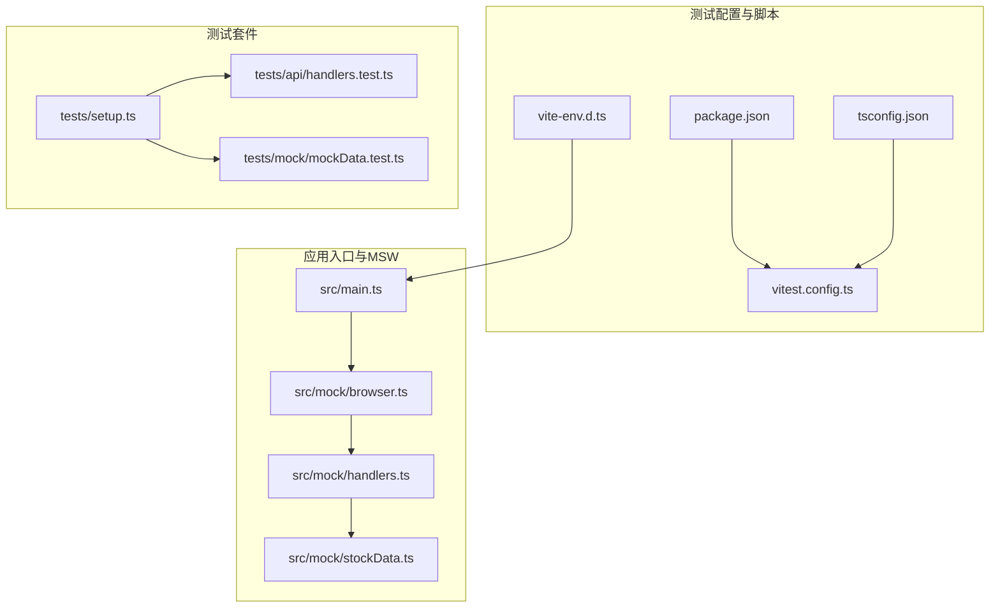
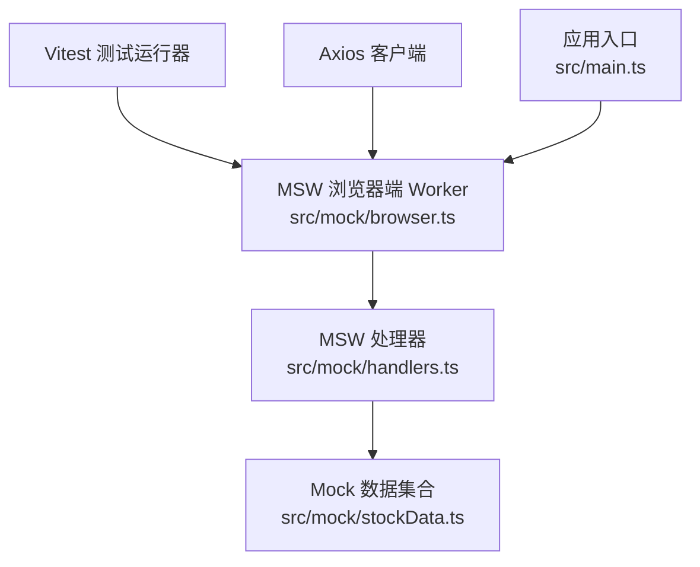
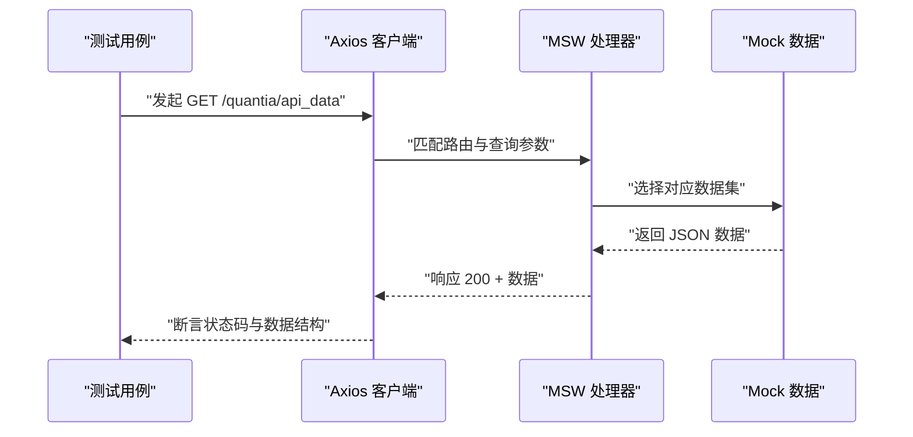
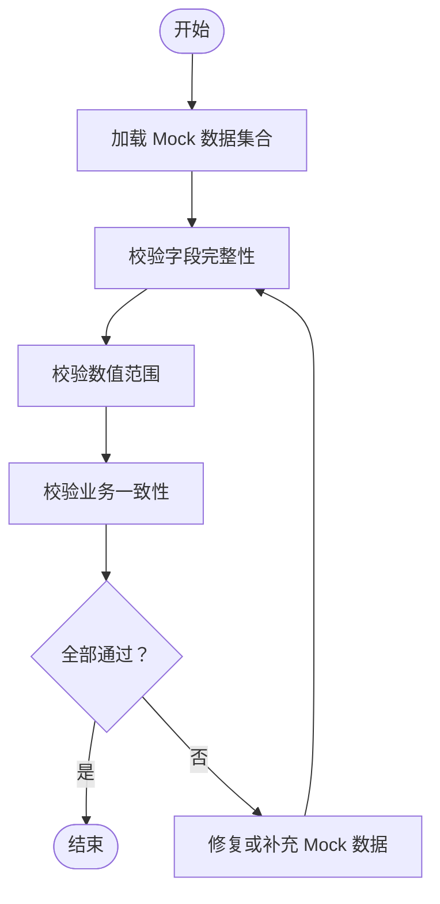
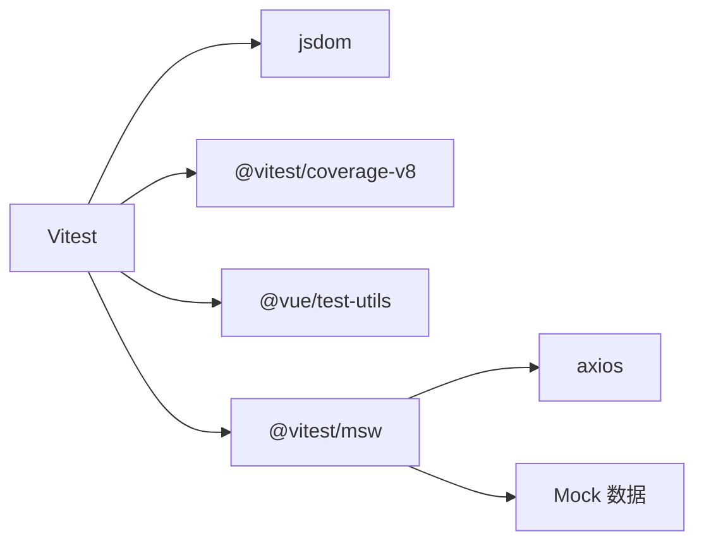

# 前端测试

<cite>
**本文引用的文件**
- [docker/stock/quantia/fontWeb/vitest.config.ts](file://docker/stock/quantia/fontWeb/vitest.config.ts)
- [docker/stock/quantia/fontWeb/package.json](file://docker/stock/quantia/fontWeb/package.json)
- [docker/stock/quantia/fontWeb/tsconfig.json](file://docker/stock/quantia/fontWeb/tsconfig.json)
- [docker/stock/quantia/fontWeb/src/vite-env.d.ts](file://docker/stock/quantia/fontWeb/src/vite-env.d.ts)
- [docker/stock/quantia/fontWeb/src/main.ts](file://docker/stock/quantia/fontWeb/src/main.ts)
- [docker/stock/quantia/fontWeb/tests/setup.ts](file://docker/stock/quantia/fontWeb/tests/setup.ts)
- [docker/stock/quantia/fontWeb/src/mock/browser.ts](file://docker/stock/quantia/fontWeb/src/mock/browser.ts)
- [docker/stock/quantia/fontWeb/src/mock/handlers.ts](file://docker/stock/quantia/fontWeb/src/mock/handlers.ts)
- [docker/stock/quantia/fontWeb/src/mock/index.ts](file://docker/stock/quantia/fontWeb/src/mock/index.ts)
- [docker/stock/quantia/fontWeb/src/mock/stockData.ts](file://docker/stock/quantia/fontWeb/src/mock/stockData.ts)
- [docker/stock/quantia/fontWeb/tests/api/handlers.test.ts](file://docker/stock/quantia/fontWeb/tests/api/handlers.test.ts)
- [docker/stock/quantia/fontWeb/tests/mock/mockData.test.ts](file://docker/stock/quantia/fontWeb/tests/mock/mockData.test.ts)
</cite>

## 目录
1. [简介](#简介)
2. [项目结构](#项目结构)
3. [核心组件](#核心组件)
4. [架构总览](#架构总览)
5. [详细组件分析](#详细组件分析)
6. [依赖关系分析](#依赖关系分析)
7. [性能考虑](#性能考虑)
8. [故障排查指南](#故障排查指南)
9. [结论](#结论)
10. [附录](#附录)

## 简介
本文件面向 Quantia 前端（Vue 3 + TypeScript + Vitest + MSW）的测试体系，系统化阐述组件测试、路由测试、状态管理测试与 API 接口测试的配置与实践；详解 MSW 的使用方式、测试数据模拟与异步操作测试；并提供 TypeScript 测试配置、测试覆盖率统计以及在持续集成中运行前端测试的流程建议。目标是保障 Web 界面的用户体验与功能正确性。

## 项目结构
前端测试相关的关键目录与文件如下：
- 测试运行与覆盖率配置：vitest.config.ts
- 依赖与脚本：package.json
- TypeScript 编译选项：tsconfig.json
- Vite 类型声明：vite-env.d.ts
- 应用入口与开发模式下的 MSW 启动逻辑：main.ts
- 测试全局初始化：tests/setup.ts
- MSW 浏览器端 Worker 配置：src/mock/browser.ts
- MSW 请求处理器与路由映射：src/mock/handlers.ts
- Mock 数据集合：src/mock/stockData.ts
- 测试用例示例：tests/api/handlers.test.ts、tests/mock/mockData.test.ts

图表来源
- [docker/stock/quantia/fontWeb/vitest.config.ts](file://docker/stock/quantia/fontWeb/vitest.config.ts#L1-L28)
- [docker/stock/quantia/fontWeb/package.json](file://docker/stock/quantia/fontWeb/package.json#L1-L44)
- [docker/stock/quantia/fontWeb/tsconfig.json](file://docker/stock/quantia/fontWeb/tsconfig.json#L1-L26)
- [docker/stock/quantia/fontWeb/src/vite-env.d.ts](file://docker/stock/quantia/fontWeb/src/vite-env.d.ts#L1-L8)
- [docker/stock/quantia/fontWeb/src/main.ts](file://docker/stock/quantia/fontWeb/src/main.ts#L1-L40)
- [docker/stock/quantia/fontWeb/src/mock/browser.ts](file://docker/stock/quantia/fontWeb/src/mock/browser.ts#L1-L6)
- [docker/stock/quantia/fontWeb/src/mock/handlers.ts](file://docker/stock/quantia/fontWeb/src/mock/handlers.ts#L1-L80)
- [docker/stock/quantia/fontWeb/src/mock/stockData.ts](file://docker/stock/quantia/fontWeb/src/mock/stockData.ts#L1-L470)
- [docker/stock/quantia/fontWeb/tests/setup.ts](file://docker/stock/quantia/fontWeb/tests/setup.ts#L1-L41)
- [docker/stock/quantia/fontWeb/tests/api/handlers.test.ts](file://docker/stock/quantia/fontWeb/tests/api/handlers.test.ts#L1-L87)
- [docker/stock/quantia/fontWeb/tests/mock/mockData.test.ts](file://docker/stock/quantia/fontWeb/tests/mock/mockData.test.ts#L1-L101)

章节来源
- [docker/stock/quantia/fontWeb/vitest.config.ts](file://docker/stock/quantia/fontWeb/vitest.config.ts#L1-L28)
- [docker/stock/quantia/fontWeb/package.json](file://docker/stock/quantia/fontWeb/package.json#L1-L44)
- [docker/stock/quantia/fontWeb/tsconfig.json](file://docker/stock/quantia/fontWeb/tsconfig.json#L1-L26)
- [docker/stock/quantia/fontWeb/src/vite-env.d.ts](file://docker/stock/quantia/fontWeb/src/vite-env.d.ts#L1-L8)
- [docker/stock/quantia/fontWeb/src/main.ts](file://docker/stock/quantia/fontWeb/src/main.ts#L1-L40)
- [docker/stock/quantia/fontWeb/tests/setup.ts](file://docker/stock/quantia/fontWeb/tests/setup.ts#L1-L41)

## 核心组件
- Vitest 配置与覆盖率
  - 使用 jsdom 环境，启用全局测试 API，通过 setupFiles 引入全局初始化。
  - 覆盖率采用 v8 提供者，输出文本、JSON、HTML 报告，并排除 mock 目录与类型声明。
  - 别名 @ 指向 src，便于统一导入路径。
- TypeScript 与类型声明
  - tsconfig.json 配置严格模式、模块解析策略、路径别名等。
  - vite-env.d.ts 声明 .vue 模块类型，确保 IDE 与编译器识别 Vue 组件。
- MSW 浏览器端 Worker
  - 在开发模式下按需启动，未匹配请求直接放行，避免干扰真实网络。
- 测试全局初始化
  - 初始化 Pinia 并激活为当前测试会话。
  - 全局注册 Element Plus 及其图标，适配组件测试渲染。
  - 通过 matchMedia 与 ResizeObserver 的 polyfill 解决浏览器环境缺失问题。

章节来源
- [docker/stock/quantia/fontWeb/vitest.config.ts](file://docker/stock/quantia/fontWeb/vitest.config.ts#L1-L28)
- [docker/stock/quantia/fontWeb/tsconfig.json](file://docker/stock/quantia/fontWeb/tsconfig.json#L1-L26)
- [docker/stock/quantia/fontWeb/src/vite-env.d.ts](file://docker/stock/quantia/fontWeb/src/vite-env.d.ts#L1-L8)
- [docker/stock/quantia/fontWeb/src/main.ts](file://docker/stock/quantia/fontWeb/src/main.ts#L12-L24)
- [docker/stock/quantia/fontWeb/tests/setup.ts](file://docker/stock/quantia/fontWeb/tests/setup.ts#L1-L41)

## 架构总览
下图展示前端测试的整体架构：Vitest 运行器、MSW（浏览器端）、Mock 数据与 Axios 请求之间的交互关系。

图表来源
- [docker/stock/quantia/fontWeb/src/main.ts](file://docker/stock/quantia/fontWeb/src/main.ts#L12-L24)
- [docker/stock/quantia/fontWeb/src/mock/browser.ts](file://docker/stock/quantia/fontWeb/src/mock/browser.ts#L1-L6)
- [docker/stock/quantia/fontWeb/src/mock/handlers.ts](file://docker/stock/quantia/fontWeb/src/mock/handlers.ts#L1-L80)
- [docker/stock/quantia/fontWeb/src/mock/stockData.ts](file://docker/stock/quantia/fontWeb/src/mock/stockData.ts#L1-L470)

## 详细组件分析

### 组件测试（基于 @vue/test-utils）
- 全局初始化
  - 在 tests/setup.ts 中创建并激活 Pinia，注册 Element Plus 插件与图标组件，保证组件渲染一致性。
  - 通过 matchMedia 与 ResizeObserver 的 polyfill，避免第三方库在测试环境中的兼容性问题。
- 组件渲染与交互
  - 建议在单测中使用 @vue/test-utils 的 mount/shallowMount 包装组件，结合 Pinia 的 storeToRefs/useStore 访问状态。
  - 对于需要网络请求的组件，优先使用 MSW 拦截请求，确保测试稳定与可重复。
- 最佳实践
  - 将通用的断言与工具函数抽取至测试辅助模块，减少重复代码。
  - 对异步更新后的 DOM 断言，使用 flushPromises 或等待 nextTick。

章节来源
- [docker/stock/quantia/fontWeb/tests/setup.ts](file://docker/stock/quantia/fontWeb/tests/setup.ts#L1-L41)

### 路由测试
- 路由行为验证
  - 使用 Vue Router 的测试模式，结合 Memory History 或 Hash History，避免真实导航对测试的影响。
  - 通过路由守卫与参数校验，断言不同路径下的组件渲染与数据加载。
- MSW 集成
  - 在路由测试中同样通过 MSW 提供的浏览器端 Worker 拦截请求，确保路由切换时的数据一致性。

章节来源
- [docker/stock/quantia/fontWeb/src/mock/browser.ts](file://docker/stock/quantia/fontWeb/src/mock/browser.ts#L1-L6)
- [docker/stock/quantia/fontWeb/src/mock/handlers.ts](file://docker/stock/quantia/fontWeb/src/mock/handlers.ts#L1-L80)

### 状态管理测试（Pinia）
- Store 初始化
  - 在 tests/setup.ts 中创建并激活 Pinia，确保每个测试用例都在独立的状态上下文中执行。
- 行为验证
  - 对 actions 的异步逻辑进行断言，如 loading 状态、错误处理与最终状态变更。
  - 对 getters 的派生结果进行断言，确保计算属性在不同状态下的正确性。
- 并发与边界
  - 验证并发请求下的状态合并与去重逻辑，确保 UI 不出现竞态条件。

章节来源
- [docker/stock/quantia/fontWeb/tests/setup.ts](file://docker/stock/quantia/fontWeb/tests/setup.ts#L7-L10)

### API 接口测试（MSW + Axios）
- 浏览器端 MSW
  - 在开发模式下，应用入口根据环境变量动态启动 MSW Worker，拦截真实网络请求。
  - 测试中可直接使用 Axios 发起请求，MSW 按 handlers.ts 中定义的路由规则返回 mock 数据。
- 服务器端 MSW（Node）
  - tests/api/handlers.test.ts 展示了使用 setupServer(...) 在 Node 环境下启动 MSW，用于纯 API 行为测试。
- 路由与参数
  - handlers.ts 定义了多条路由，包括带查询参数的分页/筛选、关注/取消关注、K线历史等。
  - 支持按日期过滤与参数校验，测试中应覆盖正常与异常场景。

图表来源
- [docker/stock/quantia/fontWeb/tests/api/handlers.test.ts](file://docker/stock/quantia/fontWeb/tests/api/handlers.test.ts#L23-L65)
- [docker/stock/quantia/fontWeb/src/mock/handlers.ts](file://docker/stock/quantia/fontWeb/src/mock/handlers.ts#L32-L45)
- [docker/stock/quantia/fontWeb/src/mock/stockData.ts](file://docker/stock/quantia/fontWeb/src/mock/stockData.ts#L1-L173)

章节来源
- [docker/stock/quantia/fontWeb/src/main.ts](file://docker/stock/quantia/fontWeb/src/main.ts#L12-L24)
- [docker/stock/quantia/fontWeb/src/mock/browser.ts](file://docker/stock/quantia/fontWeb/src/mock/browser.ts#L1-L6)
- [docker/stock/quantia/fontWeb/src/mock/handlers.ts](file://docker/stock/quantia/fontWeb/src/mock/handlers.ts#L1-L80)
- [docker/stock/quantia/fontWeb/tests/api/handlers.test.ts](file://docker/stock/quantia/fontWeb/tests/api/handlers.test.ts#L1-L87)

### 测试数据模拟与验证
- Mock 数据集合
  - stockData.ts 提供多种业务场景的 Mock 数据，包括股票行情、技术指标、K线形态、策略选股、龙虎榜、资金流向与 K线历史等。
- 数据质量校验
  - tests/mock/mockData.test.ts 对 Mock 数据进行字段完整性、范围约束与业务一致性检查，确保测试数据真实可用。
- 扩展与维护
  - 新增业务场景时，同步扩展 Mock 数据与对应的处理器，保持测试与生产的解耦。

图表来源
- [docker/stock/quantia/fontWeb/tests/mock/mockData.test.ts](file://docker/stock/quantia/fontWeb/tests/mock/mockData.test.ts#L4-L101)
- [docker/stock/quantia/fontWeb/src/mock/stockData.ts](file://docker/stock/quantia/fontWeb/src/mock/stockData.ts#L1-L470)

章节来源
- [docker/stock/quantia/fontWeb/tests/mock/mockData.test.ts](file://docker/stock/quantia/fontWeb/tests/mock/mockData.test.ts#L1-L101)
- [docker/stock/quantia/fontWeb/src/mock/stockData.ts](file://docker/stock/quantia/fontWeb/src/mock/stockData.ts#L1-L470)

### 异步操作测试
- Promise/await
  - 对异步请求与状态变更，使用 await 等待完成后再断言，避免竞态。
- 事件循环与微任务
  - 对涉及 UI 更新的异步逻辑，使用 flushPromises 或 nextTick 确保 DOM 更新完成。
- 错误处理
  - 验证异常分支，如网络失败、参数非法、数据为空等情况下的 UI 与状态表现。

章节来源
- [docker/stock/quantia/fontWeb/tests/api/handlers.test.ts](file://docker/stock/quantia/fontWeb/tests/api/handlers.test.ts#L23-L85)

### 端到端用户交互测试（概念性指导）
- 场景设计
  - 基于真实用户路径设计 E2E 场景，如“进入首页 -> 切换板块 -> 查看K线 -> 关注股票 -> 查看关注列表”。
- 自动化执行
  - 建议使用 Playwright/Cypress 等工具在 CI 中执行 E2E，结合 MSW 提供稳定的后端数据。
- 与单元测试协同
  - 单元测试负责逻辑与边界，E2E 负责整体流程与用户体验，两者互补。

（本节为概念性内容，不直接分析具体文件）

### 性能基准测试（概念性指导）
- 关键指标
  - 组件渲染时间、首屏加载时间、交互延迟、内存占用峰值。
- 测试方法
  - 使用浏览器性能 API 或自动化工具采集指标，建立基线并在 PR 中对比回归。
- 优化建议
  - 按需加载、虚拟滚动、缓存策略与懒加载，结合覆盖率与性能报告持续优化。

（本节为概念性内容，不直接分析具体文件）

## 依赖关系分析
- 测试运行时依赖
  - Vitest + jsdom 提供 DOM 环境与测试 API。
  - @vue/test-utils 提供组件级测试能力。
  - MSW 提供浏览器端与 Node 端的请求拦截。
- 覆盖率与报告
  - v8 提供者生成覆盖率，支持文本、JSON、HTML 输出，便于本地与 CI 集成。
- 路径别名与类型
  - @ 指向 src，提升导入一致性；vite-env.d.ts 声明 Vue 模块类型，避免类型报错。

图表来源
- [docker/stock/quantia/fontWeb/package.json](file://docker/stock/quantia/fontWeb/package.json#L25-L38)
- [docker/stock/quantia/fontWeb/vitest.config.ts](file://docker/stock/quantia/fontWeb/vitest.config.ts#L11-L19)

章节来源
- [docker/stock/quantia/fontWeb/package.json](file://docker/stock/quantia/fontWeb/package.json#L25-L38)
- [docker/stock/quantia/fontWeb/vitest.config.ts](file://docker/stock/quantia/fontWeb/vitest.config.ts#L1-L28)

## 性能考虑
- 测试执行效率
  - 使用并行测试与合理的测试分组，缩短 CI 时间。
  - 仅在必要时启动 MSW，避免不必要的网络拦截开销。
- 覆盖率与质量
  - 通过覆盖率阈值与报告，持续改进关键路径的测试密度。
- 资源与内存
  - 控制 Mock 数据规模，避免单测中构造过大数据集导致内存压力。

（本节为通用指导，不直接分析具体文件）

## 故障排查指南
- 环境变量与模式
  - 开发模式下启用 MSW：确保 MODE=mock，以便 main.ts 中的 enableMocking() 生效。
- 测试环境缺失
  - 若出现 matchMedia 或 ResizeObserver 相关报错，请确认 tests/setup.ts 已正确注入 polyfill。
- 路由与参数
  - API 测试失败时，检查 handlers.ts 中的路由与查询参数是否与测试一致。
- 覆盖率统计
  - 若覆盖率报告为空或不准确，检查 vitest.config.ts 的 include/exclude 规则与 setupFiles。

章节来源
- [docker/stock/quantia/fontWeb/src/main.ts](file://docker/stock/quantia/fontWeb/src/main.ts#L12-L24)
- [docker/stock/quantia/fontWeb/tests/setup.ts](file://docker/stock/quantia/fontWeb/tests/setup.ts#L20-L40)
- [docker/stock/quantia/fontWeb/src/mock/handlers.ts](file://docker/stock/quantia/fontWeb/src/mock/handlers.ts#L32-L45)
- [docker/stock/quantia/fontWeb/vitest.config.ts](file://docker/stock/quantia/fontWeb/vitest.config.ts#L11-L19)

## 结论
本测试体系以 Vitest 为核心，结合 MSW 实现稳定可靠的 API 模拟与组件测试；通过全局初始化与严格的 TypeScript 配置，确保测试的一致性与可维护性。配合覆盖率统计与 CI 集成，能够有效保障前端功能正确性与用户体验。

## 附录

### TypeScript 测试配置要点
- 严格模式与路径别名
  - tsconfig.json 启用严格模式、模块解析策略与 @ 路径别名，提升类型安全与导入一致性。
- Vue 模块类型声明
  - vite-env.d.ts 声明 .vue 模块类型，避免组件导入时报错。

章节来源
- [docker/stock/quantia/fontWeb/tsconfig.json](file://docker/stock/quantia/fontWeb/tsconfig.json#L2-L22)
- [docker/stock/quantia/fontWeb/src/vite-env.d.ts](file://docker/stock/quantia/fontWeb/src/vite-env.d.ts#L3-L7)

### 测试覆盖率统计
- 配置项
  - provider: v8，reporter: text/json/html，exclude: node_modules、src/mock、*.d.ts。
- 使用方式
  - 通过脚本 test:coverage 生成报告，便于本地与 CI 查看。

章节来源
- [docker/stock/quantia/fontWeb/vitest.config.ts](file://docker/stock/quantia/fontWeb/vitest.config.ts#L11-L19)
- [docker/stock/quantia/fontWeb/package.json](file://docker/stock/quantia/fontWeb/package.json#L11-L13)

### 持续集成中的前端测试流程（建议）
- 步骤
  - 安装依赖 -> 运行类型检查 -> 执行单元测试与覆盖率 -> 生成报告。
- 命令参考
  - npm run build（或相应构建命令）-> npm run test:coverage。
- 结果
  - 将覆盖率报告与 HTML 报表上传至 CI 存档，作为质量门禁依据。

章节来源
- [docker/stock/quantia/fontWeb/package.json](file://docker/stock/quantia/fontWeb/package.json#L6-L13)
- [docker/stock/quantia/fontWeb/vitest.config.ts](file://docker/stock/quantia/fontWeb/vitest.config.ts#L11-L19)
