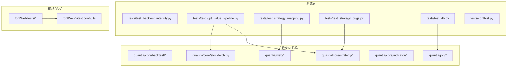
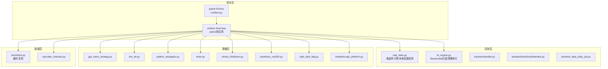
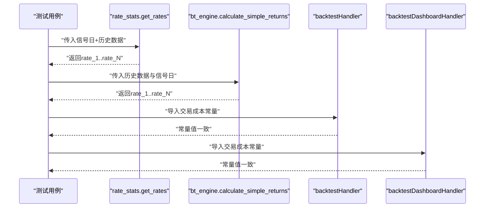
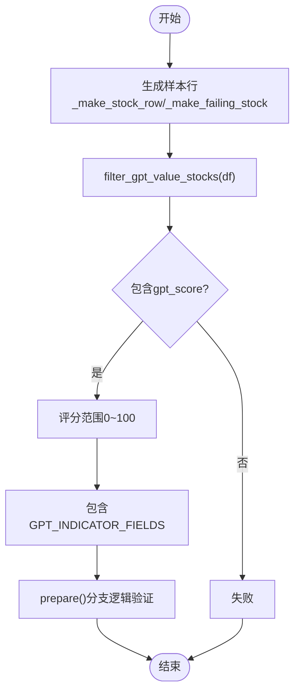
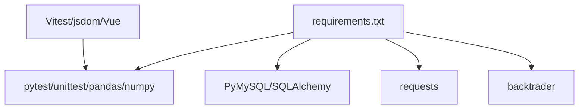

# 单元测试

<cite>
**本文档引用的文件**
- [tests/conftest.py](file://tests/conftest.py)
- [tests/test_backtest_integrity.py](file://tests/test_backtest_integrity.py)
- [tests/test_gpt_value_pipeline.py](file://tests/test_gpt_value_pipeline.py)
- [tests/test_strategy_mapping.py](file://tests/test_strategy_mapping.py)
- [tests/test_strategy_bugs.py](file://tests/test_strategy_bugs.py)
- [tests/test_db.py](file://tests/test_db.py)
- [quantia/core/backtest/bt_engine.py](file://quantia/core/backtest/bt_engine.py)
- [quantia/core/backtest/rate_stats.py](file://quantia/core/backtest/rate_stats.py)
- [quantia/core/strategy/gpt_value_strategy.py](file://quantia/core/strategy/gpt_value_strategy.py)
- [quantia/web/backtestHandler.py](file://quantia/web/backtestHandler.py)
- [quantia/web/backtestDashboardHandler.py](file://quantia/web/backtestDashboardHandler.py)
- [quantia/job/backtest_data_daily_job.py](file://quantia/job/backtest_data_daily_job.py)
- [quantia/core/stockfetch.py](file://quantia/core/stockfetch.py)
- [quantia/core/strategy/low_atr.py](file://quantia/core/strategy/low_atr.py)
- [quantia/core/strategy/pattern/pattern_strategies.py](file://quantia/core/strategy/pattern/pattern_strategies.py)
- [quantia/core/strategy/enter.py](file://quantia/core/strategy/enter.py)
- [quantia/core/strategy/climax_limitdown.py](file://quantia/core/strategy/climax_limitdown.py)
- [quantia/core/strategy/backtrace_ma250.py](file://quantia/core/strategy/backtrace_ma250.py)
- [quantia/core/strategy/high_tight_flag.py](file://quantia/core/strategy/high_tight_flag.py)
- [quantia/core/strategy/breakthrough_platform.py](file://quantia/core/strategy/breakthrough_platform.py)
- [quantia/core/indicator/calculate_indicator.py](file://quantia/core/indicator/calculate_indicator.py)
- [requirements.txt](file://requirements.txt)
</cite>

## 目录
1. [简介](#简介)
2. [项目结构](#项目结构)
3. [核心组件](#核心组件)
4. [架构总览](#架构总览)
5. [详细组件分析](#详细组件分析)
6. [依赖分析](#依赖分析)
7. [性能考虑](#性能考虑)
8. [故障排查指南](#故障排查指南)
9. [结论](#结论)
10. [附录](#附录)

## 简介
本文件面向Quantia项目的单元测试体系，聚焦Python测试框架pytest的使用方法与最佳实践，结合量化策略测试、回测引擎测试与数据完整性测试，系统阐述测试用例编写规范、断言方法、测试夹具（fixtures）的使用、Mock对象策略、测试覆盖率分析以及边界条件与异常处理的实践要点。文档同时给出测试数据准备、测试流程可视化图示与常见问题排查建议，旨在提升核心功能模块的稳定性与可靠性。

## 项目结构
Quantia采用多语言混合架构：后端Python核心逻辑位于quantia目录，前端Vue应用位于quantia/fontWeb，测试代码分布在tests目录与前端fontWeb/tests目录。Python侧测试主要集中在tests目录，覆盖回测、策略、数据一致性等维度；前端测试由Vitest驱动，配置位于vitest.config.ts。

图表来源
- [tests/test_backtest_integrity.py](file://tests/test_backtest_integrity.py#L1-L430)
- [tests/test_gpt_value_pipeline.py](file://tests/test_gpt_value_pipeline.py#L1-L460)
- [tests/test_strategy_mapping.py](file://tests/test_strategy_mapping.py#L1-L165)
- [tests/test_strategy_bugs.py](file://tests/test_strategy_bugs.py#L1-L281)
- [tests/test_db.py](file://tests/test_db.py#L1-L27)
- [tests/conftest.py](file://tests/conftest.py#L1-L18)
- [quantia/core/strategy/gpt_value_strategy.py](file://quantia/core/strategy/gpt_value_strategy.py#L1-L318)
- [quantia/core/backtest/bt_engine.py](file://quantia/core/backtest/bt_engine.py#L1-L388)
- [quantia/core/backtest/rate_stats.py](file://quantia/core/backtest/rate_stats.py)
- [quantia/web/backtestHandler.py](file://quantia/web/backtestHandler.py)
- [quantia/web/backtestDashboardHandler.py](file://quantia/web/backtestDashboardHandler.py)
- [quantia/job/backtest_data_daily_job.py](file://quantia/job/backtest_data_daily_job.py)
- [quantia/core/stockfetch.py](file://quantia/core/stockfetch.py)
- [quantia/core/indicator/calculate_indicator.py](file://quantia/core/indicator/calculate_indicator.py)
- [quantia/core/strategy/low_atr.py](file://quantia/core/strategy/low_atr.py)
- [quantia/core/strategy/pattern/pattern_strategies.py](file://quantia/core/strategy/pattern/pattern_strategies.py)
- [quantia/core/strategy/enter.py](file://quantia/core/strategy/enter.py)
- [quantia/core/strategy/climax_limitdown.py](file://quantia/core/strategy/climax_limitdown.py)
- [quantia/core/strategy/backtrace_ma250.py](file://quantia/core/strategy/backtrace_ma250.py)
- [quantia/core/strategy/high_tight_flag.py](file://quantia/core/strategy/high_tight_flag.py)
- [quantia/core/strategy/breakthrough_platform.py](file://quantia/core/strategy/breakthrough_platform.py)

章节来源
- [tests/conftest.py](file://tests/conftest.py#L1-L18)
- [requirements.txt](file://requirements.txt#L1-L41)

## 核心组件
- 测试框架与配置
  - pytest配置：通过tests/conftest.py排除脚本式验证脚本，确保收集稳定快速。
  - 前端测试：Vitest配置位于quantia/fontWeb/vitest.config.ts，启用jsdom环境、全局测试API与覆盖率统计。
- 回测系统测试
  - 完整性测试覆盖未来函数检测、交易成本、涨跌停过滤、收益率计算、稳健性与工具集成。
  - 关键模块：quantia/core/backtest/rate_stats.py、quantia/core/backtest/bt_engine.py、quantia/web/backtestHandler.py、quantia/web/backtestDashboardHandler.py、quantia/job/backtest_data_daily_job.py。
- 策略测试
  - GPT综合选股策略：筛选逻辑、评分范围、表结构一致性、边界条件与历史Bug修复验证。
  - 策略映射与解析：策略名称到表名映射完整性与容错解析。
  - 策略Bug修复：除零保护、公式方向修正、价格引用修复等。
- 数据完整性测试
  - 前复权数据使用一致性、缓存路径标识、数据库连通性验证。
- Mock与夹具
  - 使用unittest.mock.patch与MagicMock模拟数据库访问、外部依赖，隔离网络/数据库影响。

章节来源
- [tests/test_backtest_integrity.py](file://tests/test_backtest_integrity.py#L1-L430)
- [tests/test_gpt_value_pipeline.py](file://tests/test_gpt_value_pipeline.py#L1-L460)
- [tests/test_strategy_mapping.py](file://tests/test_strategy_mapping.py#L1-L165)
- [tests/test_strategy_bugs.py](file://tests/test_strategy_bugs.py#L1-L281)
- [tests/test_db.py](file://tests/test_db.py#L1-L27)
- [quantia/core/backtest/bt_engine.py](file://quantia/core/backtest/bt_engine.py#L1-L388)
- [quantia/core/backtest/rate_stats.py](file://quantia/core/backtest/rate_stats.py)
- [quantia/core/strategy/gpt_value_strategy.py](file://quantia/core/strategy/gpt_value_strategy.py#L1-L318)
- [quantia/web/backtestHandler.py](file://quantia/web/backtestHandler.py)
- [quantia/web/backtestDashboardHandler.py](file://quantia/web/backtestDashboardHandler.py)
- [quantia/job/backtest_data_daily_job.py](file://quantia/job/backtest_data_daily_job.py)
- [quantia/core/stockfetch.py](file://quantia/core/stockfetch.py)
- [quantia/core/strategy/low_atr.py](file://quantia/core/strategy/low_atr.py)
- [quantia/core/strategy/pattern/pattern_strategies.py](file://quantia/core/strategy/pattern/pattern_strategies.py)
- [quantia/core/strategy/enter.py](file://quantia/core/strategy/enter.py)
- [quantia/core/strategy/climax_limitdown.py](file://quantia/core/strategy/climax_limitdown.py)
- [quantia/core/strategy/backtrace_ma250.py](file://quantia/core/strategy/backtrace_ma250.py)
- [quantia/core/strategy/high_tight_flag.py](file://quantia/core/strategy/high_tight_flag.py)
- [quantia/core/strategy/breakthrough_platform.py](file://quantia/core/strategy/breakthrough_platform.py)
- [quantia/core/indicator/calculate_indicator.py](file://quantia/core/indicator/calculate_indicator.py)

## 架构总览
下图展示Python测试与核心模块之间的交互关系，突出测试对回测引擎、策略与数据层的覆盖。

图表来源
- [tests/test_backtest_integrity.py](file://tests/test_backtest_integrity.py#L68-L426)
- [tests/test_gpt_value_pipeline.py](file://tests/test_gpt_value_pipeline.py#L77-L460)
- [tests/test_strategy_mapping.py](file://tests/test_strategy_mapping.py#L14-L165)
- [tests/test_strategy_bugs.py](file://tests/test_strategy_bugs.py#L65-L277)
- [quantia/core/backtest/rate_stats.py](file://quantia/core/backtest/rate_stats.py)
- [quantia/core/backtest/bt_engine.py](file://quantia/core/backtest/bt_engine.py#L101-L200)
- [quantia/core/strategy/gpt_value_strategy.py](file://quantia/core/strategy/gpt_value_strategy.py#L79-L200)
- [quantia/core/strategy/low_atr.py](file://quantia/core/strategy/low_atr.py)
- [quantia/core/strategy/pattern/pattern_strategies.py](file://quantia/core/strategy/pattern/pattern_strategies.py)
- [quantia/core/strategy/enter.py](file://quantia/core/strategy/enter.py)
- [quantia/core/strategy/climax_limitdown.py](file://quantia/core/strategy/climax_limitdown.py)
- [quantia/core/strategy/backtrace_ma250.py](file://quantia/core/strategy/backtrace_ma250.py)
- [quantia/core/strategy/high_tight_flag.py](file://quantia/core/strategy/high_tight_flag.py)
- [quantia/core/strategy/breakthrough_platform.py](file://quantia/core/strategy/breakthrough_platform.py)
- [quantia/core/stockfetch.py](file://quantia/core/stockfetch.py)
- [quantia/core/indicator/calculate_indicator.py](file://quantia/core/indicator/calculate_indicator.py)

## 详细组件分析

### 回测系统完整性测试
- 目标：验证回测系统的六大核心规则（数据准备、策略逻辑、模拟规则、绩效评估、稳健性、工具集成）。
- 关键测试点
  - 未来函数检测：买入价使用T+1开盘价而非T日收盘价；涨停过滤；gap阈值校验。
  - 交易成本：佣金、印花税、滑点与总成本范围；扣费后收益严格低于原始收益。
  - 收益率一致性：bt_engine.calculate_simple_returns与rate_stats保持一致。
  - 边界条件：仅信号日、仅两日数据、空数据、负收益、无open列降级处理。
  - 工具集成：web层常量导入一致性；幸存者偏差意识（策略表读取而非实时列表）；前复权数据使用。
- 断言方法
  - 使用assertIsNotNone/assertIsNone、assertAlmostEqual、assertGreater/assertLess、assertEqual、assertTrue/assertFalse等。
- Mock与夹具
  - 使用unittest.mock.patch模拟数据库/外部依赖，隔离网络/DB影响。
- 测试数据准备
  - 通过辅助函数生成确定性历史数据（_make_hist/_make_hist_deterministic），保证可重复性与可验证性。

图表来源
- [tests/test_backtest_integrity.py](file://tests/test_backtest_integrity.py#L68-L426)
- [quantia/core/backtest/rate_stats.py](file://quantia/core/backtest/rate_stats.py)
- [quantia/core/backtest/bt_engine.py](file://quantia/core/backtest/bt_engine.py#L197-L213)
- [quantia/web/backtestHandler.py](file://quantia/web/backtestHandler.py)
- [quantia/web/backtestDashboardHandler.py](file://quantia/web/backtestDashboardHandler.py)

章节来源
- [tests/test_backtest_integrity.py](file://tests/test_backtest_integrity.py#L68-L426)

### GPT综合选股策略测试
- 目标：验证筛选逻辑、评分范围、表结构一致性、边界条件与历史Bug修复。
- 关键测试点
  - 筛选通过/拒绝：合格/不合格股票；混合数据保留；空输入返回空。
  - 结果字段：包含gpt_score与所有GPT_INDICATOR_FIELDS；表结构一致性校验。
  - 边界条件：资产负债率=60不通过；每股经营现金流=0不通过；PE=0/PE<0不通过；NaN软通过；最低数据质量要求。
  - 评分范围：0~100；完美股票评分高于一般股票。
  - Bug修复：low_atr策略单调上涨场景、ratio阈值修正；prepare逻辑分支（空数据、表不存在、全筛掉）。
- 断言方法
  - assertIn/assertNotIn、assertEqual、assertGreater/assertLess、assertTrue/assertFalse、assertIsNotNone。
- Mock与夹具
  - 使用patch.object与MagicMock模拟数据库访问与插入操作，验证分支逻辑与异常路径。
- 测试数据准备
  - 通过数据工厂函数生成满足/不满足条件的样本行，覆盖边界与异常场景。

图表来源
- [tests/test_gpt_value_pipeline.py](file://tests/test_gpt_value_pipeline.py#L34-L320)
- [quantia/core/strategy/gpt_value_strategy.py](file://quantia/core/strategy/gpt_value_strategy.py#L79-L200)

章节来源
- [tests/test_gpt_value_pipeline.py](file://tests/test_gpt_value_pipeline.py#L77-L460)
- [quantia/core/strategy/gpt_value_strategy.py](file://quantia/core/strategy/gpt_value_strategy.py#L79-L200)

### 策略名称映射与解析测试
- 目标：验证策略映射完整性与解析容错性。
- 关键测试点
  - 映射完整性：TABLE_CN_STOCK_STRATEGIES中每个表名与中文名均在映射表中；指标买入/卖出三键一致。
  - 条目字段：每个映射项包含table、cn、type字段；type合法。
  - 解析容错：有效表名/中文名/别名解析；空字符串/None/无效值返回错误；前后空格容忍；兼容旧中文名。
  - 端到端流程：DB→overview→frontend→detail的roundtrip解析。
- 断言方法
  - assertIn/asserNotIn、assertEqual、assertTrue/assertFalse、assertIsNotNone。

章节来源
- [tests/test_strategy_mapping.py](file://tests/test_strategy_mapping.py#L14-L165)

### 策略与指标Bug修复验证测试
- 目标：验证本轮审计发现的CRITICAL/HIGH/MEDIUM级问题修复。
- 关键测试点
  - low_backtrace_increase：previous_open初始化修复后策略可返回True；含大跌幅/涨幅不足场景。
  - 除零保护：enter与climax_limitdown在vol_ma5=0时不应抛异常；backtrace_ma250在volume=0时不应除零。
  - 公式修正：breakthrough_platform偏离率公式方向修正；calculate_indicator中inf处理使用_fill_nan_inf。
  - 价格引用修复：high_tight_flag使用当日收盘价而非切片high。
- 断言方法
  - assertRaises(ZeroDivisionError)、assertTrue/assertFalse、assertIsInstance。

章节来源
- [tests/test_strategy_bugs.py](file://tests/test_strategy_bugs.py#L65-L277)

### 数据完整性测试
- 目标：验证前复权数据使用、缓存路径标识、数据库连通性。
- 关键测试点
  - 前复权：缓存文件路径包含qfq标识；fetch_stock_hist默认使用前复权。
  - 数据库：连接参数正确，查询版本号，异常捕获与资源释放。
- 断言方法
  - assertIn、assertEqual、assertIsNotNone。

章节来源
- [tests/test_backtest_integrity.py](file://tests/test_backtest_integrity.py#L411-L426)
- [tests/test_db.py](file://tests/test_db.py#L1-L27)

## 依赖分析
- Python测试依赖
  - pytest：测试收集与执行。
  - unittest：内置断言与TestCase基类。
  - pandas/numpy：数据构造与断言。
  - PyMySQL/SQLAlchemy：数据库连接与ORM。
  - requests：网络请求（策略爬虫相关模块）。
  - backtrader：回测引擎（可选，按requirements安装）。
- 前端测试依赖
  - Vitest：测试运行与覆盖率。
  - jsdom：DOM环境模拟。
  - Vue插件：组件测试支持。

图表来源
- [requirements.txt](file://requirements.txt#L1-L41)

章节来源
- [requirements.txt](file://requirements.txt#L1-L41)

## 性能考虑
- 测试数据生成
  - 使用确定性随机种子或固定序列生成历史数据，减少测试执行时间与内存占用。
- Mock策略
  - 优先使用Mock替代真实数据库/网络请求，避免I/O瓶颈。
- 断言粒度
  - 将复杂逻辑拆分为多个小用例，便于定位问题与并行执行。
- 覆盖率
  - 前端使用Vitest配置开启覆盖率统计，后端pytest可通过pytest-cov扩展（需额外安装）进行覆盖率分析。

## 故障排查指南
- 回测测试失败
  - 检查rate_stats中T+1开盘价使用逻辑与涨停过滤阈值；确认交易成本常量导入一致性。
  - 验证bt_engine与rate_stats的列语义一致性。
- GPT策略失败
  - 检查参数加载与默认值回退；确认边界条件（NaN/None/inf/-inf）处理。
  - 核对表结构定义与GPT_INDICATOR_FIELDS一致性。
- 策略映射解析失败
  - 检查策略映射表是否包含表名/中文名/别名；确认type字段合法。
- Bug修复回归
  - 针对除零保护、公式方向、价格引用等用例逐一回归验证。
- 数据库连接失败
  - 检查连接参数、防火墙与数据库状态；确保异常捕获与资源释放。

章节来源
- [tests/test_backtest_integrity.py](file://tests/test_backtest_integrity.py#L68-L426)
- [tests/test_gpt_value_pipeline.py](file://tests/test_gpt_value_pipeline.py#L77-L460)
- [tests/test_strategy_mapping.py](file://tests/test_strategy_mapping.py#L14-L165)
- [tests/test_strategy_bugs.py](file://tests/test_strategy_bugs.py#L65-L277)
- [tests/test_db.py](file://tests/test_db.py#L1-L27)

## 结论
本测试体系围绕回测引擎、策略与数据完整性三大维度，结合pytest与unittest的断言与Mock策略，覆盖了未来函数检测、交易成本、涨跌停过滤、评分范围、表结构一致性、策略映射解析与多项历史Bug修复验证。通过确定性测试数据与隔离Mock，显著提升了测试稳定性与可维护性。建议持续完善覆盖率统计与并行执行策略，进一步缩短反馈周期并增强回归保障。

## 附录
- 测试用例设计原则
  - 单一职责：每个用例聚焦一个功能点或边界条件。
  - 可重复性：使用确定性数据生成与Mock，避免外部依赖。
  - 可读性：清晰命名与注释，必要时使用数据工厂函数。
- 边界条件测试
  - 空输入/None、仅信号日、仅两日数据、负收益、NaN/inf、极端gap、极端阈值。
- 异常处理最佳实践
  - 使用assertRaises验证异常；对除零、索引越界、类型错误等进行显式测试。
- 测试覆盖率分析
  - 前端：Vitest配置已启用覆盖率统计；后端可引入pytest-cov扩展进行覆盖率分析。
