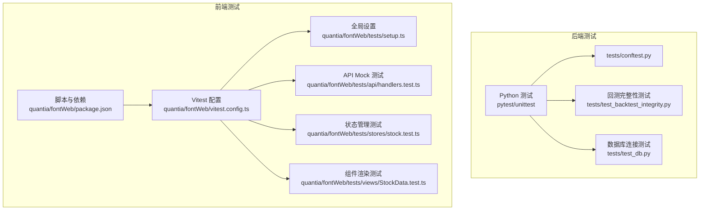
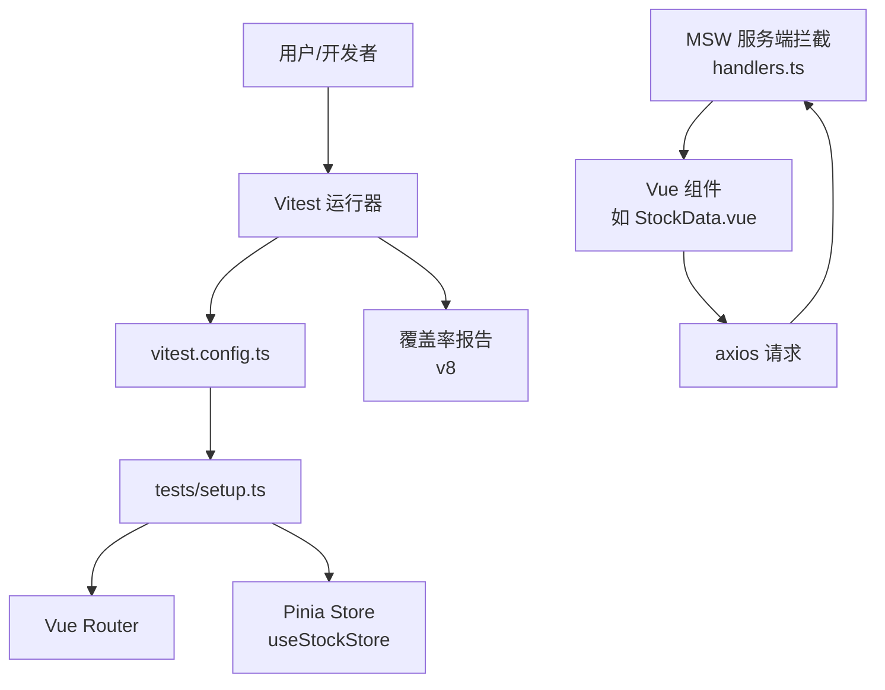
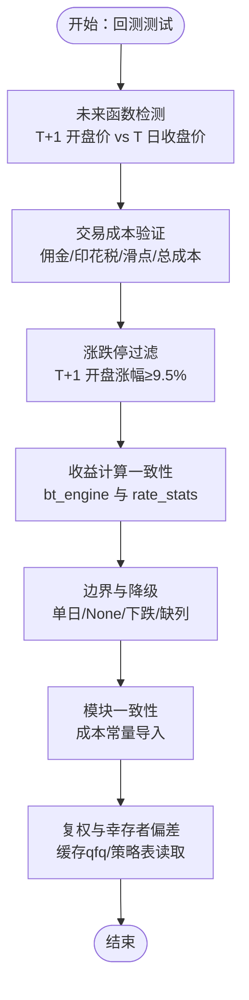
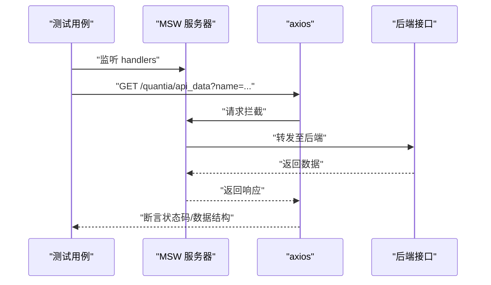
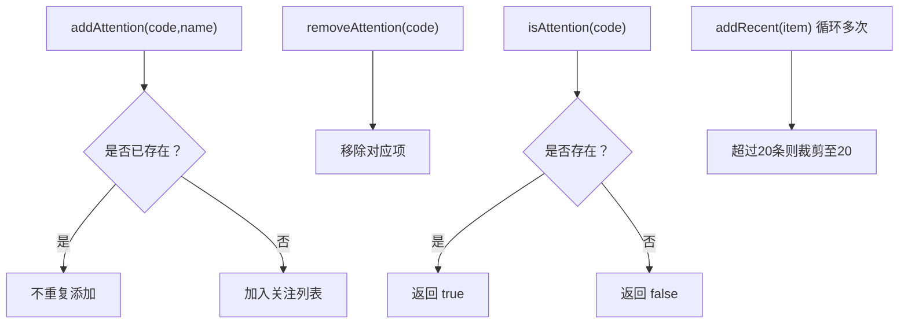
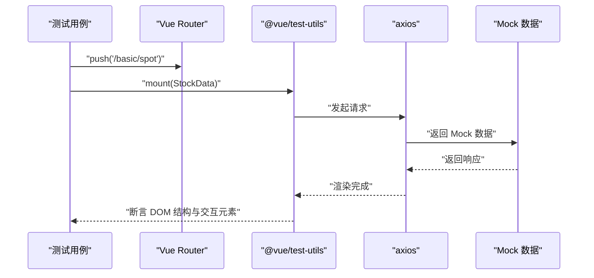
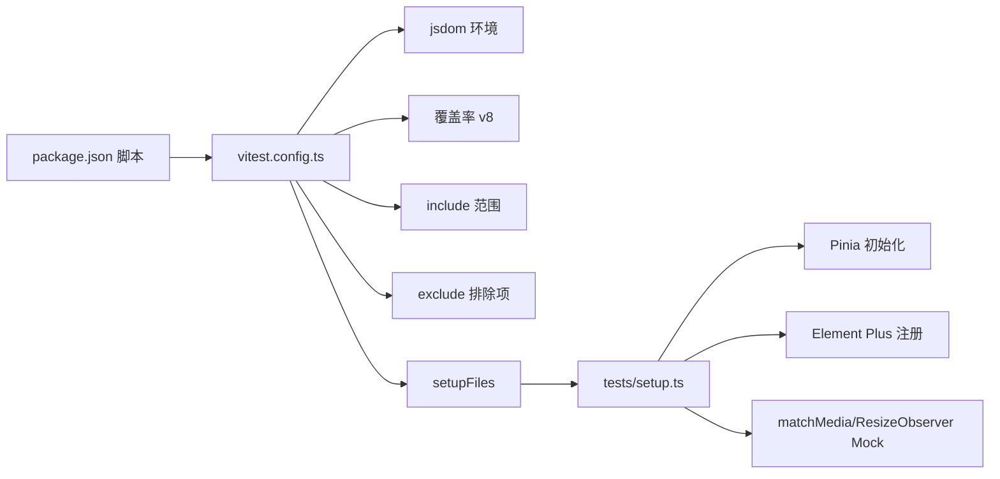
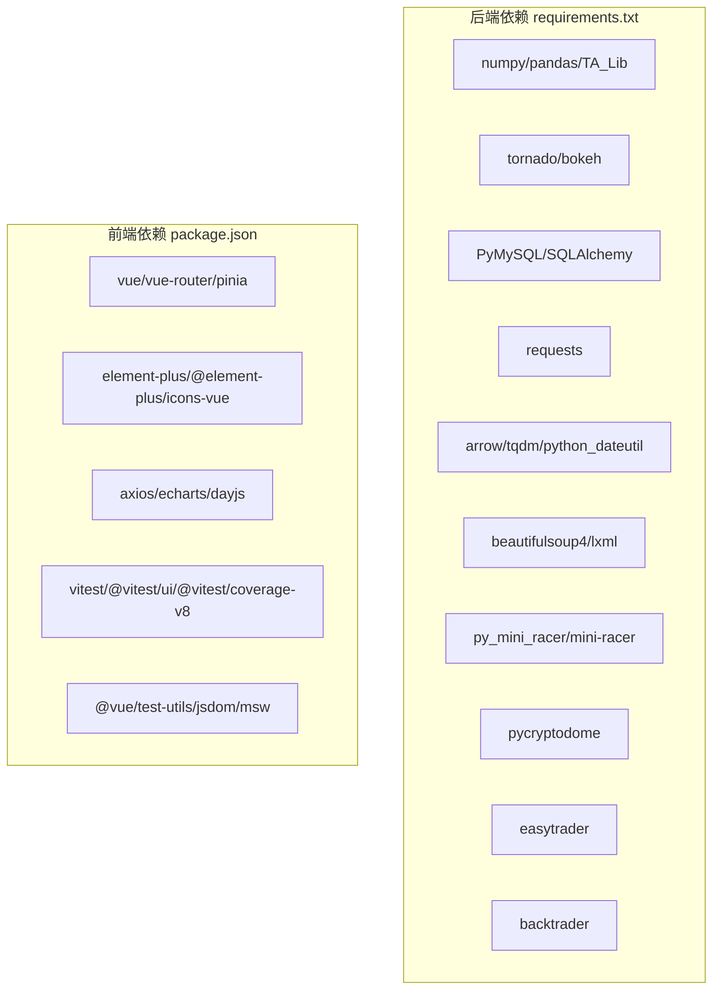

# 测试体系

<cite>
**本文引用的文件**
- [tests/conftest.py](file://tests/conftest.py)
- [requirements.txt](file://requirements.txt)
- [quantia/fontWeb/tests/setup.ts](file://quantia/fontWeb/tests/setup.ts)
- [quantia/fontWeb/vitest.config.ts](file://quantia/fontWeb/vitest.config.ts)
- [quantia/fontWeb/package.json](file://quantia/fontWeb/package.json)
- [quantia/fontWeb/tests/api/handlers.test.ts](file://quantia/fontWeb/tests/api/handlers.test.ts)
- [quantia/fontWeb/tests/stores/stock.test.ts](file://quantia/fontWeb/tests/stores/stock.test.ts)
- [quantia/fontWeb/tests/views/StockData.test.ts](file://quantia/fontWeb/tests/views/StockData.test.ts)
- [tests/test_backtest_integrity.py](file://tests/test_backtest_integrity.py)
- [tests/test_db.py](file://tests/test_db.py)
</cite>

## 目录
1. [引言](#引言)
2. [项目结构](#项目结构)
3. [核心组件](#核心组件)
4. [架构总览](#架构总览)
5. [详细组件分析](#详细组件分析)
6. [依赖关系分析](#依赖关系分析)
7. [性能考虑](#性能考虑)
8. [故障排查指南](#故障排查指南)
9. [结论](#结论)
10. [附录](#附录)

## 引言
本文件面向 Quantia 项目的测试体系，系统化梳理单元测试、集成测试、端到端测试与性能测试的设计与实现，明确测试框架选择（pytest、Vitest）、测试用例编写规范、Mock 数据管理、覆盖率要求，并给出测试环境搭建、持续集成配置与自动化测试流程建议。目标是保障系统质量与稳定性，提升开发效率与可维护性。

## 项目结构
Quantia 的测试体系横跨后端 Python 与前端 Vue 两部分：
- 后端 Python 单元/集成测试位于 tests/ 目录，采用 pytest 与 unittest 混合策略，通过 conftest.py 控制收集范围。
- 前端 Vue 单元测试位于 quantia/fontWeb/tests/，采用 Vitest + jsdom 环境，结合 MSW 进行 API Mock，使用 @vue/test-utils 渲染组件。
- 覆盖率与测试运行由前端 vitest.config.ts 与 package.json 脚本统一管理。

**图表来源**
- [tests/conftest.py](file://tests/conftest.py#L1-L18)
- [tests/test_backtest_integrity.py](file://tests/test_backtest_integrity.py#L1-L430)
- [tests/test_db.py](file://tests/test_db.py#L1-L27)
- [quantia/fontWeb/vitest.config.ts](file://quantia/fontWeb/vitest.config.ts#L1-L28)
- [quantia/fontWeb/tests/setup.ts](file://quantia/fontWeb/tests/setup.ts#L1-L41)
- [quantia/fontWeb/package.json](file://quantia/fontWeb/package.json#L1-L44)
- [quantia/fontWeb/tests/api/handlers.test.ts](file://quantia/fontWeb/tests/api/handlers.test.ts#L1-L87)
- [quantia/fontWeb/tests/stores/stock.test.ts](file://quantia/fontWeb/tests/stores/stock.test.ts#L1-L95)
- [quantia/fontWeb/tests/views/StockData.test.ts](file://quantia/fontWeb/tests/views/StockData.test.ts#L1-L97)

**章节来源**
- [tests/conftest.py](file://tests/conftest.py#L1-L18)
- [quantia/fontWeb/vitest.config.ts](file://quantia/fontWeb/vitest.config.ts#L1-L28)
- [quantia/fontWeb/package.json](file://quantia/fontWeb/package.json#L1-L44)

## 核心组件
- 后端测试入口与收集控制：tests/conftest.py 明确忽略非 pytest 风格脚本，保证 pytest 收集稳定与快速。
- 前端测试环境初始化：quantia/fontWeb/tests/setup.ts 初始化 Pinia、注册 Element Plus 插件与图标，Mock matchMedia 与 ResizeObserver，确保组件测试环境一致。
- 前端 Vitest 配置：quantia/fontWeb/vitest.config.ts 指定 jsdom 环境、include 范围、覆盖率 reporter 与排除项、别名与 setupFiles。
- 前端包脚本与依赖：quantia/fontWeb/package.json 定义 test、test:ui、test:coverage 等脚本，并声明 vitest、@vitest/ui、@vitest/coverage-v8、@vue/test-utils、jsdom、msw 等依赖。
- 回测完整性测试：tests/test_backtest_integrity.py 使用 unittest 验证回测六大核心规则，覆盖未来函数检测、交易成本、涨跌停过滤、收益计算、稳健性与模块一致性。
- 数据库连通性测试：tests/test_db.py 提供数据库连接验证脚本模板，便于本地/CI 环境快速校验数据库可用性。

**章节来源**
- [tests/conftest.py](file://tests/conftest.py#L1-L18)
- [quantia/fontWeb/tests/setup.ts](file://quantia/fontWeb/tests/setup.ts#L1-L41)
- [quantia/fontWeb/vitest.config.ts](file://quantia/fontWeb/vitest.config.ts#L1-L28)
- [quantia/fontWeb/package.json](file://quantia/fontWeb/package.json#L1-L44)
- [tests/test_backtest_integrity.py](file://tests/test_backtest_integrity.py#L1-L430)
- [tests/test_db.py](file://tests/test_db.py#L1-L27)

## 架构总览
下图展示前端测试的整体架构与关键交互：Vitest 在 jsdom 环境中运行，通过 MSW 拦截 axios 请求，使用 @vue/test-utils 渲染组件并断言 DOM；Pinia 状态管理在测试中通过 setup 初始化；覆盖率由 v8 provider 生成多种格式报告。

**图表来源**
- [quantia/fontWeb/vitest.config.ts](file://quantia/fontWeb/vitest.config.ts#L1-L28)
- [quantia/fontWeb/tests/setup.ts](file://quantia/fontWeb/tests/setup.ts#L1-L41)
- [quantia/fontWeb/tests/api/handlers.test.ts](file://quantia/fontWeb/tests/api/handlers.test.ts#L1-L87)
- [quantia/fontWeb/tests/views/StockData.test.ts](file://quantia/fontWeb/tests/views/StockData.test.ts#L1-L97)
- [quantia/fontWeb/tests/stores/stock.test.ts](file://quantia/fontWeb/tests/stores/stock.test.ts#L1-L95)

## 详细组件分析

### 后端测试策略（pytest/unittest）
- 收集控制：tests/conftest.py 明确忽略若干脚本，避免 pytest 收集到非测试脚本，提升稳定性与速度。
- 回测完整性测试：tests/test_backtest_integrity.py 以 unittest 编写，覆盖以下要点：
  - 未来函数检测：确保使用 T+1 开盘价而非 T 日收盘价作为买入基准。
  - 交易成本：验证佣金、印花税、滑点与总成本参数范围与扣费后收益小于未扣费收益。
  - 涨跌停过滤：T+1 开盘涨幅≥9.5%（A 股）时过滤掉该信号。
  - 收益计算一致性：bt_engine.calculate_simple_returns 与 rate_stats 保持一致。
  - 边界与降级：仅一天数据、None 数据、下跌股票、缓存缺失 open 列等场景。
  - 模块一致性：web 层处理器正确导入成本常量。
  - 复权与幸存者偏差：缓存使用前复权、回测作业从策略表读取代码以规避退市影响。
- 数据库测试：tests/test_db.py 提供连接模板，便于在 CI 或本地快速验证数据库连通性。

**图表来源**
- [tests/test_backtest_integrity.py](file://tests/test_backtest_integrity.py#L68-L426)

**章节来源**
- [tests/conftest.py](file://tests/conftest.py#L1-L18)
- [tests/test_backtest_integrity.py](file://tests/test_backtest_integrity.py#L1-L430)
- [tests/test_db.py](file://tests/test_db.py#L1-L27)

### 前端测试策略（Vitest + MSW + @vue/test-utils）

#### API Mock 测试（quantia/fontWeb/tests/api/handlers.test.ts）
- 使用 MSW 在 node 环境启动服务端拦截，覆盖以下接口：
  - GET /quantia/api_data：按 name 返回股票/指标/K线形态数据，支持按 date 过滤。
  - GET /quantia/control/attention：支持添加/取消关注。
- 断言包括状态码、响应体类型与关键字段存在性，确保接口契约稳定。

**图表来源**
- [quantia/fontWeb/tests/api/handlers.test.ts](file://quantia/fontWeb/tests/api/handlers.test.ts#L1-L87)

**章节来源**
- [quantia/fontWeb/tests/api/handlers.test.ts](file://quantia/fontWeb/tests/api/handlers.test.ts#L1-L87)

#### 状态管理测试（quantia/fontWeb/tests/stores/stock.test.ts）
- 使用 Pinia 测试关注列表、最近查看列表与当前日期：
  - 关注去重、移除、存在性判断。
  - 最近查看列表上限为 20 条，重复访问移动至顶部。
  - 当前日期设置正确。

**图表来源**
- [quantia/fontWeb/tests/stores/stock.test.ts](file://quantia/fontWeb/tests/stores/stock.test.ts#L1-L95)

**章节来源**
- [quantia/fontWeb/tests/stores/stock.test.ts](file://quantia/fontWeb/tests/stores/stock.test.ts#L1-L95)

#### 组件渲染测试（quantia/fontWeb/tests/views/StockData.test.ts）
- 使用 @vue/test-utils 挂载 StockData.vue，配合路由与 axios Mock：
  - 断言工具栏、表格、日期选择器、搜索输入、刷新/导出按钮、分页组件等 UI 结构存在。
  - 通过 vi.mock 对 axios 发起的请求进行可控 Mock，确保测试稳定且可重复。

**图表来源**
- [quantia/fontWeb/tests/views/StockData.test.ts](file://quantia/fontWeb/tests/views/StockData.test.ts#L1-L97)

**章节来源**
- [quantia/fontWeb/tests/views/StockData.test.ts](file://quantia/fontWeb/tests/views/StockData.test.ts#L1-L97)

#### 测试环境与配置（quantia/fontWeb/tests/setup.ts、vitest.config.ts、package.json）
- setup.ts：初始化 Pinia、注册 Element Plus 插件与图标、Mock matchMedia 与 ResizeObserver，保证组件渲染与交互测试稳定。
- vitest.config.ts：启用 jsdom、include 范围、v8 覆盖率、exclude 排除项、setupFiles 与路径别名。
- package.json：定义 test、test:ui、test:coverage 脚本，声明 vitest 生态与 jsdom、msw 等依赖。

**图表来源**
- [quantia/fontWeb/package.json](file://quantia/fontWeb/package.json#L1-L44)
- [quantia/fontWeb/vitest.config.ts](file://quantia/fontWeb/vitest.config.ts#L1-L28)
- [quantia/fontWeb/tests/setup.ts](file://quantia/fontWeb/tests/setup.ts#L1-L41)

**章节来源**
- [quantia/fontWeb/tests/setup.ts](file://quantia/fontWeb/tests/setup.ts#L1-L41)
- [quantia/fontWeb/vitest.config.ts](file://quantia/fontWeb/vitest.config.ts#L1-L28)
- [quantia/fontWeb/package.json](file://quantia/fontWeb/package.json#L1-L44)

## 依赖关系分析
- 后端依赖：requirements.txt 指定 numpy、pandas、TA_Lib、tornado、bokeh、PyMySQL、SQLAlchemy、requests、arrow、tqdm、beautifulsoup4、lxml、py_mini_racer、pycryptodome、easytrader、backtrader 等，为数据处理、Web、数据库、网络请求、JS 引擎、加密与回测提供基础能力。
- 前端依赖：package.json 指定 Vue 3、Vue Router、Pinia、Element Plus、axios、echarts、dayjs、Vitest、@vitest/ui、@vitest/coverage-v8、@vue/test-utils、jsdom、msw 等，支撑组件测试、状态管理、UI 组件库、HTTP 请求与 API Mock。

**图表来源**
- [requirements.txt](file://requirements.txt#L1-L41)
- [quantia/fontWeb/package.json](file://quantia/fontWeb/package.json#L1-L44)

**章节来源**
- [requirements.txt](file://requirements.txt#L1-L41)
- [quantia/fontWeb/package.json](file://quantia/fontWeb/package.json#L1-L44)

## 性能考虑
- 前端覆盖率：vitest.config.ts 使用 v8 provider，输出 text、json、html 报告，便于在 CI 中可视化与阈值控制。
- 测试执行：Vitest 并发运行，建议拆分测试文件粒度，避免单文件过大导致内存压力；对 Mock 数据与静态资源进行合理组织，减少不必要的 I/O。
- 回测测试：使用确定性数据生成函数与固定阈值，避免随机性导致的不稳定；对边界条件与异常路径进行重点覆盖，降低回归风险。
- 数据库测试：test_db.py 仅做连通性验证，建议在 CI 中使用最小化数据库镜像与预热连接池，缩短测试等待时间。

[本节为通用指导，无需特定文件分析]

## 故障排查指南
- Vitest 环境问题
  - 症状：组件渲染报错或 matchMedia/ResizeObserver 未定义。
  - 处理：确认 tests/setup.ts 已在 vitest.config.ts 的 setupFiles 中加载，且 jsdom 环境启用。
- API Mock 不生效
  - 症状：axios 请求绕过 MSW，直接访问真实后端。
  - 处理：检查 handlers.test.ts 中 server.listen()/resetHandlers()/close() 生命周期；确认 axios 实际请求 URL 与 handlers 中定义一致。
- 组件挂载失败
  - 症状：mount 报错或找不到路由。
  - 处理：在测试中显式创建并注入路由；确保组件所需插件（如 Element Plus）已在 setup.ts 注册。
- 覆盖率统计异常
  - 症状：覆盖率报告为空或缺失。
  - 处理：检查 include/exclude 规则；确认未将 src/mock 与 .d.ts 文件纳入统计；在 CI 中上传覆盖率文件以便聚合。
- 回测测试不稳定
  - 症状：随机性导致断言波动。
  - 处理：使用确定性数据生成函数；固定阈值与断言精度；对边界与异常路径进行显式测试。
- 数据库连接失败
  - 症状：test_db.py 报错。
  - 处理：核对主机、端口、用户名、密码与数据库名；确保 CI 环境变量正确注入；网络连通性与防火墙放行。

**章节来源**
- [quantia/fontWeb/tests/setup.ts](file://quantia/fontWeb/tests/setup.ts#L1-L41)
- [quantia/fontWeb/vitest.config.ts](file://quantia/fontWeb/vitest.config.ts#L1-L28)
- [quantia/fontWeb/tests/api/handlers.test.ts](file://quantia/fontWeb/tests/api/handlers.test.ts#L1-L87)
- [quantia/fontWeb/tests/views/StockData.test.ts](file://quantia/fontWeb/tests/views/StockData.test.ts#L1-L97)
- [tests/test_backtest_integrity.py](file://tests/test_backtest_integrity.py#L1-L430)
- [tests/test_db.py](file://tests/test_db.py#L1-L27)

## 结论
Quantia 的测试体系在前后端分别建立了清晰的测试边界：后端通过 pytest/unittest 的收集控制与回测完整性测试保障核心算法正确性；前端通过 Vitest + MSW + @vue/test-utils 形成稳定的单元与组件测试闭环。结合覆盖率配置与脚本化执行，能够有效支撑持续集成与自动化测试流程。建议后续进一步完善端到端测试与性能测试基线，持续优化测试用例的可维护性与稳定性。

[本节为总结性内容，无需特定文件分析]

## 附录

### 测试框架与工具清单
- 后端
  - pytest：测试收集与执行
  - unittest：回测完整性测试
  - PyMySQL/SQLAlchemy：数据库访问与测试
- 前端
  - Vitest：测试运行器
  - jsdom：DOM 环境
  - @vue/test-utils：组件测试工具
  - MSW：API Mock
  - @vitest/coverage-v8：覆盖率
  - Element Plus：UI 组件库

**章节来源**
- [tests/conftest.py](file://tests/conftest.py#L1-L18)
- [quantia/fontWeb/package.json](file://quantia/fontWeb/package.json#L1-L44)
- [quantia/fontWeb/vitest.config.ts](file://quantia/fontWeb/vitest.config.ts#L1-L28)
