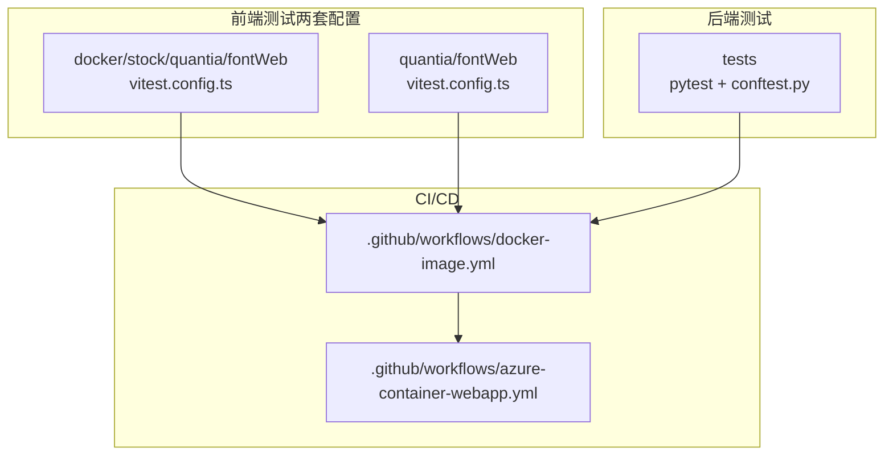
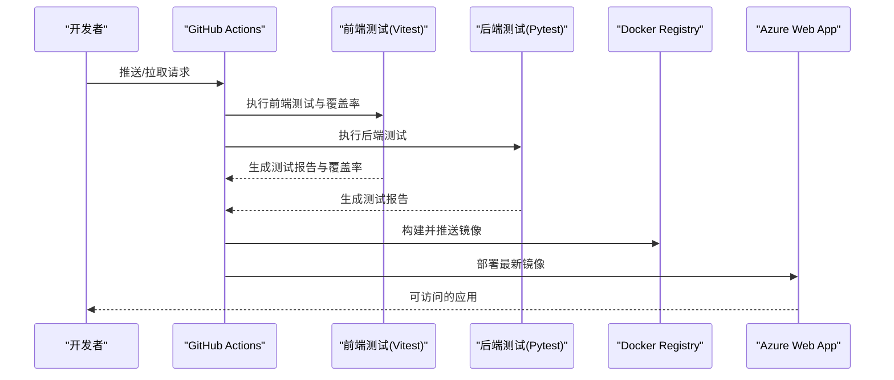
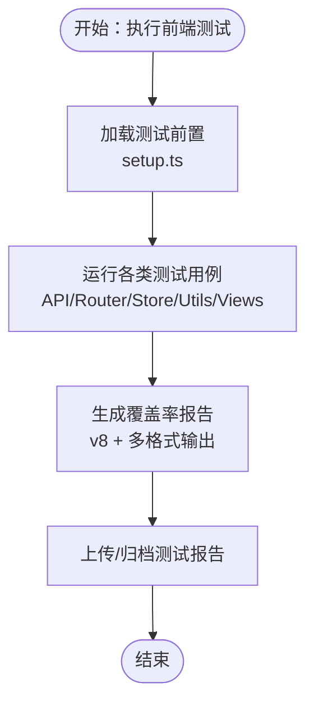
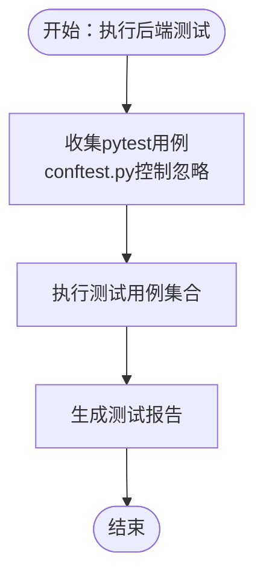
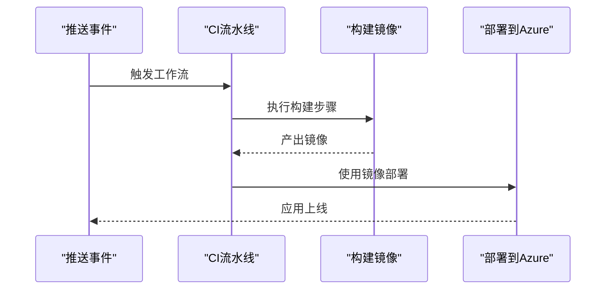
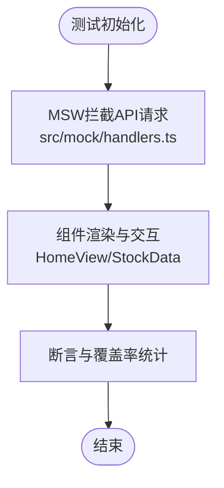
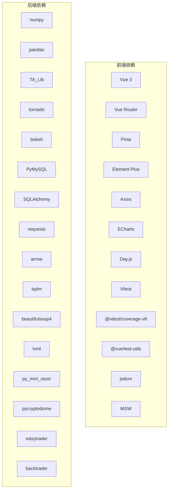

# 测试自动化

<cite>
**本文引用的文件**
- [.github/workflows/docker-image.yml](file://.github/workflows/docker-image.yml)
- [.github/workflows/azure-container-webapp.yml](file://.github/workflows/azure-container-webapp.yml)
- [docker/stock/quantia/fontWeb/vitest.config.ts](file://docker/stock/quantia/fontWeb/vitest.config.ts)
- [docker/stock/quantia/fontWeb/package.json](file://docker/stock/quantia/fontWeb/package.json)
- [docker/stock/quantia/fontWeb/tests/setup.ts](file://docker/stock/quantia/fontWeb/tests/setup.ts)
- [docker/stock/quantia/fontWeb/tests/api/handlers.test.ts](file://docker/stock/quantia/fontWeb/tests/api/handlers.test.ts)
- [docker/stock/quantia/fontWeb/tests/router/index.test.ts](file://docker/stock/quantia/fontWeb/tests/router/index.test.ts)
- [docker/stock/quantia/fontWeb/tests/stores/stock.test.ts](file://docker/stock/quantia/fontWeb/tests/stores/stock.test.ts)
- [docker/stock/quantia/fontWeb/tests/utils/index.test.ts](file://docker/stock/quantia/fontWeb/tests/utils/index.test.ts)
- [docker/stock/quantia/fontWeb/tests/views/HomeView.test.ts](file://docker/stock/quantia/fontWeb/tests/views/HomeView.test.ts)
- [docker/stock/quantia/fontWeb/tests/views/StockData.test.ts](file://docker/stock/quantia/fontWeb/tests/views/StockData.test.ts)
- [docker/stock/quantia/fontWeb/src/api/index.ts](file://docker/stock/quantia/fontWeb/src/api/index.ts)
- [docker/stock/quantia/fontWeb/src/router/index.ts](file://docker/stock/quantia/fontWeb/src/router/index.ts)
- [docker/stock/quantia/fontWeb/src/stores/stock.ts](file://docker/stock/quantia/fontWeb/src/stores/stock.ts)
- [docker/stock/quantia/fontWeb/src/utils/index.ts](file://docker/stock/quantia/fontWeb/src/utils/index.ts)
- [docker/stock/quantia/fontWeb/src/views/HomeView.vue](file://docker/stock/quantia/fontWeb/src/views/HomeView.vue)
- [docker/stock/quantia/fontWeb/src/views/StockData.vue](file://docker/stock/quantia/fontWeb/src/views/StockData.vue)
- [docker/stock/quantia/fontWeb/src/mock/index.ts](file://docker/stock/quantia/fontWeb/src/mock/index.ts)
- [docker/stock/quantia/fontWeb/src/mock/browser.ts](file://docker/stock/quantia/fontWeb/src/mock/browser.ts)
- [docker/stock/quantia/fontWeb/src/mock/handlers.ts](file://docker/stock/quantia/fontWeb/src/mock/handlers.ts)
- [docker/stock/quantia/fontWeb/src/mock/stockData.ts](file://docker/stock/quantia/fontWeb/src/mock/stockData.ts)
- [docker/stock/quantia/fontWeb/README.md](file://docker/stock/quantia/fontWeb/README.md)
- [quantia/fontWeb/vitest.config.ts](file://quantia/fontWeb/vitest.config.ts)
- [quantia/fontWeb/package.json](file://quantia/fontWeb/package.json)
- [quantia/fontWeb/tests/setup.ts](file://quantia/fontWeb/tests/setup.ts)
- [quantia/fontWeb/tests/api/handlers.test.ts](file://quantia/fontWeb/tests/api/handlers.test.ts)
- [quantia/fontWeb/tests/router/index.test.ts](file://quantia/fontWeb/tests/router/index.test.ts)
- [quantia/fontWeb/tests/stores/stock.test.ts](file://quantia/fontWeb/tests/stores/stock.test.ts)
- [quantia/fontWeb/tests/utils/index.test.ts](file://quantia/fontWeb/tests/utils/index.test.ts)
- [quantia/fontWeb/tests/views/HomeView.test.ts](file://quantia/fontWeb/tests/views/HomeView.test.ts)
- [quantia/fontWeb/tests/views/StockData.test.ts](file://quantia/fontWeb/tests/views/StockData.test.ts)
- [quantia/fontWeb/src/api/index.ts](file://quantia/fontWeb/src/api/index.ts)
- [quantia/fontWeb/src/router/index.ts](file://quantia/fontWeb/src/router/index.ts)
- [quantia/fontWeb/src/stores/stock.ts](file://quantia/fontWeb/src/stores/stock.ts)
- [quantia/fontWeb/src/utils/index.ts](file://quantia/fontWeb/src/utils/index.ts)
- [quantia/fontWeb/src/views/HomeView.vue](file://quantia/fontWeb/src/views/HomeView.vue)
- [quantia/fontWeb/src/views/StockData.vue](file://quantia/fontWeb/src/views/StockData.vue)
- [quantia/fontWeb/src/mock/index.ts](file://quantia/fontWeb/src/mock/index.ts)
- [quantia/fontWeb/src/mock/browser.ts](file://quantia/fontWeb/src/mock/browser.ts)
- [quantia/fontWeb/src/mock/handlers.ts](file://quantia/fontWeb/src/mock/handlers.ts)
- [quantia/fontWeb/src/mock/stockData.ts](file://quantia/fontWeb/src/mock/stockData.ts)
- [quantia/fontWeb/README.md](file://quantia/fontWeb/README.md)
- [tests/conftest.py](file://tests/conftest.py)
- [tests/test_backtest_dashboard_date_range.py](file://tests/test_backtest_dashboard_date_range.py)
- [tests/test_backtest_integrity.py](file://tests/test_backtest_integrity.py)
- [tests/test_backtest_trade_pairs_date_format.py](file://tests/test_backtest_trade_pairs_date_format.py)
- [tests/test_bugfixes.py](file://tests/test_bugfixes.py)
- [tests/test_data_fixes.py](file://tests/test_data_fixes.py)
- [tests/test_data_source_consistency.py](file://tests/test_data_source_consistency.py)
- [tests/test_db.py](file://tests/test_db.py)
- [tests/test_gpt_value_pipeline.py](file://tests/test_gpt_value_pipeline.py)
- [tests/test_pagination.py](file://tests/test_pagination.py)
- [tests/test_round3_fixes.py](file://tests/test_round3_fixes.py)
- [tests/test_sector_api.py](file://tests/test_sector_api.py)
- [tests/test_strategy_bugs.py](file://tests/test_strategy_bugs.py)
- [tests/test_strategy_mapping.py](file://tests/test_strategy_mapping.py)
- [requirements.txt](file://requirements.txt)
</cite>

## 目录
1. [引言](#引言)
2. [项目结构](#项目结构)
3. [核心组件](#核心组件)
4. [架构总览](#架构总览)
5. [详细组件分析](#详细组件分析)
6. [依赖分析](#依赖分析)
7. [性能考虑](#性能考虑)
8. [故障排查指南](#故障排查指南)
9. [结论](#结论)
10. [附录](#附录)

## 引言
本文件面向Quantia项目的测试自动化体系，围绕前端Vue应用与后端Python模块的测试流程进行系统化梳理，重点覆盖以下方面：
- 持续集成配置：GitHub Actions流水线如何触发镜像构建与部署。
- 自动化测试执行：前端Vitest测试配置、测试脚本与Mock策略；后端pytest配置与忽略规则。
- 测试报告生成：覆盖率与报告输出格式。
- 测试环境与数据准备：测试前置初始化、Mock服务与数据库连接策略。
- 错误自动重试与稳定性保障：测试执行策略与失败重试建议。
- 覆盖率监控、性能回归检测与安全扫描的自动化方案建议。
- 测试调度机制与最佳实践，确保测试效率与质量持续改进。

## 项目结构
项目采用多模块并行的测试布局：
- 前端测试位于两个位置（docker/stock/quantia/fontWeb与quantia/fontWeb），均使用Vitest作为测试运行器，配置了覆盖率与报告输出。
- 后端测试位于根目录tests，使用pytest，通过conftest.py控制收集行为与忽略列表。
- 持续集成由GitHub Actions工作流负责，分别完成Docker镜像构建与Azure Web应用部署。

图表来源
- [.github/workflows/docker-image.yml](file://.github/workflows/docker-image.yml#L1-L19)
- [.github/workflows/azure-container-webapp.yml](file://.github/workflows/azure-container-webapp.yml#L1-L87)
- [docker/stock/quantia/fontWeb/vitest.config.ts](file://docker/stock/quantia/fontWeb/vitest.config.ts#L1-L28)
- [quantia/fontWeb/vitest.config.ts](file://quantia/fontWeb/vitest.config.ts#L1-L28)
- [tests/conftest.py](file://tests/conftest.py#L1-L18)

章节来源
- [docker/stock/quantia/fontWeb/vitest.config.ts](file://docker/stock/quantia/fontWeb/vitest.config.ts#L1-L28)
- [quantia/fontWeb/vitest.config.ts](file://quantia/fontWeb/vitest.config.ts#L1-L28)
- [tests/conftest.py](file://tests/conftest.py#L1-L18)
- [.github/workflows/docker-image.yml](file://.github/workflows/docker-image.yml#L1-L19)
- [.github/workflows/azure-container-webapp.yml](file://.github/workflows/azure-container-webapp.yml#L1-L87)

## 核心组件
- 前端测试运行器与配置
  - Vitest配置启用全局测试上下文、jsdom环境、包含规则、覆盖率与报告格式、测试前置脚本等。
  - 两套前端配置文件（docker/stock/quantia/fontWeb与quantia/fontWeb）保持一致，确保开发与打包环境一致性。
- 前端Mock与测试环境初始化
  - setup.ts统一注册Pinia、Element Plus、图标组件，模拟window.matchMedia与ResizeObserver，减少浏览器环境差异带来的不稳定。
  - MSW（Mock Service Worker）配置于package.json的msw字段，支持静态资源目录白名单。
- 后端测试运行器与配置
  - pytest通过conftest.py显式忽略部分脚本风格的验证脚本，避免pytest收集阶段产生副作用。
- 持续集成与部署
  - docker-image.yml：在推送与拉取请求时触发，构建Docker镜像。
  - azure-container-webapp.yml：基于docker-image.yml产物部署至Azure Web应用，包含认证与标签策略。

章节来源
- [docker/stock/quantia/fontWeb/vitest.config.ts](file://docker/stock/quantia/fontWeb/vitest.config.ts#L5-L27)
- [quantia/fontWeb/vitest.config.ts](file://quantia/fontWeb/vitest.config.ts#L5-L27)
- [docker/stock/quantia/fontWeb/tests/setup.ts](file://docker/stock/quantia/fontWeb/tests/setup.ts#L1-L41)
- [quantia/fontWeb/tests/setup.ts](file://quantia/fontWeb/tests/setup.ts#L1-L41)
- [docker/stock/quantia/fontWeb/package.json](file://docker/stock/quantia/fontWeb/package.json#L39-L43)
- [quantia/fontWeb/package.json](file://quantia/fontWeb/package.json#L39-L43)
- [tests/conftest.py](file://tests/conftest.py#L11-L17)
- [.github/workflows/docker-image.yml](file://.github/workflows/docker-image.yml#L3-L18)
- [.github/workflows/azure-container-webapp.yml](file://.github/workflows/azure-container-webapp.yml#L32-L86)

## 架构总览
下图展示从代码提交到测试执行与部署的整体流程，以及前端测试与后端测试在CI中的角色分工。

图表来源
- [.github/workflows/docker-image.yml](file://.github/workflows/docker-image.yml#L3-L18)
- [.github/workflows/azure-container-webapp.yml](file://.github/workflows/azure-container-webapp.yml#L40-L86)
- [docker/stock/quantia/fontWeb/vitest.config.ts](file://docker/stock/quantia/fontWeb/vitest.config.ts#L11-L19)
- [quantia/fontWeb/vitest.config.ts](file://quantia/fontWeb/vitest.config.ts#L11-L19)
- [tests/conftest.py](file://tests/conftest.py#L11-L17)

## 详细组件分析

### 前端测试配置与执行
- 测试运行器与环境
  - Vitest启用全局测试上下文与jsdom环境，适配Vue组件与路由、状态管理等前端特性。
  - 包含规则覆盖src与tests目录下的测试文件，便于按功能模块分层组织。
- 覆盖率与报告
  - 使用v8提供程序，输出文本、JSON与HTML三种报告，便于本地查看与CI集成。
  - 排除node_modules、mock目录与类型声明文件，聚焦业务代码覆盖率。
- 测试前置与Mock
  - setup.ts统一注册Pinia与Element Plus，注册全部图标组件，避免组件缺失导致的渲染问题。
  - 模拟window.matchMedia与ResizeObserver，降低第三方库对真实DOM的依赖。
  - MSW worker目录指向public，结合src/mock目录提供API层Mock能力。
- 测试脚本示例
  - API层测试：验证接口调用与响应格式。
  - 路由测试：验证路由跳转与参数传递。
  - Store测试：验证状态变更与派生逻辑。
  - Utils测试：验证工具函数正确性。
  - Views测试：验证视图组件渲染与交互。

图表来源
- [docker/stock/quantia/fontWeb/vitest.config.ts](file://docker/stock/quantia/fontWeb/vitest.config.ts#L7-L21)
- [docker/stock/quantia/fontWeb/tests/setup.ts](file://docker/stock/quantia/fontWeb/tests/setup.ts#L8-L40)
- [docker/stock/quantia/fontWeb/package.json](file://docker/stock/quantia/fontWeb/package.json#L39-L43)

章节来源
- [docker/stock/quantia/fontWeb/vitest.config.ts](file://docker/stock/quantia/fontWeb/vitest.config.ts#L5-L27)
- [quantia/fontWeb/vitest.config.ts](file://quantia/fontWeb/vitest.config.ts#L5-L27)
- [docker/stock/quantia/fontWeb/tests/setup.ts](file://docker/stock/quantia/fontWeb/tests/setup.ts#L1-L41)
- [quantia/fontWeb/tests/setup.ts](file://quantia/fontWeb/tests/setup.ts#L1-L41)
- [docker/stock/quantia/fontWeb/package.json](file://docker/stock/quantia/fontWeb/package.json#L39-L43)
- [quantia/fontWeb/package.json](file://quantia/fontWeb/package.json#L39-L43)

### 后端测试配置与执行
- 收集与忽略策略
  - conftest.py明确忽略若干脚本风格的验证脚本，确保pytest稳定快速地收集单元测试。
- 测试覆盖范围
  - 包含回测仪表盘日期范围、完整性、交易对日期格式、数据库一致性、GPT价值管线、分页、Sector API、策略相关等测试用例，体现业务关键路径验证。
- 依赖与环境
  - requirements.txt列出Python核心依赖，涵盖数据处理、Web框架、数据库、网络请求、解析库、加密、回测等模块，支撑测试执行。

图表来源
- [tests/conftest.py](file://tests/conftest.py#L11-L17)
- [tests/test_backtest_dashboard_date_range.py](file://tests/test_backtest_dashboard_date_range.py#L1-L50)
- [tests/test_backtest_integrity.py](file://tests/test_backtest_integrity.py#L1-L50)
- [tests/test_backtest_trade_pairs_date_format.py](file://tests/test_backtest_trade_pairs_date_format.py#L1-L50)
- [tests/test_db.py](file://tests/test_db.py#L1-L50)
- [tests/test_gpt_value_pipeline.py](file://tests/test_gpt_value_pipeline.py#L1-L50)
- [requirements.txt](file://requirements.txt#L1-L41)

章节来源
- [tests/conftest.py](file://tests/conftest.py#L1-L18)
- [tests/test_backtest_dashboard_date_range.py](file://tests/test_backtest_dashboard_date_range.py#L1-L50)
- [tests/test_backtest_integrity.py](file://tests/test_backtest_integrity.py#L1-L50)
- [tests/test_backtest_trade_pairs_date_format.py](file://tests/test_backtest_trade_pairs_date_format.py#L1-L50)
- [tests/test_db.py](file://tests/test_db.py#L1-L50)
- [tests/test_gpt_value_pipeline.py](file://tests/test_gpt_value_pipeline.py#L1-L50)
- [requirements.txt](file://requirements.txt#L1-L41)

### 持续集成与部署
- Docker镜像构建
  - 触发条件：推送与拉取请求至master分支。
  - 执行步骤：检出代码、构建镜像并打上时间戳标签。
- Azure Web应用部署
  - 依赖上游构建作业产出的镜像，使用GitHub Secret进行认证。
  - 部署标签采用仓库名与提交SHA组合，确保版本可追溯。

图表来源
- [.github/workflows/docker-image.yml](file://.github/workflows/docker-image.yml#L3-L18)
- [.github/workflows/azure-container-webapp.yml](file://.github/workflows/azure-container-webapp.yml#L40-L86)

章节来源
- [.github/workflows/docker-image.yml](file://.github/workflows/docker-image.yml#L1-L19)
- [.github/workflows/azure-container-webapp.yml](file://.github/workflows/azure-container-webapp.yml#L1-L87)

### 测试数据与环境准备
- 前端Mock策略
  - MSW worker目录配置于public，结合src/mock目录提供API层Mock，支持浏览器端拦截与响应。
  - 示例Mock处理器与股票数据Mock，便于在无后端环境下稳定运行UI测试。
- 后端测试数据
  - 通过pytest用例与conftest.py控制的收集范围，确保测试数据与业务逻辑验证分离。
  - 数据库一致性与完整性测试覆盖关键路径，保障数据质量。

图表来源
- [docker/stock/quantia/fontWeb/package.json](file://docker/stock/quantia/fontWeb/package.json#L39-L43)
- [docker/stock/quantia/fontWeb/src/mock/handlers.ts](file://docker/stock/quantia/fontWeb/src/mock/handlers.ts#L1-L50)
- [docker/stock/quantia/fontWeb/src/mock/stockData.ts](file://docker/stock/quantia/fontWeb/src/mock/stockData.ts#L1-L50)
- [docker/stock/quantia/fontWeb/src/views/HomeView.vue](file://docker/stock/quantia/fontWeb/src/views/HomeView.vue#L1-L100)
- [docker/stock/quantia/fontWeb/src/views/StockData.vue](file://docker/stock/quantia/fontWeb/src/views/StockData.vue#L1-L100)

章节来源
- [docker/stock/quantia/fontWeb/package.json](file://docker/stock/quantia/fontWeb/package.json#L39-L43)
- [docker/stock/quantia/fontWeb/src/mock/handlers.ts](file://docker/stock/quantia/fontWeb/src/mock/handlers.ts#L1-L50)
- [docker/stock/quantia/fontWeb/src/mock/stockData.ts](file://docker/stock/quantia/fontWeb/src/mock/stockData.ts#L1-L50)
- [docker/stock/quantia/fontWeb/src/views/HomeView.vue](file://docker/stock/quantia/fontWeb/src/views/HomeView.vue#L1-L100)
- [docker/stock/quantia/fontWeb/src/views/StockData.vue](file://docker/stock/quantia/fontWeb/src/views/StockData.vue#L1-L100)

### 测试脚本编写规范与调度机制
- 前端测试规范
  - 统一使用Vitest，按功能模块划分测试文件（api、router、stores、utils、views），便于维护与定位问题。
  - 使用setup.ts集中初始化，确保测试环境一致性。
- 后端测试规范
  - 使用pytest，通过conftest.py控制收集范围，避免脚本风格验证脚本被误收集。
- 调度机制
  - CI中通过GitHub Actions工作流统一调度前后端测试，构建完成后自动部署，形成闭环。

章节来源
- [docker/stock/quantia/fontWeb/vitest.config.ts](file://docker/stock/quantia/fontWeb/vitest.config.ts#L10-L20)
- [quantia/fontWeb/vitest.config.ts](file://quantia/fontWeb/vitest.config.ts#L10-L20)
- [tests/conftest.py](file://tests/conftest.py#L11-L17)
- [.github/workflows/docker-image.yml](file://.github/workflows/docker-image.yml#L3-L18)
- [.github/workflows/azure-container-webapp.yml](file://.github/workflows/azure-container-webapp.yml#L40-L86)

### 错误自动重试策略
- 建议策略
  - 前端测试：对网络类不稳定因素（如Mock服务偶发超时）增加重试次数与超时阈值。
  - 后端测试：对数据库连接与外部接口请求增加指数退避重试，避免瞬时故障影响整体结果。
  - CI层面：对偶发性失败的测试用例在允许范围内进行单次重试，减少误报。
- 注意事项
  - 重试应配合日志与报告增强，确保失败原因可追踪。
  - 对确定性失败（如断言错误）不应重试，以免掩盖真实问题。

[本节为通用建议，不直接分析具体文件，故无章节来源]

### 覆盖率监控、性能回归检测与安全扫描自动化方案
- 覆盖率监控
  - 前端：Vitest已配置v8提供程序与多格式报告，建议在CI中上传HTML报告并与平台集成，形成趋势图。
  - 后端：pytest可通过cov插件生成覆盖率报告，建议设定阈值门禁，未达标则阻断合并。
- 性能回归检测
  - 前端：对关键组件渲染与交互操作添加基准测试，记录耗时并对比历史基线。
  - 后端：对数据抓取、指标计算与回测引擎的关键路径添加基准测试，监控执行时间。
- 安全扫描
  - 依赖扫描：使用pip-audit或类似工具扫描Python依赖安全漏洞。
  - 代码扫描：前端可引入ESLint规则与安全检查，后端可使用bandit等工具扫描常见安全问题。
  - 容器镜像扫描：在CI中集成镜像安全扫描（如Clair或Trivy），确保镜像层安全。

[本节为通用建议，不直接分析具体文件，故无章节来源]

## 依赖分析
- 前端依赖
  - Vue 3、Vue Router、Pinia、Element Plus、Axios、ECharts、Day.js等，支撑组件化UI与状态管理。
  - Vitest、@vitest/ui、@vitest/coverage-v8、@vue/test-utils、jsdom、MSW等，支撑测试与Mock。
- 后端依赖
  - numpy、pandas、TA_Lib、tornado、bokeh、PyMySQL、SQLAlchemy、requests、arrow、tqdm、beautifulsoup4、lxml、py_mini_racer、pycryptodome、easytrader、backtrader等，支撑数据处理、Web服务、数据库、网络请求、解析、JS引擎、加密、交易与回测。

图表来源
- [docker/stock/quantia/fontWeb/package.json](file://docker/stock/quantia/fontWeb/package.json#L15-L38)
- [requirements.txt](file://requirements.txt#L4-L41)

章节来源
- [docker/stock/quantia/fontWeb/package.json](file://docker/stock/quantia/fontWeb/package.json#L1-L44)
- [requirements.txt](file://requirements.txt#L1-L41)

## 性能考虑
- 前端测试
  - 使用jsdom环境减少真实浏览器开销；合理拆分测试文件，避免单文件过大导致执行缓慢。
  - 覆盖率报告仅针对业务代码，排除mock与类型声明，提升报告准确性与生成速度。
- 后端测试
  - 通过conftest.py控制收集范围，减少无关脚本对pytest的影响。
  - 对数据库与网络请求使用Mock或最小化依赖，缩短测试执行时间。
- CI优化
  - 并行执行前后端测试任务，充分利用Runner资源。
  - 缓存依赖与构建产物，减少重复下载与编译时间。

[本节提供一般性指导，不直接分析具体文件，故无章节来源]

## 故障排查指南
- 前端测试常见问题
  - 组件渲染异常：检查setup.ts中Element Plus与图标注册是否完整。
  - Mock服务失效：确认MSW worker目录配置与src/mock/handlers.ts定义。
  - 环境变量缺失：检查vitest.config.ts中的include与exclude规则。
- 后端测试常见问题
  - 用例未被收集：检查conftest.py的ignore列表，避免误忽略。
  - 数据库连接失败：核对测试数据库配置与连接字符串。
- CI失败排查
  - 构建镜像失败：检查Dockerfile与依赖安装步骤。
  - 部署失败：核对Azure Web应用的认证凭据与镜像标签。

章节来源
- [docker/stock/quantia/fontWeb/tests/setup.ts](file://docker/stock/quantia/fontWeb/tests/setup.ts#L12-L18)
- [docker/stock/quantia/fontWeb/package.json](file://docker/stock/quantia/fontWeb/package.json#L39-L43)
- [docker/stock/quantia/fontWeb/vitest.config.ts](file://docker/stock/quantia/fontWeb/vitest.config.ts#L10-L19)
- [tests/conftest.py](file://tests/conftest.py#L11-L17)

## 结论
Quantia的测试自动化体系以Vitest与pytest为核心，结合GitHub Actions实现了从前端到后端的全链路测试与部署。通过统一的测试前置、Mock策略与覆盖率配置，提升了测试稳定性与可维护性。建议在现有基础上进一步完善错误重试、覆盖率门禁、性能回归与安全扫描的自动化方案，持续提升测试效率与质量保障水平。

## 附录
- 前端测试用例示例路径
  - [API测试](file://docker/stock/quantia/fontWeb/tests/api/handlers.test.ts)
  - [路由测试](file://docker/stock/quantia/fontWeb/tests/router/index.test.ts)
  - [Store测试](file://docker/stock/quantia/fontWeb/tests/stores/stock.test.ts)
  - [Utils测试](file://docker/stock/quantia/fontWeb/tests/utils/index.test.ts)
  - [Views测试](file://docker/stock/quantia/fontWeb/tests/views/HomeView.test.ts)
  - [Views测试](file://docker/stock/quantia/fontWeb/tests/views/StockData.test.ts)
- 后端测试用例示例路径
  - [回测仪表盘日期范围](file://tests/test_backtest_dashboard_date_range.py)
  - [回测完整性](file://tests/test_backtest_integrity.py)
  - [交易对日期格式](file://tests/test_backtest_trade_pairs_date_format.py)
  - [数据库一致性](file://tests/test_data_source_consistency.py)
  - [GPT价值管线](file://tests/test_gpt_value_pipeline.py)
  - [分页](file://tests/test_pagination.py)
  - [Sector API](file://tests/test_sector_api.py)
  - [策略相关](file://tests/test_strategy_mapping.py)
- 前端Mock与配置
  - [Mock入口](file://docker/stock/quantia/fontWeb/src/mock/index.ts)
  - [Mock浏览器](file://docker/stock/quantia/fontWeb/src/mock/browser.ts)
  - [Mock处理器](file://docker/stock/quantia/fontWeb/src/mock/handlers.ts)
  - [Mock股票数据](file://docker/stock/quantia/fontWeb/src/mock/stockData.ts)
  - [前端README](file://docker/stock/quantia/fontWeb/README.md)
  - [前端README](file://quantia/fontWeb/README.md)
