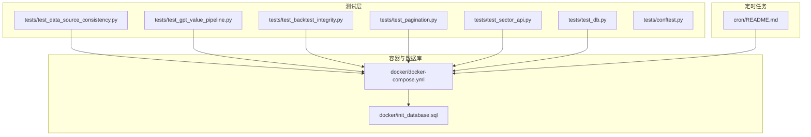
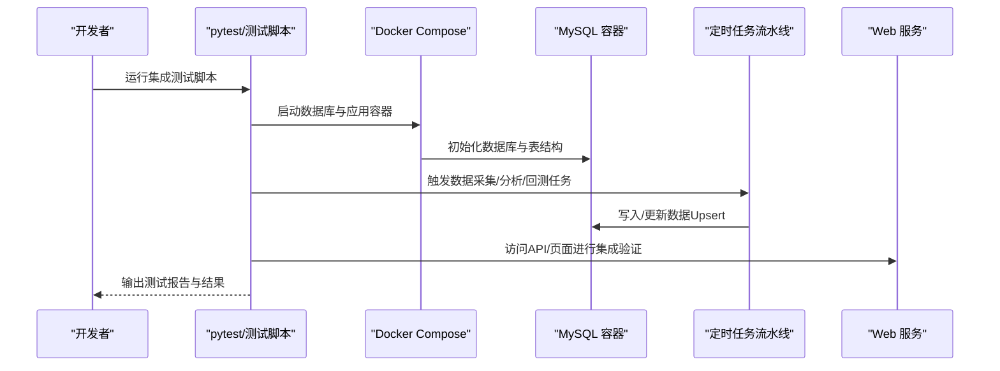
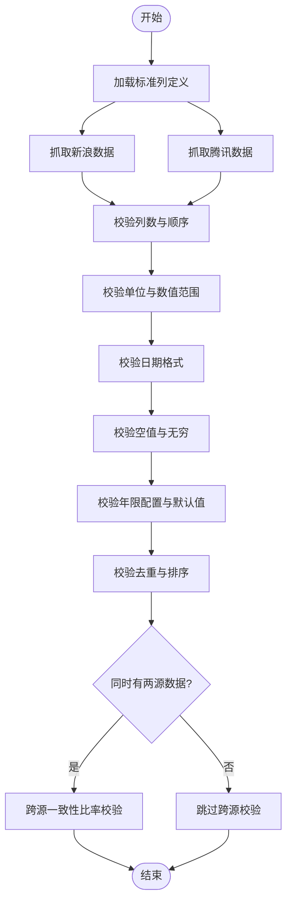
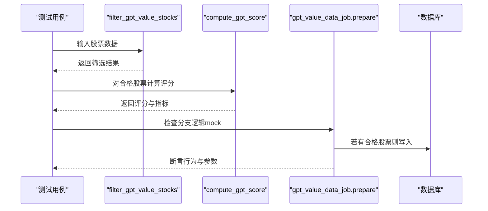
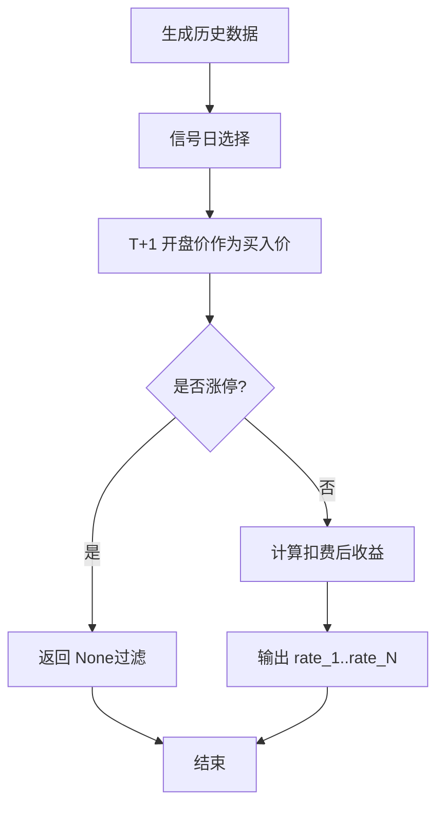
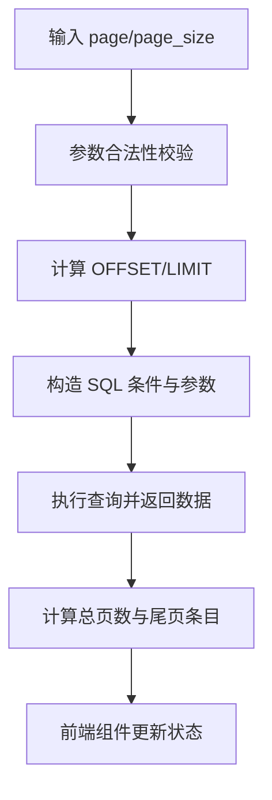
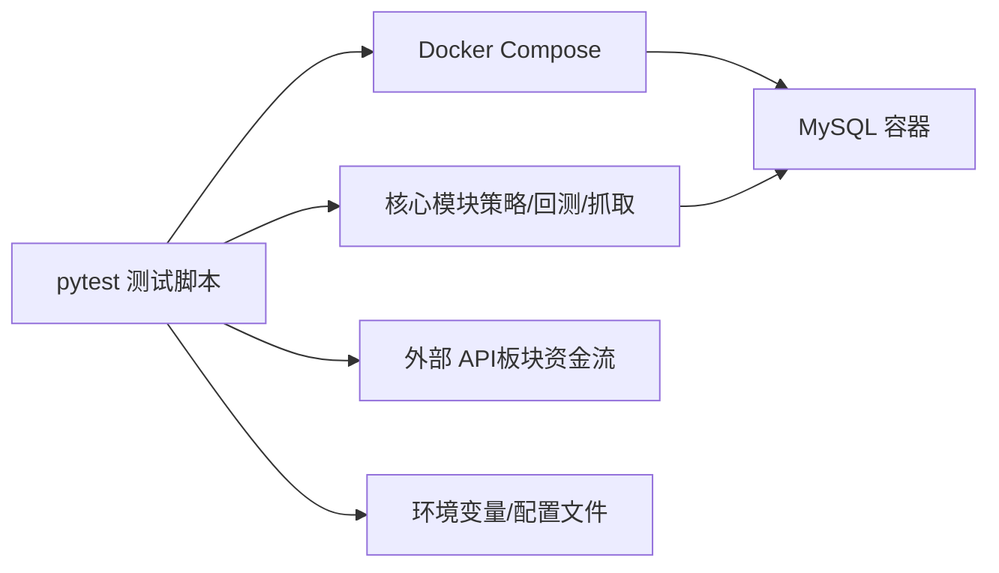

# 集成测试

<cite>
**本文引用的文件**
- [tests/conftest.py](file://tests/conftest.py)
- [tests/test_data_source_consistency.py](file://tests/test_data_source_consistency.py)
- [tests/test_db.py](file://tests/test_db.py)
- [tests/test_gpt_value_pipeline.py](file://tests/test_gpt_value_pipeline.py)
- [tests/test_backtest_integrity.py](file://tests/test_backtest_integrity.py)
- [tests/test_pagination.py](file://tests/test_pagination.py)
- [tests/test_sector_api.py](file://tests/test_sector_api.py)
- [docker/docker-compose.yml](file://docker/docker-compose.yml)
- [docker/init_database.sql](file://docker/init_database.sql)
- [cron/README.md](file://cron/README.md)
</cite>

## 目录
1. [引言](#引言)
2. [项目结构](#项目结构)
3. [核心组件](#核心组件)
4. [架构总览](#架构总览)
5. [详细组件分析](#详细组件分析)
6. [依赖分析](#依赖分析)
7. [性能考虑](#性能考虑)
8. [故障排查指南](#故障排查指南)
9. [结论](#结论)
10. [附录](#附录)

## 引言
本技术文档围绕 Quantia 的集成测试体系，系统阐述多模块协同测试策略与实施方法，覆盖数据源一致性测试、API 接口测试、数据管道测试、数据库连接测试、Web 服务集成测试、定时任务测试、跨模块数据流转验证、外部服务依赖测试、配置文件加载测试，并提供集成测试环境搭建、测试数据管理与并发测试处理方案，确保各组件间协调一致与系统整体稳定性。

## 项目结构
Quantia 的测试与集成测试相关文件主要分布在 tests 目录与 docker 目录，配合 cron 文档描述定时任务流水线，形成“测试脚本 + 容器编排 + 数据库初始化 + 定时任务”的完整集成测试支撑体系。

图表来源
- [docker/docker-compose.yml](file://docker/docker-compose.yml#L1-L87)
- [docker/init_database.sql](file://docker/init_database.sql#L1-L455)
- [tests/test_data_source_consistency.py](file://tests/test_data_source_consistency.py#L1-L324)
- [tests/test_gpt_value_pipeline.py](file://tests/test_gpt_value_pipeline.py#L1-L460)
- [tests/test_backtest_integrity.py](file://tests/test_backtest_integrity.py#L1-L430)
- [tests/test_pagination.py](file://tests/test_pagination.py#L1-L1012)
- [tests/test_sector_api.py](file://tests/test_sector_api.py#L1-L136)
- [tests/test_db.py](file://tests/test_db.py#L1-L27)
- [tests/conftest.py](file://tests/conftest.py#L1-L18)
- [cron/README.md](file://cron/README.md#L1-L332)

章节来源
- [docker/docker-compose.yml](file://docker/docker-compose.yml#L1-L87)
- [docker/init_database.sql](file://docker/init_database.sql#L1-L455)
- [tests/conftest.py](file://tests/conftest.py#L1-L18)

## 核心组件
- 数据源一致性测试：验证多数据源（新浪、腾讯等）返回格式、单位、日期格式、空值处理、年限配置与增量更新去重排序的一致性。
- GPT 综合选股流水线测试：验证筛选逻辑、评分范围、表结构一致性、边界条件与历史补跑能力。
- 回测系统完整性测试：验证未来函数修正、交易成本、涨跌停过滤、收益率计算、参数敏感性与模块一致性。
- 服务端分页测试：验证分页参数、尾页、关键词搜索、SQL 构建、前端组件逻辑与 Docker 文件同步一致性。
- 外部服务依赖测试：验证板块资金流向等外部 API 的可用性与返回结构。
- 数据库连接测试：验证数据库连通性与版本信息。
- 定时任务测试：基于 cron 文档理解任务阶段、异常恢复与补跑机制，指导集成测试中的任务编排与数据一致性验证。

章节来源
- [tests/test_data_source_consistency.py](file://tests/test_data_source_consistency.py#L1-L324)
- [tests/test_gpt_value_pipeline.py](file://tests/test_gpt_value_pipeline.py#L1-L460)
- [tests/test_backtest_integrity.py](file://tests/test_backtest_integrity.py#L1-L430)
- [tests/test_pagination.py](file://tests/test_pagination.py#L1-L1012)
- [tests/test_sector_api.py](file://tests/test_sector_api.py#L1-L136)
- [tests/test_db.py](file://tests/test_db.py#L1-L27)
- [cron/README.md](file://cron/README.md#L1-L332)

## 架构总览
集成测试围绕“容器化环境 + 数据库初始化 + 定时任务流水线 + 多维度测试脚本”展开，形成端到端的数据采集、处理、分析与回测闭环验证。

图表来源
- [docker/docker-compose.yml](file://docker/docker-compose.yml#L1-L87)
- [docker/init_database.sql](file://docker/init_database.sql#L1-L455)
- [cron/README.md](file://cron/README.md#L1-L332)

## 详细组件分析

### 数据源一致性测试
目标：验证多数据源返回格式、单位、日期格式、空值处理、年限配置与增量更新逻辑的一致性与正确性。

- 列格式与顺序：以标准表结构定义为基准，校验各数据源返回列数与顺序一致。
- 单位规范：volume 以“手”为单位、amount 以“元”为单位，数值范围符合预期。
- 日期格式：统一为“YYYY-MM-DD”，避免解析错误。
- 空值与无穷：确保无 NaN/Inf，保障下游计算稳定。
- 年限配置：支持通过环境变量覆盖默认历史年数，验证与工具链默认值一致。
- 增量更新：去重保留新数据、排序确保日期连续、边界日期过滤不遗漏。
- 跨数据源一致性：在同时获取新浪与腾讯数据时，对 volume、amount、close 的差异进行容忍度校验。

图表来源
- [tests/test_data_source_consistency.py](file://tests/test_data_source_consistency.py#L1-L324)

章节来源
- [tests/test_data_source_consistency.py](file://tests/test_data_source_consistency.py#L1-L324)

### GPT 综合选股流水线测试
目标：验证筛选逻辑、评分范围、表结构一致性、边界条件与历史补跑能力。

- 筛选逻辑：合格/不合格股票的判定、空输入与 None 输入的处理、评分列与指标字段的完整性。
- 评分范围：评分应在 0~100 之间，完美股票评分高于一般水平。
- 表结构一致性：GPT 指标字段与目标表列定义一致，包含基础字段与回测字段。
- 边界测试：资产负债率、ROE、PE、NaN/None 等边界条件的软/硬约束验证。
- 准备逻辑：prepare() 在不同分支（无数据、源表缺失、全部被筛掉、有合格股票）的行为验证，结合 mock 避免真实数据库写入。
- 历史补跑：针对 low_atr 等策略修复，验证历史数据补跑与阈值修正。

图表来源
- [tests/test_gpt_value_pipeline.py](file://tests/test_gpt_value_pipeline.py#L1-L460)

章节来源
- [tests/test_gpt_value_pipeline.py](file://tests/test_gpt_value_pipeline.py#L1-L460)

### 回测系统完整性测试
目标：验证回测系统六大核心规则：数据准备、策略逻辑、模拟规则、绩效评估、稳健性与工具集成。

- 未来函数修正：买入价使用 T+1 开盘价，而非 T 日收盘价；涨停过滤与隔夜收益区分。
- 交易成本：佣金、印花税、滑点与总成本参数合理性，扣费后收益严格低于原始收益。
- 收益率计算：rate_1..rate_N 的语义与数量一致性，基于 T+1 开盘价的相对收益计算。
- 模块一致性：Web 层与核心层常量导入一致性。
- 幸存者偏差：策略表中记录的信号日代码（可能已退市）仍可从缓存回测。
- 复权处理：缓存文件路径包含 qfq 标识，fetch 默认使用前复权。

图表来源
- [tests/test_backtest_integrity.py](file://tests/test_backtest_integrity.py#L1-L430)

章节来源
- [tests/test_backtest_integrity.py](file://tests/test_backtest_integrity.py#L1-L430)

### 服务端分页测试
目标：验证分页参数、尾页、关键词搜索、SQL 构建、前端组件逻辑与 Docker 文件同步一致性。

- 分页参数：page/page_size 的边界与限制（最小为 1、最大为 500），OFFSET/LIMIT 计算正确。
- 尾页逻辑：总页数与尾页剩余条目数量计算正确。
- SQL 构建：WHERE 条件组合（date + keyword）、LIKE 参数拼接与空 keyword 处理。
- 前端逻辑：分页组件状态与服务端总数绑定、翻页/切换页大小/搜索/日期变更触发数据重新加载。
- Docker 同步：分页相关前后端与后端文件在主版本与 Docker 版本中保持一致，dist 目录文件数量一致。

图表来源
- [tests/test_pagination.py](file://tests/test_pagination.py#L1-L1012)

章节来源
- [tests/test_pagination.py](file://tests/test_pagination.py#L1-L1012)

### 外部服务依赖测试
目标：验证板块资金流向等外部 API 的可用性与返回结构。

- 行业/概念资金流向：datacenter-web 与 push2 HTTPS 接口的可用性与数据条目数量。
- 个股资金流与实时行情：接口返回 total 与 diff 数量，字段结构符合预期。
- 重试与超时：接口设置合理超时，失败时输出错误信息便于定位。

章节来源
- [tests/test_sector_api.py](file://tests/test_sector_api.py#L1-L136)

### 数据库连接测试
目标：验证数据库连通性与版本信息。

- 使用 pymysql 建立连接，设置字符集，查询数据库版本号，捕获异常并关闭连接。
- 适用于本地或远程数据库连通性验证。

章节来源
- [tests/test_db.py](file://tests/test_db.py#L1-L27)

### 定时任务测试
目标：基于 cron 文档理解任务阶段、异常恢复与补跑机制，指导集成测试中的任务编排与数据一致性验证。

- 任务概览：每小时、工作日完整流水线、仅获取、仅分析、月度清理。
- 5 阶段流水线：数据获取（API 调用）→ 基础数据入库 → 扩展数据 → 流式分析（指标/K线形态/策略）→ 回测与收尾。
- 异常恢复：Upsert 写入、重试机制、缓存损坏自动全量重拉、API 失败返回缓存数据。
- 补跑机制：支持日期参数的任务可手动补跑指定日期或区间。
- 锁与并发：flock 排他锁避免并发冲突，拆分模式提升吞吐。

章节来源
- [cron/README.md](file://cron/README.md#L1-L332)

## 依赖分析
- 测试脚本依赖：各测试脚本通过 sys.path 插入项目根路径，导入核心模块（如 tablestructure、strategy、backtest、stockfetch 等）进行验证。
- 容器与数据库：docker-compose 提供 MySQL 与应用容器，init_database.sql 初始化数据库与表结构，确保测试环境一致性。
- 外部依赖：板块资金流向 API 依赖网络与第三方服务，测试脚本中包含超时与异常处理。
- 配置文件：Docker 环境变量（如历史年数、重试次数、端口等）影响测试行为，需在测试前正确设置。

图表来源
- [docker/docker-compose.yml](file://docker/docker-compose.yml#L1-L87)
- [docker/init_database.sql](file://docker/init_database.sql#L1-L455)
- [tests/test_sector_api.py](file://tests/test_sector_api.py#L1-L136)

章节来源
- [docker/docker-compose.yml](file://docker/docker-compose.yml#L1-L87)
- [docker/init_database.sql](file://docker/init_database.sql#L1-L455)
- [tests/test_sector_api.py](file://tests/test_sector_api.py#L1-L136)

## 性能考虑
- 低内存模式：历史 K 线增量更新采用低内存模式，逐只股票处理后释放，避免全量加载内存。
- 缓存策略：gzip 压缩的 pickle 文件，损坏自动全量重拉，减少重复网络请求。
- 并发与锁：flock 排他锁避免并发写入冲突，拆分模式将 API 调用与本地分析解耦。
- 分页与查询：服务端分页限制每页最大条数，避免大结果集导致性能问题。
- 回测优化：流式处理峰值内存小于 100MB，支持按需读取缓存，减少 IO 压力。

## 故障排查指南
- 数据库连接失败：检查主机、端口、用户、密码与数据库名，确认容器健康检查通过。
- 外部 API 失败：检查网络连通性、User-Agent、Referer、超时设置，关注返回消息与状态码。
- 分页异常：核对 page/page_size 边界、LIMIT/OFFSET 计算、WHERE 条件拼接与参数绑定。
- 回测异常：确认 T+1 开盘价使用、涨停过滤逻辑、交易成本参数、缓存文件完整性。
- 定时任务冲突：检查 flock 锁文件是否存在、crontab 配置是否正确、任务执行时间是否重叠。
- Docker 文件不同步：对比主版本与 Docker 版本文件内容与 dist 目录文件数量，确保一致性。

章节来源
- [tests/test_db.py](file://tests/test_db.py#L1-L27)
- [tests/test_sector_api.py](file://tests/test_sector_api.py#L1-L136)
- [tests/test_pagination.py](file://tests/test_pagination.py#L1-L1012)
- [tests/test_backtest_integrity.py](file://tests/test_backtest_integrity.py#L1-L430)
- [cron/README.md](file://cron/README.md#L1-L332)

## 结论
通过多模块协同测试策略，Quantia 的集成测试覆盖了数据源一致性、API 接口、数据管道、数据库连接、Web 服务、定时任务与外部依赖等关键环节。结合容器化环境与数据库初始化脚本，能够稳定复现生产环境行为；基于 cron 文档的流水线理解与补跑机制，进一步增强了测试的鲁棒性与可维护性。建议在持续集成中固定环境变量、定期同步 Docker 文件、对关键 API 增加健康检查与告警，以保障系统整体稳定性。

## 附录
- 集成测试环境搭建步骤
  - 启动容器：使用 docker-compose 启动 MySQL 与应用容器，设置环境变量（如历史年数、重试次数、端口）。
  - 初始化数据库：执行 init_database.sql 创建所需表结构。
  - 运行测试：使用 pytest 运行各测试脚本，必要时设置代理、Cookie 或 trade_client 配置文件。
  - 验证定时任务：在 cron 文档指导下，执行每小时/工作日/月度任务，观察 Upsert 写入与缓存更新。
- 测试数据管理
  - 使用 MockDB 模拟数据库查询，验证分页与 SQL 构建逻辑。
  - 通过环境变量调整历史年数，验证不同数据规模下的行为。
  - 对外部 API 设置超时与重试，记录失败原因以便定位。
- 并发测试处理
  - 使用 flock 排他锁避免并发冲突，拆分模式降低耦合。
  - 对回测与分析任务安排在不同时间窗口，避免资源竞争。
  - 对关键写入操作（Upsert）增加重试与幂等处理，确保数据一致性。
