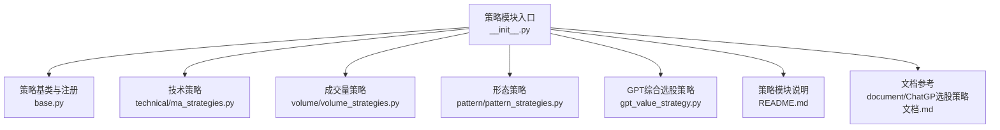
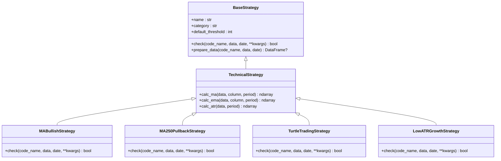
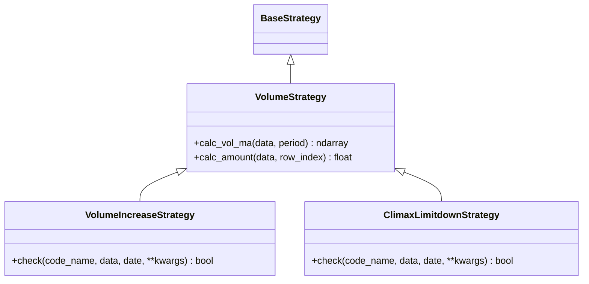
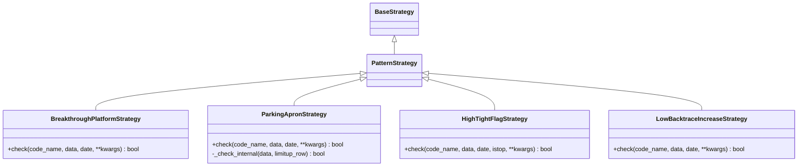
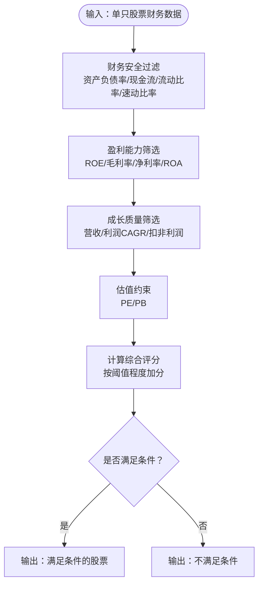
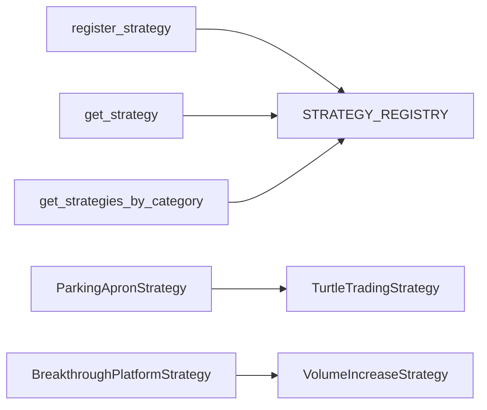

# 策略分类体系

<cite>
**本文引用的文件**
- [策略模块入口](file://quantia/core/strategy/__init__.py)
- [策略基类与注册](file://quantia/core/strategy/base.py)
- [策略模块说明](file://quantia/core/strategy/README.md)
- [均线策略实现](file://quantia/core/strategy/technical/ma_strategies.py)
- [成交量策略实现](file://quantia/core/strategy/volume/volume_strategies.py)
- [形态策略实现](file://quantia/core/strategy/pattern/pattern_strategies.py)
- [GPT综合选股策略](file://quantia/core/strategy/gpt_value_strategy.py)
- [ChatGP选股策略文档](file://quantia/core/strategy/document/ChatGP选股策略文档.md)
- [兼容策略：放量上涨](file://quantia/core/strategy/enter.py)
- [兼容策略：均线多头](file://quantia/core/strategy/keep_increasing.py)
- [兼容策略：回踩年线](file://quantia/core/strategy/backtrace_ma250.py)
- [兼容策略：海龟交易法则](file://quantia/core/strategy/turtle_trade.py)
</cite>

## 目录
1. [引言](#引言)
2. [项目结构](#项目结构)
3. [核心组件](#核心组件)
4. [架构总览](#架构总览)
5. [详细组件分析](#详细组件分析)
6. [依赖分析](#依赖分析)
7. [性能考虑](#性能考虑)
8. [故障排查指南](#故障排查指南)
9. [结论](#结论)
10. [附录](#附录)

## 引言
本文件系统化阐述本项目的策略分类体系，围绕技术策略（technical）、成交量策略（volume）、趋势策略（trend）、形态策略（pattern）及其他策略（other）展开，结合代码实现与文档说明，给出分类依据、典型策略、技术特点、参数配置与适用市场环境，并提供策略选择指南、组合构建方法与性能对比思路，帮助开发者高效构建有效的选股策略组合。

## 项目结构
策略模块采用“按职责分层 + 按类别分包”的组织方式：
- 策略基类与注册中心位于 base.py，提供统一的策略抽象、分类标记与注册机制
- 各类策略分别置于子目录：technical、volume、pattern 等
- README.md 提供策略分类、接口规范与执行流程说明
- 文档目录 document 提供与策略相关的完整说明与参数对照

**图示来源**
- [策略模块入口](file://quantia/core/strategy/__init__.py#L1-L119)
- [策略基类与注册](file://quantia/core/strategy/base.py#L1-L202)
- [策略模块说明](file://quantia/core/strategy/README.md#L1-L146)
- [ChatGP选股策略文档](file://quantia/core/strategy/document/ChatGP选股策略文档.md#L1-L441)

**章节来源**
- [策略模块入口](file://quantia/core/strategy/__init__.py#L1-L119)
- [策略模块说明](file://quantia/core/strategy/README.md#L1-L146)

## 核心组件
- 策略基类与分类
  - BaseStrategy：统一接口与数据准备逻辑
  - TechnicalStrategy/VolumeStrategy/TrendStrategy/PatternStrategy：按分类标记与常用指标计算封装
- 注册与发现
  - register_strategy：装饰器注册策略类
  - get_strategy/get_all_strategies/get_strategies_by_category：按名称或分类检索策略
- 兼容接口
  - 保留旧风格函数式接口，便于迁移与兼容

**章节来源**
- [策略基类与注册](file://quantia/core/strategy/base.py#L20-L202)
- [策略模块入口](file://quantia/core/strategy/__init__.py#L30-L118)

## 架构总览
策略系统以“统一基类 + 分类基类 + 注册中心 + 兼容接口”为核心，形成可扩展、可测试、可回测的策略框架。前端与后端通过统一的策略接口对接，支持批量策略执行与回测。

```mermaid
graph TB
subgraph "策略基类层"
BS["BaseStrategy"]
TS["TechnicalStrategy"]
VS["VolumeStrategy"]
TrS["TrendStrategy"]
PS["PatternStrategy"]
end
subgraph "策略实现层"
MAS["均线策略<br/>MABullishStrategy"]
MAP["回踩年线<br/>MA250PullbackStrategy"]
TTS["海龟交易法则<br/>TurtleTradingStrategy"]
LAS["低ATR成长<br/>LowATRGrowthStrategy"]
VIS["放量上涨<br/>VolumeIncreaseStrategy"]
CLS["放量跌停<br/>ClimaxLimitdownStrategy"]
BTS["突破平台<br/>BreakthroughPlatformStrategy"]
PAS["停机坪<br/>ParkingApronStrategy"]
HTFS["高而窄的旗形<br/>HighTightFlagStrategy"]
LBIS["无大幅回撤<br/>LowBacktraceIncreaseStrategy"]
end
subgraph "注册与发现"
RS["@register_strategy"]
GS["get_strategy"]
GAS["get_all_strategies"]
GSC["get_strategies_by_category"]
end
BS --> TS
BS --> VS
BS --> TrS
BS --> PS
RS --> MAS
RS --> MAP
RS --> TTS
RS --> LAS
RS --> VIS
RS --> CLS
RS --> BTS
RS --> PAS
RS --> HTFS
RS --> LBIS
GS --> MAS
GS --> VIS
GSC --> TS
GSC --> VS
GSC --> PS
```

**图示来源**
- [策略基类与注册](file://quantia/core/strategy/base.py#L20-L202)
- [均线策略实现](file://quantia/core/strategy/technical/ma_strategies.py#L22-L237)
- [成交量策略实现](file://quantia/core/strategy/volume/volume_strategies.py#L19-L126)
- [形态策略实现](file://quantia/core/strategy/pattern/pattern_strategies.py#L22-L276)

## 详细组件分析

### 技术策略（technical）
- 分类依据
  - 基于技术指标与价格行为的策略，强调均线、ATR等指标的计算与应用
- 典型策略
  - 均线多头（MABullishStrategy）：MA30持续上行且涨幅超阈值
  - 回踩年线（MA250PullbackStrategy）：突破250日均线后回踩不破并缩量整理
  - 海龟交易法则（TurtleTradingStrategy）：突破60日新高
  - 低ATR成长（LowATRGrowthStrategy）：低波动稳健上涨
- 技术特点
  - 使用 talib 计算 MA/EMA/ATR 等指标
  - 通过 prepare_data 截取截止日期前的历史数据，保证阈值长度
- 参数配置
  - default_threshold：不同策略设置不同阈值（如30、60、120）
  - ATR比例阈值、均线周期、价格涨幅阈值等
- 适用市场环境
  - 趋势明确、波动相对稳定的震荡或上升市场
- 兼容接口
  - 旧接口函数：check、check_ma250、check_enter、check_low_increase

**图示来源**
- [策略基类与注册](file://quantia/core/strategy/base.py#L20-L124)
- [均线策略实现](file://quantia/core/strategy/technical/ma_strategies.py#L22-L237)

**章节来源**
- [策略基类与注册](file://quantia/core/strategy/base.py#L99-L124)
- [均线策略实现](file://quantia/core/strategy/technical/ma_strategies.py#L22-L237)
- [兼容策略：均线多头](file://quantia/core/strategy/keep_increasing.py#L15-L39)
- [兼容策略：回踩年线](file://quantia/core/strategy/backtrace_ma250.py#L17-L92)
- [兼容策略：海龟交易法则](file://quantia/core/strategy/turtle_trade.py#L14-L38)

### 成交量策略（volume）
- 分类依据
  - 基于成交量与成交额变化的策略，强调放量/缩量与价格配合
- 典型策略
  - 放量上涨（VolumeIncreaseStrategy）：当日放量上涨、成交额达标、量比达标
  - 放量跌停（ClimaxLimitdownStrategy）：跌停且成交量放大
- 技术特点
  - 计算 vol_ma5 作为基准，比较当日量比
  - 成交额门槛与涨跌幅门槛共同限定
- 参数配置
  - default_threshold、量比阈值、成交额门槛、涨跌幅阈值
- 适用市场环境
  - 突发消息驱动、情绪转折、突破/衰竭阶段
- 兼容接口
  - 旧接口函数：check_volume、check

**图示来源**
- [策略基类与注册](file://quantia/core/strategy/base.py#L126-L143)
- [成交量策略实现](file://quantia/core/strategy/volume/volume_strategies.py#L19-L126)

**章节来源**
- [策略基类与注册](file://quantia/core/strategy/base.py#L126-L143)
- [成交量策略实现](file://quantia/core/strategy/volume/volume_strategies.py#L19-L126)
- [兼容策略：放量上涨](file://quantia/core/strategy/enter.py#L16-L61)

### 形态策略（pattern）
- 分类依据
  - 基于K线形态与平台整理的策略，强调突破、整理与后续确认
- 典型策略
  - 突破平台（BreakthroughPlatformStrategy）：在60日均线附近整理后放量突破
  - 停机坪（ParkingApronStrategy）：涨停后横盘整理，随后温和启动
  - 高而窄的旗形（HighTightFlagStrategy）：短期快速上涨后窄幅整理，机构参与
  - 无大幅回撤（LowBacktraceIncreaseStrategy）：60日稳健上涨，回撤幅度受控
- 技术特点
  - 多策略组合使用：如突破平台结合放量上涨；停机坪结合海龟交易确认
  - 时间窗口与幅度约束，避免“假突破”
- 参数配置
  - default_threshold、幅度阈值、量比阈值、整理天数范围
- 适用市场环境
  - 整理充分、量价配合良好的阶段性启动
- 兼容接口
  - 旧接口函数：check_breakthrough、check_parking、check_high_tight、check_low_backtrace

**图示来源**
- [策略基类与注册](file://quantia/core/strategy/base.py#L150-L153)
- [形态策略实现](file://quantia/core/strategy/pattern/pattern_strategies.py#L22-L276)

**章节来源**
- [策略基类与注册](file://quantia/core/strategy/base.py#L150-L153)
- [形态策略实现](file://quantia/core/strategy/pattern/pattern_strategies.py#L22-L276)

### 其他策略（other）
- 分类依据
  - 未归入 technical/volume/pattern 的策略，或作为补充策略存在
- 典型策略
  - GPT综合选股策略（fundamental）：基于财务指标的五层过滤与评分
- 技术特点
  - 使用 cn_stock_selection 表的财务数据，非K线策略
  - 支持参数动态加载与评分计算
- 参数配置
  - 财务安全、盈利能力、成长质量、估值约束等多维阈值
- 适用市场环境
  - 长期价值投资、跨周期择时增强
- 兼容接口
  - check_gpt_value_from_selection、filter_gpt_value_stocks、compute_gpt_score

**图示来源**
- [GPT综合选股策略](file://quantia/core/strategy/gpt_value_strategy.py#L79-L167)
- [ChatGP选股策略文档](file://quantia/core/strategy/document/ChatGP选股策略文档.md#L26-L113)

**章节来源**
- [GPT综合选股策略](file://quantia/core/strategy/gpt_value_strategy.py#L1-L318)
- [ChatGP选股策略文档](file://quantia/core/strategy/document/ChatGP选股策略文档.md#L1-L441)

## 依赖分析
- 策略注册与发现
  - 通过装饰器注册策略类，统一存储于 STRATEGY_REGISTRY
  - 支持按名称获取与按分类过滤
- 策略间耦合
  - 形态策略内部可复用其他策略（如突破平台结合放量上涨、停机坪结合海龟交易）
- 外部依赖
  - talib：指标计算
  - pandas/numpy：数据处理
  - Web/作业调度：策略执行与回测

**图示来源**
- [策略基类与注册](file://quantia/core/strategy/base.py#L155-L202)
- [形态策略实现](file://quantia/core/strategy/pattern/pattern_strategies.py#L38-L66)

**章节来源**
- [策略基类与注册](file://quantia/core/strategy/base.py#L155-L202)
- [形态策略实现](file://quantia/core/strategy/pattern/pattern_strategies.py#L38-L66)

## 性能考虑
- 数据截取与阈值
  - prepare_data 限制最小数据长度，避免短序列带来的噪声
- 指标计算
  - 使用向量化指标（talib）提升计算效率
- 批量执行
  - 通过注册表与分类过滤，支持批量策略并行执行
- 内存与IO
  - 建议在作业层对历史K线与财务数据进行缓存与分页处理

[本节为通用指导，无需特定文件来源]

## 故障排查指南
- 策略未注册
  - 确认策略类是否使用 @register_strategy 装饰
  - 通过 get_strategy 获取时是否存在 KeyError
- 数据不足
  - 检查 default_threshold 与 prepare_data 截取逻辑
  - 确认传入数据的时间范围与截止日期
- 指标异常
  - 检查 NaN/Inf 值处理（如 talib 计算后填充 0）
- 参数不生效
  - GPT策略参数来自 Web 配置，确认加载路径与默认值回退

**章节来源**
- [策略基类与注册](file://quantia/core/strategy/base.py#L64-L90)
- [GPT综合选股策略](file://quantia/core/strategy/gpt_value_strategy.py#L46-L54)

## 结论
本策略分类体系以统一基类与注册机制为核心，将技术、成交量、形态与基本面策略解耦，既保证了策略的可扩展性，也提供了清晰的参数与适用场景说明。开发者可根据市场阶段与目标选择合适策略，或通过组合策略提升稳定性与胜率。

[本节为总结，无需特定文件来源]

## 附录

### 策略分类选择指南
- 技术策略（technical）
  - 适合趋势跟踪与动量策略，关注均线排列、突破与波动率
  - 推荐：均线多头、回踩年线、海龟交易法则、低ATR成长
- 成交量策略（volume）
  - 适合捕捉突发信号与情绪转折，关注放量/缩量与价格配合
  - 推荐：放量上涨、放量跌停
- 形态策略（pattern）
  - 适合阶段性启动与整理确认，关注突破平台、停机坪、旗形等
  - 推荐：突破平台、停机坪、高而窄的旗形、无大幅回撤
- 其他策略（other）
  - 基于财务指标的价值投资与评分体系，适合长期配置
  - 推荐：GPT综合选股策略

### 组合策略构建方法
- 分层组合
  - 基本面筛选（如 GPT 综合选股）锁定优质池
  - 技术择时（如趋势回调/超跌反弹/突破确认）决定买卖点
- 多策略协同
  - 形态策略（突破平台）+ 成交量策略（放量上涨）提高确认概率
  - 形态策略（停机坪）+ 技术策略（海龟交易法则）验证启动信号
- 风控与回撤控制
  - 设定最大回撤阈值与分批加仓节奏，避免追涨杀跌

### 性能对比分析
- 回测维度
  - 收益率、最大回撤、胜率、夏普比率、年化波动率
- 对比方法
  - 同一回测区间内对比单一策略与组合策略表现
  - 按市场阶段（震荡/上升/下跌）分层对比
- 参数敏感性
  - 对阈值（如量比、涨幅、ATR比例）进行扫描，识别最优区间

**章节来源**
- [策略模块说明](file://quantia/core/strategy/README.md#L65-L146)
- [ChatGP选股策略文档](file://quantia/core/strategy/document/ChatGP选股策略文档.md#L162-L288)
