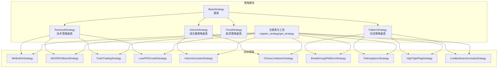
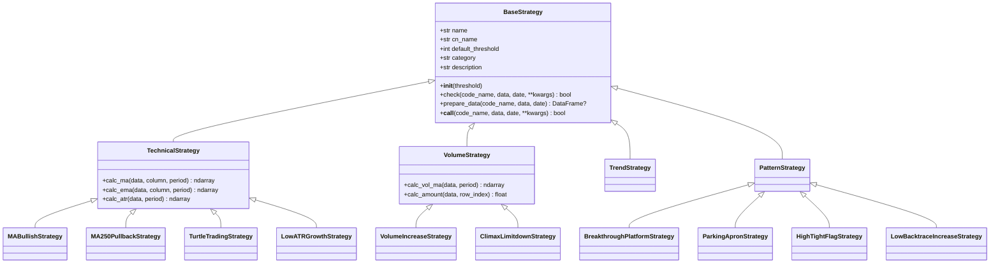
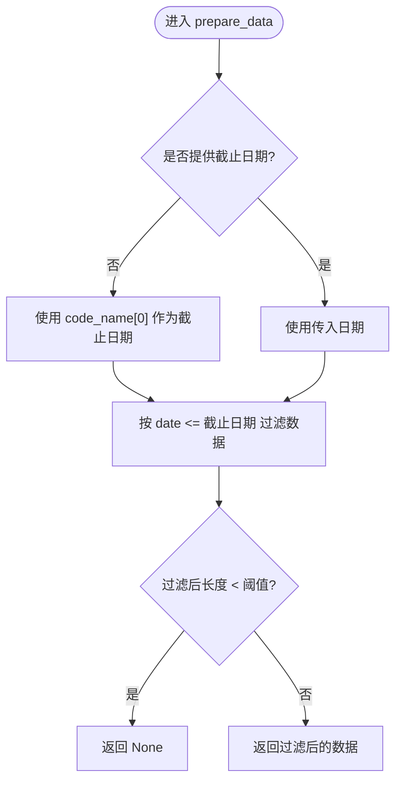
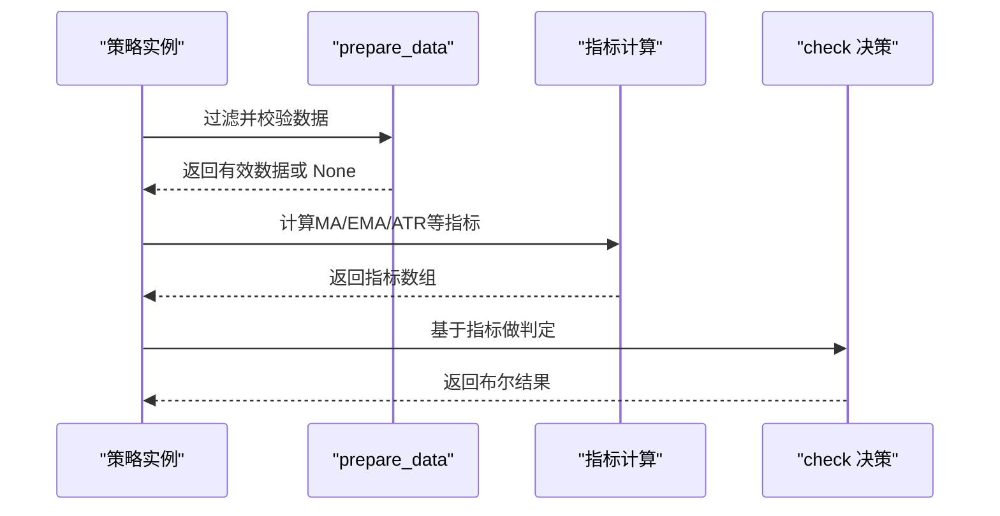
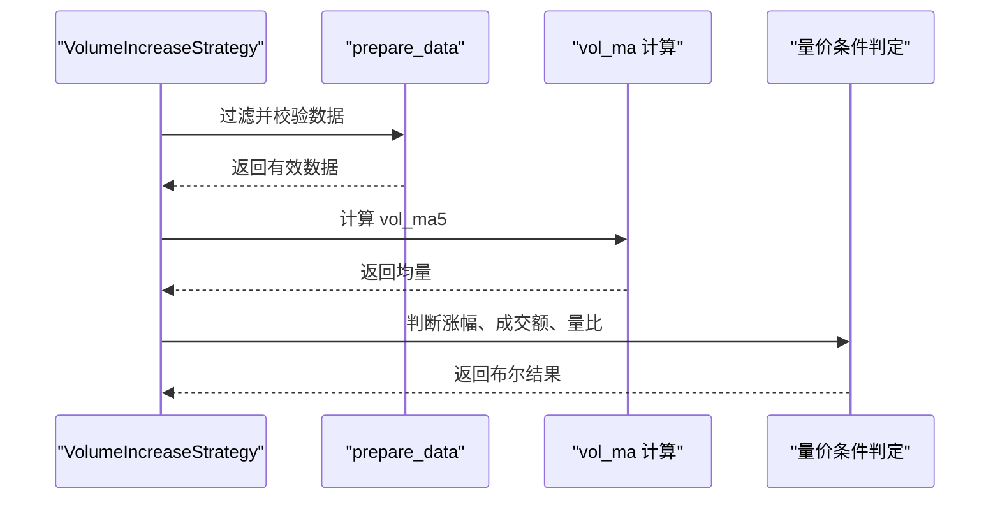
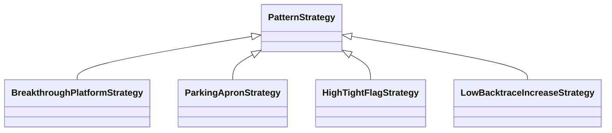
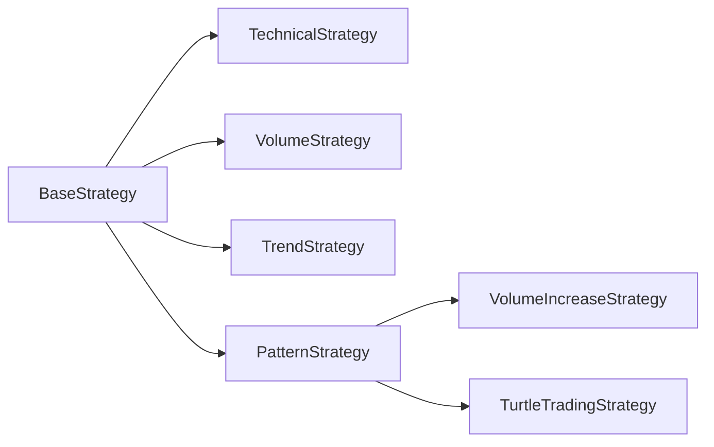

# 策略基类设计

<cite>
**本文引用的文件**
- [quantia/core/strategy/base.py](file://quantia/core/strategy/base.py)
- [quantia/core/strategy/__init__.py](file://quantia/core/strategy/__init__.py)
- [quantia/core/strategy/technical/ma_strategies.py](file://quantia/core/strategy/technical/ma_strategies.py)
- [quantia/core/strategy/volume/volume_strategies.py](file://quantia/core/strategy/volume/volume_strategies.py)
- [quantia/core/strategy/pattern/pattern_strategies.py](file://quantia/core/strategy/pattern/pattern_strategies.py)
- [quantia/core/strategy/enter.py](file://quantia/core/strategy/enter.py)
- [quantia/core/strategy/backtrace_ma250.py](file://quantia/core/strategy/backtrace_ma250.py)
- [quantia/core/strategy/breakthrough_platform.py](file://quantia/core/strategy/breakthrough_platform.py)
- [quantia/core/strategy/turtle_trade.py](file://quantia/core/strategy/turtle_trade.py)
- [quantia/core/strategy/fundamental/fundamental_strategies.py](file://quantia/core/strategy/fundamental/fundamental_strategies.py)
- [quantia/core/strategy/README.md](file://quantia/core/strategy/README.md)
</cite>

## 目录
1. [引言](#引言)
2. [项目结构](#项目结构)
3. [核心组件](#核心组件)
4. [架构总览](#架构总览)
5. [详细组件分析](#详细组件分析)
6. [依赖关系分析](#依赖关系分析)
7. [性能考量](#性能考量)
8. [故障排查指南](#故障排查指南)
9. [结论](#结论)
10. [附录](#附录)

## 引言
本文件系统化阐述策略基类设计，围绕抽象基类 BaseStrategy 及其扩展（技术策略、成交量策略、趋势策略、形态策略）展开，重点覆盖：
- 设计理念与职责边界
- 核心接口定义与调用约定
- 数据准备机制与过滤逻辑
- check 方法实现要求
- 策略实例可调用性设计
- 各子类策略的具体实现要点
- 继承指南、抽象方法实现要求与最佳实践

## 项目结构
策略模块采用“基类 + 分类子包”的组织方式，便于按策略类型扩展与维护：
- 基类与注册机制位于 base.py
- 策略分类入口位于各子包 __init__.py
- 具体策略实现分别位于 technical、volume、pattern 子包
- 兼容性旧接口位于根级策略文件与 enter.py 等

图表来源
- [quantia/core/strategy/base.py](file://quantia/core/strategy/base.py#L20-L202)
- [quantia/core/strategy/technical/ma_strategies.py](file://quantia/core/strategy/technical/ma_strategies.py#L22-L237)
- [quantia/core/strategy/volume/volume_strategies.py](file://quantia/core/strategy/volume/volume_strategies.py#L19-L126)
- [quantia/core/strategy/pattern/pattern_strategies.py](file://quantia/core/strategy/pattern/pattern_strategies.py#L22-L276)

章节来源
- [quantia/core/strategy/__init__.py](file://quantia/core/strategy/__init__.py#L1-L119)
- [quantia/core/strategy/README.md](file://quantia/core/strategy/README.md#L1-L146)

## 核心组件
- BaseStrategy 抽象基类
  - 定义统一的 check 接口与可调用协议
  - 提供 prepare_data 数据过滤与阈值校验
  - 提供 __call__ 使策略实例可直接调用
- TechnicalStrategy 技术策略基类
  - 提供常用技术指标计算工具（MA、EMA、ATR）
- VolumeStrategy 成交量策略基类
  - 提供成交量与成交额计算工具（成交量均线、成交额）
- TrendStrategy 趋势策略基类
  - 作为趋势类策略的命名空间基类
- PatternStrategy 形态策略基类
  - 作为形态类策略的命名空间基类
- 注册与检索工具
  - register_strategy 装饰器
  - get_strategy、get_all_strategies、get_strategies_by_category

章节来源
- [quantia/core/strategy/base.py](file://quantia/core/strategy/base.py#L20-L202)

## 架构总览
策略体系遵循“基类约束 + 子类扩展 + 注册发现”的模式，保证：
- 统一的输入输出契约（check 接口）
- 可插拔的策略注册与分类检索
- 明确的数据准备与阈值控制
- 可直接调用的实例化接口

图表来源
- [quantia/core/strategy/base.py](file://quantia/core/strategy/base.py#L20-L202)
- [quantia/core/strategy/technical/ma_strategies.py](file://quantia/core/strategy/technical/ma_strategies.py#L22-L237)
- [quantia/core/strategy/volume/volume_strategies.py](file://quantia/core/strategy/volume/volume_strategies.py#L19-L126)
- [quantia/core/strategy/pattern/pattern_strategies.py](file://quantia/core/strategy/pattern/pattern_strategies.py#L22-L276)

## 详细组件分析

### BaseStrategy 抽象基类
- 设计理念
  - 通过抽象方法约束所有策略的 check 接口，确保统一的调用与测试体验
  - 通过 prepare_data 统一数据过滤与阈值校验，减少重复代码
  - 通过 __call__ 提供简洁的实例调用语法
- 核心接口
  - check：策略判定主入口，返回布尔结果
  - prepare_data：按截止日期过滤数据，确保最小长度阈值
  - __call__：策略实例可直接调用
- 数据准备机制
  - 若未显式传入截止日期，则使用 code_name[0] 作为 end_date
  - 使用日期列进行闭区间过滤 data['date'] <= end_date
  - 过滤后若长度仍小于阈值则返回 None，表示数据不足
- 实例可调用性
  - __call__ 直接委托至 check，便于在回调、管道中直接使用策略对象

图表来源
- [quantia/core/strategy/base.py](file://quantia/core/strategy/base.py#L64-L89)

章节来源
- [quantia/core/strategy/base.py](file://quantia/core/strategy/base.py#L20-L96)

### TechnicalStrategy 技术策略基类
- 职责
  - 提供常用技术指标计算工具，供技术类策略复用
- 工具方法
  - 移动平均（MA）、指数移动平均（EMA）、平均真实波幅（ATR）
  - 对 NaN 填充为 0，保证后续计算稳定性
- 典型策略
  - MABullishStrategy：均线多头策略
  - MA250PullbackStrategy：回踩年线策略
  - TurtleTradingStrategy：海龟交易法则
  - LowATRGrowthStrategy：低ATR成长策略

图表来源
- [quantia/core/strategy/base.py](file://quantia/core/strategy/base.py#L64-L96)
- [quantia/core/strategy/technical/ma_strategies.py](file://quantia/core/strategy/technical/ma_strategies.py#L36-L55)

章节来源
- [quantia/core/strategy/base.py](file://quantia/core/strategy/base.py#L99-L124)
- [quantia/core/strategy/technical/ma_strategies.py](file://quantia/core/strategy/technical/ma_strategies.py#L22-L237)

### VolumeStrategy 成交量策略基类
- 职责
  - 提供成交量与成交额相关工具，支持量能类策略
- 工具方法
  - 成交量均线（vol_ma），成交额（close × volume）
- 典型策略
  - VolumeIncreaseStrategy：放量上涨策略
  - ClimaxLimitdownStrategy：放量跌停策略

图表来源
- [quantia/core/strategy/base.py](file://quantia/core/strategy/base.py#L64-L96)
- [quantia/core/strategy/volume/volume_strategies.py](file://quantia/core/strategy/volume/volume_strategies.py#L34-L68)

章节来源
- [quantia/core/strategy/base.py](file://quantia/core/strategy/base.py#L126-L143)
- [quantia/core/strategy/volume/volume_strategies.py](file://quantia/core/strategy/volume/volume_strategies.py#L19-L126)

### TrendStrategy 与 PatternStrategy
- TrendStrategy
  - 作为趋势类策略的命名空间基类，便于扩展与分类
- PatternStrategy
  - 作为形态类策略的命名空间基类，典型策略包括：
    - BreakthroughPlatformStrategy：突破平台
    - ParkingApronStrategy：停机坪
    - HighTightFlagStrategy：高而窄的旗形
    - LowBacktraceIncreaseStrategy：无大幅回撤

图表来源
- [quantia/core/strategy/pattern/pattern_strategies.py](file://quantia/core/strategy/pattern/pattern_strategies.py#L22-L276)

章节来源
- [quantia/core/strategy/base.py](file://quantia/core/strategy/base.py#L145-L153)
- [quantia/core/strategy/pattern/pattern_strategies.py](file://quantia/core/strategy/pattern/pattern_strategies.py#L22-L276)

### check 方法实现要求
- 输入约定
  - code_name：包含日期与代码的元组；若未传入 date，应使用 code_name[0] 作为截止日期
  - data：历史K线数据（DataFrame），包含日期、开盘、收盘、最高、最低、成交量等字段
  - date：可选，用于限定回测截止日期
  - kwargs：策略可选参数（如形态策略中的 istop）
- 输出约定
  - 返回布尔值，True 表示满足策略条件
- 实现要点
  - 优先调用 prepare_data 进行数据过滤与阈值校验
  - 在 check 内部完成指标计算与条件判定
  - 注意对 NaN、零值的保护处理（如均量为 0 的分支）

章节来源
- [quantia/core/strategy/base.py](file://quantia/core/strategy/base.py#L47-L62)
- [quantia/core/strategy/technical/ma_strategies.py](file://quantia/core/strategy/technical/ma_strategies.py#L36-L55)
- [quantia/core/strategy/volume/volume_strategies.py](file://quantia/core/strategy/volume/volume_strategies.py#L34-L68)
- [quantia/core/strategy/pattern/pattern_strategies.py](file://quantia/core/strategy/pattern/pattern_strategies.py#L167-L203)

### prepare_data 方法的数据过滤逻辑
- 截止日期确定
  - 若未提供 date，则使用 code_name[0] 作为 end_date
  - 否则将传入 date 转换为字符串格式
- 过滤规则
  - 使用 data['date'] <= end_date 进行闭区间过滤
- 阈值校验
  - 过滤后长度仍小于阈值时返回 None，表示数据不足
- 使用建议
  - 在 check 开始阶段统一调用 prepare_data，避免重复过滤
  - 对于需要前后段分析的策略，可在 prepare_data 之后再进行切片

章节来源
- [quantia/core/strategy/base.py](file://quantia/core/strategy/base.py#L64-L89)

### 策略实例的可调用性设计
- __call__ 直接委托至 check，允许以策略实例形式直接调用
- 适用于回调、管道、调度等场景，提升可读性与一致性

章节来源
- [quantia/core/strategy/base.py](file://quantia/core/strategy/base.py#L91-L96)

### 策略注册与检索
- register_strategy 装饰器
  - 将策略类注册到全局注册表，键为策略 name
- get_strategy / get_all_strategies / get_strategies_by_category
  - 提供按名称获取、全部复制、按分类筛选的能力

章节来源
- [quantia/core/strategy/base.py](file://quantia/core/strategy/base.py#L159-L202)

### 兼容性接口与迁移建议
- 根级策略文件（如 enter.py、backtrace_ma250.py、breakthrough_platform.py、turtle_trade.py）提供旧式函数接口
- 新策略开发建议优先使用类 + 注册的方式，逐步替换旧式函数接口

章节来源
- [quantia/core/strategy/enter.py](file://quantia/core/strategy/enter.py#L16-L60)
- [quantia/core/strategy/backtrace_ma250.py](file://quantia/core/strategy/backtrace_ma250.py#L17-L91)
- [quantia/core/strategy/breakthrough_platform.py](file://quantia/core/strategy/breakthrough_platform.py#L17-L51)
- [quantia/core/strategy/turtle_trade.py](file://quantia/core/strategy/turtle_trade.py#L14-L37)

## 依赖关系分析
- 组件耦合
  - 各策略类仅依赖基类与注册表，彼此解耦
  - 形态策略内部可复用技术/成交量策略（如调用 VolumeIncreaseStrategy 或 TurtleTradingStrategy）
- 外部依赖
  - pandas/numpy/talib 用于数据与指标计算
- 循环依赖
  - 通过延迟导入（如形态策略中对 VolumeIncreaseStrategy 的导入）避免循环依赖

图表来源
- [quantia/core/strategy/pattern/pattern_strategies.py](file://quantia/core/strategy/pattern/pattern_strategies.py#L38-L63)
- [quantia/core/strategy/technical/ma_strategies.py](file://quantia/core/strategy/technical/ma_strategies.py#L96-L121)

章节来源
- [quantia/core/strategy/pattern/pattern_strategies.py](file://quantia/core/strategy/pattern/pattern_strategies.py#L96-L121)

## 性能考量
- 数据过滤与切片
  - prepare_data 使用布尔掩码过滤，尽量在尾部切片以减少计算量
- 指标计算
  - 使用 talib 向量化计算，注意 NaN 填充与零值保护
- 复杂度
  - 形态策略中存在多层循环（如寻找突破日、遍历整理期），应结合阈值与早停逻辑优化
- I/O 与缓存
  - 策略运行在批处理作业中，建议在上游数据层做好缓存与索引

## 故障排查指南
- 数据不足
  - prepare_data 返回 None：检查数据长度与截止日期设置
- 指标异常
  - 均量为 0：在量价判定前增加保护分支
  - NaN 导致指标异常：确保指标计算前填充或剔除 NaN
- 日期解析错误
  - 字符串日期格式不一致：统一使用 "%Y-%m-%d" 解析
- 循环依赖
  - 策略内部互相导入：采用延迟导入或重构策略边界

章节来源
- [quantia/core/strategy/base.py](file://quantia/core/strategy/base.py#L64-L89)
- [quantia/core/strategy/volume/volume_strategies.py](file://quantia/core/strategy/volume/volume_strategies.py#L104-L112)
- [quantia/core/strategy/pattern/pattern_strategies.py](file://quantia/core/strategy/pattern/pattern_strategies.py#L123-L148)

## 结论
策略基类设计通过统一接口、数据准备与注册机制，实现了策略的可扩展与可维护。开发者应遵循：
- 使用 BaseStrategy/子类作为基类，实现 check 与必要的指标工具
- 在 check 开头调用 prepare_data，确保数据合规
- 通过 register_strategy 注册策略，便于统一管理与检索
- 优先采用类 + 注册的现代方式，逐步淘汰旧式函数接口

## 附录

### 继承指南与最佳实践
- 继承路径
  - 技术类：TechnicalStrategy → 具体策略
  - 成交量类：VolumeStrategy → 具体策略
  - 形态类：PatternStrategy → 具体策略
- 抽象方法实现
  - 必须实现 check，严格遵守输入输出约定
  - 合理设置 default_threshold，确保策略稳健性
- 数据处理
  - 在 check 内部完成指标计算，避免在构造函数中写入 DataFrame
  - 对 NaN/零值进行显式保护
- 可调用性
  - 保持 __call__ 与 check 一致，便于在不同场景使用
- 注册与分类
  - 正确设置 name/cn_name/category/description，便于检索与展示

章节来源
- [quantia/core/strategy/base.py](file://quantia/core/strategy/base.py#L20-L96)
- [quantia/core/strategy/technical/ma_strategies.py](file://quantia/core/strategy/technical/ma_strategies.py#L22-L55)
- [quantia/core/strategy/volume/volume_strategies.py](file://quantia/core/strategy/volume/volume_strategies.py#L19-L68)
- [quantia/core/strategy/pattern/pattern_strategies.py](file://quantia/core/strategy/pattern/pattern_strategies.py#L22-L77)
