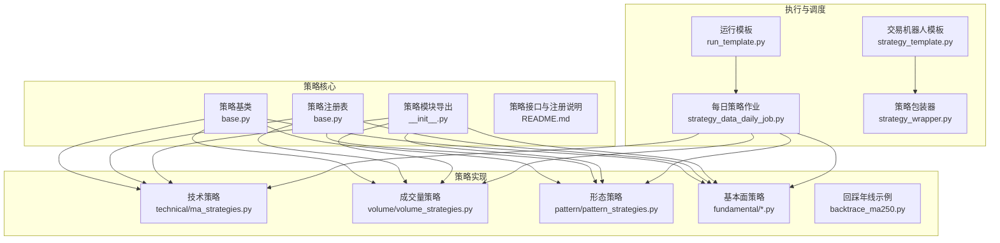
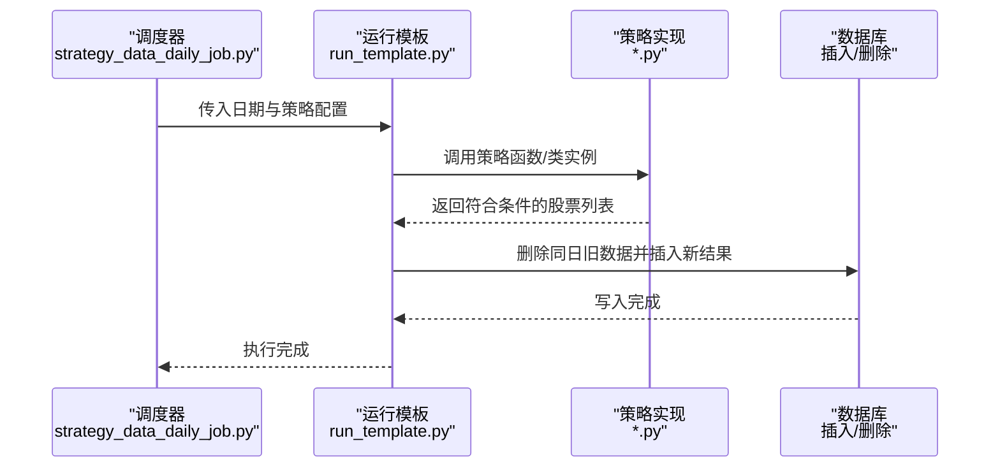
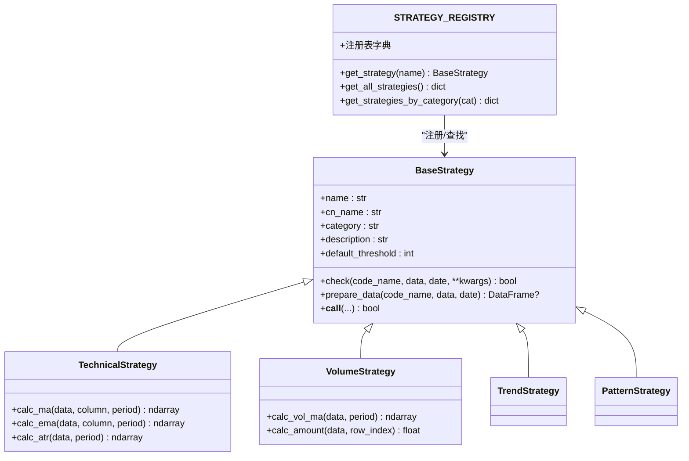
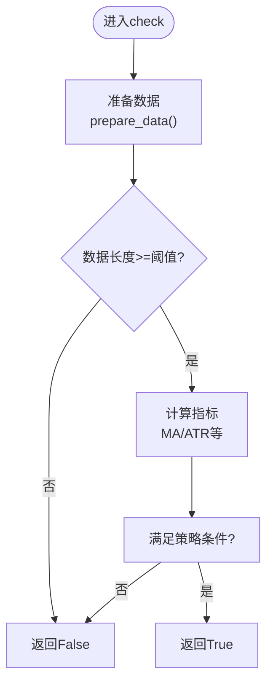
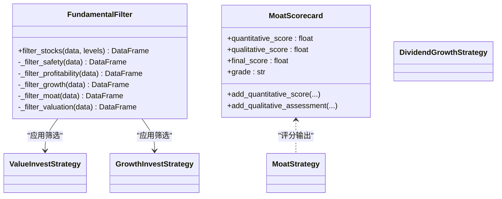
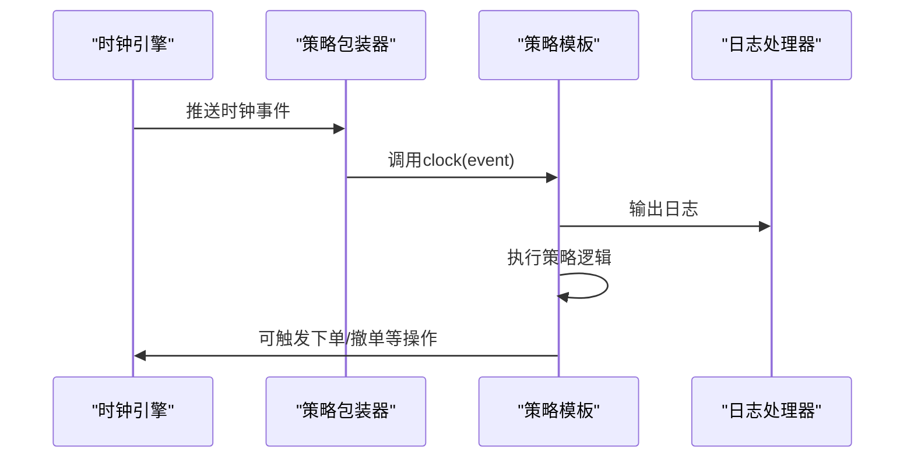
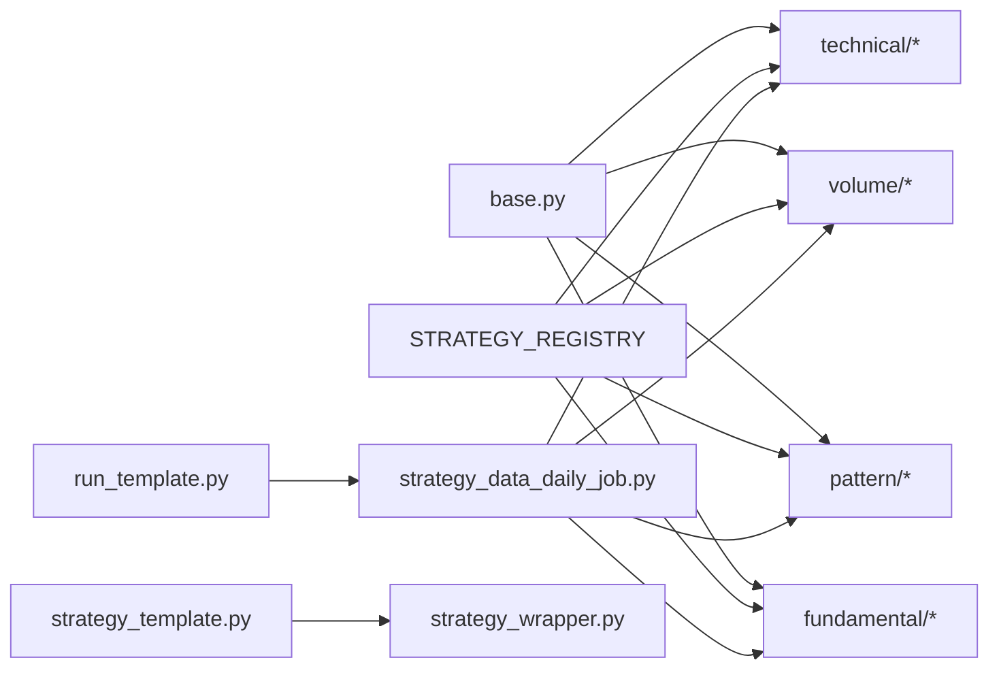

# 策略开发指南

<cite>
**本文引用的文件**
- [策略基类与注册机制](file://quantia/core/strategy/base.py)
- [策略模块说明与接口规范](file://quantia/core/strategy/README.md)
- [策略模板（交易机器人）](file://quantia/trade/robot/infrastructure/strategy_template.py)
- [策略包装器（多进程/线程）](file://quantia/trade/robot/infrastructure/strategy_wrapper.py)
- [策略模块导出与兼容性](file://quantia/core/strategy/__init__.py)
- [均线策略实现示例](file://quantia/core/strategy/technical/ma_strategies.py)
- [成交量策略实现示例](file://quantia/core/strategy/volume/volume_strategies.py)
- [K线形态策略实现示例](file://quantia/core/strategy/pattern/pattern_strategies.py)
- [回踩年线策略实现示例](file://quantia/core/strategy/backtrace_ma250.py)
- [基本面策略实现示例](file://quantia/core/strategy/fundamental/fundamental_strategies.py)
- [基本面筛选器与评分模型](file://quantia/core/strategy/fundamental/fundamental_filter.py)
- [护城河评分模型数据结构](file://quantia/core/strategy/fundamental/moat_model.py)
- [每日策略作业调度（K线策略）](file://quantia/job/strategy_data_daily_job.py)
- [运行模板（批量执行与并发）](file://quantia/lib/run_template.py)
- [GPT综合选股策略文档](file://quantia/core/strategy/document/ChatGP选股策略文档.md)
- [交易策略示例（打新）](file://quantia/trade/strategies/stagging.py)
- [交易策略示例（模拟买卖）](file://quantia/trade/strategies/stratey1.py)
</cite>

## 目录
1. [引言](#引言)
2. [项目结构](#项目结构)
3. [核心组件](#核心组件)
4. [架构总览](#架构总览)
5. [详细组件分析](#详细组件分析)
6. [依赖关系分析](#依赖关系分析)
7. [性能考虑](#性能考虑)
8. [故障排查指南](#故障排查指南)
9. [结论](#结论)
10. [附录](#附录)

## 引言
本指南面向希望在本项目中开发自定义策略的开发者，涵盖策略开发流程、开发模板使用、策略参数设计原则、编码规范、测试验证方法、常见开发模式、性能优化技巧以及最佳实践与调试方法。通过策略基类与注册机制、策略模板、作业调度与并发执行模板，帮助你快速上手并编写高质量、可维护的策略代码。

## 项目结构
策略相关代码主要分布在以下路径：
- 核心策略基类与注册：quantia/core/strategy/base.py
- 策略模块说明与接口规范：quantia/core/strategy/README.md
- 技术/成交量/形态/基本面策略实现：quantia/core/strategy/{technical,volume,pattern,fundamental}/
- 交易机器人策略模板与包装器：quantia/trade/robot/infrastructure/
- 每日策略作业调度：quantia/job/strategy_data_daily_job.py
- 运行模板（批量执行与并发）：quantia/lib/run_template.py
- GPT综合选股策略文档：quantia/core/strategy/document/ChatGP选股策略文档.md

**图表来源**
- [策略基类与注册机制](file://quantia/core/strategy/base.py#L20-L202)
- [策略模块导出与兼容性](file://quantia/core/strategy/__init__.py#L30-L119)
- [均线策略实现示例](file://quantia/core/strategy/technical/ma_strategies.py#L22-L237)
- [成交量策略实现示例](file://quantia/core/strategy/volume/volume_strategies.py#L19-L126)
- [K线形态策略实现示例](file://quantia/core/strategy/pattern/pattern_strategies.py#L22-L276)
- [回踩年线策略实现示例](file://quantia/core/strategy/backtrace_ma250.py#L17-L92)
- [每日策略作业调度（K线策略）](file://quantia/job/strategy_data_daily_job.py#L23-L97)
- [运行模板（批量执行与并发）](file://quantia/lib/run_template.py#L18-L95)
- [策略模板（交易机器人）](file://quantia/trade/robot/infrastructure/strategy_template.py#L9-L43)
- [策略包装器（多进程/线程）](file://quantia/trade/robot/infrastructure/strategy_wrapper.py#L12-L45)

**章节来源**
- [策略模块说明与接口规范](file://quantia/core/strategy/README.md#L1-L146)
- [策略基类与注册机制](file://quantia/core/strategy/base.py#L20-L202)

## 核心组件
- 策略基类与分类：提供统一的check接口、数据准备、分类标签与注册表，便于扩展与管理。
- 策略注册与发现：通过装饰器注册策略，按分类检索，支持动态加载。
- 策略模板（交易机器人）：提供时钟事件、日志钩子、生命周期回调，便于实盘交易策略开发。
- 作业调度与并发：每日策略作业统一调度，支持并发执行与批量日期处理。
- 基本面筛选与评分：提供多层级筛选与护城河评分模型，支持策略参数化与可配置。

**章节来源**
- [策略基类与注册机制](file://quantia/core/strategy/base.py#L20-L202)
- [策略模块导出与兼容性](file://quantia/core/strategy/__init__.py#L30-L119)
- [策略模板（交易机器人）](file://quantia/trade/robot/infrastructure/strategy_template.py#L9-L43)
- [策略包装器（多进程/线程）](file://quantia/trade/robot/infrastructure/strategy_wrapper.py#L12-L45)
- [每日策略作业调度（K线策略）](file://quantia/job/strategy_data_daily_job.py#L23-L97)
- [运行模板（批量执行与并发）](file://quantia/lib/run_template.py#L18-L95)
- [基本面筛选器与评分模型](file://quantia/core/strategy/fundamental/fundamental_filter.py#L118-L200)
- [护城河评分模型数据结构](file://quantia/core/strategy/fundamental/moat_model.py#L85-L200)

## 架构总览
策略开发遵循“基类抽象 + 装饰器注册 + 作业调度 + 并发执行”的架构。K线策略与基本面策略分别在各自的作业中执行，回测统一接入；交易机器人策略通过模板与包装器实现事件驱动与进程隔离。

**图表来源**
- [每日策略作业调度（K线策略）](file://quantia/job/strategy_data_daily_job.py#L23-L97)
- [运行模板（批量执行与并发）](file://quantia/lib/run_template.py#L18-L95)

## 详细组件分析

### 策略基类与注册机制
- 基类职责：统一check接口、数据准备、阈值控制、分类标记；提供技术/成交量/趋势/形态等子类。
- 注册机制：装饰器注册策略类，支持按名称获取与按分类筛选。
- 使用建议：继承相应分类基类，实现check方法，设置name/cn_name/category/description，必要时重写prepare_data。

**图表来源**
- [策略基类与注册机制](file://quantia/core/strategy/base.py#L20-L202)

**章节来源**
- [策略基类与注册机制](file://quantia/core/strategy/base.py#L20-L202)

### 策略模块说明与接口规范
- 接口约定：K线策略统一check函数签名；GPT综合选股使用独立接口与筛选条件。
- 注册与分类：通过tablestructure注册，前端路由与后端执行流程清晰分离。
- 开发指引：新增策略需实现check并注册，按分类归档，确保回测与作业调度可发现。

**章节来源**
- [策略模块说明与接口规范](file://quantia/core/strategy/README.md#L65-L146)

### 技术策略（均线/ATR/海龟/低ATR）
- 均线多头：MA30持续上行且涨幅达标。
- 回踩年线：突破250日均线后回踩不破，缩量整理。
- 海龟交易：突破60日新高。
- 低ATR成长：波动率低、涨幅稳健。

**图表来源**
- [均线策略实现示例](file://quantia/core/strategy/technical/ma_strategies.py#L36-L55)
- [回踩年线策略实现示例](file://quantia/core/strategy/backtrace_ma250.py#L73-L137)

**章节来源**
- [均线策略实现示例](file://quantia/core/strategy/technical/ma_strategies.py#L22-L237)
- [回踩年线策略实现示例](file://quantia/core/strategy/backtrace_ma250.py#L17-L92)

### 成交量策略（放量上涨/放量跌停）
- 放量上涨：涨幅达标、阳线、成交额达标、量比≥2。
- 放量跌停：跌停且量比放大。

**章节来源**
- [成交量策略实现示例](file://quantia/core/strategy/volume/volume_strategies.py#L19-L126)

### 形态策略（突破平台/停机坪/旗形/无大幅回撤）
- 突破平台：60日均线支撑突破且放量。
- 停机坪：涨停后横盘整理，后续温和上涨。
- 旗形：短期快速上涨后窄幅整理，机构参与。
- 无大幅回撤：稳健上涨，严格回撤约束。

**章节来源**
- [K线形态策略实现示例](file://quantia/core/strategy/pattern/pattern_strategies.py#L22-L276)

### 基本面策略（价值/成长/护城河/股息成长）
- 价值投资：ROE/毛利率/净利率/负债率/现金流/PE等。
- 成长投资：营收/利润3年CAGR、ROE、毛利率、负债率。
- 护城河：量化评分+定性评估，支持AI辅助。
- 股息成长：股息率、ROE、利润增长、现金流。

**图表来源**
- [基本面筛选器与评分模型](file://quantia/core/strategy/fundamental/fundamental_filter.py#L118-L200)
- [护城河评分模型数据结构](file://quantia/core/strategy/fundamental/moat_model.py#L85-L200)
- [基本面策略实现示例](file://quantia/core/strategy/fundamental/fundamental_strategies.py#L30-L351)

**章节来源**
- [基本面策略实现示例](file://quantia/core/strategy/fundamental/fundamental_strategies.py#L30-L351)
- [基本面筛选器与评分模型](file://quantia/core/strategy/fundamental/fundamental_filter.py#L118-L200)
- [护城河评分模型数据结构](file://quantia/core/strategy/fundamental/moat_model.py#L85-L200)

### 交易机器人策略模板与包装器
- 模板：提供init/strategy/clock/shutdown生命周期与日志钩子。
- 包装器：多进程+线程时钟队列，隔离策略执行与事件处理。

**图表来源**
- [策略模板（交易机器人）](file://quantia/trade/robot/infrastructure/strategy_template.py#L20-L42)
- [策略包装器（多进程/线程）](file://quantia/trade/robot/infrastructure/strategy_wrapper.py#L25-L44)

**章节来源**
- [策略模板（交易机器人）](file://quantia/trade/robot/infrastructure/strategy_template.py#L9-L43)
- [策略包装器（多进程/线程）](file://quantia/trade/robot/infrastructure/strategy_wrapper.py#L12-L45)
- [交易策略示例（打新）](file://quantia/trade/strategies/stagging.py#L14-L57)
- [交易策略示例（模拟买卖）](file://quantia/trade/strategies/stratey1.py#L14-L68)

### 每日策略作业调度与并发
- 作业流程：按策略列表并发执行，支持批量日期与单日执行。
- 数据处理：删除旧数据、写入新结果、统一列结构。
- 高级特性：部分策略（如高而窄的旗形）需要额外数据（如龙虎榜）。

**章节来源**
- [每日策略作业调度（K线策略）](file://quantia/job/strategy_data_daily_job.py#L23-L97)
- [运行模板（批量执行与并发）](file://quantia/lib/run_template.py#L18-L95)

## 依赖关系分析
- 策略实现依赖基类与注册表，通过装饰器自动纳入注册表。
- 作业调度依赖运行模板与数据源，统一并发与错误处理。
- 交易机器人策略依赖模板与包装器，实现事件驱动与进程隔离。

**图表来源**
- [策略基类与注册机制](file://quantia/core/strategy/base.py#L159-L202)
- [策略模块导出与兼容性](file://quantia/core/strategy/__init__.py#L30-L119)
- [每日策略作业调度（K线策略）](file://quantia/job/strategy_data_daily_job.py#L23-L97)
- [运行模板（批量执行与并发）](file://quantia/lib/run_template.py#L18-L95)
- [策略模板（交易机器人）](file://quantia/trade/robot/infrastructure/strategy_template.py#L9-L43)
- [策略包装器（多进程/线程）](file://quantia/trade/robot/infrastructure/strategy_wrapper.py#L12-L45)

**章节来源**
- [策略基类与注册机制](file://quantia/core/strategy/base.py#L159-L202)
- [策略模块导出与兼容性](file://quantia/core/strategy/__init__.py#L30-L119)
- [每日策略作业调度（K线策略）](file://quantia/job/strategy_data_daily_job.py#L23-L97)
- [运行模板（批量执行与并发）](file://quantia/lib/run_template.py#L18-L95)

## 性能考虑
- 并发执行：作业调度与运行模板使用线程池并发，控制工作线程数量以平衡吞吐与内存占用。
- 数据预处理：在策略内部使用prepare_data统一过滤日期与长度阈值，减少无效计算。
- 指标计算：优先使用向量化计算（如talib），避免逐行循环。
- I/O与数据库：批量删除旧数据后再批量插入，减少事务开销。
- 交易策略：多进程+线程时钟队列，避免阻塞事件循环。

**章节来源**
- [每日策略作业调度（K线策略）](file://quantia/job/strategy_data_daily_job.py#L67-L84)
- [运行模板（批量执行与并发）](file://quantia/lib/run_template.py#L44-L95)
- [策略包装器（多进程/线程）](file://quantia/trade/robot/infrastructure/strategy_wrapper.py#L12-L45)

## 故障排查指南
- 策略未注册：检查装饰器注册与模块导出，确认名称一致。
- 数据不足：检查prepare_data阈值与日期过滤逻辑。
- 并发异常：查看作业调度中的异常捕获与日志，定位具体股票或策略。
- 交易策略无响应：确认时钟事件注册与包装器启动，检查日志钩子。
- 基本面筛选结果为空：核对筛选层级与阈值配置，检查数据源字段是否存在。

**章节来源**
- [策略基类与注册机制](file://quantia/core/strategy/base.py#L173-L202)
- [每日策略作业调度（K线策略）](file://quantia/job/strategy_data_daily_job.py#L55-L84)
- [策略模板（交易机器人）](file://quantia/trade/robot/infrastructure/strategy_template.py#L20-L42)
- [策略包装器（多进程/线程）](file://quantia/trade/robot/infrastructure/strategy_wrapper.py#L25-L44)

## 结论
通过策略基类与注册机制、统一接口与并发执行模板，本项目提供了清晰、可扩展的策略开发框架。开发者可基于技术/成交量/形态/基本面策略模板快速实现新策略，并通过作业调度与回测统一验证。建议在开发中遵循参数化设计、数据预处理与并发控制的最佳实践，确保策略的稳定性与可维护性。

## 附录

### 策略开发步骤清单
- 选择策略分类（技术/成交量/形态/基本面），继承对应基类。
- 实现check方法，必要时重写prepare_data。
- 使用装饰器注册策略，设置name/cn_name/category/description。
- 在模块导出中暴露策略类，确保可导入。
- 在作业调度中注册策略（如K线策略），配置表结构与列定义。
- 编写单元测试与边界测试，验证阈值与异常分支。
- 使用运行模板进行批量日期测试，监控日志与异常。
- 参考GPT综合选股文档完善参数与回测集成。

**章节来源**
- [策略模块说明与接口规范](file://quantia/core/strategy/README.md#L129-L146)
- [策略模块导出与兼容性](file://quantia/core/strategy/__init__.py#L78-L119)

### 策略参数设计原则
- 明确阈值与窗口：如MA周期、ATR窗口、回测阈值，确保可解释与可复现。
- 参数化与可配置：将关键阈值放入策略params，便于前端或配置中心调整。
- 边界与异常：处理缺失数据、零除、空序列等边界情况。
- 性能与精度：在精度与性能间平衡，优先向量化计算与缓存中间结果。

**章节来源**
- [均线策略实现示例](file://quantia/core/strategy/technical/ma_strategies.py#L51-L55)
- [成交量策略实现示例](file://quantia/core/strategy/volume/volume_strategies.py#L34-L68)
- [K线形态策略实现示例](file://quantia/core/strategy/pattern/pattern_strategies.py#L207-L250)
- [回踩年线策略实现示例](file://quantia/core/strategy/backtrace_ma250.py#L26-L27)
- [基本面策略实现示例](file://quantia/core/strategy/fundamental/fundamental_strategies.py#L51-L59)

### 常见开发模式
- 组合策略：在形态策略中复用技术策略（如突破平台中复用放量上涨）。
- 条件分支：根据日期与外部数据（如龙虎榜）动态调整策略逻辑。
- 参数扫描：在测试阶段对关键阈值进行网格搜索，评估收益与回撤。

**章节来源**
- [K线形态策略实现示例](file://quantia/core/strategy/pattern/pattern_strategies.py#L38-L77)
- [每日策略作业调度（K线策略）](file://quantia/job/strategy_data_daily_job.py#L60-L71)

### 测试验证方法
- 单元测试：针对check方法与边界条件编写测试用例。
- 回测验证：将策略纳入回测作业，对比不同时间窗口表现。
- 批量日期测试：使用运行模板对多个交易日进行批量验证。
- 日志与告警：在策略与作业中加入详细日志，便于定位问题。

**章节来源**
- [运行模板（批量执行与并发）](file://quantia/lib/run_template.py#L18-L95)
- [GPT综合选股策略文档](file://quantia/core/strategy/document/ChatGP选股策略文档.md#L336-L367)

### 调试方法
- 策略日志：在check中输出关键变量与条件判断结果。
- 作业日志：在prepare与run_check中捕获异常并记录。
- 交易策略：通过包装器的日志钩子输出策略执行状态。
- 断点与单测：在本地运行单测与小样本数据验证。

**章节来源**
- [策略模板（交易机器人）](file://quantia/trade/robot/infrastructure/strategy_template.py#L30-L35)
- [策略包装器（多进程/线程）](file://quantia/trade/robot/infrastructure/strategy_wrapper.py#L25-L44)
- [每日策略作业调度（K线策略）](file://quantia/job/strategy_data_daily_job.py#L55-L84)
