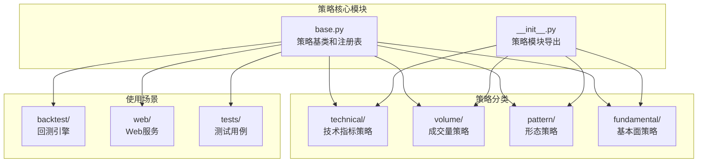
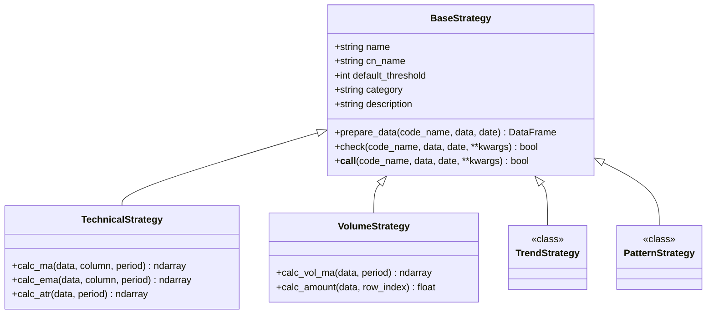
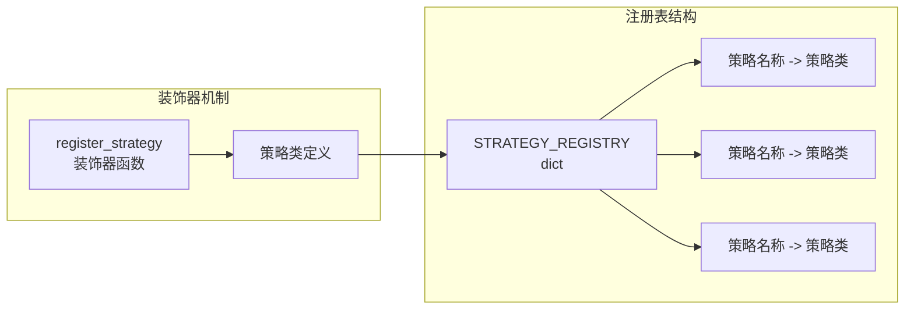
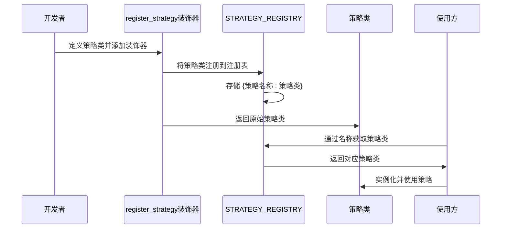
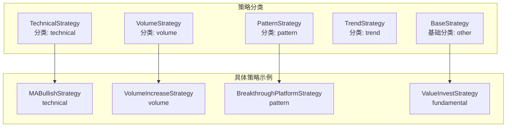
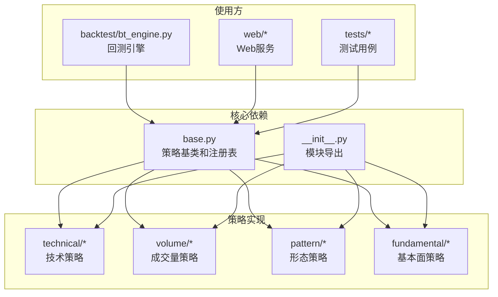
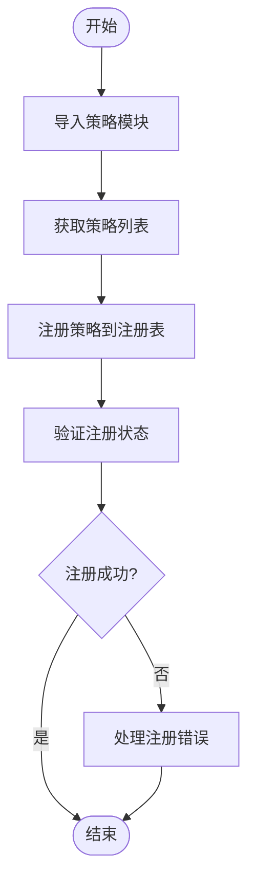
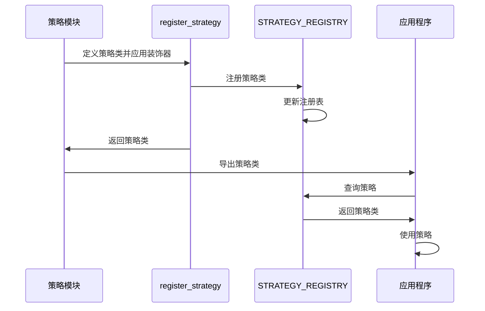

# 策略注册机制

<cite>
**本文档引用的文件**
- [base.py](file://docker/stock/quantia/core/strategy/base.py)
- [__init__.py](file://docker/stock/quantia/core/strategy/__init__.py)
- [ma_strategies.py](file://docker/stock/quantia/core/strategy/technical/ma_strategies.py)
- [volume_strategies.py](file://docker/stock/quantia/core/strategy/volume/volume_strategies.py)
- [pattern_strategies.py](file://docker/stock/quantia/core/strategy/pattern/pattern_strategies.py)
- [fundamental_strategies.py](file://docker/stock/quantia/core/strategy/fundamental/fundamental_strategies.py)
- [bt_engine.py](file://docker/stock/quantia/core/backtest/bt_engine.py)
- [test_strategy_mapping.py](file://tests/test_strategy_mapping.py)
</cite>

## 目录
1. [简介](#简介)
2. [项目结构](#项目结构)
3. [核心组件](#核心组件)
4. [架构概览](#架构概览)
5. [详细组件分析](#详细组件分析)
6. [依赖关系分析](#依赖关系分析)
7. [性能考虑](#性能考虑)
8. [故障排除指南](#故障排除指南)
9. [最佳实践](#最佳实践)
10. [结论](#结论)

## 简介

策略注册机制是 Quantia 量化选股系统的核心基础设施，它提供了一种灵活、可扩展的方式来管理和使用各种技术分析策略。该机制基于 Python 装饰器模式，通过全局注册表实现策略的动态发现和加载。

系统支持多种策略类型：
- **技术指标策略**：基于技术分析指标的选股策略
- **成交量策略**：基于成交量变化的选股策略  
- **形态策略**：基于价格形态识别的选股策略
- **基本面策略**：基于财务数据分析的选股策略

## 项目结构

策略注册机制主要分布在以下目录结构中：



**图表来源**
- [base.py](file://docker/stock/quantia/core/strategy/base.py#L1-L202)
- [__init__.py](file://docker/stock/quantia/core/strategy/__init__.py#L1-L119)

**章节来源**
- [base.py](file://docker/stock/quantia/core/strategy/base.py#L1-L202)
- [__init__.py](file://docker/stock/quantia/core/strategy/__init__.py#L1-L119)

## 核心组件

### 策略基类体系

系统采用面向对象设计，通过继承关系构建策略层次结构：



**图表来源**
- [base.py](file://docker/stock/quantia/core/strategy/base.py#L20-L153)

### 注册表系统

策略注册表是一个全局字典，用于存储所有已注册的策略类：



**图表来源**
- [base.py](file://docker/stock/quantia/core/strategy/base.py#L155-L170)

**章节来源**
- [base.py](file://docker/stock/quantia/core/strategy/base.py#L20-L153)
- [base.py](file://docker/stock/quantia/core/strategy/base.py#L155-L170)

## 架构概览

策略注册机制的整体架构如下：



**图表来源**
- [base.py](file://docker/stock/quantia/core/strategy/base.py#L159-L185)
- [ma_strategies.py](file://docker/stock/quantia/core/strategy/technical/ma_strategies.py#L22-L35)

## 详细组件分析

### register_strategy 装饰器

`register_strategy` 是策略注册机制的核心装饰器，负责将策略类注册到全局注册表中。

#### 工作原理

装饰器通过以下步骤工作：
1. 接收一个策略类作为参数
2. 使用策略类的 `name` 属性作为键
3. 将策略类本身作为值存储到 `STRATEGY_REGISTRY` 字典中
4. 返回原始策略类以保持装饰器的透明性

#### 使用示例

```python
@register_strategy
class MyStrategy(TechnicalStrategy):
    name = "my_strategy"
    cn_name = "我的策略"
    category = "technical"
    
    def check(self, code_name, data, date=None, **kwargs):
        # 策略逻辑实现
        return True
```

**章节来源**
- [base.py](file://docker/stock/quantia/core/strategy/base.py#L159-L170)

### get_strategy 函数

`get_strategy` 函数提供了通过名称获取策略类的标准接口。

#### 功能特性
- **参数验证**：检查策略名称是否存在于注册表中
- **错误处理**：当策略不存在时抛出详细的错误信息
- **类型安全**：返回正确的策略类类型

#### 错误处理机制

```python
def get_strategy(name: str) -> BaseStrategy:
    if name not in STRATEGY_REGISTRY:
        raise ValueError(f"策略 '{name}' 未注册")
    return STRATEGY_REGISTRY[name]
```

**章节来源**
- [base.py](file://docker/stock/quantia/core/strategy/base.py#L173-L185)

### get_all_strategies 函数

`get_all_strategies` 提供了获取所有已注册策略的便捷方法。

#### 特点
- **数据复制**：返回注册表的副本，防止外部修改影响内部状态
- **完整列表**：包含所有分类的策略
- **实时查询**：每次调用都会获取最新的注册状态

**章节来源**
- [base.py](file://docker/stock/quantia/core/strategy/base.py#L188-L190)

### get_strategies_by_category 函数

`get_strategies_by_category` 支持按策略分类过滤策略列表。

#### 分类支持
- `technical`：技术指标策略
- `volume`：成交量策略  
- `trend`：趋势策略
- `pattern`：形态策略
- `other`：其他策略

#### 过滤逻辑

```python
def get_strategies_by_category(category: str):
    return {name: cls for name, cls in STRATEGY_REGISTRY.items() 
            if cls.category == category}
```

**章节来源**
- [base.py](file://docker/stock/quantia/core/strategy/base.py#L193-L201)

### 策略分类体系

系统实现了清晰的策略分类体系，每种策略都有明确的分类标识：



**图表来源**
- [base.py](file://docker/stock/quantia/core/strategy/base.py#L99-L153)
- [ma_strategies.py](file://docker/stock/quantia/core/strategy/technical/ma_strategies.py#L22-L35)
- [volume_strategies.py](file://docker/stock/quantia/core/strategy/volume/volume_strategies.py#L19-L33)
- [pattern_strategies.py](file://docker/stock/quantia/core/strategy/pattern/pattern_strategies.py#L22-L36)

**章节来源**
- [base.py](file://docker/stock/quantia/core/strategy/base.py#L99-L153)
- [ma_strategies.py](file://docker/stock/quantia/core/strategy/technical/ma_strategies.py#L22-L35)
- [volume_strategies.py](file://docker/stock/quantia/core/strategy/volume/volume_strategies.py#L19-L33)
- [pattern_strategies.py](file://docker/stock/quantia/core/strategy/pattern/pattern_strategies.py#L22-L36)

## 依赖关系分析

策略注册机制的依赖关系如下：



**图表来源**
- [base.py](file://docker/stock/quantia/core/strategy/base.py#L1-L202)
- [__init__.py](file://docker/stock/quantia/core/strategy/__init__.py#L1-L119)
- [bt_engine.py](file://docker/stock/quantia/core/backtest/bt_engine.py#L270-L306)

**章节来源**
- [base.py](file://docker/stock/quantia/core/strategy/base.py#L1-L202)
- [__init__.py](file://docker/stock/quantia/core/strategy/__init__.py#L1-L119)
- [bt_engine.py](file://docker/stock/quantia/core/backtest/bt_engine.py#L270-L306)

## 性能考虑

### 注册表访问性能

策略注册表采用简单的字典结构，提供 O(1) 的查找性能。对于系统中约 20+ 个策略，性能影响可以忽略不计。

### 内存使用优化

- **延迟加载**：策略类只在装饰器执行时注册，不会自动实例化
- **数据复制**：`get_all_strategies()` 返回副本，避免共享状态问题
- **分类过滤**：按需过滤，减少不必要的数据处理

### 并发安全性

当前实现没有专门的并发控制机制。在多线程环境中使用时需要注意：
- 注册操作应该在应用启动时完成
- 查询操作通常是安全的，因为字典访问是原子操作

## 故障排除指南

### 常见问题及解决方案

#### 策略未找到错误

**症状**：调用 `get_strategy()` 时抛出 `ValueError`

**原因**：
- 策略类未正确注册装饰器
- 策略名称拼写错误
- 策略模块未被导入

**解决方法**：
1. 确保策略类定义前有 `@register_strategy` 装饰器
2. 检查策略类的 `name` 属性设置
3. 确保策略模块已被正确导入

#### 重复注册问题

**症状**：策略重复注册导致意外行为

**原因**：同一策略类被多次导入或注册

**解决方法**：
1. 检查策略类的导入路径
2. 确保装饰器只应用一次
3. 使用 `get_all_strategies()` 检查注册状态

#### 类型不匹配错误

**症状**：策略实例化时报错

**原因**：策略类继承关系不正确

**解决方法**：
1. 确保策略类继承自正确的基类
2. 检查策略类的 `category` 属性设置
3. 验证 `check()` 方法的签名

### 调试技巧

#### 注册状态检查

```python
# 检查所有已注册策略
all_strategies = get_all_strategies()
print("已注册策略数量:", len(all_strategies))

# 检查特定分类的策略
tech_strategies = get_strategies_by_category("technical")
print("技术策略:", list(tech_strategies.keys()))
```

#### 策略信息查询

```python
# 获取策略类信息
strategy_cls = get_strategy("enter")
print("策略名称:", strategy_cls.name)
print("策略中文名:", strategy_cls.cn_name)
print("策略分类:", strategy_cls.category)
print("默认阈值:", strategy_cls.default_threshold)
```

**章节来源**
- [base.py](file://docker/stock/quantia/core/strategy/base.py#L173-L185)
- [base.py](file://docker/stock/quantia/core/strategy/base.py#L188-L201)

## 最佳实践

### 策略命名规范

#### 命名原则
1. **唯一性**：每个策略的 `name` 属性必须唯一
2. **简洁性**：使用简短、有意义的英文名称
3. **一致性**：遵循统一的命名约定
4. **可读性**：名称应清晰表达策略含义

#### 推荐命名格式
- **动词+名词**：如 `volume_increase`
- **形容词+名词**：如 `breakout_platform`
- **数字+描述**：如 `ma_250_pullback`

#### 示例对比

**推荐**：
```python
@register_strategy
class MABullishStrategy(TechnicalStrategy):
    name = "keep_increasing"  # 清晰表达策略含义
    cn_name = "均线多头"
    category = "technical"
```

**避免**：
```python
@register_strategy  
class MyStrategy(TechnicalStrategy):
    name = "strategy1"  # 不够清晰
    cn_name = "策略一"
    category = "technical"
```

### 策略开发规范

#### 继承关系
1. **选择合适的基类**：根据策略类型选择相应的基类
2. **实现必需方法**：确保 `check()` 方法正确实现
3. **设置分类属性**：正确设置 `category` 属性

#### 参数配置
1. **默认阈值**：根据策略需求设置合理的 `default_threshold`
2. **参数验证**：在 `check()` 方法中验证输入参数
3. **异常处理**：妥善处理数据缺失和异常情况

#### 代码组织
1. **模块分离**：不同类型的策略放在独立的模块中
2. **文档注释**：为每个策略提供详细的文档说明
3. **测试覆盖**：为策略实现单元测试

### 冲突处理策略

#### 命名冲突预防
1. **命名审查**：在提交代码前检查命名冲突
2. **团队沟通**：新策略开发前与团队讨论命名
3. **版本控制**：使用版本控制系统跟踪命名变更

#### 注册冲突检测

```python
def safe_register_strategy(cls):
    """安全的策略注册装饰器，检测重复注册"""
    if cls.name in STRATEGY_REGISTRY:
        print(f"警告: 策略 '{cls.name}' 已存在，将被覆盖")
    STRATEGY_REGISTRY[cls.name] = cls
    return cls
```

### 动态加载机制

系统支持动态策略加载，通过模块导入实现：



**图表来源**
- [__init__.py](file://docker/stock/quantia/core/strategy/__init__.py#L44-L77)

### 策略注册流程

完整的策略注册流程如下：



**图表来源**
- [base.py](file://docker/stock/quantia/core/strategy/base.py#L159-L170)
- [__init__.py](file://docker/stock/quantia/core/strategy/__init__.py#L31-L42)

## 结论

策略注册机制为 Quantia 系统提供了强大而灵活的策略管理能力。通过装饰器模式和全局注册表，系统实现了：

1. **简洁的注册接口**：开发者只需添加装饰器即可注册策略
2. **灵活的查询机制**：支持按名称、分类等多种方式查询策略
3. **清晰的分类体系**：便于策略的组织和管理
4. **良好的扩展性**：新的策略类型可以轻松添加

该机制的成功实施得益于清晰的架构设计、完善的错误处理和丰富的使用示例。遵循本文档的最佳实践，开发者可以有效地创建、注册和管理各种类型的选股策略，为系统的持续发展奠定坚实基础。
