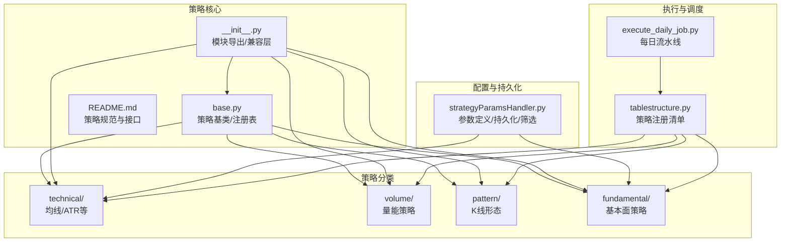
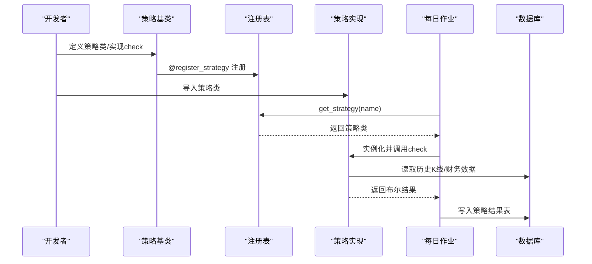
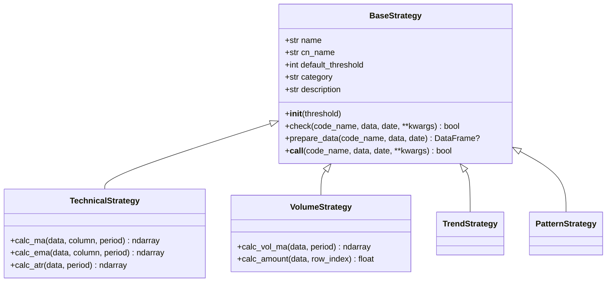
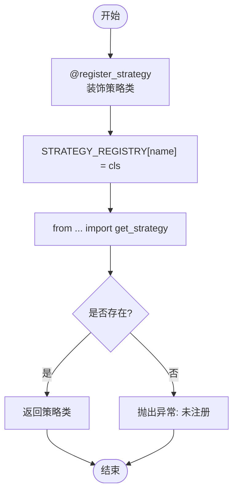
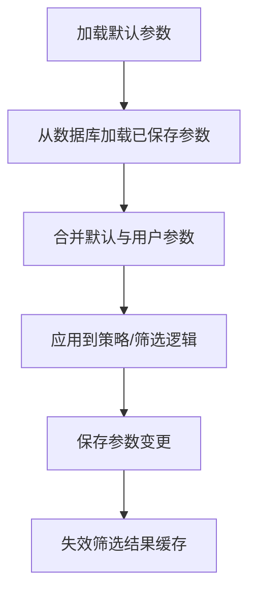
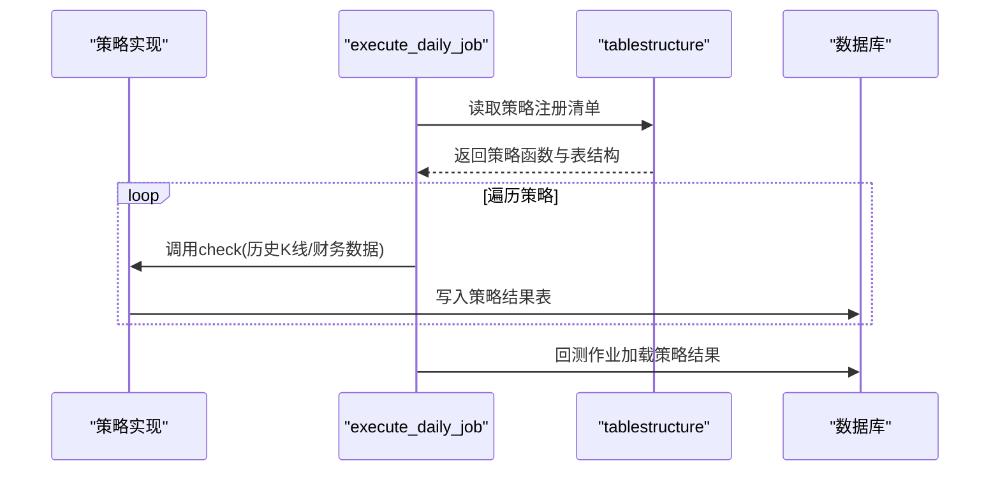
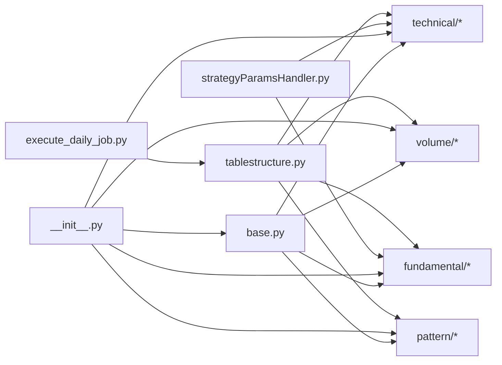

# 策略系统架构

<cite>
**本文引用的文件**
- [quantia/core/strategy/base.py](file://quantia/core/strategy/base.py)
- [quantia/core/strategy/__init__.py](file://quantia/core/strategy/__init__.py)
- [quantia/core/strategy/README.md](file://quantia/core/strategy/README.md)
- [quantia/core/strategy/technical/ma_strategies.py](file://quantia/core/strategy/technical/ma_strategies.py)
- [quantia/core/strategy/volume/volume_strategies.py](file://quantia/core/strategy/volume/volume_strategies.py)
- [quantia/core/strategy/pattern/pattern_strategies.py](file://quantia/core/strategy/pattern/pattern_strategies.py)
- [quantia/core/strategy/fundamental/fundamental_strategies.py](file://quantia/core/strategy/fundamental/fundamental_strategies.py)
- [quantia/core/strategy/backtrace_ma250.py](file://quantia/core/strategy/backtrace_ma250.py)
- [quantia/core/strategy/gpt_value_strategy.py](file://quantia/core/strategy/gpt_value_strategy.py)
- [quantia/core/strategy/fundamental/moat_model.py](file://quantia/core/strategy/fundamental/moat_model.py)
- [quantia/core/tablestructure.py](file://quantia/core/tablestructure.py)
- [quantia/web/strategyParamsHandler.py](file://quantia/web/strategyParamsHandler.py)
- [quantia/job/execute_daily_job.py](file://quantia/job/execute_daily_job.py)
- [quantia/trade/robot/infrastructure/strategy_template.py](file://quantia/trade/robot/infrastructure/strategy_template.py)
- [quantia/trade/robot/infrastructure/default_handler.py](file://quantia/trade/robot/infrastructure/default_handler.py)
- [quantia/trade/robot/infrastructure/strategy_wrapper.py](file://quantia/trade/robot/infrastructure/strategy_wrapper.py)
</cite>

## 目录
1. [引言](#引言)
2. [项目结构](#项目结构)
3. [核心组件](#核心组件)
4. [架构总览](#架构总览)
5. [详细组件分析](#详细组件分析)
6. [依赖关系分析](#依赖关系分析)
7. [性能考虑](#性能考虑)
8. [故障排查指南](#故障排查指南)
9. [结论](#结论)
10. [附录](#附录)

## 引言
本架构文档面向Quantia策略系统，围绕“策略基类设计、策略注册机制、策略分类体系、参数配置管理”展开，系统阐述策略开发模板、策略生命周期管理与动态加载机制，并提供策略模板使用方法、自定义策略开发流程、参数优化技巧、扩展指南与最佳实践，帮助开发者快速构建与部署稳定、可维护的自定义策略。

## 项目结构
策略系统位于 quantia/core/strategy 目录下，采用“按领域分层 + 模块化导出”的组织方式：
- 基类与注册中心：base.py 定义策略抽象与注册表
- 策略分类：technical、volume、pattern、fundamental 子模块分别承载不同类型的策略
- 兼容层：__init__.py 提供统一导出与兼容接口
- 文档与规范：README.md 明确策略接口、注册与执行流程
- 配置与持久化：web 层提供策略参数的查询、保存、重置与动态筛选
- 作业调度：job 层定义每日执行流水线，驱动策略与回测

图表来源
- [quantia/core/strategy/base.py](file://quantia/core/strategy/base.py#L20-L202)
- [quantia/core/strategy/__init__.py](file://quantia/core/strategy/__init__.py#L30-L119)
- [quantia/core/strategy/README.md](file://quantia/core/strategy/README.md#L1-L146)
- [quantia/web/strategyParamsHandler.py](file://quantia/web/strategyParamsHandler.py#L22-L446)
- [quantia/core/tablestructure.py](file://quantia/core/tablestructure.py#L409-L467)
- [quantia/job/execute_daily_job.py](file://quantia/job/execute_daily_job.py#L80-L180)

章节来源
- [quantia/core/strategy/__init__.py](file://quantia/core/strategy/__init__.py#L1-L119)
- [quantia/core/strategy/README.md](file://quantia/core/strategy/README.md#L1-L146)

## 核心组件
- 策略基类与分类基类：提供统一的 check 接口、数据准备、分类标记与注册装饰器
- 策略注册表：集中管理策略类，支持按名称获取与按分类筛选
- 策略实现：技术、量能、形态、基本面四大类策略，覆盖多维选股场景
- 参数配置与持久化：提供参数定义、默认值、用户自定义值合并、数据库持久化与动态筛选
- 执行流水线：每日作业调度，驱动策略计算与回测

章节来源
- [quantia/core/strategy/base.py](file://quantia/core/strategy/base.py#L20-L202)
- [quantia/core/strategy/technical/ma_strategies.py](file://quantia/core/strategy/technical/ma_strategies.py#L22-L237)
- [quantia/core/strategy/volume/volume_strategies.py](file://quantia/core/strategy/volume/volume_strategies.py#L19-L126)
- [quantia/core/strategy/pattern/pattern_strategies.py](file://quantia/core/strategy/pattern/pattern_strategies.py#L22-L276)
- [quantia/core/strategy/fundamental/fundamental_strategies.py](file://quantia/core/strategy/fundamental/fundamental_strategies.py#L30-L351)
- [quantia/web/strategyParamsHandler.py](file://quantia/web/strategyParamsHandler.py#L22-L558)

## 架构总览
策略系统采用“基类抽象 + 注册表 + 分类模块 + 参数持久化 + 作业调度”的分层架构。策略实现遵循统一接口，通过注册表集中管理；参数通过 web 层持久化并支持动态筛选；执行层通过每日作业流水线驱动策略计算与回测。

图表来源
- [quantia/core/strategy/base.py](file://quantia/core/strategy/base.py#L159-L191)
- [quantia/core/tablestructure.py](file://quantia/core/tablestructure.py#L409-L467)
- [quantia/job/execute_daily_job.py](file://quantia/job/execute_daily_job.py#L136-L167)

## 详细组件分析

### 策略基类设计
- 抽象接口：check(code_name, data, date=None, **kwargs) -> bool
- 数据准备：prepare_data 自动按截止日期过滤并校验最小数据长度
- 分类基类：TechnicalStrategy、VolumeStrategy、TrendStrategy、PatternStrategy 提供常用指标计算工具
- 可调用包装：__call__ 直接调用 check，便于统一处理

图表来源
- [quantia/core/strategy/base.py](file://quantia/core/strategy/base.py#L20-L153)

章节来源
- [quantia/core/strategy/base.py](file://quantia/core/strategy/base.py#L20-L96)

### 策略注册机制
- 装饰器注册：@register_strategy 将策略类注册到 STRATEGY_REGISTRY
- 动态获取：get_strategy(name) 按名称获取策略类
- 分类筛选：get_strategies_by_category(category) 按分类返回策略集合
- 统一导出：__init__.py 暴露基类、装饰器与策略实现，便于外部导入

图表来源
- [quantia/core/strategy/base.py](file://quantia/core/strategy/base.py#L159-L191)

章节来源
- [quantia/core/strategy/base.py](file://quantia/core/strategy/base.py#L155-L202)
- [quantia/core/strategy/__init__.py](file://quantia/core/strategy/__init__.py#L30-L42)

### 策略分类体系
- 技术类：均线多头、回踩年线、海龟交易、低ATR成长
- 量能类：放量上涨、放量跌停
- 形态类：突破平台、停机坪、高而窄的旗形、无大幅回撤
- 基本面类：价值投资、成长投资、护城河、股息成长、AI护城河评分模型
- 兼容层：保留旧接口，保证历史策略平滑迁移

章节来源
- [quantia/core/strategy/technical/ma_strategies.py](file://quantia/core/strategy/technical/ma_strategies.py#L22-L237)
- [quantia/core/strategy/volume/volume_strategies.py](file://quantia/core/strategy/volume/volume_strategies.py#L19-L126)
- [quantia/core/strategy/pattern/pattern_strategies.py](file://quantia/core/strategy/pattern/pattern_strategies.py#L22-L276)
- [quantia/core/strategy/fundamental/fundamental_strategies.py](file://quantia/core/strategy/fundamental/fundamental_strategies.py#L30-L351)
- [quantia/core/strategy/README.md](file://quantia/core/strategy/README.md#L28-L59)

### 参数配置管理
- 默认参数定义：DEFAULT_STRATEGY_PARAMS 提供策略参数的默认值与分组说明
- 持久化存储：cn_strategy_params 表存储用户自定义参数，支持覆盖默认值
- 动态合并：get_strategy_params 合并默认与用户自定义值，支持查询、保存、重置
- 动态筛选：FilterStocksHandler 根据当前参数动态筛选股票，支持分页与缓存

图表来源
- [quantia/web/strategyParamsHandler.py](file://quantia/web/strategyParamsHandler.py#L22-L558)

章节来源
- [quantia/web/strategyParamsHandler.py](file://quantia/web/strategyParamsHandler.py#L22-L558)

### 策略开发模板
- 继承基类：选择合适的分类基类（如 TechnicalStrategy）
- 实现 check：按需求实现策略判断逻辑，利用 prepare_data 过滤数据
- 注册策略：使用 @register_strategy 装饰器注册
- 导出与兼容：在 __init__.py 中导出，必要时提供兼容函数
- 参数化：在 web 层定义参数组与字段，支持用户自定义

章节来源
- [quantia/core/strategy/base.py](file://quantia/core/strategy/base.py#L20-L96)
- [quantia/core/strategy/technical/ma_strategies.py](file://quantia/core/strategy/technical/ma_strategies.py#L22-L56)
- [quantia/core/strategy/__init__.py](file://quantia/core/strategy/__init__.py#L30-L42)

### 策略生命周期管理
- 生命周期阶段：数据准备 → 策略计算 → 结果入库 → 回测验证
- 执行流水线：execute_daily_job 按阶段顺序执行，支持跳过与强制执行
- 策略注册清单：tablestructure.py 统一注册 K 线策略与 GPT 综合选股
- 回测集成：回测作业统一加载策略结果并生成收益统计

图表来源
- [quantia/job/execute_daily_job.py](file://quantia/job/execute_daily_job.py#L80-L180)
- [quantia/core/tablestructure.py](file://quantia/core/tablestructure.py#L409-L467)

章节来源
- [quantia/job/execute_daily_job.py](file://quantia/job/execute_daily_job.py#L80-L180)
- [quantia/core/tablestructure.py](file://quantia/core/tablestructure.py#L409-L467)

### 动态加载机制
- 策略动态获取：通过 get_strategy(name) 按名称动态加载策略类
- 执行期装配：作业调度根据注册清单动态调用策略函数
- 参数动态生效：web 层参数变更后，筛选与策略计算立即使用最新参数

章节来源
- [quantia/core/strategy/base.py](file://quantia/core/strategy/base.py#L173-L191)
- [quantia/core/tablestructure.py](file://quantia/core/tablestructure.py#L409-L467)
- [quantia/web/strategyParamsHandler.py](file://quantia/web/strategyParamsHandler.py#L513-L558)

### 策略模板使用方法
- 技术策略模板：继承 TechnicalStrategy，使用 calc_ma/calc_ema/calc_atr 等工具
- 量能策略模板：继承 VolumeStrategy，使用 calc_vol_ma/calc_amount
- 形态策略模板：继承 PatternStrategy，结合量能与技术指标
- 基本面策略模板：继承 BaseStrategy，使用参数化筛选与评分模型

章节来源
- [quantia/core/strategy/technical/ma_strategies.py](file://quantia/core/strategy/technical/ma_strategies.py#L99-L124)
- [quantia/core/strategy/volume/volume_strategies.py](file://quantia/core/strategy/volume/volume_strategies.py#L126-L143)
- [quantia/core/strategy/pattern/pattern_strategies.py](file://quantia/core/strategy/pattern/pattern_strategies.py#L151-L204)
- [quantia/core/strategy/fundamental/fundamental_strategies.py](file://quantia/core/strategy/fundamental/fundamental_strategies.py#L30-L120)

### 自定义策略开发流程
- 明确策略分类与接口：选择合适基类，实现 check 接口
- 设计参数：在 web 层定义参数组与字段，支持用户自定义
- 注册与导出：使用 @register_strategy 注册，更新 __init__.py 导出
- 验证与调试：在本地或测试环境验证策略逻辑与性能
- 集成与发布：加入 tablestructure 注册清单，纳入每日流水线

章节来源
- [quantia/core/strategy/README.md](file://quantia/core/strategy/README.md#L129-L146)
- [quantia/core/strategy/__init__.py](file://quantia/core/strategy/__init__.py#L30-L119)
- [quantia/core/tablestructure.py](file://quantia/core/tablestructure.py#L409-L467)

### 策略参数优化技巧
- 分层参数化：财务安全、盈利能力、成长质量、估值约束四层参数，逐层收紧
- 动态阈值：结合行业特性调整阈值，如银行/地产可放宽资产负债率
- 参数联动：PE/PB 与 ROE/毛利率联动，避免“高估成长”
- 缓存与分页：筛选结果缓存与分页查询，提升交互体验
- A/B/C/D 评级：结合评分阈值给出投资建议

章节来源
- [quantia/web/strategyParamsHandler.py](file://quantia/web/strategyParamsHandler.py#L24-L222)
- [quantia/core/strategy/gpt_value_strategy.py](file://quantia/core/strategy/gpt_value_strategy.py#L23-L43)
- [quantia/core/strategy/fundamental/moat_model.py](file://quantia/core/strategy/fundamental/moat_model.py#L426-L479)

### 扩展指南与最佳实践
- 扩展策略：新增策略文件，继承相应基类，实现 check，使用 @register_strategy 注册
- 参数扩展：在 DEFAULT_STRATEGY_PARAMS 新增参数组，支持默认值与单位标注
- 回测集成：在 tablestructure 中注册策略表结构，纳入回测作业
- 日志与错误处理：使用默认日志处理器，捕获异常并记录
- 并发与资源：策略执行尽量无外部 API，使用本地缓存与数据库读写

章节来源
- [quantia/core/strategy/README.md](file://quantia/core/strategy/README.md#L129-L146)
- [quantia/trade/robot/infrastructure/default_handler.py](file://quantia/trade/robot/infrastructure/default_handler.py#L15-L37)
- [quantia/job/execute_daily_job.py](file://quantia/job/execute_daily_job.py#L80-L180)

## 依赖关系分析
策略系统内部依赖清晰，采用“基类 → 分类模块 → 实现策略 → 注册表/导出”的单向依赖；参数层通过 web 层与策略层解耦，执行层通过 tablestructure 与策略层解耦。

图表来源
- [quantia/core/strategy/base.py](file://quantia/core/strategy/base.py#L20-L202)
- [quantia/core/strategy/__init__.py](file://quantia/core/strategy/__init__.py#L30-L119)
- [quantia/web/strategyParamsHandler.py](file://quantia/web/strategyParamsHandler.py#L22-L558)
- [quantia/core/tablestructure.py](file://quantia/core/tablestructure.py#L409-L467)
- [quantia/job/execute_daily_job.py](file://quantia/job/execute_daily_job.py#L80-L180)

章节来源
- [quantia/core/strategy/__init__.py](file://quantia/core/strategy/__init__.py#L30-L119)
- [quantia/core/tablestructure.py](file://quantia/core/tablestructure.py#L409-L467)

## 性能考虑
- 低内存模式：execute_daily_job 采用流式分析，逐只股票从磁盘缓存读取，峰值内存显著降低
- 无外部API：策略执行阶段不发起外部API，减少网络与超时风险
- 缓存与索引：参数筛选结果缓存、数据库索引优化，提升查询性能
- 并发与资源：策略实现避免阻塞 IO，参数持久化采用批量写入

章节来源
- [quantia/job/execute_daily_job.py](file://quantia/job/execute_daily_job.py#L132-L147)
- [quantia/web/strategyParamsHandler.py](file://quantia/web/strategyParamsHandler.py#L448-L558)

## 故障排查指南
- 策略未注册：检查 @register_strategy 是否正确使用，确认 STRATEGY_REGISTRY 中存在
- 参数未生效：确认 cn_strategy_params 表存在，参数保存成功，筛选结果缓存已失效
- 执行跳过：检查 QUANTIA_FORCE_ANALYSIS 环境变量与 ANALYSIS_DONE_THRESHOLD 阈值
- 日志定位：使用默认日志处理器输出到 stdout 或文件，定位异常堆栈

章节来源
- [quantia/core/strategy/base.py](file://quantia/core/strategy/base.py#L173-L191)
- [quantia/web/strategyParamsHandler.py](file://quantia/web/strategyParamsHandler.py#L450-L511)
- [quantia/job/execute_daily_job.py](file://quantia/job/execute_daily_job.py#L48-L78)
- [quantia/trade/robot/infrastructure/default_handler.py](file://quantia/trade/robot/infrastructure/default_handler.py#L15-L37)

## 结论
Quantia 策略系统通过清晰的基类设计、完善的注册机制、分类化的策略实现、参数化配置与持久化、以及稳定的执行流水线，实现了可扩展、可维护、高性能的策略开发与部署体系。开发者可依据本文档快速上手，遵循最佳实践，构建高质量的自定义策略。

## 附录
- 策略模板：参考 StrategyTemplate 与 ProcessWrapper，实现策略生命周期与并发封装
- 基础设施：日志、进程与线程封装，便于策略运行时监控与资源管理

章节来源
- [quantia/trade/robot/infrastructure/strategy_template.py](file://quantia/trade/robot/infrastructure/strategy_template.py#L9-L43)
- [quantia/trade/robot/infrastructure/strategy_wrapper.py](file://quantia/trade/robot/infrastructure/strategy_wrapper.py#L12-L45)
