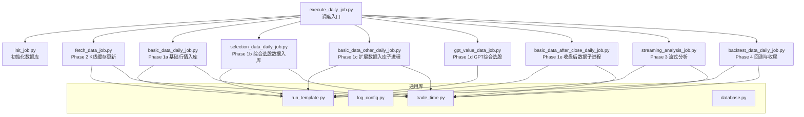
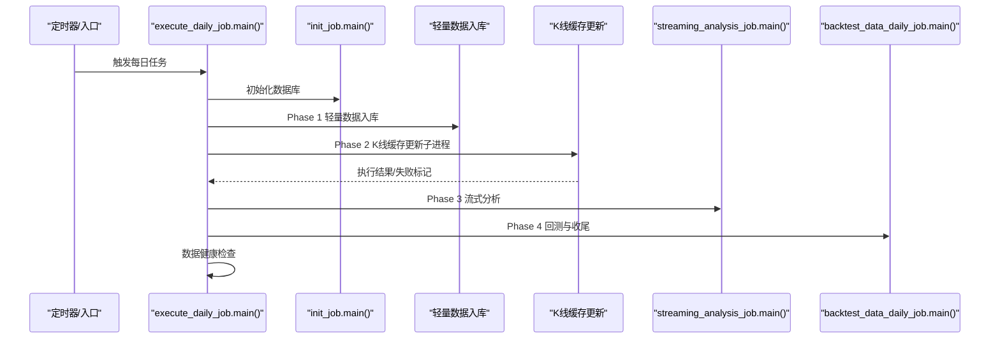
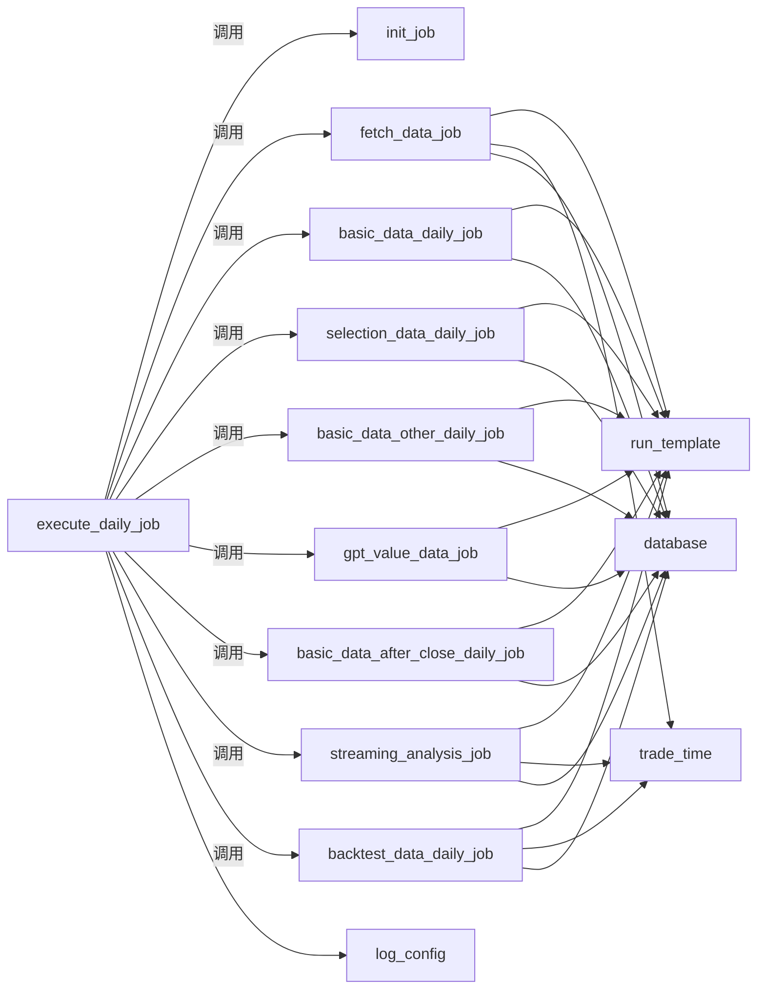

# 任务调度机制

<cite>
**本文引用的文件**
- [execute_daily_job.py](file://docker/stock/quantia/job/execute_daily_job.py)
- [basic_data_daily_job.py](file://docker/stock/quantia/job/basic_data_daily_job.py)
- [selection_data_daily_job.py](file://docker/stock/quantia/job/selection_data_daily_job.py)
- [basic_data_other_daily_job.py](file://docker/stock/quantia/job/basic_data_other_daily_job.py)
- [gpt_value_data_job.py](file://docker/stock/quantia/job/gpt_value_data_job.py)
- [basic_data_after_close_daily_job.py](file://docker/stock/quantia/job/basic_data_after_close_daily_job.py)
- [fetch_data_job.py](file://docker/stock/quantia/job/fetch_data_job.py)
- [streaming_analysis_job.py](file://docker/stock/quantia/job/streaming_analysis_job.py)
- [backtest_data_daily_job.py](file://docker/stock/quantia/job/backtest_data_daily_job.py)
- [run_template.py](file://docker/stock/quantia/lib/run_template.py)
- [trade_time.py](file://docker/stock/quantia/lib/trade_time.py)
</cite>

## 更新摘要
**所做更改**
- 将原有的五阶段执行模型重构为新的四阶段模型
- 新增独立的K线缓存更新阶段（Phase 2），专门处理重量级数据获取
- 引入详细的重试安全机制，包括API获取重试、单例释放重试等
- 优化内存管理策略，采用延迟删除和分批提交机制
- 增强异常处理和故障恢复能力

## 目录
1. [简介](#简介)
2. [项目结构](#项目结构)
3. [核心组件](#核心组件)
4. [架构总览](#架构总览)
5. [详细组件分析](#详细组件分析)
6. [依赖关系分析](#依赖关系分析)
7. [性能考量](#性能考量)
8. [故障排查指南](#故障排查指南)
9. [结论](#结论)
10. [附录](#附录)

## 简介
本文聚焦 Quantia 项目中"每日任务调度"机制，围绕 execute_daily_job 的核心调度逻辑展开，系统阐述其重构后的四阶段执行策略（Phase 0–3）、任务依赖关系、并发控制、异常处理与资源释放、执行顺序的重要性、内存优化与性能监控指标，并提供配置参数说明、调试技巧与故障排查方法。

## 项目结构
- 任务调度入口位于 docker/stock/quantia/job/execute_daily_job.py，负责组织与编排每日流水线。
- 各阶段子任务均以独立脚本形式存在，遵循统一的 run_with_args 调度模板，确保日期解析、批量执行与并发控制的一致性。
- 通用库位于 docker/stock/quantia/lib 下，为各阶段提供日期处理、数据库连接、交易日工具等支撑能力。

**图表来源**
- [execute_daily_job.py](file://docker/stock/quantia/job/execute_daily_job.py#L108-L254)
- [run_template.py](file://docker/stock/quantia/lib/run_template.py#L18-L95)

**章节来源**
- [execute_daily_job.py](file://docker/stock/quantia/job/execute_daily_job.py#L108-L254)
- [run_template.py](file://docker/stock/quantia/lib/run_template.py#L18-L95)

## 核心组件
- 调度入口与阶段编排：execute_daily_job.main() 按阶段顺序组织任务，串联初始化、轻量数据入库、K线缓存更新、流式分析与回测收尾。
- 日期与批量调度模板：run_with_args 提供统一的日期解析、批量日期/日期区间并发执行能力。
- 交易日与时点判断：trade_time 提供交易日判定、历史区间计算与交易时段判断。
- 子进程隔离机制：通过独立子进程运行重量级任务，防止OOM波及主进程。
- 重试安全机制：内置API获取重试、单例释放重试等多重保护措施。

**章节来源**
- [execute_daily_job.py](file://docker/stock/quantia/job/execute_daily_job.py#L108-L254)
- [run_template.py](file://docker/stock/quantia/lib/run_template.py#L18-L95)
- [trade_time.py](file://docker/stock/quantia/lib/trade_time.py#L171-L184)

## 架构总览
execute_daily_job 将每日任务重构为四个阶段，通过"轻量-重量级-分析-回测"的有序执行，确保关键数据的安全性和系统的稳定性。新增的独立K线缓存更新阶段专门处理内存密集型任务，采用子进程隔离和重试安全机制，显著提升系统的容错能力和执行效率。

**图表来源**
- [execute_daily_job.py](file://docker/stock/quantia/job/execute_daily_job.py#L108-L254)

## 详细组件分析

### 阶段划分与设计理念
- **Phase 0：初始化**
  - 设计目标：建立数据库连接，准备执行环境。
  - 关键点：数据库表结构检查、索引优化、连接池初始化。
- **Phase 1：轻量数据入库（API密集，集中式调用）**
  - 设计目标：将所有外部API调用集中在 Phase 1，确保关键数据安全入库。
  - 包含任务：实时行情预加载、基础数据入库、综合选股数据、扩展数据入库、GPT选股、收盘后数据。
  - 优化：扩展数据和收盘后数据通过独立子进程执行，防止OOM。
- **Phase 2：重量级数据获取 — K线缓存批量更新**
  - 设计目标：专门处理 ~5000 只股票的历史K线增量缓存，内存密集型操作。
  - 关键点：独立子进程执行、OOM保护、失败标记机制。
- **Phase 3：流式分析（零API，低内存）**
  - 设计目标：单次遍历所有股票，按需读取缓存，指标/K线/策略并行计算，批量写入数据库。
  - 优化：延迟删除、分批提交、显式释放内存，峰值内存显著下降。
- **Phase 4：回测与收尾**
  - 设计目标：对策略结果进行回测汇总，清理资源，执行健康检查。

**章节来源**
- [execute_daily_job.py](file://docker/stock/quantia/job/execute_daily_job.py#L108-L254)
- [fetch_data_job.py](file://docker/stock/quantia/job/fetch_data_job.py#L38-L111)
- [basic_data_daily_job.py](file://docker/stock/quantia/job/basic_data_daily_job.py#L79-L93)
- [streaming_analysis_job.py](file://docker/stock/quantia/job/streaming_analysis_job.py#L118-L200)
- [backtest_data_daily_job.py](file://docker/stock/quantia/job/backtest_data_daily_job.py#L34-L86)

### 任务依赖关系管理
- **顺序依赖**
  - Phase 0 必须在所有阶段之前完成。
  - Phase 1 的关键数据（综合选股、GPT选股等）为 Phase 3/4 提供基础。
  - Phase 2 的K线缓存为 Phase 3 提供数据支持。
  - Phase 3 的分析结果为 Phase 4 回测提供输入。
- **松耦合**
  - 各阶段通过统一模板 run_with_args 接受日期参数，避免硬编码。
  - 分析阶段不直接发起API，仅依赖数据库/缓存，降低耦合度。
  - 子进程隔离机制确保阶段间的故障不会相互传播。

**章节来源**
- [execute_daily_job.py](file://docker/stock/quantia/job/execute_daily_job.py#L108-L254)
- [run_template.py](file://docker/stock/quantia/lib/run_template.py#L18-L95)

### 并发执行控制
- **Phase 1：轻量数据入库**
  - 各子任务独立执行，通过独立子进程运行扩展数据和收盘后数据。
  - 避免API风暴，确保关键数据优先入库。
- **Phase 2：K线缓存更新**
  - 独立子进程执行，设置长时间超时（36000秒）。
  - 失败时设置环境变量标记，供后续阶段感知。
- **Phase 3：流式分析**
  - 外层并发：控制同时处理的策略表数量（通过环境变量 QUANTIA_BACKTEST_OUTER_WORKERS，默认1）。
  - 内层并发：单次处理批次内的股票并发（通过 QUANTIA_ANALYSIS_WORKERS，默认2）。
  - 分批提交：每批处理完成后批量写入并释放内存。
- **Phase 4：回测**
  - 外层并发：顺序处理多个策略表（默认1），避免数据库连接池争用。
  - 内层并发：每批50只股票并发计算（可调 QUANTIA_BACKTEST_INNER_WORKERS，默认2）。

**章节来源**
- [execute_daily_job.py](file://docker/stock/quantia/job/execute_daily_job.py#L48-L74)
- [streaming_analysis_job.py](file://docker/stock/quantia/job/streaming_analysis_job.py#L48-L55)
- [backtest_data_daily_job.py](file://docker/stock/quantia/job/backtest_data_daily_job.py#L53-L91)

### 异常处理机制
- **阶段级 try-except**：每个阶段捕获自身异常并记录日志，不影响其他阶段执行。
- **重试安全机制**：
  - 选股数据获取失败时进行一次重试。
  - 流式分析在数据库无股票列表时，降级为从 stock_data 单例获取（可能发起API）。
  - 单例释放失败时自动重试，确保资源正确释放。
- **子进程隔离**：重量级任务在独立子进程中执行，失败不影响主进程。
- **失败标记机制**：Phase 2 失败时设置环境变量，供 Phase 3 感知并采取相应措施。
- **分析完成状态检查**：通过阈值与数据库计数判断是否跳过 Phase 3/4，避免重复执行。

**章节来源**
- [execute_daily_job.py](file://docker/stock/quantia/job/execute_daily_job.py#L187-L208)
- [selection_data_daily_job.py](file://docker/stock/quantia/job/selection_data_daily_job.py#L26-L36)
- [streaming_analysis_job.py](file://docker/stock/quantia/job/streaming_analysis_job.py#L137-L155)
- [basic_data_other_daily_job.py](file://docker/stock/quantia/job/basic_data_other_daily_job.py#L28-L44)

### 资源释放策略
- **单例释放**：在 Phase 2 失败后释放 stock_data 单例，允许 Phase 3 重试。
- **内存回收**：分批处理后显式清空缓冲区并调用垃圾回收，降低峰值内存。
- **数据库连接**：统一通过 engine() 单例连接池，避免频繁创建销毁。
- **延迟删除**：仅在首次写入时清理当日数据，避免中途崩溃导致数据丢失。
- **子进程清理**：独立子进程结束后自动清理资源。

**章节来源**
- [execute_daily_job.py](file://docker/stock/quantia/job/execute_daily_job.py#L175-L208)
- [streaming_analysis_job.py](file://docker/stock/quantia/job/streaming_analysis_job.py#L193-L200)
- [backtest_data_daily_job.py](file://docker/stock/quantia/job/backtest_data_daily_job.py#L85-L86)

### 执行顺序的重要性
- **数据采集与分析分离**：必须先完成 Phase 1 和 Phase 2，才能在 Phase 3 使用缓存与数据库。
- **依赖表存在性**：Phase 3 从数据库读取股票列表，若 Phase 1 未执行，需降级至单例。
- **缓存完整性**：Phase 2 的K线缓存为 Phase 3 提供数据支持，失败时 Phase 3 会使用现有缓存。
- **回测依赖**：回测汇总依赖各策略表的选股记录与回测字段。

**章节来源**
- [execute_daily_job.py](file://docker/stock/quantia/job/execute_daily_job.py#L216-L226)
- [streaming_analysis_job.py](file://docker/stock/quantia/job/streaming_analysis_job.py#L137-L160)

### 内存管理优化
- **分阶段内存控制**：通过阶段划分，避免一次性加载所有数据到内存。
- **低内存模式**：Phase 2 仅更新磁盘缓存，不驻留内存。
- **流式处理**：逐只股票读取缓存，处理完立即释放。
- **分批写入**：减少数据库连接开销与内存峰值。
- **延迟删除**：仅在首次写入时清理当日数据，避免中途崩溃导致数据丢失。
- **子进程隔离**：重量级任务在独立进程中执行，避免主进程内存压力。

**章节来源**
- [fetch_data_job.py](file://docker/stock/quantia/job/fetch_data_job.py#L79-L111)
- [streaming_analysis_job.py](file://docker/stock/quantia/job/streaming_analysis_job.py#L118-L200)

### 性能监控指标
- **执行耗时**：入口记录开始与结束时间，阶段内记录关键步骤耗时。
- **数据量**：记录处理/跳过/错误数量，便于评估稳定性。
- **并发参数**：通过环境变量调整 workers 与批大小，平衡吞吐与资源占用。
- **健康检查**：输出各核心表当日条数、最新日期与总计，辅助排查"页面无数据"。
- **子进程状态**：监控独立子进程的执行状态和超时情况。

**章节来源**
- [execute_daily_job.py](file://docker/stock/quantia/job/execute_daily_job.py#L256-L301)
- [streaming_analysis_job.py](file://docker/stock/quantia/job/streaming_analysis_job.py#L118-L200)

## 依赖关系分析
- **调度依赖**
  - execute_daily_job 依赖各阶段脚本的 main() 与 run_with_args。
  - 各阶段脚本依赖 run_template、trade_time、database、log_config。
- **数据依赖**
  - Phase 3 依赖 Phase 1 的基础数据表与 Phase 2 的缓存。
  - Phase 4 依赖 Phase 3/1 的结果表。
- **并发与资源**
  - database.engine() 单例连接池限制并发连接数。
  - trade_time 提供交易日与时区判断，影响历史区间与执行时机。
- **子进程依赖**
  - Phase 1c 和 Phase 1e 通过独立子进程运行，依赖操作系统进程管理。

**图表来源**
- [execute_daily_job.py](file://docker/stock/quantia/job/execute_daily_job.py#L29-L37)
- [run_template.py](file://docker/stock/quantia/lib/run_template.py#L18-L95)
- [trade_time.py](file://docker/stock/quantia/lib/trade_time.py#L171-L184)

**章节来源**
- [execute_daily_job.py](file://docker/stock/quantia/job/execute_daily_job.py#L29-L37)
- [run_template.py](file://docker/stock/quantia/lib/run_template.py#L18-L95)

## 性能考量
- **I/O 优化**：Phase 1 批量缓存，Phase 3/4 从缓存读取，I/O 次数从多次遍历降至单次遍历。
- **内存优化**：通过分阶段执行，峰值内存从约 1670 MB 降至小于 100 MB。
- **并发参数调优**：根据服务器资源调整 QUANTIA_ANALYSIS_WORKERS、QUANTIA_BACKTEST_INNER_WORKERS、QUANTIA_BACKTEST_OUTER_WORKERS 与 QUANTIA_BATCH_SIZE。
- **连接池**：database.engine() 限制最大连接数，避免资源耗尽。
- **子进程优化**：独立子进程执行重量级任务，避免主进程内存压力。

**章节来源**
- [streaming_analysis_job.py](file://docker/stock/quantia/job/streaming_analysis_job.py#L118-L200)
- [execute_daily_job.py](file://docker/stock/quantia/job/execute_daily_job.py#L187-L196)

## 故障排查指南
- **日志定位**
  - 使用统一日志配置，查看对应阶段日志文件与错误汇总文件。
  - 关注子进程执行状态和超时信息。
- **常见问题**
  - 数据库不可用：检查 init_job 是否成功创建数据库与基础表。
  - API 失败：Phase 1 失败会导致后续分析无数据，检查网络与接口可用性。
  - K线缓存更新失败：检查内存使用情况，考虑增加服务器内存。
  - 单例为空：Phase 2 返回 None 时会释放单例，Phase 3 会重试，必要时手动触发 Phase 1。
  - 回测无数据：确认策略表存在且包含当日记录，检查回测字段是否已填充。
- **健康检查**
  - 使用数据健康检查输出，核对核心表当日条数与最新日期。
  - 检查子进程执行状态和环境变量设置。

**章节来源**
- [execute_daily_job.py](file://docker/stock/quantia/job/execute_daily_job.py#L256-L301)
- [basic_data_other_daily_job.py](file://docker/stock/quantia/job/basic_data_other_daily_job.py#L28-L44)
- [basic_data_after_close_daily_job.py](file://docker/stock/quantia/job/basic_data_after_close_daily_job.py#L21-L37)

## 结论
execute_daily_job 通过重构的四阶段划分与依赖管理，实现了"初始化-轻量数据-缓存更新-分析回测"的高效流水线。新增的独立K线缓存更新阶段和详细的重试安全机制，显著提升了系统的稳定性和容错能力。通过子进程隔离、延迟删除与统一调度模板，系统在保证稳定性的同时大幅降低了资源消耗与执行风险。通过合理的并发参数与健康检查机制，能够有效支撑生产环境的持续运行。

## 附录

### 任务调度配置参数说明
- **QUANTIA_FORCE_ANALYSIS=1**：强制执行 Phase 3/4，忽略分析完成阈值。
- **QUANTIA_ANALYSIS_DONE_THRESHOLD**：分析完成阈值（默认1000），决定是否跳过分析阶段。
- **QUANTIA_BATCH_SIZE**：流式分析批量写入大小（默认50）。
- **QUANTIA_ANALYSIS_WORKERS**：流式分析并发线程数（默认2）。
- **QUANTIA_BACKTEST_OUTER_WORKERS**：回测外层并发（默认1）。
- **QUANTIA_BACKTEST_INNER_WORKERS**：回测内层并发（默认2）。
- **QUANTIA_PHASE2_FAILED**：Phase 2 失败标记（由系统自动设置）。

### 重试安全机制配置
- **API获取重试**：基本数据获取任务支持最多1次重试，重试间隔10秒。
- **单例释放重试**：单例释放失败时自动重试，确保资源正确释放。
- **子进程超时**：K线缓存更新子进程超时时间为36000秒。
- **防限流延迟**：各API任务间设置30秒延迟，避免接口限流。

**章节来源**
- [execute_daily_job.py](file://docker/stock/quantia/job/execute_daily_job.py#L43-L43)
- [streaming_analysis_job.py](file://docker/stock/quantia/job/streaming_analysis_job.py#L48-L55)
- [backtest_data_daily_job.py](file://docker/stock/quantia/job/backtest_data_daily_job.py#L53-L91)
- [basic_data_other_daily_job.py](file://docker/stock/quantia/job/basic_data_other_daily_job.py#L22-L26)
- [basic_data_after_close_daily_job.py](file://docker/stock/quantia/job/basic_data_after_close_daily_job.py#L21-L21)
