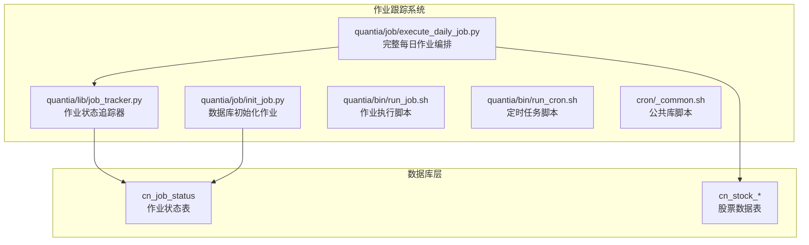
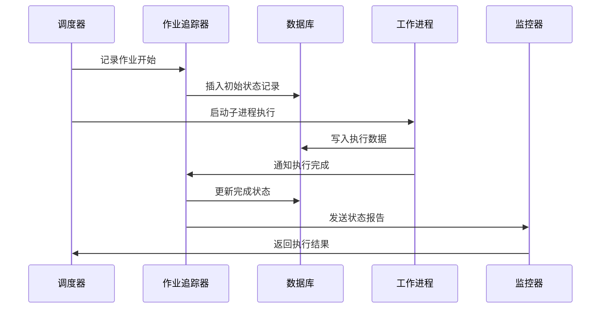
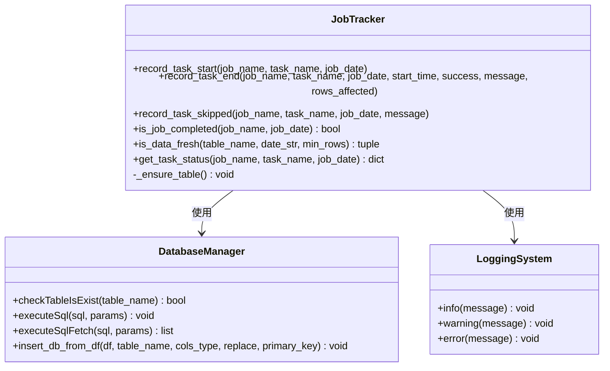
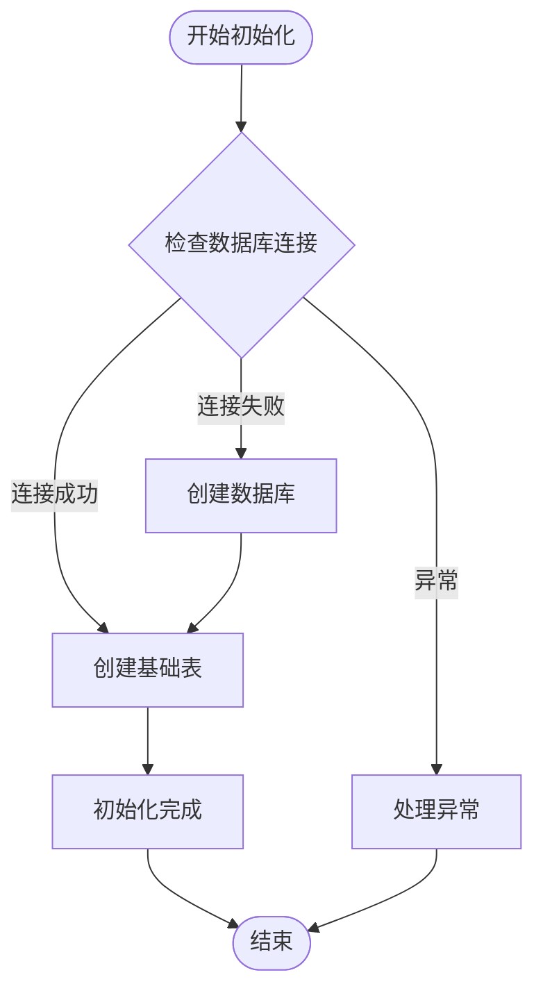
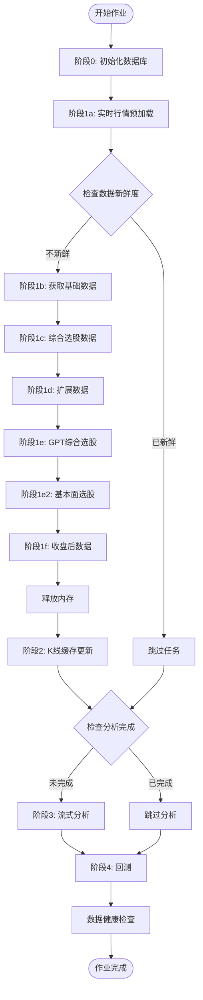
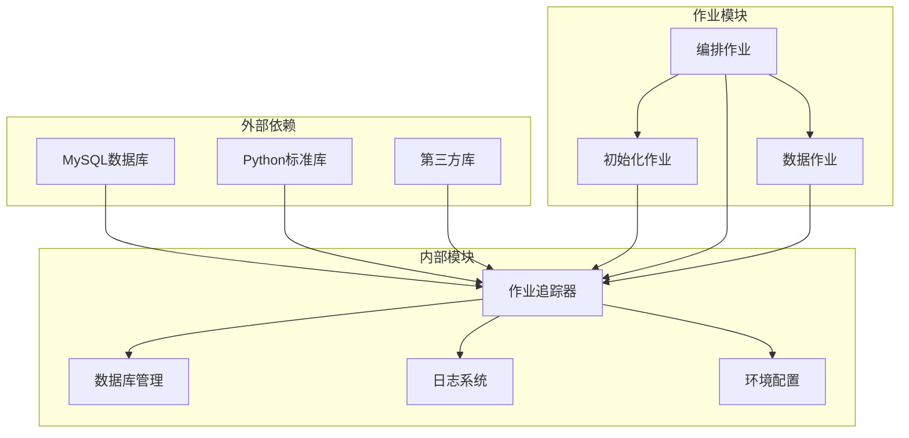

# 作业跟踪系统

<cite>
**本文档引用的文件**
- [README.md](file://README.md)
- [QUICKSTART.md](file://QUICKSTART.md)
- [job_tracker.py](file://quantia/lib/job_tracker.py)
- [init_job.py](file://quantia/job/init_job.py)
- [execute_daily_job.py](file://quantia/job/execute_daily_job.py)
- [_common.sh](file://cron/_common.sh)
- [run_job.sh](file://quantia/bin/run_job.sh)
- [run_cron.sh](file://quantia/bin/run_cron.sh)
</cite>

## 目录
1. [简介](#简介)
2. [项目结构](#项目结构)
3. [核心组件](#核心组件)
4. [架构概览](#架构概览)
5. [详细组件分析](#详细组件分析)
6. [依赖关系分析](#依赖关系分析)
7. [性能考虑](#性能考虑)
8. [故障排除指南](#故障排除指南)
9. [结论](#结论)

## 简介

作业跟踪系统是Quantia股票分析系统的核心基础设施，负责监控和管理各类数据处理作业的状态。该系统实现了完整的作业生命周期管理，包括作业启动、执行监控、状态追踪、异常处理和结果记录等功能。

系统采用模块化设计，通过统一的作业跟踪器提供标准化的状态管理接口，支持多种类型的作业执行模式，包括独立子进程执行、数据新鲜度检查、作业完成状态验证等高级功能。

## 项目结构

作业跟踪系统主要分布在以下目录结构中：

**图表来源**
- [job_tracker.py:1-233](file://quantia/lib/job_tracker.py#L1-L233)
- [init_job.py:1-122](file://quantia/job/init_job.py#L1-L122)
- [execute_daily_job.py:1-425](file://quantia/job/execute_daily_job.py#L1-L425)

**章节来源**
- [README.md:1-800](file://README.md#L1-L800)
- [QUICKSTART.md:1-207](file://QUICKSTART.md#L1-L207)

## 核心组件

### 作业状态追踪器

作业状态追踪器是系统的核心组件，提供以下关键功能：

- **状态记录**：记录作业的开始、结束、跳过状态
- **时间追踪**：精确记录作业执行耗时
- **数据新鲜度检查**：验证数据完整性
- **作业完成验证**：检查作业是否成功完成

### 数据库初始化作业

负责创建和维护系统所需的数据库结构：

- **数据库创建**：自动创建主数据库实例
- **基础表创建**：创建关注股票表和交易日历表
- **连接重试机制**：处理远程数据库连接不稳定问题

### 完整每日作业编排器

实现复杂的作业编排逻辑：

- **阶段化执行**：将复杂作业分解为多个阶段
- **子进程隔离**：防止内存溢出影响主进程
- **智能跳过**：基于数据新鲜度检查跳过已完成作业
- **健康检查**：作业完成后验证数据完整性

**章节来源**
- [job_tracker.py:1-233](file://quantia/lib/job_tracker.py#L1-L233)
- [init_job.py:1-122](file://quantia/job/init_job.py#L1-L122)
- [execute_daily_job.py:1-425](file://quantia/job/execute_daily_job.py#L1-L425)

## 架构概览

系统采用分层架构设计，实现了作业执行与状态管理的解耦：

**图表来源**
- [job_tracker.py:62-127](file://quantia/lib/job_tracker.py#L62-L127)
- [execute_daily_job.py:208-371](file://quantia/job/execute_daily_job.py#L208-L371)

系统架构特点：

1. **模块化设计**：每个组件职责明确，易于维护和扩展
2. **状态持久化**：所有作业状态都持久化存储
3. **异常处理**：完善的错误捕获和恢复机制
4. **监控集成**：实时状态监控和告警功能

## 详细组件分析

### 作业状态追踪器详细分析

作业状态追踪器实现了完整的作业生命周期管理：

**图表来源**
- [job_tracker.py:33-233](file://quantia/lib/job_tracker.py#L33-L233)

#### 关键功能实现

1. **状态记录机制**：
   - 使用UPSER技术确保状态记录的原子性
   - 支持开始、结束、跳过三种状态
   - 自动计算执行耗时

2. **数据新鲜度检查**：
   - 基于表行数的阈值检查
   - 支持自定义阈值配置
   - 防止重复执行已完成作业

3. **作业完成验证**：
   - 检查特定任务的完成状态
   - 支持整体作业完成状态验证
   - 提供详细的状态信息

**章节来源**
- [job_tracker.py:1-233](file://quantia/lib/job_tracker.py#L1-L233)

### 数据库初始化作业分析

数据库初始化作业提供了健壮的数据库管理功能：

**图表来源**
- [init_job.py:58-117](file://quantia/job/init_job.py#L58-L117)

#### 核心特性

1. **连接重试机制**：
   - 支持多次连接尝试
   - 自动处理超时和断开连接
   - 提供详细的错误信息

2. **幂等操作**：
   - 数据库创建操作幂等
   - 表创建操作幂等
   - 避免重复初始化

3. **错误处理**：
   - 详细的异常捕获
   - 错误信息记录
   - 失败原因分析

**章节来源**
- [init_job.py:1-122](file://quantia/job/init_job.py#L1-L122)

### 完整每日作业编排器分析

作业编排器实现了复杂的多阶段作业管理：

**图表来源**
- [execute_daily_job.py:195-425](file://quantia/job/execute_daily_job.py#L195-L425)

#### 编排策略

1. **阶段化执行**：
   - 轻量任务优先执行
   - 内存密集型任务独立运行
   - 支持智能跳过机制

2. **子进程隔离**：
   - 使用独立进程防止内存溢出
   - 支持超时控制
   - 提供进程状态监控

3. **数据完整性保障**：
   - 作业状态持久化
   - 数据新鲜度检查
   - 健康检查机制

**章节来源**
- [execute_daily_job.py:1-425](file://quantia/job/execute_daily_job.py#L1-L425)

## 依赖关系分析

系统依赖关系清晰，模块间耦合度低：

**图表来源**
- [job_tracker.py:24-25](file://quantia/lib/job_tracker.py#L24-L25)
- [execute_daily_job.py:51-57](file://quantia/job/execute_daily_job.py#L51-L57)

**章节来源**
- [job_tracker.py:1-233](file://quantia/lib/job_tracker.py#L1-L233)
- [execute_daily_job.py:1-425](file://quantia/job/execute_daily_job.py#L1-L425)

## 性能考虑

系统在设计时充分考虑了性能优化：

1. **内存管理**：
   - 子进程隔离防止内存泄漏
   - 及时释放不需要的对象
   - 支持垃圾回收机制

2. **I/O优化**：
   - 批量数据库操作
   - 缓存机制减少重复查询
   - 流式处理大数据集

3. **并发处理**：
   - 多进程并行执行
   - 异步数据库操作
   - 非阻塞I/O处理

4. **资源控制**：
   - 进程超时控制
   - 内存使用限制
   - CPU使用监控

## 故障排除指南

### 常见问题及解决方案

1. **数据库连接失败**：
   - 检查数据库服务状态
   - 验证连接参数配置
   - 查看连接重试日志

2. **作业执行超时**：
   - 检查系统资源使用情况
   - 调整超时参数设置
   - 分析作业执行时间

3. **数据新鲜度检查失败**：
   - 验证数据表结构
   - 检查数据完整性
   - 确认阈值配置正确

4. **作业状态异常**：
   - 查看作业状态表
   - 检查数据库权限
   - 验证状态记录逻辑

**章节来源**
- [job_tracker.py:176-201](file://quantia/lib/job_tracker.py#L176-L201)
- [init_job.py:64-85](file://quantia/job/init_job.py#L64-L85)

## 结论

作业跟踪系统通过模块化设计和标准化的状态管理，为Quantia股票分析系统提供了可靠的作业执行基础设施。系统的主要优势包括：

1. **可靠性**：完善的错误处理和恢复机制
2. **可观测性**：完整的作业状态追踪和监控
3. **可扩展性**：模块化设计支持功能扩展
4. **性能优化**：多进程并行和内存管理优化
5. **易用性**：简单直观的API和配置选项

该系统为量化投资分析提供了坚实的技术基础，支持大规模数据处理和实时分析需求。
