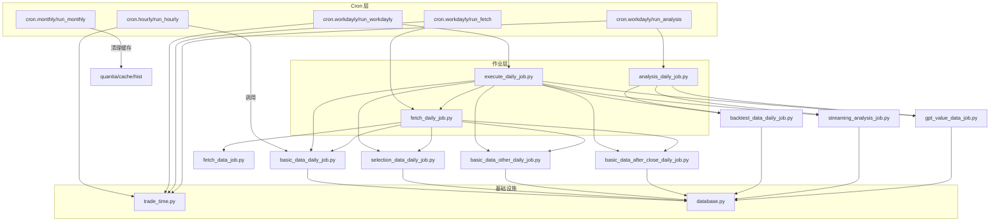
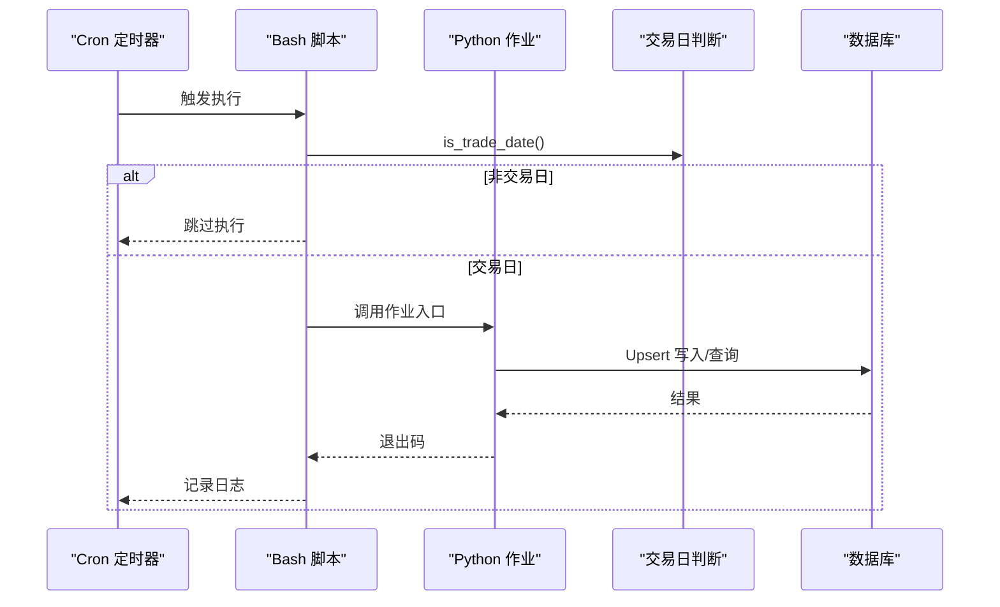
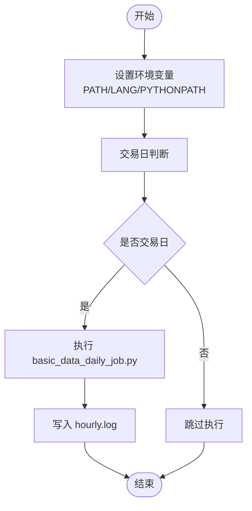
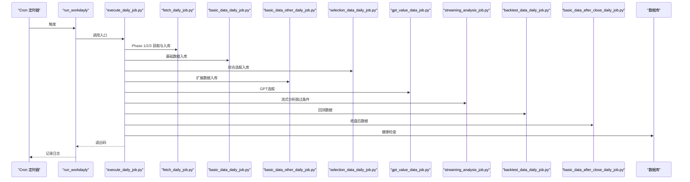
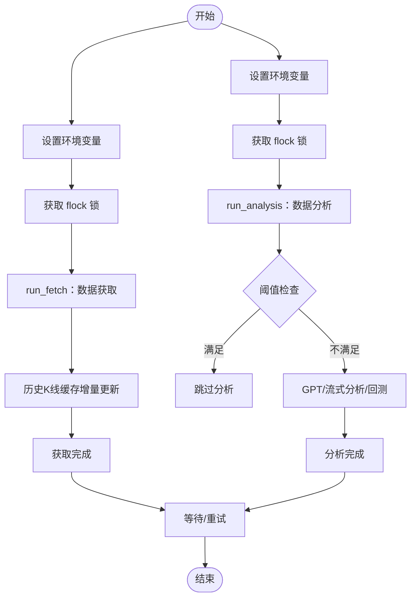
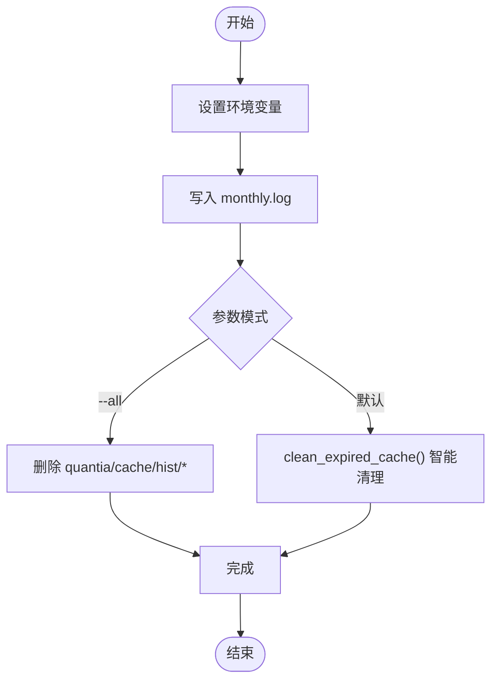
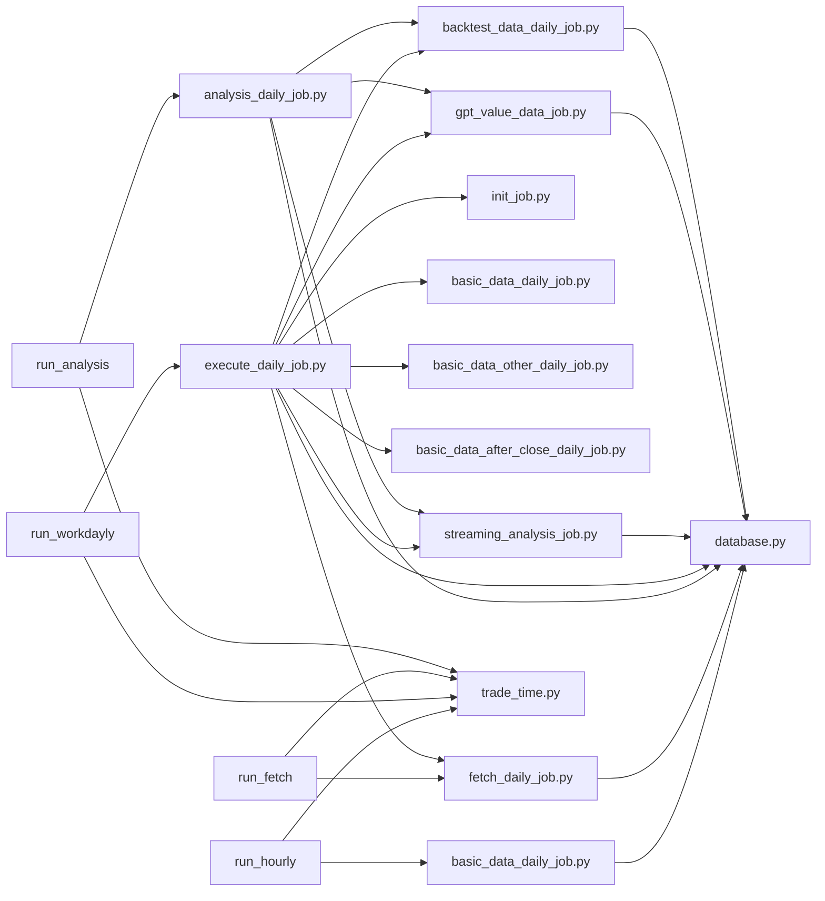

# 定时任务配置

<cite>
**本文引用的文件**
- [cron/README.md](file://cron/README.md)
- [cron/cron.hourly/run_hourly](file://cron/cron.hourly/run_hourly)
- [cron/cron.workdayly/run_workdayly](file://cron/cron.workdayly/run_workdayly)
- [cron/cron.workdayly/run_fetch](file://cron/cron.workdayly/run_fetch)
- [cron/cron.workdayly/run_analysis](file://cron/cron.workdayly/run_analysis)
- [cron/cron.monthly/run_monthly](file://cron/cron.monthly/run_monthly)
- [quantia/job/execute_daily_job.py](file://quantia/job/execute_daily_job.py)
- [quantia/job/fetch_daily_job.py](file://quantia/job/fetch_daily_job.py)
- [quantia/job/analysis_daily_job.py](file://quantia/job/analysis_daily_job.py)
- [quantia/lib/trade_time.py](file://quantia/lib/trade_time.py)
- [quantia/lib/database.py](file://quantia/lib/database.py)
</cite>

## 目录
1. [简介](#简介)
2. [项目结构](#项目结构)
3. [核心组件](#核心组件)
4. [架构总览](#架构总览)
5. [详细组件分析](#详细组件分析)
6. [依赖关系分析](#依赖关系分析)
7. [性能考量](#性能考量)
8. [故障排查指南](#故障排查指南)
9. [结论](#结论)
10. [附录](#附录)

## 简介
本运维文档面向 Quantia 定时任务配置系统，围绕 Cron 定时任务的配置方法、执行频率、任务依赖管理展开，系统性说明小时级、工作日级、月度级三类任务的设计理念与触发条件，涵盖执行环境、资源限制、监控与重试、状态跟踪、部署与日志管理、故障排查与性能优化建议。目标是帮助运维人员与开发者稳定、高效地运行数据采集与分析流水线。

## 项目结构
定时任务相关的核心文件分布如下：
- cron 层：提供 Bash 启动脚本，封装环境变量、日志与锁文件控制，统一调用 Python 作业。
- quantia/job 层：提供可独立运行的 Python 作业，实现“获取/分析/回测”等模块化流程。
- quantia/lib 层：提供交易日判断、数据库连接与 Upsert 写入等基础设施。

图表来源
- [cron/cron.hourly/run_hourly](file://cron/cron.hourly/run_hourly#L1-L42)
- [cron/cron.workdayly/run_workdayly](file://cron/cron.workdayly/run_workdayly#L1-L31)
- [cron/cron.workdayly/run_fetch](file://cron/cron.workdayly/run_fetch#L1-L28)
- [cron/cron.workdayly/run_analysis](file://cron/cron.workdayly/run_analysis#L1-L35)
- [cron/cron.monthly/run_monthly](file://cron/cron.monthly/run_monthly#L1-L29)
- [quantia/job/execute_daily_job.py](file://quantia/job/execute_daily_job.py#L1-L231)
- [quantia/job/fetch_daily_job.py](file://quantia/job/fetch_daily_job.py#L1-L121)
- [quantia/job/analysis_daily_job.py](file://quantia/job/analysis_daily_job.py#L1-L149)
- [quantia/lib/trade_time.py](file://quantia/lib/trade_time.py#L1-L224)
- [quantia/lib/database.py](file://quantia/lib/database.py#L1-L304)

章节来源
- [cron/README.md](file://cron/README.md#L1-L332)

## 核心组件
- 小时级任务（每小时）
  - 触发条件：工作日交易时段外（非交易日直接跳过）
  - 作用：采集当日基础行情数据，适合收盘后或交易时段内多次执行
  - 关键脚本：cron/cron.hourly/run_hourly
  - 调用作业：basic_data_daily_job.py
- 工作日级任务（每日完整流水线）
  - 触发条件：工作日（交易日判断）
  - 设计：五阶段流水线（获取/基础入库/扩展入库/分析/回测与收尾），支持“拆分模式”与“一体模式”
  - 关键脚本：cron/cron.workdayly/run_workdayly
  - 调用作业：execute_daily_job.py
- 工作日级任务（拆分模式）
  - 数据获取（API密集）：run_fetch → fetch_daily_job.py
  - 数据分析（本地计算）：run_analysis → analysis_daily_job.py
  - 两脚本使用不同锁文件，互不阻塞；分析阶段具备“本地优先跳过”能力
- 月度级任务（每月）
  - 触发条件：每月固定时间
  - 作用：智能清理历史K线缓存（默认模式/全量模式）
  - 关键脚本：cron/cron.monthly/run_monthly

章节来源
- [cron/README.md](file://cron/README.md#L7-L141)
- [cron/cron.hourly/run_hourly](file://cron/cron.hourly/run_hourly#L1-L42)
- [cron/cron.workdayly/run_workdayly](file://cron/cron.workdayly/run_workdayly#L1-L31)
- [cron/cron.workdayly/run_fetch](file://cron/cron.workdayly/run_fetch#L1-L28)
- [cron/cron.workdayly/run_analysis](file://cron/cron.workdayly/run_analysis#L1-L35)
- [cron/cron.monthly/run_monthly](file://cron/cron.monthly/run_monthly#L1-L29)

## 架构总览
定时任务采用“脚本层 + 作业层 + 基础设施层”的分层设计：
- 脚本层负责环境准备、日志、锁文件与交易日判断
- 作业层负责具体业务流程（获取/分析/回测/入库）
- 基础设施层提供交易日判定与数据库连接、Upsert 写入

图表来源
- [cron/cron.hourly/run_hourly](file://cron/cron.hourly/run_hourly#L18-L33)
- [cron/cron.workdayly/run_fetch](file://cron/cron.workdayly/run_fetch#L20-L21)
- [cron/cron.workdayly/run_analysis](file://cron/cron.workdayly/run_analysis#L27-L28)
- [quantia/lib/trade_time.py](file://quantia/lib/trade_time.py#L12-L21)
- [quantia/lib/database.py](file://quantia/lib/database.py#L94-L106)

## 详细组件分析

### 小时级任务（每小时）
- 设计理念
  - 交易日非交易时段外跳过，避免无效调用
  - 轻量级基础数据采集，支持多次执行
- 执行流程
  - 设置 PATH/LANG/PYTHONPATH
  - 交易日判断：通过 trade_time.is_trade_date() 检测
  - 日志输出至 quantia/log/hourly.log
  - 调用 basic_data_daily_job.py 执行基础行情入库
- 锁与并发
  - 使用 flock -xn 锁文件避免重复执行
- 适用场景
  - 收盘后更新当日收盘行情
  - 交易时段内获取盘中快照

图表来源
- [cron/cron.hourly/run_hourly](file://cron/cron.hourly/run_hourly#L7-L42)
- [quantia/lib/trade_time.py](file://quantia/lib/trade_time.py#L12-L21)

章节来源
- [cron/README.md](file://cron/README.md#L17-L25)
- [cron/cron.hourly/run_hourly](file://cron/cron.hourly/run_hourly#L1-L42)

### 工作日级任务（完整流水线）
- 设计理念
  - 五阶段流水线：获取 → 基础入库 → 扩展入库 → 分析 → 回测与收尾
  - “一体模式”串行执行；“拆分模式”将获取与分析解耦，提升稳定性与效率
  - 分析阶段具备“本地优先跳过”能力，避免重复计算
- 执行流程
  - 初始化数据库
  - 数据获取（API密集，含历史K线缓存增量更新）
  - 基础数据入库（实时行情/综合选股）
  - 扩展数据入库（资金流向/龙虎榜/筹码等）
  - GPT综合选股（基于数据库筛选）
  - 流式分析（技术指标/K线形态/策略）
  - 回测数据计算
  - 收盘后数据（大宗交易等）
  - 数据健康检查（核对核心表当日数据）
- 重试与容错
  - flock -xn 锁文件避免并发
  - 分析阶段阈值检查，支持强制执行
  - 数据写入采用 Upsert 与重试，降低瞬态错误影响

图表来源
- [cron/cron.workdayly/run_workdayly](file://cron/cron.workdayly/run_workdayly#L1-L31)
- [quantia/job/execute_daily_job.py](file://quantia/job/execute_daily_job.py#L80-L179)

章节来源
- [cron/README.md](file://cron/README.md#L27-L58)
- [cron/cron.workdayly/run_workdayly](file://cron/cron.workdayly/run_workdayly#L1-L31)
- [quantia/job/execute_daily_job.py](file://quantia/job/execute_daily_job.py#L1-L231)

### 工作日级任务（拆分模式：获取与分析）
- 数据获取（run_fetch）
  - 顺序：初始化数据库 → 基础数据入库 → 扩展数据入库 → 收盘后数据 → 历史K线缓存更新（内存密集，最后执行）
  - 优点：将 API 密集阶段与内存密集阶段分离，降低 OOM 风险
- 数据分析（run_analysis）
  - 本地优先跳过：通过阈值检查 cn_stock_indicators 当日记录数，决定是否跳过
  - 强制执行：设置 QUANTIA_FORCE_ANALYSIS=1
  - 环境变量：QUANTIA_ANALYSIS_DONE_THRESHOLD（默认 1000）

图表来源
- [cron/cron.workdayly/run_fetch](file://cron/cron.workdayly/run_fetch#L1-L28)
- [cron/cron.workdayly/run_analysis](file://cron/cron.workdayly/run_analysis#L1-L35)
- [quantia/job/analysis_daily_job.py](file://quantia/job/analysis_daily_job.py#L60-L96)

章节来源
- [cron/README.md](file://cron/README.md#L100-L141)
- [cron/cron.workdayly/run_fetch](file://cron/cron.workdayly/run_fetch#L1-L28)
- [cron/cron.workdayly/run_analysis](file://cron/cron.workdayly/run_analysis#L1-L35)
- [quantia/job/analysis_daily_job.py](file://quantia/job/analysis_daily_job.py#L1-L149)

### 月度级任务（缓存清理）
- 设计理念
  - 智能清理：删除退市/长期未更新的缓存；保留活跃/停牌/长假期间缓存
  - 全量模式：--all 参数删除所有缓存，下次运行全量重建
- 执行流程
  - 设置环境变量
  - 写入 monthly.log
  - 智能清理或全量删除
- 适用场景
  - 定期释放磁盘空间，维护缓存健康

图表来源
- [cron/cron.monthly/run_monthly](file://cron/cron.monthly/run_monthly#L1-L29)

章节来源
- [cron/README.md](file://cron/README.md#L60-L73)
- [cron/cron.monthly/run_monthly](file://cron/cron.monthly/run_monthly#L1-L29)

### 交易日判断与时间窗口
- 交易日判断
  - trade_time.is_trade_date() 基于交易日历判定
  - 非交易日跳过小时级任务
- 时间窗口
  - 交易时段：上午 9:15-11:30，下午 13:00-15:00
  - 休市/集合竞价/尾盘：用于控制执行时机

章节来源
- [quantia/lib/trade_time.py](file://quantia/lib/trade_time.py#L12-L21)
- [quantia/lib/trade_time.py](file://quantia/lib/trade_time.py#L58-L117)

### 数据库与写入策略
- 连接与池化
  - SQLAlchemy 单例连接池，2核2G服务器优化：pool_size=2, max_overflow=3
  - 超时与预检：pool_recycle=600, pool_pre_ping=True
- 写入策略
  - Upsert：INSERT ... ON DUPLICATE KEY UPDATE，避免重复与并发冲突
  - 瞬态错误重试：死锁、锁超时、连接异常等，最多重试3次
- 健康检查
  - execute_daily_job 在流水线结束后检查核心表当日数据，便于排查“页面无数据”

章节来源
- [quantia/lib/database.py](file://quantia/lib/database.py#L55-L71)
- [quantia/lib/database.py](file://quantia/lib/database.py#L94-L106)
- [quantia/lib/database.py](file://quantia/lib/database.py#L109-L116)
- [quantia/lib/database.py](file://quantia/lib/database.py#L120-L203)
- [quantia/job/execute_daily_job.py](file://quantia/job/execute_daily_job.py#L174-L226)

## 依赖关系分析
- 脚本到作业
  - run_hourly → basic_data_daily_job.py
  - run_workdayly → execute_daily_job.py
  - run_fetch → fetch_daily_job.py
  - run_analysis → analysis_daily_job.py
- 作业到模块
  - execute_daily_job.py 串联 init/fetch/basic/other/after/gpt/sa/bt 等模块
  - analysis_daily_job.py 串联 gpt/sa/bt 与阈值检查
- 基础设施
  - 交易日判断：trade_time.is_trade_date()
  - 数据库：Upsert/重试/连接池

图表来源
- [cron/cron.hourly/run_hourly](file://cron/cron.hourly/run_hourly#L36-L36)
- [cron/cron.workdayly/run_workdayly](file://cron/cron.workdayly/run_workdayly#L25-L25)
- [cron/cron.workdayly/run_fetch](file://cron/cron.workdayly/run_fetch#L21-L21)
- [cron/cron.workdayly/run_analysis](file://cron/cron.workdayly/run_analysis#L28-L28)
- [quantia/job/execute_daily_job.py](file://quantia/job/execute_daily_job.py#L29-L37)
- [quantia/job/fetch_daily_job.py](file://quantia/job/fetch_daily_job.py#L46-L51)
- [quantia/job/analysis_daily_job.py](file://quantia/job/analysis_daily_job.py#L46-L50)
- [quantia/lib/trade_time.py](file://quantia/lib/trade_time.py#L1-L224)
- [quantia/lib/database.py](file://quantia/lib/database.py#L1-L304)

章节来源
- [cron/README.md](file://cron/README.md#L1-L332)
- [quantia/job/execute_daily_job.py](file://quantia/job/execute_daily_job.py#L1-L231)
- [quantia/job/fetch_daily_job.py](file://quantia/job/fetch_daily_job.py#L1-L121)
- [quantia/job/analysis_daily_job.py](file://quantia/job/analysis_daily_job.py#L1-L149)

## 性能考量
- 内存与并发
  - 拆分模式：将 API 密集阶段与内存密集阶段分离，降低 OOM 风险
  - 流式分析：峰值内存 < 100 MB，避免全量加载
  - 连接池：小规格服务器 pool_size=2，max_overflow=3，平衡吞吐与稳定性
- I/O 与缓存
  - 历史K线缓存 gzip + pickle，增量更新，损坏自动全量重建
  - 首次全量，后续补缺，显著缩短执行时间
- 瞬态错误与重试
  - Upsert + 重试（最多3次），自动恢复 API 失败
  - 数据库连接瞬态错误自动重试与连接池清理
- 执行时机
  - 分析阶段安排在 22:00，给首次 K 线缓存下载留足时间
  - 重试服务安排在凌晨 1:00/1:30（周二到周六），覆盖周一到周五的数据

章节来源
- [cron/README.md](file://cron/README.md#L135-L141)
- [cron/README.md](file://cron/README.md#L174-L180)
- [quantia/lib/database.py](file://quantia/lib/database.py#L55-L71)
- [quantia/lib/database.py](file://quantia/lib/database.py#L120-L203)

## 故障排查指南
- 常见问题定位
  - 页面无数据：执行数据健康检查，核对核心表当日数据
  - 任务未执行：检查交易日判断与锁文件占用
  - 内存不足：确认拆分模式执行顺序，避免 K 线缓存更新与 API 调用同时进行
- 日志与状态
  - 日志位置：quantia/log/*.log
  - 退出码：脚本记录成功/失败与退出码
- 补跑与重试
  - 支持按日期补跑（带日期参数的作业）
  - 重试服务：凌晨 1:00/1:30 重试获取与分析
- 数据完整性
  - Upsert 与重试机制保障幂等
  - 缓存损坏自动全量重建，API 失败不覆盖已有数据

章节来源
- [cron/README.md](file://cron/README.md#L162-L164)
- [cron/README.md](file://cron/README.md#L168-L212)
- [quantia/job/execute_daily_job.py](file://quantia/job/execute_daily_job.py#L174-L226)
- [cron/cron.workdayly/run_analysis](file://cron/cron.workdayly/run_analysis#L8-L12)

## 结论
通过小时级、工作日级、月度级三类任务的协同，结合拆分模式的获取/分析解耦、流式分析与缓存策略、Upsert 写入与瞬态错误重试，Quantia 定时任务配置系统实现了高可靠性、高性能与易运维的数据采集与分析流水线。建议在生产环境中严格遵循执行时机与锁文件策略，配合健康检查与补跑机制，确保数据连续性与一致性。

## 附录
- 部署与环境变量
  - 执行权限：chmod +x 各脚本
  - Python 依赖：pip3 install -r requirements.txt
  - 数据库配置：通过环境变量覆盖 quantia/lib/database.py 中默认值
  - 交易日配置：依赖 quantia/lib/trade_time.py 的交易日历
- 监控与告警
  - 建议基于日志与退出码建立监控告警
  - 关注 hourly/workdayly/monthly 三类任务的执行时长与失败率
- 历史数据补跑
  - 支持按日期参数补跑（示例见 README）

章节来源
- [cron/README.md](file://cron/README.md#L144-L164)
- [cron/README.md](file://cron/README.md#L194-L212)
- [quantia/lib/database.py](file://quantia/lib/database.py#L24-L45)
- [quantia/lib/trade_time.py](file://quantia/lib/trade_time.py#L1-L224)
