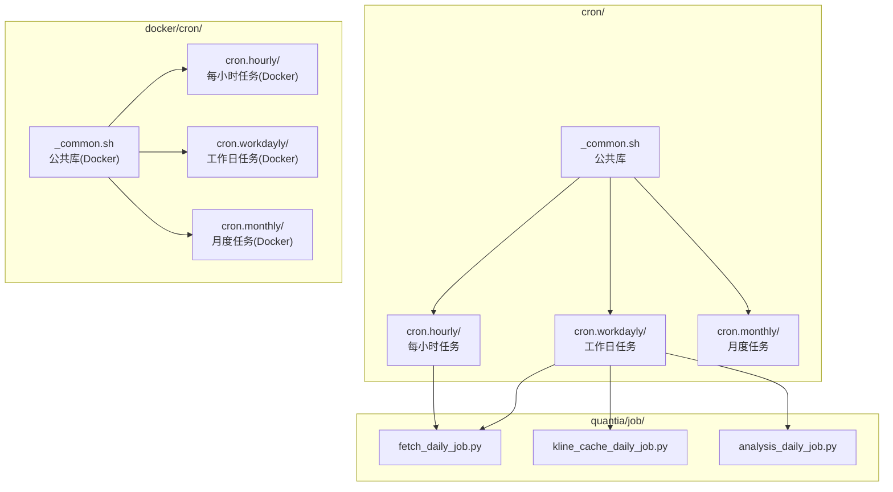
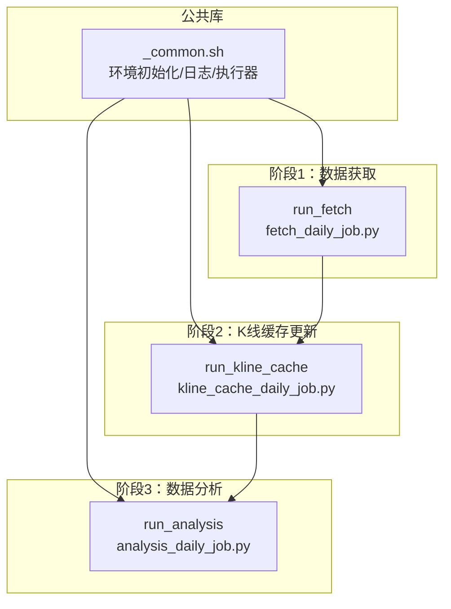
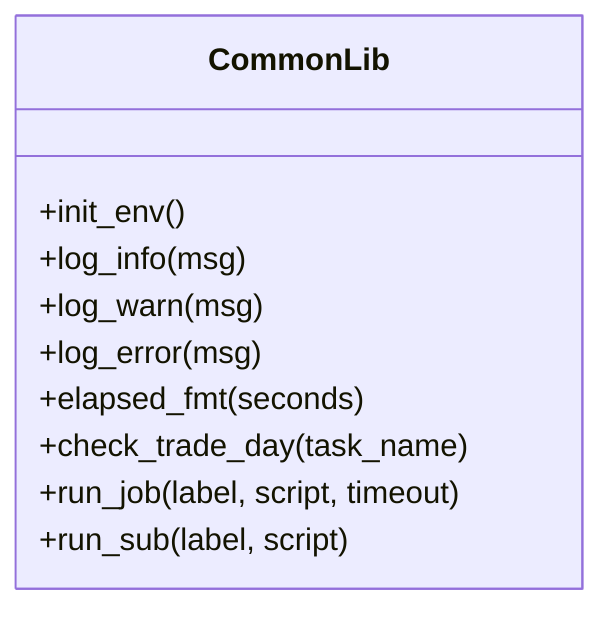
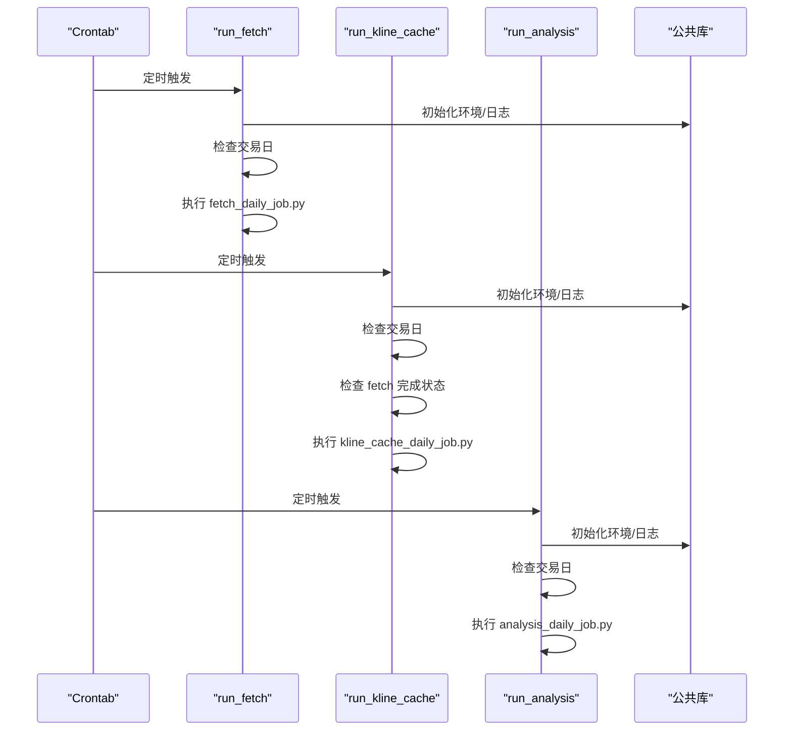
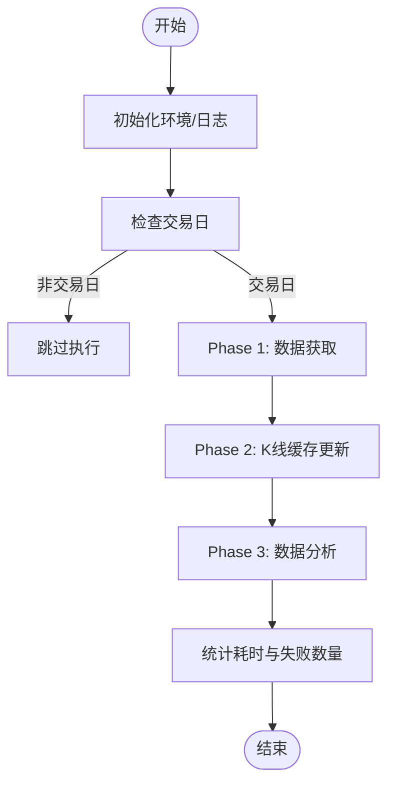
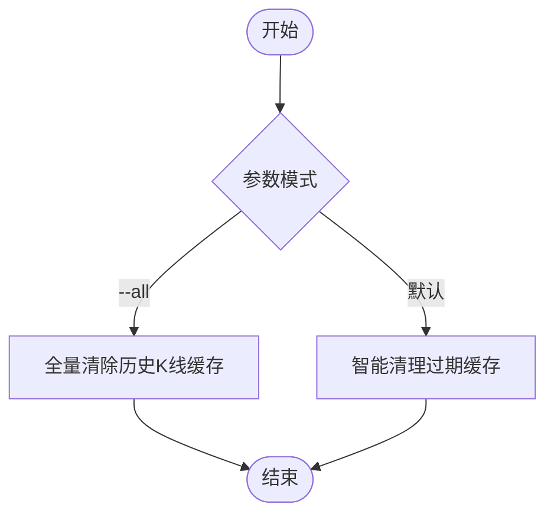
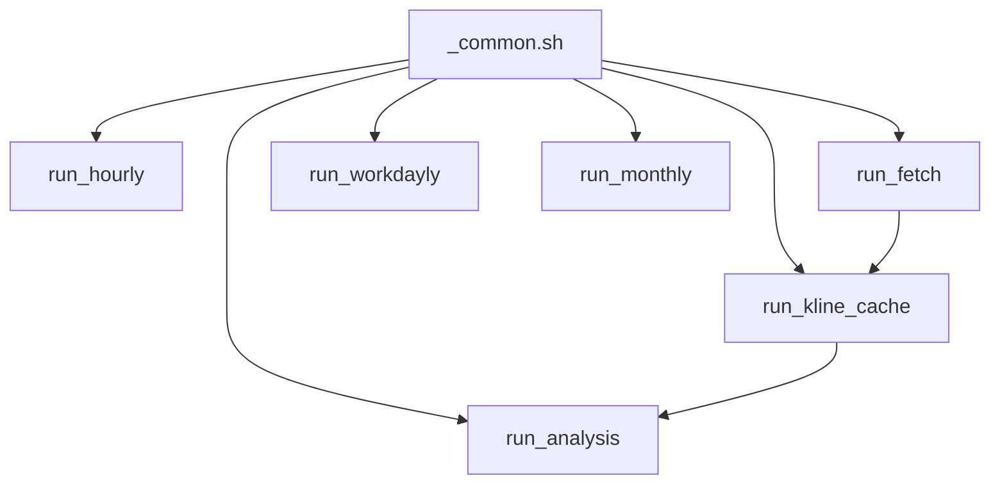

# Cron脚本架构重构

<cite>
**本文档引用的文件**
- [cron/README.md](file://cron/README.md)
- [cron/_common.sh](file://cron/_common.sh)
- [docker/cron/_common.sh](file://docker/cron/_common.sh)
- [docker/cron/cron.hourly/run_hourly](file://docker/cron/cron.hourly/run_hourly)
- [docker/cron/cron.workdayly/run_fetch](file://docker/cron/cron.workdayly/run_fetch)
- [docker/cron/cron.workdayly/run_kline_cache](file://docker/cron/cron.workdayly/run_kline_cache)
- [docker/cron/cron.workdayly/run_analysis](file://docker/cron/cron.workdayly/run_analysis)
- [docker/cron/cron.workdayly/run_workdayly](file://docker/cron/cron.workdayly/run_workdayly)
- [docker/cron/cron.monthly/run_monthly](file://docker/cron/cron.monthly/run_monthly)
</cite>

## 目录
1. [简介](#简介)
2. [项目结构](#项目结构)
3. [核心组件](#核心组件)
4. [架构总览](#架构总览)
5. [详细组件分析](#详细组件分析)
6. [依赖关系分析](#依赖关系分析)
7. [性能考虑](#性能考虑)
8. [故障排除指南](#故障排除指南)
9. [结论](#结论)

## 简介
本项目对Cron定时任务进行了全面的架构重构，目标是实现模块化、可维护、可扩展且具备高可靠性的数据采集与分析流水线。重构后的架构采用“公共库 + 分阶段编排”的设计，将所有Shell脚本共享一个公共库，消除重复代码；同时将每日任务拆分为三个独立阶段，既可并行运行，又能在失败时互不影响。

该架构的核心优势包括：
- 统一的环境初始化与日志管理
- 严格的交易日检测与防重复执行
- 阶段间弱耦合与可插拔的编排器
- Docker与裸机双环境一致的运行体验
- 完善的异常恢复与历史补跑机制

## 项目结构
重构后的Cron脚本位于 `cron/` 和 `docker/cron/` 目录中，分别对应裸机与Docker两种部署方式。整体结构如下：

图表来源
- [cron/_common.sh:1-125](file://cron/_common.sh#L1-L125)
- [docker/cron/_common.sh:1-116](file://docker/cron/_common.sh#L1-L116)
- [docker/cron/cron.hourly/run_hourly:1-10](file://docker/cron/cron.hourly/run_hourly#L1-L10)
- [docker/cron/cron.workdayly/run_fetch:1-11](file://docker/cron/cron.workdayly/run_fetch#L1-L11)
- [docker/cron/cron.workdayly/run_kline_cache:1-13](file://docker/cron/cron.workdayly/run_kline_cache#L1-L13)
- [docker/cron/cron.workdayly/run_analysis:1-13](file://docker/cron/cron.workdayly/run_analysis#L1-L13)
- [docker/cron/cron.workdayly/run_workdayly:1-26](file://docker/cron/cron.workdayly/run_workdayly#L1-L26)
- [docker/cron/cron.monthly/run_monthly:1-23](file://docker/cron/cron.monthly/run_monthly#L1-L23)

章节来源
- [cron/README.md:1-290](file://cron/README.md#L1-L290)

## 核心组件
- 公共库（_common.sh）
  - 提供统一的环境初始化、日志工具、交易日检测、任务执行器等能力
  - 支持超时控制、格式化耗时输出、阶段化日志分隔
- 每小时任务（run_hourly）
  - 采集实时行情数据，面向盘中与收盘后的快照
- 工作日任务（run_fetch / run_kline_cache / run_analysis）
  - 数据获取：集中执行外部API数据采集
  - K线缓存更新：基于fetch结果进行增量更新
  - 数据分析：本地计算（指标、策略、回测）
- 编排器（run_workdayly）
  - 串行执行上述三个阶段，便于单机一键运行
- 月度任务（run_monthly）
  - 智能清理过期缓存或全量清除

章节来源
- [cron/_common.sh:1-125](file://cron/_common.sh#L1-L125)
- [docker/cron/_common.sh:1-116](file://docker/cron/_common.sh#L1-L116)
- [docker/cron/cron.hourly/run_hourly:1-10](file://docker/cron/cron.hourly/run_hourly#L1-L10)
- [docker/cron/cron.workdayly/run_fetch:1-11](file://docker/cron/cron.workdayly/run_fetch#L1-L11)
- [docker/cron/cron.workdayly/run_kline_cache:1-13](file://docker/cron/cron.workdayly/run_kline_cache#L1-L13)
- [docker/cron/cron.workdayly/run_analysis:1-13](file://docker/cron/cron.workdayly/run_analysis#L1-L13)
- [docker/cron/cron.workdayly/run_workdayly:1-26](file://docker/cron/cron.workdayly/run_workdayly#L1-L26)
- [docker/cron/cron.monthly/run_monthly:1-23](file://docker/cron/cron.monthly/run_monthly#L1-L23)

## 架构总览
重构后的架构采用“三阶段流水线 + 公共库复用”的设计，确保各阶段独立运行、互不阻塞，并通过统一的公共库实现一致的日志与环境管理。

图表来源
- [cron/_common.sh:1-125](file://cron/_common.sh#L1-L125)
- [docker/cron/cron.workdayly/run_fetch:1-11](file://docker/cron/cron.workdayly/run_fetch#L1-L11)
- [docker/cron/cron.workdayly/run_kline_cache:1-13](file://docker/cron/cron.workdayly/run_kline_cache#L1-L13)
- [docker/cron/cron.workdayly/run_analysis:1-13](file://docker/cron/cron.workdayly/run_analysis#L1-L13)

## 详细组件分析

### 公共库（_common.sh）分析
公共库是所有Cron脚本的基础设施，提供以下能力：
- 环境初始化：设置PATH、编码、PYTHONPATH，加载.env文件，创建日志目录
- 日志工具：带时间戳的分级日志输出
- 交易日检测：通过Python模块判断是否为交易日，非交易日自动跳过
- 任务执行器：run_job封装Python脚本执行，支持超时控制与耗时统计
- 子脚本执行器：run_sub用于编排器串行执行其他Shell脚本

图表来源
- [cron/_common.sh:1-125](file://cron/_common.sh#L1-L125)

章节来源
- [cron/_common.sh:1-125](file://cron/_common.sh#L1-L125)
- [docker/cron/_common.sh:1-116](file://docker/cron/_common.sh#L1-L116)

### 每日流水线与阶段间依赖
每日流水线分为三个阶段，彼此弱耦合，失败不影响其他阶段执行。阶段间的依赖关系如下：
- K线缓存更新阶段通过检查任务完成状态决定是否执行
- 数据分析阶段可独立运行，使用历史数据亦可完成计算

图表来源
- [docker/cron/cron.workdayly/run_fetch:1-11](file://docker/cron/cron.workdayly/run_fetch#L1-L11)
- [docker/cron/cron.workdayly/run_kline_cache:1-13](file://docker/cron/cron.workdayly/run_kline_cache#L1-L13)
- [docker/cron/cron.workdayly/run_analysis:1-13](file://docker/cron/cron.workdayly/run_analysis#L1-L13)
- [cron/_common.sh:1-125](file://cron/_common.sh#L1-L125)

章节来源
- [cron/README.md:73-96](file://cron/README.md#L73-L96)

### 编排器（run_workdayly）分析
编排器提供串行执行的能力，便于单机一键运行完整流程。其特点：
- 串行调用三个子脚本
- 统计总体耗时并输出阶段分隔日志
- 对失败进行计数并汇总结果

图表来源
- [docker/cron/cron.workdayly/run_workdayly:1-26](file://docker/cron/cron.workdayly/run_workdayly#L1-L26)

章节来源
- [docker/cron/cron.workdayly/run_workdayly:1-26](file://docker/cron/cron.workdayly/run_workdayly#L1-L26)

### 月度清理任务（run_monthly）分析
月度任务提供两种清理模式：
- 智能清理：根据业务规则清理过期缓存
- 全量清除：删除所有历史K线缓存

图表来源
- [docker/cron/cron.monthly/run_monthly:1-23](file://docker/cron/cron.monthly/run_monthly#L1-L23)

章节来源
- [docker/cron/cron.monthly/run_monthly:1-23](file://docker/cron/cron.monthly/run_monthly#L1-L23)

## 依赖关系分析
重构后的依赖关系清晰，公共库作为所有脚本的基础设施，被各阶段任务与编排器共同依赖。阶段之间的依赖通过任务完成状态检查实现弱耦合。

图表来源
- [cron/_common.sh:1-125](file://cron/_common.sh#L1-L125)
- [docker/cron/cron.hourly/run_hourly:1-10](file://docker/cron/cron.hourly/run_hourly#L1-L10)
- [docker/cron/cron.workdayly/run_fetch:1-11](file://docker/cron/cron.workdayly/run_fetch#L1-L11)
- [docker/cron/cron.workdayly/run_kline_cache:1-13](file://docker/cron/cron.workdayly/run_kline_cache#L1-L13)
- [docker/cron/cron.workdayly/run_analysis:1-13](file://docker/cron/cron.workdayly/run_analysis#L1-L13)
- [docker/cron/cron.workdayly/run_workdayly:1-26](file://docker/cron/cron.workdayly/run_workdayly#L1-L26)
- [docker/cron/cron.monthly/run_monthly:1-23](file://docker/cron/cron.monthly/run_monthly#L1-L23)

章节来源
- [cron/README.md:1-290](file://cron/README.md#L1-L290)

## 性能考虑
- 并行执行：三个阶段分别在不同时间点运行，互不阻塞，提升整体吞吐
- 增量更新：K线缓存采用增量模式，避免重复拉取已有数据
- 超时控制：run_job支持超时限制，防止长时间阻塞
- 并发参数：通过环境变量控制并发度与批次大小，平衡性能与资源占用
- Docker一致性：Docker版本与裸机版本共享同一公共库，确保行为一致

## 故障排除指南
- 重复执行问题
  - 使用flock排他锁防止同类任务并发执行
  - check_trade_day在非交易日自动跳过
  - Python端具备数据新鲜度检查与完成状态检查，避免重复写入
- 异常恢复
  - K线缓存：增量逻辑+损坏检测，支持自动全量重拉
  - 各Job异常后可单独重跑，支持历史补跑
- 日志定位
  - 每个阶段输出独立日志文件，便于快速定位问题
  - 编排器输出阶段分隔日志，清晰展示执行过程

章节来源
- [cron/README.md:208-290](file://cron/README.md#L208-L290)

## 结论
本次Cron脚本架构重构以“公共库复用 + 分阶段流水线 + 弱耦合编排”为核心思想，实现了高可用、易维护、可扩展的数据采集与分析体系。通过严格的幂等性设计与完善的异常恢复机制，系统能够在复杂环境中稳定运行，满足生产级需求。
