# 运营可靠性与Cron作业改进

<cite>
**本文档引用的文件**
- [README.md](file://README.md)
- [cron/README.md](file://cron/README.md)
- [run_hourly](file://docker/cron/cron.hourly/run_hourly)
- [run_workdayly](file://docker/cron/cron.workdayly/run_workdayly)
- [run_fetch](file://docker/cron/cron.workdayly/run_fetch)
- [run_analysis](file://docker/cron/cron.workdayly/run_analysis)
- [run_monthly](file://docker/cron/cron.monthly/run_monthly)
- [run_cron.sh](file://docker/stock/quantia/bin/run_cron.sh)
- [Dockerfile](file://docker/Dockerfile)
- [supervisord.conf](file://supervisor/supervisord.conf)
- [requirements.txt](file://requirements.txt)
- [stockfetch.py](file://quantia/core/stockfetch.py)
- [dataTableHandler.py](file://quantia/web/dataTableHandler.py)
- [job_tracker.py](file://docker/stock/quantia/lib/job_tracker.py)
- [init_job.py](file://docker/stock/quantia/job/init_job.py)
- [basic_data_daily_job.py](file://docker/stock/quantia/job/basic_data_daily_job.py)
- [fetch_daily_job.py](file://docker/stock/quantia/job/fetch_daily_job.py)
- [envconfig.py](file://docker/stock/quantia/lib/envconfig.py)
</cite>

## 更新摘要
**所做更改**
- 新增作业跟踪系统章节，详细介绍 cn_job_status 表和状态追踪机制
- 更新性能配置系统章节，新增环境变量配置和动态参数调整
- 增强架构概览图，反映新的作业状态管理和性能配置集成
- 更新 Cron 作业组件分析，加入作业状态检查和前置依赖机制
- 新增数据库初始化作业和连接重试机制
- 完善错误处理与重试机制，增加作业完成状态检查

## 目录
1. [引言](#引言)
2. [项目结构](#项目结构)
3. [核心组件](#核心组件)
4. [架构概览](#架构概览)
5. [详细组件分析](#详细组件分析)
6. [依赖关系分析](#依赖关系分析)
7. [性能考虑](#性能考虑)
8. [故障排除指南](#故障排除指南)
9. [结论](#结论)

## 引言

本项目是一个综合性的股票选择系统，具备数据抓取、指标计算、形态识别、策略选股、回测验证和自动交易等功能。系统采用Docker容器化部署，通过Cron定时任务实现自动化运营，确保数据的及时性和准确性。

系统的核心目标是提供可靠的股票数据处理和分析服务，支持多种部署方式（本地安装和Docker容器），并通过完善的错误处理和重试机制保证运营可靠性。最新的架构重构引入了作业跟踪系统和性能配置系统，进一步提升了系统的可观测性和可维护性。

## 项目结构

项目采用模块化的组织结构，主要包含以下几个核心部分：

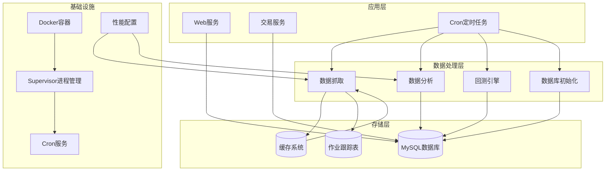

**图表来源**
- [Dockerfile:120-153](file://docker/Dockerfile#L120-L153)
- [supervisord.conf:25-42](file://supervisor/supervisord.conf#L25-L42)
- [job_tracker.py:33-60](file://docker/stock/quantia/lib/job_tracker.py#L33-L60)

**章节来源**
- [README.md:1-700](file://README.md#L1-L700)
- [cron/README.md:1-383](file://cron/README.md#L1-L383)

## 核心组件

### Cron定时任务系统

系统实现了完整的Cron定时任务体系，包含三种不同粒度的任务：

1. **每小时任务** (`run_hourly`)
   - 执行基础数据采集
   - 支持盘中快照和收盘后更新
   - 非交易日自动跳过

2. **工作日任务** (`run_workdayly`)
   - 执行完整的每日数据处理流程
   - 包含5个阶段的流水线架构
   - 支持服务器回退模式

3. **月度任务** (`run_monthly`)
   - 清理历史缓存数据
   - 智能识别退市股票
   - 支持全量清理模式

### 作业跟踪系统

**新增** 系统引入了cn_job_status作业跟踪表，提供完整的作业执行状态追踪：

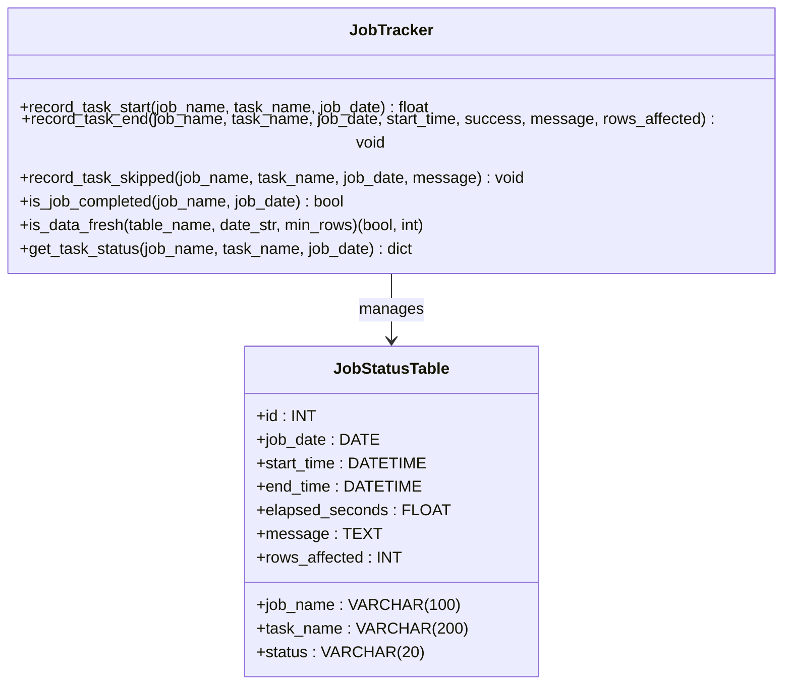

**图表来源**
- [job_tracker.py:33-60](file://docker/stock/quantia/lib/job_tracker.py#L33-L60)
- [job_tracker.py:62-127](file://docker/stock/quantia/lib/job_tracker.py#L62-L127)

### 性能配置系统

**新增** 系统集成了环境变量驱动的性能配置机制：

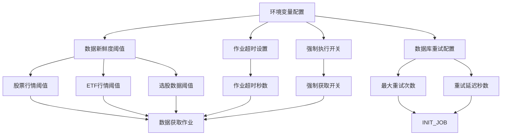

**图表来源**
- [envconfig.py](file://docker/stock/quantia/lib/envconfig.py)
- [fetch_daily_job.py:67-77](file://docker/stock/quantia/job/fetch_daily_job.py#L67-L77)
- [init_job.py:19-22](file://docker/stock/quantia/job/init_job.py#L19-L22)

### 数据处理流水线

系统采用5阶段流水线架构，确保关键数据的优先处理：

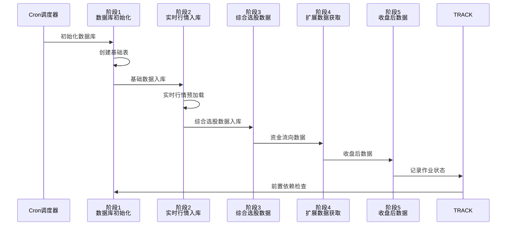

**图表来源**
- [cron/README.md:73-96](file://cron/README.md#L73-L96)
- [fetch_daily_job.py:157-206](file://docker/stock/quantia/job/fetch_daily_job.py#L157-L206)

**章节来源**
- [cron/README.md:166-263](file://cron/README.md#L166-L263)

## 架构概览

系统采用分层架构设计，确保各组件间的松耦合和高内聚：

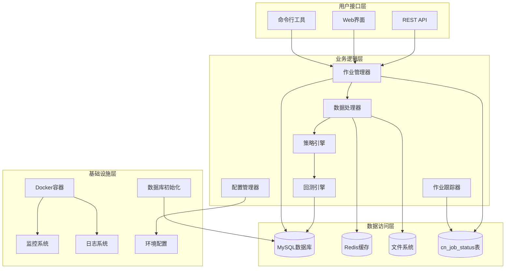

**图表来源**
- [Dockerfile:120-153](file://docker/Dockerfile#L120-L153)
- [supervisord.conf:25-42](file://supervisor/supervisord.conf#L25-L42)
- [job_tracker.py:147-173](file://docker/stock/quantia/lib/job_tracker.py#L147-L173)

## 详细组件分析

### 数据抓取组件

数据抓取组件实现了智能的数据源切换和错误恢复机制：

#### 数据源健康监控

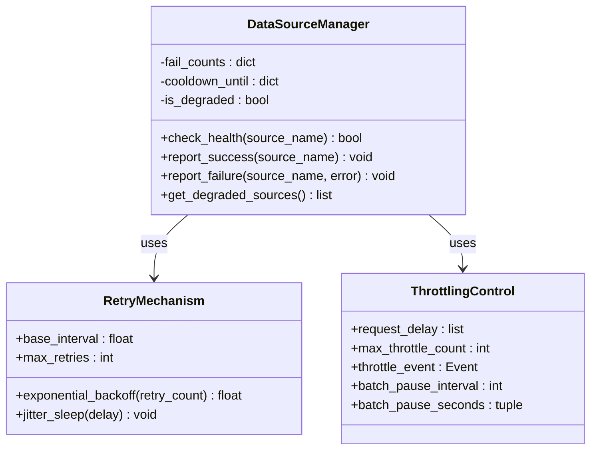

**图表来源**
- [stockfetch.py:95-1330](file://quantia/core/stockfetch.py#L95-L1330)

#### 缓存管理系统

系统实现了智能的缓存管理机制，支持增量更新和全量重建：

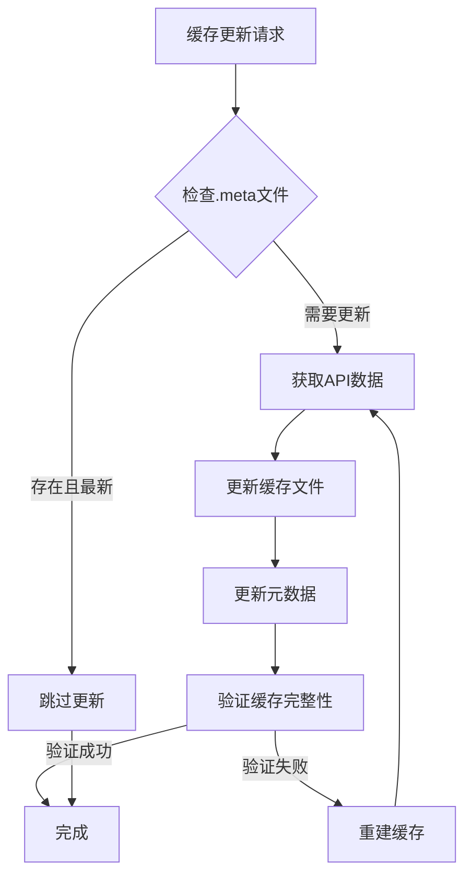

**图表来源**
- [stockfetch.py:1314-1330](file://quantia/core/stockfetch.py#L1314-L1330)

**章节来源**
- [stockfetch.py:95-1330](file://quantia/core/stockfetch.py#L95-L1330)

### Web服务组件

Web服务组件提供了RESTful API接口和Web界面：

#### 数据查询处理

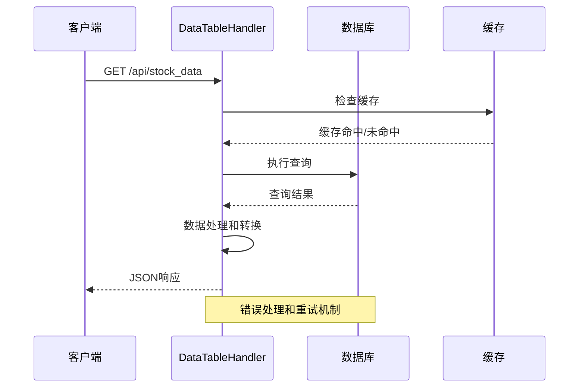

**图表来源**
- [dataTableHandler.py:157-177](file://quantia/web/dataTableHandler.py#L157-L177)

**章节来源**
- [dataTableHandler.py:157-177](file://quantia/web/dataTableHandler.py#L157-L177)

### Cron作业组件

**更新** Cron作业组件实现了复杂的调度和执行逻辑，集成了作业跟踪和性能配置：

#### 作业执行流程

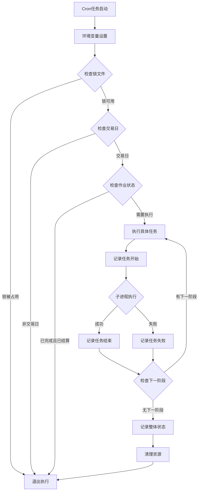

**图表来源**
- [run_hourly:17-41](file://docker/cron/cron.hourly/run_hourly#L17-L41)
- [run_analysis:27-41](file://docker/cron/cron.workdayly/run_analysis#L27-L41)
- [fetch_daily_job.py:135-226](file://docker/stock/quantia/job/fetch_daily_job.py#L135-L226)

#### 作业状态检查机制

**新增** 作业执行前进行多重状态检查：

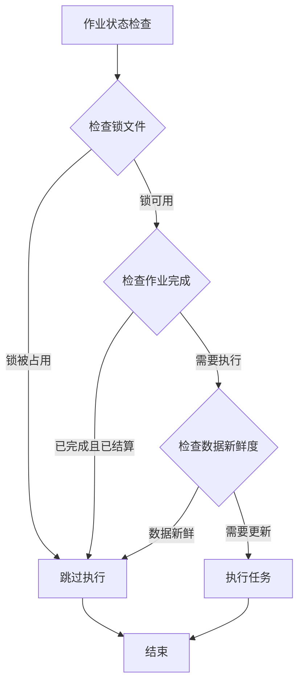

**图表来源**
- [fetch_daily_job.py:147-153](file://docker/stock/quantia/job/fetch_daily_job.py#L147-L153)
- [job_tracker.py:147-173](file://docker/stock/quantia/lib/job_tracker.py#L147-L173)

**章节来源**
- [run_hourly:1-41](file://docker/cron/cron.hourly/run_hourly#L1-L41)
- [run_workdayly:1-48](file://docker/cron/cron.workdayly/run_workdayly#L1-L48)
- [run_fetch:1-44](file://docker/cron/cron.workdayly/run_fetch#L1-L44)
- [run_analysis:1-51](file://docker/cron/cron.workdayly/run_analysis#L1-L51)
- [run_monthly:1-26](file://docker/cron/cron.monthly/run_monthly#L1-L26)

### 数据库初始化组件

**新增** 数据库初始化作业提供了健壮的数据库连接和表创建机制：

#### 数据库连接重试机制

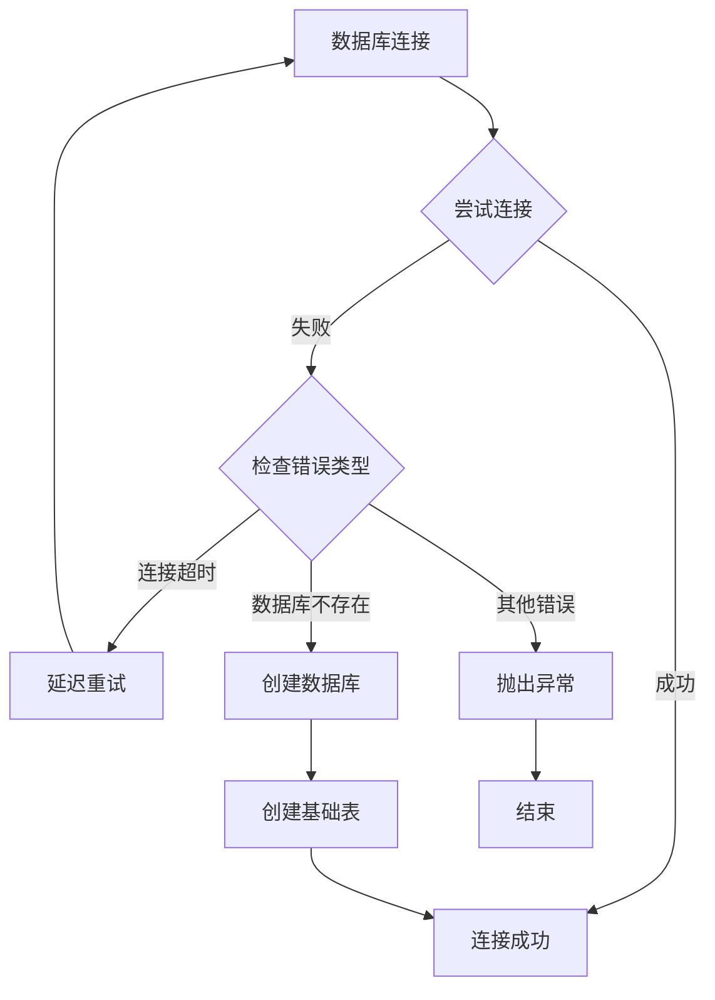

**图表来源**
- [init_job.py:64-86](file://docker/stock/quantia/job/init_job.py#L64-L86)
- [init_job.py:88-117](file://docker/stock/quantia/job/init_job.py#L88-L117)

**章节来源**
- [init_job.py:1-122](file://docker/stock/quantia/job/init_job.py#L1-L122)

## 依赖关系分析

系统依赖关系复杂但清晰，主要依赖包括：

```mermaid
graph TB
subgraph "核心依赖"
NUMPY[numpy>=1.24.0]
PANDAS[pandas>=2.0.0]
TA_LIB[TA_Lib>=0.6.5]
TORNADO[tornado>=6.3.0]
PYMYSQL[PyMySQL>=1.1.0]
SQLALCHEMY[SQLAlchemy>=2.0.0]
end
subgraph "工具依赖"
REQUESTS[requests>=2.28.0]
DOTENV[python-dotenv>=1.0.0]
ARROW[arrow>=1.2.0]
BEAUTIFULSOUP[beautifulsoup4>=4.12.0]
LXML[lxml>=4.9.0]
end
subgraph "特殊依赖"
MINI_RACER[py_mini_racer>=0.6.0]
CRYPTO[pycryptodome>=3.18.0]
EASYTRADER[easytrader>=0.23.0]
BACKTRADER[backtrader>=1.9.76]
end
APP --> NUMPY
APP --> PANDAS
APP --> TA_LIB
APP --> TORNADO
APP --> PYMYSQL
APP --> SQLALCHEMY
APP --> REQUESTS
APP --> DOTENV
APP --> ARROW
APP --> BEAUTIFULSOUP
APP --> LXML
APP --> MINI_RACER
APP --> CRYPTO
APP --> EASYTRADER
APP --> BACKTRADER
```

**图表来源**
- [requirements.txt:1-44](file://requirements.txt#L1-L44)

**章节来源**
- [requirements.txt:1-44](file://requirements.txt#L1-L44)

## 性能考虑

### 内存优化策略

系统采用了多项内存优化策略来应对大规模数据处理：

1. **流式处理**：数据分析阶段采用流式处理，峰值内存使用量控制在100MB以内
2. **增量更新**：K线缓存采用增量更新机制，避免全量数据加载到内存
3. **分批处理**：数据抓取采用分批处理，每只股票处理完即释放内存
4. **缓存管理**：智能缓存清理，定期释放不再使用的内存
5. **子进程隔离**：大型数据处理任务在独立子进程中执行，防止内存泄漏影响主进程

### 并发控制

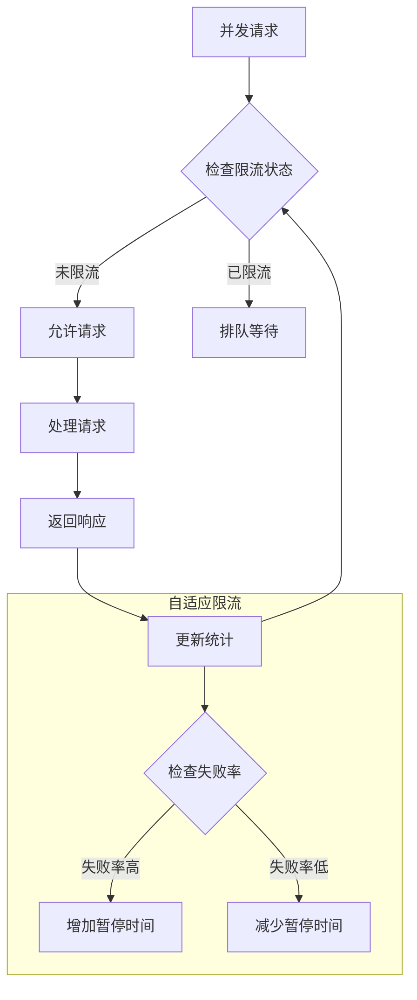

**图表来源**
- [stockfetch.py:1306-1330](file://quantia/core/stockfetch.py#L1306-L1330)

### 网络优化

系统实现了智能的网络请求优化：

1. **数据源切换**：自动在多个数据源间切换，避免单点故障
2. **请求合并**：将多个小请求合并为批量请求
3. **连接复用**：使用持久连接减少建立连接的开销
4. **超时控制**：合理的超时设置避免长时间阻塞

### 性能配置系统

**新增** 系统提供了灵活的性能配置机制：

#### 环境变量配置

| 配置项 | 默认值 | 描述 | 用途 |
|--------|--------|------|------|
| QUANTIA_DB_MAX_RETRIES | 3 | 数据库连接最大重试次数 | 数据库初始化 |
| QUANTIA_DB_RETRY_DELAY | 5 | 数据库重试间隔秒数 | 数据库连接稳定性 |
| QUANTIA_JOB_TIMEOUT | 1800 | 作业执行超时秒数 | 数据获取作业 |
| QUANTIA_FORCE_FETCH | 0 | 强制获取开关 | 覆盖数据新鲜度检查 |
| QUANTIA_FRESH_STOCK_SPOT | 3000 | 股票行情数据阈值 | 数据新鲜度检查 |
| QUANTIA_FRESH_ETF_SPOT | 200 | ETF行情数据阈值 | 数据新鲜度检查 |
| QUANTIA_FRESH_SELECTION | 100 | 选股数据阈值 | 数据新鲜度检查 |
| QUANTIA_FRESH_FUND_FLOW | 2000 | 资金流向阈值 | 数据新鲜度检查 |

**章节来源**
- [envconfig.py](file://docker/stock/quantia/lib/envconfig.py)
- [fetch_daily_job.py:62-77](file://docker/stock/quantia/job/fetch_daily_job.py#L62-L77)
- [init_job.py:20-21](file://docker/stock/quantia/job/init_job.py#L20-L21)

## 故障排除指南

### 常见问题诊断

#### Cron任务执行问题

| 问题类型 | 症状 | 解决方案 |
|---------|------|----------|
| 任务未执行 | 日志中无任务记录 | 检查crontab配置和锁文件权限 |
| 任务重复执行 | 同一时间多次执行 | 检查flock锁机制和重试配置 |
| 任务执行失败 | 退出码非0 | 查看具体错误日志和重试次数 |
| 交易日跳过 | 非交易日仍有执行 | 检查交易日判断逻辑 |
| 作业状态异常 | 作业状态表缺失 | 检查数据库连接和表创建 |

#### 数据抓取问题

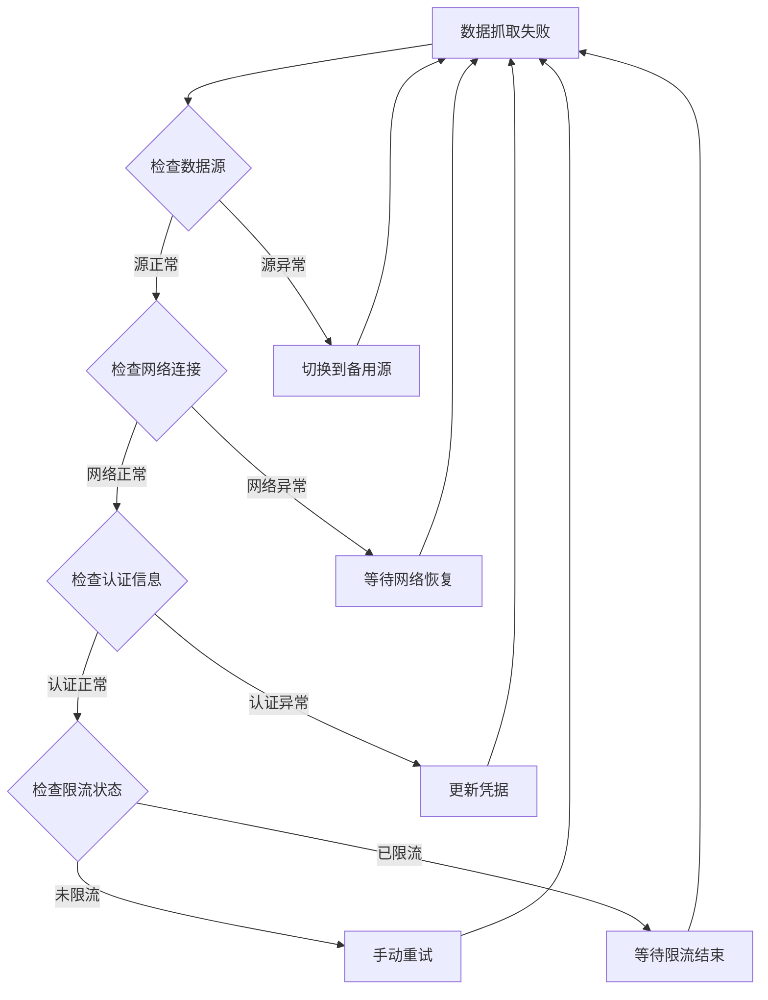

**图表来源**
- [stockfetch.py:95-1330](file://quantia/core/stockfetch.py#L95-L1330)

#### 数据库连接问题

| 问题 | 可能原因 | 解决方法 |
|------|----------|----------|
| 连接超时 | 网络延迟或数据库负载高 | 增加连接超时时间，优化查询 |
| 连接池耗尽 | 并发请求过多 | 调整连接池大小，优化事务处理 |
| 死锁 | 事务嵌套不当 | 重新设计事务顺序，减少锁持有时间 |
| 主键冲突 | 并发写入 | 使用UPSERT操作，实现幂等性 |
| 作业状态表缺失 | 数据库初始化失败 | 检查数据库连接和表创建权限 |

#### 作业跟踪问题

**新增** 作业状态追踪相关问题：

| 问题 | 可能原因 | 解决方法 |
|------|----------|----------|
| 作业状态丢失 | 数据库连接异常 | 检查cn_job_status表连接 |
| 状态记录失败 | 权限不足 | 确保数据库用户有INSERT权限 |
| 状态查询异常 | 表结构不匹配 | 运行数据库初始化脚本 |
| 前置依赖检查失败 | 依赖作业未完成 | 检查上游作业执行状态 |

**章节来源**
- [cron/README.md:219-263](file://cron/README.md#L219-L263)
- [job_tracker.py:33-60](file://docker/stock/quantia/lib/job_tracker.py#L33-L60)

### 监控和日志

系统提供了完善的监控和日志机制：

1. **任务执行日志**：记录每个Cron任务的执行状态和结果
2. **数据源健康日志**：监控数据源的可用性和性能
3. **错误追踪日志**：详细记录错误发生的时间、位置和上下文
4. **性能监控日志**：记录关键性能指标和瓶颈
5. **作业状态日志**：记录作业执行状态和依赖关系
6. **配置变更日志**：记录环境变量配置的变更历史

## 结论

本项目通过精心设计的Cron定时任务系统、作业跟踪系统和性能配置系统的集成，实现了高可靠性的股票数据处理服务。系统的主要优势包括：

1. **高度可靠性**：多重重试机制和幂等性设计确保任务的稳定执行
2. **完善的状态追踪**：cn_job_status表提供完整的作业执行状态监控
3. **灵活的性能配置**：环境变量驱动的配置系统支持动态参数调整
4. **智能的前置依赖**：基于作业状态的依赖检查避免数据不一致
5. **健壮的数据库管理**：自动化的数据库初始化和连接重试机制
6. **模块化设计**：清晰的组件分离便于维护和故障排除
7. **容器化部署**：Docker容器化提供了一致的部署体验

通过持续的优化和改进，该系统能够稳定地为用户提供高质量的股票数据服务，为量化投资决策提供有力支持。新的作业跟踪系统和性能配置系统的集成进一步提升了系统的可观测性和可维护性，为未来的功能扩展奠定了坚实的基础。
