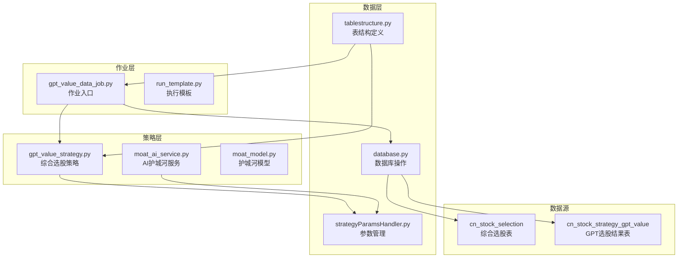
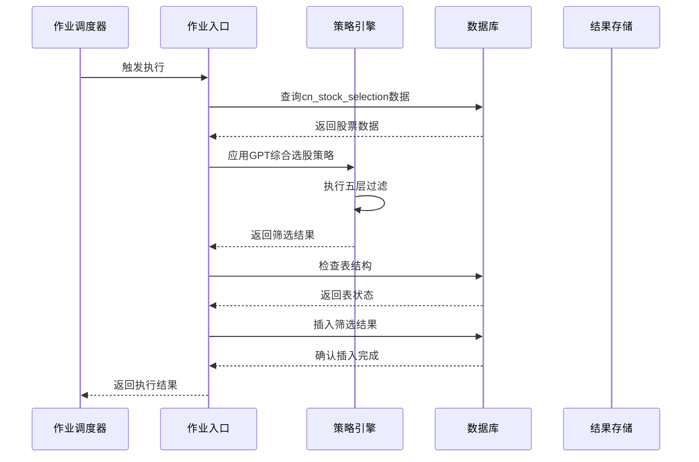
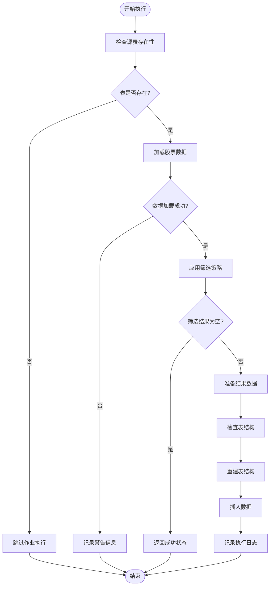
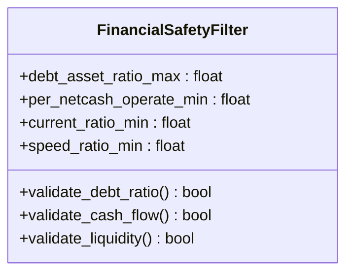
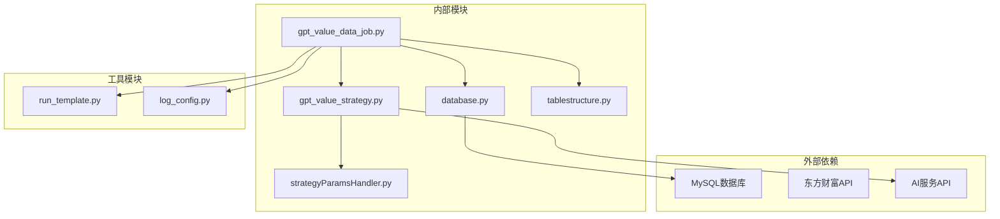

# GPT价值数据作业

<cite>
**本文档引用的文件**
- [gpt_value_data_job.py](file://docker/stock/quantia/job/gpt_value_data_job.py)
- [gpt_value_strategy.py](file://docker/stock/quantia/core/strategy/gpt_value_strategy.py)
- [moat_ai_service.py](file://docker/stock/quantia/core/strategy/fundamental/moat_ai_service.py)
- [moat_model.py](file://docker/stock/quantia/core/strategy/fundamental/moat_model.py)
- [database.py](file://docker/stock/quantia/lib/database.py)
- [tablestructure.py](file://docker/stock/quantia/core/tablestructure.py)
- [run_template.py](file://docker/stock/quantia/lib/run_template.py)
- [strategyParamsHandler.py](file://docker/stock/quantia/web/strategyParamsHandler.py)
- [ChatGP选股策略文档.md](file://docker/stock/quantia/core/strategy/document/ChatGP选股策略文档.md)
</cite>

## 目录
1. [简介](#简介)
2. [项目结构](#项目结构)
3. [核心组件](#核心组件)
4. [架构概览](#架构概览)
5. [详细组件分析](#详细组件分析)
6. [依赖关系分析](#依赖关系分析)
7. [性能考虑](#性能考虑)
8. [故障排除指南](#故障排除指南)
9. [结论](#结论)

## 简介

GPT价值数据作业是Quantia项目中的核心基本面筛选模块，负责基于ChatGP选股策略文档中定义的五层过滤标准，对A股上市公司进行综合价值评估和选股。该作业通过分析财务数据、盈利能力、成长质量、估值水平等多个维度，为后续的技术择时策略提供高质量的股票池。

该作业采用批处理架构，每日自动执行，从cn_stock_selection表读取经过基本面筛选的股票数据，应用GPT综合选股策略进行二次筛选，最终将结果存储到cn_stock_strategy_gpt_value表中，供回测和交易系统使用。

## 项目结构

GPT价值数据作业在项目中的组织结构如下：

**图表来源**
- [gpt_value_data_job.py](file://docker/stock/quantia/job/gpt_value_data_job.py#L1-L191)
- [gpt_value_strategy.py](file://docker/stock/quantia/core/strategy/gpt_value_strategy.py#L1-L318)
- [database.py](file://docker/stock/quantia/lib/database.py#L1-L232)

**章节来源**
- [gpt_value_data_job.py](file://docker/stock/quantia/job/gpt_value_data_job.py#L1-L191)
- [tablestructure.py](file://docker/stock/quantia/core/tablestructure.py#L445-L467)

## 核心组件

### 1. 作业入口组件

作业入口组件负责协调整个GPT价值数据作业的执行流程，包括数据加载、策略筛选、结果存储等核心功能。

**主要职责：**
- 从cn_stock_selection表加载当日或最近可用的股票数据
- 应用GPT综合选股策略进行筛选
- 处理日期回退机制，确保数据完整性
- 将筛选结果存储到cn_stock_strategy_gpt_value表
- 管理表结构重建和数据一致性

### 2. 策略算法组件

策略算法组件实现了ChatGP选股策略文档中定义的五层过滤标准，通过量化指标评估股票的基本面质量。

**五层过滤标准：**
- **第一层：财务安全过滤** - 资产负债率、每股经营现金流、流动比率、速动比率
- **第二层：盈利能力筛选** - ROE、毛利率、净利率、ROA
- **第三层：成长质量筛选** - 营收3年CAGR、净利润3年CAGR、扣非净利润增长率
- **第四层：护城河评估** - 通过AI服务识别护城河类型
- **第五层：估值约束** - PE(TTM)、PB(MRQ)

### 3. 数据库操作组件

数据库操作组件提供了统一的数据库访问接口，包括连接管理、数据查询、批量插入等功能。

**核心功能：**
- 数据库连接池管理
- SQL查询和执行
- 批量数据插入
- 表结构检查和重建
- 主键和索引管理

**章节来源**
- [gpt_value_strategy.py](file://docker/stock/quantia/core/strategy/gpt_value_strategy.py#L23-L43)
- [database.py](file://docker/stock/quantia/lib/database.py#L58-L69)

## 架构概览

GPT价值数据作业采用分层架构设计，确保了模块间的松耦合和高内聚。

**图表来源**
- [gpt_value_data_job.py](file://docker/stock/quantia/job/gpt_value_data_job.py#L27-L107)
- [gpt_value_strategy.py](file://docker/stock/quantia/core/strategy/gpt_value_strategy.py#L169-L199)

### 执行流程

作业的典型执行流程包括以下几个关键步骤：

1. **数据准备阶段**：检查源表存在性，加载当日或最近可用数据
2. **策略执行阶段**：应用五层过滤标准进行股票筛选
3. **结果处理阶段**：计算综合评分，准备输出数据
4. **存储阶段**：检查表结构，删除旧数据，插入新结果
5. **清理阶段**：记录执行日志，返回执行状态

## 详细组件分析

### 作业入口组件详细分析

作业入口组件是整个GPT价值数据作业的核心协调者，负责管理完整的执行生命周期。

#### 核心函数分析

**prepare函数** - 主要执行逻辑

**图表来源**
- [gpt_value_data_job.py](file://docker/stock/quantia/job/gpt_value_data_job.py#L27-L107)

#### 数据加载机制

作业实现了智能的数据加载机制，支持日期回退功能：

**日期回退策略：**
- 首先尝试加载指定日期的数据
- 如果失败，自动查找最近7天内的最新数据
- 记录诊断信息，帮助问题排查
- 统一处理回退日期的数据

**章节来源**
- [gpt_value_data_job.py](file://docker/stock/quantia/job/gpt_value_data_job.py#L113-L160)

### 策略算法组件详细分析

策略算法组件实现了ChatGP选股策略文档中定义的完整筛选逻辑。

#### 五层过滤标准实现

**第一层：财务安全过滤**

**图表来源**
- [gpt_value_strategy.py](file://docker/stock/quantia/core/strategy/gpt_value_strategy.py#L24-L43)

**第二层：盈利能力筛选**
- ROE加权净资产收益率 ≥ 15%
- 毛利率 ≥ 25%
- 净利率 ≥ 8%
- ROA总资产净利率 ≥ 4%

**第三层：成长质量筛选**
- 营收3年复合增长率 > 8%
- 净利润3年复合增长率 > 8%
- 扣除非经常性损益后的净利润增长率 > 0%

**第四层：护城河评估**
通过AI服务识别护城河类型，包括品牌效应、技术壁垒、规模效应等八种类型。

**第五层：估值约束**
- PE(TTM) 0 < PE ≤ 50
- PB(MRQ) ≤ 10

#### 综合评分计算

作业不仅进行筛选，还计算每个股票的综合评分：

**评分构成：**
- 财务安全：20分（资产负债率、现金流、流动性）
- 盈利能力：30分（ROE、毛利率、净利率、ROA）
- 成长质量：30分（营收和利润增速）
- 估值优势：20分（PE、PB）

**章节来源**
- [gpt_value_strategy.py](file://docker/stock/quantia/core/strategy/gpt_value_strategy.py#L221-L317)

### 数据库操作组件详细分析

数据库操作组件提供了完整的数据访问和管理功能。

#### 连接管理

**连接池配置：**
- 最大连接数：5个
- 连接超时：10秒
- 读写超时：30秒
- 连接回收：10分钟
- 连接预检查：启用

#### 数据操作接口

**核心数据操作：**
- `insert_db_from_df`: 批量插入DataFrame数据
- `executeSql`: 执行SQL语句
- `checkTableIsExist`: 检查表是否存在
- `update_db_from_df`: 基于条件更新数据

**章节来源**
- [database.py](file://docker/stock/quantia/lib/database.py#L58-L138)

### 参数管理系统

参数管理系统提供了灵活的策略参数配置和管理功能。

#### 参数配置结构

**参数分类：**
- **财务安全过滤参数**：资产负债率上限、每股经营现金流下限等
- **盈利能力筛选参数**：ROE下限、毛利率下限、净利率下限等
- **成长质量筛选参数**：营收CAGR下限、净利润CAGR下限等
- **估值约束参数**：PE上下限、PB上限等

**章节来源**
- [strategyParamsHandler.py](file://docker/stock/quantia/web/strategyParamsHandler.py#L24-L222)

## 依赖关系分析

GPT价值数据作业的依赖关系体现了清晰的分层架构设计。

**图表来源**
- [gpt_value_data_job.py](file://docker/stock/quantia/job/gpt_value_data_job.py#L10-L21)
- [gpt_value_strategy.py](file://docker/stock/quantia/core/strategy/gpt_value_strategy.py#L15-L18)

### 模块间依赖关系

**直接依赖：**
- gpt_value_data_job.py → gpt_value_strategy.py：策略实现
- gpt_value_data_job.py → database.py：数据库操作
- gpt_value_strategy.py → strategyParamsHandler.py：参数配置

**间接依赖：**
- gpt_value_data_job.py → tablestructure.py：表结构定义
- gpt_value_strategy.py → moat_ai_service.py：AI分析服务

### 外部依赖分析

**数据库依赖：**
- MySQL 5.7+
- PyMySQL驱动
- SQLAlchemy ORM框架

**API依赖：**
- 东方财富综合选股API
- AI服务API（OpenAI、DeepSeek等）

## 性能考虑

### 数据库性能优化

**连接池优化：**
- 最小连接数：2
- 最大连接数：5
- 连接超时：10秒
- 连接回收：10分钟

**查询优化：**
- 使用索引优化日期查询
- 批量插入减少数据库往返
- 条件查询避免全表扫描

### 内存使用优化

**数据处理优化：**
- 使用pandas进行向量化操作
- 分批处理大数据集
- 及时释放不需要的中间结果

**内存管理：**
- 控制DataFrame大小
- 使用适当的数据类型
- 及时清理垃圾回收

### 并发处理

**作业并发：**
- 支持批量日期处理
- 线程池并发执行
- 交易日过滤避免非交易日处理

## 故障排除指南

### 常见问题及解决方案

**1. 数据表不存在**
- 检查cn_stock_selection表是否已创建
- 确认selection_data_daily_job是否正常执行
- 验证数据库连接配置

**2. 策略参数加载失败**
- 检查cn_strategy_params表是否存在
- 验证参数配置的JSON格式
- 确认数据库权限设置

**3. AI服务调用失败**
- 检查API密钥配置
- 验证网络连接
- 确认AI服务可用性

**4. 数据库连接异常**
- 检查MySQL服务状态
- 验证连接参数配置
- 查看连接池状态

### 错误监控和日志

**日志级别：**
- INFO：正常执行状态
- WARNING：可恢复的警告
- ERROR：异常情况记录

**监控指标：**
- 执行时间统计
- 数据量统计
- 错误率监控

**章节来源**
- [gpt_value_data_job.py](file://docker/stock/quantia/job/gpt_value_data_job.py#L109-L111)
- [database.py](file://docker/stock/quantia/lib/database.py#L180-L193)

## 结论

GPT价值数据作业作为Quantia项目的核心组件，通过严谨的五层过滤标准和智能化的评分机制，为A股投资提供了科学的价值筛选方法。该作业具有以下特点：

**技术优势：**
- 完整的策略实现，符合ChatGP选股策略文档要求
- 灵活的参数配置，支持个性化调整
- 稳健的错误处理和数据质量控制
- 高效的数据库操作和性能优化

**架构特点：**
- 清晰的分层设计，模块职责明确
- 完善的依赖管理，降低耦合度
- 可扩展的参数系统，支持策略演进
- 健壮的错误处理机制

**应用场景：**
- 日常自动化的股票筛选
- 回测数据的高质量输入
- 技术择时策略的基础支撑
- 投资决策的重要参考

该作业为整个Quantia系统的价值投资理念提供了坚实的技术基础，通过持续的优化和完善，将为用户提供更加准确和可靠的投资决策支持。
