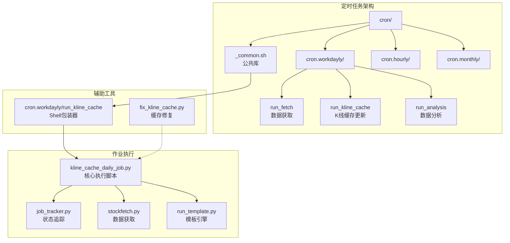
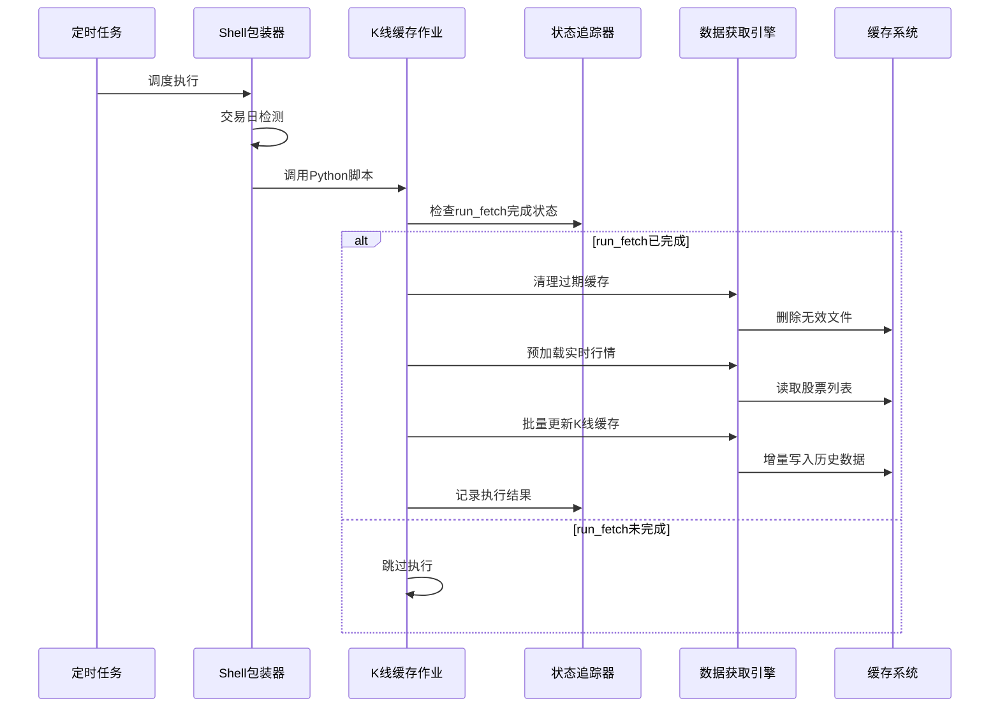
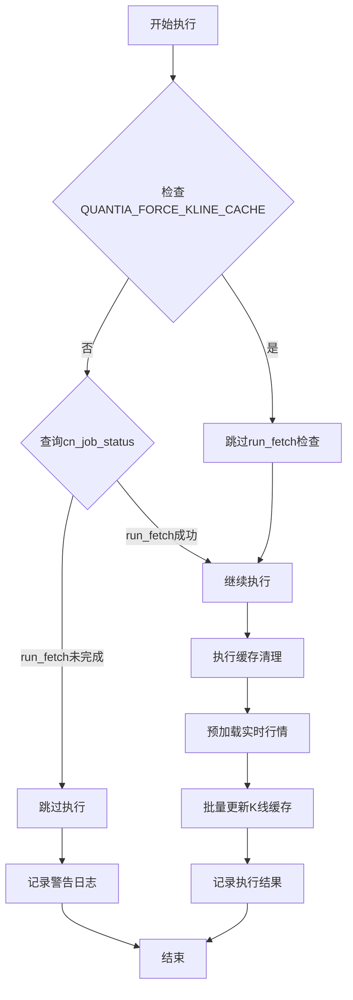
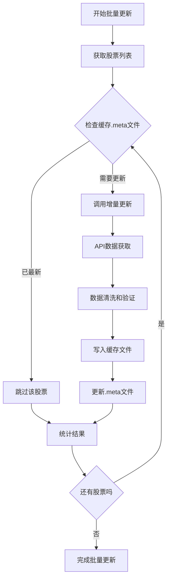
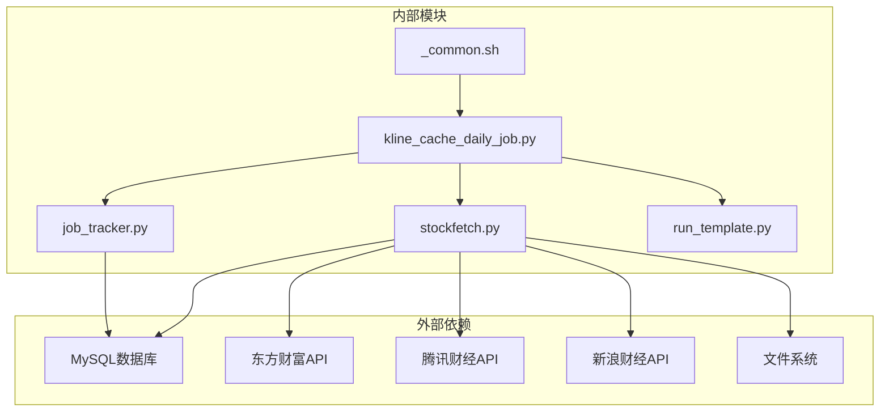

# K线缓存每日作业

<cite>
**本文档引用的文件**
- [cron/README.md](file://cron/README.md)
- [_common.sh](file://cron/_common.sh)
- [run_kline_cache](file://cron/cron.workdayly/run_kline_cache)
- [kline_cache_daily_job.py](file://quantia/job/kline_cache_daily_job.py)
- [job_tracker.py](file://quantia/lib/job_tracker.py)
- [stockfetch.py](file://quantia/core/stockfetch.py)
- [run_template.py](file://quantia/lib/run_template.py)
- [fix_kline_cache.py](file://fix_kline_cache.py)
- [README.md](file://README.md)
</cite>

## 目录
1. [简介](#简介)
2. [项目结构](#项目结构)
3. [核心组件](#核心组件)
4. [架构概览](#架构概览)
5. [详细组件分析](#详细组件分析)
6. [依赖关系分析](#依赖关系分析)
7. [性能考虑](#性能考虑)
8. [故障排除指南](#故障排除指南)
9. [结论](#结论)

## 简介

K线缓存每日作业是Quantia股票数据分析系统中的关键组件，负责批量更新全市场约5000只股票的历史K线缓存文件。该作业具有内存密集型特点（单只股票约350KB DataFrame），已从数据获取作业中独立拆分，以避免内存溢出（OOM）影响其他任务。

该作业采用增量更新模式，仅更新缺失日期的数据，并通过严格的前置条件检查确保数据一致性。作业执行过程包括缓存清理、实时行情预加载和批量历史K线缓存更新三个主要步骤。

## 项目结构

**图表来源**
- [cron/README.md:73-98](file://cron/README.md#L73-L98)
- [run_kline_cache:1-14](file://cron/cron.workdayly/run_kline_cache#L1-L14)

**章节来源**
- [cron/README.md:1-290](file://cron/README.md#L1-L290)
- [cron/_common.sh:1-125](file://cron/_common.sh#L1-L125)

## 核心组件

### 1. Shell执行包装器

`run_kline_cache`脚本是K线缓存作业的Shell包装器，负责：

- 环境初始化和日志配置
- 交易日检测（非交易日自动跳过）
- Python作业调用和结果记录

### 2. 核心执行脚本

`kline_cache_daily_job.py`包含完整的业务逻辑：

- 前置条件检查（run_fetch完成状态）
- 缓存清理（退市股票、除权除息数据）
- 实时行情预加载
- 批量历史K线缓存更新

### 3. 状态追踪器

`job_tracker.py`提供作业状态管理：

- cn_job_status表的状态记录
- 作业完成状态检查
- 任务执行时间统计

### 4. 数据获取引擎

`stockfetch.py`包含缓存更新的核心功能：

- 增量缓存更新算法
- 数据源健康度监控
- 并发控制和限流机制

**章节来源**
- [kline_cache_daily_job.py:1-179](file://quantia/job/kline_cache_daily_job.py#L1-L179)
- [job_tracker.py:1-233](file://quantia/lib/job_tracker.py#L1-L233)
- [stockfetch.py:1-200](file://quantia/core/stockfetch.py#L1-L200)

## 架构概览

**图表来源**
- [run_kline_cache:12-13](file://cron/cron.workdayly/run_kline_cache#L12-L13)
- [kline_cache_daily_job.py:91-93](file://quantia/job/kline_cache_daily_job.py#L91-L93)
- [job_tracker.py:147-173](file://quantia/lib/job_tracker.py#L147-L173)

## 详细组件分析

### 前置条件检查机制

前置条件检查是确保数据一致性的关键机制：

**图表来源**
- [kline_cache_daily_job.py:56-75](file://quantia/job/kline_cache_daily_job.py#L56-L75)
- [job_tracker.py:147-173](file://quantia/lib/job_tracker.py#L147-L173)

### 缓存清理流程

缓存清理是维护数据质量的重要步骤：

| 清理类型 | 操作内容 | 性能影响 | 预计耗时 |
|---------|---------|---------|---------|
| 退市股票缓存 | 删除已退市股票的缓存文件 | 低 | 1-2秒 |
| 除权除息缓存 | 刷新近35天内除权除息股票的前复权缓存 | 中 | 1-3秒 |
| 损坏文件清理 | 删除损坏的.meta文件 | 低 | 0.5-1秒 |

### 批量更新算法

批量更新采用增量模式，具有以下特点：

**图表来源**
- [kline_cache_daily_job.py:137-155](file://quantia/job/kline_cache_daily_job.py#L137-L155)
- [stockfetch.py:1461-1472](file://quantia/core/stockfetch.py#L1461-L1472)

### 数据源健康度监控

系统实现了多层次的数据源健康度监控：

| 监控层级 | 功能描述 | 保护机制 |
|---------|---------|---------|
| 源健康度追踪 | 记录各数据源失败次数 | 连续失败N次后降级 |
| 聚合日志输出 | 聚合同一数据源的失败日志 | 避免日志刷屏 |
| 指数退避重试 | 失败后等待时间呈指数增长 | 防止雪崩效应 |
| 冷却期管理 | 降级数据源的恢复机制 | 自动恢复和手动干预 |

**章节来源**
- [stockfetch.py:66-125](file://quantia/core/stockfetch.py#L66-L125)
- [stockfetch.py:148-170](file://quantia/core/stockfetch.py#L148-L170)

## 依赖关系分析

**图表来源**
- [kline_cache_daily_job.py:40-48](file://quantia/job/kline_cache_daily_job.py#L40-L48)
- [_common.sh:8-23](file://cron/_common.sh#L8-L23)

### 关键依赖关系

1. **数据库依赖**：cn_job_status表用于作业状态追踪
2. **文件系统依赖**：缓存文件存储在quantia/cache/hist目录
3. **API依赖**：多数据源支持和健康度监控
4. **环境依赖**：通过.env文件配置各种参数

**章节来源**
- [job_tracker.py:33-60](file://quantia/lib/job_tracker.py#L33-L60)
- [stockfetch.py:191-195](file://quantia/core/stockfetch.py#L191-L195)

## 性能考虑

### 内存管理策略

由于单只股票数据约350KB，系统采用了多种内存管理策略：

- **低内存模式**：批量更新时不保留数据在内存中
- **独立进程运行**：避免OOM影响其他任务
- **垃圾回收控制**：定期触发垃圾回收释放内存
- **分批处理**：将5000只股票分批处理

### 并发控制机制

系统实现了多层并发控制：

| 控制层级 | 参数 | 默认值 | 说明 |
|---------|------|--------|------|
| 作业并发 | QUANTIA_KLINE_CACHE_WORKERS | 2 | K线缓存更新并发数 |
| 批量日期作业 | QUANTIA_BATCH_DATE_WORKERS | 3 | 批量日期作业并发数 |
| 请求间隔 | 1-3秒 | 1-3秒 | 防止API限流 |
| 每100只暂停 | 8-15秒 | 8-15秒 | 长时间请求间隔 |

### 缓存优化策略

- **增量更新**：仅更新缺失日期的数据
- **元数据检查**：通过.meta文件判断缓存是否最新
- **智能跳过**：已最新数据直接跳过API调用
- **前复权优化**：针对除权除息股票的特殊处理

**章节来源**
- [kline_cache_daily_job.py:154-155](file://quantia/job/kline_cache_daily_job.py#L154-L155)
- [stockfetch.py:1461-1472](file://quantia/core/stockfetch.py#L1461-L1472)

## 故障排除指南

### 常见问题及解决方案

#### 1. 缓存数据污染

**问题描述**：日线缓存中混入了月度聚合数据行

**解决方案**：
- 使用`fix_kline_cache.py`脚本进行修复
- 支持扫描、修复和删除三种模式
- 自动备份原文件，防止数据丢失

#### 2. 作业执行失败

**诊断步骤**：
1. 检查cn_job_status表中的作业状态
2. 查看工作日志文件
3. 验证前置条件是否满足
4. 检查数据源健康度

**恢复措施**：
- 设置QUANTIA_FORCE_KLINE_CACHE=1强制执行
- 清理缓存后重新执行
- 检查网络连接和API可用性

#### 3. 内存不足问题

**预防措施**：
- 调整QUANTIA_KLINE_CACHE_WORKERS参数
- 监控系统内存使用情况
- 定期清理过期缓存

**应急处理**：
- 重启系统服务
- 手动清理大文件缓存
- 检查是否有内存泄漏

### 监控和日志

系统提供了完善的监控和日志机制：

| 监控项 | 日志位置 | 检查要点 |
|-------|---------|---------|
| 作业状态 | quantia/log/workdayly.log | cn_job_status表状态 |
| 缓存更新 | stock_kline_cache_job.log | 成功/失败统计 |
| 数据源健康 | 系统日志 | API响应时间和错误率 |
| 内存使用 | 系统监控 | 进程内存峰值和平均值 |

**章节来源**
- [fix_kline_cache.py:107-144](file://fix_kline_cache.py#L107-L144)
- [cron/README.md:234-267](file://cron/README.md#L234-L267)

## 结论

K线缓存每日作业是Quantia系统中最重要的数据基础设施组件之一。通过采用增量更新、多层前置检查、智能缓存管理和健康度监控等技术手段，该作业实现了高效、稳定和可扩展的历史K线数据管理。

### 主要优势

1. **数据一致性**：严格的前置条件检查确保缓存数据的准确性
2. **性能优化**：增量更新和低内存模式显著提升处理效率
3. **容错性强**：多数据源支持和健康度监控提高系统稳定性
4. **可维护性好**：清晰的日志记录和状态追踪便于问题排查

### 改进建议

1. **监控告警**：增加更细粒度的监控指标和告警机制
2. **自动化修复**：开发更多自动化的缓存修复工具
3. **性能调优**：根据实际硬件配置优化并发参数
4. **文档完善**：补充更多使用场景和最佳实践案例

该作业为整个系统的数据分析和可视化提供了坚实的数据基础，是确保系统稳定运行的关键保障。
