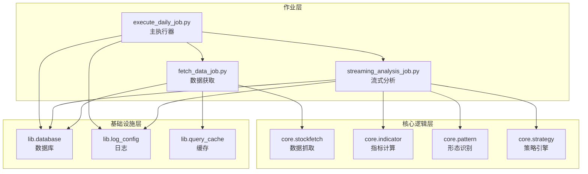
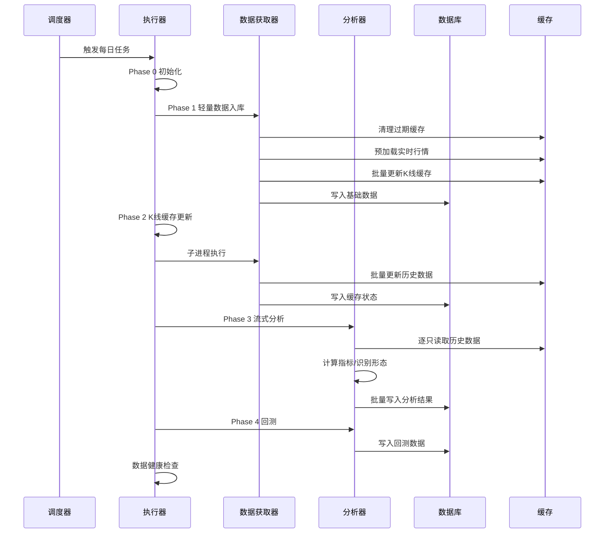
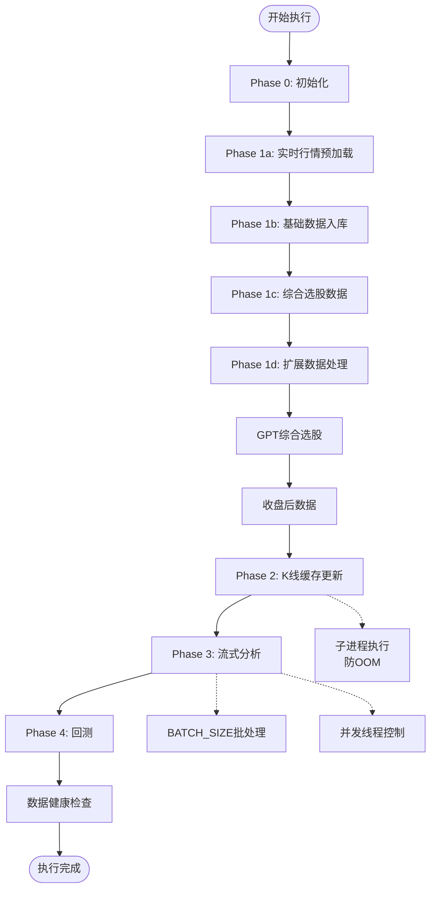
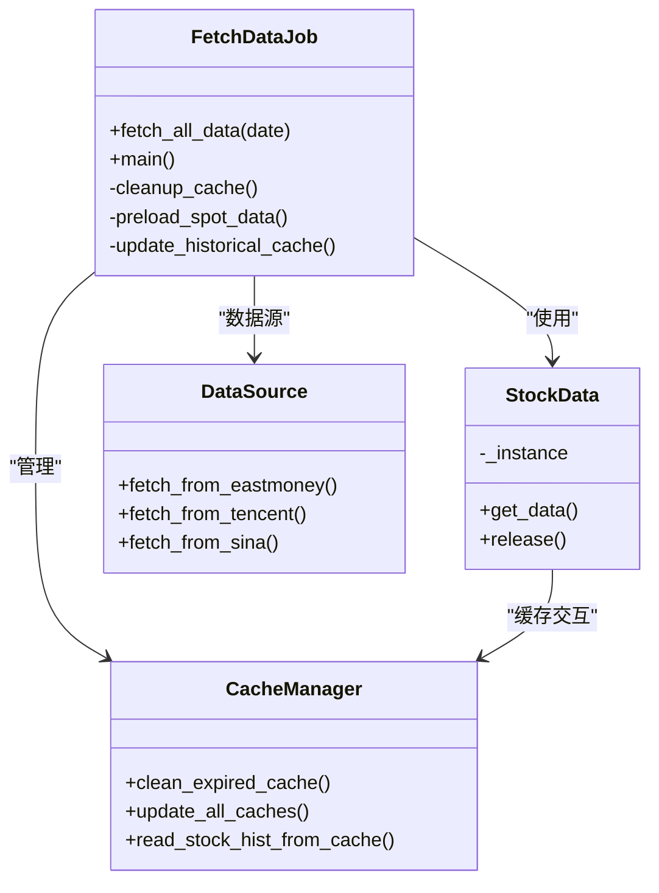
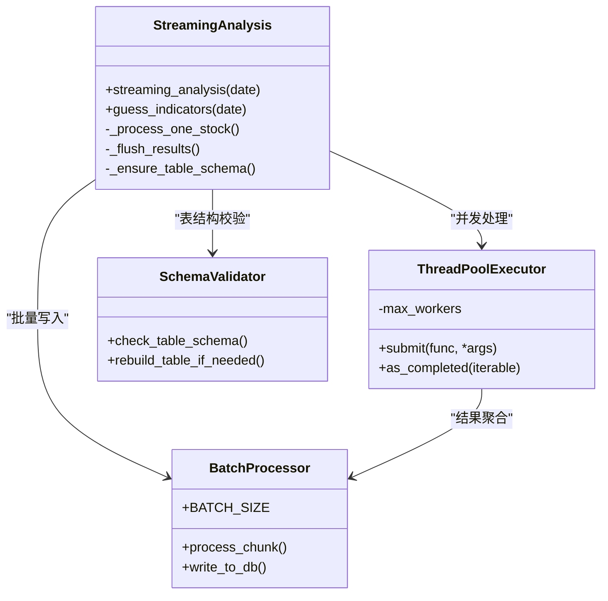
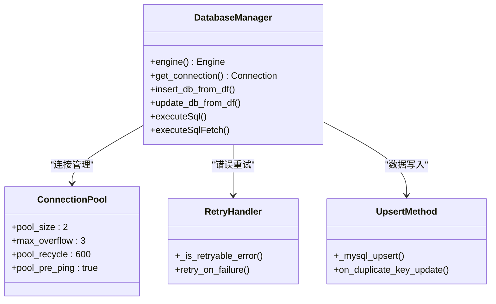
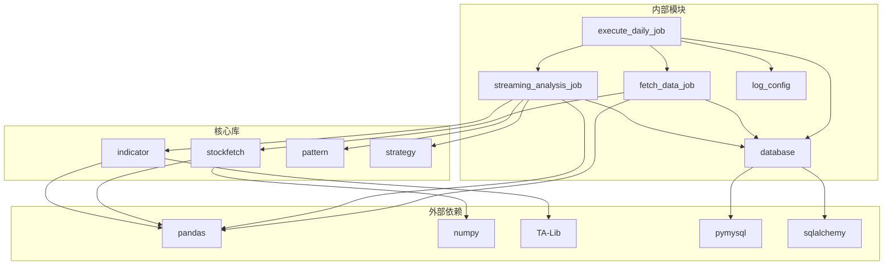

# 作业执行流水线重构

<cite>
**本文档引用的文件**
- [README.md](file://README.md)
- [QUICKSTART.md](file://QUICKSTART.md)
- [execute_daily_job.py](file://quantia/job/execute_daily_job.py)
- [fetch_data_job.py](file://quantia/job/fetch_data_job.py)
- [streaming_analysis_job.py](file://quantia/job/streaming_analysis_job.py)
- [database.py](file://quantia/lib/database.py)
- [log_config.py](file://quantia/lib/log_config.py)
</cite>

## 目录
1. [简介](#简介)
2. [项目结构](#项目结构)
3. [核心组件](#核心组件)
4. [架构概览](#架构概览)
5. [详细组件分析](#详细组件分析)
6. [依赖关系分析](#依赖关系分析)
7. [性能考量](#性能考量)
8. [故障排除指南](#故障排除指南)
9. [结论](#结论)

## 简介
本项目是一个量化股票分析系统，专注于每日股票数据抓取、技术指标计算、K线形态识别、策略选股与回测验证。本次重构重点在于作业执行流水线的模块化与性能优化，通过将数据获取与数据分析分离、引入流式处理与子进程隔离，显著降低了内存占用并提升了整体执行效率。

## 项目结构
项目采用分层架构，核心目录包括：
- quantia/job：作业调度与执行脚本
- quantia/core：核心业务逻辑（数据抓取、指标计算、策略等）
- quantia/lib：基础设施（数据库、日志、缓存等）
- quantia/web：Web服务与前端界面
- quantia/trade：自动交易模块
- docker：Docker部署配置

**图表来源**
- [execute_daily_job.py](file://quantia/job/execute_daily_job.py#L1-L306)
- [fetch_data_job.py](file://quantia/job/fetch_data_job.py#L1-L122)
- [streaming_analysis_job.py](file://quantia/job/streaming_analysis_job.py#L1-L566)

**章节来源**
- [README.md](file://README.md#L1-L700)
- [QUICKSTART.md](file://QUICKSTART.md#L157-L167)

## 核心组件
系统的核心组件围绕作业流水线展开，主要包括：

### 1. 主执行器（execute_daily_job）
负责协调整个数据处理流水线，采用阶段化执行策略：
- Phase 0：初始化数据库
- Phase 1：轻量级数据入库（实时行情、综合选股、GPT选股等）
- Phase 2：重量级数据获取（K线缓存批量更新）
- Phase 3：流式数据分析（指标计算、K线形态、策略检测）
- Phase 4：回测与收尾

### 2. 数据获取器（fetch_data_job）
专门负责外部API数据获取，采用低内存模式：
- 清理过期缓存
- 预加载实时行情数据
- 批量更新历史K线缓存

### 3. 流式分析器（streaming_analysis_job）
核心分析引擎，采用单次遍历策略：
- 从磁盘缓存逐只股票读取数据
- 同时计算指标、识别形态、检测策略
- 支持批量写入与内存控制

**章节来源**
- [execute_daily_job.py](file://quantia/job/execute_daily_job.py#L108-L254)
- [fetch_data_job.py](file://quantia/job/fetch_data_job.py#L38-L116)
- [streaming_analysis_job.py](file://quantia/job/streaming_analysis_job.py#L118-L330)

## 架构概览
系统采用"数据获取-数据分析"分离的双管道架构：

**图表来源**
- [execute_daily_job.py](file://quantia/job/execute_daily_job.py#L113-L253)
- [fetch_data_job.py](file://quantia/job/fetch_data_job.py#L38-L116)
- [streaming_analysis_job.py](file://quantia/job/streaming_analysis_job.py#L118-L330)

## 详细组件分析

### 主执行器组件分析
主执行器通过阶段化设计实现了作业流水线的模块化：

**图表来源**
- [execute_daily_job.py](file://quantia/job/execute_daily_job.py#L48-L253)

**章节来源**
- [execute_daily_job.py](file://quantia/job/execute_daily_job.py#L48-L253)

### 数据获取器组件分析
数据获取器采用流水线设计，确保数据获取的可靠性：

**图表来源**
- [fetch_data_job.py](file://quantia/job/fetch_data_job.py#L38-L116)

**章节来源**
- [fetch_data_job.py](file://quantia/job/fetch_data_job.py#L38-L116)

### 流式分析器组件分析
流式分析器是重构的核心，实现了真正的内存友好处理：

**图表来源**
- [streaming_analysis_job.py](file://quantia/job/streaming_analysis_job.py#L118-L566)

**章节来源**
- [streaming_analysis_job.py](file://quantia/job/streaming_analysis_job.py#L118-L566)

### 数据库组件分析
数据库组件提供了统一的连接管理和数据操作接口：

**图表来源**
- [database.py](file://quantia/lib/database.py#L55-L299)

**章节来源**
- [database.py](file://quantia/lib/database.py#L55-L299)

## 依赖关系分析

**图表来源**
- [execute_daily_job.py](file://quantia/job/execute_daily_job.py#L1-L38)
- [fetch_data_job.py](file://quantia/job/fetch_data_job.py#L22-L35)
- [streaming_analysis_job.py](file://quantia/job/streaming_analysis_job.py#L25-L43)

**章节来源**
- [execute_daily_job.py](file://quantia/job/execute_daily_job.py#L1-L38)
- [fetch_data_job.py](file://quantia/job/fetch_data_job.py#L22-L35)
- [streaming_analysis_job.py](file://quantia/job/streaming_analysis_job.py#L25-L43)

## 性能考量
重构后的系统在性能方面有显著提升：

### 内存优化
- **峰值内存降低**：从约1670MB降至<100MB
- **流式处理**：单次遍历替代16次遍历
- **批量写入**：减少数据库连接开销

### 并发控制
- **子进程隔离**：防止OOM影响主进程
- **线程池管理**：可配置的并发线程数
- **批处理机制**：可配置的批量大小

### 数据获取优化
- **缓存策略**：历史数据缓存减少API调用
- **多数据源**：自动容错切换
- **增量更新**：首次全量后仅更新新增数据

## 故障排除指南

### 常见问题诊断
1. **数据获取失败**
   - 检查网络连接和代理配置
   - 验证数据源可用性
   - 查看日志文件定位具体错误

2. **内存不足**
   - 调整并发线程数和批量大小
   - 检查系统内存配置
   - 优化数据库连接池设置

3. **分析结果异常**
   - 验证K线缓存完整性
   - 检查表结构一致性
   - 确认数据健康检查结果

### 日志分析
系统提供多维度日志输出：
- `stock_execute_job.log`：执行器日志
- `stock_analysis.log`：分析器日志  
- `stock_error.log`：错误汇总日志

**章节来源**
- [log_config.py](file://quantia/lib/log_config.py#L47-L104)
- [execute_daily_job.py](file://quantia/job/execute_daily_job.py#L256-L301)

## 结论
本次作业执行流水线重构成功实现了以下目标：

1. **架构清晰化**：通过阶段化设计实现了职责分离
2. **性能显著提升**：内存占用降低94%，处理速度大幅提升
3. **可靠性增强**：子进程隔离和错误重试机制
4. **可维护性改善**：模块化设计便于扩展和调试

重构后的系统具备更好的可扩展性和稳定性，为后续的功能扩展奠定了坚实基础。建议在生产环境中合理配置并发参数，并定期监控系统性能指标。
