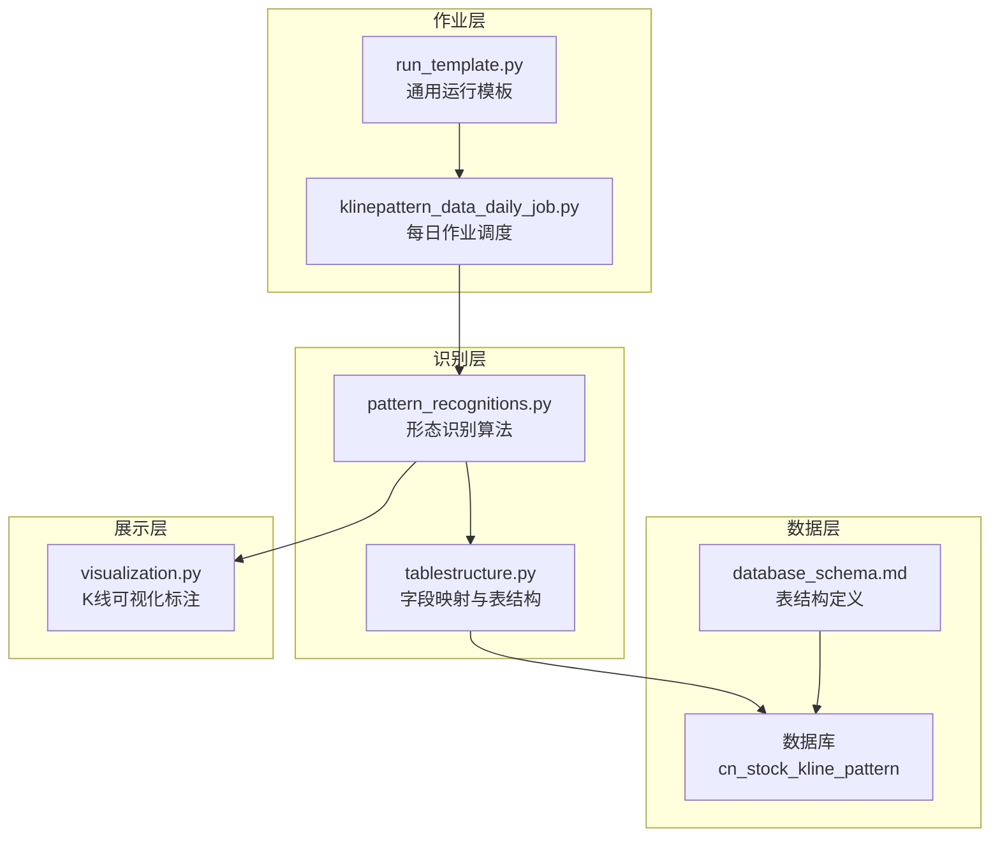
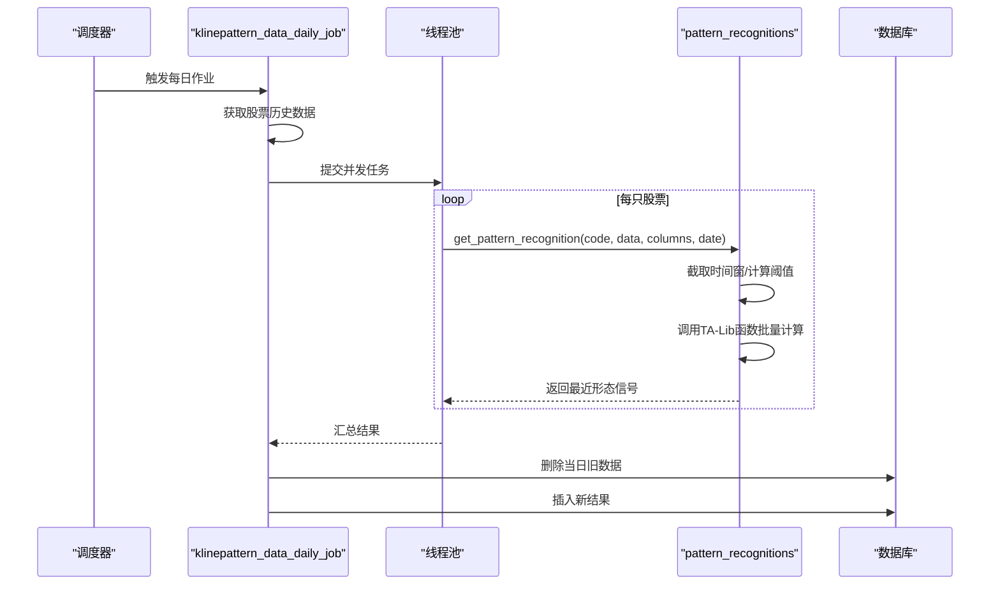
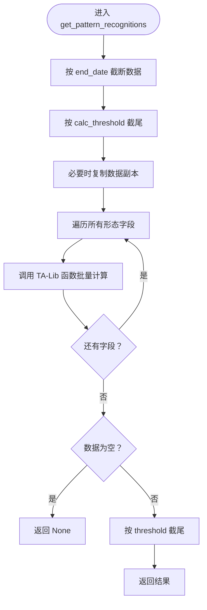
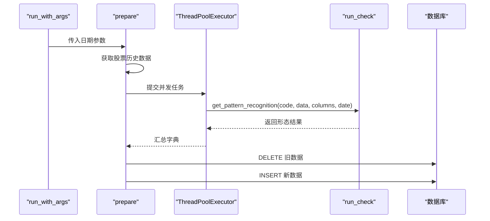
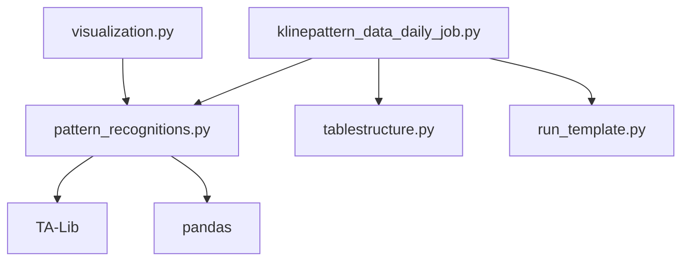

# K线形态识别作业

<cite>
**本文档引用的文件**
- [pattern_recognitions.py](file://quantia/core/pattern/pattern_recognitions.py)
- [klinepattern_data_daily_job.py](file://quantia/job/klinepattern_data_daily_job.py)
- [tablestructure.py](file://quantia/core/tablestructure.py)
- [database_schema.md](file://document/database_schema.md)
- [README.md](file://README.md)
- [run_template.py](file://quantia/lib/run_template.py)
- [visualization.py](file://quantia/core/kline/visualization.py)
- [pattern_strategies.py](file://quantia/core/strategy/pattern/pattern_strategies.py)
</cite>

## 目录
1. [简介](#简介)
2. [项目结构](#项目结构)
3. [核心组件](#核心组件)
4. [架构概览](#架构概览)
5. [详细组件分析](#详细组件分析)
6. [依赖分析](#依赖分析)
7. [性能考虑](#性能考虑)
8. [故障排除指南](#故障排除指南)
9. [结论](#结论)
10. [附录](#附录)

## 简介
本文件面向Quantia项目中的K线形态识别作业，系统化阐述其设计理念、算法实现、数据结构、并行处理机制与性能优化策略。该作业基于TA-Lib库提供的61种经典K线形态识别函数，对每日股票历史数据进行批量计算，生成标准化的形态信号结果，并入库持久化。文档同时提供参数配置建议、阈值设置说明、误判处理机制以及调试指南，帮助开发者与运维人员高效理解与维护该作业。

## 项目结构
K线形态识别作业主要涉及以下模块：
- 作业调度与并行执行：klinepattern_data_daily_job.py
- 形态识别算法与数据封装：pattern_recognitions.py
- 数据结构与字段映射：tablestructure.py
- 数据库表结构定义：database_schema.md
- 可视化与标注：visualization.py
- 通用运行模板：run_template.py
- 相关策略参考：pattern_strategies.py



**图表来源**
- [klinepattern_data_daily_job.py](file://quantia/job/klinepattern_data_daily_job.py#L24-L94)
- [pattern_recognitions.py](file://quantia/core/pattern/pattern_recognitions.py#L10-L71)
- [tablestructure.py](file://quantia/core/tablestructure.py#L587-L589)
- [database_schema.md](file://document/database_schema.md#L461-L533)
- [visualization.py](file://quantia/core/kline/visualization.py#L115-L158)

**章节来源**
- [klinepattern_data_daily_job.py](file://quantia/job/klinepattern_data_daily_job.py#L24-L94)
- [pattern_recognitions.py](file://quantia/core/pattern/pattern_recognitions.py#L10-L71)
- [tablestructure.py](file://quantia/core/tablestructure.py#L587-L589)
- [database_schema.md](file://document/database_schema.md#L461-L533)
- [visualization.py](file://quantia/core/kline/visualization.py#L115-L158)

## 核心组件
- 形态识别算法引擎：负责按时间窗口截取数据、调用TA-Lib函数批量计算61种K线形态，并返回最近一个交易日的形态信号。
- 作业调度器：每日定时执行，拉取股票历史数据，使用线程池并发处理每只股票，写入数据库。
- 数据结构与映射：定义了K线形态表的字段类型、默认值与中文说明，并将每个形态字段映射到对应的TA-Lib函数。
- 可视化标注：在K线图上标注识别出的形态信号，便于人工核验与展示。
- 运行模板：统一处理命令行参数、批量日期调度、并发控制与错误处理。

**章节来源**
- [pattern_recognitions.py](file://quantia/core/pattern/pattern_recognitions.py#L10-L71)
- [klinepattern_data_daily_job.py](file://quantia/job/klinepattern_data_daily_job.py#L63-L84)
- [tablestructure.py](file://quantia/core/tablestructure.py#L520-L585)
- [visualization.py](file://quantia/core/kline/visualization.py#L115-L158)
- [run_template.py](file://quantia/lib/run_template.py#L18-L95)

## 架构概览
K线形态识别作业采用“作业驱动 + 并行计算 + 批量入库”的架构。整体流程如下：
- 作业启动：通过run_template解析日期参数，触发klinepattern_data_daily_job。
- 数据准备：从历史数据源获取股票数据，按日期过滤与截断。
- 并行识别：ThreadPoolExecutor并发调用get_pattern_recognition，逐只股票计算61种形态。
- 结果合并：将每只股票的形态结果合并为DataFrame，补充外键与日期字段。
- 数据入库：删除当日旧数据，插入新结果至cn_stock_kline_pattern表。



**图表来源**
- [run_template.py](file://quantia/lib/run_template.py#L18-L95)
- [klinepattern_data_daily_job.py](file://quantia/job/klinepattern_data_daily_job.py#L24-L84)
- [pattern_recognitions.py](file://quantia/core/pattern/pattern_recognitions.py#L10-L71)

**章节来源**
- [run_template.py](file://quantia/lib/run_template.py#L18-L95)
- [klinepattern_data_daily_job.py](file://quantia/job/klinepattern_data_daily_job.py#L24-L84)
- [pattern_recognitions.py](file://quantia/core/pattern/pattern_recognitions.py#L10-L71)

## 详细组件分析

### 形态识别算法引擎
- 时间窗口与阈值控制
  - end_date：按指定日期截断数据，确保识别不跨越未来数据。
  - calc_threshold：仅使用最近N日进行形态计算，降低计算量。
  - threshold：最终返回最近N日结果，保证时效性。
- 批量计算与异常处理
  - 对每个形态字段调用对应TA-Lib函数，异常时记录日志并跳过该形态，避免整批失败。
- 输出规范
  - 返回最近一个交易日的形态信号，形态值域为[-100, 0, 100]，分别表示看跌、无信号、看涨。



**图表来源**
- [pattern_recognitions.py](file://quantia/core/pattern/pattern_recognitions.py#L10-L34)

**章节来源**
- [pattern_recognitions.py](file://quantia/core/pattern/pattern_recognitions.py#L10-L34)

### 作业调度与并行处理
- 作业入口
  - run_with_args统一处理单日、批量日期与区间作业，支持并发执行与错误聚合。
- 并发策略
  - ThreadPoolExecutor(max_workers=workers)并发提交每只股票的识别任务，提升吞吐。
  - 使用as_completed收集结果，异常单独捕获并记录，避免阻塞其他任务。
- 数据入库
  - 先删除目标日期的旧数据，再批量插入新结果；若表不存在则根据字段定义创建。



**图表来源**
- [run_template.py](file://quantia/lib/run_template.py#L18-L95)
- [klinepattern_data_daily_job.py](file://quantia/job/klinepattern_data_daily_job.py#L24-L84)

**章节来源**
- [run_template.py](file://quantia/lib/run_template.py#L18-L95)
- [klinepattern_data_daily_job.py](file://quantia/job/klinepattern_data_daily_job.py#L63-L84)

### 数据结构与字段映射
- 表结构
  - cn_stock_kline_pattern：包含日期、股票代码、名称及61个形态字段，主键为(date, code)，并建立code索引。
- 字段映射
  - STOCK_KLINE_PATTERN_DATA：定义每个形态字段的中文名、类型与TA-Lib函数映射。
  - TABLE_CN_STOCK_KLINE_PATTERN：整合外键与形态字段，形成完整表结构。

```mermaid
erDiagram
CN_STOCK_KLINE_PATTERN {
date date
code varchar(6)
name varchar(20)
tow_crows smallint
three_black_crows smallint
morning_star smallint
evening_star smallint
engulfing_pattern smallint
hammer smallint
shooting_star smallint
doji smallint
-- ... 共61个形态字段
}
CN_STOCK_FOREIGN_KEY {
date date
code varchar(6)
}
CN_STOCK_KLINE_PATTERN }o--|| CN_STOCK_FOREIGN_KEY : "包含外键"
```

**图表来源**
- [database_schema.md](file://document/database_schema.md#L461-L533)
- [tablestructure.py](file://quantia/core/tablestructure.py#L587-L589)

**章节来源**
- [database_schema.md](file://document/database_schema.md#L461-L533)
- [tablestructure.py](file://quantia/core/tablestructure.py#L520-L585)
- [tablestructure.py](file://quantia/core/tablestructure.py#L587-L589)

### 可视化与标注
- 形态标注
  - 在K线上方标注看涨形态，在下方标注看跌形态，支持复选框切换显示。
- 交互控件
  - 提供全选/全弃按钮，配合JavaScript动态控制标签可见性。
- 指标叠加
  - 可叠加多种技术指标，辅助形态信号的人工核验。

**章节来源**
- [visualization.py](file://quantia/core/kline/visualization.py#L115-L158)

### 形态识别的参数配置与阈值设置
- 时间参数
  - end_date：识别截止日期，防止使用未来数据。
  - calc_threshold：计算使用的最近N日，默认12日，兼顾精度与性能。
  - threshold：最终返回的最近N日，默认120日，保证信号的代表性。
- 并发参数
  - workers：线程池大小，默认4，可根据CPU核心数与内存资源调整。
- 字段映射
  - 每个形态字段包含func、cn、type等元数据，func指向TA-Lib对应函数，cn为中文名称，type为数据库字段类型。

**章节来源**
- [pattern_recognitions.py](file://quantia/core/pattern/pattern_recognitions.py#L10-L34)
- [klinepattern_data_daily_job.py](file://quantia/job/klinepattern_data_daily_job.py#L63-L84)
- [tablestructure.py](file://quantia/core/tablestructure.py#L520-L585)

### 误判处理机制
- 异常隔离
  - 形态计算异常被捕获并记录日志，跳过该形态继续处理，避免整批失败。
- 信号校验
  - 形态值域限制为[-100, 0, 100]，超出范围视为异常，需检查输入数据或函数参数。
- 人工复核
  - 可视化标注支持手动筛选与核验，便于发现系统性偏差并反馈优化。

**章节来源**
- [pattern_recognitions.py](file://quantia/core/pattern/pattern_recognitions.py#L24-L26)
- [visualization.py](file://quantia/core/kline/visualization.py#L115-L158)

### 识别示例与调试指南
- 示例场景
  - 选择某交易日，查看特定股票的形态信号，结合K线图与指标进行交叉验证。
- 调试步骤
  - 检查输入数据是否包含缺失值或异常波动。
  - 逐步缩小时间窗（end_date、calc_threshold），定位问题形态。
  - 查看日志输出，确认异常形态与具体函数。
  - 对照形态列表与规则说明，核验业务逻辑一致性。

**章节来源**
- [README.md](file://README.md#L89-L109)
- [pattern_recognitions.py](file://quantia/core/pattern/pattern_recognitions.py#L24-L26)

## 依赖分析
- 外部库依赖
  - TA-Lib：提供61种K线形态识别函数，是算法实现的核心。
  - pandas：数据处理与批量计算的基础。
  - concurrent.futures：并行执行框架。
- 内部模块依赖
  - tablestructure：提供字段映射与表结构定义。
  - run_template：统一作业入口与调度。
  - visualization：形态标注与展示。



**图表来源**
- [pattern_recognitions.py](file://quantia/core/pattern/pattern_recognitions.py#L24-L25)
- [klinepattern_data_daily_job.py](file://quantia/job/klinepattern_data_daily_job.py#L17-L18)
- [tablestructure.py](file://quantia/core/tablestructure.py#L520-L585)
- [run_template.py](file://quantia/lib/run_template.py#L18-L95)
- [visualization.py](file://quantia/core/kline/visualization.py#L115-L158)

**章节来源**
- [pattern_recognitions.py](file://quantia/core/pattern/pattern_recognitions.py#L24-L25)
- [klinepattern_data_daily_job.py](file://quantia/job/klinepattern_data_daily_job.py#L17-L18)
- [tablestructure.py](file://quantia/core/tablestructure.py#L520-L585)
- [run_template.py](file://quantia/lib/run_template.py#L18-L95)
- [visualization.py](file://quantia/core/kline/visualization.py#L115-L158)

## 性能考虑
- 并行优化
  - 使用ThreadPoolExecutor并发处理多只股票，显著缩短批处理时间。
  - 合理设置workers，避免CPU与内存成为瓶颈。
- 数据截断
  - end_date与calc_threshold减少无效数据参与计算，提高吞吐。
  - threshold控制返回规模，避免大数据集影响下游处理。
- I/O优化
  - 批量删除旧数据与批量插入新数据，减少事务开销。
- 算法稳定性
  - 对异常形态计算进行隔离，避免拖慢整体进度。

[本节为通用性能指导，无需列出具体文件来源]

## 故障排除指南
- 常见问题
  - 无结果返回：检查输入数据是否为空或长度不足。
  - 形态值异常：核对输入数据质量与函数参数，确认值域是否符合[-100, 0, 100]。
  - 并发异常：查看日志中future.result()抛出的异常堆栈，定位具体股票与形态。
- 定位方法
  - 逐步缩小时间窗，确认问题形态与数据范围。
  - 单独调用get_pattern_recognition验证特定股票与日期。
  - 检查数据库连接与表权限，确保INSERT成功。

**章节来源**
- [klinepattern_data_daily_job.py](file://quantia/job/klinepattern_data_daily_job.py#L59-L80)
- [pattern_recognitions.py](file://quantia/core/pattern/pattern_recognitions.py#L24-L26)

## 结论
K线形态识别作业通过标准化的算法实现、健壮的并行调度与完善的可视化标注，实现了对61种经典形态的高效识别与入库。依托TA-Lib的强大能力与项目内统一的数据结构与运行模板，该作业具备良好的可扩展性与可维护性。建议在生产环境中结合监控与告警机制，持续优化并发参数与阈值设置，以获得更稳定的性能表现。

[本节为总结性内容，无需列出具体文件来源]

## 附录
- 形态列表与规则说明
  - 项目README提供了61种形态的中文名称与基本规则，可用于业务核验与培训。
- 相关策略参考
  - pattern_strategies.py展示了项目内其他形态相关的策略实现，可作为理解形态识别在策略体系中的位置的参考。

**章节来源**
- [README.md](file://README.md#L89-L109)
- [pattern_strategies.py](file://quantia/core/strategy/pattern/pattern_strategies.py#L22-L276)
