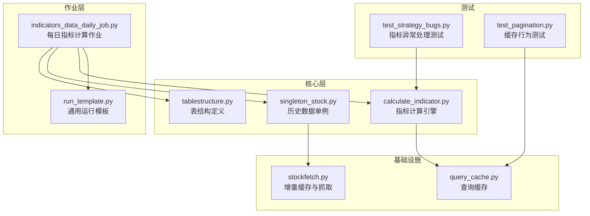
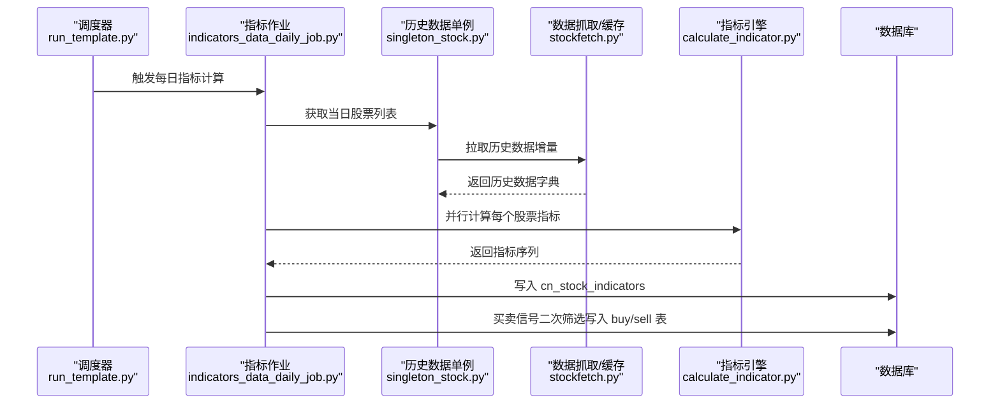
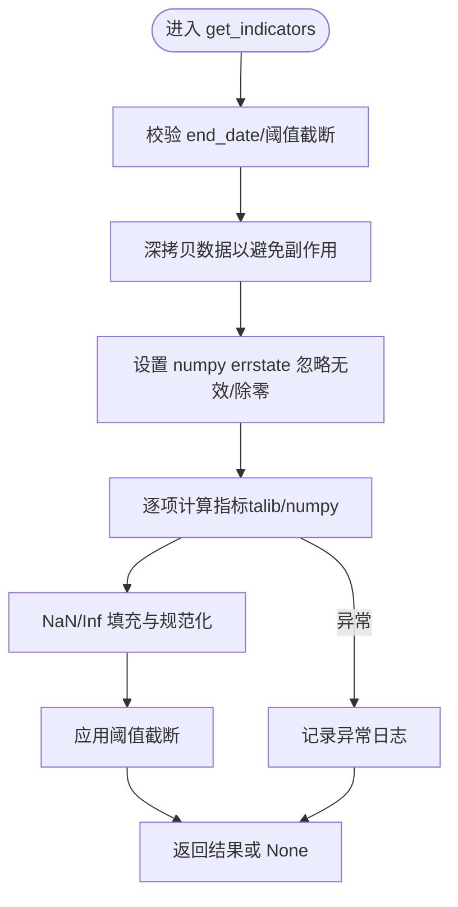
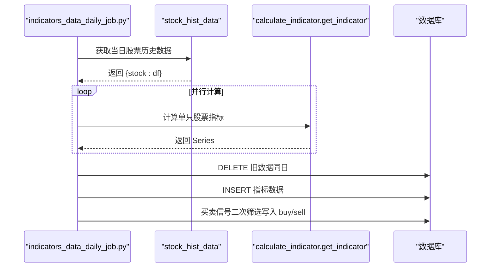
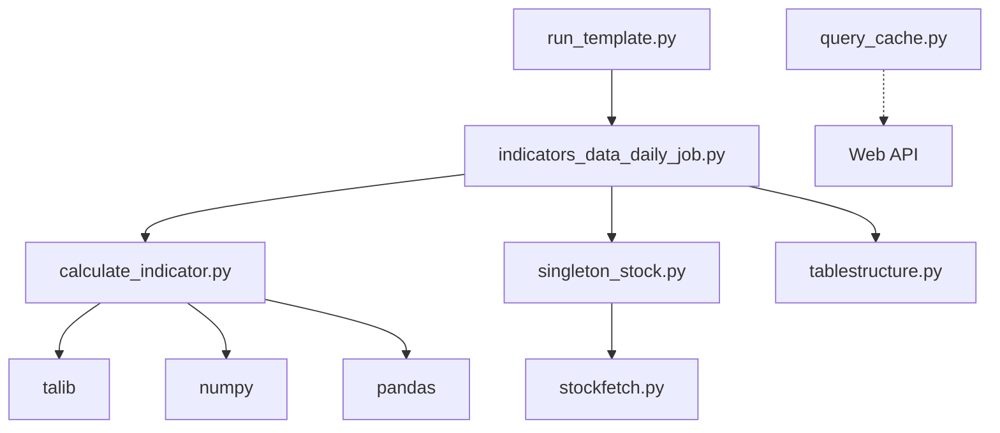

# 技术指标计算作业

<cite>
**本文档引用的文件**
- [calculate_indicator.py](file://quantia/core/indicator/calculate_indicator.py)
- [indicators_data_daily_job.py](file://quantia/job/indicators_data_daily_job.py)
- [tablestructure.py](file://quantia/core/tablestructure.py)
- [query_cache.py](file://quantia/lib/query_cache.py)
- [run_template.py](file://quantia/lib/run_template.py)
- [singleton_stock.py](file://quantia/core/singleton_stock.py)
- [stockfetch.py](file://quantia/core/stockfetch.py)
- [test_strategy_bugs.py](file://tests/test_strategy_bugs.py)
- [test_pagination.py](file://tests/test_pagination.py)
</cite>

## 目录
1. [简介](#简介)
2. [项目结构](#项目结构)
3. [核心组件](#核心组件)
4. [架构概览](#架构概览)
5. [详细组件分析](#详细组件分析)
6. [依赖关系分析](#依赖关系分析)
7. [性能考虑](#性能考虑)
8. [故障排除指南](#故障排除指南)
9. [结论](#结论)
10. [附录](#附录)

## 简介
本文件针对 Quantia 技术指标计算作业进行全面技术文档化，重点覆盖以下方面：
- 指标计算作业的核心流程与实现机制
- 指标计算的并行处理策略、数据预处理与后处理逻辑
- 200+ 种技术指标的计算方法、计算精度控制与异常处理机制
- 指标计算作业的缓存策略、增量计算模式与性能优化方法
- 指标计算的参数配置、错误恢复机制与计算结果验证方法
- 具体的代码示例与使用指南

## 项目结构
Quantia 项目采用分层架构设计，技术指标计算位于核心业务层，通过作业调度器驱动每日运行。关键目录与文件如下：
- 核心指标计算：quantia/core/indicator/calculate_indicator.py
- 日常指标作业：quantia/job/indicators_data_daily_job.py
- 表结构定义：quantia/core/tablestructure.py
- 查询缓存：quantia/lib/query_cache.py
- 通用运行模板：quantia/lib/run_template.py
- 股票历史数据单例：quantia/core/singleton_stock.py
- 股票数据抓取与增量缓存：quantia/core/stockfetch.py
- 测试用例：tests/test_strategy_bugs.py、tests/test_pagination.py

**图表来源**
- [indicators_data_daily_job.py](file://quantia/job/indicators_data_daily_job.py#L1-L171)
- [calculate_indicator.py](file://quantia/core/indicator/calculate_indicator.py#L1-L449)
- [tablestructure.py](file://quantia/core/tablestructure.py#L320-L398)
- [query_cache.py](file://quantia/lib/query_cache.py#L1-L156)
- [run_template.py](file://quantia/lib/run_template.py#L1-L95)
- [singleton_stock.py](file://quantia/core/singleton_stock.py#L1-L116)
- [stockfetch.py](file://quantia/core/stockfetch.py#L1280-L1375)
- [test_strategy_bugs.py](file://tests/test_strategy_bugs.py#L254-L277)
- [test_pagination.py](file://tests/test_pagination.py#L921-L993)

**章节来源**
- [indicators_data_daily_job.py](file://quantia/job/indicators_data_daily_job.py#L1-L171)
- [calculate_indicator.py](file://quantia/core/indicator/calculate_indicator.py#L1-L449)
- [tablestructure.py](file://quantia/core/tablestructure.py#L320-L398)
- [query_cache.py](file://quantia/lib/query_cache.py#L1-L156)
- [run_template.py](file://quantia/lib/run_template.py#L1-L95)
- [singleton_stock.py](file://quantia/core/singleton_stock.py#L1-L116)
- [stockfetch.py](file://quantia/core/stockfetch.py#L1280-L1375)
- [test_strategy_bugs.py](file://tests/test_strategy_bugs.py#L254-L277)
- [test_pagination.py](file://tests/test_pagination.py#L921-L993)

## 核心组件
本节对技术指标计算作业的关键组件进行深入分析，涵盖职责划分、数据结构与处理流程。

- 指标计算引擎（calculate_indicator.py）
  - 负责基于 pandas/numpy/talib 的200+指标计算
  - 提供数据预处理（NaN/Inf填充）、阈值截断与异常处理
  - 支持按日期与阈值的计算范围控制
  - 输出标准化的指标列集合

- 指标作业调度（indicators_data_daily_job.py）
  - 通过 ThreadPoolExecutor 实现多线程并行计算
  - 调用历史数据单例获取当日股票数据
  - 将计算结果写入数据库，并提供买卖信号二次筛选

- 表结构定义（tablestructure.py）
  - 定义 cn_stock_indicators 表结构及指标列清单
  - 提供 STOCK_STATS_DATA 指标列映射，覆盖 MACD、KDJ、布林带、RSI、VR、ATR、DMI、WR、CCI、DMA、TEMA、MFI、VWMA、PPO、StochRSI、WT、Supertrend、ROC、OBV、SAR、PSY、BRAR、EMV、BIAS、DPO、VHF、RVI、FI、ENE、成交量均线、MA 等指标

- 查询缓存（query_cache.py）
  - 提供 LRU + TTL 的线程安全缓存
  - 支持 COUNT 与 DATA 查询分别缓存
  - 提供缓存失效与统计接口

- 通用运行模板（run_template.py）
  - 支持单日、批量日期与区间作业
  - 统一日志初始化与异常处理
  - 控制并发度与交易日过滤

- 历史数据单例（singleton_stock.py）
  - 提供股票历史数据的单例访问
  - 支持并发线程数限制与增量更新
  - 提供实例释放以回收内存

- 股票数据抓取与增量缓存（stockfetch.py）
  - 实现分批提交与 GC 冷却暂停，降低内存峰值
  - 支持请求限流与重试策略
  - 提供增量缓存逻辑与 fetch 范围计算

**章节来源**
- [calculate_indicator.py](file://quantia/core/indicator/calculate_indicator.py#L23-L407)
- [indicators_data_daily_job.py](file://quantia/job/indicators_data_daily_job.py#L24-L87)
- [tablestructure.py](file://quantia/core/tablestructure.py#L320-L398)
- [query_cache.py](file://quantia/lib/query_cache.py#L27-L141)
- [run_template.py](file://quantia/lib/run_template.py#L18-L94)
- [singleton_stock.py](file://quantia/core/singleton_stock.py#L40-L105)
- [stockfetch.py](file://quantia/core/stockfetch.py#L1280-L1375)

## 架构概览
技术指标计算作业的整体架构围绕“作业调度-数据获取-并行计算-结果入库”的流水线展开。系统通过单例模式管理历史数据，利用线程池实现并行计算，并通过查询缓存与增量缓存降低数据库与网络压力。

**图表来源**
- [run_template.py](file://quantia/lib/run_template.py#L18-L94)
- [indicators_data_daily_job.py](file://quantia/job/indicators_data_daily_job.py#L24-L87)
- [singleton_stock.py](file://quantia/core/singleton_stock.py#L40-L105)
- [stockfetch.py](file://quantia/core/stockfetch.py#L1280-L1375)
- [calculate_indicator.py](file://quantia/core/indicator/calculate_indicator.py#L410-L448)

**章节来源**
- [run_template.py](file://quantia/lib/run_template.py#L18-L94)
- [indicators_data_daily_job.py](file://quantia/job/indicators_data_daily_job.py#L24-L87)
- [singleton_stock.py](file://quantia/core/singleton_stock.py#L40-L105)
- [stockfetch.py](file://quantia/core/stockfetch.py#L1280-L1375)
- [calculate_indicator.py](file://quantia/core/indicator/calculate_indicator.py#L410-L448)

## 详细组件分析

### 指标计算引擎（calculate_indicator.py）
- 数据预处理
  - 使用 _fillna 与 _fill_nan_inf 处理 NaN/Inf，兼容 pandas 2.x CoW 模式
  - 在计算前对输入数据进行深拷贝，避免修改调用方数据
  - 支持 end_date 与 calc_threshold 截断计算范围，提升性能

- 指标计算矩阵
  - 覆盖 MACD、KDJ、布林带、TRIX、CR、RSI、VR、ATR、DMI、WR、CCI、DMA、TEMA、MFI、VWMA、PPO、StochRSI、WT、Supertrend、ROC、OBV、SAR、PSY、BRAR、EMV、BIAS、DPO、VHF、RVI、FI、ENE、成交量均线、MA 等指标
  - 采用 talib 与 numpy 实现，统一数值精度与边界处理

- 异常处理
  - try-except 包裹整体计算流程，记录异常并返回 None
  - get_indicator 中对空数据与 INF/NAN 值进行兜底处理

**图表来源**
- [calculate_indicator.py](file://quantia/core/indicator/calculate_indicator.py#L23-L407)

**章节来源**
- [calculate_indicator.py](file://quantia/core/indicator/calculate_indicator.py#L13-L407)

### 指标作业调度（indicators_data_daily_job.py）
- 并行策略
  - ThreadPoolExecutor(max_workers=4) 并行处理股票指标
  - 使用 future.result() 收集结果，异常在子线程捕获并记录

- 数据获取与写入
  - 通过 stock_hist_data(date).get_data() 获取当日股票历史数据
  - 删除同日旧数据后批量写入 cn_stock_indicators
  - 提供 guess_buy/guess_sell 二次筛选，写入 buy/sell 表

- 买卖信号规则
  - 基于 KDJ、RSI、CCI、CR、WR、VR 等指标阈值进行简单筛选

**图表来源**
- [indicators_data_daily_job.py](file://quantia/job/indicators_data_daily_job.py#L24-L124)

**章节来源**
- [indicators_data_daily_job.py](file://quantia/job/indicators_data_daily_job.py#L24-L124)

### 表结构与指标列（tablestructure.py）
- STOCK_STATS_DATA 定义了标准指标列集合，覆盖常用技术指标
- cn_stock_indicators 表在外键基础上扩展 STOCK_STATS_DATA 列
- 提供策略表结构与回测数据列映射，支撑后续策略与回测模块

**章节来源**
- [tablestructure.py](file://quantia/core/tablestructure.py#L320-L398)

### 查询缓存（query_cache.py）
- LRU + TTL 策略，支持线程安全
- 缓存键由 SQL + 参数组合生成，确保唯一性
- 提供缓存统计、过期清理与失效接口
- 为 Web API 提供内存缓存，减少数据库重复查询

**章节来源**
- [query_cache.py](file://quantia/lib/query_cache.py#L27-L141)

### 通用运行模板（run_template.py）
- 支持三种运行模式：单日、批量日期、区间作业
- 自动初始化日志，按调用文件名推导日志名
- 控制并发度与交易日过滤，避免非交易日执行

**章节来源**
- [run_template.py](file://quantia/lib/run_template.py#L18-L94)

### 历史数据单例与增量缓存（singleton_stock.py、stockfetch.py）
- stock_hist_data 单例负责历史数据加载与并发控制
- 通过 ThreadPoolExecutor 分批提交，限制并发数避免 API 限流
- stockfetch 实现分批提交与 GC 冷却暂停，降低内存峰值
- 增量缓存逻辑根据缓存边界计算 fetch 范围，减少重复抓取

**章节来源**
- [singleton_stock.py](file://quantia/core/singleton_stock.py#L40-L105)
- [stockfetch.py](file://quantia/core/stockfetch.py#L1280-L1375)

## 依赖关系分析
- 指标作业依赖历史数据单例与表结构定义
- 指标引擎依赖 talib、numpy、pandas
- 查询缓存为 Web 层提供缓存能力，与指标计算解耦
- 运行模板为各类作业提供统一入口与并发控制

**图表来源**
- [calculate_indicator.py](file://quantia/core/indicator/calculate_indicator.py#L4-L7)
- [indicators_data_daily_job.py](file://quantia/job/indicators_data_daily_job.py#L14-L18)
- [singleton_stock.py](file://quantia/core/singleton_stock.py#L6-L8)
- [stockfetch.py](file://quantia/core/stockfetch.py#L1280-L1375)
- [query_cache.py](file://quantia/lib/query_cache.py#L1-L156)
- [run_template.py](file://quantia/lib/run_template.py#L1-L95)

**章节来源**
- [calculate_indicator.py](file://quantia/core/indicator/calculate_indicator.py#L4-L7)
- [indicators_data_daily_job.py](file://quantia/job/indicators_data_daily_job.py#L14-L18)
- [singleton_stock.py](file://quantia/core/singleton_stock.py#L6-L8)
- [stockfetch.py](file://quantia/core/stockfetch.py#L1280-L1375)
- [query_cache.py](file://quantia/lib/query_cache.py#L1-L156)
- [run_template.py](file://quantia/lib/run_template.py#L1-L95)

## 性能考虑
- 并行计算
  - 指标作业使用 ThreadPoolExecutor(max_workers=4)，平衡 CPU 与 I/O
  - 历史数据加载同样限制并发数，避免 API 限流
  - 分批提交与 GC 冷却暂停降低内存峰值

- 缓存策略
  - 查询缓存采用 LRU + TTL，支持 COUNT/DATA 分离缓存
  - 通过缓存键（SQL+参数）保证唯一性，避免误命中
  - 提供缓存统计与过期清理，保障缓存健康度

- 数据截断与阈值
  - end_date 与 calc_threshold 截断计算范围，减少无效计算
  - threshold 截断输出，仅保留最近 N 条记录

- 数值稳定性
  - 使用 _fill_nan_inf 处理 NaN/Inf，避免传播至后续计算
  - numpy.errstate 忽略无效/除零警告，防止中断计算

**章节来源**
- [indicators_data_daily_job.py](file://quantia/job/indicators_data_daily_job.py#L72-L87)
- [singleton_stock.py](file://quantia/core/singleton_stock.py#L71-L71)
- [stockfetch.py](file://quantia/core/stockfetch.py#L1280-L1375)
- [query_cache.py](file://quantia/lib/query_cache.py#L27-L141)
- [calculate_indicator.py](file://quantia/core/indicator/calculate_indicator.py#L23-L407)

## 故障排除指南
- 指标计算异常
  - 现象：计算过程中抛出异常导致返回 None
  - 排查：检查输入数据是否为空、是否存在 NaN/Inf；查看日志中异常堆栈
  - 处理：在 get_indicator 中对 INF/NAN 值进行兜底，确保返回 0

- 缓存命中异常
  - 现象：缓存命中率低或命中错误
  - 排查：确认 SQL 与参数是否一致；检查缓存键生成逻辑
  - 处理：使用 invalidate 清除特定缓存，或按需清理全部缓存

- 并发与内存问题
  - 现象：并发过高导致内存飙升或 API 限流
  - 排查：检查 workers 设置与分批提交策略
  - 处理：降低并发数，启用分批提交与 GC 冷却暂停

- 数据截断问题
  - 现象：输出数据少于预期
  - 排查：检查 threshold/end_date/calc_threshold 参数
  - 处理：适当增大阈值或移除截断条件

**章节来源**
- [calculate_indicator.py](file://quantia/core/indicator/calculate_indicator.py#L405-L448)
- [query_cache.py](file://quantia/lib/query_cache.py#L93-L121)
- [indicators_data_daily_job.py](file://quantia/job/indicators_data_daily_job.py#L72-L87)
- [singleton_stock.py](file://quantia/core/singleton_stock.py#L71-L71)
- [stockfetch.py](file://quantia/core/stockfetch.py#L1280-L1375)

## 结论
Quantia 的技术指标计算作业通过清晰的分层设计与严格的性能优化策略，实现了稳定高效的指标计算流水线。核心优势包括：
- 基于线程池的并行计算与内存控制
- 完善的数据预处理与异常处理机制
- 查询缓存与增量缓存相结合的性能优化
- 可扩展的指标体系与标准化输出

建议在生产环境中持续监控缓存命中率与内存使用情况，结合业务需求调整并发与阈值参数，确保系统在高负载下的稳定性与准确性。

## 附录

### 指标计算参数配置
- 计算范围控制
  - end_date：截止日期，仅计算小于等于该日期的数据
  - calc_threshold：按时间窗口截断输入数据长度
  - threshold：按时间窗口截断输出数据长度

- 并行与性能
  - workers：指标作业线程数（默认 4）
  - 并发限制：历史数据加载限制并发数，避免 API 限流

**章节来源**
- [calculate_indicator.py](file://quantia/core/indicator/calculate_indicator.py#L23-L407)
- [indicators_data_daily_job.py](file://quantia/job/indicators_data_daily_job.py#L65-L87)
- [singleton_stock.py](file://quantia/core/singleton_stock.py#L71-L71)

### 计算结果验证方法
- 单元测试
  - test_strategy_bugs.py 验证指标异常处理（如 EMV/VHF/m_price 使用 _fill_nan_inf）
  - test_pagination.py 验证缓存命中与过期清理行为

- 手工验证
  - 对比部分股票的指标结果与 talib/numpy 计算结果
  - 检查 INF/NAN 填充是否生效

**章节来源**
- [test_strategy_bugs.py](file://tests/test_strategy_bugs.py#L254-L277)
- [test_pagination.py](file://tests/test_pagination.py#L921-L993)
