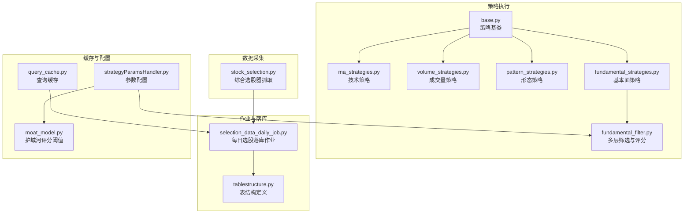
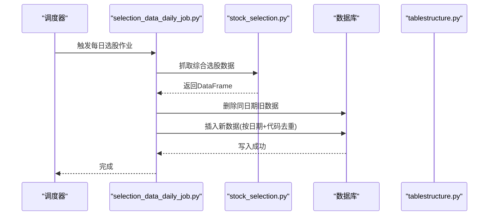
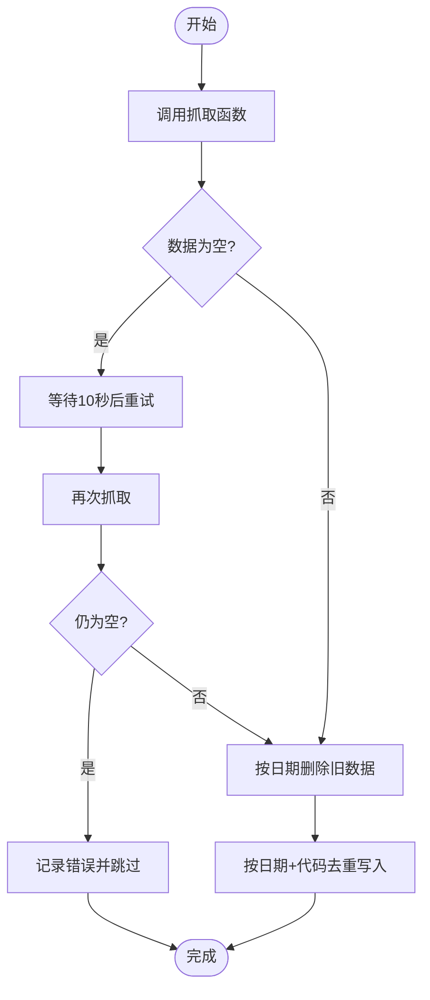
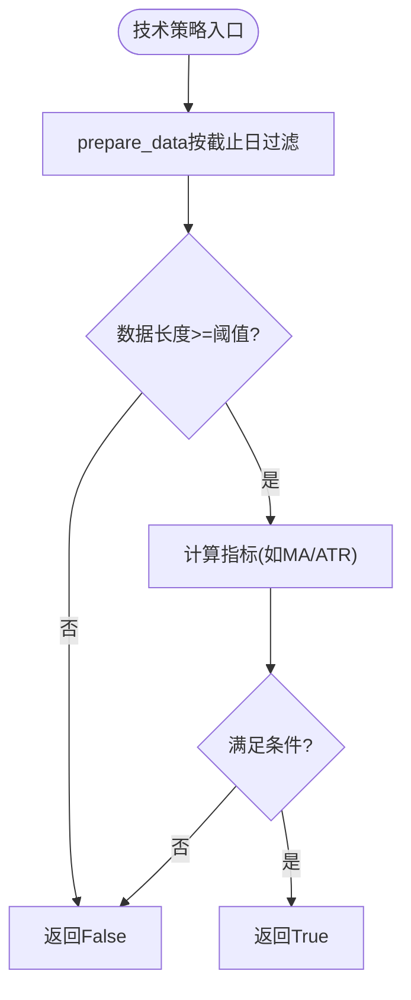
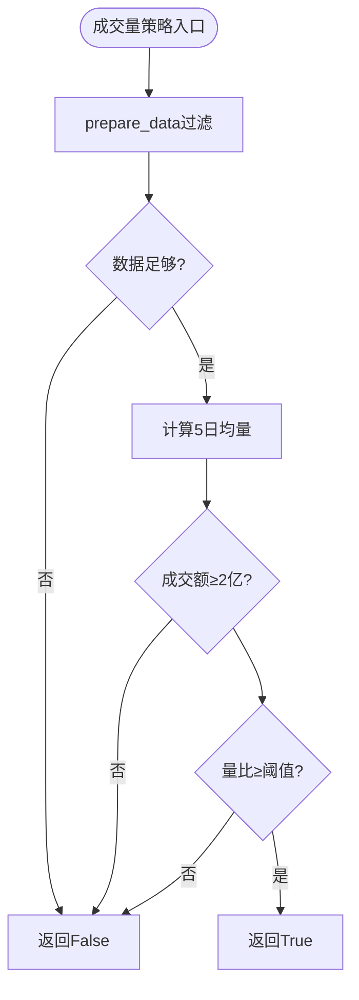
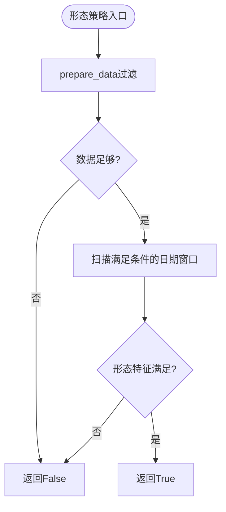
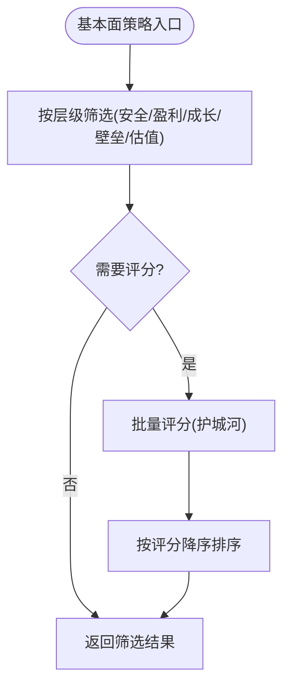
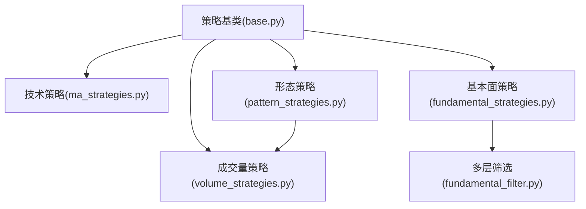

# 选股结果计算作业

<cite>
**本文档引用的文件**
- [selection_data_daily_job.py](file://quantia/job/selection_data_daily_job.py)
- [stock_selection.py](file://quantia/core/crawling/stock_selection.py)
- [tablestructure.py](file://quantia/core/tablestructure.py)
- [base.py](file://quantia/core/strategy/base.py)
- [ma_strategies.py](file://quantia/core/strategy/technical/ma_strategies.py)
- [volume_strategies.py](file://quantia/core/strategy/volume/volume_strategies.py)
- [pattern_strategies.py](file://quantia/core/strategy/pattern/pattern_strategies.py)
- [fundamental_strategies.py](file://quantia/core/strategy/fundamental/fundamental_strategies.py)
- [fundamental_filter.py](file://quantia/core/strategy/fundamental/fundamental_filter.py)
- [query_cache.py](file://quantia/lib/query_cache.py)
- [strategyParamsHandler.py](file://quantia/web/strategyParamsHandler.py)
- [moat_model.py](file://quantia/core/strategy/fundamental/moat_model.py)
</cite>

## 目录
1. [简介](#简介)
2. [项目结构](#项目结构)
3. [核心组件](#核心组件)
4. [架构概览](#架构概览)
5. [详细组件分析](#详细组件分析)
6. [依赖关系分析](#依赖关系分析)
7. [性能考虑](#性能考虑)
8. [故障排查指南](#故障排查指南)
9. [结论](#结论)
10. [附录](#附录)

## 简介
本技术文档围绕 Quantia 项目中的“选股结果计算作业”展开，系统阐述选股计算的完整流程与机制，包括数据采集、策略执行、结果合并、过滤与排序、权重与评分、去重与缓存、参数配置与验证等。文档面向开发者与策略研究者，既提供代码级细节，也给出可视化图示与实操建议。

## 项目结构
该项目采用模块化设计，围绕“数据采集-策略执行-结果落库”的流水线组织代码。关键目录与职责如下：
- quantia/job：定时任务与数据落库作业（如选股结果每日作业）
- quantia/core/crawling：数据抓取模块（如综合选股器）
- quantia/core/strategy：策略体系（技术、成交量、形态、基本面）
- quantia/core/tablestructure：数据库表结构定义
- quantia/lib：通用库（查询缓存、数据库连接等）
- quantia/web：Web 参数配置与前端交互
- quantia/fontWeb：前端界面与可视化



图表来源
- [selection_data_daily_job.py](file://quantia/job/selection_data_daily_job.py#L22-L58)
- [stock_selection.py](file://quantia/core/crawling/stock_selection.py#L18-L110)
- [tablestructure.py](file://quantia/core/tablestructure.py#L591-L800)
- [base.py](file://quantia/core/strategy/base.py#L20-L96)
- [ma_strategies.py](file://quantia/core/strategy/technical/ma_strategies.py#L22-L55)
- [volume_strategies.py](file://quantia/core/strategy/volume/volume_strategies.py#L19-L68)
- [pattern_strategies.py](file://quantia/core/strategy/pattern/pattern_strategies.py#L22-L77)
- [fundamental_strategies.py](file://quantia/core/strategy/fundamental/fundamental_strategies.py#L30-L119)
- [fundamental_filter.py](file://quantia/core/strategy/fundamental/fundamental_filter.py#L118-L172)
- [query_cache.py](file://quantia/lib/query_cache.py#L27-L92)
- [strategyParamsHandler.py](file://quantia/web/strategyParamsHandler.py#L223-L351)
- [moat_model.py](file://quantia/core/strategy/fundamental/moat_model.py#L426-L478)

章节来源
- [selection_data_daily_job.py](file://quantia/job/selection_data_daily_job.py#L22-L68)
- [stock_selection.py](file://quantia/core/crawling/stock_selection.py#L18-L110)
- [tablestructure.py](file://quantia/core/tablestructure.py#L591-L800)

## 核心组件
- 选股数据抓取器：从东方财富综合选股器抓取全市场股票基础数据，支持分页与重试，清洗字段类型与格式。
- 策略基类与策略注册：统一策略接口、数据准备、阈值控制与注册机制，便于扩展与组合。
- 策略集合：技术（均线、ATR、海龟）、成交量（放量、放量跌停）、形态（平台突破、停机坪、旗形）、基本面（价值、成长、护城河、股息成长）。
- 多层筛选与评分：按财务安全、盈利能力、成长质量、竞争壁垒、估值约束逐层过滤，结合护城河评分模型量化打分。
- 每日作业：定时抓取并落库，按日期清理旧数据，保证结果一致性。
- 查询缓存：LRU + TTL 的线程安全缓存，降低重复查询成本。
- 参数配置：Web 层提供策略参数与评分阈值配置，支持权重调整与阈值动态化。

章节来源
- [base.py](file://quantia/core/strategy/base.py#L20-L96)
- [ma_strategies.py](file://quantia/core/strategy/technical/ma_strategies.py#L22-L55)
- [volume_strategies.py](file://quantia/core/strategy/volume/volume_strategies.py#L19-L68)
- [pattern_strategies.py](file://quantia/core/strategy/pattern/pattern_strategies.py#L22-L77)
- [fundamental_strategies.py](file://quantia/core/strategy/fundamental/fundamental_strategies.py#L30-L119)
- [fundamental_filter.py](file://quantia/core/strategy/fundamental/fundamental_filter.py#L118-L172)
- [selection_data_daily_job.py](file://quantia/job/selection_data_daily_job.py#L22-L58)
- [query_cache.py](file://quantia/lib/query_cache.py#L27-L92)
- [strategyParamsHandler.py](file://quantia/web/strategyParamsHandler.py#L223-L351)
- [moat_model.py](file://quantia/core/strategy/fundamental/moat_model.py#L426-L478)

## 架构概览
下图展示从数据抓取到结果落库的关键路径，以及策略与评分模块的集成方式：



图表来源
- [selection_data_daily_job.py](file://quantia/job/selection_data_daily_job.py#L22-L58)
- [stock_selection.py](file://quantia/core/crawling/stock_selection.py#L18-L110)
- [tablestructure.py](file://quantia/core/tablestructure.py#L591-L800)

## 详细组件分析

### 1) 选股数据抓取与落库作业
- 抓取逻辑：构造字段映射，分页拉取，首页重试保护，逐页独立重试，失败页记录日志但返回已获取数据。
- 落库逻辑：按日期删除旧数据，若表不存在则先建表并解析字段类型，使用日期+代码作为唯一索引写入。
- 异常处理：首次失败重试一次，仍失败则记录错误并跳过本次更新。



图表来源
- [selection_data_daily_job.py](file://quantia/job/selection_data_daily_job.py#L22-L58)
- [stock_selection.py](file://quantia/core/crawling/stock_selection.py#L18-L110)

章节来源
- [selection_data_daily_job.py](file://quantia/job/selection_data_daily_job.py#L22-L58)
- [stock_selection.py](file://quantia/core/crawling/stock_selection.py#L18-L110)

### 2) 策略基类与注册机制
- 统一接口：check(code_name, data, date, **kwargs) 返回布尔值。
- 数据准备：prepare_data 自动按截止日期过滤并校验最小数据长度阈值。
- 注册机制：装饰器注册策略，支持按分类检索与全局策略表。

```mermaid
classDiagram
class BaseStrategy {
+name : str
+cn_name : str
+category : str
+threshold : int
+check(code_name, data, date, **kwargs) bool
+prepare_data(code_name, data, date) DataFrame?
+__call__(...) bool
}
class TechnicalStrategy {
+calc_ma(data, column, period) ndarray
+calc_ema(data, column, period) ndarray
+calc_atr(data, period) ndarray
}
class VolumeStrategy {
+calc_vol_ma(data, period) ndarray
+calc_amount(data, row_index) float
}
class PatternStrategy
class TrendStrategy
class BaseStrategy <|-- TechnicalStrategy
class BaseStrategy <|-- VolumeStrategy
class BaseStrategy <|-- PatternStrategy
class BaseStrategy <|-- TrendStrategy
```

图表来源
- [base.py](file://quantia/core/strategy/base.py#L20-L96)
- [base.py](file://quantia/core/strategy/base.py#L99-L143)
- [base.py](file://quantia/core/strategy/base.py#L126-L143)

章节来源
- [base.py](file://quantia/core/strategy/base.py#L20-L202)

### 3) 技术策略（均线、ATR、海龟）
- 均线多头：30日均线持续上行且涨幅超20%。
- 回踩年线：突破250日均线后回踩不破，缩量整理。
- 海龟交易：突破60日新高。
- 低ATR成长：ATR相对价格比例低于阈值且120日涨幅超10%。



图表来源
- [ma_strategies.py](file://quantia/core/strategy/technical/ma_strategies.py#L36-L55)
- [ma_strategies.py](file://quantia/core/strategy/technical/ma_strategies.py#L73-L137)
- [ma_strategies.py](file://quantia/core/strategy/technical/ma_strategies.py#L153-L166)
- [ma_strategies.py](file://quantia/core/strategy/technical/ma_strategies.py#L183-L211)

章节来源
- [ma_strategies.py](file://quantia/core/strategy/technical/ma_strategies.py#L22-L237)

### 4) 成交量策略（放量上涨、放量跌停）
- 放量上涨：当日涨幅>2%且收涨、成交额≥2亿、量比≥2。
- 放量跌停：当日接近跌停且量比≥1.5。



图表来源
- [volume_strategies.py](file://quantia/core/strategy/volume/volume_strategies.py#L34-L68)
- [volume_strategies.py](file://quantia/core/strategy/volume/volume_strategies.py#L85-L112)

章节来源
- [volume_strategies.py](file://quantia/core/strategy/volume/volume_strategies.py#L19-L126)

### 5) 形态策略（平台突破、停机坪、旗形、无大幅回撤）
- 平台突破：60日均线附近放量突破。
- 停机坪：涨停后横盘整理，连续高开小幅波动。
- 旗形：短期快速上涨后窄幅整理，机构参与。
- 无大幅回撤：60日稳健上涨且回撤幅度受控。



图表来源
- [pattern_strategies.py](file://quantia/core/strategy/pattern/pattern_strategies.py#L37-L77)
- [pattern_strategies.py](file://quantia/core/strategy/pattern/pattern_strategies.py#L95-L148)
- [pattern_strategies.py](file://quantia/core/strategy/pattern/pattern_strategies.py#L167-L203)
- [pattern_strategies.py](file://quantia/core/strategy/pattern/pattern_strategies.py#L220-L250)

章节来源
- [pattern_strategies.py](file://quantia/core/strategy/pattern/pattern_strategies.py#L22-L276)

### 6) 基本面策略与评分模型
- 价值投资策略：ROE、毛利率、净利率、资产负债率、现金流、PE等多维门槛。
- 成长投资策略：营收/利润3年复合增长率、ROE、毛利率、资产负债率。
- 护城河策略：先做基本面筛选，再按护城河评分阈值与权重打分排序。
- 股息成长策略：股息率、ROE、利润增长、资产负债率、现金流。
- 多层筛选：财务安全→盈利能力→成长质量→竞争壁垒→估值约束，逐层过滤。
- 护城河评分：盈利能力、稳定性、成长能力、经营效率、财务安全五维打分，支持阈值与权重配置。



图表来源
- [fundamental_strategies.py](file://quantia/core/strategy/fundamental/fundamental_strategies.py#L112-L119)
- [fundamental_strategies.py](file://quantia/core/strategy/fundamental/fundamental_strategies.py#L195-L202)
- [fundamental_strategies.py](file://quantia/core/strategy/fundamental/fundamental_strategies.py#L269-L288)
- [fundamental_filter.py](file://quantia/core/strategy/fundamental/fundamental_filter.py#L135-L172)
- [fundamental_filter.py](file://quantia/core/strategy/fundamental/fundamental_filter.py#L321-L366)

章节来源
- [fundamental_strategies.py](file://quantia/core/strategy/fundamental/fundamental_strategies.py#L30-L351)
- [fundamental_filter.py](file://quantia/core/strategy/fundamental/fundamental_filter.py#L118-L698)
- [moat_model.py](file://quantia/core/strategy/fundamental/moat_model.py#L426-L478)

### 7) 权重分配与评分机制
- 权重来源：Web 参数配置（盈利能力、成长能力、评级阈值、量化权重等）。
- 阈值配置：从数据库加载用户自定义值，动态覆盖默认阈值。
- 综合评分：按指标权重与阈值计算单项得分，汇总得到总分与评级。

章节来源
- [strategyParamsHandler.py](file://quantia/web/strategyParamsHandler.py#L223-L351)
- [moat_model.py](file://quantia/core/strategy/fundamental/moat_model.py#L426-L478)

### 8) 结果合并、过滤与排序
- 策略合并：多策略结果以“并集/交集/加权融合”形式整合（具体合并策略由业务配置决定）。
- 过滤条件：按日期、行业、板块、估值、财务指标等字段过滤。
- 排序算法：按策略得分、护城河评分、PE/PB等指标排序，支持多字段排序。
- 去重处理：以“日期+代码”为主键去重，确保同日同股唯一。

章节来源
- [selection_data_daily_job.py](file://quantia/job/selection_data_daily_job.py#L48-L55)
- [tablestructure.py](file://quantia/core/tablestructure.py#L591-L800)

### 9) 性能优化与批量处理
- 分页抓取：每页500条，首页重试，逐页独立重试，降低整体失败概率。
- 缓存策略：LRU + TTL，线程安全，支持统计与清理过期条目。
- 批量评分：DataFrame 批处理评分，避免逐行循环。
- 数据库写入：按日期删除旧数据，批量插入，唯一索引去重。

章节来源
- [stock_selection.py](file://quantia/core/crawling/stock_selection.py#L30-L90)
- [query_cache.py](file://quantia/lib/query_cache.py#L27-L141)
- [fundamental_filter.py](file://quantia/core/strategy/fundamental/fundamental_filter.py#L604-L637)
- [selection_data_daily_job.py](file://quantia/job/selection_data_daily_job.py#L48-L55)

### 10) 参数配置与结果验证
- 参数配置：Web 层提供策略参数与评分阈值配置页面，支持权重与阈值动态调整。
- 结果验证：通过回测报表与收益分布验证策略有效性，支持多区间与多指标对比。

章节来源
- [strategyParamsHandler.py](file://quantia/web/strategyParamsHandler.py#L223-L351)

## 依赖关系分析
策略模块之间存在组合与依赖关系，例如形态策略依赖成交量策略，护城河策略依赖多层筛选与评分模块。



图表来源
- [base.py](file://quantia/core/strategy/base.py#L20-L202)
- [ma_strategies.py](file://quantia/core/strategy/technical/ma_strategies.py#L16-L16)
- [volume_strategies.py](file://quantia/core/strategy/volume/volume_strategies.py#L13-L13)
- [pattern_strategies.py](file://quantia/core/strategy/pattern/pattern_strategies.py#L16-L16)
- [fundamental_strategies.py](file://quantia/core/strategy/fundamental/fundamental_strategies.py#L18-L24)
- [fundamental_filter.py](file://quantia/core/strategy/fundamental/fundamental_filter.py#L18-L24)

章节来源
- [base.py](file://quantia/core/strategy/base.py#L20-L202)
- [pattern_strategies.py](file://quantia/core/strategy/pattern/pattern_strategies.py#L38-L66)

## 性能考虑
- 抓取性能：分页大小与重试策略平衡成功率与请求量；首页失败直接失败，后续页独立重试。
- 缓存性能：LRU + TTL，命中率统计，定期清理过期条目；按 SQL+参数生成唯一 key。
- 计算性能：批量计算指标与评分，避免逐行处理；阈值与权重来自配置中心，减少重复计算。
- 存储性能：唯一索引去重，按日期分区删除旧数据，减少写入冲突。

## 故障排查指南
- 抓取失败：检查网络与代理，观察日志重试次数；若多次失败，确认接口变更与字段映射。
- 落库异常：确认表是否存在与字段类型，检查日期格式与唯一索引冲突。
- 策略结果为空：核对策略阈值与参数配置，确认数据长度是否满足策略阈值。
- 缓存命中异常：检查 key 生成规则与参数序列化，确认 TTL 是否过短。

章节来源
- [selection_data_daily_job.py](file://quantia/job/selection_data_daily_job.py#L26-L36)
- [stock_selection.py](file://quantia/core/crawling/stock_selection.py#L46-L89)
- [query_cache.py](file://quantia/lib/query_cache.py#L44-L92)

## 结论
本作业通过“抓取-策略-评分-落库-缓存”的闭环，实现了可配置、可扩展、可验证的选股结果计算体系。策略模块化设计便于组合与演进，参数与阈值的动态配置提升了适配性，缓存与批量处理保障了性能。建议在生产环境中结合回测与监控，持续优化策略权重与阈值，提升策略稳定性与收益。

## 附录
- 选股示例与策略组合指南
  - 示例1：稳健成长组合（技术+基本面）
    - 策略：均线多头 + 低ATR成长 + 成长投资策略
    - 过滤：PE/PB 合理区间，ROE>12%，资产负债率<65%
    - 排序：按成长能力权重与PE排序
  - 示例2：价值挖掘组合（基本面）
    - 策略：价值投资策略 + 护城河策略
    - 过滤：ROE>15%，毛利率>30%，PE<50，护城河评分≥65分
    - 排序：按护城河总分降序
  - 示例3：短线博弈组合（技术+成交量）
    - 策略：放量上涨 + 海龟交易 + 停机坪
    - 过滤：当日涨跌幅>2%，量比≥2
    - 排序：按量价配合度与突破强度排序
- 参数配置要点
  - 权重与阈值：通过 Web 页面调整，保存后缓存失效，确保新配置生效
  - 评分阈值：支持自定义，优先从数据库加载用户配置
  - 缓存策略：筛选结果缓存TTL 10分钟，股票数据缓存TTL 5分钟

章节来源
- [strategyParamsHandler.py](file://quantia/web/strategyParamsHandler.py#L223-L351)
- [moat_model.py](file://quantia/core/strategy/fundamental/moat_model.py#L453-L478)
- [query_cache.py](file://quantia/lib/query_cache.py#L147-L156)
