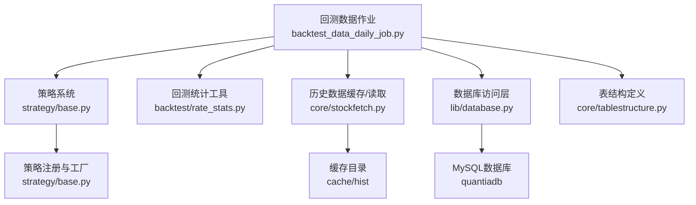
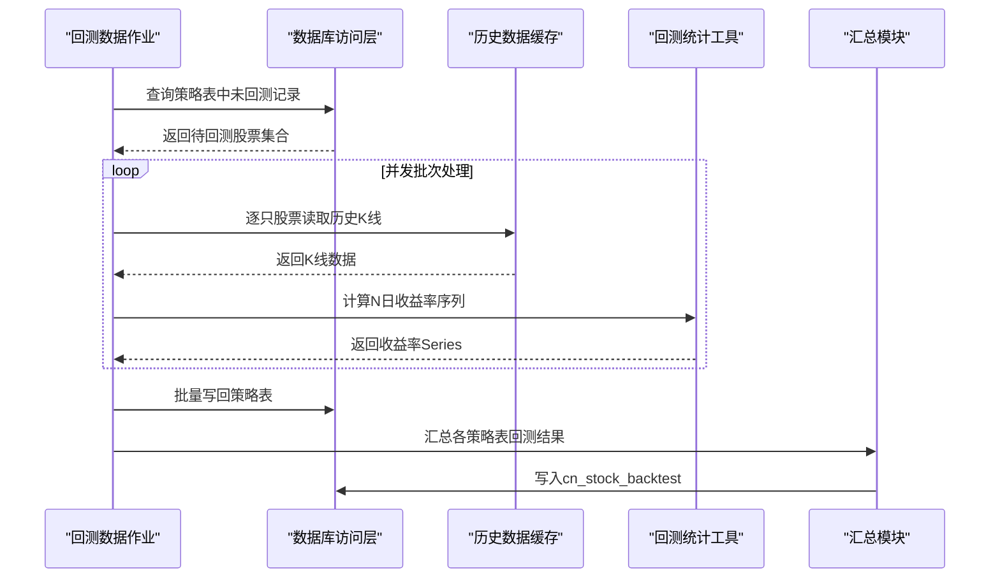
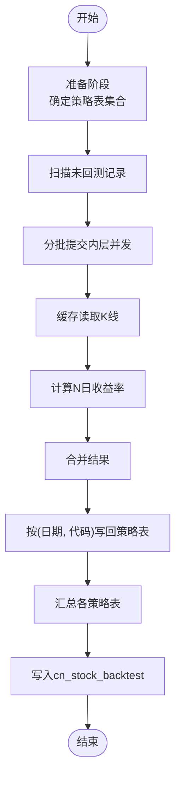
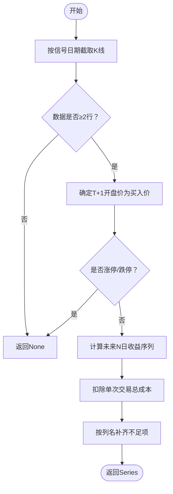
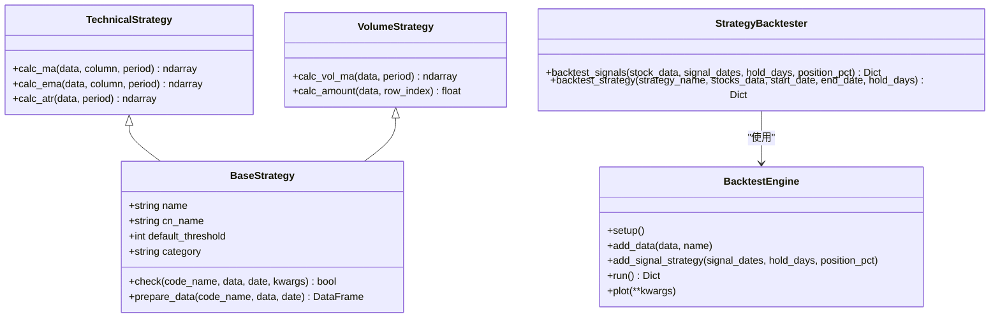
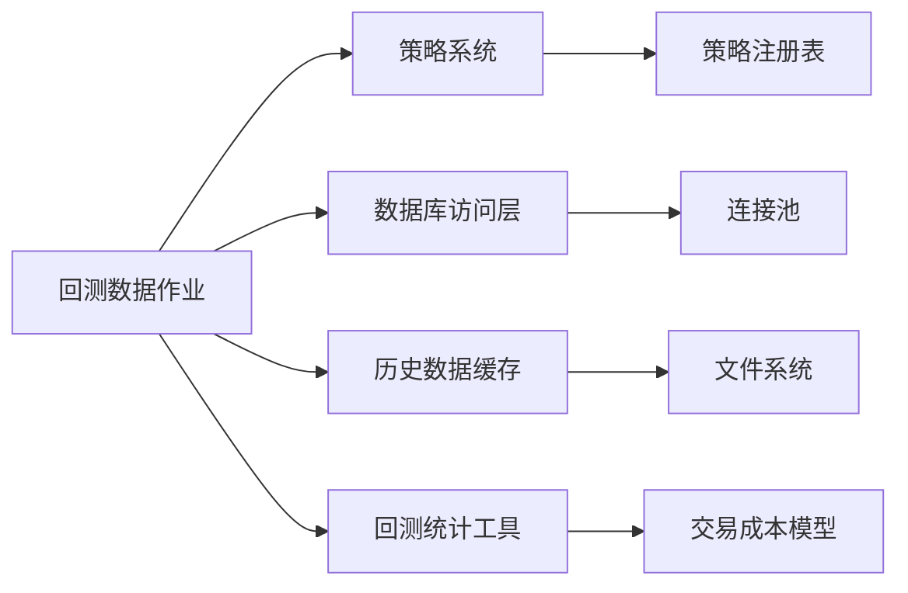

# 回测数据作业

<cite>
**本文引用的文件**
- [backtest_data_daily_job.py](file://quantia/job/backtest_data_daily_job.py)
- [bt_engine.py](file://quantia/core/backtest/bt_engine.py)
- [rate_stats.py](file://quantia/core/backtest/rate_stats.py)
- [stockfetch.py](file://quantia/core/stockfetch.py)
- [database.py](file://quantia/lib/database.py)
- [tablestructure.py](file://quantia/core/tablestructure.py)
- [base.py](file://quantia/core/strategy/base.py)
- [README.md](file://README.md)
</cite>

## 目录
1. [简介](#简介)
2. [项目结构](#项目结构)
3. [核心组件](#核心组件)
4. [架构总览](#架构总览)
5. [详细组件分析](#详细组件分析)
6. [依赖关系分析](#依赖关系分析)
7. [性能考量](#性能考量)
8. [故障排查指南](#故障排查指南)
9. [结论](#结论)
10. [附录](#附录)

## 简介
本文件面向Quantia回测数据作业，系统性阐述其核心功能、执行流程、与策略系统的集成方式、数据依赖关系、执行时序控制、资源配置、并发控制与性能监控策略，并给出配置参数、回测参数设置与结果数据格式化方法。目标读者既包括工程实施人员，也包括对量化回测感兴趣的研究者与分析师。

## 项目结构
回测数据作业位于quantia/job目录下的backtest_data_daily_job.py，围绕“逐表准备—逐只股票回测—汇总统计”的流水线展开，配合策略系统、指标与K线形态、数据库层与缓存层协同工作，形成从原始K线到回测收益序列再到汇总报表的完整链路。

**图表来源**
- [backtest_data_daily_job.py](file://quantia/job/backtest_data_daily_job.py#L1-L275)
- [rate_stats.py](file://quantia/core/backtest/rate_stats.py#L1-L108)
- [stockfetch.py](file://quantia/core/stockfetch.py#L1-L800)
- [database.py](file://quantia/lib/database.py#L1-L304)
- [tablestructure.py](file://quantia/core/tablestructure.py#L1-L1137)
- [base.py](file://quantia/core/strategy/base.py#L1-L202)

**章节来源**
- [backtest_data_daily_job.py](file://quantia/job/backtest_data_daily_job.py#L1-L275)
- [README.md](file://README.md#L214-L231)

## 核心组件
- 回测数据作业入口与流程控制：负责按表准备、并发调度、结果写回与汇总。
- 回测统计工具：提供逐只股票的N日收益率计算与交易成本扣除逻辑。
- 历史数据缓存与读取：按需从本地缓存读取K线，避免全量加载。
- 数据库访问层：提供连接池、UPSERT、更新与查询等能力。
- 策略系统：提供策略注册与工厂，支撑策略回测器（可选）。
- 表结构定义：统一回测结果表、策略表、汇总表的字段与类型。

**章节来源**
- [backtest_data_daily_job.py](file://quantia/job/backtest_data_daily_job.py#L34-L141)
- [rate_stats.py](file://quantia/core/backtest/rate_stats.py#L34-L108)
- [stockfetch.py](file://quantia/core/stockfetch.py#L744-L782)
- [database.py](file://quantia/lib/database.py#L60-L242)
- [tablestructure.py](file://quantia/core/tablestructure.py#L22-L44)

## 架构总览
回测数据作业采用“流式回测”架构：按策略表顺序扫描，筛选待回测记录，逐只股票从磁盘缓存读取历史K线，计算N日收益率序列，写回对应策略表；最后汇总各策略表的回测结果到cn_stock_backtest表。

**图表来源**
- [backtest_data_daily_job.py](file://quantia/job/backtest_data_daily_job.py#L59-L136)
- [rate_stats.py](file://quantia/core/backtest/rate_stats.py#L34-L108)
- [stockfetch.py](file://quantia/core/stockfetch.py#L744-L782)
- [database.py](file://quantia/lib/database.py#L120-L242)

## 详细组件分析

### 组件A：回测数据作业（准备与执行）
- 表准备阶段：确定参与回测的策略表集合（含指标表、策略表、GPT综合选股表），并按环境变量控制外层并发度。
- 数据读取与并发：按表读取未回测记录，构造(日期, 代码)集合，分批提交内层并发线程池，逐只股票从缓存读取K线并计算收益。
- 写回策略表：将回测结果合并为DataFrame，按(日期, 代码)主键更新策略表对应列。
- 汇总统计：遍历策略表，按日期聚合选股数、回测数、成功数与各horizon的平均收益，写入cn_stock_backtest表；自动迁移新增avg_rate_N列。

**图表来源**
- [backtest_data_daily_job.py](file://quantia/job/backtest_data_daily_job.py#L34-L141)
- [backtest_data_daily_job.py](file://quantia/job/backtest_data_daily_job.py#L167-L270)

**章节来源**
- [backtest_data_daily_job.py](file://quantia/job/backtest_data_daily_job.py#L34-L141)
- [backtest_data_daily_job.py](file://quantia/job/backtest_data_daily_job.py#L167-L270)

### 组件B：回测统计工具（N日收益率计算）
- 输入：(信号日期, 代码)元组、前复权K线DataFrame、回测列名列表。
- 逻辑要点：
  - 以T+1开盘价作为买入基准，过滤涨停/跌停场景。
  - 计算未来N日收盘价相对T+1开盘价的百分比收益，扣除单次交易总成本（佣金+印花税+滑点）。
  - 不足天数以None填充，返回Series并按列名对齐。
- 成本模型：内置A股交易成本参数，统一扣除。

**图表来源**
- [rate_stats.py](file://quantia/core/backtest/rate_stats.py#L34-L108)

**章节来源**
- [rate_stats.py](file://quantia/core/backtest/rate_stats.py#L11-L32)
- [rate_stats.py](file://quantia/core/backtest/rate_stats.py#L34-L108)

### 组件C：历史数据缓存与读取
- 缓存策略：按股票代码前缀分目录，文件名包含复权标记，gzip压缩，减少IO与存储。
- 读取策略：按(日期, 代码)范围读取，支持增量更新与全量回溯。
- 单元转换：缓存中成交量单位为“手”，返回时转换为“股”。

**章节来源**
- [stockfetch.py](file://quantia/core/stockfetch.py#L744-L782)
- [stockfetch.py](file://quantia/core/stockfetch.py#L785-L800)

### 组件D：数据库访问层
- 连接池：单例模式，限制最大连接数，启用预ping与超时控制。
- 写入策略：存在主键时使用UPSERT（ON DUPLICATE KEY UPDATE），否则append；自动创建主键与索引。
- 查询与更新：提供通用的select、update、execute等方法，支持瞬态错误重试。

**章节来源**
- [database.py](file://quantia/lib/database.py#L60-L71)
- [database.py](file://quantia/lib/database.py#L119-L203)
- [database.py](file://quantia/lib/database.py#L205-L242)
- [database.py](file://quantia/lib/database.py#L244-L304)

### 组件E：策略系统与回测引擎（可选）
- 策略基类：统一check接口、数据准备、阈值控制与注册机制。
- 回测引擎：封装Backtrader，提供PandasData适配、SignalStrategy信号策略、分析器（夏普比率、最大回撤、收益、交易分析）。
- 策略回测器：收集信号并统计回测摘要（总信号数、策略中文名等）。

**图表来源**
- [base.py](file://quantia/core/strategy/base.py#L20-L97)
- [base.py](file://quantia/core/strategy/base.py#L99-L143)
- [bt_engine.py](file://quantia/core/backtest/bt_engine.py#L101-L215)
- [bt_engine.py](file://quantia/core/backtest/bt_engine.py#L217-L308)

**章节来源**
- [base.py](file://quantia/core/strategy/base.py#L155-L202)
- [bt_engine.py](file://quantia/core/backtest/bt_engine.py#L101-L215)
- [bt_engine.py](file://quantia/core/backtest/bt_engine.py#L217-L308)

## 依赖关系分析
- 作业对策略系统：通过策略表结构与回测列约定耦合，不直接依赖具体策略实现。
- 作业对数据层：依赖数据库访问层的连接池、UPSERT与查询能力。
- 作业对缓存层：依赖历史数据缓存的文件组织与读取接口。
- 作业对统计工具：依赖回测统计工具提供的收益率计算与成本扣除。
- 可选依赖：Backtrader回测引擎，用于策略回测器（非回测数据作业必需）。

**图表来源**
- [backtest_data_daily_job.py](file://quantia/job/backtest_data_daily_job.py#L24-L28)
- [database.py](file://quantia/lib/database.py#L60-L71)
- [stockfetch.py](file://quantia/core/stockfetch.py#L785-L800)
- [rate_stats.py](file://quantia/core/backtest/rate_stats.py#L24-L31)
- [base.py](file://quantia/core/strategy/base.py#L155-L170)

**章节来源**
- [backtest_data_daily_job.py](file://quantia/job/backtest_data_daily_job.py#L24-L28)
- [database.py](file://quantia/lib/database.py#L60-L71)
- [stockfetch.py](file://quantia/core/stockfetch.py#L785-L800)
- [rate_stats.py](file://quantia/core/backtest/rate_stats.py#L24-L31)
- [base.py](file://quantia/core/strategy/base.py#L155-L170)

## 性能考量
- 内存占用控制：采用“流式回测”，逐只股票从缓存读取，避免全量加载到内存，显著降低峰值内存。
- 并发策略：
  - 外层并发：按策略表顺序处理，受环境变量QUANTIA_BACKTEST_OUTER_WORKERS控制，适合≤2GB服务器顺序执行。
  - 内层并发：每批50只股票为粒度，受QUANTIA_BACKTEST_INNER_WORKERS控制，兼顾CPU与IO。
- 数据库写入：使用UPSERT避免重复主键冲突与死锁，连接池大小与超时合理配置，支持瞬态错误重试。
- 缓存命中：按股票代码分目录组织，gzip压缩，提升IO效率。
- 成本扣除：统一交易成本模型，减少回测偏差，提升结果可信度。

**章节来源**
- [backtest_data_daily_job.py](file://quantia/job/backtest_data_daily_job.py#L51-L56)
- [backtest_data_daily_job.py](file://quantia/job/backtest_data_daily_job.py#L89-L91)
- [backtest_data_daily_job.py](file://quantia/job/backtest_data_daily_job.py#L114-L119)
- [database.py](file://quantia/lib/database.py#L55-L71)
- [rate_stats.py](file://quantia/core/backtest/rate_stats.py#L11-L31)

## 故障排查指南
- 回测数据为空：
  - 检查策略表是否存在且有未回测记录；确认WHERE条件与列尾约束。
  - 核对缓存目录是否存在对应股票文件，确认历史数据是否已缓存。
- 写回失败：
  - 关注主键约束与UPSERT逻辑；检查瞬态错误重试日志。
  - 若数据库连接异常，确认连接池状态与超时配置。
- 汇总统计异常：
  - 检查SUMMARY_HORIZONS与SUCCESS_HORIZONS优先级；确认avg_rate_N列是否已迁移。
- 成本与涨停过滤：
  - 若收益全为None，检查T+1是否涨停/跌停；确认买入价与成本扣除逻辑。

**章节来源**
- [backtest_data_daily_job.py](file://quantia/job/backtest_data_daily_job.py#L64-L86)
- [backtest_data_daily_job.py](file://quantia/job/backtest_data_daily_job.py#L143-L165)
- [backtest_data_daily_job.py](file://quantia/job/backtest_data_daily_job.py#L182-L270)
- [rate_stats.py](file://quantia/core/backtest/rate_stats.py#L70-L84)
- [database.py](file://quantia/lib/database.py#L119-L203)

## 结论
回测数据作业通过“流式回测+缓存读取+数据库UPSERT”的设计，实现了在低内存、高并发场景下的稳定回测管线。其与策略系统、数据库与缓存层的解耦设计，使得扩展新策略与维护成本较低。建议在生产环境中结合环境变量与连接池配置，持续监控回测时延与数据库负载，确保回测作业的稳定性与可追溯性。

## 附录

### 配置参数与环境变量
- QUANTIA_BACKTEST_OUTER_WORKERS：外层并发（按策略表顺序处理），默认1。
- QUANTIA_BACKTEST_INNER_WORKERS：内层并发（每批50只股票），默认2。
- HIST_DATA_DEFAULT_YEARS：默认历史数据年数，影响回测时间窗。
- 数据库连接：QUANTIA_DB_HOST、QUANTIA_DB_USER、QUANTIA_DB_PASSWORD、QUANTIA_DB_DATABASE、QUANTIA_DB_PORT通过环境变量覆盖。

**章节来源**
- [backtest_data_daily_job.py](file://quantia/job/backtest_data_daily_job.py#L53-L56)
- [backtest_data_daily_job.py](file://quantia/job/backtest_data_daily_job.py#L91-L91)
- [stockfetch.py](file://quantia/core/stockfetch.py#L42-L44)
- [database.py](file://quantia/lib/database.py#L24-L45)

### 回测参数设置
- 收益计算horizon：由策略表回测列数量决定（默认100日）。
- 成功判定优先级：优先使用rate_5，其次rate_3，最后rate_1。
- 交易成本：单次交易总成本约0.20%，统一扣除。

**章节来源**
- [tablestructure.py](file://quantia/core/tablestructure.py#L22-L22)
- [backtest_data_daily_job.py](file://quantia/job/backtest_data_daily_job.py#L177-L180)
- [rate_stats.py](file://quantia/core/backtest/rate_stats.py#L24-L31)

### 结果数据格式化方法
- 策略表回测列：按rate_1到rate_N顺序写回，不足部分以NULL填充。
- 汇总表字段：包含日期、策略名称、选股数、回测数、成功数、成功率与各horizon平均收益。
- 自动迁移：若汇总表缺少avg_rate_N列，按需自动添加。

**章节来源**
- [tablestructure.py](file://quantia/core/tablestructure.py#L29-L44)
- [backtest_data_daily_job.py](file://quantia/job/backtest_data_daily_job.py#L177-L193)
- [backtest_data_daily_job.py](file://quantia/job/backtest_data_daily_job.py#L143-L165)
