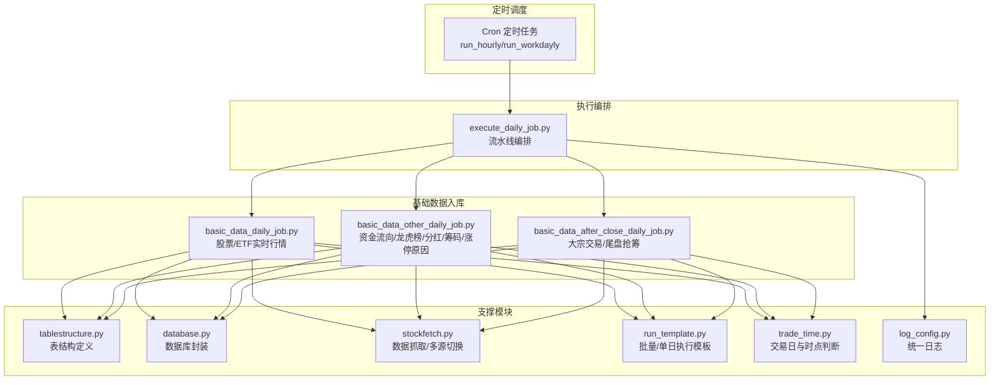
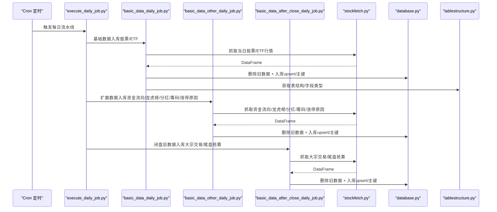
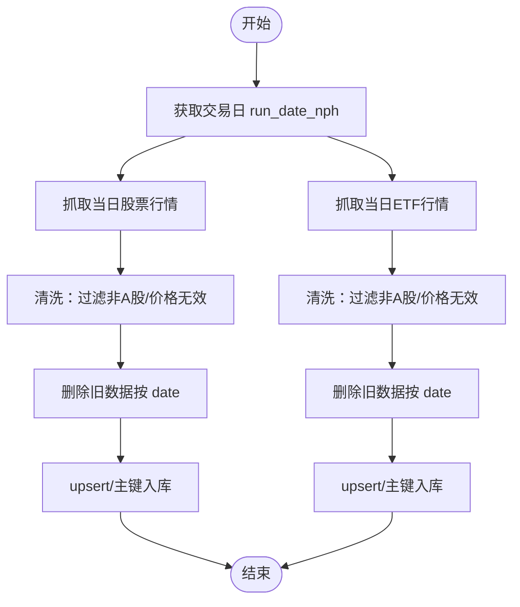
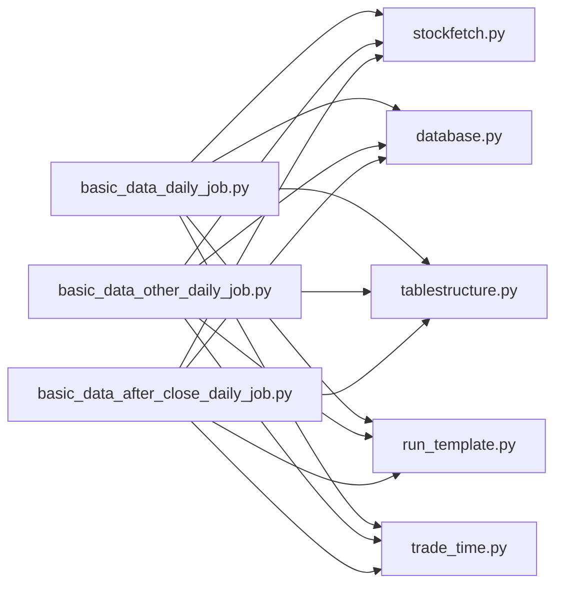

# 基础数据处理

<cite>
**本文引用的文件**
- [basic_data_daily_job.py](file://quantia/job/basic_data_daily_job.py)
- [basic_data_after_close_daily_job.py](file://quantia/job/basic_data_after_close_daily_job.py)
- [basic_data_other_daily_job.py](file://quantia/job/basic_data_other_daily_job.py)
- [tablestructure.py](file://quantia/core/tablestructure.py)
- [database.py](file://quantia/lib/database.py)
- [stockfetch.py](file://quantia/core/stockfetch.py)
- [run_template.py](file://quantia/lib/run_template.py)
- [trade_time.py](file://quantia/lib/trade_time.py)
- [execute_daily_job.py](file://quantia/job/execute_daily_job.py)
- [README.md](file://cron/README.md)
- [log_config.py](file://quantia/lib/log_config.py)
- [stock_fhps_em.py](file://quantia/core/crawling/stock_fhps_em.py)
- [stock_fund_em.py](file://quantia/core/crawling/stock_fund_em.py)
</cite>

## 目录
1. [简介](#简介)
2. [项目结构](#项目结构)
3. [核心组件](#核心组件)
4. [架构总览](#架构总览)
5. [详细组件分析](#详细组件分析)
6. [依赖关系分析](#依赖关系分析)
7. [性能考量](#性能考量)
8. [故障排查指南](#故障排查指南)
9. [结论](#结论)
10. [附录](#附录)

## 简介
本文件面向 Quantia 基础数据处理作业，系统性阐述其职责边界、执行时机、数据质量控制、重复数据处理策略、与其他数据处理作业的时序关系，以及配置项、性能监控指标与数据验证规则。基础数据处理主要负责：
- 股票与ETF实时行情入库
- 除权除息（分红送配）数据入库
- 资金流向（含个股与板块）数据入库
- 龙虎榜、大宗交易、筹码抢筹等扩展数据入库
- 基于实时行情的“基本面选股”结果落库

## 项目结构
基础数据处理位于 quantia/job 目录，配合 quantia/core/tablestructure.py（表结构定义）、quantia/lib/database.py（数据库封装）、quantia/core/stockfetch.py（数据抓取与多源切换）等模块协同工作。执行时序由 quantia/job/execute_daily_job.py 统一编排，分为“数据获取—基础数据入库—扩展数据—分析—回测—闭盘后数据”五阶段。

图表来源
- [README.md](file://cron/README.md#L1-L43)
- [execute_daily_job.py](file://quantia/job/execute_daily_job.py#L80-L178)
- [basic_data_daily_job.py](file://quantia/job/basic_data_daily_job.py#L79-L111)
- [basic_data_other_daily_job.py](file://quantia/job/basic_data_other_daily_job.py#L330-L342)
- [basic_data_after_close_daily_job.py](file://quantia/job/basic_data_after_close_daily_job.py#L60-L68)
- [tablestructure.py](file://quantia/core/tablestructure.py#L46-L104)
- [database.py](file://quantia/lib/database.py#L120-L203)
- [stockfetch.py](file://quantia/core/stockfetch.py#L258-L345)
- [run_template.py](file://quantia/lib/run_template.py#L18-L95)
- [trade_time.py](file://quantia/lib/trade_time.py#L171-L183)
- [log_config.py](file://quantia/lib/log_config.py#L47-L104)

章节来源
- [README.md](file://cron/README.md#L1-L43)
- [execute_daily_job.py](file://quantia/job/execute_daily_job.py#L80-L178)

## 核心组件
- 基础数据入库（股票/ETF实时行情）
  - 职责：抓取当日股票与ETF实时行情，按日期删除旧数据后入库，若表不存在则按表结构建表并添加主键索引。
  - 关键实现：basic_data_daily_job.py 的 save_nph_stock_spot_data/save_nph_etf_spot_data。
- 除权除息（分红送配）数据
  - 职责：抓取指定报告期的分红送配数据，按日期删除旧数据后入库。
  - 关键实现：basic_data_other_daily_job.py 的 save_nph_stock_bonus；底层数据源来自 stock_fhps_em.py。
- 资金流向数据
  - 职责：抓取个股与板块资金流向，合并多时间段数据，按日期删除旧数据后入库。
  - 关键实现：basic_data_other_daily_job.py 的 save_nph_stock_fund_flow_data/save_nph_stock_sector_fund_flow_data；底层数据源来自 stock_fund_em.py。
- 龙虎榜与相关扩展数据
  - 职责：抓取龙虎榜、大宗交易、早盘/尾盘筹码抢筹、涨停原因等，按日期删除旧数据后入库。
  - 关键实现：basic_data_other_daily_job.py 的 save_nph_stock_lhb_data/save_nph_stock_top_data/stock_chip_race_open_data/stock_imitup_reason_data；basic_data_after_close_daily_job.py 的 save_after_close_stock_blocktrade_data/save_after_close_stock_chip_race_end_data。
- 基于实时行情的“基本面选股”
  - 职责：基于当日实时行情表进行筛选条件（如PE/PB/ROE等）生成候选池，按日期删除旧数据后入库。
  - 关键实现：basic_data_other_daily_job.py 的 stock_spot_buy。

章节来源
- [basic_data_daily_job.py](file://quantia/job/basic_data_daily_job.py#L24-L48)
- [basic_data_daily_job.py](file://quantia/job/basic_data_daily_job.py#L52-L76)
- [basic_data_other_daily_job.py](file://quantia/job/basic_data_other_daily_job.py#L22-L42)
- [basic_data_other_daily_job.py](file://quantia/job/basic_data_other_daily_job.py#L239-L258)
- [basic_data_other_daily_job.py](file://quantia/job/basic_data_other_daily_job.py#L68-L128)
- [basic_data_other_daily_job.py](file://quantia/job/basic_data_other_daily_job.py#L167-L214)
- [basic_data_other_daily_job.py](file://quantia/job/basic_data_other_daily_job.py#L262-L286)
- [basic_data_after_close_daily_job.py](file://quantia/job/basic_data_after_close_daily_job.py#L21-L38)
- [basic_data_after_close_daily_job.py](file://quantia/job/basic_data_after_close_daily_job.py#L41-L58)

## 架构总览
基础数据处理在“每日流水线”中承担“基础数据入库”和“扩展数据入库”的职责，与“数据获取”“分析”“回测”“闭盘后数据”阶段协作，确保数据完整性与一致性。

图表来源
- [execute_daily_job.py](file://quantia/job/execute_daily_job.py#L80-L178)
- [basic_data_daily_job.py](file://quantia/job/basic_data_daily_job.py#L79-L111)
- [basic_data_other_daily_job.py](file://quantia/job/basic_data_other_daily_job.py#L330-L342)
- [basic_data_after_close_daily_job.py](file://quantia/job/basic_data_after_close_daily_job.py#L60-L68)
- [stockfetch.py](file://quantia/core/stockfetch.py#L258-L345)
- [database.py](file://quantia/lib/database.py#L120-L203)
- [tablestructure.py](file://quantia/core/tablestructure.py#L46-L104)

## 详细组件分析

### 股票/ETF实时行情入库（基础数据）
- 职责与流程
  - 抓取当日股票与ETF实时行情，按日期删除旧数据后入库；若表不存在则按表结构建表并添加主键索引。
  - 若删除旧数据失败，自动降级为 upsert 模式继续写入。
- 关键点
  - 日期确定：通过 trade_time.get_trade_date_last() 统一确定 run_date 与 run_date_nph，避免在 09:30/15:00 边界产生不同日期。
  - 多源抓取：stockfetch.fetch_stocks()/fetch_etfs() 支持多数据源自动切换与健康度追踪。
  - 去噪：过滤非A股与价格无效的记录。
  - 去重：按 date+code 唯一键入库，避免重复。
- 错误处理
  - 捕获异常并记录日志；删除旧数据失败时自动切换 upsert 模式。

图表来源
- [basic_data_daily_job.py](file://quantia/job/basic_data_daily_job.py#L24-L48)
- [basic_data_daily_job.py](file://quantia/job/basic_data_daily_job.py#L52-L76)
- [stockfetch.py](file://quantia/core/stockfetch.py#L304-L345)
- [stockfetch.py](file://quantia/core/stockfetch.py#L258-L299)
- [database.py](file://quantia/lib/database.py#L120-L203)
- [trade_time.py](file://quantia/lib/trade_time.py#L171-L183)

章节来源
- [basic_data_daily_job.py](file://quantia/job/basic_data_daily_job.py#L24-L48)
- [basic_data_daily_job.py](file://quantia/job/basic_data_daily_job.py#L52-L76)
- [stockfetch.py](file://quantia/core/stockfetch.py#L304-L345)
- [stockfetch.py](file://quantia/core/stockfetch.py#L258-L299)
- [database.py](file://quantia/lib/database.py#L120-L203)
- [trade_time.py](file://quantia/lib/trade_time.py#L171-L183)

### 除权除息（分红送配）数据入库
- 职责与流程
  - 抓取指定报告期的分红送配数据，按日期删除旧数据后入库。
  - 报告期日期通过 trade_time.get_bonus_report_date() 推断。
- 关键点
  - 数据源：stock_fhps_em.py 提供接口。
  - 去噪：过滤非A股。
  - 唯一键：date+code。
- 错误处理
  - 捕获异常并记录日志；空数据直接返回。

章节来源
- [basic_data_other_daily_job.py](file://quantia/job/basic_data_other_daily_job.py#L239-L258)
- [stockfetch.py](file://quantia/core/stockfetch.py#L491-L505)
- [stock_fhps_em.py](file://quantia/core/crawling/stock_fhps_em.py#L21-L146)
- [trade_time.py](file://quantia/lib/trade_time.py#L202-L223)

### 资金流向数据入库（个股与板块）
- 职责与流程
  - 抓取个股资金流向（今日/3日/5日/10日），合并多时间段数据，按日期删除旧数据后入库。
  - 抓取板块资金流向（行业/概念），按日期删除旧数据后入库。
- 关键点
  - 多时间段合并：以任一成功时间段为基础，合并其他时间段数据，避免 change_rate 冲突。
  - 多源抓取：stock_fund_em.py 提供接口。
  - 去噪：过滤非A股与价格无效。
  - 唯一键：个股按 date+code，板块按 date+name。
- 错误处理
  - 捕获异常并记录日志；任一时间段失败不中断整体流程。

章节来源
- [basic_data_other_daily_job.py](file://quantia/job/basic_data_other_daily_job.py#L68-L128)
- [basic_data_other_daily_job.py](file://quantia/job/basic_data_other_daily_job.py#L167-L214)
- [stockfetch.py](file://quantia/core/stockfetch.py#L429-L462)
- [stockfetch.py](file://quantia/core/stockfetch.py#L466-L487)
- [stock_fund_em.py](file://quantia/core/crawling/stock_fund_em.py#L46-L200)

### 龙虎榜与相关扩展数据入库
- 职责与流程
  - 龙虎榜（个股/新浪）：抓取并入库。
  - 大宗交易：抓取并入库。
  - 早盘/尾盘筹码抢筹：抓取并入库。
  - 涨停原因：抓取并入库。
- 关键点
  - 多源抓取与列映射，确保表结构一致。
  - 唯一键：date+code 或 date+name。
- 错误处理
  - 捕获异常并记录日志；空数据直接返回。

章节来源
- [basic_data_other_daily_job.py](file://quantia/job/basic_data_other_daily_job.py#L22-L42)
- [basic_data_other_daily_job.py](file://quantia/job/basic_data_other_daily_job.py#L45-L64)
- [basic_data_other_daily_job.py](file://quantia/job/basic_data_other_daily_job.py#L289-L307)
- [basic_data_other_daily_job.py](file://quantia/job/basic_data_other_daily_job.py#L310-L328)
- [basic_data_after_close_daily_job.py](file://quantia/job/basic_data_after_close_daily_job.py#L21-L38)
- [basic_data_after_close_daily_job.py](file://quantia/job/basic_data_after_close_daily_job.py#L41-L58)

### 基于实时行情的“基本面选股”结果入库
- 职责与流程
  - 从当日实时行情表中按条件筛选（如 PE/PB/ROE 等），去重后入库。
- 关键点
  - 唯一键：date+code。
  - 条件来源于实时行情表字段。
- 错误处理
  - 捕获异常并记录日志；空数据直接返回。

章节来源
- [basic_data_other_daily_job.py](file://quantia/job/basic_data_other_daily_job.py#L262-L286)

## 依赖关系分析
- 组件耦合
  - basic_data_daily_job.py 依赖 stockfetch.py（抓取）、database.py（入库）、tablestructure.py（表结构）、run_template.py（批量/单日执行）、trade_time.py（交易日与时点）。
  - basic_data_other_daily_job.py 与 basic_data_after_close_daily_job.py 同样依赖上述模块。
- 外部依赖
  - 多数据源抓取：stockfetch.py 内置健康度追踪与降级策略，避免单一数据源故障影响整体。
  - 数据库连接池：database.py 使用 SQLAlchemy 单例连接池，支持 upsert 与主键约束检测。
- 循环依赖
  - 未发现循环导入；模块间为单向依赖。

图表来源
- [basic_data_daily_job.py](file://quantia/job/basic_data_daily_job.py#L1-L18)
- [basic_data_other_daily_job.py](file://quantia/job/basic_data_other_daily_job.py#L1-L19)
- [basic_data_after_close_daily_job.py](file://quantia/job/basic_data_after_close_daily_job.py#L1-L18)
- [stockfetch.py](file://quantia/core/stockfetch.py#L1-L35)
- [database.py](file://quantia/lib/database.py#L1-L23)
- [tablestructure.py](file://quantia/core/tablestructure.py#L1-L25)
- [run_template.py](file://quantia/lib/run_template.py#L1-L15)
- [trade_time.py](file://quantia/lib/trade_time.py#L1-L10)

章节来源
- [basic_data_daily_job.py](file://quantia/job/basic_data_daily_job.py#L1-L18)
- [basic_data_other_daily_job.py](file://quantia/job/basic_data_other_daily_job.py#L1-L19)
- [basic_data_after_close_daily_job.py](file://quantia/job/basic_data_after_close_daily_job.py#L1-L18)
- [stockfetch.py](file://quantia/core/stockfetch.py#L1-L35)
- [database.py](file://quantia/lib/database.py#L1-L23)
- [tablestructure.py](file://quantia/core/tablestructure.py#L1-L25)
- [run_template.py](file://quantia/lib/run_template.py#L1-L15)
- [trade_time.py](file://quantia/lib/trade_time.py#L1-L10)

## 性能考量
- 数据源健康度与降级
  - stockfetch.py 内置数据源健康度追踪，连续失败达到阈值后降级，冷却时间指数退避，避免雪崩效应。
- upsert 与索引管理
  - database.py 自动检测主键约束，存在主键时使用 upsert 避免重复插入错误；首次建表时自动添加主键与索引。
- 连接池与瞬态错误重试
  - database.py 使用 SQLAlchemy 单例连接池，支持瞬态错误（死锁/锁超时/连接异常）自动重试与连接销毁重建。
- 批量执行与并发
  - run_template.py 支持批量日期执行，最多3个并发线程，避免瞬时压力过大。
- 日志与可观测性
  - log_config.py 提供统一日志格式与轮转，便于性能与异常排查。

章节来源
- [stockfetch.py](file://quantia/core/stockfetch.py#L48-L123)
- [database.py](file://quantia/lib/database.py#L56-L71)
- [database.py](file://quantia/lib/database.py#L94-L117)
- [database.py](file://quantia/lib/database.py#L120-L203)
- [run_template.py](file://quantia/lib/run_template.py#L44-L58)
- [log_config.py](file://quantia/lib/log_config.py#L47-L104)

## 故障排查指南
- 常见问题与定位
  - 数据为空：检查数据源抓取是否成功，确认 report_source_success/report_source_failure 日志；查看 run_template 的批量执行日志。
  - 重复数据/主键冲突：确认表是否已存在主键；若无主键，database.py 会在首次建表时添加；若存在主键，使用 upsert 模式。
  - 删除旧数据失败：basic_data_daily_job 会捕获异常并切换 upsert 模式；检查数据库权限与连接。
  - 分析数据已存在导致跳过：execute_daily_job 会检查指标表当日数据量，超过阈值会跳过分析与回测阶段。
- 健康检查
  - execute_daily_job 在流水线结束后执行数据健康检查，输出各核心表当日数据量与最新日期，便于快速定位问题。
- 日志定位
  - 使用统一日志配置，ERROR 级别日志会写入 stock_error.log，便于集中排查。

章节来源
- [basic_data_daily_job.py](file://quantia/job/basic_data_daily_job.py#L36-L41)
- [database.py](file://quantia/lib/database.py#L120-L203)
- [execute_daily_job.py](file://quantia/job/execute_daily_job.py#L182-L226)
- [log_config.py](file://quantia/lib/log_config.py#L47-L104)

## 结论
基础数据处理在 Quantia 数据流水线中承担“基础数据入库”和“扩展数据入库”的关键职责，通过多数据源自动切换、upsert 与主键约束管理、连接池与瞬态错误重试、统一日志与健康检查等机制，确保数据完整性与一致性。与 execute_daily_job 的五阶段编排配合，形成“数据获取—基础入库—扩展入库—分析—回测—闭盘后数据”的完整闭环。

## 附录

### 执行时机与时序关系
- run_hourly：每小时执行基础数据采集（股票/ETF实时行情）。
- run_workdayly：每日完整流水线，包含数据获取、基础数据入库、扩展数据入库、分析、回测、闭盘后数据。
- execute_daily_job：统一编排五阶段流水线，支持分析数据存在性跳过与强制执行开关。

章节来源
- [README.md](file://cron/README.md#L1-L43)
- [execute_daily_job.py](file://quantia/job/execute_daily_job.py#L80-L178)

### 配置选项
- 数据源重试与间隔
  - DATA_SOURCE_MAX_RETRIES：单个数据源最大重试次数（默认2）。
  - DATA_SOURCE_RETRY_INTERVAL：基础重试间隔（秒，默认90），采用指数退避。
- 历史数据年数
  - HIST_DATA_DEFAULT_YEARS：默认获取历史数据年数（默认10）。
- 分析阶段跳过阈值
  - QUANTIA_ANALYSIS_DONE_THRESHOLD：当日指标表数据量阈值，超过则跳过分析与回测（默认1000）。
- 强制执行分析
  - QUANTIA_FORCE_ANALYSIS=1：强制执行分析与回测阶段。

章节来源
- [stockfetch.py](file://quantia/core/stockfetch.py#L38-L44)
- [execute_daily_job.py](file://quantia/job/execute_daily_job.py#L44-L57)

### 性能监控指标
- 数据源健康度：连续失败次数、降级冷却时间、恢复日志。
- 数据库连接池：连接数、超时、重试次数。
- 日志轮转：ERROR 级别日志量、INFO 级别日志量。
- 健康检查：各核心表当日数据量、最新日期、总数据量。

章节来源
- [stockfetch.py](file://quantia/core/stockfetch.py#L48-L123)
- [database.py](file://quantia/lib/database.py#L56-L71)
- [log_config.py](file://quantia/lib/log_config.py#L47-L104)
- [execute_daily_job.py](file://quantia/job/execute_daily_job.py#L182-L226)

### 数据验证规则
- 去噪规则
  - 非A股过滤：is_a_stock。
  - 价格无效过滤：is_open/is_open_with_line。
- 唯一键规则
  - 股票/ETF：date+code。
  - 板块资金流向：date+name。
  - 基本面选股：date+code。
- 表结构与字段
  - 依据 tablestructure.py 定义的表结构与字段类型进行入库校验。

章节来源
- [stockfetch.py](file://quantia/core/stockfetch.py#L204-L221)
- [tablestructure.py](file://quantia/core/tablestructure.py#L46-L104)
- [tablestructure.py](file://quantia/core/tablestructure.py#L219-L227)
- [basic_data_other_daily_job.py](file://quantia/job/basic_data_other_daily_job.py#L268-L271)
