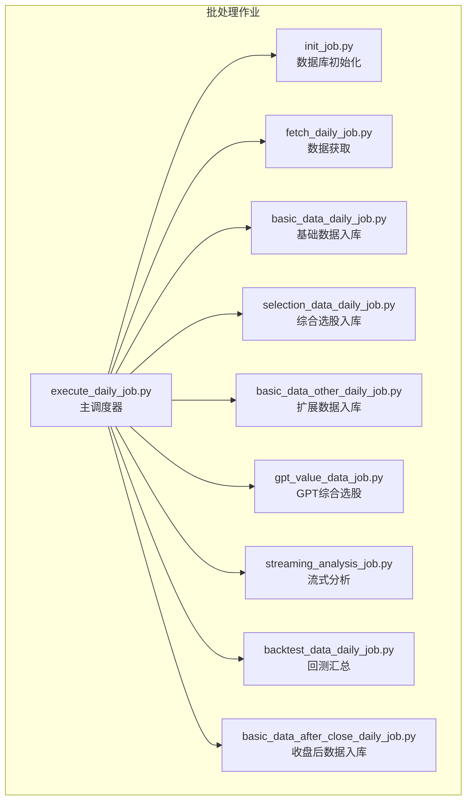
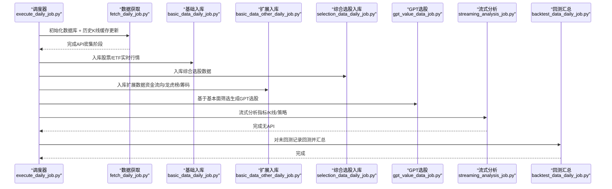
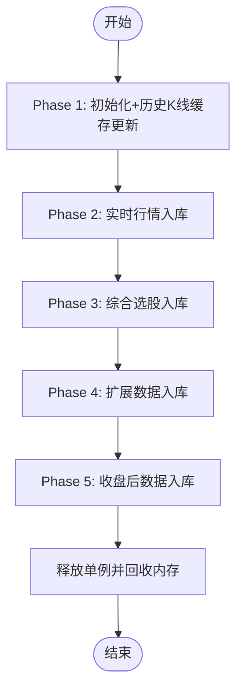
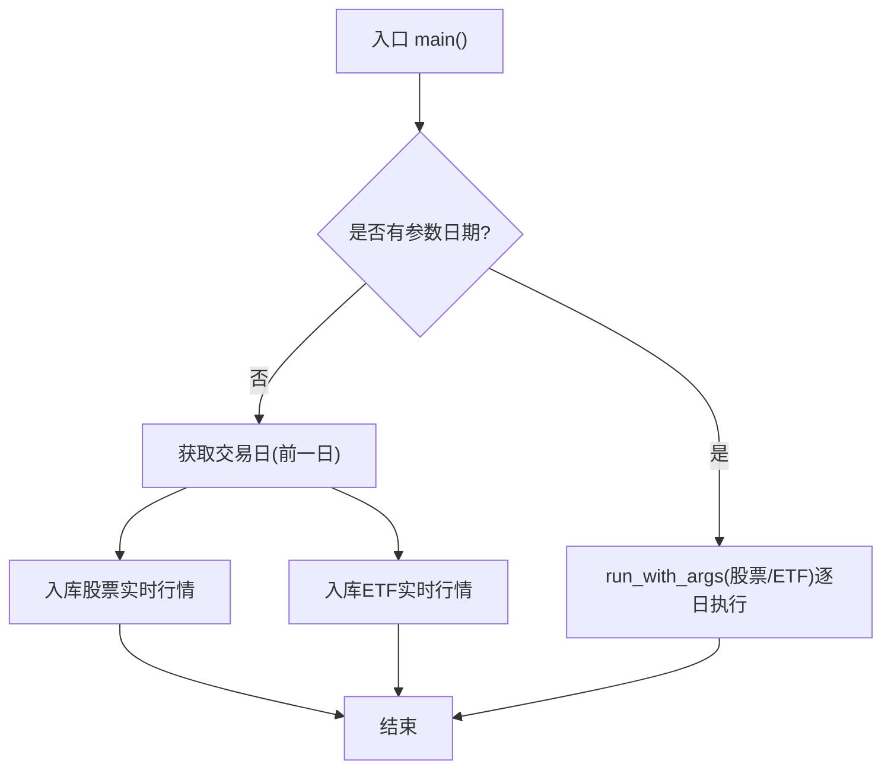
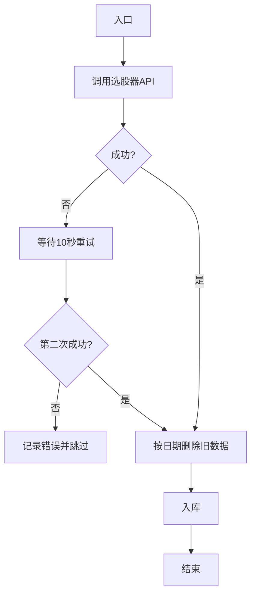
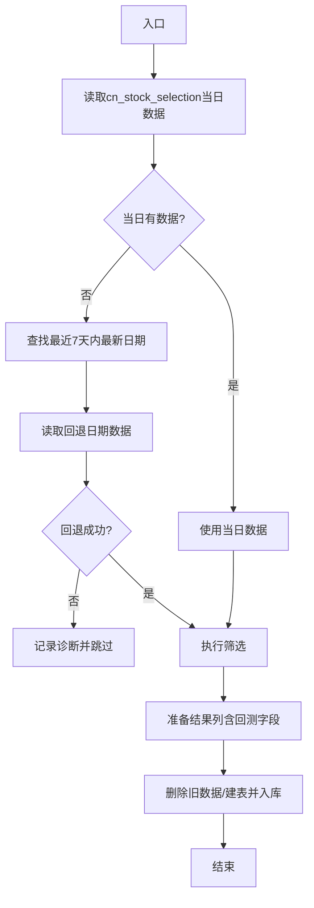
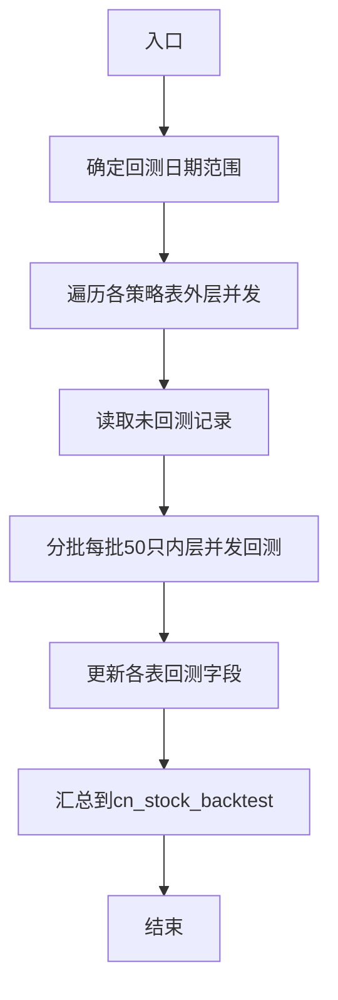
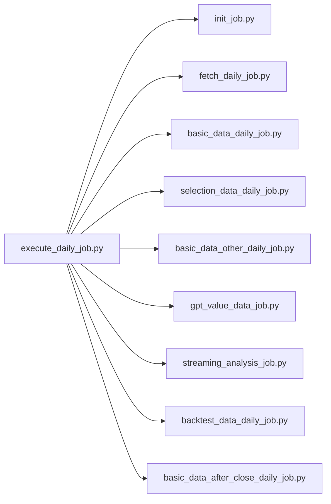

# 批处理作业

<cite>
**本文引用的文件**
- [README.md](file://README.md)
- [QUICKSTART.md](file://QUICKSTART.md)
- [init_job.py](file://docker/stock/quantia/job/init_job.py)
- [fetch_daily_job.py](file://docker/stock/quantia/job/fetch_daily_job.py)
- [basic_data_daily_job.py](file://docker/stock/quantia/job/basic_data_daily_job_job.py)
- [indicators_data_daily_job.py](file://docker/stock/quantia/job/indicators_data_daily_job.py)
- [backtest_data_daily_job.py](file://docker/stock/quantia/job/backtest_data_daily_job.py)
- [execute_daily_job.py](file://docker/stock/quantia/job/execute_daily_job.py)
- [selection_data_daily_job.py](file://docker/stock/quantia/job/selection_data_daily_job.py)
- [gpt_value_data_job.py](file://docker/stock/quantia/job/gpt_value_data_job.py)
</cite>

## 目录
1. [简介](#简介)
2. [项目结构](#项目结构)
3. [核心组件](#核心组件)
4. [架构总览](#架构总览)
5. [详细组件分析](#详细组件分析)
6. [依赖关系分析](#依赖关系分析)
7. [性能考量](#性能考量)
8. [故障排查指南](#故障排查指南)
9. [结论](#结论)
10. [附录](#附录)

## 简介
本文件面向Quantia批处理作业系统，系统性梳理数据抓取批处理、基础数据入库、扩展数据处理、流式分析与回测数据生成等核心作业的设计模式与实现原理。重点说明：
- 执行策略与阶段划分（Phase 1–5）
- 数据流转机制（缓存优先、磁盘按需读取）
- 错误恢复与重试策略
- 配置参数、性能优化与资源使用监控
- 生命周期管理、状态跟踪与日志记录
- 扩展开发指南与最佳实践

## 项目结构
批处理作业位于quantia/job目录，围绕“数据获取→基础入库→扩展入库→流式分析→回测汇总”的流水线组织，辅以独立作业与调度脚本，支持批量日期与单日执行。

图表来源
- [execute_daily_job.py](file://docker/stock/quantia/job/execute_daily_job.py#L80-L179)
- [fetch_daily_job.py](file://docker/stock/quantia/job/fetch_daily_job.py#L60-L101)
- [basic_data_daily_job.py](file://docker/stock/quantia/job/basic_data_daily_job.py#L79-L93)
- [selection_data_daily_job.py](file://docker/stock/quantia/job/selection_data_daily_job.py#L22-L58)
- [backtest_data_daily_job.py](file://docker/stock/quantia/job/backtest_data_daily_job.py#L34-L86)
- [gpt_value_data_job.py](file://docker/stock/quantia/job/gpt_value_data_job.py#L27-L110)
- [init_job.py](file://docker/stock/quantia/job/init_job.py#L20-L61)

章节来源
- [README.md](file://README.md#L502-L531)
- [QUICKSTART.md](file://QUICKSTART.md#L40-L114)

## 核心组件
- 数据获取作业（fetch_daily_job.py）：集中执行所有外部API调用，包含初始化、历史K线缓存增量更新、实时行情入库、综合选股数据入库、扩展数据入库、收盘后数据入库。
- 基础数据入库（basic_data_daily_job.py）：读取stock_data单例，入库股票与ETF实时行情。
- 扩展数据入库（basic_data_other_daily_job.py）：资金流向、龙虎榜、筹码等扩展数据入库。
- 综合选股入库（selection_data_daily_job.py）：从选股器API获取数据并入库。
- GPT综合选股（gpt_value_data_job.py）：基于基本面筛选策略，从综合选股表读取数据并生成GPT评分。
- 流式分析（streaming_analysis_job.py）：指标计算、K线形态识别、策略选股，从磁盘缓存按需读取历史数据，避免全量内存加载。
- 回测汇总（backtest_data_daily_job.py）：对需要回测的记录进行逐只股票回测，汇总到回测汇总表。
- 数据库初始化（init_job.py）：创建数据库与基础表。

章节来源
- [fetch_daily_job.py](file://docker/stock/quantia/job/fetch_daily_job.py#L1-L105)
- [basic_data_daily_job.py](file://docker/stock/quantia/job/basic_data_daily_job.py#L1-L111)
- [selection_data_daily_job.py](file://docker/stock/quantia/job/selection_data_daily_job.py#L1-L68)
- [gpt_value_data_job.py](file://docker/stock/quantia/job/gpt_value_data_job.py#L1-L191)
- [backtest_data_daily_job.py](file://docker/stock/quantia/job/backtest_data_daily_job.py#L1-L275)
- [init_job.py](file://docker/stock/quantia/job/init_job.py#L1-L66)

## 架构总览
批处理系统采用“阶段化流水线 + 低内存流式处理”架构：
- Phase 1（API密集）：fetch_daily_job集中调用外部API，更新本地缓存与基础表。
- Phase 2/3（入库）：基础与扩展数据入库，依赖少量API或单例。
- Phase 4（流式分析）：不依赖API，从磁盘缓存读取历史数据，计算指标、形态与策略。
- Phase 5（回测汇总）：对未回测记录进行回测，并汇总成功率与平均收益。

图表来源
- [execute_daily_job.py](file://docker/stock/quantia/job/execute_daily_job.py#L80-L179)
- [fetch_daily_job.py](file://docker/stock/quantia/job/fetch_daily_job.py#L60-L101)
- [basic_data_daily_job.py](file://docker/stock/quantia/job/basic_data_daily_job.py#L79-L93)
- [selection_data_daily_job.py](file://docker/stock/quantia/job/selection_data_daily_job.py#L22-L58)
- [gpt_value_data_job.py](file://docker/stock/quantia/job/gpt_value_data_job.py#L27-L110)
- [backtest_data_daily_job.py](file://docker/stock/quantia/job/backtest_data_daily_job.py#L34-L86)

## 详细组件分析

### 数据获取作业（fetch_daily_job.py）
- 设计目标：将所有外部API调用集中在单一作业，便于独立运行与容错。
- 阶段划分：
  - Phase 1：数据库初始化 + 历史K线缓存增量更新
  - Phase 2：实时行情入库（股票/ETF）
  - Phase 3：综合选股数据入库
  - Phase 4：扩展数据入库（资金流向/龙虎榜/筹码等）
  - Phase 5：收盘后数据入库（大宗交易等）
- 错误处理：各阶段独立try-except，失败不影响后续阶段；最后释放单例并回收内存。

图表来源
- [fetch_daily_job.py](file://docker/stock/quantia/job/fetch_daily_job.py#L60-L101)

章节来源
- [fetch_daily_job.py](file://docker/stock/quantia/job/fetch_daily_job.py#L1-L105)

### 基础数据入库（basic_data_daily_job.py）
- 输入：stock_data单例（共享资源，避免重复API调用）
- 处理：分别入库股票与ETF实时行情，按日期删除旧数据后写入
- 并发：独立运行时初始化日志；批量模式通过run_template按日期迭代

图表来源
- [basic_data_daily_job.py](file://docker/stock/quantia/job/basic_data_daily_job.py#L79-L93)

章节来源
- [basic_data_daily_job.py](file://docker/stock/quantia/job/basic_data_daily_job.py#L1-L111)

### 扩展数据入库（basic_data_other_daily_job.py）
- 职责：资金流向、龙虎榜、筹码等扩展数据入库
- 特点：I/O密集、内存占用低，独立API调用

章节来源
- [README.md](file://README.md#L502-L510)

### 综合选股入库（selection_data_daily_job.py）
- 输入：选股器API
- 处理：获取数据后按日期删除旧数据并入库
- 容错：首次失败重试一次，仍失败则跳过

图表来源
- [selection_data_daily_job.py](file://docker/stock/quantia/job/selection_data_daily_job.py#L22-L58)

章节来源
- [selection_data_daily_job.py](file://docker/stock/quantia/job/selection_data_daily_job.py#L1-L68)

### GPT综合选股（gpt_value_data_job.py）
- 输入：cn_stock_selection表（近7天内最新有数据日期）
- 处理：执行基本面筛选，生成评分与指标，写入cn_stock_strategy_gpt_value
- 容错：表结构缺失列时自动重建；日期回退策略

图表来源
- [gpt_value_data_job.py](file://docker/stock/quantia/job/gpt_value_data_job.py#L27-L110)
- [gpt_value_data_job.py](file://docker/stock/quantia/job/gpt_value_data_job.py#L113-L160)

章节来源
- [gpt_value_data_job.py](file://docker/stock/quantia/job/gpt_value_data_job.py#L1-L191)

### 回测汇总（backtest_data_daily_job.py）
- 设计：流式版本，逐只股票从磁盘缓存读取历史数据，避免全量内存加载
- 并发：外层并发控制表级处理，内层并发控制每批股票回测
- 汇总：将各策略表回测结果汇总到cn_stock_backtest，计算成功率与平均收益

图表来源
- [backtest_data_daily_job.py](file://docker/stock/quantia/job/backtest_data_daily_job.py#L34-L86)
- [backtest_data_daily_job.py](file://docker/stock/quantia/job/backtest_data_daily_job.py#L94-L135)
- [backtest_data_daily_job.py](file://docker/stock/quantia/job/backtest_data_daily_job.py#L167-L270)

章节来源
- [backtest_data_daily_job.py](file://docker/stock/quantia/job/backtest_data_daily_job.py#L1-L275)

### 数据库初始化（init_job.py）
- 职责：检查数据库是否存在，不存在则创建数据库与基础表
- 基础表：cn_stock_attention

章节来源
- [init_job.py](file://docker/stock/quantia/job/init_job.py#L1-L66)

## 依赖关系分析
- 调度器（execute_daily_job.py）依赖所有子作业模块，按阶段顺序执行，并在必要时跳过已完成阶段
- 数据获取（fetch_daily_job.py）依赖初始化、数据抓取与入库作业
- 流式分析与回测依赖磁盘缓存与数据库表结构
- 日志配置通过log_config统一管理，兼容降级

图表来源
- [execute_daily_job.py](file://docker/stock/quantia/job/execute_daily_job.py#L29-L38)

章节来源
- [execute_daily_job.py](file://docker/stock/quantia/job/execute_daily_job.py#L1-L231)

## 性能考量
- 并发模型
  - 指标计算：ThreadPoolExecutor（默认工作线程数可配置）
  - 回测：外层并发控制表级处理，内层并发控制每批股票回测，批大小50
- 内存优化
  - 流式回测：从磁盘缓存按需读取，峰值内存显著降低
  - 单例释放：在关键节点释放stock_data单例，避免缓存污染
- I/O与缓存
  - 历史K线缓存优先，减少API调用
  - 增量更新策略，首次全量、后续补缺
- 环境变量
  - QUANTIA_ANALYSIS_DONE_THRESHOLD：分析数据跳过阈值
  - QUANTIA_FORCE_ANALYSIS：强制执行分析阶段
  - QUANTIA_BACKTEST_OUTER_WORKERS/QUANTIA_BACKTEST_INNER_WORKERS：回测并发控制

章节来源
- [indicators_data_daily_job.py](file://docker/stock/quantia/job/indicators_data_daily_job.py#L65-L87)
- [backtest_data_daily_job.py](file://docker/stock/quantia/job/backtest_data_daily_job.py#L53-L56)
- [backtest_data_daily_job.py](file://docker/stock/quantia/job/backtest_data_daily_job.py#L90-L91)
- [backtest_data_daily_job.py](file://docker/stock/quantia/job/backtest_data_daily_job.py#L114-L129)
- [execute_daily_job.py](file://docker/stock/quantia/job/execute_daily_job.py#L44-L77)

## 故障排查指南
- 数据库连接失败
  - 检查数据库配置与服务状态
- API获取失败
  - 检查代理与Cookie配置
  - 查看日志定位阶段与异常堆栈
- 表结构缺失
  - GPT综合选股作业会自动重建表
  - 回测汇总会自动迁移新增列
- 数据健康检查
  - 执行完成后自动检查核心表当日数据量与最新日期
- 日志位置
  - 执行日志：stock_execute_job.log
  - 数据获取日志：stock_fetch_job.log
  - 基础日志：独立运行时basic日志配置

章节来源
- [README.md](file://README.md#L169-L195)
- [execute_daily_job.py](file://docker/stock/quantia/job/execute_daily_job.py#L182-L226)
- [gpt_value_data_job.py](file://docker/stock/quantia/job/gpt_value_data_job.py#L163-L181)
- [backtest_data_daily_job.py](file://docker/stock/quantia/job/backtest_data_daily_job.py#L143-L165)

## 结论
Quantia批处理作业系统通过清晰的阶段划分与流式处理策略，实现了高可靠、低内存占用的数据流水线。数据获取集中化、分析与回测无API依赖、完善的错误恢复与健康检查机制，使得系统在生产环境中具备良好的可维护性与扩展性。

## 附录
- 批量执行方式与作业清单参见README与Quickstart文档
- Docker部署与定时任务参见README与cron说明

章节来源
- [README.md](file://README.md#L214-L231)
- [QUICKSTART.md](file://QUICKSTART.md#L40-L114)
