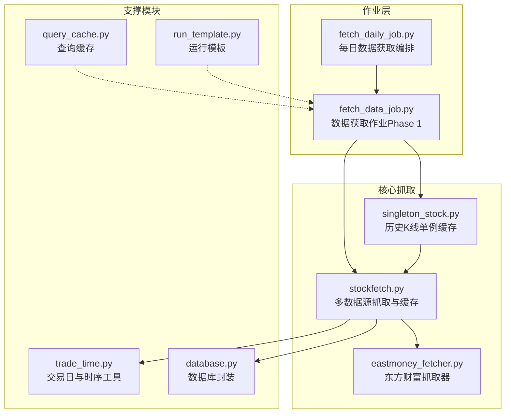
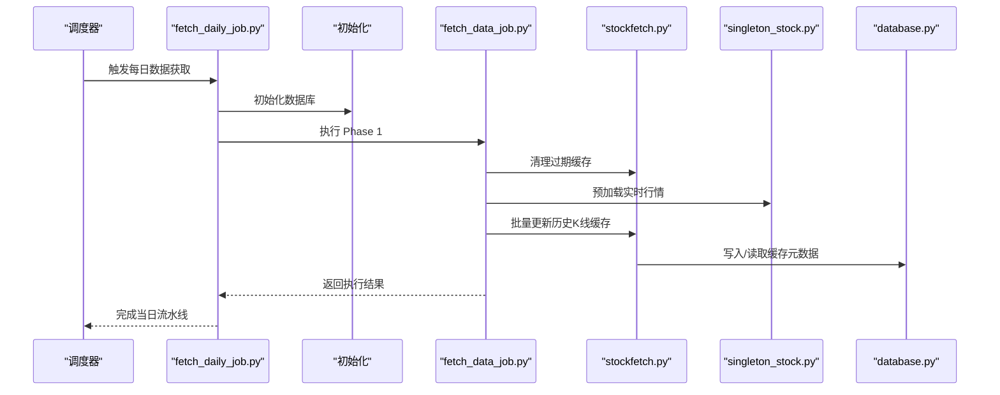
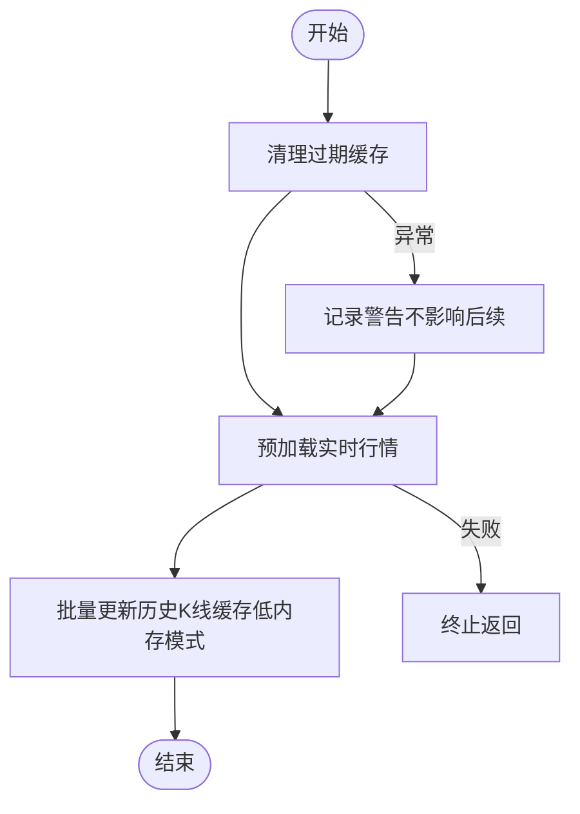
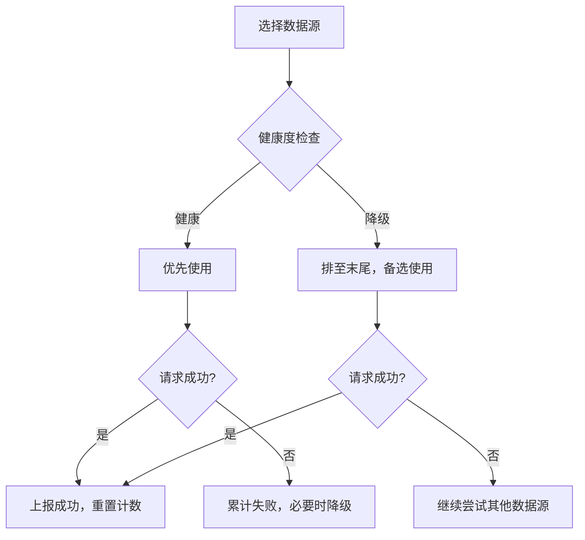
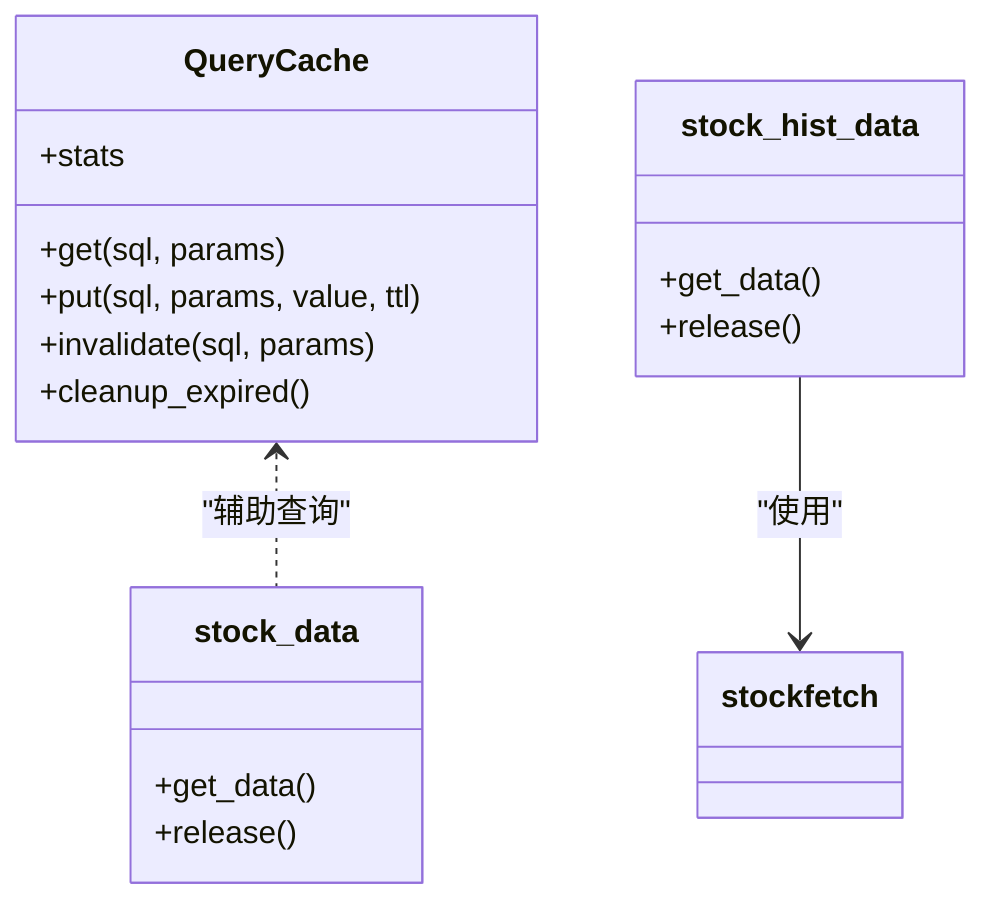
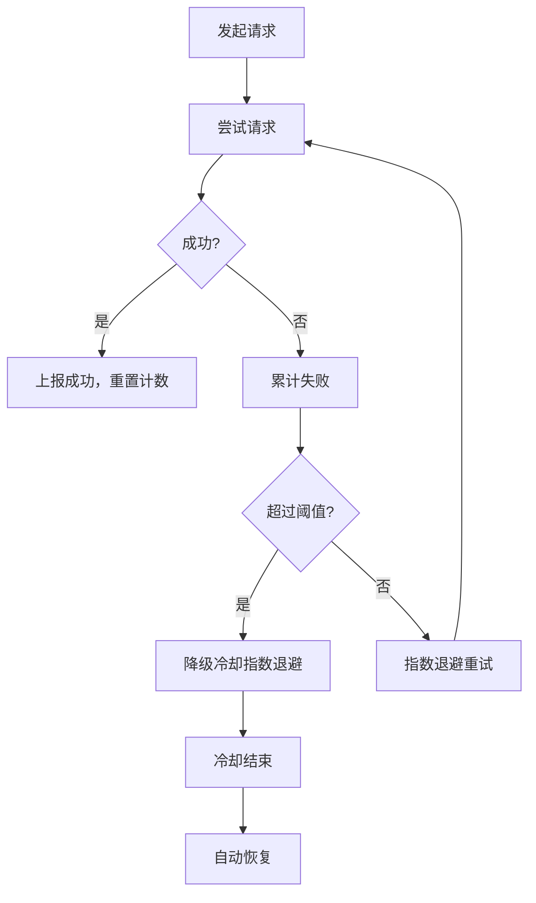
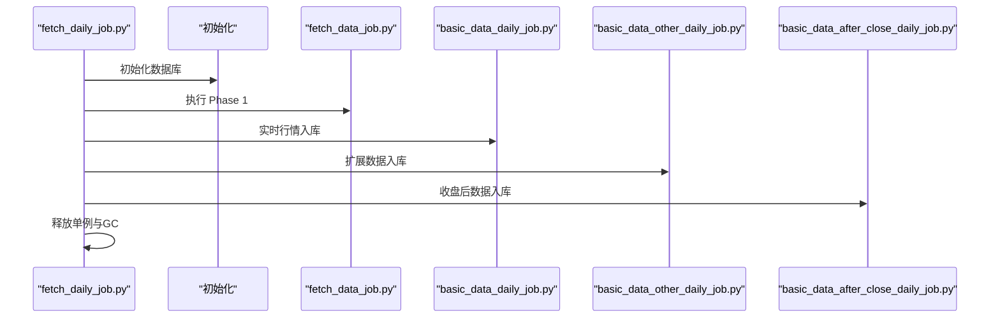
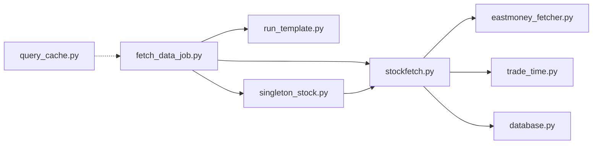

# 数据抓取作业

<cite>
**本文引用的文件**
- [fetch_data_job.py](file://docker/stock/quantia/job/fetch_data_job.py)
- [fetch_daily_job.py](file://docker/stock/quantia/job/fetch_daily_job.py)
- [stockfetch.py](file://docker/stock/quantia/core/stockfetch.py)
- [singleton_stock.py](file://docker/stock/quantia/core/singleton_stock.py)
- [eastmoney_fetcher.py](file://docker/stock/quantia/core/eastmoney_fetcher.py)
- [query_cache.py](file://docker/stock/quantia/lib/query_cache.py)
- [run_template.py](file://docker/stock/quantia/lib/run_template.py)
- [trade_time.py](file://docker/stock/quantia/lib/trade_time.py)
- [database.py](file://docker/stock/quantia/lib/database.py)
- [README.md](file://README.md)
- [cron/README.md](file://cron/README.md)
- [test_pagination.py](file://tests/test_pagination.py)
- [test_bugfixes.py](file://tests/test_bugfixes.py)
</cite>

## 目录
1. [简介](#简介)
2. [项目结构](#项目结构)
3. [核心组件](#核心组件)
4. [架构概览](#架构概览)
5. [详细组件分析](#详细组件分析)
6. [依赖分析](#依赖分析)
7. [性能考虑](#性能考虑)
8. [故障排查指南](#故障排查指南)
9. [结论](#结论)
10. [附录](#附录)

## 简介
本技术文档围绕 Quantia 的数据抓取作业展开，系统性阐述其职责边界、执行流程、数据源优先级策略、缓存与内存管理、错误处理机制，以及与批处理作业的协作关系。文档还提供配置参数说明、性能优化建议与故障排查方法，帮助读者快速理解并高效运维该数据抓取体系。

## 项目结构
数据抓取作业主要位于 docker/stock/quantia/job 目录下的 fetch_data_job.py 与 fetch_daily_job.py，配合核心抓取逻辑 stockfetch.py、单例缓存 singleton_stock.py、代理与 Cookie 管理 eastmoney_fetcher.py、查询缓存 query_cache.py、日期工具 trade_time.py、数据库封装 database.py 以及通用运行模板 run_template.py。

**图表来源**
- [fetch_data_job.py](file://docker/stock/quantia/job/fetch_data_job.py#L1-L119)
- [fetch_daily_job.py](file://docker/stock/quantia/job/fetch_daily_job.py#L1-L105)
- [stockfetch.py](file://docker/stock/quantia/core/stockfetch.py#L1-L800)
- [singleton_stock.py](file://docker/stock/quantia/core/singleton_stock.py#L1-L116)
- [eastmoney_fetcher.py](file://docker/stock/quantia/core/eastmoney_fetcher.py#L1-L149)
- [query_cache.py](file://docker/stock/quantia/lib/query_cache.py#L1-L156)
- [run_template.py](file://docker/stock/quantia/lib/run_template.py#L1-L95)
- [trade_time.py](file://docker/stock/quantia/lib/trade_time.py#L1-L224)
- [database.py](file://docker/stock/quantia/lib/database.py#L1-L232)

**章节来源**
- [fetch_data_job.py](file://docker/stock/quantia/job/fetch_data_job.py#L1-L119)
- [fetch_daily_job.py](file://docker/stock/quantia/job/fetch_daily_job.py#L1-L105)
- [stockfetch.py](file://docker/stock/quantia/core/stockfetch.py#L1-L800)
- [singleton_stock.py](file://docker/stock/quantia/core/singleton_stock.py#L1-L116)
- [eastmoney_fetcher.py](file://docker/stock/quantia/core/eastmoney_fetcher.py#L1-L149)
- [query_cache.py](file://docker/stock/quantia/lib/query_cache.py#L1-L156)
- [run_template.py](file://docker/stock/quantia/lib/run_template.py#L1-L95)
- [trade_time.py](file://docker/stock/quantia/lib/trade_time.py#L1-L224)
- [database.py](file://docker/stock/quantia/lib/database.py#L1-L232)

## 核心组件
- 数据获取作业（Phase 1）：负责集中执行外部 API 数据获取，预加载实时行情、批量更新历史 K 线缓存、清理过期/退市/除权缓存。
- 多数据源优先级：实时行情与历史 K 线均采用“东方财富 → 腾讯财经 → 新浪财经”的优先级策略，失败自动切换。
- 缓存与内存管理：历史 K 线采用磁盘缓存（低内存模式），按需读取；查询缓存采用 LRU+TTL；单例缓存支持释放。
- 错误处理：数据源健康度追踪与降级、聚合日志、指数退避重试、代理池反馈与自动恢复。
- 与其他作业协作：fetch_daily_job.py 将初始化、数据获取、实时入库、扩展数据与收盘后数据串联，形成完整流水线。

**章节来源**
- [fetch_data_job.py](file://docker/stock/quantia/job/fetch_data_job.py#L1-L119)
- [stockfetch.py](file://docker/stock/quantia/core/stockfetch.py#L38-L187)
- [singleton_stock.py](file://docker/stock/quantia/core/singleton_stock.py#L1-L116)
- [query_cache.py](file://docker/stock/quantia/lib/query_cache.py#L1-L156)
- [fetch_daily_job.py](file://docker/stock/quantia/job/fetch_daily_job.py#L1-L105)

## 架构概览
数据抓取作业通过 fetch_daily_job.py 编排，先初始化数据库，再执行 fetch_data_job.py 的 Phase 1（清理缓存、预加载实时行情、批量更新历史 K 线缓存）。核心抓取逻辑由 stockfetch.py 提供，内部集成多数据源切换、缓存与健康度管理；eastmoney_fetcher.py 负责 Cookie 与会话管理；singleton_stock.py 提供历史 K 线单例缓存；query_cache.py 提供内存查询缓存；run_template.py 提供统一的日期参数解析与批量执行能力；trade_time.py 提供交易日与时序工具；database.py 提供数据库连接与写入封装。

**图表来源**
- [fetch_daily_job.py](file://docker/stock/quantia/job/fetch_daily_job.py#L60-L101)
- [fetch_data_job.py](file://docker/stock/quantia/job/fetch_data_job.py#L38-L108)
- [stockfetch.py](file://docker/stock/quantia/core/stockfetch.py#L190-L254)
- [singleton_stock.py](file://docker/stock/quantia/core/singleton_stock.py#L19-L116)
- [database.py](file://docker/stock/quantia/lib/database.py#L58-L138)

## 详细组件分析

### 数据获取作业（Phase 1）
职责与流程
- 清理过期缓存：删除退市、除权等无效缓存文件。
- 预加载实时行情：通过 stock_data 单例获取当日股票/ETF实时行情。
- 批量更新历史 K 线缓存：按交易日时间区间与股票列表，低内存模式增量更新磁盘缓存。

关键特性
- 低内存模式：每只股票处理完成后释放内存，峰值内存控制在较低水平。
- 独立运行：支持直接执行 python fetch_data_job.py 进行手动数据预热。
- 失败不影响后续：即使部分失败，后续分析仍可基于现有缓存继续。

**图表来源**
- [fetch_data_job.py](file://docker/stock/quantia/job/fetch_data_job.py#L38-L108)

**章节来源**
- [fetch_data_job.py](file://docker/stock/quantia/job/fetch_data_job.py#L1-L119)

### 多数据源优先级策略
- 实时行情与历史 K 线：统一采用“东方财富 → 腾讯财经 → 新浪财经”优先级。
- 健康度追踪与降级：连续失败超过阈值时，该数据源进入冷却期（指数退避上限），冷却结束后自动恢复。
- 聚合日志：同一数据源在固定时间窗口内的失败日志进行聚合输出，避免刷屏。

**图表来源**
- [stockfetch.py](file://docker/stock/quantia/core/stockfetch.py#L46-L123)
- [stockfetch.py](file://docker/stock/quantia/core/stockfetch.py#L146-L168)

**章节来源**
- [stockfetch.py](file://docker/stock/quantia/core/stockfetch.py#L38-L187)

### 缓存机制与内存管理
- 历史 K 线缓存（磁盘）：按股票代码前缀分目录存储，支持增量更新与元数据管理，避免重复抓取。
- 查询缓存（内存）：LRU+TTL，支持统计信息与清理过期条目，适用于 Web 查询场景。
- 单例缓存：stock_data 与 stock_hist_data 单例，支持 release 主动释放，降低峰值内存占用。
- 低内存模式：历史 K 线抓取过程中逐只股票处理并释放，避免长期持有大量数据。

**图表来源**
- [query_cache.py](file://docker/stock/quantia/lib/query_cache.py#L27-L156)
- [singleton_stock.py](file://docker/stock/quantia/core/singleton_stock.py#L19-L116)

**章节来源**
- [stockfetch.py](file://docker/stock/quantia/core/stockfetch.py#L785-L800)
- [query_cache.py](file://docker/stock/quantia/lib/query_cache.py#L1-L156)
- [singleton_stock.py](file://docker/stock/quantia/core/singleton_stock.py#L1-L116)

### 错误处理策略
- 指数退避重试：基于环境变量配置的基础间隔，采用 2 的幂次等待并加入随机抖动，避免惊群效应。
- 代理池反馈：请求异常时反馈代理池，累积失败后自动剔除；成功时反馈恢复，提升整体稳定性。
- 健康度降级：连续失败触发降级，冷却时间指数退避，上限保护；冷却结束自动恢复。
- 聚合日志：固定时间窗口内对同一数据源失败进行聚合输出，减少日志噪声。

**图表来源**
- [stockfetch.py](file://docker/stock/quantia/core/stockfetch.py#L64-L123)
- [eastmoney_fetcher.py](file://docker/stock/quantia/core/eastmoney_fetcher.py#L75-L143)

**章节来源**
- [stockfetch.py](file://docker/stock/quantia/core/stockfetch.py#L170-L187)
- [eastmoney_fetcher.py](file://docker/stock/quantia/core/eastmoney_fetcher.py#L75-L143)

### 与其他批处理作业的协作
- fetch_daily_job.py 将初始化、数据获取（Phase 1）、实时行情入库、扩展数据与收盘后数据串联，形成完整流水线。
- 各阶段失败不影响后续阶段继续执行，提高整体鲁棒性。
- 收盘后释放单例与垃圾回收，避免资源泄漏。

**图表来源**
- [fetch_daily_job.py](file://docker/stock/quantia/job/fetch_daily_job.py#L60-L101)

**章节来源**
- [fetch_daily_job.py](file://docker/stock/quantia/job/fetch_daily_job.py#L1-L105)

## 依赖分析
- fetch_data_job.py 依赖 run_template.py 解析日期参数，依赖 stockfetch.py 执行清理与更新，依赖 singleton_stock.py 预加载实时行情。
- stockfetch.py 依赖多爬虫模块（stock_hist_em、stock_sina、stock_tencent 等）、交易日工具、数据库封装与代理 Cookie 管理。
- singleton_stock.py 依赖 stockfetch.py 与交易日工具，提供历史 K 线单例缓存。
- eastmoney_fetcher.py 依赖代理池与 Cookie 管理，提供线程安全的请求封装。
- query_cache.py 为查询缓存提供 LRU+TTL 能力。
- trade_time.py 提供交易日与时序工具。
- database.py 提供数据库连接与写入封装。

**图表来源**
- [fetch_data_job.py](file://docker/stock/quantia/job/fetch_data_job.py#L22-L35)
- [stockfetch.py](file://docker/stock/quantia/core/stockfetch.py#L1-L31)
- [singleton_stock.py](file://docker/stock/quantia/core/singleton_stock.py#L1-L9)
- [eastmoney_fetcher.py](file://docker/stock/quantia/core/eastmoney_fetcher.py#L1-L11)
- [query_cache.py](file://docker/stock/quantia/lib/query_cache.py#L1-L13)
- [run_template.py](file://docker/stock/quantia/lib/run_template.py#L1-L11)
- [trade_time.py](file://docker/stock/quantia/lib/trade_time.py#L1-L6)
- [database.py](file://docker/stock/quantia/lib/database.py#L1-L10)

**章节来源**
- [fetch_data_job.py](file://docker/stock/quantia/job/fetch_data_job.py#L22-L35)
- [stockfetch.py](file://docker/stock/quantia/core/stockfetch.py#L1-L31)
- [singleton_stock.py](file://docker/stock/quantia/core/singleton_stock.py#L1-L9)
- [eastmoney_fetcher.py](file://docker/stock/quantia/core/eastmoney_fetcher.py#L1-L11)
- [query_cache.py](file://docker/stock/quantia/lib/query_cache.py#L1-L13)
- [run_template.py](file://docker/stock/quantia/lib/run_template.py#L1-L11)
- [trade_time.py](file://docker/stock/quantia/lib/trade_time.py#L1-L6)
- [database.py](file://docker/stock/quantia/lib/database.py#L1-L10)

## 性能考虑
- 并发控制：历史 K 线抓取限制最大并发线程数，避免触发目标站点限流/封禁。
- 指数退避：重试等待采用指数增长并加入抖动，降低多线程同步重试带来的压力。
- 低内存模式：逐只股票处理并释放，峰值内存显著降低，适合大规模股票池。
- 缓存策略：磁盘缓存避免重复抓取；查询缓存 LRU+TTL 减少数据库压力。
- 代理池反馈：失败代理自动剔除，成功代理优先使用，提升整体成功率与稳定性。

**章节来源**
- [stockfetch.py](file://docker/stock/quantia/core/stockfetch.py#L70-L71)
- [stockfetch.py](file://docker/stock/quantia/core/stockfetch.py#L170-L184)
- [singleton_stock.py](file://docker/stock/quantia/core/singleton_stock.py#L70-L71)
- [query_cache.py](file://docker/stock/quantia/lib/query_cache.py#L27-L92)
- [eastmoney_fetcher.py](file://docker/stock/quantia/core/eastmoney_fetcher.py#L94-L142)

## 故障排查指南
常见问题与定位方法
- 数据源全部失败：检查健康度降级日志与聚合日志，确认是否因连续失败进入冷却；查看代理池状态与 Cookie 配置。
- 缓存异常：验证缓存目录权限与磁盘空间；检查缓存元数据一致性；必要时清理缓存后重建。
- 代理不稳定：观察代理池反馈日志，确认代理质量；适当增加重试次数与缩短代理超时。
- 内存占用过高：确认是否启用低内存模式；检查单例是否及时释放；监控峰值内存趋势。
- 日期参数错误：使用 run_template 的日期解析能力，确保交易日判断正确；必要时手动指定日期范围。

参考测试用例
- 缓存键生成与 TTL 过期行为：验证不同参数生成不同缓存 key，TTL 过期后返回 miss，LRU 淘汰最早条目。
- 增量缓存场景：向前/向后补数据的 fetch 范围计算正确性。

**章节来源**
- [test_pagination.py](file://tests/test_pagination.py#L838-L958)
- [test_bugfixes.py](file://tests/test_bugfixes.py#L495-L553)
- [stockfetch.py](file://docker/stock/quantia/core/stockfetch.py#L146-L168)

## 结论
数据抓取作业通过明确的职责划分、稳健的多数据源优先级策略、完善的缓存与内存管理、以及健壮的错误处理机制，实现了高可靠、高性能的股票数据获取流水线。结合 fetch_daily_job 的编排能力，可独立运行以实现手动数据预热，并与后续分析与入库作业无缝衔接。

## 附录

### 配置参数
- 历史数据默认年数：可通过环境变量 HIST_DATA_DEFAULT_YEARS 调整，默认值见实现。
- 数据源重试次数：DATA_SOURCE_MAX_RETRIES（默认 2 次）。
- 数据源重试基础间隔：DATA_SOURCE_RETRY_INTERVAL（默认 90 秒）。
- 查询缓存大小与 TTL：内存查询缓存默认最大条目数与默认过期时间见实现。
- 东方财富 Cookie：可通过环境变量或配置文件设置。

**章节来源**
- [stockfetch.py](file://docker/stock/quantia/core/stockfetch.py#L42-L43)
- [query_cache.py](file://docker/stock/quantia/lib/query_cache.py#L36-L39)
- [eastmoney_fetcher.py](file://docker/stock/quantia/core/eastmoney_fetcher.py#L36-L52)

### 使用示例与手册
- 通过 fetch_data_job.py 手动拉取：支持指定日期、强制重建缓存等操作。
- Docker 环境手动拉取：进入容器后执行相应脚本。
- README 与 cron 文档提供了详细的使用说明与最佳实践。

**章节来源**
- [README.md](file://README.md#L237-L291)
- [cron/README.md](file://cron/README.md#L247-L291)
