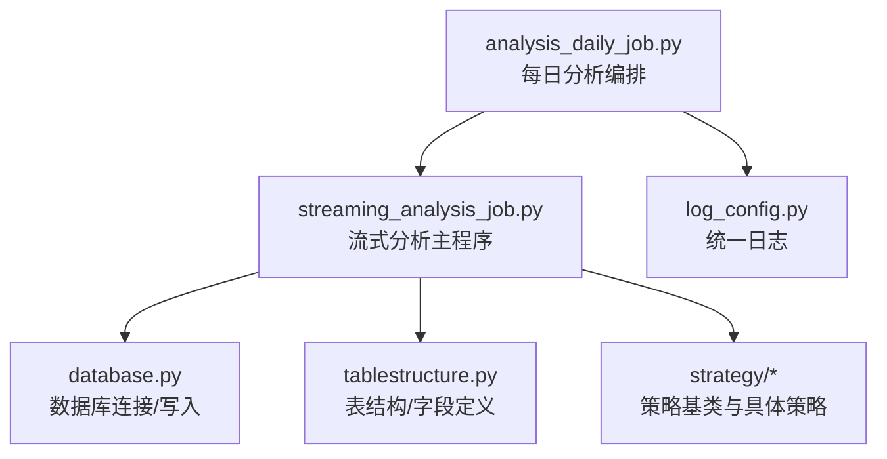
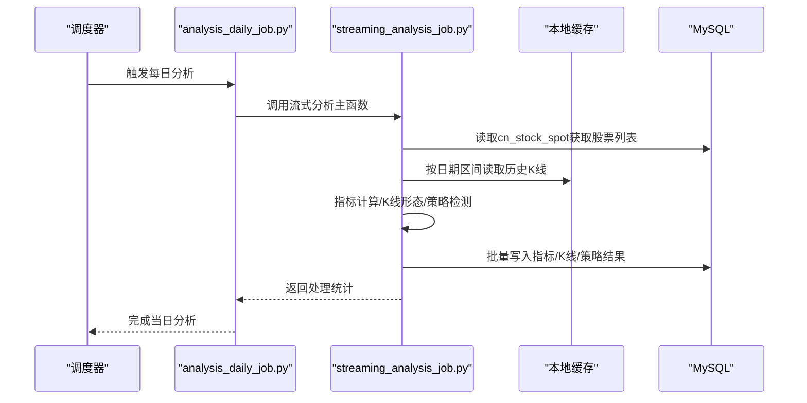
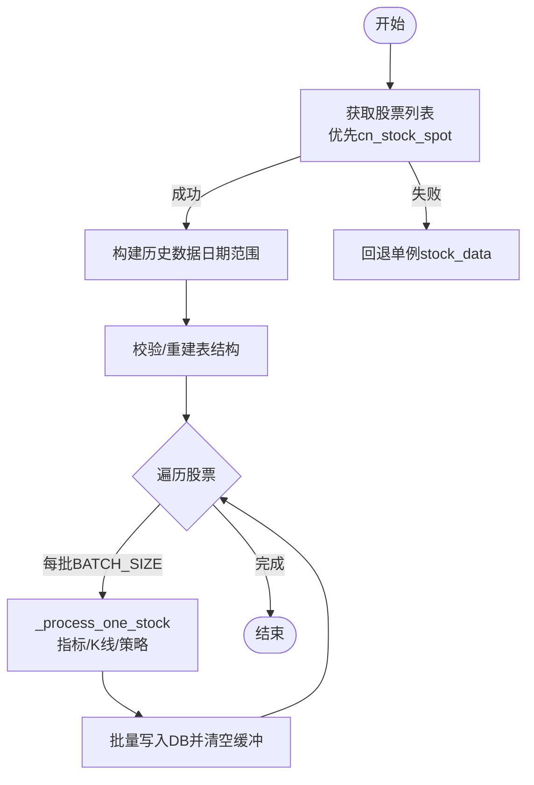
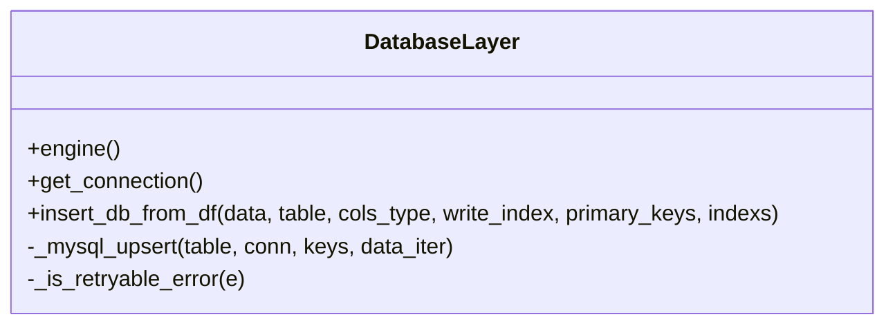
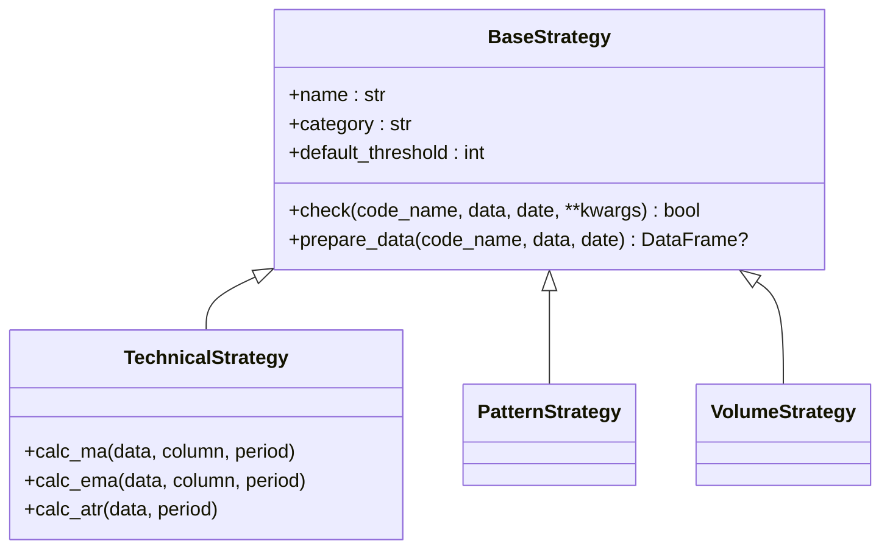
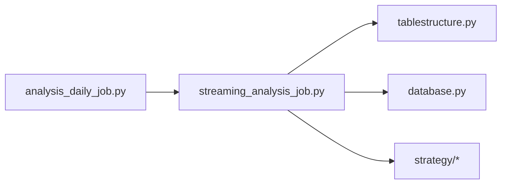

# 流式分析作业

<cite>
**本文引用的文件**
- [streaming_analysis_job.py](file://quantia/job/streaming_analysis_job.py)
- [analysis_daily_job.py](file://quantia/job/analysis_daily_job.py)
- [database.py](file://quantia/lib/database.py)
- [tablestructure.py](file://quantia/core/tablestructure.py)
- [log_config.py](file://quantia/lib/log_config.py)
- [base.py](file://quantia/core/strategy/base.py)
- [ma_strategies.py](file://quantia/core/strategy/technical/ma_strategies.py)
- [pattern_strategies.py](file://quantia/core/strategy/pattern/pattern_strategies.py)
</cite>

## 目录
1. [简介](#简介)
2. [项目结构](#项目结构)
3. [核心组件](#核心组件)
4. [架构总览](#架构总览)
5. [详细组件分析](#详细组件分析)
6. [依赖分析](#依赖分析)
7. [性能考虑](#性能考虑)
8. [故障排查指南](#故障排查指南)
9. [结论](#结论)
10. [附录](#附录)

## 简介
本文件面向Quantia流式分析作业，系统化阐述其设计思路、执行机制与工程实践，重点覆盖：
- 实时数据分析与历史数据统一处理
- 流式指标计算、K线形态识别与策略检测
- 触发机制、数据流控制与状态管理
- 配置参数、性能优化与监控告警建议

流式分析作业以“零API调用”为核心前提，完全依赖本地缓存与数据库，通过单次遍历、按需读取与及时释放，显著降低内存占用与I/O次数，实现对4900+股票的高效批处理。

## 项目结构
围绕流式分析作业的关键目录与文件如下：
- quantia/job/streaming_analysis_job.py：流式分析主入口与核心逻辑
- quantia/job/analysis_daily_job.py：每日分析编排（调度流式分析与回测）
- quantia/lib/database.py：数据库连接池、事务与写入封装
- quantia/core/tablestructure.py：数据库表结构定义与字段类型映射
- quantia/lib/log_config.py：统一日志配置
- quantia/core/strategy/base.py：策略基类与注册体系
- quantia/core/strategy/technical/ma_strategies.py：技术类策略示例
- quantia/core/strategy/pattern/pattern_strategies.py：形态类策略示例

**图示来源**
- [analysis_daily_job.py](file://quantia/job/analysis_daily_job.py#L98-L149)
- [streaming_analysis_job.py](file://quantia/job/streaming_analysis_job.py#L118-L294)
- [database.py](file://quantia/lib/database.py#L60-L200)
- [tablestructure.py](file://quantia/core/tablestructure.py#L63-L104)
- [log_config.py](file://quantia/lib/log_config.py#L47-L104)

**章节来源**
- [streaming_analysis_job.py](file://quantia/job/streaming_analysis_job.py#L1-L530)
- [analysis_daily_job.py](file://quantia/job/analysis_daily_job.py#L1-L149)

## 核心组件
- 流式分析主函数：单次遍历所有股票，同时进行指标计算、K线形态识别与策略检测，支持批量写入与延迟清理
- 数据源与表结构：从cn_stock_spot读取股票列表，从缓存读取历史K线，写入指标、K线形态与策略结果表
- 策略体系：基于策略基类与注册表，支持技术类、形态类等策略扩展
- 数据库层：连接池、幂等写入（UPSERT）、主键与索引管理
- 日志与监控：统一日志格式与错误聚合，便于监控与告警

**章节来源**
- [streaming_analysis_job.py](file://quantia/job/streaming_analysis_job.py#L118-L294)
- [tablestructure.py](file://quantia/core/tablestructure.py#L63-L104)
- [base.py](file://quantia/core/strategy/base.py#L20-L96)
- [database.py](file://quantia/lib/database.py#L60-L200)
- [log_config.py](file://quantia/lib/log_config.py#L47-L104)

## 架构总览
流式分析作业在“获取—分析—回测”的流水线上处于分析阶段，与数据获取作业解耦，支持独立运行与跨节点重跑。

**图示来源**
- [analysis_daily_job.py](file://quantia/job/analysis_daily_job.py#L98-L149)
- [streaming_analysis_job.py](file://quantia/job/streaming_analysis_job.py#L118-L294)

## 详细组件分析

### 流式分析主流程
- 股票列表获取：优先从cn_stock_spot读取，若无则回退至单例stock_data
- 日期区间计算：基于交易日历与默认年数，确定历史数据读取范围
- 表结构校验：确保指标、K线、策略表列定义与代码一致，必要时重建
- 延迟清理：首次写入前清理当日旧数据，避免中途崩溃导致数据丢失
- 多线程流式处理：按批次并发处理股票，每批完成后批量写入并清空缓冲区
- 二次筛选：基于指标表生成买卖信号表

**图示来源**
- [streaming_analysis_job.py](file://quantia/job/streaming_analysis_job.py#L118-L294)
- [streaming_analysis_job.py](file://quantia/job/streaming_analysis_job.py#L348-L432)

**章节来源**
- [streaming_analysis_job.py](file://quantia/job/streaming_analysis_job.py#L57-L86)
- [streaming_analysis_job.py](file://quantia/job/streaming_analysis_job.py#L118-L294)
- [streaming_analysis_job.py](file://quantia/job/streaming_analysis_job.py#L348-L432)

### 数据库写入与幂等策略
- 连接池：单例SQLAlchemy引擎，限制并发连接数，启用预检与超时
- 幂等写入：根据表是否具备主键选择UPSERT或追加写入
- 主键与索引：首次写入时自动添加主键与索引
- 瞬态错误重试：对死锁、锁等待、连接断开等错误进行重试与连接池修复

**图示来源**
- [database.py](file://quantia/lib/database.py#L60-L200)

**章节来源**
- [database.py](file://quantia/lib/database.py#L60-L200)

### 策略体系与扩展
- 策略基类：统一check接口、数据准备、阈值控制
- 技术类策略：均线、ATR、海龟交易等
- 形态类策略：突破平台、停机坪、高而窄旗形等
- 注册机制：通过装饰器注册策略，便于集中管理与扩展

**图示来源**
- [base.py](file://quantia/core/strategy/base.py#L20-L96)
- [ma_strategies.py](file://quantia/core/strategy/technical/ma_strategies.py#L22-L56)
- [pattern_strategies.py](file://quantia/core/strategy/pattern/pattern_strategies.py#L22-L78)

**章节来源**
- [base.py](file://quantia/core/strategy/base.py#L20-L96)
- [ma_strategies.py](file://quantia/core/strategy/technical/ma_strategies.py#L22-L56)
- [pattern_strategies.py](file://quantia/core/strategy/pattern/pattern_strategies.py#L22-L78)

### 表结构与字段定义
- 关键表：cn_stock_spot（每日行情）、cn_stock_indicators（技术指标）、cn_stock_kline_pattern（K线形态）、策略结果表、买卖信号表
- 字段类型：通过tablestructure映射到SQLAlchemy类型，确保写入一致性
- 外键与回测字段：策略结果表自动补齐回测相关字段

**章节来源**
- [tablestructure.py](file://quantia/core/tablestructure.py#L63-L104)
- [streaming_analysis_job.py](file://quantia/job/streaming_analysis_job.py#L376-L432)

### 日志与监控
- 统一日志：按脚本生成独立日志文件，错误统一落盘，控制台仅输出警告及以上级别
- 分析编排：每日分析任务支持跳过条件与强制执行开关，避免重复计算

**章节来源**
- [log_config.py](file://quantia/lib/log_config.py#L47-L104)
- [analysis_daily_job.py](file://quantia/job/analysis_daily_job.py#L60-L96)

## 依赖分析
- 组件耦合
  - streaming_analysis_job依赖tablestructure定义表结构、database写入、strategy策略族
  - analysis_daily_job作为编排入口，串联GPT选股、流式分析与回测
- 外部依赖
  - MySQL连接池与事务控制
  - pandas与talib用于指标与形态计算
- 循环依赖
  - 策略注册通过装饰器集中管理，避免显式循环导入

**图示来源**
- [streaming_analysis_job.py](file://quantia/job/streaming_analysis_job.py#L37-L43)
- [analysis_daily_job.py](file://quantia/job/analysis_daily_job.py#L48-L50)

**章节来源**
- [streaming_analysis_job.py](file://quantia/job/streaming_analysis_job.py#L37-L43)
- [analysis_daily_job.py](file://quantia/job/analysis_daily_job.py#L48-L50)

## 性能考虑
- 内存控制
  - 单次遍历+按需读取+及时释放，峰值内存显著降低
  - 分批提交（BATCH_SIZE）与线程池（ANALYSIS_WORKERS）平衡吞吐与资源
- I/O优化
  - 零API调用，从本地缓存读取历史数据，I/O次数从数百降至数十
- 数据库写入
  - 连接池与幂等写入，减少连接开销与重复写入
  - 延迟清理避免中途崩溃导致数据丢失
- 可调参数
  - QUANTIA_BATCH_SIZE：批量大小
  - QUANTIA_ANALYSIS_WORKERS：并发线程数
  - QUANTIA_ANALYSIS_DONE_THRESHOLD：分析完成阈值（每日分析跳过条件）

**章节来源**
- [streaming_analysis_job.py](file://quantia/job/streaming_analysis_job.py#L48-L54)
- [streaming_analysis_job.py](file://quantia/job/streaming_analysis_job.py#L248-L284)
- [database.py](file://quantia/lib/database.py#L60-L71)
- [analysis_daily_job.py](file://quantia/job/analysis_daily_job.py#L55-L74)

## 故障排查指南
- 股票列表为空
  - 现象：从cn_stock_spot读取失败或无数据
  - 处理：检查fetch作业是否入库；回退至单例stock_data重试
- 龙虎榜数据缺失
  - 现象：check_high_tight策略跳过
  - 处理：确认basic_data_other_daily_job已入库
- 表结构不兼容
  - 现象：列数不足或字段缺失
  - 处理：自动重建旧表，后续写入时重建
- 数据库瞬态错误
  - 现象：死锁、锁等待、连接断开
  - 处理：自动重试与连接池修复
- 日志定位
  - 使用统一日志文件定位错误堆栈与异常

**章节来源**
- [streaming_analysis_job.py](file://quantia/job/streaming_analysis_job.py#L57-L86)
- [streaming_analysis_job.py](file://quantia/job/streaming_analysis_job.py#L171-L177)
- [streaming_analysis_job.py](file://quantia/job/streaming_analysis_job.py#L313-L346)
- [database.py](file://quantia/lib/database.py#L109-L184)
- [log_config.py](file://quantia/lib/log_config.py#L47-L104)

## 结论
流式分析作业通过“零API调用、单次遍历、按需读取、及时释放”的设计，实现了对4900+股票的高效批处理，显著降低内存与I/O成本。配合策略注册体系、数据库幂等写入与统一日志，形成可扩展、可观测、可维护的分析流水线。建议在生产环境中结合监控告警与容量规划，持续优化BATCH_SIZE与WORKERS参数，保障稳定性与吞吐。

## 附录

### 触发机制与运行模式
- 调度器触发：通过定时任务或CI/CD触发analysis_daily_job
- 跨节点重跑：每日分析支持跳过条件，避免重复计算
- 强制执行：通过环境变量强制执行分析任务

**章节来源**
- [analysis_daily_job.py](file://quantia/job/analysis_daily_job.py#L98-L149)
- [analysis_daily_job.py](file://quantia/job/analysis_daily_job.py#L60-L96)

### 配置参数清单
- QUANTIA_BATCH_SIZE：批量写入大小（默认50）
- QUANTIA_ANALYSIS_WORKERS：并发线程数（默认2）
- QUANTIA_ANALYSIS_DONE_THRESHOLD：分析完成阈值（默认1000）
- QUANTIA_FORCE_ANALYSIS：强制执行分析（1为强制）

**章节来源**
- [streaming_analysis_job.py](file://quantia/job/streaming_analysis_job.py#L48-L54)
- [analysis_daily_job.py](file://quantia/job/analysis_daily_job.py#L55-L74)
