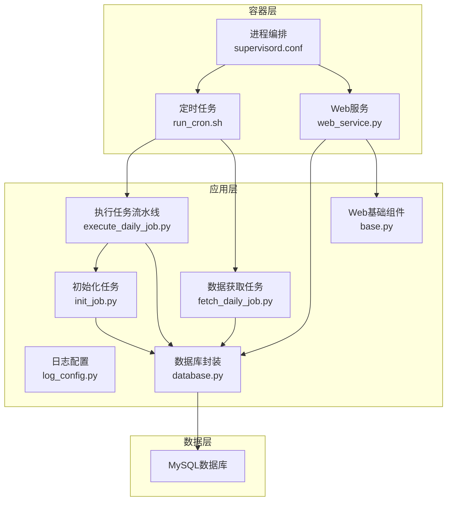
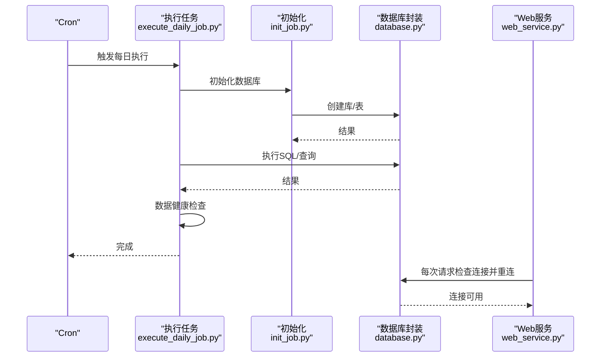
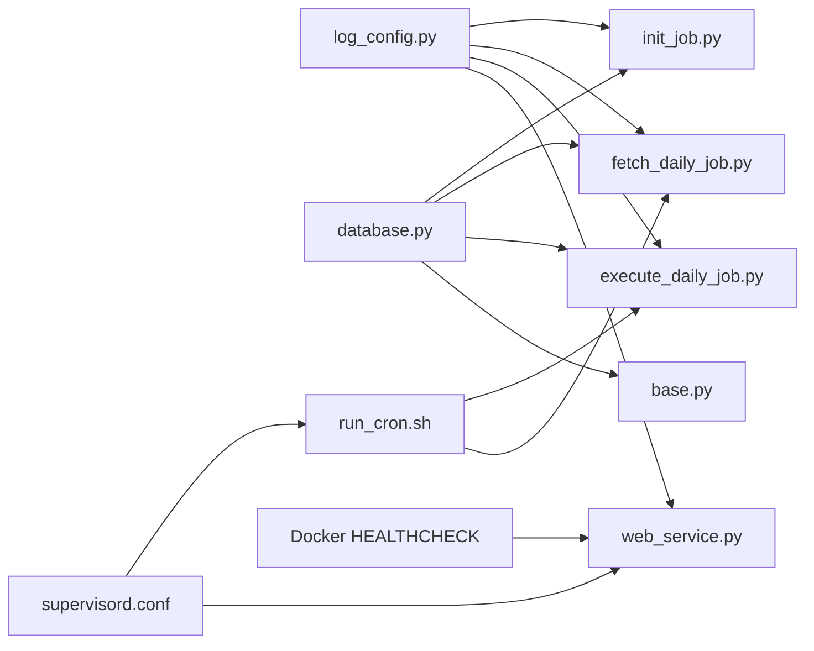

# 监控告警系统

<cite>
**本文引用的文件**
- [quantia/core/stockfetch.py](file://quantia/core/stockfetch.py)
- [cron/README.md](file://cron/README.md)
- [docker/stock/quantia/bin/run_cron.sh](file://docker/stock/quantia/bin/run_cron.sh)
- [docker/Dockerfile](file://docker/Dockerfile)
- [docker/stock/quantia/lib/log_config.py](file://docker/stock/quantia/lib/log_config.py)
- [docker/stock/quantia/lib/database.py](file://docker/stock/quantia/lib/database.py)
- [docker/stock/quantia/web/base.py](file://docker/stock/quantia/web/base.py)
- [docker/stock/quantia/job/init_job.py](file://docker/stock/quantia/job/init_job.py)
- [docker/stock/quantia/job/fetch_daily_job.py](file://docker/stock/quantia/job/fetch_daily_job.py)
- [docker/stock/quantia/job/execute_daily_job.py](file://docker/stock/quantia/job/execute_daily_job.py)
- [docker/stock/quantia/web/web_service.py](file://docker/stock/quantia/web/web_service.py)
- [docker/stock/supervisor/supervisord.conf](file://docker/stock/supervisor/supervisord.conf)
</cite>

## 目录
1. [简介](#简介)
2. [项目结构](#项目结构)
3. [核心组件](#核心组件)
4. [架构总览](#架构总览)
5. [详细组件分析](#详细组件分析)
6. [依赖分析](#依赖分析)
7. [性能考虑](#性能考虑)
8. [故障排查指南](#故障排查指南)
9. [结论](#结论)
10. [附录](#附录)

## 简介
本运维文档面向Quantia监控告警系统，聚焦于监控指标体系、告警规则配置、异常检测机制、数据健康检查、任务执行状态监控、性能指标收集、存储策略、告警通知渠道、故障自动恢复机制，以及配置方法、自定义告警规则与监控仪表板使用。文档基于仓库中的日志配置、数据库封装、定时任务、Web服务、Supervisor编排与健康检查等组件进行系统化梳理，帮助运维人员快速理解并高效维护系统。

## 项目结构
系统采用“容器化 + 定时任务 + Web服务 + 数据库 + 进程编排”的整体架构。关键运维相关目录与文件如下：
- 定时任务与调度：cron/README.md、docker/stock/quantia/bin/run_cron.sh、docker/Dockerfile
- 日志与数据库：docker/stock/quantia/lib/log_config.py、docker/stock/quantia/lib/database.py
- 任务执行：docker/stock/quantia/job/*.py（init、fetch、execute等）
- Web服务与健康检查：docker/stock/quantia/web/web_service.py、docker/stock/quantia/web/base.py
- 进程编排：docker/stock/supervisor/supervisord.conf
- 数据源健康与降级：quantia/core/stockfetch.py

图表来源
- [docker/Dockerfile](file://docker/Dockerfile#L134-L147)
- [docker/stock/quantia/bin/run_cron.sh](file://docker/stock/quantia/bin/run_cron.sh#L1-L19)
- [docker/stock/quantia/web/web_service.py](file://docker/stock/quantia/web/web_service.py#L53-L97)
- [docker/stock/quantia/lib/log_config.py](file://docker/stock/quantia/lib/log_config.py#L47-L104)
- [docker/stock/quantia/lib/database.py](file://docker/stock/quantia/lib/database.py#L58-L69)
- [docker/stock/quantia/job/execute_daily_job.py](file://docker/stock/quantia/job/execute_daily_job.py#L80-L179)
- [docker/stock/quantia/job/fetch_daily_job.py](file://docker/stock/quantia/job/fetch_daily_job.py#L60-L101)
- [docker/stock/stock/quantia/web/base.py](file://docker/stock/quantia/web/base.py#L14-L36)
- [docker/stock/supervisor/supervisord.conf](file://docker/stock/supervisor/supervisord.conf#L25-L42)

章节来源
- [docker/Dockerfile](file://docker/Dockerfile#L134-L147)
- [docker/stock/quantia/bin/run_cron.sh](file://docker/stock/quantia/bin/run_cron.sh#L1-L19)
- [docker/stock/quantia/web/web_service.py](file://docker/stock/quantia/web/web_service.py#L53-L97)
- [docker/stock/quantia/lib/log_config.py](file://docker/stock/quantia/lib/log_config.py#L47-L104)
- [docker/stock/quantia/lib/database.py](file://docker/stock/quantia/lib/database.py#L58-L69)
- [docker/stock/quantia/job/execute_daily_job.py](file://docker/stock/quantia/job/execute_daily_job.py#L80-L179)
- [docker/stock/quantia/job/fetch_daily_job.py](file://docker/stock/quantia/job/fetch_daily_job.py#L60-L101)
- [docker/stock/stock/quantia/web/base.py](file://docker/stock/quantia/web/base.py#L14-L36)
- [docker/stock/supervisor/supervisord.conf](file://docker/stock/supervisor/supervisord.conf#L25-L42)

## 核心组件
- 日志系统：统一日志格式、文件轮转、错误汇总与控制台输出，便于监控与排障。
- 数据库封装：连接池、单例引擎、SQL执行与查询封装、表存在性检查、主键/索引保障。
- 定时任务与调度：Cron配置、锁文件防并发、拆分模式（获取/分析）与重试策略。
- Web服务与健康检查：Tornado应用、CORS支持、数据库连接检查与自动重连、健康检查探针。
- 进程编排：Supervisor管理run_job、run_web、run_cron，自动重启与优先级控制。
- 数据健康检查：流水线结束后对核心表进行当日数据检查，辅助定位“页面无数据”问题。
- 数据源健康与降级：数据源失败计数、冷却期、渐进退避、健康度排序与聚合日志。

章节来源
- [docker/stock/quantia/lib/log_config.py](file://docker/stock/quantia/lib/log_config.py#L47-L104)
- [docker/stock/quantia/lib/database.py](file://docker/stock/quantia/lib/database.py#L58-L69)
- [docker/stock/quantia/job/execute_daily_job.py](file://docker/stock/quantia/job/execute_daily_job.py#L182-L226)
- [docker/stock/stock/quantia/web/base.py](file://docker/stock/quantia/web/base.py#L28-L36)
- [docker/Dockerfile](file://docker/Dockerfile#L149-L151)
- [docker/stock/supervisor/supervisord.conf](file://docker/stock/supervisor/supervisord.conf#L25-L42)
- [quantia/core/stockfetch.py](file://quantia/core/stockfetch.py#L76-L134)

## 架构总览
系统通过Docker容器承载，Supervisor统一管理Web与定时任务进程；定时任务通过Cron驱动，拆分为“数据获取”和“数据分析/回测”两个阶段；Web服务提供API与前端SPA，内置数据库连接健康检查与自动重连；日志系统统一输出至文件与控制台，数据库封装提供连接池与SQL操作能力；数据健康检查贯穿流水线尾部，确保数据完整性。

图表来源
- [docker/stock/quantia/bin/run_cron.sh](file://docker/stock/quantia/bin/run_cron.sh#L1-L19)
- [docker/stock/quantia/job/execute_daily_job.py](file://docker/stock/quantia/job/execute_daily_job.py#L80-L179)
- [docker/stock/quantia/job/init_job.py](file://docker/stock/quantia/job/init_job.py#L52-L61)
- [docker/stock/quantia/lib/database.py](file://docker/stock/quantia/lib/database.py#L58-L69)
- [docker/stock/stock/quantia/web/base.py](file://docker/stock/quantia/web/base.py#L28-L36)

## 详细组件分析

### 日志系统（统一日志配置）
- 功能要点
  - 三路输出：按大小轮转的全量日志文件、错误汇总日志文件、控制台输出。
  - 统一日志格式，避免重复配置导致格式混乱。
  - 首次调用时清除已有处理器，保证格式一致性。
- 运维建议
  - 通过入口脚本调用一次setup_logging，避免重复配置。
  - 关注stock_error.log中的异常堆栈，结合业务日志定位问题。
  - 控制台WARNING以上级别输出，避免INFO刷屏影响观察。

章节来源
- [docker/stock/quantia/lib/log_config.py](file://docker/stock/quantia/lib/log_config.py#L47-L104)

### 数据库封装（连接池与SQL封装）
- 功能要点
  - 单例引擎：避免频繁创建连接池，提升性能与稳定性。
  - 连接参数：超时、字符集、连接池大小与回收策略。
  - SQL封装：insert/update/executeSql/fetch/count等常用操作。
  - 主键/索引保障：自动为主键缺失表添加主键与索引。
- 运维建议
  - 根据服务器规格调整连接池大小与回收时间。
  - 使用checkTableIsExist与主键/索引保障逻辑，减少手工维护。
  - 发生瞬态错误时，利用封装的重试与异常记录快速定位。

章节来源
- [docker/stock/quantia/lib/database.py](file://docker/stock/quantia/lib/database.py#L58-L69)
- [docker/stock/quantia/lib/database.py](file://docker/stock/quantia/lib/database.py#L107-L138)
- [docker/stock/quantia/lib/database.py](file://docker/stock/quantia/lib/database.py#L196-L231)

### 定时任务与调度（Cron与锁文件）
- 功能要点
  - 拆分模式：先执行数据获取（API密集），再执行数据分析/回测（本地计算）。
  - 锁文件防并发：使用flock避免同一任务同时运行。
  - 重试策略：工作日18:00获取失败可在次日凌晨1:00重试。
  - 月度清理：定期清理过期/全量缓存。
- 运维建议
  - 按工作日配置获取与分析任务，避免阻塞。
  - 监控锁文件状态，发现长时间占用及时干预。
  - 根据业务需求调整重试时间窗口。

章节来源
- [cron/README.md](file://cron/README.md#L100-L133)
- [docker/stock/quantia/bin/run_cron.sh](file://docker/stock/quantia/bin/run_cron.sh#L1-L19)

### Web服务与健康检查（Tornado + 探针）
- 功能要点
  - CORS支持与预检请求处理。
  - 每次请求检查数据库连接，失败时自动重连。
  - Docker HEALTHCHECK使用curl探测Web服务。
- 运维建议
  - 关注Web启动日志与端口监听情况。
  - 健康检查失败时，检查容器网络与端口映射。
  - 结合日志定位API异常与数据库连接问题。

章节来源
- [docker/stock/stock/quantia/web/base.py](file://docker/stock/quantia/web/base.py#L14-L36)
- [docker/stock/quantia/web/web_service.py](file://docker/stock/quantia/web/web_service.py#L53-L97)
- [docker/Dockerfile](file://docker/Dockerfile#L149-L151)

### 进程编排（Supervisor）
- 功能要点
  - 管理run_job、run_web、run_cron三个程序。
  - autorestart与优先级控制，确保Web与Cron稳定运行。
- 运维建议
  - 通过inet_http_server远程管理进程。
  - 关注进程状态与退出码，异常时查看对应日志。

章节来源
- [docker/stock/supervisor/supervisord.conf](file://docker/stock/supervisor/supervisord.conf#L25-L42)

### 数据健康检查（流水线尾部）
- 功能要点
  - 流水线结束后检查核心表当日数据量与最新日期。
  - 快速定位“页面无数据”问题：表是否存在、当日是否写入、最近日期是否正确。
- 运维建议
  - 将健康检查结果纳入监控看板。
  - 若某表缺数，结合任务日志定位阶段与具体表。

章节来源
- [docker/stock/quantia/job/execute_daily_job.py](file://docker/stock/quantia/job/execute_daily_job.py#L182-L226)

### 数据源健康与降级（失败计数与冷却）
- 功能要点
  - 失败计数与冷却期：连续失败后进入冷却，冷却时间指数递增，最大限制。
  - 冷却结束自动恢复尝试，成功后重置计数。
  - 聚合日志：同一数据源在固定周期内只输出一次聚合警告。
  - 健康度排序：未降级数据源优先，降级数据源排末尾。
- 运维建议
  - 监控降级日志，识别数据源异常趋势。
  - 调整SOURCE_COOLDOWN_SECONDS与最大冷却时间以适配业务SLA。

章节来源
- [quantia/core/stockfetch.py](file://quantia/core/stockfetch.py#L76-L134)

### 任务执行状态监控（阶段化与阈值跳过）
- 功能要点
  - 阶段化执行：初始化、数据获取、入库、分析、回测。
  - 分析完成阈值：若指标表当日数据达到阈值，则跳过分析与回测阶段。
  - 强制执行开关：QUANTIA_FORCE_ANALYSIS=1可强制执行。
- 运维建议
  - 通过阈值参数平衡成本与准确性。
  - 异常时关闭强制执行，避免重复计算。

章节来源
- [docker/stock/quantia/job/execute_daily_job.py](file://docker/stock/quantia/job/execute_daily_job.py#L48-L78)

## 依赖分析
- 组件耦合
  - 日志配置被多个任务与Web服务复用，确保统一格式。
  - 数据库封装被任务与Web服务广泛使用，单例引擎降低连接开销。
  - 定时任务依赖Supervisor与Docker健康检查，保证持续运行。
- 外部依赖
  - MySQL数据库：连接池、表结构、主键/索引。
  - Tornado Web框架：路由、静态资源、CORS。
  - Cron与flock：任务调度与并发控制。

图表来源
- [docker/stock/quantia/lib/log_config.py](file://docker/stock/quantia/lib/log_config.py#L47-L104)
- [docker/stock/quantia/lib/database.py](file://docker/stock/quantia/lib/database.py#L58-L69)
- [docker/stock/quantia/bin/run_cron.sh](file://docker/stock/quantia/bin/run_cron.sh#L1-L19)
- [docker/stock/supervisor/supervisord.conf](file://docker/stock/supervisor/supervisord.conf#L25-L42)
- [docker/Dockerfile](file://docker/Dockerfile#L149-L151)

章节来源
- [docker/stock/quantia/lib/log_config.py](file://docker/stock/quantia/lib/log_config.py#L47-L104)
- [docker/stock/quantia/lib/database.py](file://docker/stock/quantia/lib/database.py#L58-L69)
- [docker/stock/quantia/bin/run_cron.sh](file://docker/stock/quantia/bin/run_cron.sh#L1-L19)
- [docker/stock/supervisor/supervisord.conf](file://docker/stock/supervisor/supervisord.conf#L25-L42)
- [docker/Dockerfile](file://docker/Dockerfile#L149-L151)

## 性能考虑
- 连接池与回收
  - 单例引擎与连接池参数直接影响数据库吞吐与延迟，建议根据并发与响应时间调优。
- 任务阶段化
  - 将API密集的“数据获取”与本地计算的“分析/回测”解耦，避免阻塞。
- 内存与I/O
  - 流式分析与磁盘缓存策略显著降低峰值内存占用，适合大规模数据处理。
- 日志轮转
  - 合理设置日志文件大小与备份数量，避免磁盘压力过大。

章节来源
- [docker/stock/quantia/lib/database.py](file://docker/stock/quantia/lib/database.py#L58-L69)
- [docker/stock/quantia/job/execute_daily_job.py](file://docker/stock/quantia/job/execute_daily_job.py#L132-L136)
- [docker/stock/quantia/lib/log_config.py](file://docker/stock/quantia/lib/log_config.py#L40-L41)

## 故障排查指南
- Web服务无法访问
  - 检查Docker HEALTHCHECK与端口映射，确认容器健康。
  - 查看Web启动日志与stock_web.log，定位启动失败原因。
- API报错或页面无数据
  - 检查stock_error.log中的异常堆栈。
  - 执行数据健康检查，确认核心表当日数据是否写入。
- 数据库连接失败
  - Web层会在请求中自动重连，若频繁失败，检查数据库状态与连接池参数。
- 定时任务未执行或重复执行
  - 检查crontab与锁文件状态，确认flock是否生效。
  - 根据README调整调度策略与重试时间。
- 数据源异常
  - 关注数据源降级日志，识别失败趋势与冷却时间。
  - 调整冷却参数或切换备用数据源。

章节来源
- [docker/Dockerfile](file://docker/Dockerfile#L149-L151)
- [docker/stock/stock/quantia/web/base.py](file://docker/stock/quantia/web/base.py#L28-L36)
- [docker/stock/quantia/job/execute_daily_job.py](file://docker/stock/quantia/job/execute_daily_job.py#L182-L226)
- [docker/stock/quantia/lib/database.py](file://docker/stock/quantia/lib/database.py#L78-L84)
- [cron/README.md](file://cron/README.md#L100-L133)
- [quantia/core/stockfetch.py](file://quantia/core/stockfetch.py#L76-L134)

## 结论
Quantia监控告警系统通过统一日志、数据库封装、定时任务与Web服务、Supervisor编排及健康检查，构建了可观测、可恢复、可扩展的运维体系。建议在生产环境中结合阈值与告警策略，完善监控看板与通知渠道，持续优化连接池与任务调度，确保系统稳定高效运行。

## 附录
- 监控指标体系建议
  - 任务执行时长与成功率、数据库连接数与等待时间、Web请求延迟与错误率、健康检查通过率、数据源降级次数与冷却时长。
- 告警规则配置
  - 任务超时、数据库连接失败、Web健康检查失败、数据健康检查失败、数据源降级持续时间过长。
- 告警通知渠道
  - 邮件、IM群机器人、短信（结合企业内部平台）。
- 故障自动恢复机制
  - Web层自动重连、Supervisor自动重启、Cron重试、数据源冷却与恢复。
- 配置方法与自定义规则
  - 通过环境变量与配置文件调整连接池、阈值与冷却参数；在日志与数据库封装中新增指标采集点。
- 监控仪表板使用
  - 使用健康检查与任务日志作为数据源，展示任务执行状态、数据库健康与数据完整性。
