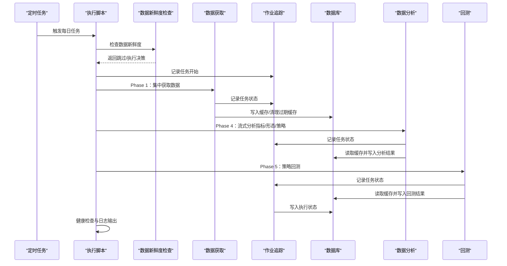
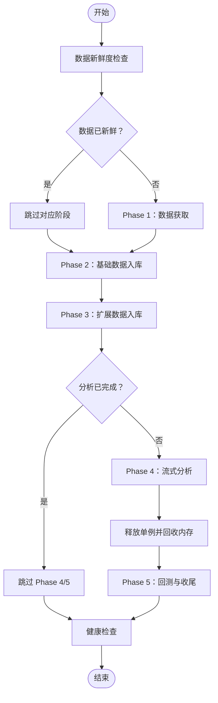
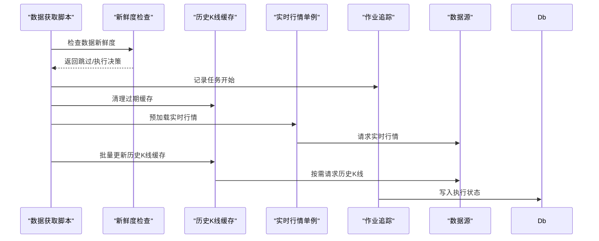
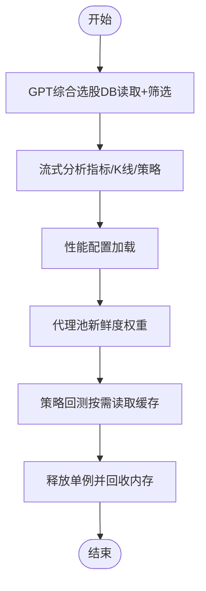
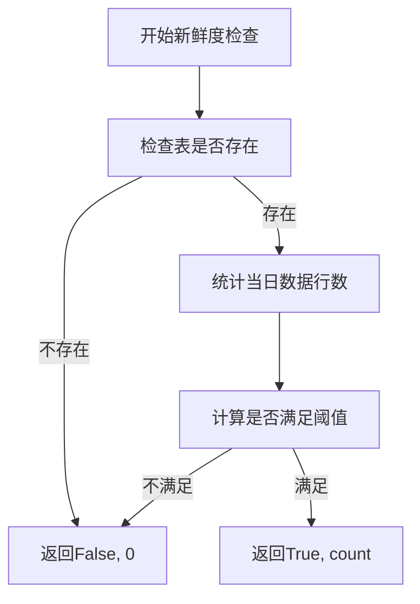
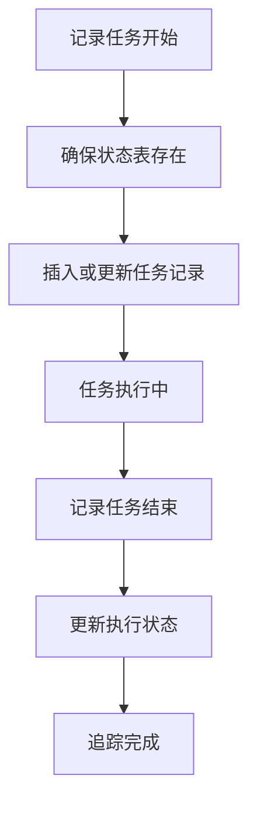
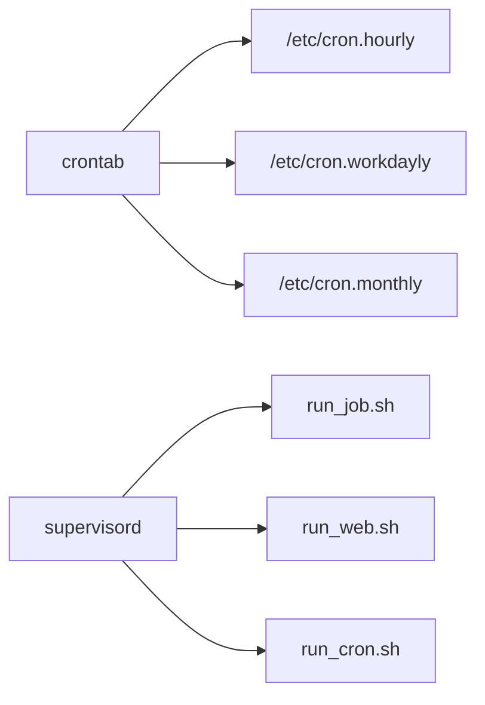
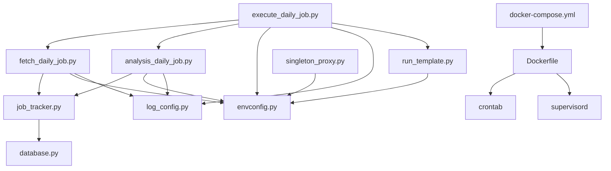

# 自动化执行系统

<cite>
**本文引用的文件**
- [README.md](file://README.md)
- [QUICKSTART.md](file://QUICKSTART.md)
- [Dockerfile](file://docker/Dockerfile)
- [docker-compose.yml](file://docker/docker-compose.yml)
- [execute_daily_job.py](file://quantia/job/execute_daily_job.py)
- [fetch_daily_job.py](file://quantia/job/fetch_daily_job.py)
- [analysis_daily_job.py](file://quantia/job/analysis_daily_job.py)
- [job_tracker.py](file://quantia/lib/job_tracker.py)
- [envconfig.py](file://quantia/lib/envconfig.py)
- [run_template.py](file://quantia/lib/run_template.py)
- [singleton_proxy.py](file://quantia/core/singleton_proxy.py)
- [indicators_data_daily_job.py](file://quantia/job/indicators_data_daily_job.py)
- [klinepattern_data_daily_job.py](file://quantia/job/klinepattern_data_daily_job.py)
- [strategy_data_daily_job.py](file://quantia/job/strategy_data_daily_job.py)
- [supervisord.conf](file://supervisor/supervisord.conf)
- [test_perf_envconfig.py](file://tests/test_perf_envconfig.py)
- [test_refactor.py](file://tests/test_refactor.py)
</cite>

## 更新摘要
**所做更改**
- 新增数据新鲜度管理系统，实现智能跳过机制
- 新增作业状态追踪系统，提供完整的执行监控
- 新增集中式性能配置系统，支持环境变量动态调整
- 新增代理池新鲜度权重机制，优化数据抓取可靠性
- 更新任务调度机制，集成状态检查与阈值控制

## 目录
1. [简介](#简介)
2. [项目结构](#项目结构)
3. [核心组件](#核心组件)
4. [架构总览](#架构总览)
5. [详细组件分析](#详细组件分析)
6. [依赖分析](#依赖分析)
7. [性能考虑](#性能考虑)
8. [故障排查指南](#故障排查指南)
9. [结论](#结论)
10. [附录](#附录)

## 简介
本系统是一个面向A股市场的自动化执行系统，涵盖数据抓取、指标计算、形态识别、策略选股、回测验证与Web可视化展示。系统通过分阶段的任务流水线实现"获取-分析-回测"的解耦，支持定时任务与Docker容器化部署，具备低内存占用、多数据源容错、统一日志与数据库连接池等工程特性，适合在生产环境中稳定运行与维护。

**更新** 系统现已集成数据新鲜度管理、作业状态追踪和性能配置三大核心功能，显著提升了系统的智能化水平和运维效率。

## 项目结构
系统采用按功能域划分的目录组织方式，核心目录与职责如下：
- quantia/job：每日任务脚本集合，负责数据获取、分析、回测等流水线阶段
- quantia/core：核心业务逻辑，包含数据抓取、单例资源、策略与指标计算等
- quantia/lib：基础设施库，包括数据库连接、日志配置、缓存查询、作业追踪等
- quantia/web：Web服务与前端资源，提供可视化界面与回测看板
- quantia/trade：自动交易相关模块（可选）
- docker：Docker镜像构建与编排配置
- cron：系统定时任务配置（小时/工作日/月度）

```mermaid
graph TB
subgraph "应用层"
WEB["Web服务<br/>quantia/web"]
TRADE["交易服务<br/>quantia/trade"]
end
subgraph "任务层"
EXEC["执行脚本<br/>quantia/job/execute_daily_job.py"]
FETCH["数据获取<br/>quantia/job/fetch_daily_job.py"]
ANALYSIS["数据分析<br/>quantia/job/analysis_daily_job.py"]
TRACKER["作业追踪<br/>quantia/lib/job_tracker.py"]
END
subgraph "核心库"
CORE_DB["数据库封装<br/>quantia/lib/database.py"]
LOG_CFG["日志配置<br/>quantia/lib/log_config.py"]
ENV_CFG["环境配置<br/>quantia/lib/envconfig.py"]
RUN_TPL["运行模板<br/>quantia/lib/run_template.py"]
PROXY["代理池<br/>quantia/core/singleton_proxy.py"]
end
subgraph "容器与调度"
DKR["Dockerfile"]
DCMP["docker-compose.yml"]
CRON["定时任务<br/>cron/*.hourly / *.workdayly / *.monthly"]
SUPERVISOR["Supervisor<br/>supervisor/supervisord.conf"]
end
WEB --> EXEC
TRADE --> EXEC
EXEC --> FETCH
EXEC --> ANALYSIS
FETCH --> TRACKER
ANALYSIS --> TRACKER
FETCH --> CORE_DB
ANALYSIS --> CORE_DB
TRACKER --> CORE_DB
LOG_CFG --> EXEC
LOG_CFG --> FETCH
LOG_CFG --> ANALYSIS
ENV_CFG --> EXEC
ENV_CFG --> FETCH
ENV_CFG --> ANALYSIS
RUN_TPL --> ANALYSIS
PROXY --> FETCH
DKR --> CRON
DKR --> SUPERVISOR
DCMP --> DKR
```

**图表来源**
- [Dockerfile:127-147](file://docker/Dockerfile#L127-L147)
- [docker-compose.yml:1-87](file://docker/docker-compose.yml#L1-L87)
- [execute_daily_job.py:80-179](file://quantia/job/execute_daily_job.py#L80-L179)
- [fetch_daily_job.py:111-119](file://quantia/job/fetch_daily_job.py#L111-L119)
- [analysis_daily_job.py:98-145](file://quantia/job/analysis_daily_job.py#L98-L145)
- [job_tracker.py:1-233](file://quantia/lib/job_tracker.py#L1-L233)
- [envconfig.py:1-83](file://quantia/lib/envconfig.py#L1-L83)
- [run_template.py:1-98](file://quantia/lib/run_template.py#L1-L98)
- [singleton_proxy.py:300-333](file://quantia/core/singleton_proxy.py#L300-L333)

**章节来源**
- [README.md:321-326](file://README.md#L321-L326)
- [docker/Dockerfile:127-147](file://docker/Dockerfile#L127-L147)
- [docker/docker-compose.yml:1-87](file://docker/docker-compose.yml#L1-L87)

## 核心组件
- 任务执行器：负责按阶段编排数据获取、入库、分析与回测，支持跳过已完成阶段与强制执行
- 数据获取器：集中发起外部API调用，批量更新历史K线缓存，清理过期缓存
- 数据分析器：基于本地缓存与数据库执行指标计算、形态识别、策略选股与回测
- 数据新鲜度管理：智能检查数据完整性，避免冗余API调用
- 作业状态追踪：记录任务执行状态、耗时和结果，支持跨进程协调
- 性能配置系统：集中管理并发参数、超时设置和阈值配置
- 代理池管理：带新鲜度权重的代理选择机制，提升数据抓取可靠性
- 数据库封装：提供连接池、UPSERT、主键自动创建、可重试事务等能力
- 日志配置：统一输出格式，三路日志（全量文件、错误汇总、控制台）
- 定时任务：通过cron与supervisord在容器内调度执行

**更新** 新增的数据新鲜度管理和作业追踪系统显著提升了系统的智能化水平，性能配置系统提供了灵活的参数调优能力。

**章节来源**
- [execute_daily_job.py:80-179](file://quantia/job/execute_daily_job.py#L80-L179)
- [fetch_daily_job.py:38-109](file://quantia/job/fetch_daily_job.py#L38-L109)
- [analysis_daily_job.py:98-145](file://quantia/job/analysis_daily_job.py#L98-L145)
- [job_tracker.py:1-233](file://quantia/lib/job_tracker.py#L1-L233)
- [envconfig.py:1-83](file://quantia/lib/envconfig.py#L1-L83)
- [run_template.py:1-98](file://quantia/lib/run_template.py#L1-L98)
- [singleton_proxy.py:300-333](file://quantia/core/singleton_proxy.py#L300-L333)

## 架构总览
系统采用"获取-分析-回测"三层流水线，结合单例资源与低内存模式，避免全量加载历史数据，显著降低峰值内存占用。数据库连接池与可重试机制保障高并发下的稳定性。容器化部署通过Dockerfile与docker-compose实现，定时任务由cron与supervisord共同完成。

**更新** 新架构集成了数据新鲜度检查、作业状态追踪和性能配置三大支撑系统，形成更加完善的自动化执行框架。



**图表来源**
- [execute_daily_job.py:80-179](file://quantia/job/execute_daily_job.py#L80-L179)
- [fetch_daily_job.py:38-109](file://quantia/job/fetch_daily_job.py#L38-L109)
- [analysis_daily_job.py:98-145](file://quantia/job/analysis_daily_job.py#L98-L145)
- [job_tracker.py:62-145](file://quantia/lib/job_tracker.py#L62-L145)
- [Dockerfile:134-147](file://docker/Dockerfile#L134-L147)

## 详细组件分析

### 任务调度与批处理作业
- 执行入口：execute_daily_job.py按阶段顺序执行，支持跳过已完成阶段与强制执行
- 阶段划分：
  - Phase 1：数据获取（API密集，仅此阶段调用外部接口）
  - Phase 2：基础数据入库（少量API，读取单例）
  - Phase 3：扩展数据入库（I/O密集，低内存）
  - Phase 4：流式分析（零API，读取磁盘缓存）
  - Phase 5：回测与收尾（重新加载缓存，无API）
- 健康检查：流水线结束后对核心表进行当日数据校验，便于定位"页面无数据"问题

**更新** 新增数据新鲜度检查机制，在每个阶段执行前自动评估数据完整性，避免不必要的API调用。



**图表来源**
- [execute_daily_job.py:139-161](file://quantia/job/execute_daily_job.py#L139-L161)
- [fetch_daily_job.py:108-133](file://quantia/job/fetch_daily_job.py#L108-L133)

**章节来源**
- [execute_daily_job.py:80-179](file://quantia/job/execute_daily_job.py#L80-L179)
- [fetch_daily_job.py:108-133](file://quantia/job/fetch_daily_job.py#L108-L133)

### 数据抓取流水线
- 职责：集中执行所有外部API数据获取，预加载实时行情与批量更新历史K线缓存
- 设计原则：唯一API密集阶段、后续分析从磁盘缓存读取、失败不影响后续分析
- 数据源优先级：东方财富 → 腾讯财经 → 新浪财经
- 缓存策略：清理过期/退市/除权缓存；低内存模式仅更新磁盘缓存
- 新鲜度检查：基于阈值配置的智能跳过机制，避免重复API调用

**更新** 集成作业状态追踪系统，每个子任务执行前后都会记录详细的执行状态和耗时信息。



**图表来源**
- [fetch_daily_job.py:38-109](file://quantia/job/fetch_daily_job.py#L38-L109)
- [job_tracker.py:62-145](file://quantia/lib/job_tracker.py#L62-L145)

**章节来源**
- [fetch_daily_job.py:38-109](file://quantia/job/fetch_daily_job.py#L38-L109)
- [job_tracker.py:1-233](file://quantia/lib/job_tracker.py#L1-L233)

### 分析计算流程
- 职责：基于本地缓存与数据库执行指标计算、K线形态识别、策略选股与回测
- 设计原则：零API调用、峰值内存<50MB、可独立运行
- 关键机制：阈值检查避免重复执行、可重试数据库操作、释放单例回收内存
- 性能配置：支持并发参数、超时设置和批量处理优化

**更新** 新增代理池新鲜度权重机制，提升数据抓取的可靠性和效率。



**图表来源**
- [analysis_daily_job.py:98-145](file://quantia/job/analysis_daily_job.py#L98-L145)
- [singleton_proxy.py:315-332](file://quantia/core/singleton_proxy.py#L315-L332)

**章节来源**
- [analysis_daily_job.py:98-145](file://quantia/job/analysis_daily_job.py#L98-L145)
- [singleton_proxy.py:300-333](file://quantia/core/singleton_proxy.py#L300-L333)

### 回测执行机制
- 回测在Phase 5由回测脚本执行，基于已生成的指标与策略结果进行验证
- 采用按需读取缓存的方式，避免重复API调用
- 结果写入数据库供Web端回测看板展示

**章节来源**
- [execute_daily_job.py:163-167](file://quantia/job/execute_daily_job.py#L163-L167)
- [analysis_daily_job.py:127-132](file://quantia/job/analysis_daily_job.py#L127-L132)

### 数据新鲜度管理系统
- 功能：检查指定表的当日数据是否已存在且足够完整
- 阈值配置：支持不同表设置不同的最小行数阈值
- 强制执行：通过环境变量可强制跳过新鲜度检查
- 时间窗口：仅在结算时间后（默认18:00）才可信地跳过API数据更新

**新增** 数据新鲜度管理系统是本次更新的核心功能，显著减少了不必要的API调用，提升了系统效率。



**图表来源**
- [job_tracker.py:176-201](file://quantia/lib/job_tracker.py#L176-L201)

**章节来源**
- [job_tracker.py:176-201](file://quantia/lib/job_tracker.py#L176-L201)
- [README.md:524-539](file://README.md#L524-L539)

### 作业状态追踪系统
- 表结构：cn_job_status存储作业执行状态、时间戳和耗时信息
- 状态管理：支持running/success/failed/skipped四种状态
- 查询功能：提供作业完成状态检查和任务状态查询
- 前置条件：为kline_cache_daily_job提供run_fetch成功状态检查

**新增** 作业状态追踪系统提供了完整的执行监控能力，支持跨进程协调和状态持久化。



**图表来源**
- [job_tracker.py:62-145](file://quantia/lib/job_tracker.py#L62-L145)

**章节来源**
- [job_tracker.py:1-233](file://quantia/lib/job_tracker.py#L1-L233)

### 性能配置系统
- 集中式配置：通过envconfig模块统一管理所有性能相关参数
- 环境变量：支持QUANTIA_INDICATOR_WORKERS、QUANTIA_KLINE_PATTERN_WORKERS等
- 默认值：为每个参数提供合理的默认值
- 类型安全：提供get_int/get_float/get_bool等类型安全的读取函数

**新增** 性能配置系统提供了灵活的参数调优能力，无需修改代码即可调整系统行为。

**章节来源**
- [envconfig.py:1-83](file://quantia/lib/envconfig.py#L1-L83)
- [test_perf_envconfig.py:1-69](file://tests/test_perf_envconfig.py#L1-L69)

### 代理池新鲜度权重机制
- 权重计算：基于失败次数和验证时间的新鲜度权重
- 选择策略：失败次数越少 + 验证时间越新 → 权重越高
- 新鲜度衰减：超过一定时间的代理权重大幅降低但仍可被选中
- 动态调整：根据代理使用情况动态调整权重分配

**新增** 代理池新鲜度权重机制显著提升了数据抓取的可靠性和效率。

**章节来源**
- [singleton_proxy.py:315-332](file://quantia/core/singleton_proxy.py#L315-L332)

### 定时任务配置
- 容器内通过cron与supervisord共同调度：
  - 小时级：工作日9-15点每30分钟执行
  - 工作日：17:30执行每日任务
  - 月度：周三/周六10:10执行
- Dockerfile中配置crontab并暴露Web端口，健康检查通过curl验证Web服务
- Supervisor管理进程生命周期，提供进程重启和监控功能

**更新** 新增Supervisor配置，提供更完善的进程管理能力。



**图表来源**
- [Dockerfile:134-147](file://docker/Dockerfile#L134-L147)
- [supervisord.conf:25-41](file://supervisor/supervisord.conf#L25-L41)

**章节来源**
- [Dockerfile:134-147](file://docker/Dockerfile#L134-L147)
- [docker-compose.yml:41-71](file://docker/docker-compose.yml#L41-L71)
- [supervisord.conf:1-41](file://supervisor/supervisord.conf#L1-L41)

### 错误重试策略
- 数据库连接与写入采用可重试机制，针对死锁、锁超时、连接异常等瞬态错误进行退避重试
- UPSERT模式避免主键冲突与重复插入错误
- 日志统一输出，错误文件汇总所有脚本的ERROR级别日志
- 作业状态追踪提供详细的错误信息记录

**更新** 错误重试策略与作业状态追踪系统协同工作，提供更完善的错误处理能力。

**章节来源**
- [database.py:80-92](file://quantia/lib/database.py#L80-L92)
- [database.py:152-184](file://quantia/lib/database.py#L152-L184)
- [log_config.py:47-104](file://quantia/lib/log_config.py#L47-L104)
- [job_tracker.py:95-127](file://quantia/lib/job_tracker.py#L95-L127)

### 监控告警系统
- 健康检查：执行脚本在流水线结束后对核心表进行当日数据校验
- 日志监控：统一日志格式与轮转，错误日志集中输出
- 容器健康检查：Web服务健康检查通过curl验证
- 作业状态监控：通过cn_job_status表实时监控作业执行状态

**更新** 新增作业状态监控功能，提供更全面的系统运行状态可视化。

**章节来源**
- [execute_daily_job.py:182-226](file://quantia/job/execute_daily_job.py#L182-L226)
- [log_config.py:47-104](file://quantia/lib/log_config.py#L47-L104)
- [Dockerfile:149-151](file://docker/Dockerfile#L149-L151)
- [job_tracker.py:147-174](file://quantia/lib/job_tracker.py#L147-L174)

### 任务依赖管理与资源调度
- 单例共享：stock_data与stock_hist_data单例在内存中共享，减少重复API调用
- 低内存模式：历史K线缓存仅更新磁盘，分析阶段按需读取，峰值内存显著降低
- 连接池：数据库连接池配置与预热，避免频繁创建连接
- 释放策略：在分析完成后释放单例并回收内存，避免资源泄漏
- 并发控制：通过环境变量配置的并发参数控制任务执行并行度

**更新** 新增性能配置系统，提供更精细的资源调度控制。

**章节来源**
- [execute_daily_job.py:122-129](file://quantia/job/execute_daily_job.py#L122-L129)
- [execute_daily_job.py:152-158](file://quantia/job/execute_daily_job.py#L152-L158)
- [database.py:60-71](file://quantia/lib/database.py#L60-L71)
- [envconfig.py:1-83](file://quantia/lib/envconfig.py#L1-L83)

## 依赖分析
系统依赖关系围绕"任务层-核心库-容器与调度"展开，任务层通过核心库访问数据库与日志，容器与调度负责运行时环境与定时触发。

**更新** 新增作业追踪库和环境配置库的依赖关系，形成更加完善的依赖体系。



**图表来源**
- [execute_daily_job.py:80-179](file://quantia/job/execute_daily_job.py#L80-L179)
- [fetch_daily_job.py:111-119](file://quantia/job/fetch_daily_job.py#L111-L119)
- [analysis_daily_job.py:98-145](file://quantia/job/analysis_daily_job.py#L98-L145)
- [job_tracker.py:1-233](file://quantia/lib/job_tracker.py#L1-L233)
- [envconfig.py:1-83](file://quantia/lib/envconfig.py#L1-L83)
- [run_template.py:1-98](file://quantia/lib/run_template.py#L1-L98)
- [singleton_proxy.py:300-333](file://quantia/core/singleton_proxy.py#L300-L333)
- [database.py:60-71](file://quantia/lib/database.py#L60-L71)
- [log_config.py:47-104](file://quantia/lib/log_config.py#L47-L104)
- [Dockerfile:134-147](file://docker/Dockerfile#L134-L147)
- [docker-compose.yml:1-87](file://docker/docker-compose.yml#L1-L87)

**章节来源**
- [README.md:321-326](file://README.md#L321-L326)
- [docker/Dockerfile:127-147](file://docker/Dockerfile#L127-L147)
- [docker/docker-compose.yml:1-87](file://docker/docker-compose.yml#L1-L87)

## 性能考虑
- 内存优化：历史K线缓存采用低内存模式，分析阶段按需读取，峰值内存显著降低
- I/O优化：数据获取阶段集中发起API请求，后续分析阶段零API调用
- 数据库优化：连接池、UPSERT、主键自动创建与索引管理，提升写入与查询效率
- 并发与重试：数据库写入与连接具备可重试机制，提升稳定性
- 新鲜度优化：智能跳过机制减少不必要的API调用，提升整体效率
- 代理优化：新鲜度权重机制提升代理使用效率和成功率

**更新** 新增数据新鲜度优化和代理池优化，显著提升系统性能。

**章节来源**
- [fetch_data_job.py:79-103](file://quantia/job/fetch_data_job.py#L79-L103)
- [analysis_daily_job.py:18-22](file://quantia/job/analysis_daily_job.py#L18-L22)
- [database.py:60-71](file://quantia/lib/database.py#L60-L71)
- [database.py:152-184](file://quantia/lib/database.py#L152-L184)
- [job_tracker.py:176-201](file://quantia/lib/job_tracker.py#L176-L201)
- [singleton_proxy.py:315-332](file://quantia/core/singleton_proxy.py#L315-L332)

## 故障排查指南
- 数据获取失败：检查网络与代理配置，确认数据源优先级与容错切换
- 数据库连接失败：检查数据库配置与服务状态，使用健康检查命令验证
- 页面无数据：执行健康检查日志，核对核心表当日数据条数与最新日期
- 日志定位：查看统一日志文件与错误汇总文件，结合控制台WARNING级别输出
- 作业状态异常：检查cn_job_status表中的执行状态和错误信息
- 性能问题：通过环境变量调整并发参数和超时设置
- 新鲜度问题：检查QUANTIA_FORCE_FETCH等环境变量配置

**更新** 新增作业状态检查和性能调优指导，提供更全面的故障排查方案。

**章节来源**
- [QUICKSTART.md:169-195](file://QUICKSTART.md#L169-L195)
- [execute_daily_job.py:182-226](file://quantia/job/execute_daily_job.py#L182-L226)
- [log_config.py:47-104](file://quantia/lib/log_config.py#L47-L104)
- [job_tracker.py:147-174](file://quantia/lib/job_tracker.py#L147-L174)
- [test_perf_envconfig.py:1-69](file://tests/test_perf_envconfig.py#L1-L69)

## 结论
本系统通过清晰的阶段划分与低内存模式，实现了高效稳定的自动化执行流水线。配合数据库连接池、可重试机制与统一日志体系，能够在生产环境中可靠运行。Docker与定时任务配置进一步简化了部署与维护成本。

**更新** 新增的数据新鲜度管理、作业追踪和性能配置系统显著提升了系统的智能化水平和运维效率。建议在生产中结合健康检查与日志监控，合理配置性能参数，确保系统长期稳定运行。

## 附录
- 快速开始与常用操作参见快速入门文档
- Docker部署与环境变量配置参见Dockerfile与docker-compose.yml
- 项目背景与功能介绍参见README
- 性能配置参数参考测试文件中的默认值定义

**章节来源**
- [QUICKSTART.md:1-207](file://QUICKSTART.md#L1-L207)
- [README.md:321-700](file://README.md#L321-L700)
- [docker/Dockerfile:1-153](file://docker/Dockerfile#L1-L153)
- [docker/docker-compose.yml:1-87](file://docker/docker-compose.yml#L1-L87)
- [test_perf_envconfig.py:1-69](file://tests/test_perf_envconfig.py#L1-L69)
- [test_refactor.py:52-81](file://tests/test_refactor.py#L52-L81)
