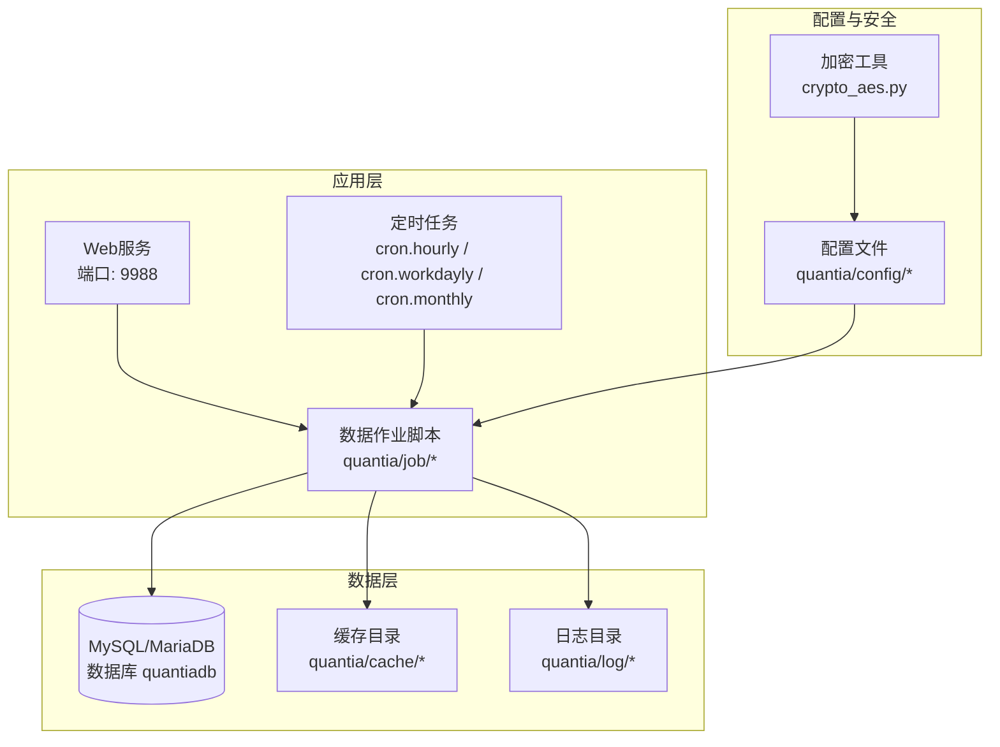
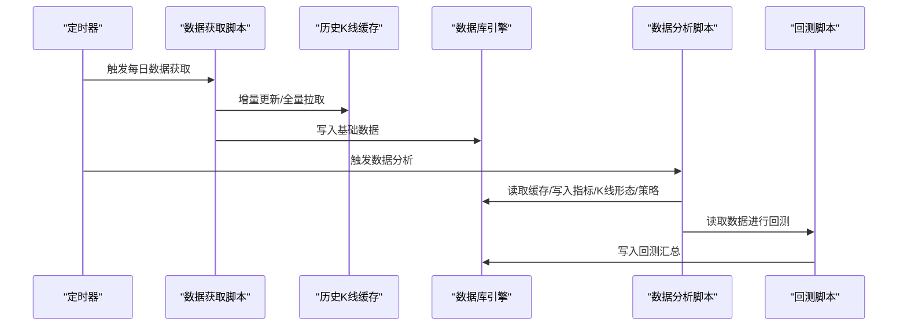
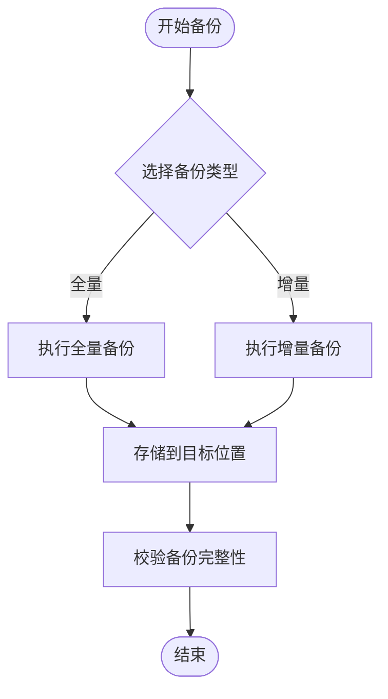
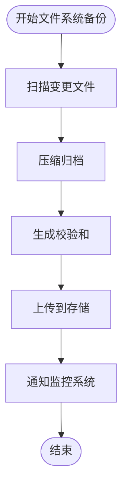
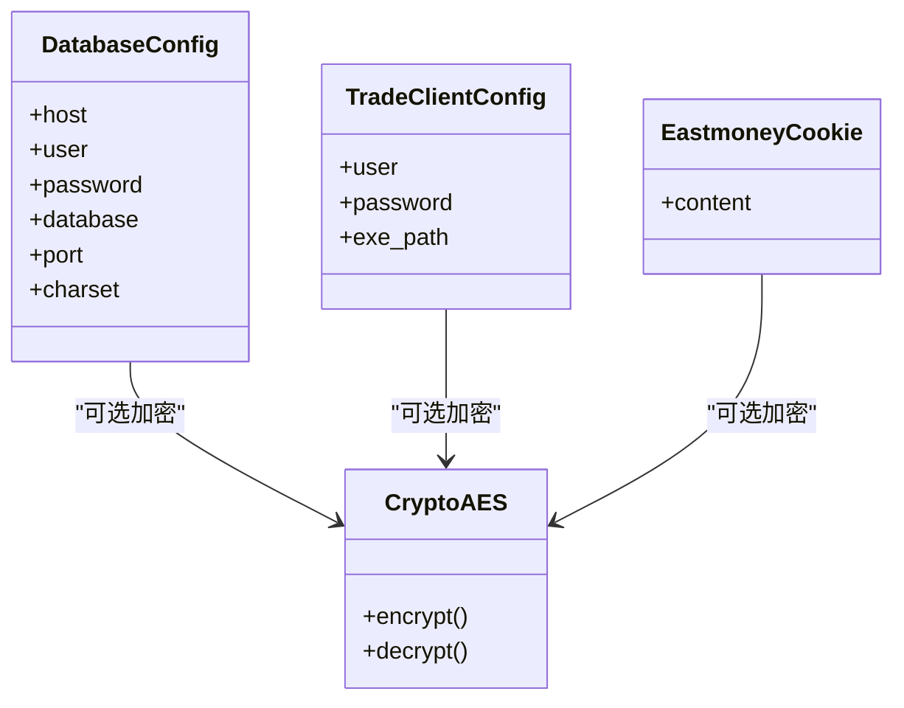
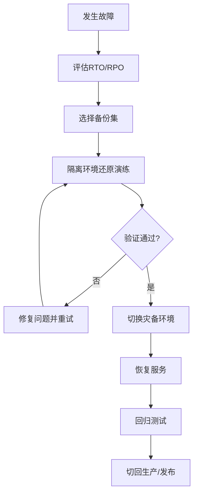
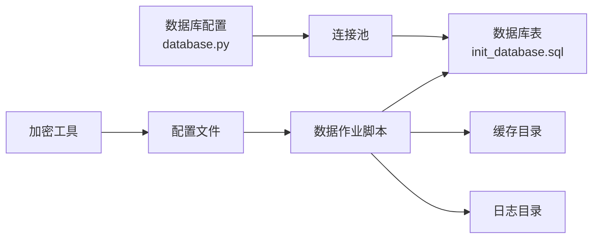

# 备份恢复

<cite>
**本文引用的文件**
- [README.md](file://README.md)
- [QUICKSTART.md](file://QUICKSTART.md)
- [cron/README.md](file://cron/README.md)
- [docker/docker-compose.yml](file://docker/docker-compose.yml)
- [docker/init_database.sql](file://docker/init_database.sql)
- [docker/stock/quantia/lib/database.py](file://docker/stock/quantia/lib/database.py)
- [docker/stock/quantia/lib/crypto_aes.py](file://docker/stock/quantia/lib/crypto_aes.py)
- [docker/stock/quantia/config/trade_client.json](file://docker/stock/quantia/config/trade_client.json)
- [docker/stock/quantia/config/eastmoney_cookie.txt](file://docker/stock/quantia/config/eastmoney_cookie.txt)
- [docker/stock/quantia/config/.gitignore](file://docker/stock/quantia/config/.gitignore)
</cite>

## 目录
1. [简介](#简介)
2. [项目结构](#项目结构)
3. [核心组件](#核心组件)
4. [架构总览](#架构总览)
5. [详细组件分析](#详细组件分析)
6. [依赖关系分析](#依赖关系分析)
7. [性能考量](#性能考量)
8. [故障排查指南](#故障排查指南)
9. [结论](#结论)
10. [附录](#附录)

## 简介
本文件面向Quantia系统，提供一套完整的备份与恢复方案，覆盖数据库备份策略、文件系统备份方案、配置文件备份管理，明确增量备份与全量备份的时间安排、备份数据验证机制，给出灾难恢复流程、数据恢复步骤与系统回滚方案，并提供备份存储位置配置、备份数据加密、跨环境迁移等操作指南，以及备份监控、恢复测试与备份策略优化的最佳实践。

## 项目结构
Quantia系统围绕“数据采集—数据入库—数据分析—回测—Web展示”的流水线构建，核心数据持久化依赖MySQL/MariaDB，缓存与日志分别位于容器卷中，便于统一备份与恢复。

图表来源
- [docker/docker-compose.yml](file://docker/docker-compose.yml#L1-L87)
- [cron/README.md](file://cron/README.md#L1-L332)

章节来源
- [docker/docker-compose.yml](file://docker/docker-compose.yml#L1-L87)
- [cron/README.md](file://cron/README.md#L1-L332)

## 核心组件
- 数据库引擎与连接
  - 通过SQLAlchemy创建连接池，支持环境变量注入数据库参数，具备连接预检与超时控制，适合高并发写入场景。
- 数据写入与幂等
  - 采用“插入或更新”模式，结合主键约束与索引，避免重复写入；数据库层内置重试，提升瞬态错误下的成功率。
- 缓存与增量更新
  - K线缓存采用压缩pickle文件，支持增量更新与损坏检测，首次全量、后续补缺，保障数据完整性。
- 定时任务与补跑
  - 拆分“获取+分析”两阶段，支持按日期补跑，便于异常恢复与数据修复。
- 配置与安全
  - 交易客户端配置、Cookie文件、加密工具等均位于配置目录，便于集中备份与迁移。

章节来源
- [docker/stock/quantia/lib/database.py](file://docker/stock/quantia/lib/database.py#L1-L232)
- [docker/stock/quantia/lib/crypto_aes.py](file://docker/stock/quantia/lib/crypto_aes.py#L1-L211)
- [docker/stock/quantia/config/trade_client.json](file://docker/stock/quantia/config/trade_client.json#L1-L5)
- [docker/stock/quantia/config/eastmoney_cookie.txt](file://docker/stock/quantia/config/eastmoney_cookie.txt#L1-L2)
- [docker/stock/quantia/config/.gitignore](file://docker/stock/quantia/config/.gitignore#L1-L162)
- [cron/README.md](file://cron/README.md#L168-L212)

## 架构总览

图表来源
- [cron/README.md](file://cron/README.md#L27-L56)
- [docker/docker-compose.yml](file://docker/docker-compose.yml#L100-L133)

章节来源
- [cron/README.md](file://cron/README.md#L1-L332)
- [docker/docker-compose.yml](file://docker/docker-compose.yml#L1-L87)

## 详细组件分析

### 数据库备份策略
- 备份类型
  - 全量备份：定期导出数据库实例，包含初始化脚本与所有表结构/数据。
  - 增量备份：基于binlog或逻辑备份的差异增量，结合时间点恢复（PITR）。
- 时间安排
  - 全量：建议工作日夜间执行，如23:00-01:00，避开业务高峰。
  - 增量：每小时或每15分钟一次，结合binlog归档。
- 存储位置
  - 建议将备份文件存放于独立卷或远端对象存储，设置生命周期策略与跨域冗余。
- 验证机制
  - 导出后校验文件完整性与大小；定期执行还原演练（隔离环境）。
- 回滚方案
  - 通过时间点恢复定位到上一个稳定状态；必要时使用全量备份回滚。
- 跨环境迁移
  - 统一导出全量备份，目标环境导入并执行初始化脚本；同步配置与密钥。

图表来源
- [docker/init_database.sql](file://docker/init_database.sql#L1-L455)

章节来源
- [docker/init_database.sql](file://docker/init_database.sql#L1-L455)

### 文件系统备份方案
- 目标范围
  - 应用代码与配置：quantia/config、quantia/lib、quantia/job等。
  - 缓存与日志：quantia/cache、quantia/log。
  - Docker卷：数据库数据卷、日志卷、缓存卷。
- 备份策略
  - 全量：每月首日执行；增量：每日执行。
  - 使用压缩归档与校验和，支持分片传输与断点续传。
- 存储位置
  - 本地磁盘+远端对象存储；设置保留期与轮替策略。
- 验证与恢复
  - 定期抽样解压校验；恢复演练验证可读性与一致性。

图表来源
- [docker/docker-compose.yml](file://docker/docker-compose.yml#L54-L60)

章节来源
- [docker/docker-compose.yml](file://docker/docker-compose.yml#L54-L60)

### 配置文件备份管理
- 关键配置
  - 数据库连接：quantia/lib/database.py（支持环境变量注入）。
  - 交易客户端：quantia/config/trade_client.json。
  - Cookie：quantia/config/eastmoney_cookie.txt。
  - 加密工具：quantia/lib/crypto_aes.py。
- 备份与加密
  - 配置文件纳入全量/增量备份；敏感字段（如交易密码、Cookie）建议加密存储或脱敏处理。
  - 使用crypto_aes.py提供的加解密能力对敏感配置进行保护。
- 迁移与回滚
  - 跨环境迁移时，统一导出配置与密钥材料，目标环境导入后校验可用性。

图表来源
- [docker/stock/quantia/lib/database.py](file://docker/stock/quantia/lib/database.py#L15-L43)
- [docker/stock/quantia/config/trade_client.json](file://docker/stock/quantia/config/trade_client.json#L1-L5)
- [docker/stock/quantia/config/eastmoney_cookie.txt](file://docker/stock/quantia/config/eastmoney_cookie.txt#L1-L2)
- [docker/stock/quantia/lib/crypto_aes.py](file://docker/stock/quantia/lib/crypto_aes.py#L55-L198)

章节来源
- [docker/stock/quantia/lib/database.py](file://docker/stock/quantia/lib/database.py#L1-L232)
- [docker/stock/quantia/config/trade_client.json](file://docker/stock/quantia/config/trade_client.json#L1-L5)
- [docker/stock/quantia/config/eastmoney_cookie.txt](file://docker/stock/quantia/config/eastmoney_cookie.txt#L1-L2)
- [docker/stock/quantia/lib/crypto_aes.py](file://docker/stock/quantia/lib/crypto_aes.py#L1-L211)

### 增量备份与全量备份的时间安排
- 全量备份
  - 周期：每月1日23:00执行。
  - 内容：数据库全量+应用配置+日志归档。
- 增量备份
  - 周期：每日23:30执行；每小时1次缓存/日志增量。
  - 内容：数据库binlog/逻辑增量+缓存差异+日志差异。
- 补跑与重试
  - 定时任务使用排他锁避免并发冲突；异常时在次日凌晨重试。

章节来源
- [cron/README.md](file://cron/README.md#L100-L141)

### 备份数据验证机制
- 结构校验
  - 导出后检查表数量、索引存在性与主键完整性。
- 业务校验
  - 随机抽样关键表记录，比对关键字段一致性。
- 还原演练
  - 在隔离环境执行还原与功能回归测试，验证可恢复性与性能。

章节来源
- [docker/init_database.sql](file://docker/init_database.sql#L1-L455)

### 灾难恢复流程
- 步骤
  - 评估影响范围与RTO/RPO目标。
  - 选择最近可用备份（全量+增量）。
  - 在隔离环境进行还原演练，验证数据完整性与业务可用性。
  - 切换到灾备环境，恢复服务。
  - 回归测试通过后，逐步切回生产。
- 回滚方案
  - 基于时间点恢复到上一个稳定状态；若涉及配置变更，回滚到上一个配置备份。

图表来源
- [docker/init_database.sql](file://docker/init_database.sql#L1-L455)

章节来源
- [docker/init_database.sql](file://docker/init_database.sql#L1-L455)

### 数据恢复步骤
- 数据库恢复
  - 使用初始化脚本重建数据库与表结构；导入全量备份后应用增量备份。
  - 校验表结构、索引与数据一致性。
- 文件系统恢复
  - 恢复配置、缓存与日志目录；校验权限与路径正确性。
- 服务启动与验证
  - 启动应用与数据库服务；检查定时任务与Web服务状态。

章节来源
- [docker/init_database.sql](file://docker/init_database.sql#L1-L455)
- [docker/docker-compose.yml](file://docker/docker-compose.yml#L54-L60)

### 系统回滚方案
- 代码回滚
  - 使用版本控制系统回退到上一个稳定版本；同步回滚配置。
- 数据回滚
  - 基于时间点恢复数据库；必要时回滚到上一个备份。
- 配置回滚
  - 使用配置备份恢复交易客户端、Cookie与加密密钥。

章节来源
- [docker/stock/quantia/lib/database.py](file://docker/stock/quantia/lib/database.py#L22-L38)
- [docker/stock/quantia/config/trade_client.json](file://docker/stock/quantia/config/trade_client.json#L1-L5)
- [docker/stock/quantia/config/eastmoney_cookie.txt](file://docker/stock/quantia/config/eastmoney_cookie.txt#L1-L2)

### 备份存储位置配置
- Docker卷映射
  - 数据库数据卷、日志卷、缓存卷分别挂载到宿主机目录，便于统一备份。
- 外部存储
  - 建议将备份文件上传至对象存储或NAS，设置访问凭证与权限控制。

章节来源
- [docker/docker-compose.yml](file://docker/docker-compose.yml#L74-L80)

### 备份数据加密
- 加密工具
  - 使用crypto_aes.py对敏感配置（如交易密码、Cookie）进行加解密。
- 加密策略
  - 采用CBC模式与固定IV，密钥集中管理；定期轮换密钥并销毁旧密钥。

章节来源
- [docker/stock/quantia/lib/crypto_aes.py](file://docker/stock/quantia/lib/crypto_aes.py#L55-L198)

### 跨环境迁移
- 准备
  - 导出生产环境全量备份与配置；准备目标环境数据库与网络。
- 执行
  - 在目标环境导入数据库与应用；恢复配置与密钥；启动服务。
- 验证
  - 运行功能测试与性能测试，确保迁移成功。

章节来源
- [docker/init_database.sql](file://docker/init_database.sql#L1-L455)
- [docker/docker-compose.yml](file://docker/docker-compose.yml#L1-L87)

## 依赖关系分析

图表来源
- [docker/stock/quantia/lib/database.py](file://docker/stock/quantia/lib/database.py#L58-L74)
- [docker/init_database.sql](file://docker/init_database.sql#L1-L455)
- [docker/docker-compose.yml](file://docker/docker-compose.yml#L54-L60)

章节来源
- [docker/stock/quantia/lib/database.py](file://docker/stock/quantia/lib/database.py#L1-L232)
- [docker/init_database.sql](file://docker/init_database.sql#L1-L455)
- [docker/docker-compose.yml](file://docker/docker-compose.yml#L1-L87)

## 性能考量
- 备份窗口
  - 全量备份安排在业务低峰；增量备份采用分时段策略，避免IO尖峰。
- 并发控制
  - 定时任务使用排他锁，避免重复执行与数据竞争。
- 存储性能
  - 使用SSD或高性能存储承载数据库与缓存；备份写入使用独立带宽。
- 验证效率
  - 采用抽样校验与快速还原演练，缩短恢复时间。

## 故障排查指南
- 数据库连接失败
  - 检查数据库配置与容器健康状态；确认网络连通与端口开放。
- 写入冲突与重复
  - 确认主键约束与“插入或更新”逻辑；查看数据库重试日志。
- 缓存损坏与增量失败
  - 清理损坏缓存文件后重试；检查API可用性与网络策略。
- 定时任务异常
  - 查看任务锁文件与日志；确认依赖服务健康与资源充足。

章节来源
- [docker/stock/quantia/lib/database.py](file://docker/stock/quantia/lib/database.py#L78-L84)
- [cron/README.md](file://cron/README.md#L168-L212)

## 结论
通过全量+增量备份、严格的验证与演练、完善的灾难恢复流程与回滚方案，Quantia系统可在保证数据一致性的同时，实现快速恢复与跨环境迁移。建议持续优化备份策略，加强监控与自动化，确保业务连续性。

## 附录
- 常用命令与路径
  - 数据库初始化脚本：docker/init_database.sql
  - 定时任务说明：cron/README.md
  - Docker编排：docker/docker-compose.yml
  - 数据库配置：docker/stock/quantia/lib/database.py
  - 加密工具：docker/stock/quantia/lib/crypto_aes.py
  - 交易客户端配置：docker/stock/quantia/config/trade_client.json
  - 东方财富Cookie：docker/stock/quantia/config/eastmoney_cookie.txt
  - 配置忽略清单：docker/stock/quantia/config/.gitignore
