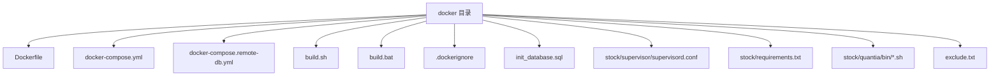
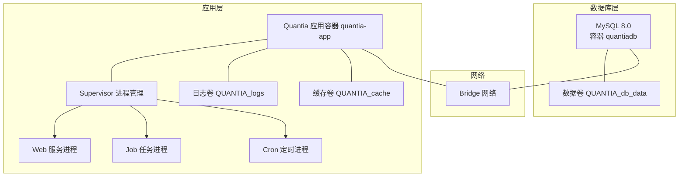
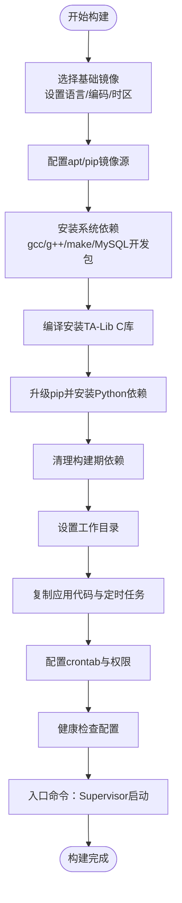
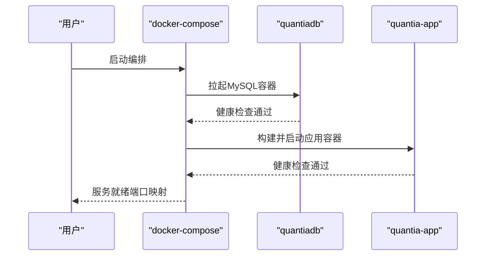
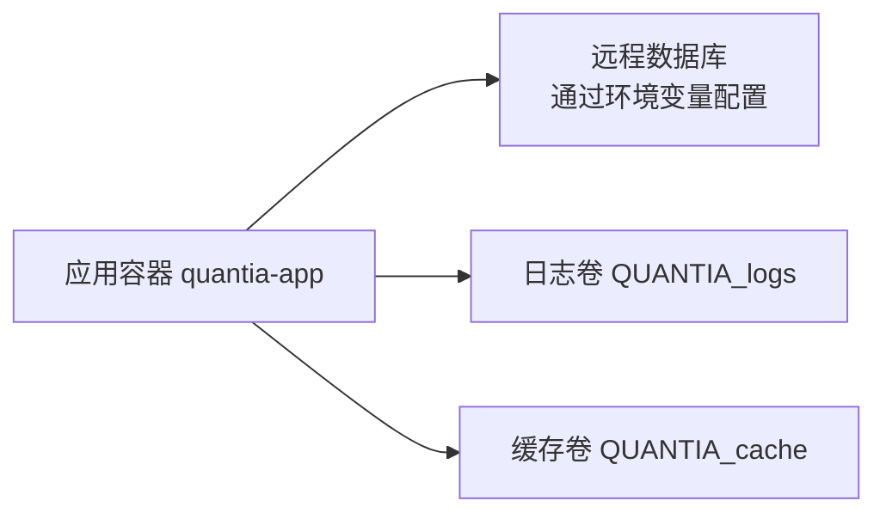
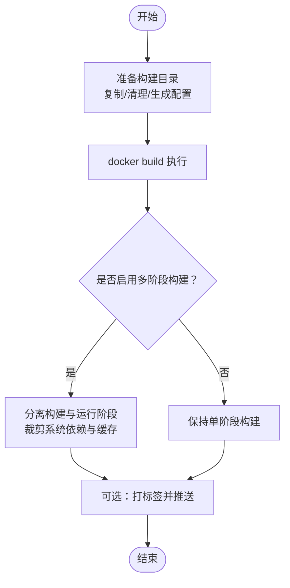
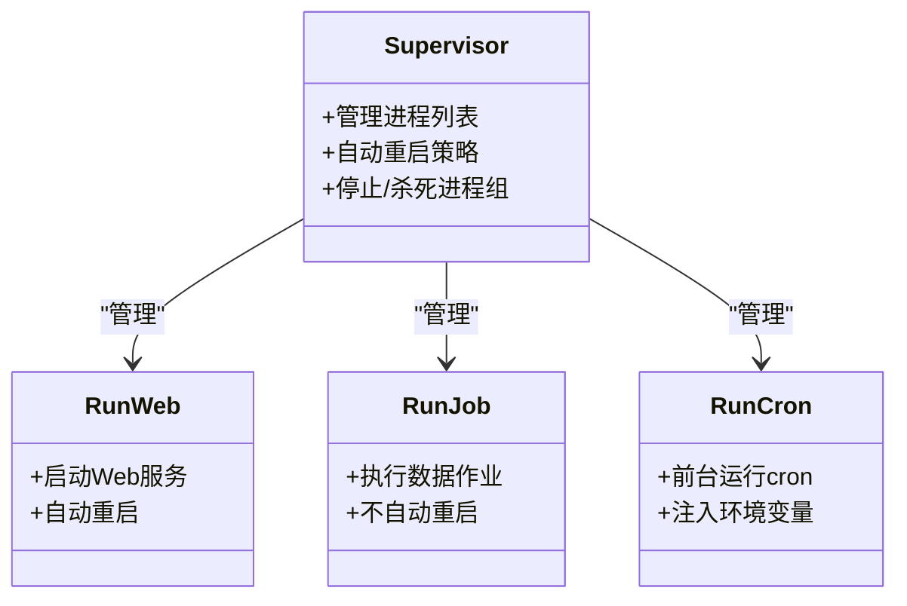
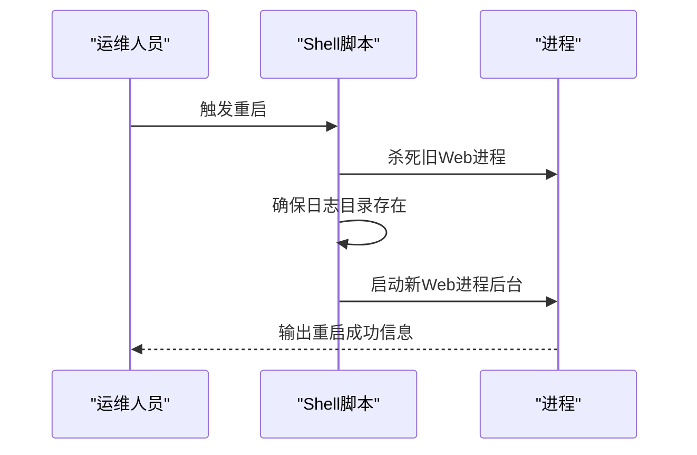
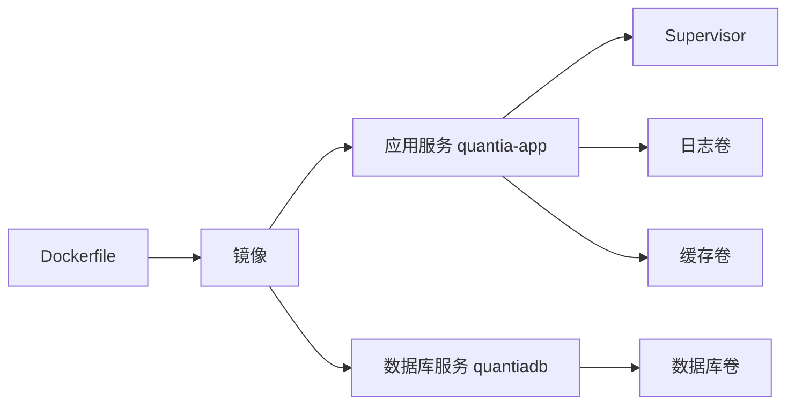

# 容器化部署

<cite>
**本文引用的文件**
- [Dockerfile](file://docker/Dockerfile)
- [docker-compose.yml](file://docker/docker-compose.yml)
- [docker-compose.remote-db.yml](file://docker/docker-compose.remote-db.yml)
- [build.sh](file://docker/build.sh)
- [build.bat](file://docker/build.bat)
- [.dockerignore](file://docker/.dockerignore)
- [init_database.sql](file://docker/init_database.sql)
- [supervisord.conf](file://docker/stock/supervisor/supervisord.conf)
- [requirements.txt](file://docker/stock/requirements.txt)
- [run_web.sh](file://docker/stock/quantia/bin/run_web.sh)
- [run_job.sh](file://docker/stock/quantia/bin/run_job.sh)
- [run_cron.sh](file://docker/stock/quantia/bin/run_cron.sh)
- [restart_web.sh](file://docker/stock/quantia/bin/restart_web.sh)
- [exclude.txt](file://docker/exclude.txt)
</cite>

## 目录
1. [简介](#简介)
2. [项目结构](#项目结构)
3. [核心组件](#核心组件)
4. [架构总览](#架构总览)
5. [详细组件分析](#详细组件分析)
6. [依赖关系分析](#依赖关系分析)
7. [性能考虑](#性能考虑)
8. [故障排查指南](#故障排查指南)
9. [结论](#结论)
10. [附录](#附录)

## 简介
本文件面向Quantia系统的容器化部署，围绕Docker镜像构建、多阶段优化、docker-compose服务编排、环境变量与端口映射、数据卷挂载、本地与远程数据库连接、容器生命周期管理与运维操作进行系统化说明，并提供常见问题与性能优化建议。

## 项目结构
与容器化部署直接相关的目录与文件集中在 docker 子目录中，包含：
- 镜像构建入口：Dockerfile、.dockerignore
- 编排配置：docker-compose.yml（本地数据库）、docker-compose.remote-db.yml（远程数据库）
- 构建脚本：build.sh（Linux/macOS）、build.bat（Windows）
- 运行时进程管理：supervisord.conf
- 启动脚本：run_web.sh、run_job.sh、run_cron.sh、restart_web.sh
- 数据库初始化：init_database.sql
- 依赖清单：requirements.txt
- 构建排除规则：exclude.txt

图表来源
- [Dockerfile](file://docker/Dockerfile#L1-L153)
- [docker-compose.yml](file://docker/docker-compose.yml#L1-L87)
- [docker-compose.remote-db.yml](file://docker/docker-compose.remote-db.yml#L1-L48)
- [build.sh](file://docker/build.sh#L1-L99)
- [build.bat](file://docker/build.bat#L1-L63)
- [.dockerignore](file://docker/.dockerignore#L1-L36)
- [init_database.sql](file://docker/init_database.sql#L1-L455)
- [supervisord.conf](file://docker/stock/supervisor/supervisord.conf#L1-L42)
- [requirements.txt](file://docker/stock/requirements.txt#L1-L38)
- [run_web.sh](file://docker/stock/quantia/bin/run_web.sh#L1-L19)
- [run_job.sh](file://docker/stock/quantia/bin/run_job.sh#L1-L16)
- [run_cron.sh](file://docker/stock/quantia/bin/run_cron.sh#L1-L19)
- [restart_web.sh](file://docker/stock/quantia/bin/restart_web.sh#L1-L28)
- [exclude.txt](file://docker/exclude.txt#L1-L17)

章节来源
- [Dockerfile](file://docker/Dockerfile#L1-L153)
- [docker-compose.yml](file://docker/docker-compose.yml#L1-L87)
- [docker-compose.remote-db.yml](file://docker/docker-compose.remote-db.yml#L1-L48)
- [build.sh](file://docker/build.sh#L1-L99)
- [build.bat](file://docker/build.bat#L1-L63)
- [.dockerignore](file://docker/.dockerignore#L1-L36)
- [init_database.sql](file://docker/init_database.sql#L1-L455)
- [supervisord.conf](file://docker/stock/supervisor/supervisord.conf#L1-L42)
- [requirements.txt](file://docker/stock/requirements.txt#L1-L38)
- [run_web.sh](file://docker/stock/quantia/bin/run_web.sh#L1-L19)
- [run_job.sh](file://docker/stock/quantia/bin/run_job.sh#L1-L16)
- [run_cron.sh](file://docker/stock/quantia/bin/run_cron.sh#L1-L19)
- [restart_web.sh](file://docker/stock/quantia/bin/restart_web.sh#L1-L28)
- [exclude.txt](file://docker/exclude.txt#L1-L17)

## 核心组件
- 镜像构建与运行时
  - 基础镜像与语言环境、时区、编码设置
  - 系统依赖与TA-Lib C库安装
  - Python依赖安装与构建期清理
  - 进程管理：Supervisor管理Web、Job、Cron三类进程
  - 健康检查：Web服务可用性检测
- 服务编排
  - 本地MySQL数据库服务与数据卷
  - Quantia主服务：端口映射、环境变量、数据卷、健康检查
  - 远程数据库模式：通过环境变量连接外部数据库
- 启动脚本与进程
  - run_web.sh：启动Web服务
  - run_job.sh：执行每日数据作业
  - run_cron.sh：前台运行cron并注入环境变量
  - restart_web.sh：优雅重启Web服务
- 数据库初始化
  - 提供完整建表SQL，涵盖多类数据表与索引设计

章节来源
- [Dockerfile](file://docker/Dockerfile#L1-L153)
- [supervisord.conf](file://docker/stock/supervisor/supervisord.conf#L1-L42)
- [run_web.sh](file://docker/stock/quantia/bin/run_web.sh#L1-L19)
- [run_job.sh](file://docker/stock/quantia/bin/run_job.sh#L1-L16)
- [run_cron.sh](file://docker/stock/quantia/bin/run_cron.sh#L1-L19)
- [restart_web.sh](file://docker/stock/quantia/bin/restart_web.sh#L1-L28)
- [init_database.sql](file://docker/init_database.sql#L1-L455)

## 架构总览
下图展示容器化部署的整体架构：Quantia主服务通过Supervisor统一管理Web、Job、Cron进程；默认使用本地MySQL容器存储数据，也可配置为连接外部数据库；数据持久化通过命名卷实现。

图表来源
- [docker-compose.yml](file://docker/docker-compose.yml#L1-L87)
- [docker-compose.remote-db.yml](file://docker/docker-compose.remote-db.yml#L1-L48)
- [supervisord.conf](file://docker/stock/supervisor/supervisord.conf#L1-L42)

## 详细组件分析

### Dockerfile 镜像构建
- 基础镜像与环境
  - 使用 slim 版本基础镜像，设置语言、编码、时区、PYTHONPATH、无缓冲输出
- 镜像加速与源配置
  - 替换apt源与pip镜像，提升国内拉取速度
- 系统依赖与TA-Lib
  - 安装编译工具链与MySQL客户端开发包
  - 通过下载源码编译安装指定版本TA-Lib C库，确保稳定性
- Python依赖
  - 安装Supervisor、数据库驱动、Web框架、数据处理、网络请求、解析、JS引擎、加密、交易等依赖
  - 构建期清理编译依赖，仅保留必要工具
- 工作目录与内容复制
  - 复制应用代码与定时任务配置
- 定时任务配置
  - 设置crontab，按小时、工作日、月度不同频率执行脚本
- 健康检查
  - 使用curl探测Web服务端口
- 入口命令
  - 以Supervisor前台运行并加载配置文件

图表来源
- [Dockerfile](file://docker/Dockerfile#L1-L153)

章节来源
- [Dockerfile](file://docker/Dockerfile#L1-L153)

### docker-compose 本地数据库编排
- 服务定义
  - quantiadb：MySQL 8.0，设置字符集与认证插件，持久化数据卷
  - quantia：基于Dockerfile构建，映射Web与Supervisor端口，设置数据库与数据源相关环境变量，挂载日志与缓存卷
- 依赖与网络
  - 通过depends_on等待数据库健康后再启动应用
  - 使用自定义bridge网络
- 健康检查
  - 数据库与应用均配置健康检查，便于编排器自动恢复

图表来源
- [docker-compose.yml](file://docker/docker-compose.yml#L1-L87)

章节来源
- [docker-compose.yml](file://docker/docker-compose.yml#L1-L87)

### docker-compose 远程数据库编排
- 适用场景
  - 不启动本地数据库容器，直接连接外部数据库
- 关键差异
  - 移除本地数据库服务，使用环境变量配置远程主机、端口、账号、密码、数据库名
  - 保持相同的端口映射、数据卷与健康检查

图表来源
- [docker-compose.remote-db.yml](file://docker/docker-compose.remote-db.yml#L1-L48)

章节来源
- [docker-compose.remote-db.yml](file://docker/docker-compose.remote-db.yml#L1-L48)

### 构建脚本与多阶段优化
- 构建脚本
  - Linux/macOS：build.sh，负责复制项目文件、清理无关内容、调用docker build生成镜像
  - Windows：build.bat，使用排除列表复制文件并构建镜像
- 多阶段优化建议
  - 当前Dockerfile为单阶段构建，建议引入多阶段构建以减小镜像体积：
    - 使用构建阶段安装编译工具与TA-Lib源码，产出预编译产物
    - 在运行阶段仅拷贝必要二进制与依赖，减少系统包与构建缓存
  - 依赖安装优化
    - 使用requirements.txt集中声明，结合pip缓存与只安装生产所需包
  - 构建上下文控制
    - 结合.dockerignore与exclude.txt，避免不必要的文件进入构建上下文

图表来源
- [build.sh](file://docker/build.sh#L1-L99)
- [build.bat](file://docker/build.bat#L1-L63)
- [.dockerignore](file://docker/.dockerignore#L1-L36)
- [exclude.txt](file://docker/exclude.txt#L1-L17)

章节来源
- [build.sh](file://docker/build.sh#L1-L99)
- [build.bat](file://docker/build.bat#L1-L63)
- [.dockerignore](file://docker/.dockerignore#L1-L36)
- [exclude.txt](file://docker/exclude.txt#L1-L17)

### Supervisor 进程管理
- 进程类型
  - run_job：一次性或按需执行的数据作业
  - run_web：Web服务进程，自动重启
  - run_cron：前台运行cron，注入环境变量
- 端口暴露
  - Supervisor管理器监听9001端口（可在compose中映射）

图表来源
- [supervisord.conf](file://docker/stock/supervisor/supervisord.conf#L1-L42)
- [run_web.sh](file://docker/stock/quantia/bin/run_web.sh#L1-L19)
- [run_job.sh](file://docker/stock/quantia/bin/run_job.sh#L1-L16)
- [run_cron.sh](file://docker/stock/quantia/bin/run_cron.sh#L1-L19)

章节来源
- [supervisord.conf](file://docker/stock/supervisor/supervisord.conf#L1-L42)
- [run_web.sh](file://docker/stock/quantia/bin/run_web.sh#L1-L19)
- [run_job.sh](file://docker/stock/quantia/bin/run_job.sh#L1-L16)
- [run_cron.sh](file://docker/stock/quantia/bin/run_cron.sh#L1-L19)

### 启动与运维脚本
- run_web.sh：设置编码与PYTHONPATH后启动Web服务
- run_job.sh：执行每日数据作业脚本
- run_cron.sh：将环境变量写入/etc/environment并前台运行cron
- restart_web.sh：停止旧进程、清理日志目录、后台启动新Web服务

图表来源
- [restart_web.sh](file://docker/stock/quantia/bin/restart_web.sh#L1-L28)

章节来源
- [run_web.sh](file://docker/stock/quantia/bin/run_web.sh#L1-L19)
- [run_job.sh](file://docker/stock/quantia/bin/run_job.sh#L1-L16)
- [run_cron.sh](file://docker/stock/quantia/bin/run_cron.sh#L1-L19)
- [restart_web.sh](file://docker/stock/quantia/bin/restart_web.sh#L1-L28)

### 数据库初始化
- init_database.sql
  - 创建数据库与字符集设置
  - 定义多类数据表（关注、每日行情、资金流、概念/行业资金流、龙虎榜、大宗交易、ETF、交易日历、策略回测等）
  - 部分表结构由代码通过SQLAlchemy动态创建，脚本提供静态建表参考

章节来源
- [init_database.sql](file://docker/init_database.sql#L1-L455)

## 依赖关系分析
- 组件耦合
  - 应用容器依赖Supervisor统一调度多个子进程
  - 默认依赖本地MySQL容器，也可通过环境变量切换至远程数据库
  - 数据持久化通过命名卷隔离日志与缓存
- 外部依赖
  - TA-Lib C库、MySQL客户端、cron、curl（健康检查）
  - Python依赖通过requirements.txt集中管理

图表来源
- [Dockerfile](file://docker/Dockerfile#L1-L153)
- [docker-compose.yml](file://docker/docker-compose.yml#L1-L87)
- [docker-compose.remote-db.yml](file://docker/docker-compose.remote-db.yml#L1-L48)

章节来源
- [Dockerfile](file://docker/Dockerfile#L1-L153)
- [docker-compose.yml](file://docker/docker-compose.yml#L1-L87)
- [docker-compose.remote-db.yml](file://docker/docker-compose.remote-db.yml#L1-L48)

## 性能考虑
- 镜像体积与启动时间
  - 采用多阶段构建可显著降低镜像体积与启动时间
  - 仅在运行阶段保留必要系统包与二进制
- 依赖安装
  - 使用requirements.txt集中管理，结合pip缓存与离线包，减少重复安装
- 定时任务与资源占用
  - 合理设置定时任务频率，避免并发高峰时段大量IO
  - 为Web与Job进程设置优先级与自动重启策略，保证服务可用性
- 数据库性能
  - 本地MySQL建议开启合适的缓冲池与连接数参数
  - 远程数据库需确保网络延迟与带宽满足批量写入需求

## 故障排查指南
- 健康检查失败
  - 应用健康检查：确认Web服务端口可达，查看Supervisor日志
  - 数据库健康检查：确认凭据正确、网络连通、字符集与认证插件配置一致
- 进程未启动或频繁重启
  - 检查Supervisor配置与脚本返回码，定位具体进程异常
  - 查看日志卷中的Web与Job日志
- 端口冲突
  - 修改compose中端口映射，避免宿主机端口被占用
- 数据卷权限
  - 确认日志与缓存目录在容器内可写，必要时调整宿主机权限
- 远程数据库连接失败
  - 校验环境变量配置，确认网络可达与防火墙放行

章节来源
- [docker-compose.yml](file://docker/docker-compose.yml#L1-L87)
- [docker-compose.remote-db.yml](file://docker/docker-compose.remote-db.yml#L1-L48)
- [supervisord.conf](file://docker/stock/supervisor/supervisord.conf#L1-L42)

## 结论
通过Dockerfile与docker-compose的组合，Quantia实现了本地开发与生产环境的一致化部署。配合Supervisor统一管理Web、Job、Cron进程，以及本地或远程数据库的灵活切换，系统具备良好的可维护性与可扩展性。建议进一步引入多阶段构建与更精细的日志/监控策略，持续优化镜像体积与运行时性能。

## 附录

### 环境变量与端口映射
- 环境变量（应用容器）
  - 数据库：QUANTIA_DB_HOST、QUANTIA_DB_PORT、QUANTIA_DB_USER、QUANTIA_DB_PASSWORD、QUANTIA_DB_DATABASE
  - 数据源重试：DATA_SOURCE_MAX_RETRIES、DATA_SOURCE_RETRY_INTERVAL
  - 历史数据：HIST_DATA_DEFAULT_YEARS、HIST_DATA_CACHE_EXPIRE_DAYS
- 端口映射
  - Web服务：默认映射宿主机9988端口
  - Supervisor管理器：默认映射宿主机9001端口（可按需修改）

章节来源
- [Dockerfile](file://docker/Dockerfile#L17-L32)
- [docker-compose.yml](file://docker/docker-compose.yml#L38-L41)
- [docker-compose.remote-db.yml](file://docker/docker-compose.remote-db.yml#L13-L16)

### 数据卷挂载
- 日志卷：/data/Quantia/quantia/log
- 缓存卷：/data/Quantia/quantia/cache
- 代理配置文件（可选）：/data/Quantia/quantia/config/proxy.txt

章节来源
- [docker-compose.yml](file://docker/docker-compose.yml#L54-L61)
- [docker-compose.remote-db.yml](file://docker/docker-compose.remote-db.yml#L29-L36)

### 远程数据库连接配置
- 使用 docker-compose.remote-db.yml 启动
- 必填环境变量：REMOTE_DB_HOST、REMOTE_DB_PASSWORD
- 可选变量：REMOTE_DB_PORT、REMOTE_DB_USER、REMOTE_DB_DATABASE
- 其他数据源与历史数据配置变量同本地模式

章节来源
- [docker-compose.remote-db.yml](file://docker/docker-compose.remote-db.yml#L1-L48)

### 容器启动与停止管理
- 启动
  - 本地数据库：docker-compose up -d
  - 远程数据库：docker-compose -f docker-compose.remote-db.yml up -d
- 停止
  - docker-compose down 或 docker-compose -f ... down
- 重启Web服务
  - 使用 restart_web.sh 或在容器内执行对应命令

章节来源
- [docker-compose.yml](file://docker/docker-compose.yml#L1-L87)
- [docker-compose.remote-db.yml](file://docker/docker-compose.remote-db.yml#L1-L48)
- [restart_web.sh](file://docker/stock/quantia/bin/restart_web.sh#L1-L28)

### 日志查看
- 日志卷路径：/data/Quantia/quantia/log
- 建议在宿主机查看或通过docker logs quantia-app 定位问题

章节来源
- [docker-compose.yml](file://docker/docker-compose.yml#L58-L58)
- [docker-compose.remote-db.yml](file://docker/docker-compose.remote-db.yml#L33-L33)
