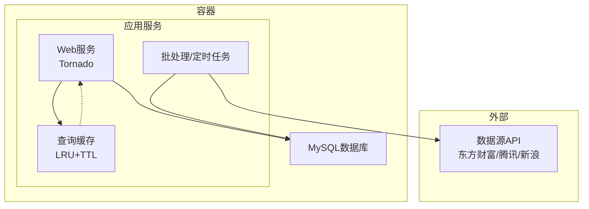
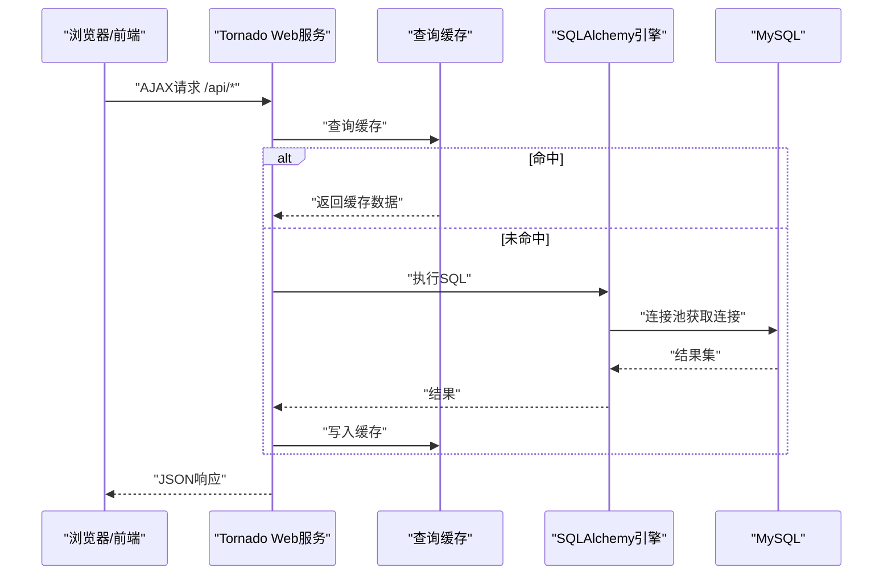
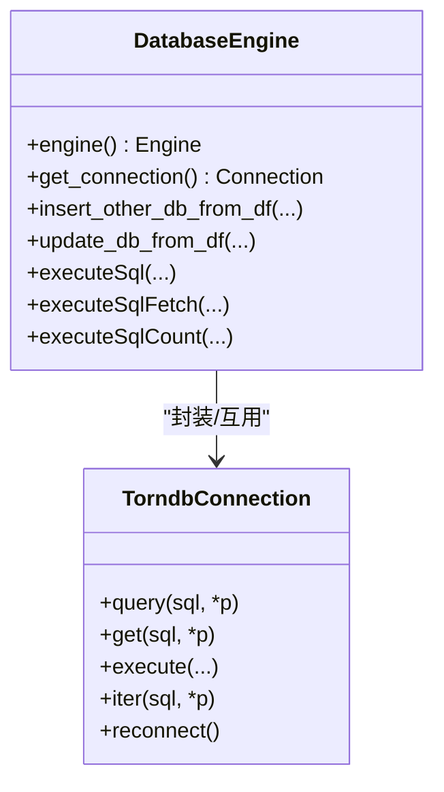
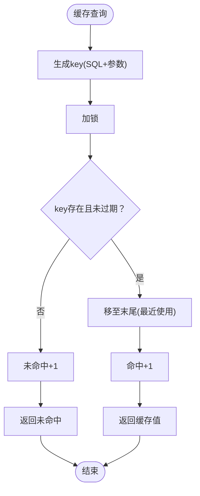
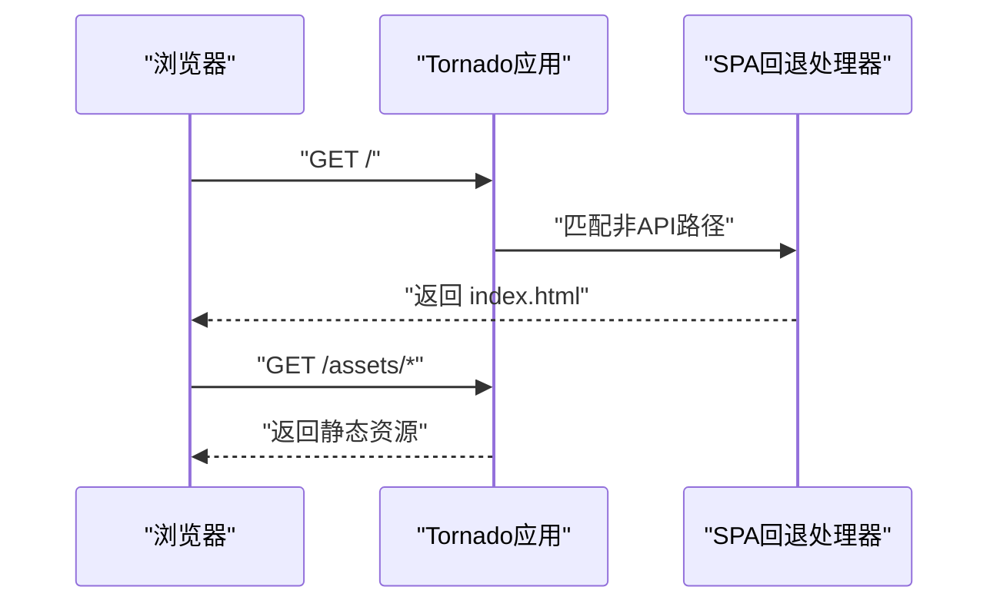
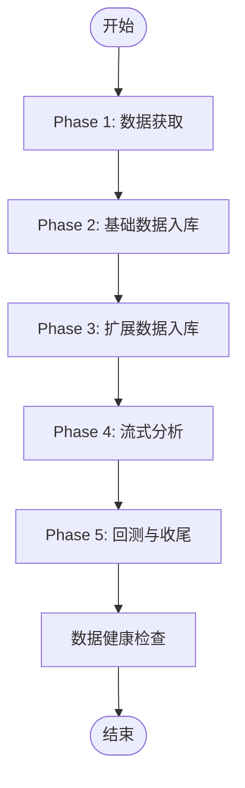
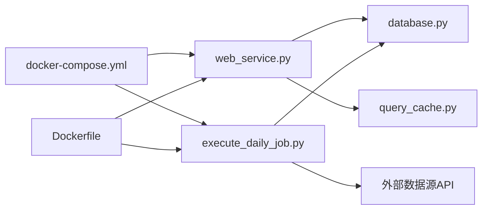

# 性能调优

<cite>
**本文引用的文件**   
- [README.md](file://README.md)
- [docker-compose.yml](file://docker/docker-compose.yml)
- [Dockerfile](file://docker/Dockerfile)
- [database.py](file://docker/stock/quantia/lib/database.py)
- [torndb.py](file://docker/stock/quantia/lib/torndb.py)
- [query_cache.py](file://docker/stock/quantia/lib/query_cache.py)
- [web_service.py](file://docker/stock/quantia/web/web_service.py)
- [execute_daily_job.py](file://docker/stock/quantia/job/execute_daily_job.py)
- [run_web.sh](file://docker/stock/quantia/bin/run_web.sh)
- [run_job.sh](file://docker/stock/quantia/bin/run_job.sh)
</cite>

## 目录
1. [简介](#简介)
2. [项目结构](#项目结构)
3. [核心组件](#核心组件)
4. [架构总览](#架构总览)
5. [详细组件分析](#详细组件分析)
6. [依赖关系分析](#依赖关系分析)
7. [性能考量](#性能考量)
8. [故障排查指南](#故障排查指南)
9. [结论](#结论)
10. [附录](#附录)

## 简介
本文件面向Quantia系统，提供系统级性能调优指南，聚焦以下方面：
- 性能瓶颈识别与定位
- 数据库查询优化与连接池调优
- 内存与CPU资源优化
- 缓存策略配置与命中率优化
- 并发处理与批处理优化
- Web服务性能调优
- 定时任务执行效率提升
- 前端资源优化
- 性能监控指标、基准测试与回归检测
- 容器资源限制、网络与磁盘I/O优化

## 项目结构
Quantia采用前后端分离与批处理/定时任务结合的架构：
- Web层：基于Tornado的轻量HTTP服务，提供SPA路由与REST API
- 数据层：MySQL数据库，通过SQLAlchemy与pymysql/torndb访问
- 批处理层：Python脚本驱动的每日数据采集、分析与回测流水线
- 缓存层：内存LRU查询缓存，针对Web API热点数据
- 容器化：Dockerfile与docker-compose统一打包与编排

图表来源
- [web_service.py](file://docker/stock/quantia/web/web_service.py#L53-L98)
- [database.py](file://docker/stock/quantia/lib/database.py#L58-L69)
- [query_cache.py](file://docker/stock/quantia/lib/query_cache.py#L27-L156)
- [execute_daily_job.py](file://docker/stock/quantia/job/execute_daily_job.py#L80-L179)

章节来源
- [README.md](file://README.md#L321-L326)
- [docker-compose.yml](file://docker/docker-compose.yml#L1-L87)
- [Dockerfile](file://docker/Dockerfile#L1-L153)

## 核心组件
- 数据库连接与连接池
  - 使用SQLAlchemy创建单例引擎，配置池大小、溢出、回收与预检
  - 提供DB-API连接与torndb封装，满足不同场景
- 查询缓存
  - LRU+TTL内存缓存，区分COUNT与DATA两类缓存，线程安全
- Web服务
  - Tornado应用，路由到各Handler，统一静态资源与SPA回退
- 批处理流水线
  - 分阶段执行：数据获取、基础入库、扩展入库、流式分析、回测与收尾
- 容器与编排
  - Dockerfile构建镜像，暴露端口，配置时区与依赖
  - docker-compose定义服务、环境变量、卷与健康检查

章节来源
- [database.py](file://docker/stock/quantia/lib/database.py#L58-L69)
- [database.py](file://docker/stock/quantia/lib/database.py#L78-L84)
- [torndb.py](file://docker/stock/quantia/lib/torndb.py#L47-L104)
- [query_cache.py](file://docker/stock/quantia/lib/query_cache.py#L27-L156)
- [web_service.py](file://docker/stock/quantia/web/web_service.py#L53-L98)
- [execute_daily_job.py](file://docker/stock/quantia/job/execute_daily_job.py#L80-L179)
- [docker-compose.yml](file://docker/docker-compose.yml#L41-L71)
- [Dockerfile](file://docker/Dockerfile#L17-L32)

## 架构总览
系统运行时序（关键路径）：
- Web请求进入Tornado路由，命中缓存或数据库查询
- 批处理脚本按阶段执行，API密集阶段集中在数据获取，后续分析阶段无API调用
- 定时任务由cron调度，Supervisor守护进程

图表来源
- [web_service.py](file://docker/stock/quantia/web/web_service.py#L59-L82)
- [query_cache.py](file://docker/stock/quantia/lib/query_cache.py#L51-L70)
- [database.py](file://docker/stock/quantia/lib/database.py#L58-L69)

## 详细组件分析

### 数据库连接与连接池调优
- 连接池参数
  - pool_size：并发连接上限
  - max_overflow：超出池大小后的溢出连接数
  - pool_recycle：连接回收周期（秒）
  - pool_pre_ping：连接复用前校验
  - pool_timeout：获取连接超时
- DB-API与torndb
  - 提供pymysql直连与轻量封装，适合小规模、低延迟场景
- 生产建议
  - 根据并发峰值与数据库承载能力调整pool_size与max_overflow
  - 合理设置pool_recycle与pre_ping，避免僵尸连接
  - 对长事务与批处理场景，考虑使用torndb的SSCursor迭代读取，降低内存峰值

图表来源
- [database.py](file://docker/stock/quantia/lib/database.py#L58-L69)
- [database.py](file://docker/stock/quantia/lib/database.py#L78-L84)
- [torndb.py](file://docker/stock/quantia/lib/torndb.py#L47-L104)

章节来源
- [database.py](file://docker/stock/quantia/lib/database.py#L58-L69)
- [database.py](file://docker/stock/quantia/lib/database.py#L78-L84)
- [torndb.py](file://docker/stock/quantia/lib/torndb.py#L47-L104)

### 查询缓存策略与命中率优化
- 缓存类型
  - 股票列表分页缓存：TTL 5分钟，最大512条
  - 策略筛选结果缓存：TTL 10分钟，最大128条
- 策略要点
  - LRU淘汰，TTL过期自动清理
  - key由SQL+参数拼接并哈希，保证唯一性
  - 线程安全，支持统计命中率
- 优化建议
  - 针对高频接口（如列表分页）适当增大max_size与TTL
  - 对写密集场景，提供按表名的失效策略（当前实现为全清，可按需扩展）

图表来源
- [query_cache.py](file://docker/stock/quantia/lib/query_cache.py#L51-L70)
- [query_cache.py](file://docker/stock/quantia/lib/query_cache.py#L124-L136)

章节来源
- [query_cache.py](file://docker/stock/quantia/lib/query_cache.py#L27-L156)

### Web服务性能调优
- 路由与中间件
  - SPA回退到index.html，避免404日志噪声
  - robots.txt屏蔽搜索引擎爬虫，减少无效请求
- 静态资源
  - 前端构建产物位于web/static/assets，由Tornado StaticFileHandler提供
- 启动与端口
  - 默认监听9988端口，支持Supervisor守护
- 优化建议
  - 开启Gzip/压缩（可在Nginx/Traefik层配置）
  - 合理设置静态资源缓存头
  - 对高频API接口启用查询缓存

图表来源
- [web_service.py](file://docker/stock/quantia/web/web_service.py#L102-L125)
- [web_service.py](file://docker/stock/quantia/web/web_service.py#L84-L87)

章节来源
- [web_service.py](file://docker/stock/quantia/web/web_service.py#L53-L98)
- [web_service.py](file://docker/stock/quantia/web/web_service.py#L102-L125)
- [run_web.sh](file://docker/stock/quantia/bin/run_web.sh#L1-L19)

### 批处理流水线与并发优化
- 阶段划分
  - Phase 1：数据获取（API密集，集中更新缓存）
  - Phase 2：基础数据入库（少量API）
  - Phase 3：扩展数据入库（独立API，I/O密集）
  - Phase 4：流式分析（低内存模式，无API）
  - Phase 5：回测与收尾（重新加载缓存，无API）
- 并发与内存
  - 采用单例共享资源与低内存模式，峰值内存显著降低
  - 支持跳过已完成的分析/回测阶段，避免重复执行
- 优化建议
  - 对I/O密集阶段（如扩展数据入库）可并行化（当前为顺序执行）
  - 对分析阶段，按股票分片并行处理，结合队列与限速

图表来源
- [execute_daily_job.py](file://docker/stock/quantia/job/execute_daily_job.py#L80-L179)

章节来源
- [execute_daily_job.py](file://docker/stock/quantia/job/execute_daily_job.py#L80-L179)

### 定时任务与容器编排
- 定时任务
  - crontab配置：工作日每30分钟执行hourly，17:30执行workdayly，周三/周六执行monthly
- 容器编排
  - docker-compose定义服务、环境变量、卷与健康检查
  - Dockerfile设置时区、国内镜像、TA-Lib与Python依赖
- 优化建议
  - 根据业务峰谷调整crontab频率
  - 为数据库与应用分别设置资源限制与重启策略

章节来源
- [Dockerfile](file://docker/Dockerfile#L134-L147)
- [docker-compose.yml](file://docker/docker-compose.yml#L41-L71)

## 依赖关系分析
- Web服务依赖数据库连接池与查询缓存
- 批处理脚本依赖数据库与外部API
- 容器层提供统一环境与资源隔离

图表来源
- [web_service.py](file://docker/stock/quantia/web/web_service.py#L53-L98)
- [database.py](file://docker/stock/quantia/lib/database.py#L58-L69)
- [query_cache.py](file://docker/stock/quantia/lib/query_cache.py#L27-L156)
- [execute_daily_job.py](file://docker/stock/quantia/job/execute_daily_job.py#L80-L179)
- [docker-compose.yml](file://docker/docker-compose.yml#L1-L87)
- [Dockerfile](file://docker/Dockerfile#L1-L153)

## 性能考量

### 性能瓶颈识别
- 数据库瓶颈
  - 连接池饱和、慢查询、锁等待
  - 建议：开启慢查询日志、分析执行计划、优化索引
- 缓存命中率
  - 低命中率导致数据库压力增大
  - 建议：扩大缓存容量、延长TTL、优化key生成
- CPU与内存
  - 批处理阶段内存峰值、Web并发响应延迟
  - 建议：分片并行、流式处理、合理GC
- 网络与I/O
  - 外部API限速、磁盘I/O瓶颈
  - 建议：代理轮换、缓存策略、SSD存储

章节来源
- [README.md](file://README.md#L308-L311)
- [query_cache.py](file://docker/stock/quantia/lib/query_cache.py#L124-L136)
- [database.py](file://docker/stock/quantia/lib/database.py#L58-L69)

### 数据库查询优化
- 连接池参数调优
  - pool_size：根据并发峰值与数据库承载能力设置
  - max_overflow：避免阻塞等待
  - pool_recycle：防止连接老化
  - pool_pre_ping：提升连接可用性
- SQL层面
  - 为高频查询建立合适索引
  - 避免SELECT *，精确字段
  - 使用LIMIT与分页
- 事务与批处理
  - 合理拆分事务，减少锁持有时间
  - 使用批量插入/更新

章节来源
- [database.py](file://docker/stock/quantia/lib/database.py#L58-L69)
- [database.py](file://docker/stock/quantia/lib/database.py#L107-L138)

### 内存与CPU优化
- 低内存模式
  - 流式分析阶段按需读取缓存，峰值内存显著降低
- 并发与分片
  - 对I/O密集阶段可并行化
  - 对CPU密集型指标计算，考虑多进程/分片
- GC与资源释放
  - 批处理完成后主动释放单例与触发GC

章节来源
- [execute_daily_job.py](file://docker/stock/quantia/job/execute_daily_job.py#L132-L158)

### 缓存策略配置
- 类型与TTL
  - 列表分页：TTL 5分钟，容量512
  - 筛选结果：TTL 10分钟，容量128
- 命中率监控
  - 通过stats接口获取命中率，动态调整容量与TTL
- 失效策略
  - 数据更新后清空相关缓存，避免脏读

章节来源
- [query_cache.py](file://docker/stock/quantia/lib/query_cache.py#L147-L156)
- [query_cache.py](file://docker/stock/quantia/lib/query_cache.py#L124-L136)

### 并发处理优化
- Web层
  - Tornado异步I/O模型，适合高并发短连接
- 批处理层
  - 当前顺序执行，可引入队列与限速，避免外部API限流
- 数据层
  - 合理设置连接池，避免争用

章节来源
- [web_service.py](file://docker/stock/quantia/web/web_service.py#L53-L98)
- [execute_daily_job.py](file://docker/stock/quantia/job/execute_daily_job.py#L109-L112)

### Web服务性能调优
- 路由与静态资源
  - SPA回退与静态资源分离，减少不必要的后端处理
- 压缩与缓存
  - 在反向代理层启用Gzip与静态缓存
- 日志与监控
  - 减少不必要的日志级别，避免I/O瓶颈

章节来源
- [web_service.py](file://docker/stock/quantia/web/web_service.py#L53-L98)
- [run_web.sh](file://docker/stock/quantia/bin/run_web.sh#L1-L19)

### 定时任务执行效率提升
- 调度策略
  - 根据数据发布节奏调整crontab频率
- 跳过策略
  - 已完成阶段跳过，避免重复执行
- 健康检查
  - 任务完成后进行数据健康检查，快速定位问题

章节来源
- [Dockerfile](file://docker/Dockerfile#L134-L147)
- [execute_daily_job.py](file://docker/stock/quantia/job/execute_daily_job.py#L137-L179)

### 前端资源优化
- 构建产物
  - 静态资源位于web/static/assets，由Tornado提供
- 建议
  - 在反向代理层启用Gzip/HTTP缓存
  - 使用CDN分发静态资源

章节来源
- [web_service.py](file://docker/stock/quantia/web/web_service.py#L84-L87)

### 性能监控指标、基准测试与回归检测
- 监控指标
  - 数据库：连接数、慢查询、锁等待、缓冲池命中率
  - 应用：请求延迟、错误率、缓存命中率、内存使用
  - 容器：CPU使用、内存使用、网络I/O、磁盘I/O
- 基准测试
  - Web：使用wrk/ab对关键API进行并发压测
  - 数据库：使用sysbench/tpcc模拟负载
- 回归检测
  - 将关键指标纳入CI/CD，发现回归及时告警

[本节为通用指导，无需列出章节来源]

### 容器资源限制、网络与磁盘I/O优化
- 资源限制
  - docker-compose中为服务设置memory限制与CPU份额
- 网络
  - 使用代理文件与环境变量控制数据源访问
- 磁盘I/O
  - 将日志与缓存映射到高性能存储卷
  - 合理设置缓存过期策略，避免无限增长

章节来源
- [docker-compose.yml](file://docker/docker-compose.yml#L54-L60)
- [Dockerfile](file://docker/Dockerfile#L34-L52)

## 故障排查指南
- Web服务
  - 检查日志与健康检查，确认端口与静态资源路径
- 数据库
  - 检查连接池参数与慢查询，确认索引与事务
- 缓存
  - 关注命中率与TTL，必要时扩大容量或缩短TTL
- 批处理
  - 关注阶段跳过逻辑与健康检查输出，定位缺失数据

章节来源
- [web_service.py](file://docker/stock/quantia/web/web_service.py#L127-L138)
- [database.py](file://docker/stock/quantia/lib/database.py#L196-L231)
- [query_cache.py](file://docker/stock/quantia/lib/query_cache.py#L114-L121)
- [execute_daily_job.py](file://docker/stock/quantia/job/execute_daily_job.py#L182-L226)

## 结论
通过合理的数据库连接池配置、查询缓存策略、批处理流水线与容器编排，Quantia系统可在保证数据质量的同时，显著提升整体性能与稳定性。建议持续监控关键指标，定期进行基准测试与回归检测，结合业务峰谷动态调整资源配置与调度策略。

## 附录
- 快速启动
  - Web服务：通过run_web.sh启动
  - 批处理：通过run_job.sh执行
- 环境变量
  - 数据库与数据源相关参数在Dockerfile与docker-compose中定义

章节来源
- [run_web.sh](file://docker/stock/quantia/bin/run_web.sh#L1-L19)
- [run_job.sh](file://docker/stock/quantia/bin/run_job.sh#L1-L16)
- [docker-compose.yml](file://docker/docker-compose.yml#L41-L53)
- [Dockerfile](file://docker/Dockerfile#L17-L30)
