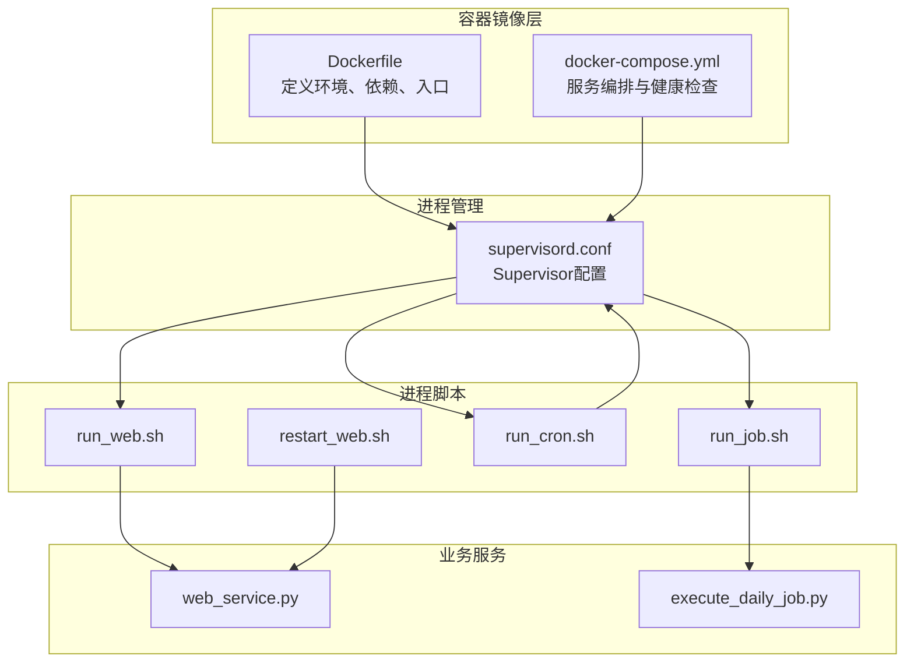
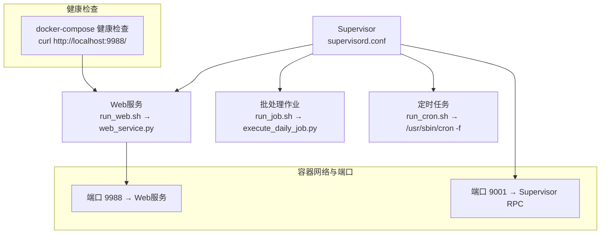
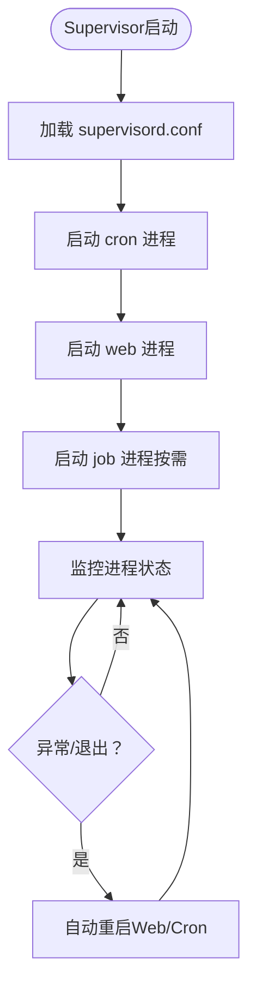
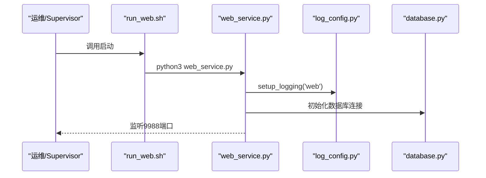
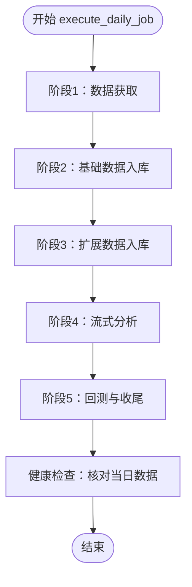
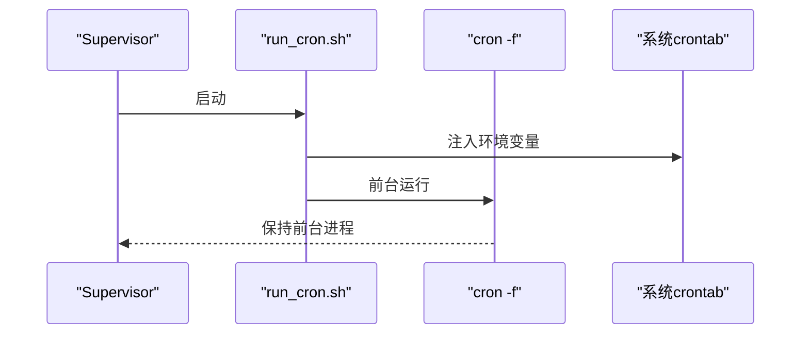
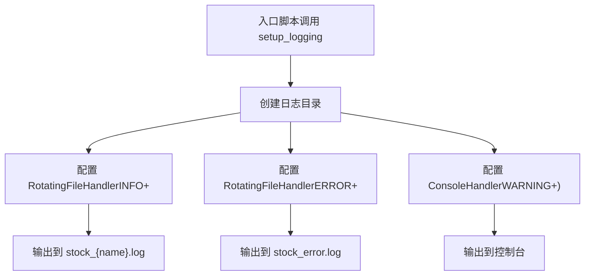
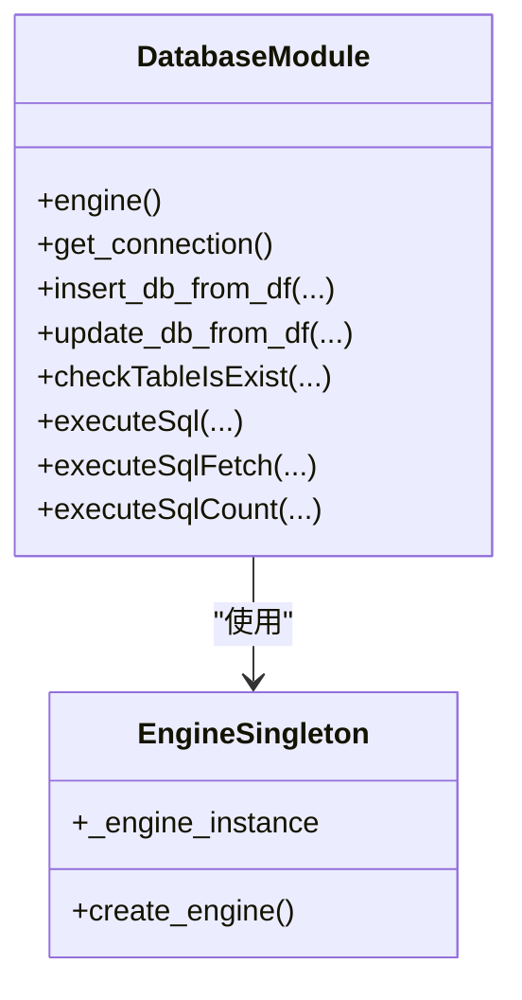
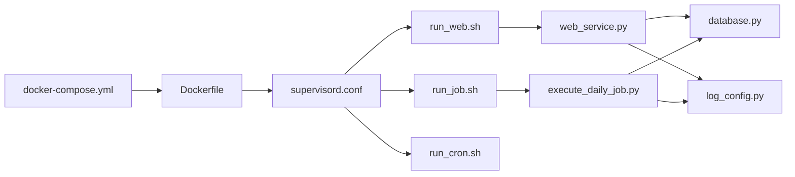

# 服务编排

<cite>
**本文引用的文件**
- [supervisord.conf](file://supervisor/supervisord.conf)
- [docker-compose.yml](file://docker/docker-compose.yml)
- [Dockerfile](file://docker/Dockerfile)
- [build.sh](file://docker/build.sh)
- [run_web.sh](file://docker/stock/quantia/bin/run_web.sh)
- [run_job.sh](file://docker/stock/quantia/bin/run_job.sh)
- [run_cron.sh](file://docker/stock/quantia/bin/run_cron.sh)
- [restart_web.sh](file://docker/stock/quantia/bin/restart_web.sh)
- [web_service.py](file://docker/stock/quantia/web/web_service.py)
- [execute_daily_job.py](file://docker/stock/quantia/job/execute_daily_job.py)
- [log_config.py](file://docker/stock/quantia/lib/log_config.py)
- [database.py](file://docker/stock/quantia/lib/database.py)
- [run_template.py](file://docker/stock/quantia/lib/run_template.py)
</cite>

## 目录
1. [简介](#简介)
2. [项目结构](#项目结构)
3. [核心组件](#核心组件)
4. [架构总览](#架构总览)
5. [详细组件分析](#详细组件分析)
6. [依赖分析](#依赖分析)
7. [性能考虑](#性能考虑)
8. [故障排查指南](#故障排查指南)
9. [结论](#结论)
10. [附录](#附录)

## 简介
本文件面向Quantia系统的运维与开发团队，提供一套完整的“服务编排”文档，聚焦Supervisor进程管理、多进程协调、服务生命周期、Web服务、定时任务与批处理作业的启动顺序与依赖关系，以及进程监控、自动重启、日志聚合、状态检查、调试与资源限制等运维实践。文档基于仓库中的实际配置与脚本，结合流程图与序列图，帮助读者快速理解并高效排障。

## 项目结构
Quantia采用Docker容器化部署，使用Supervisor统一管理多个子进程（Web服务、定时任务、批处理作业）。Dockerfile定义了基础镜像、环境变量、系统依赖与入口命令；docker-compose负责服务编排与健康检查；Supervisor配置文件定义各子进程的启动命令、优先级与自动重启策略；配套的Shell脚本封装了Python服务的启动与环境变量注入。

**图表来源**
- [Dockerfile](file://docker/Dockerfile#L1-L153)
- [docker-compose.yml](file://docker/docker-compose.yml#L1-L87)
- [supervisord.conf](file://supervisor/supervisord.conf#L1-L42)
- [run_web.sh](file://docker/stock/quantia/bin/run_web.sh#L1-L19)
- [run_job.sh](file://docker/stock/quantia/bin/run_job.sh#L1-L16)
- [run_cron.sh](file://docker/stock/quantia/bin/run_cron.sh#L1-L19)
- [restart_web.sh](file://docker/stock/quantia/bin/restart_web.sh#L1-L28)
- [web_service.py](file://docker/stock/quantia/web/web_service.py#L1-L143)
- [execute_daily_job.py](file://docker/stock/quantia/job/execute_daily_job.py#L1-L231)

**章节来源**
- [Dockerfile](file://docker/Dockerfile#L1-L153)
- [docker-compose.yml](file://docker/docker-compose.yml#L1-L87)
- [supervisord.conf](file://supervisor/supervisord.conf#L1-L42)

## 核心组件
- Supervisor进程管理：统一启动Web服务、定时任务与批处理作业，控制优先级与自动重启。
- Web服务：基于Tornado的HTTP服务，提供SPA与API接口。
- 批处理作业：每日数据采集、入库、分析、回测与收尾的流水线。
- 定时任务：基于cron的周期性调度，配合Supervisor管理。
- 日志系统：统一日志配置与轮转，错误日志集中输出。
- 数据库连接：通过SQLAlchemy与PyMySQL提供连接池与事务能力。

**章节来源**
- [supervisord.conf](file://supervisor/supervisord.conf#L25-L42)
- [web_service.py](file://docker/stock/quantia/web/web_service.py#L53-L143)
- [execute_daily_job.py](file://docker/stock/quantia/job/execute_daily_job.py#L80-L231)
- [log_config.py](file://docker/stock/quantia/lib/log_config.py#L47-L104)
- [database.py](file://docker/stock/quantia/lib/database.py#L58-L232)

## 架构总览
下图展示了容器内服务编排的整体交互：Supervisor作为根进程，分别启动Web服务、批处理作业与cron服务；Web服务监听9988端口；批处理作业在指定时间窗口内执行；cron服务按工作日/小时/月度规则触发脚本；docker-compose负责容器健康检查与端口映射。

**图表来源**
- [supervisord.conf](file://supervisor/supervisord.conf#L25-L42)
- [run_web.sh](file://docker/stock/quantia/bin/run_web.sh#L1-L19)
- [web_service.py](file://docker/stock/quantia/web/web_service.py#L127-L143)
- [run_job.sh](file://docker/stock/quantia/bin/run_job.sh#L1-L16)
- [execute_daily_job.py](file://docker/stock/quantia/job/execute_daily_job.py#L80-L231)
- [run_cron.sh](file://docker/stock/quantia/bin/run_cron.sh#L1-L19)
- [docker-compose.yml](file://docker/docker-compose.yml#L66-L71)

## 详细组件分析

### Supervisor进程管理与生命周期
- 进程定义
  - run_web：Web服务，自动重启，停止时按组发送信号。
  - run_job：批处理作业，手动触发，不自动重启。
  - run_cron：cron守护进程，自动重启，优先级最高。
- 生命周期
  - 启动顺序：由Supervisor依据priority排序启动，cron优先。
  - 停止顺序：stopasgroup与killasgroup确保优雅终止。
  - 自动重启：Web与cron开启自动重启，作业脚本自身不自动重启。
- 通信与控制
  - Unix Socket与HTTP接口均可用于supervisorctl控制。
  - 通过RPC接口可查看状态、启动/停止进程。

**图表来源**
- [supervisord.conf](file://supervisor/supervisord.conf#L1-L42)

**章节来源**
- [supervisord.conf](file://supervisor/supervisord.conf#L25-L42)

### Web服务启动与依赖
- 启动脚本：设置语言环境、PYTHONPATH，启动web_service.py。
- Web服务：Tornado应用，注册API与SPA路由，连接数据库。
- 依赖关系：Web服务依赖数据库连接配置与日志配置；日志通过统一配置模块初始化。

**图表来源**
- [run_web.sh](file://docker/stock/quantia/bin/run_web.sh#L1-L19)
- [web_service.py](file://docker/stock/quantia/web/web_service.py#L16-L40)
- [log_config.py](file://docker/stock/quantia/lib/log_config.py#L47-L104)
- [database.py](file://docker/stock/quantia/lib/database.py#L58-L70)

**章节来源**
- [run_web.sh](file://docker/stock/quantia/bin/run_web.sh#L1-L19)
- [web_service.py](file://docker/stock/quantia/web/web_service.py#L53-L143)
- [log_config.py](file://docker/stock/quantia/lib/log_config.py#L47-L104)
- [database.py](file://docker/stock/quantia/lib/database.py#L45-L51)

### 批处理作业流水线与阶段划分
- 触发方式：通过run_job.sh手动或Supervisor控制启动。
- 流水线阶段
  - 阶段1：数据获取（API密集，写入本地缓存）
  - 阶段2：基础数据入库（少量API，读取单例）
  - 阶段3：扩展数据获取与入库（I/O密集）
  - 阶段4：流式分析（低内存模式，读取磁盘缓存）
  - 阶段5：回测与收尾（可跳过，若其他节点已完成）
- 健康检查：流水线结束对核心表进行当日数据检查，便于排查“页面无数据”。

**图表来源**
- [execute_daily_job.py](file://docker/stock/quantia/job/execute_daily_job.py#L80-L179)

**章节来源**
- [run_job.sh](file://docker/stock/quantia/bin/run_job.sh#L1-L16)
- [execute_daily_job.py](file://docker/stock/quantia/job/execute_daily_job.py#L80-L231)

### 定时任务与cron集成
- cron配置：在Dockerfile中写入crontab，按工作日/小时/月度规则调度。
- 环境注入：run_cron.sh将环境变量写入/etc/environment供cron任务使用。
- 运行模式：cron以前台模式运行，由Supervisor接管生命周期。

**图表来源**
- [run_cron.sh](file://docker/stock/quantia/bin/run_cron.sh#L1-L19)
- [Dockerfile](file://docker/Dockerfile#L134-L147)

**章节来源**
- [run_cron.sh](file://docker/stock/quantia/bin/run_cron.sh#L1-L19)
- [Dockerfile](file://docker/Dockerfile#L134-L147)

### 日志聚合与轮转
- 统一日志配置：setup_logging统一输出到文件、错误汇总文件与控制台。
- 轮转策略：按大小轮转，避免日志无限增长。
- 多进程日志：不同脚本通过统一模块输出，便于聚合与检索。

**图表来源**
- [log_config.py](file://docker/stock/quantia/lib/log_config.py#L47-L104)

**章节来源**
- [log_config.py](file://docker/stock/quantia/lib/log_config.py#L47-L104)

### 数据库连接与资源限制
- 连接池：SQLAlchemy引擎单例，限制最大连接数与超时。
- 连接参数：超时、预检、回收策略，适配2核2G服务器。
- 环境变量：通过Docker环境变量注入数据库连接信息。

**图表来源**
- [database.py](file://docker/stock/quantia/lib/database.py#L58-L70)
- [database.py](file://docker/stock/quantia/lib/database.py#L45-L51)

**章节来源**
- [database.py](file://docker/stock/quantia/lib/database.py#L45-L70)

## 依赖分析
- 容器编排依赖
  - docker-compose依赖Dockerfile构建镜像，暴露端口并定义健康检查。
  - Supervisor依赖各run_*脚本与Python业务模块。
- 进程间依赖
  - Web服务依赖数据库连接与日志配置。
  - 批处理作业依赖数据缓存与数据库写入。
  - cron依赖Supervisor保持前台运行。
- 外部依赖
  - MySQL数据库健康检查依赖curl。
  - Python依赖通过pip安装，Supervisor与数据库驱动等。

**图表来源**
- [docker-compose.yml](file://docker/docker-compose.yml#L1-L87)
- [Dockerfile](file://docker/Dockerfile#L1-L153)
- [supervisord.conf](file://supervisor/supervisord.conf#L1-L42)
- [run_web.sh](file://docker/stock/quantia/bin/run_web.sh#L1-L19)
- [run_job.sh](file://docker/stock/quantia/bin/run_job.sh#L1-L16)
- [run_cron.sh](file://docker/stock/quantia/bin/run_cron.sh#L1-L19)
- [web_service.py](file://docker/stock/quantia/web/web_service.py#L1-L143)
- [execute_daily_job.py](file://docker/stock/quantia/job/execute_daily_job.py#L1-L231)
- [database.py](file://docker/stock/quantia/lib/database.py#L1-L232)
- [log_config.py](file://docker/stock/quantia/lib/log_config.py#L1-L104)

**章节来源**
- [docker-compose.yml](file://docker/docker-compose.yml#L1-L87)
- [Dockerfile](file://docker/Dockerfile#L1-L153)
- [supervisord.conf](file://supervisor/supervisord.conf#L1-L42)

## 性能考虑
- 连接池与超时：数据库连接池限制最大并发，避免资源耗尽。
- 内存优化：批处理作业采用流式分析与磁盘缓存，峰值内存显著降低。
- 并发模板：run_template提供批量日期作业的线程池并发框架，减少重复代码。
- 健康检查：容器与Web服务健康检查，保障服务可用性。

**章节来源**
- [database.py](file://docker/stock/quantia/lib/database.py#L58-L70)
- [execute_daily_job.py](file://docker/stock/quantia/job/execute_daily_job.py#L132-L147)
- [run_template.py](file://docker/stock/quantia/lib/run_template.py#L18-L95)
- [docker-compose.yml](file://docker/docker-compose.yml#L66-L71)

## 故障排查指南
- 进程状态检查
  - 使用supervisorctl查看进程状态与日志。
  - 关注run_web/run_job/run_cron的启动与退出码。
- Web服务不可用
  - 检查9988端口映射与健康检查。
  - 查看stock_web.log与stock_error.log定位异常。
- 批处理作业中断
  - 查看stock_execute.log与stock_error.log。
  - 关注阶段划分与健康检查输出，确认数据表是否写入。
- 定时任务未执行
  - 确认cron是否以前台运行且Supervisor未退出。
  - 检查环境变量注入与crontab规则。
- 数据库连接失败
  - 核对Docker环境变量与database.py连接参数。
  - 使用健康检查验证数据库可达性。

**章节来源**
- [supervisord.conf](file://supervisor/supervisord.conf#L22-L24)
- [log_config.py](file://docker/stock/quantia/lib/log_config.py#L74-L94)
- [execute_daily_job.py](file://docker/stock/quantia/job/execute_daily_job.py#L177-L226)
- [run_cron.sh](file://docker/stock/quantia/bin/run_cron.sh#L14-L19)
- [database.py](file://docker/stock/quantia/lib/database.py#L45-L51)
- [docker-compose.yml](file://docker/docker-compose.yml#L23-L29)

## 结论
Quantia通过Docker与Supervisor实现了清晰的服务编排：Web服务、批处理作业与定时任务在统一的进程管理下有序运行，日志与数据库连接具备良好的可观测性与稳定性。遵循本文提供的启动顺序、依赖关系与运维建议，可有效提升系统的可靠性与可维护性。

## 附录
- 快速重启Web服务
  - 使用restart_web.sh脚本，先杀掉旧进程，再后台启动新进程并输出日志文件路径。
- 构建与发布
  - build.sh负责复制项目文件、清理缓存、构建镜像与可选推送至远程仓库。

**章节来源**
- [restart_web.sh](file://docker/stock/quantia/bin/restart_web.sh#L1-L28)
- [build.sh](file://docker/build.sh#L64-L99)
