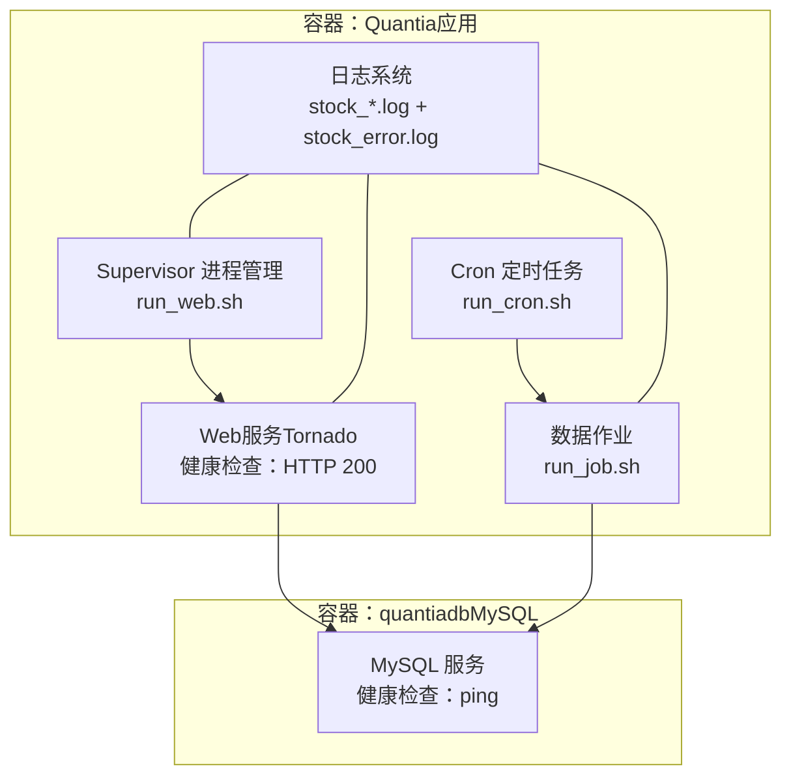
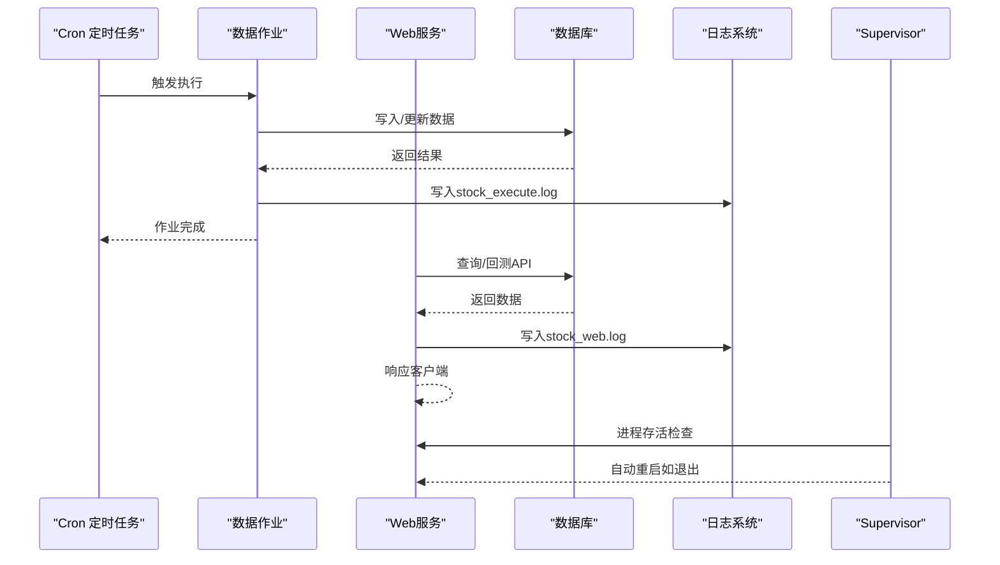
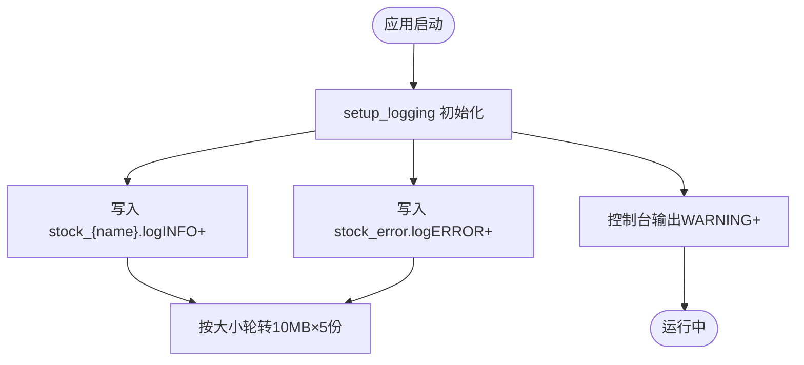
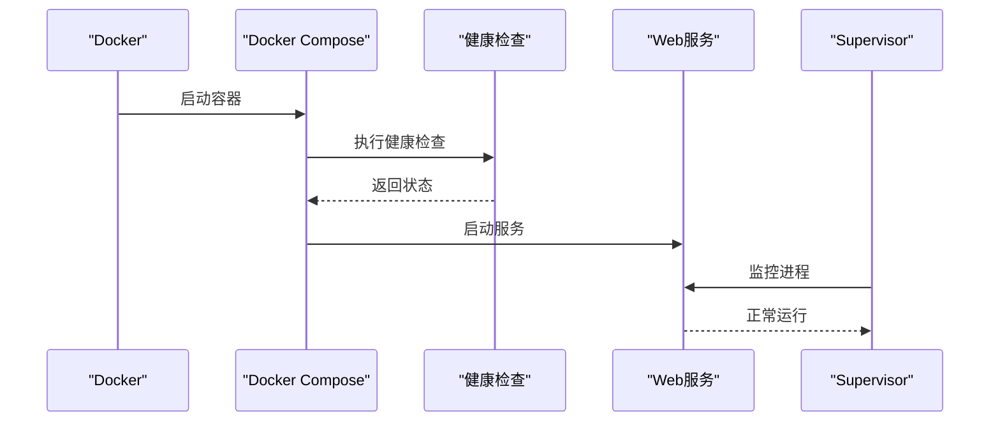
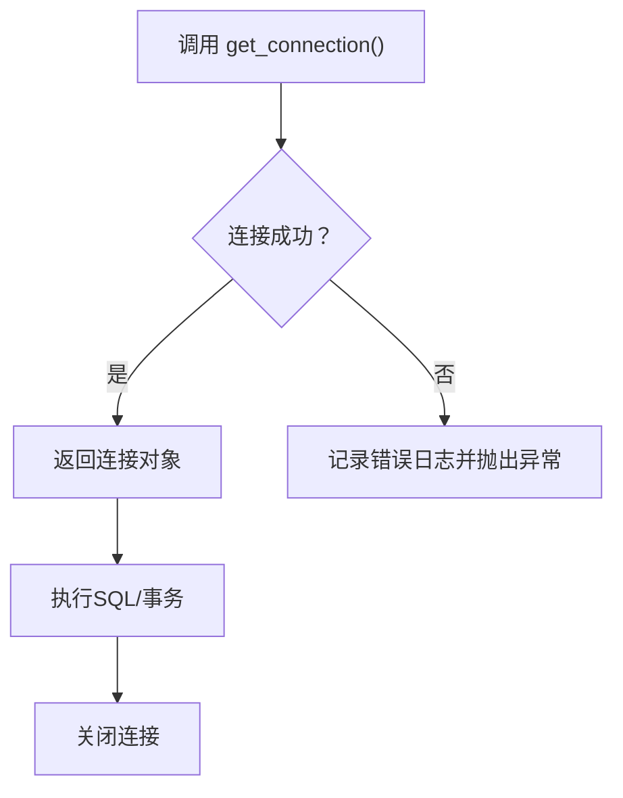
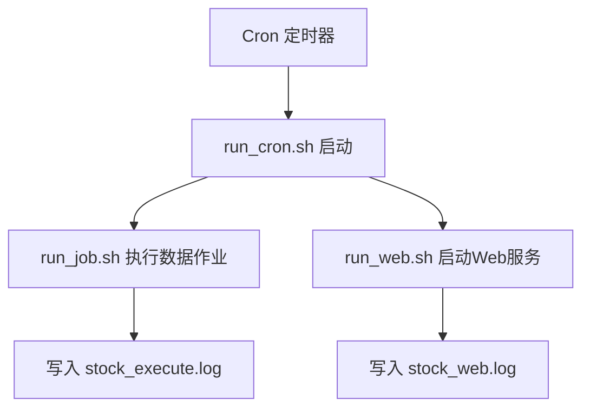
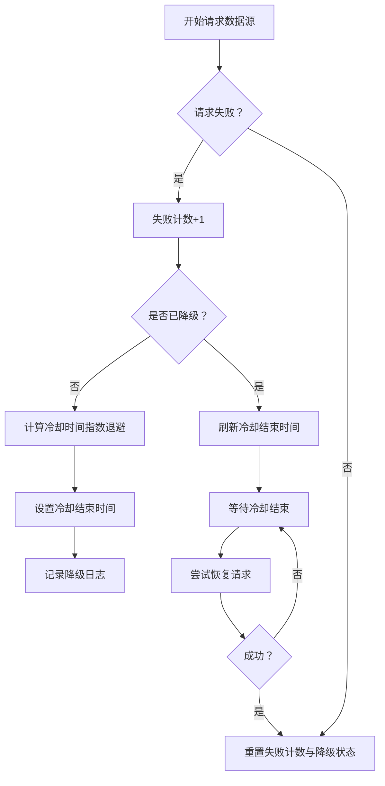
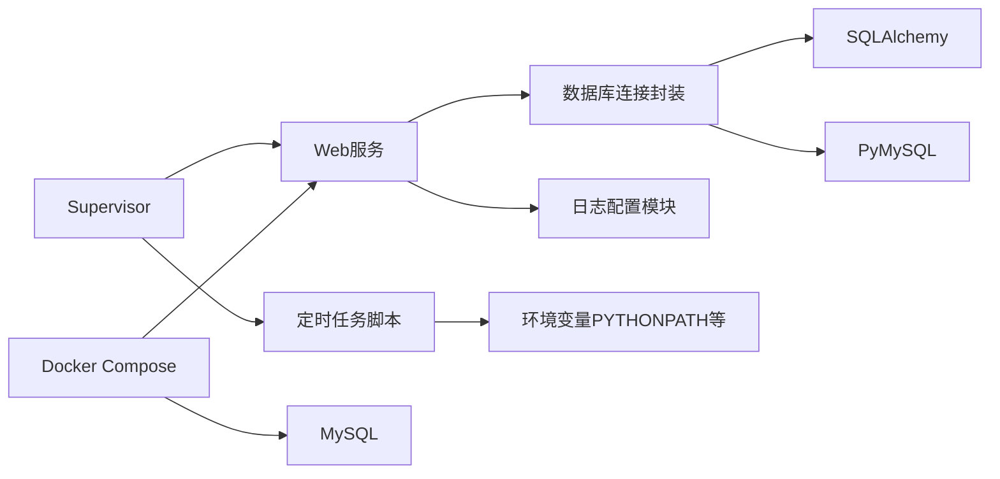

# 监控告警

<cite>
**本文引用的文件**
- [日志配置模块](file://docker/stock/quantia/lib/log_config.py)
- [Web服务入口](file://docker/stock/quantia/web/web_service.py)
- [数据库连接封装](file://docker/stock/quantia/lib/database.py)
- [Supervisor进程管理配置](file://docker/stock/supervisor/supervisord.conf)
- [Docker Compose编排](file://docker/docker-compose.yml)
- [Dockerfile健康检查与定时任务](file://docker/Dockerfile)
- [定时任务说明](file://cron/README.md)
- [定时任务：每小时执行](file://docker/stock/quantia/bin/run_cron.sh)
- [定时任务：数据作业执行](file://docker/stock/quantia/bin/run_job.sh)
- [定时任务：Web服务启动](file://docker/stock/quantia/bin/run_web.sh)
- [数据获取与健康度降级逻辑](file://quantia/core/stockfetch.py)
- [测试：数据库连接超时与日志脱敏](file://tests/test_bugfixes.py)
</cite>

## 目录
1. [简介](#简介)
2. [项目结构](#项目结构)
3. [核心组件](#核心组件)
4. [架构总览](#架构总览)
5. [详细组件分析](#详细组件分析)
6. [依赖分析](#依赖分析)
7. [性能考量](#性能考量)
8. [故障排查指南](#故障排查指南)
9. [结论](#结论)
10. [附录](#附录)

## 简介
本文件面向Quantia系统的监控与告警，覆盖系统监控指标定义、日志收集与轮转、性能监控方案、Web服务健康检查、数据库连接监控、定时任务执行监控、日志级别与错误追踪机制，以及监控仪表板与告警规则建议。目标是帮助运维与开发团队建立稳定、可观测、可预警的生产环境。

## 项目结构
Quantia采用容器化部署，包含数据库服务、Web应用与定时任务三大部分。日志统一由日志配置模块集中管理，Web服务通过Tornado提供API与前端SPA，数据库连接通过SQLAlchemy与PyMySQL封装，定时任务通过Cron与Supervisor协同管理。

图表来源
- [Docker Compose编排](file://docker/docker-compose.yml#L1-L87)
- [Dockerfile健康检查与定时任务](file://docker/Dockerfile#L120-L153)
- [Supervisor进程管理配置](file://docker/stock/supervisor/supervisord.conf#L25-L42)
- [定时任务：每小时执行](file://docker/stock/quantia/bin/run_cron.sh#L1-L19)
- [定时任务：数据作业执行](file://docker/stock/quantia/bin/run_job.sh#L1-L16)
- [定时任务：Web服务启动](file://docker/stock/quantia/bin/run_web.sh#L1-L19)
- [Web服务入口](file://docker/stock/quantia/web/web_service.py#L127-L143)
- [日志配置模块](file://docker/stock/quantia/lib/log_config.py#L47-L104)

章节来源
- [Docker Compose编排](file://docker/docker-compose.yml#L1-L87)
- [Dockerfile健康检查与定时任务](file://docker/Dockerfile#L120-L153)

## 核心组件
- 日志系统：统一格式、大小轮转、错误汇总、控制台输出，便于集中检索与问题定位。
- Web服务：基于Tornado，提供REST API与前端SPA，内置健康检查。
- 数据库连接：SQLAlchemy引擎与PyMySQL连接封装，带超时与连接池配置。
- 定时任务：Cron调度与Supervisor进程管理，支持自动重启与优先级控制。
- 数据源健康：自动降级与冷却、指数退避重试、聚合日志，提升稳定性。

章节来源
- [日志配置模块](file://docker/stock/quantia/lib/log_config.py#L47-L104)
- [Web服务入口](file://docker/stock/quantia/web/web_service.py#L127-L143)
- [数据库连接封装](file://docker/stock/quantia/lib/database.py#L58-L84)
- [Supervisor进程管理配置](file://docker/stock/supervisor/supervisord.conf#L25-L42)
- [数据获取与健康度降级逻辑](file://quantia/core/stockfetch.py#L76-L181)

## 架构总览
下图展示监控视角下的系统交互：Web服务与定时任务均写入统一日志；数据库通过健康检查与连接池保障；Supervisor负责进程生命周期；Docker Compose编排服务并暴露健康检查端点。

图表来源
- [Dockerfile健康检查与定时任务](file://docker/Dockerfile#L149-L153)
- [Docker Compose编排](file://docker/docker-compose.yml#L66-L71)
- [定时任务：数据作业执行](file://docker/stock/quantia/bin/run_job.sh#L15-L16)
- [定时任务：Web服务启动](file://docker/stock/quantia/bin/run_web.sh#L15-L16)
- [Web服务入口](file://docker/stock/quantia/web/web_service.py#L127-L143)
- [数据库连接封装](file://docker/stock/quantia/lib/database.py#L78-L84)
- [日志配置模块](file://docker/stock/quantia/lib/log_config.py#L74-L94)

## 详细组件分析

### 日志系统与轮转策略
- 统一日志格式与时间戳，INFO及以上写入对应模块日志文件，ERROR及以上写入全局错误日志，控制台输出WARNING及以上以减少刷屏。
- 日志文件按大小轮转，单文件上限与备份数量固定，避免磁盘膨胀。
- 建议：结合集中式日志（如Fluent Bit/Logstash）采集容器日志目录，实现统一检索与告警。

图表来源
- [日志配置模块](file://docker/stock/quantia/lib/log_config.py#L47-L104)

章节来源
- [日志配置模块](file://docker/stock/quantia/lib/log_config.py#L47-L104)

### Web服务健康检查与进程管理
- Web服务通过Tornado启动，监听端口并记录启动日志；Docker Compose与Dockerfile分别提供HTTP健康检查命令。
- Supervisor管理Web与定时任务进程，具备自动重启、优先级与停止信号处理能力。

图表来源
- [Docker Compose编排](file://docker/docker-compose.yml#L66-L71)
- [Dockerfile健康检查与定时任务](file://docker/Dockerfile#L149-L153)
- [Web服务入口](file://docker/stock/quantia/web/web_service.py#L127-L143)
- [Supervisor进程管理配置](file://docker/stock/supervisor/supervisord.conf#L31-L36)

章节来源
- [Web服务入口](file://docker/stock/quantia/web/web_service.py#L127-L143)
- [Docker Compose编排](file://docker/docker-compose.yml#L66-L71)
- [Dockerfile健康检查与定时任务](file://docker/Dockerfile#L149-L153)
- [Supervisor进程管理配置](file://docker/stock/supervisor/supervisord.conf#L25-L42)

### 数据库连接监控与超时策略
- 提供SQLAlchemy引擎与PyMySQL连接封装，设置连接池大小、溢出、回收与预检，以及连接/读/写超时。
- 关键异常路径均记录错误日志并抛出，便于上层捕获与告警。

图表来源
- [数据库连接封装](file://docker/stock/quantia/lib/database.py#L78-L84)
- [数据库连接封装](file://docker/stock/quantia/lib/database.py#L58-L69)

章节来源
- [数据库连接封装](file://docker/stock/quantia/lib/database.py#L45-L84)
- [数据库连接封装](file://docker/stock/quantia/lib/database.py#L107-L138)

### 定时任务执行监控
- Cron通过Dockerfile配置周期性任务；Supervisor管理run_cron.sh、run_job.sh、run_web.sh三个进程。
- 建议：在Supervisor中为每个程序配置stderr/stdout日志文件，结合日志轮转与告警规则。

图表来源
- [Dockerfile健康检查与定时任务](file://docker/Dockerfile#L134-L147)
- [定时任务：每小时执行](file://docker/stock/quantia/bin/run_cron.sh#L1-L19)
- [定时任务：数据作业执行](file://docker/stock/quantia/bin/run_job.sh#L1-L16)
- [定时任务：Web服务启动](file://docker/stock/quantia/bin/run_web.sh#L1-L19)
- [Supervisor进程管理配置](file://docker/stock/supervisor/supervisord.conf#L25-L42)

章节来源
- [定时任务说明](file://cron/README.md#L76-L133)
- [定时任务：每小时执行](file://docker/stock/quantia/bin/run_cron.sh#L1-L19)
- [定时任务：数据作业执行](file://docker/stock/quantia/bin/run_job.sh#L1-L16)
- [定时任务：Web服务启动](file://docker/stock/quantia/bin/run_web.sh#L1-L19)
- [Supervisor进程管理配置](file://docker/stock/supervisor/supervisord.conf#L25-L42)

### 数据源健康度与降级策略
- 自动降级：连续失败触发，冷却时间按指数增长，最大限制冷却时间。
- 冷却恢复：冷却结束后自动尝试恢复，成功后重置降级计数。
- 聚合日志：同一数据源在固定窗口内聚合失败次数，避免刷屏。

图表来源
- [数据获取与健康度降级逻辑](file://quantia/core/stockfetch.py#L76-L122)
- [数据获取与健康度降级逻辑](file://quantia/core/stockfetch.py#L146-L168)

章节来源
- [数据获取与健康度降级逻辑](file://quantia/core/stockfetch.py#L76-L181)

## 依赖分析
- Web服务依赖数据库连接封装与日志配置模块；数据库连接封装依赖SQLAlchemy与PyMySQL；定时任务脚本依赖项目根路径环境变量；Supervisor统一管理进程生命周期；Docker Compose编排服务并暴露健康检查端点。

图表来源
- [Web服务入口](file://docker/stock/quantia/web/web_service.py#L31-L33)
- [数据库连接封装](file://docker/stock/quantia/lib/database.py#L6-L10)
- [日志配置模块](file://docker/stock/quantia/lib/log_config.py#L31-L33)
- [定时任务：每小时执行](file://docker/stock/quantia/bin/run_cron.sh#L7-L10)
- [Supervisor进程管理配置](file://docker/stock/supervisor/supervisord.conf#L25-L42)
- [Docker Compose编排](file://docker/docker-compose.yml#L30-L71)

章节来源
- [Web服务入口](file://docker/stock/quantia/web/web_service.py#L31-L33)
- [数据库连接封装](file://docker/stock/quantia/lib/database.py#L6-L10)
- [日志配置模块](file://docker/stock/quantia/lib/log_config.py#L31-L33)
- [定时任务：每小时执行](file://docker/stock/quantia/bin/run_cron.sh#L7-L10)
- [Supervisor进程管理配置](file://docker/stock/supervisor/supervisord.conf#L25-L42)
- [Docker Compose编排](file://docker/docker-compose.yml#L30-L71)

## 性能考量
- 连接池与超时：合理设置连接池大小与超时，避免高并发下的连接争用与堆积。
- 指数退避与抖动：降低重试风暴风险，提升系统弹性。
- 日志轮转：控制单文件大小与备份数，平衡存储与检索成本。
- 进程优先级：通过Supervisor优先级区分关键进程，保障Web服务优先可用。

## 故障排查指南
- 数据库连接异常：检查连接超时与错误日志，确认网络连通与凭据脱敏；参考测试用例对连接异常行为的断言。
- Web服务不可达：查看健康检查返回码与日志文件，确认端口映射与进程存活。
- 定时任务未执行：检查Cron配置与Supervisor状态，确认脚本权限与环境变量注入。
- 数据源频繁失败：观察降级日志与冷却时间，评估外部接口稳定性与重试策略。

章节来源
- [数据库连接封装](file://docker/stock/quantia/lib/database.py#L78-L84)
- [Docker Compose编排](file://docker/docker-compose.yml#L66-L71)
- [Dockerfile健康检查与定时任务](file://docker/Dockerfile#L149-L153)
- [定时任务：每小时执行](file://docker/stock/quantia/bin/run_cron.sh#L1-L19)
- [Supervisor进程管理配置](file://docker/stock/supervisor/supervisord.conf#L25-L42)
- [测试：数据库连接超时与日志脱敏](file://tests/test_bugfixes.py#L112-L145)

## 结论
通过统一的日志体系、明确的健康检查、稳健的数据库连接与进程管理，以及针对数据源的降级与重试策略，Quantia系统具备了良好的可观测性与弹性。建议在此基础上引入集中式日志与告警平台，完善监控仪表板与自动化告警规则，持续提升生产稳定性。

## 附录

### 监控指标定义（建议）
- 系统级
  - CPU使用率、内存占用、磁盘空间、网络I/O
  - 进程存活状态（Web/定时任务）、重启次数
- 应用级
  - Web请求QPS、P95/P99延迟、错误率、响应码分布
  - 数据作业执行时长、成功率、失败重试次数
- 数据库级
  - 连接池活跃连接数、等待时间、超时次数、慢查询
- 数据源级
  - 请求成功率、平均/99分位延迟、失败率、降级触发次数

### 日志级别与错误追踪
- 日志级别：INFO（常规运行）、WARNING（潜在问题）、ERROR（异常与错误）
- 错误追踪：错误日志包含堆栈信息，便于快速定位；建议在告警系统中提取错误关键字与上下文

### 告警规则示例（建议）
- Web服务不可达：健康检查连续失败超过阈值
- 数据库连接超时：单位时间内超时次数激增
- 数据作业失败：失败率或执行时长超过阈值
- 数据源降级：降级触发频率过高或冷却恢复缓慢

### 通知渠道集成（建议）
- 邮件、企业微信、钉钉机器人、Slack等
- 建议区分严重、警告、一般三级告警
