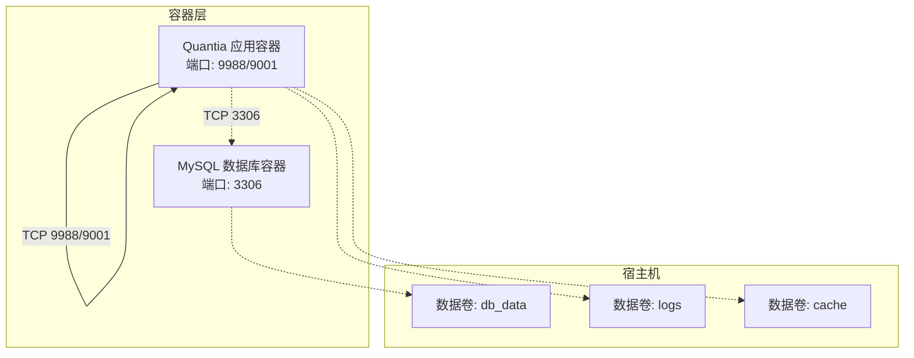
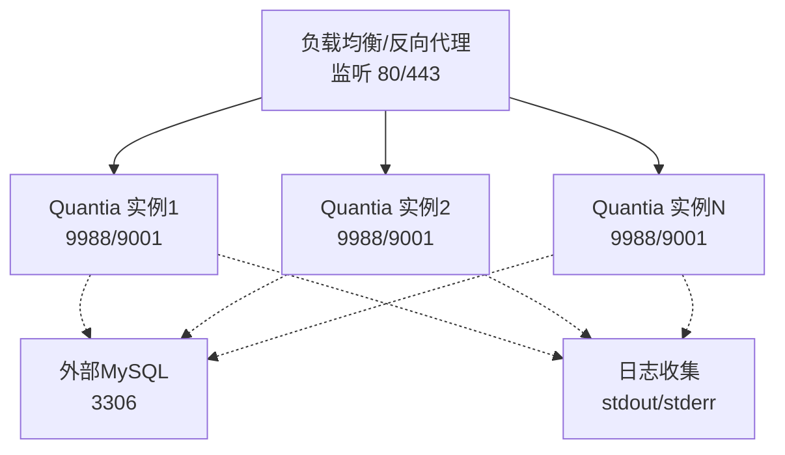
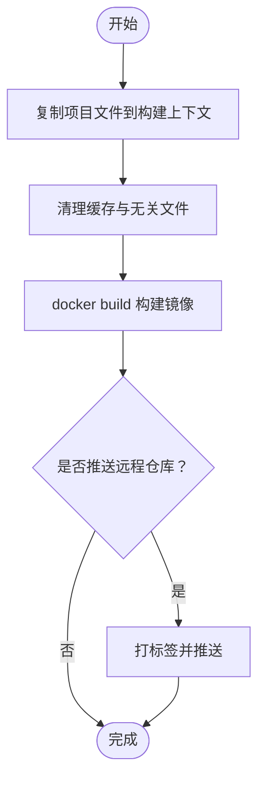
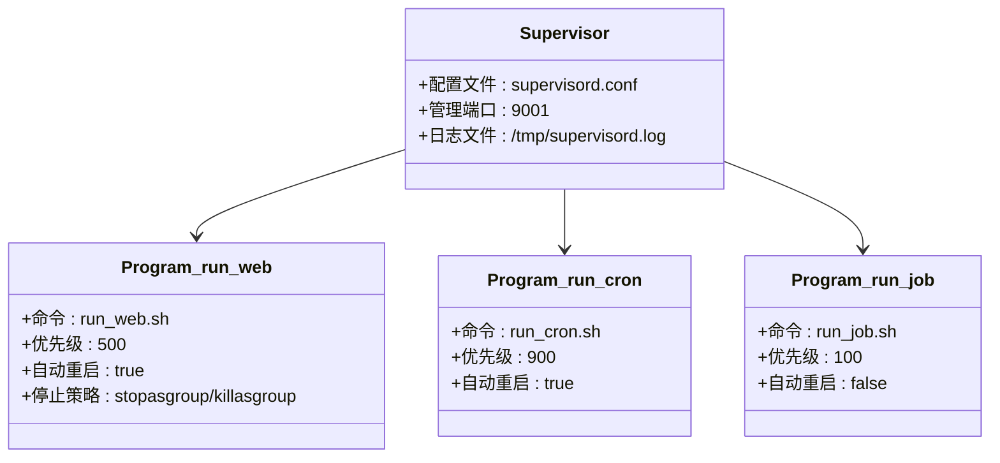
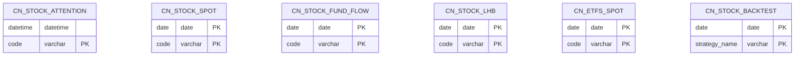
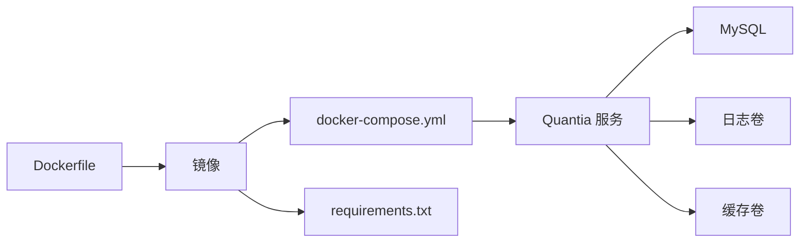
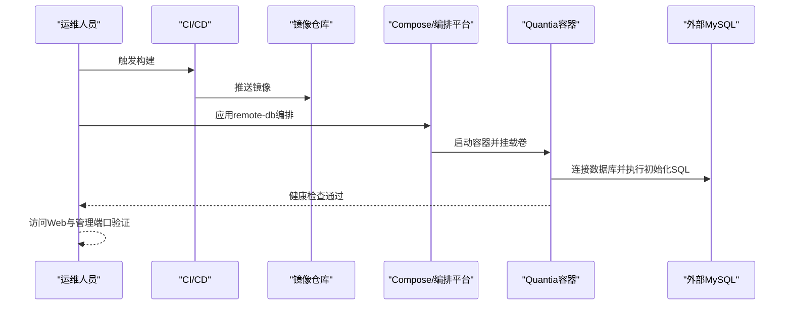

# 部署运维

<cite>
**本文引用的文件**
- [Dockerfile](file://docker/Dockerfile)
- [docker-compose.yml](file://docker/docker-compose.yml)
- [docker-compose.remote-db.yml](file://docker/docker-compose.remote-db.yml)
- [build.sh](file://docker/build.sh)
- [build.bat](file://docker/build.bat)
- [supervisord.conf](file://supervisor/supervisord.conf)
- [supervisord.conf](file://docker/stock/supervisor/supervisord.conf)
- [init_database.sql](file://docker/init_database.sql)
- [requirements.txt](file://requirements.txt)
- [eastmoney_cookie.txt](file://docker/stock/quantia/config/eastmoney_cookie.txt)
- [trade_client.json](file://docker/stock/quantia/config/trade_client.json)
</cite>

## 目录
1. [简介](#简介)
2. [项目结构](#项目结构)
3. [核心组件](#核心组件)
4. [架构总览](#架构总览)
5. [详细组件分析](#详细组件分析)
6. [依赖关系分析](#依赖关系分析)
7. [性能与容量规划](#性能与容量规划)
8. [监控与告警](#监控与告警)
9. [日志管理策略](#日志管理策略)
10. [生产部署流程](#生产部署流程)
11. [负载均衡与高可用](#负载均衡与高可用)
12. [数据备份与灾难恢复](#数据备份与灾难恢复)
13. [故障排查指南](#故障排查指南)
14. [运维最佳实践](#运维最佳实践)
15. [安全加固措施](#安全加固措施)
16. [扩展性设计](#扩展性设计)
17. [结论](#结论)

## 简介
本文件面向Quantia系统的生产部署与运维，围绕容器化、多容器编排、环境配置、监控告警、生产部署流程、负载均衡、数据备份与灾备、监控指标、日志策略、性能调优、故障排查、最佳实践、安全加固与扩展性设计等方面进行系统化说明，帮助团队在生产环境中稳定运行系统。

## 项目结构
- 容器化与编排
  - Dockerfile：定义基础镜像、环境变量、系统依赖、Python依赖、定时任务与健康检查、入口命令等。
  - docker-compose.yml：本地开发/测试环境，内置MySQL数据库容器、Quantia应用容器、数据卷与网络。
  - docker-compose.remote-db.yml：远程数据库模式，应用容器连接外部MySQL，适合生产环境。
  - build.sh/build.bat：跨平台构建脚本，负责复制项目文件、清理缓存、构建镜像、可选推送。
- 进程管理
  - supervisor/supervisord.conf：Supervisord配置，统一管理Web服务、定时任务、作业进程。
- 数据库初始化
  - init_database.sql：创建数据库与全部业务表，含每日行情、资金流、龙虎榜、ETF、策略回测等。
- 配置文件
  - eastmoney_cookie.txt：东方财富Cookie（爬虫访问），按需配置。
  - trade_client.json：交易客户端配置（示例），按需配置。
- 依赖清单
  - requirements.txt：Python依赖版本约束，便于镜像构建与一致性。

**图表来源**
- [docker-compose.yml](file://docker/docker-compose.yml#L1-L87)

**章节来源**
- [Dockerfile](file://docker/Dockerfile#L1-L153)
- [docker-compose.yml](file://docker/docker-compose.yml#L1-L87)
- [docker-compose.remote-db.yml](file://docker/docker-compose.remote-db.yml#L1-L48)

## 核心组件
- 容器镜像与运行时
  - 基于python:3.11-slim，启用国内镜像加速、安装TA-Lib C库、配置时区与语言环境。
  - 暴露Web端口9988与Supervisord管理端口9001；健康检查基于HTTP探测。
  - 入口命令为supervisord，统一管理多个子进程。
- 进程编排
  - run_web.sh：Web服务进程，优先级高，异常重启。
  - run_cron.sh：定时任务进程，周期性执行采集与分析任务。
  - run_job.sh：一次性或后台作业进程，按需触发。
- 数据库
  - 默认使用MySQL 8.0，字符集utf8mb4，支持健康检查。
  - 提供初始化SQL，自动创建所有业务表。
- 配置与持久化
  - 通过环境变量注入数据库连接参数与数据源重试策略。
  - 通过数据卷挂载日志与缓存目录，实现持久化与隔离。

**章节来源**
- [Dockerfile](file://docker/Dockerfile#L1-L153)
- [supervisord.conf](file://docker/stock/supervisor/supervisord.conf#L1-L42)
- [docker-compose.yml](file://docker/docker-compose.yml#L1-L87)
- [init_database.sql](file://docker/init_database.sql#L1-L455)

## 架构总览
下图展示生产环境典型拓扑：反向代理/负载均衡前置，后端多实例Quantia应用容器，共享外部MySQL数据库与对象存储/缓存（可选）。

[本图为概念性架构示意，不直接映射具体源码文件]

## 详细组件分析

### 容器镜像与构建
- 关键点
  - 国内镜像源与pip镜像配置，提升构建速度与稳定性。
  - 显式安装TA-Lib C库并ldconfig，避免Python绑定问题。
  - 健康检查使用curl探测Web根路径，失败即重启。
  - 入口命令为supervisord，集中管理进程。
- 构建脚本
  - build.sh/build.bat：复制项目文件、清理缓存、构建镜像、可选推送至远程仓库。
  - 支持Windows/Linux双平台，兼容排除列表与目录清理。

**图表来源**
- [build.sh](file://docker/build.sh#L1-L99)
- [build.bat](file://docker/build.bat#L1-L63)

**章节来源**
- [Dockerfile](file://docker/Dockerfile#L1-L153)
- [build.sh](file://docker/build.sh#L1-L99)
- [build.bat](file://docker/build.bat#L1-L63)

### 进程编排与Supervisord
- 进程定义
  - run_web：Web服务，优先级最高，异常退出自动重启。
  - run_cron：定时任务，周期性执行采集与分析。
  - run_job：一次性或后台作业。
- 管理接口
  - Unix Socket与TCP管理端口9001，便于远程控制与状态查看。

**图表来源**
- [supervisord.conf](file://docker/stock/supervisor/supervisord.conf#L1-L42)

**章节来源**
- [supervisord.conf](file://docker/stock/supervisord.conf#L1-L42)

### 数据库初始化与表结构
- 初始化脚本
  - 创建数据库quantiadb，设置字符集与排序规则。
  - 自动创建所有业务表，包括每日行情、资金流、龙虎榜、ETF、策略回测等。
  - 部分表由代码通过SQLAlchemy动态创建，脚本中已标注。
- 生产建议
  - 在首次部署前执行初始化脚本，确保表结构完整。
  - 对高频查询字段建立合适索引，结合业务查询优化。

**图表来源**
- [init_database.sql](file://docker/init_database.sql#L1-L455)

**章节来源**
- [init_database.sql](file://docker/init_database.sql#L1-L455)

### 环境变量与配置管理
- 数据库连接
  - QUANTIA_DB_HOST/QUANTIA_DB_PORT/QUANTIA_DB_USER/QUANTIA_DB_PASSWORD/QUANTIA_DB_DATABASE：默认值可在compose中覆盖。
- 数据源与历史数据
  - DATA_SOURCE_MAX_RETRIES、DATA_SOURCE_RETRY_INTERVAL、HIST_DATA_DEFAULT_YEARS、HIST_DATA_CACHE_EXPIRE_DAYS。
- 远程数据库模式
  - 通过docker-compose.remote-db.yml连接外部数据库，REMOTE_DB_*环境变量必填。

**章节来源**
- [docker-compose.yml](file://docker/docker-compose.yml#L41-L53)
- [docker-compose.remote-db.yml](file://docker/docker-compose.remote-db.yml#L16-L28)

### 定时任务与数据采集
- Cron计划
  - 工作日每半小时在特定时段执行小时级任务。
  - 工作日17:30执行工作日任务。
  - 每月特定时间执行月度任务。
- 任务脚本
  - run_cron.sh、run_job.sh、run_web.sh位于/data/Quantia/quantia/bin，权限已赋予可执行。

**章节来源**
- [Dockerfile](file://docker/Dockerfile#L133-L147)

## 依赖关系分析
- 组件耦合
  - Quantia应用容器依赖MySQL数据库；日志与缓存通过数据卷持久化。
  - Supervisord统一管理Web、定时任务与作业进程，降低进程漂移风险。
- 外部依赖
  - TA-Lib C库、MySQL客户端、网络请求库、数据处理库等均在镜像中预装。

**图表来源**
- [Dockerfile](file://docker/Dockerfile#L1-L153)
- [docker-compose.yml](file://docker/docker-compose.yml#L1-L87)
- [requirements.txt](file://requirements.txt#L1-L41)

**章节来源**
- [docker-compose.yml](file://docker/docker-compose.yml#L1-L87)
- [requirements.txt](file://requirements.txt#L1-L41)

## 性能与容量规划
- 容器资源
  - 建议为Quantia容器设置CPU与内存限制，避免资源争用。
  - 根据并发访问量与数据处理峰值，横向扩展应用实例数量。
- 数据库性能
  - 采用外部高性能MySQL，开启慢查询日志与连接池。
  - 对高频查询字段建立索引，定期分析表统计信息。
- 缓存与CDN
  - 对静态资源启用CDN与浏览器缓存，减少Web服务器压力。
- 网络与带宽
  - 爬虫数据源可能受限，建议配置代理与限速策略，避免被封禁。

[本节为通用性能建议，不直接分析具体源码文件]

## 监控与告警
- 健康检查
  - 容器层面：HTTP健康检查探测Web根路径，失败自动重启。
  - 数据库层面：compose内置MySQL健康检查，ping验证可用性。
- 进程监控
  - 通过Supervisord管理端口9001查看进程状态与日志。
- 指标采集
  - CPU/内存/磁盘IO/网络吞吐、请求延迟与错误率、数据库连接数与慢查询。
  - 建议集成Prometheus+Grafana或云监控平台。
- 告警策略
  - 容器重启次数阈值、进程存活状态、数据库不可用、磁盘空间告警、队列堆积等。

**章节来源**
- [Dockerfile](file://docker/Dockerfile#L149-L151)
- [docker-compose.yml](file://docker/docker-compose.yml#L23-L28)
- [docker-compose.yml](file://docker/docker-compose.yml#L66-L71)

## 日志管理策略
- 日志来源
  - Web服务与定时任务输出到标准输出/错误，由容器运行时收集。
- 收集与存储
  - 建议使用集中式日志系统（如ELK/EFK或云日志服务）收集stdout/stderr。
  - 日志轮转与保留策略：按大小/时间轮转，保留90天以上。
- 分析与告警
  - 结合日志关键词与异常堆栈，建立实时告警与报表。

**章节来源**
- [supervisord.conf](file://docker/stock/supervisord.conf#L1-L42)

## 生产部署流程
- 准备阶段
  - 准备外部MySQL，执行初始化SQL，确保表结构完整。
  - 配置环境变量（远程数据库连接、数据源参数、缓存过期策略）。
- 构建与发布
  - 使用build.sh/build.bat构建镜像，必要时推送至私有仓库。
- 编排与启动
  - 使用docker-compose.remote-db.yml启动，或在编排平台（如Kubernetes）中部署。
  - 挂载日志与缓存数据卷，确保持久化。
- 验证
  - 健康检查通过后，访问Web界面与管理端口，确认服务正常。

**图表来源**
- [docker-compose.remote-db.yml](file://docker/docker-compose.remote-db.yml#L1-L48)
- [Dockerfile](file://docker/Dockerfile#L149-L151)

**章节来源**
- [docker-compose.remote-db.yml](file://docker/docker-compose.remote-db.yml#L1-L48)
- [build.sh](file://docker/build.sh#L64-L71)
- [build.bat](file://docker/build.bat#L36-L43)

## 负载均衡与高可用
- 负载均衡
  - 使用Nginx/HAProxy/云LB，监听80/443，转发至Quantia实例。
  - 开启会话亲和或无状态设计，确保用户请求稳定路由。
- 高可用
  - 多实例部署，结合健康检查与自动扩缩容。
  - 数据库采用主从或高可用集群，配置自动故障转移。
- 灰度与蓝绿
  - 通过流量切分进行灰度发布，降低变更风险。

[本节为通用高可用建议，不直接分析具体源码文件]

## 数据备份与灾难恢复
- 备份策略
  - 数据库：全量+增量备份，周期性校验与异地存储。
  - 文件：日志与缓存目录定期打包归档。
- 恢复演练
  - 定期进行RTO/RPO演练，验证备份完整性与恢复时效。
- 灾难预案
  - 数据库故障、网络分区、节点宕机等场景的处置流程。

**章节来源**
- [docker-compose.yml](file://docker/docker-compose.yml#L74-L80)

## 故障排查指南
- 容器无法启动
  - 查看健康检查失败原因，检查Web端口占用与依赖服务连通性。
- 进程异常退出
  - 登录Supervisord管理端口9001，查看进程状态与日志。
- 数据库连接失败
  - 校验环境变量与网络连通，确认数据库账号权限与字符集配置。
- 爬虫数据缺失
  - 检查Cookie有效性与代理配置，调整重试参数与限速策略。
- 性能瓶颈
  - 分析CPU/内存/IO与数据库慢查询，优化索引与查询逻辑。

**章节来源**
- [Dockerfile](file://docker/Dockerfile#L149-L151)
- [supervisord.conf](file://docker/stock/supervisord.conf#L1-L42)
- [docker-compose.yml](file://docker/docker-compose.yml#L41-L53)

## 运维最佳实践
- 镜像与版本
  - 固定基础镜像版本，定期扫描漏洞并更新依赖。
- 配置管理
  - 使用环境变量注入敏感配置，避免硬编码；区分dev/stage/prod。
- 数据卷与备份
  - 明确数据卷生命周期，制定备份与快照策略。
- 安全基线
  - 最小权限原则、只读文件系统、禁用不必要的端口与服务。
- 变更管理
  - 引入CI/CD流水线，自动化测试与发布，保留发布记录。

[本节为通用最佳实践，不直接分析具体源码文件]

## 安全加固措施
- 网络安全
  - 仅暴露必要端口，内部服务通过专用网络互通。
  - 配置防火墙与WAF，限制来源IP与速率。
- 认证与授权
  - Supervisord管理端口建议启用认证或仅本地访问。
  - 数据库账号最小权限，定期轮换密码。
- 传输安全
  - 启用TLS终止与HTTPS，保护爬虫Cookie与交易凭证。
- 供应链安全
  - 使用可信镜像源，启用镜像签名与漏洞扫描。

**章节来源**
- [supervisord.conf](file://docker/stock/supervisord.conf#L4-L7)

## 扩展性设计
- 水平扩展
  - 多实例Quantia容器，配合负载均衡与共享存储。
- 垂直扩展
  - 提升容器CPU/内存配额，优化数据库与网络带宽。
- 异步与解耦
  - 引入消息队列（如RabbitMQ/Kafka）承载高频任务，削峰填谷。
- 微服务化
  - 将Web、定时任务、回测、交易模块拆分为独立服务，按需独立扩容。

[本节为通用扩展建议，不直接分析具体源码文件]

## 结论
通过容器化与编排、Supervisord统一进程管理、完善的数据库初始化与配置、以及标准化的监控与日志策略，Quantia系统可在生产环境中实现稳定、可观测、可扩展的运行。建议结合企业现有基础设施与合规要求，持续完善安全与灾备体系，并通过自动化与标准化流程提升交付效率与可靠性。
