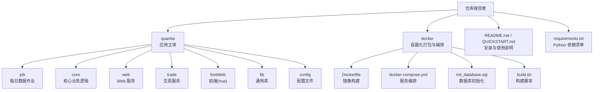
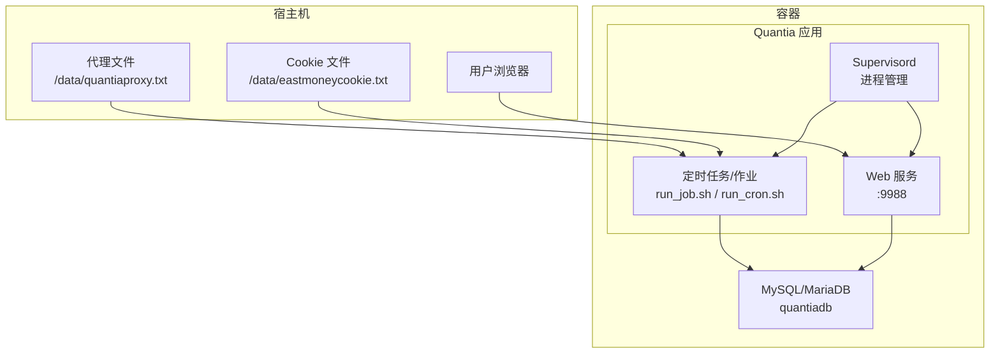
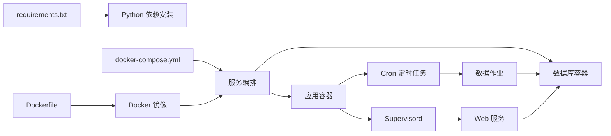

# 快速安装指南

<cite>
**本文引用的文件**   
- [README.md](file://README.md)
- [QUICKSTART.md](file://QUICKSTART.md)
- [requirements.txt](file://requirements.txt)
- [docker/Dockerfile](file://docker/Dockerfile)
- [docker/docker-compose.yml](file://docker/docker-compose.yml)
- [docker/init_database.sql](file://docker/init_database.sql)
- [docker/build.sh](file://docker/build.sh)
- [docker/stock/quantia/config/eastmoney_cookie.txt](file://docker/stock/quantia/config/eastmoney_cookie.txt)
- [docker/stock/requirements.txt](file://docker/stock/requirements.txt)
- [supervisor/supervisord.conf](file://supervisor/supervisord.conf)
</cite>

## 目录
1. [简介](#简介)
2. [项目结构](#项目结构)
3. [核心组件](#核心组件)
4. [架构总览](#架构总览)
5. [详细组件分析](#详细组件分析)
6. [依赖关系分析](#依赖关系分析)
7. [性能考虑](#性能考虑)
8. [故障排除指南](#故障排除指南)
9. [结论](#结论)
10. [附录](#附录)

## 简介
本指南面向希望快速部署 Quantia 量化投资股票选股系统的用户，提供两类安装方式的完整步骤：常规安装与 Docker 容器化安装。内容涵盖环境准备、依赖安装、数据库配置、代理设置、Cookie 配置、Web/交易服务启动与日常运维，并给出常见问题排查思路与最佳实践。

## 项目结构
- 应用主体位于 quantia 目录，包含数据作业、核心业务、Web 服务、交易服务、前端、定时任务与配置等模块。
- docker 目录提供容器化打包、编排与初始化脚本，便于一键部署。
- 顶层 README.md 与 QUICKSTART.md 提供安装与快速上手说明。

图表来源
- [README.md](file://README.md#L321-L700)
- [docker/Dockerfile](file://docker/Dockerfile#L1-L153)
- [docker/docker-compose.yml](file://docker/docker-compose.yml#L1-L87)

章节来源
- [README.md](file://README.md#L321-L700)
- [docker/Dockerfile](file://docker/Dockerfile#L1-L153)
- [docker/docker-compose.yml](file://docker/docker-compose.yml#L1-L87)

## 核心组件
- 数据采集与处理：通过 quantia/job 下的各类作业脚本，按时间维度抓取、清洗、计算指标、识别形态、执行策略与回测。
- Web 展示：基于 Tornado 的 Web 服务，提供可视化界面与回测看板。
- 交易服务：可选的自动化交易模块，支持策略执行与日志记录。
- 数据库：默认使用 MySQL/MariaDB，提供初始化 SQL 与自动建表逻辑。
- 容器化：Dockerfile、docker-compose.yml 与 init_database.sql 实现一键部署与定时任务调度。

章节来源
- [README.md](file://README.md#L321-L700)
- [docker/init_database.sql](file://docker/init_database.sql#L1-L455)

## 架构总览
系统采用“数据采集/处理 → 数据库 → Web 展示/交易”的分层架构。Docker 方案通过 compose 编排数据库与应用容器，结合 crontab 与 supervisor 实现定时任务与进程守护。

图表来源
- [docker/docker-compose.yml](file://docker/docker-compose.yml#L1-L87)
- [docker/Dockerfile](file://docker/Dockerfile#L133-L153)
- [supervisor/supervisord.conf](file://supervisor/supervisord.conf#L25-L42)

## 详细组件分析

### 常规安装方式（Windows/Linux/macOS）
- 环境准备
  - 安装 Python 3.11（建议最新版），配置国内镜像源以提升依赖安装速度。
  - 安装 MySQL/MariaDB（建议最新版）。
  - 安装 TA-Lib 共享静态库与头文件（按官方建议方式安装）。
- 依赖安装
  - 在项目根目录执行依赖安装命令，或升级依赖。
  - 如需生成依赖清单，可使用 pipreqs 工具。
- 数据库配置
  - 修改数据库连接参数（主机、用户、密码、端口、字符集等）。
- 代理设置
  - 编辑 proxy.txt，按行填写代理地址（支持带认证格式），重启系统使配置生效。
- Cookie 设置（东方财富网）
  - 通过环境变量或文件方式注入 Cookie，定期更新以保持稳定性。
- 可选：自动交易
  - 安装交易软件与验证码识别工具，配置 trade_client.json 与交易服务。
- 运行说明
  - 数据抓取与分析：通过批处理脚本或直接运行作业脚本。
  - 启动 Web 服务：运行 Web 启动脚本，浏览器访问本地服务端口。
  - 启动交易服务：按需启动交易服务。

章节来源
- [README.md](file://README.md#L327-L535)
- [QUICKSTART.md](file://QUICKSTART.md#L9-L55)

### Docker 容器化安装方式
- 准备工作
  - 确保已安装 Docker 与 docker-compose。
- 配置代理与 Cookie
  - 在宿主机创建代理文件与 Cookie 文件，映射到容器内对应路径。
- 数据库准备
  - 可使用 docker-compose 内置的 MySQL/MariaDB，或使用外部数据库。
- 构建与运行
  - 使用 docker-compose 一键启动，或单独运行容器并挂载配置。
- 系统运行
  - 容器启动后自动初始化数据库、启动 Web 服务，并按计划执行定时任务。
- 历史数据与运维
  - 通过容器内脚本执行历史数据抓取与分析，查看日志定位问题。
- 常用命令
  - 停止/清理容器与镜像，便于重新部署。

章节来源
- [README.md](file://README.md#L535-L690)
- [docker/docker-compose.yml](file://docker/docker-compose.yml#L1-L87)
- [docker/Dockerfile](file://docker/Dockerfile#L1-L153)
- [docker/build.sh](file://docker/build.sh#L1-L99)

### 数据库初始化与表结构
- 初始化脚本会创建数据库与多张核心表，涵盖每日行情、资金流、涨停原因、分红配送、龙虎榜、大宗交易、ETF、交易日历、综合/指标/策略/回测等表。
- 部分表结构由代码自动创建，确保字段与列数正确。

章节来源
- [docker/init_database.sql](file://docker/init_database.sql#L1-L455)

### 进程与定时任务（Supervisord + Cron）
- Supervisor 管理 Web、作业与定时任务进程，具备进程优先级与自动重启策略。
- 容器内配置 crontab，按小时、工作日与月度周期执行不同任务，保障数据采集与分析的连续性。

章节来源
- [supervisor/supervisord.conf](file://supervisor/supervisord.conf#L1-L42)
- [docker/Dockerfile](file://docker/Dockerfile#L133-L147)

## 依赖关系分析
- Python 依赖集中在 requirements.txt，包含数据处理、Web 框架、数据库、网络请求、解析、JS 引擎、加密与回测等模块。
- Dockerfile 中对 apt 源与 pip 镜像进行了国内化配置，提升构建效率。
- 容器内通过 supervisor 与 cron 协同，实现服务与任务的统一管理。

图表来源
- [requirements.txt](file://requirements.txt#L1-L41)
- [docker/Dockerfile](file://docker/Dockerfile#L1-L153)
- [docker/docker-compose.yml](file://docker/docker-compose.yml#L1-L87)

章节来源
- [requirements.txt](file://requirements.txt#L1-L41)
- [docker/Dockerfile](file://docker/Dockerfile#L1-L153)
- [docker/docker-compose.yml](file://docker/docker-compose.yml#L1-L87)

## 性能考虑
- 多数据源自动切换与增量缓存：优先使用东方财富，失败自动切换至腾讯/新浪，减少失败重试成本。
- 历史数据默认缓存策略：可通过环境变量调整缓存过期天数与历史年数，平衡数据完整性与性能。
- 容器内定时任务：按交易日与时段合理安排任务，避免高峰期资源争用。

章节来源
- [README.md](file://README.md#L294-L320)
- [docker/Dockerfile](file://docker/Dockerfile#L28-L30)

## 故障排除指南
- 数据获取失败
  - 检查网络连通性与代理配置，确认代理文件格式正确。
  - 若仍失败，尝试更换代理或等待重试间隔后重试。
- 数据库连接失败
  - 确认数据库服务运行状态与连接参数，使用命令行验证连接。
- 历史数据未更新
  - 首次运行需全量抓取，后续为增量更新；如需重建缓存，清空缓存目录后重新抓取。
- Cookie 失效
  - 东方财富 Cookie 通常几天到几周后过期，需重新获取并更新。
- Docker 容器无法访问 Web
  - 检查容器健康检查与端口映射，确认 Web 服务监听与防火墙设置。

章节来源
- [QUICKSTART.md](file://QUICKSTART.md#L169-L195)
- [README.md](file://README.md#L435-L462)
- [docker/Dockerfile](file://docker/Dockerfile#L149-L151)

## 结论
通过本指南，您可以根据自身需求选择常规安装或 Docker 容器化部署。Docker 方案简化了环境与依赖管理，适合快速上线；常规安装则便于本地调试与定制。建议在生产环境中配合代理与 Cookie 策略，确保数据获取的稳定性与持续性。

## 附录
- 常用命令与路径
  - 依赖安装与升级：参考 requirements.txt 与 pipreqs。
  - Web 启动：run_web.bat（Windows）或 run_web.sh（Linux/macOS）。
  - 数据作业：execute_daily_job.py、fetch_data_job.py 等。
  - Docker：docker-compose up -d 或单独运行容器并挂载配置。
- 配置文件位置
  - 代理：quantia/config/proxy.txt（常规）或 /data/quantiaproxy.txt（Docker 映射）。
  - Cookie：quantia/config/eastmoney_cookie.txt（常规）或 /data/eastmoneycookie.txt（Docker 映射）。
  - 数据库：quantia/lib/database.py（常规）或通过环境变量覆盖（Docker）。

章节来源
- [README.md](file://README.md#L522-L535)
- [docker/docker-compose.yml](file://docker/docker-compose.yml#L41-L60)
- [docker/stock/quantia/config/eastmoney_cookie.txt](file://docker/stock/quantia/config/eastmoney_cookie.txt#L1-L2)
