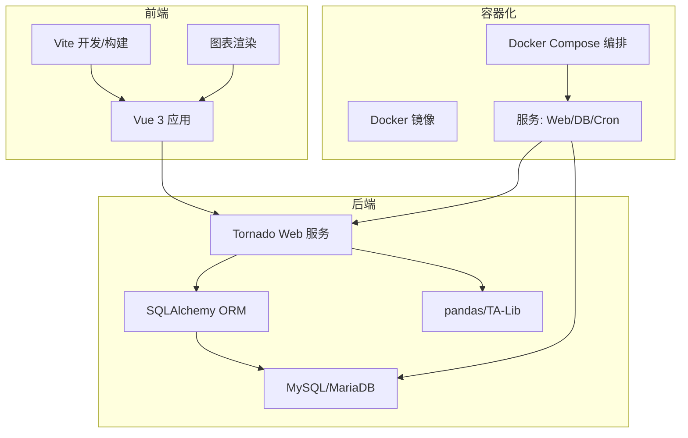
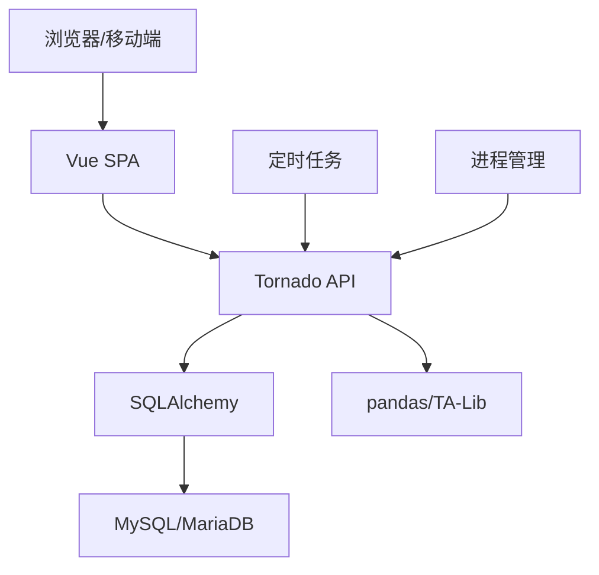
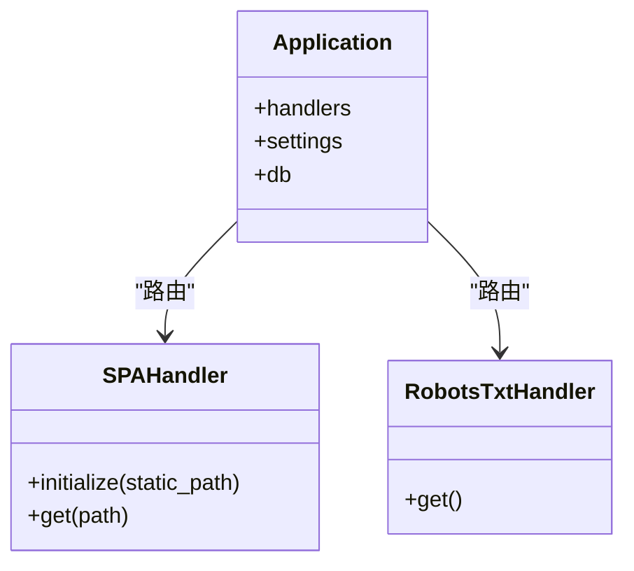
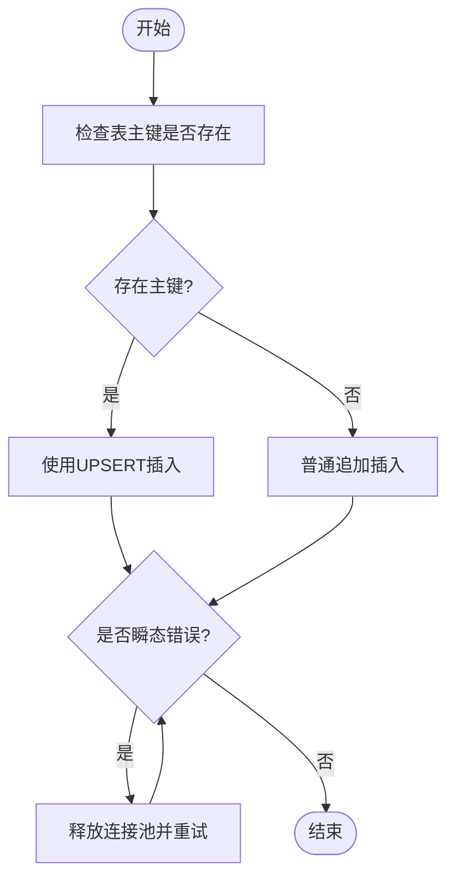
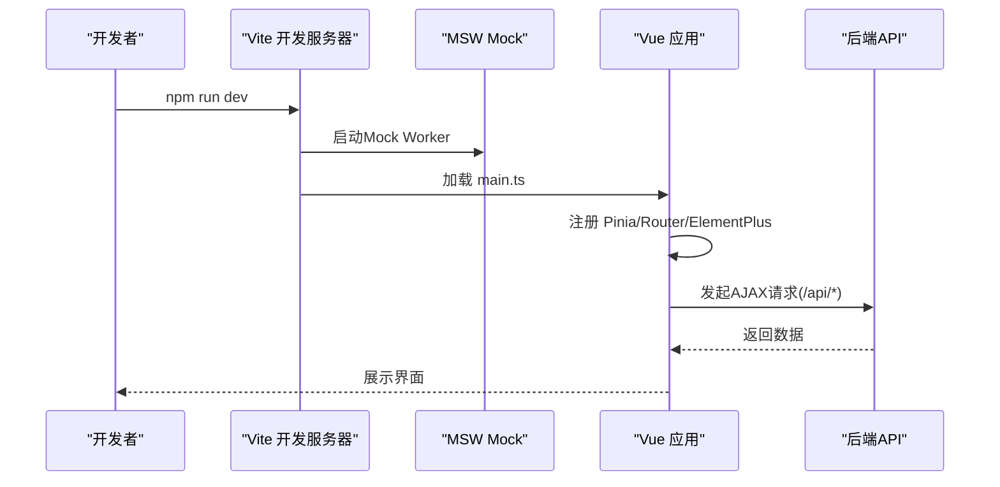
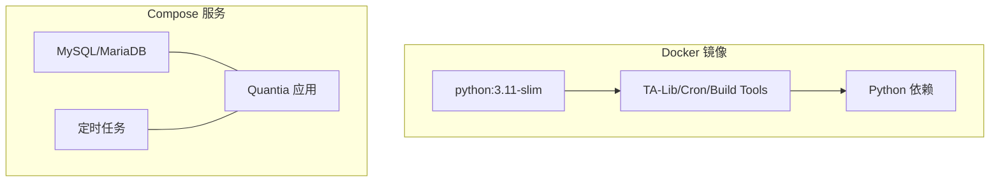
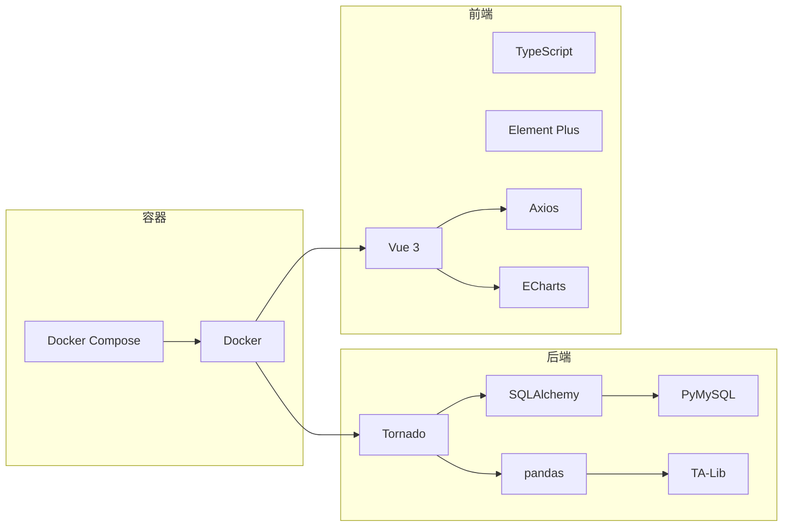

# 技术栈架构

<cite>
**本文档引用的文件**
- [README.md](file://README.md)
- [requirements.txt](file://requirements.txt)
- [Dockerfile](file://docker/Dockerfile)
- [docker-compose.yml](file://docker/docker-compose.yml)
- [init_database.sql](file://docker/init_database.sql)
- [package.json](file://quantia/fontWeb/package.json)
- [vite.config.ts](file://quantia/fontWeb/vite.config.ts)
- [main.ts](file://quantia/fontWeb/src/main.ts)
- [tsconfig.json](file://quantia/fontWeb/tsconfig.json)
- [web_service.py](file://quantia/web/web_service.py)
- [database.py](file://quantia/lib/database.py)
- [torndb.py](file://quantia/lib/torndb.py)
</cite>

## 目录
1. [简介](#简介)
2. [项目结构](#项目结构)
3. [核心组件](#核心组件)
4. [架构总览](#架构总览)
5. [详细组件分析](#详细组件分析)
6. [依赖关系分析](#依赖关系分析)
7. [性能考虑](#性能考虑)
8. [故障排查指南](#故障排查指南)
9. [结论](#结论)

## 简介
Quantia（Quantia）量化投资股票选股系统采用“后端Python + 前端Vue.js + 数据库MySQL/MariaDB + 容器化Docker”的技术栈架构。后端基于Tornado提供高性能HTTP服务，使用SQLAlchemy进行数据库抽象与ORM操作，结合pandas/TA-Lib进行数据处理与技术指标计算；前端采用Vue 3 + TypeScript + Element Plus构建交互式Web界面，通过Vite进行构建与开发；数据库层使用MySQL/MariaDB存储多维度股票数据与分析结果；容器化方面通过Docker与Docker Compose实现服务编排与部署。

## 项目结构
系统采用前后端分离与模块化组织方式：
- 后端核心位于 quantia/web 与 quantia/lib，提供Tornado Web服务、数据库连接与工具库
- 数据采集与策略逻辑位于 quantia/core，包含爬虫、指标计算、K线形态识别、策略模块等
- 前端位于 quantia/fontWeb，使用Vue 3 + TypeScript + Element Plus
- 容器化配置位于 docker 目录，包含Dockerfile、docker-compose.yml与初始化SQL脚本
- 任务调度与定时作业位于 docker/cron 与 quantia/bin

**图表来源**
- [web_service.py](file://quantia/web/web_service.py#L53-L97)
- [database.py](file://quantia/lib/database.py#L60-L71)
- [Dockerfile](file://docker/Dockerfile#L150-L153)
- [docker-compose.yml](file://docker/docker-compose.yml#L4-L87)

**章节来源**
- [README.md](file://README.md#L321-L326)
- [docker-compose.yml](file://docker/docker-compose.yml#L4-L87)

## 核心组件
- 后端Web框架：Tornado，提供异步非阻塞I/O与高并发HTTP服务
- 数据库抽象：SQLAlchemy，统一数据库访问与ORM映射
- 数据处理：pandas + TA-Lib，支持高效技术指标计算与K线分析
- 前端框架：Vue 3 + TypeScript + Element Plus，构建响应式可视化界面
- 构建工具：Vite，提供快速开发与生产构建
- 容器化：Docker + Docker Compose，实现服务隔离与编排
- 任务调度：cron + supervisor，定时执行数据抓取与分析任务

**章节来源**
- [requirements.txt](file://requirements.txt#L4-L41)
- [package.json](file://quantia/fontWeb/package.json#L15-L38)
- [Dockerfile](file://docker/Dockerfile#L87-L110)

## 架构总览
系统采用三层架构：前端层（Vue SPA）、后端层（Tornado API + SQLAlchemy）、数据层（MySQL/MariaDB）。前端通过AJAX调用后端API，后端通过SQLAlchemy访问数据库，数据通过爬虫与指标计算模块生成并持久化。

**图表来源**
- [web_service.py](file://quantia/web/web_service.py#L56-L88)
- [database.py](file://quantia/lib/database.py#L60-L71)
- [Dockerfile](file://docker/Dockerfile#L134-L147)

## 详细组件分析

### 后端Web服务（Tornado）
- 路由与中间件：定义API路由、静态资源处理与SPA回退
- 数据库连接：通过torndb.Connection与SQLAlchemy Engine建立连接池
- 日志与安全：统一日志配置、XSRF关闭、Cookie加密

**图表来源**
- [web_service.py](file://quantia/web/web_service.py#L53-L97)
- [web_service.py](file://quantia/web/web_service.py#L102-L125)

**章节来源**
- [web_service.py](file://quantia/web/web_service.py#L53-L143)

### 数据库访问层（SQLAlchemy + PyMySQL）
- 连接池配置：最小连接数、最大溢出、回收时间、预检查
- 插入策略：基于主键的UPSERT（ON DUPLICATE KEY UPDATE）避免重复
- 错误处理：可重试瞬态错误（死锁、锁超时、连接异常等）

**图表来源**
- [database.py](file://quantia/lib/database.py#L141-L184)

**章节来源**
- [database.py](file://quantia/lib/database.py#L60-L203)

### 数据库连接适配（torndb）
- 基于PyMySQL的轻量DB-API封装，提供查询、执行、游标迭代等能力
- 自动重连、空闲超时检测、异常处理

**章节来源**
- [torndb.py](file://quantia/lib/torndb.py#L47-L250)

### 前端技术栈（Vue 3 + TypeScript + Element Plus）
- 应用入口：注册Pinia状态管理、路由、Element Plus国际化
- 构建配置：Vite别名@指向src、开发代理到后端9988端口
- Mock支持：开发模式下启用MSW模拟请求

**图表来源**
- [main.ts](file://quantia/fontWeb/src/main.ts#L26-L39)
- [vite.config.ts](file://quantia/fontWeb/vite.config.ts#L13-L26)

**章节来源**
- [package.json](file://quantia/fontWeb/package.json#L1-L44)
- [vite.config.ts](file://quantia/fontWeb/vite.config.ts#L1-L32)
- [main.ts](file://quantia/fontWeb/src/main.ts#L1-L40)
- [tsconfig.json](file://quantia/fontWeb/tsconfig.json#L1-L26)

### 容器化与编排（Docker + Docker Compose）
- 基础镜像：python:3.11-slim，配置国内镜像源与时区
- 系统依赖：安装TA-Lib C库、cron、gcc/g++等
- 服务编排：MySQL/MariaDB + Quantia应用 + 卷挂载
- 健康检查：Web服务健康检查与数据库健康检查

**图表来源**
- [Dockerfile](file://docker/Dockerfile#L1-L153)
- [docker-compose.yml](file://docker/docker-compose.yml#L4-L87)

**章节来源**
- [Dockerfile](file://docker/Dockerfile#L1-L153)
- [docker-compose.yml](file://docker/docker-compose.yml#L1-L87)

### 数据库初始化与表结构
- 初始化脚本：创建数据库与20+张核心数据表，涵盖每日行情、资金流、筹码分布、K线形态、策略回测等
- 关键表：cn_stock_spot、cn_stock_fund_flow、cn_stock_selection、cn_stock_backtest等
- 自动建表：通过SQLAlchemy在表不存在时自动创建并设置主键/索引

**章节来源**
- [init_database.sql](file://docker/init_database.sql#L1-L455)

## 依赖关系分析
- 后端依赖：Tornado提供Web框架，SQLAlchemy/PyMySQL提供数据库抽象，pandas/TA-Lib提供数据处理与指标计算
- 前端依赖：Vue 3 + TypeScript + Element Plus + Axios + ECharts + dayjs
- 容器依赖：Docker镜像包含Python运行时、TA-Lib C库、系统构建工具与cron

**图表来源**
- [requirements.txt](file://requirements.txt#L4-L41)
- [package.json](file://quantia/fontWeb/package.json#L15-L38)
- [Dockerfile](file://docker/Dockerfile#L87-L110)

**章节来源**
- [requirements.txt](file://requirements.txt#L1-L41)
- [package.json](file://quantia/fontWeb/package.json#L1-L44)

## 性能考虑
- 并发与I/O：Tornado异步非阻塞模型适合高并发请求
- 数据库连接池：合理配置pool_size与max_overflow，减少连接创建开销
- UPSERT策略：避免重复主键冲突导致的死锁与重试
- 指标计算：pandas向量化与TA-Lib C实现提升计算效率
- 前端构建：Vite快速冷启动与热更新，生产构建优化资源体积

## 故障排查指南
- Web服务日志：查看stock_web.log定位路由与数据库连接问题
- 数据库连接：检查瞬态错误（1205/1213/Deadlock等）并启用重试
- 容器健康：使用healthcheck验证Web与数据库可用性
- 前端代理：确认Vite代理目标与端口正确，避免跨域问题

**章节来源**
- [web_service.py](file://quantia/web/web_service.py#L127-L143)
- [database.py](file://quantia/lib/database.py#L109-L117)
- [Dockerfile](file://docker/Dockerfile#L149-L151)
- [vite.config.ts](file://quantia/fontWeb/vite.config.ts#L15-L25)

## 结论
Quantia系统通过Tornado + SQLAlchemy + Vue 3 + TypeScript + Element Plus + MySQL/MariaDB + Docker的组合，实现了高性能、可扩展、易维护的量化选股平台。后端专注于数据处理与API服务，前端专注用户体验与可视化，容器化保障了部署一致性与可移植性。该架构既满足日常回测与策略验证需求，也为未来扩展更多数据源与策略提供了清晰的技术路径。
